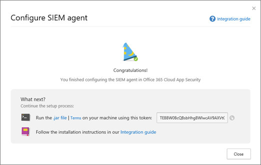

# <a name="integrate-your-siem-server-with-office-365-cloud-app-security"></a>Integrar seu servidor SIEM ao Office 365 Cloud App Security
  
|Avaliação * *\>**|Planejamento * *\>**|Implantação * *\>**|Utilização * * *|
|:-----|:-----|:-----|:-----|
|[Comece a avaliar](office-365-cas-overview.md) <br/> |[Começar a planejar](get-ready-for-office-365-cas.md) <br/> |Você está aqui!  <br/> [Próxima etapa](utilization-activities-for-ocas.md) <br/> |[Iniciar a utilização](utilization-activities-for-ocas.md) <br/> |
   
## <a name="overview-and-prerequisites"></a>Visão geral e pré-requisitos

É possível integrar a [Segurança de aplicativo de nuvem do Office 365](get-ready-for-office-365-cas.md) com sua segurança eventos e informações management (SIEM) server para habilitar o monitoramento centralizado de alertas. Isso é especialmente vantajoso para organizações que estejam usando os serviços em nuvem e aplicativos do servidor local. Integrando com um servidor SIEM permite que sua equipe de segurança proteger melhor seus aplicativos do Office 365 enquanto mantém o seu fluxo de trabalho de segurança usual, automatizando determinados procedimentos de segurança e correlacionando entre baseado em nuvem e eventos no local.  
  
Ao integrar seu servidor SIEM primeiro com segurança de aplicativo de nuvem do Office 365, alertas dos últimos dois dias são encaminhados para o servidor SIEM, bem como todos os alertas do então em (com base em quaisquer filtros que você selecionar). Além disso, se você desativar esse recurso por um longo período, quando você ativá-lo novamente, ele encaminhará últimos dois dias de alertas e, em seguida, todos os alertas a partir.

### <a name="siem-integration-architecture"></a>Arquitetura de integração de SIEM

Um agente SIEM é configurado na rede da sua organização. Quando implantada e configurada, o agente SIEM extrai os tipos de dados que foram configurados (alertas) usando o Office 365 nuvem App segurança APIs por REST. O tráfego é enviado por um canal HTTPS criptografado na porta 443.
  
Quando um agente SIEM recupera dados de segurança de aplicativo de nuvem do Office 365, ele envia as mensagens de Syslog para seu servidor SIEM local, usando as configurações de rede que são fornecidas durante a instalação (TCP ou UDP com uma porta personalizada).


### <a name="supported-siem-servers"></a>Servidores SIEM suportados

Atualmente, a segurança de aplicativo de nuvem do Office 365 suporta os seguintes servidores SIEM:
- Foco Micro ArcSight
- CEF genérico

### <a name="prerequisites"></a>Pré-requisitos

- Você deve ser um administrador global ou administrador de segurança para executar as tarefas descritas neste artigo. Consulte [Permissions in a segurança do Office 365 &amp; Centro de conformidade](permissions-in-the-security-and-compliance-center.md)

- Você deve ter a [segurança de aplicativo de nuvem do Office 365 habilitada](turn-on-office-365-cas.md) para sua organização.

- [Log de auditoria](turn-audit-log-search-on-or-off.md) deve ser ativado para o Office 365

- Você deve ter um servidor standard que atende aos seguintes requisitos para configurar a integração do servidor SIEM:
    - Sistema operacional: Windows ou Linux (pode ser uma máquina virtual)
    - CPU: 2
    - Espaço em disco: 20 GB
    - RAM: 2 GB
    - [Oracle Java 8](http://www.oracle.com/technetwork/java/javase/downloads/index.html) instalado
    - Firewall configurado conforme descrito em [requisitos de rede](https://docs.microsoft.com/cloud-app-security/network-requirements)

- Você deve ter os detalhes sobre o seu **host remoto syslog** e o **número da porta Syslot**. Um administrador da rede ou o administrador de segurança deve ser capaz de ajudar você a encontrar essas informações. 

- Você deve concordar com [os termos de licença de software](https://go.microsoft.com/fwlink/?linkid=862491) baixar o [arquivo JAR](https://go.microsoft.com/fwlink/?linkid=838596) será necessário para integrar o seu servidor SIEM.
 
## <a name="step-1-set-it-up-a-siem-agent-in-office-365-cloud-app-security"></a>Etapa 1: Montá-lo um agente SIEM na segurança de aplicativo de nuvem do Office 365

1. Vá para o portal de segurança de aplicativo de nuvem ([https://portal.cloudappsecurity.com](https://portal.cloudappsecurity.com)) e entrar.
  
2. Clique em **configurações** \> **extensões de segurança**e escolha agentes SIEM.<br/>


3. Escolha **Adicionar SIEM agente**.<br/>
    
4. Clique em **Iniciar o assistente**.<br/> 
    
5. Na etapa **Geral** , especifique um nome e **Selecione o seu formato de SIEM** e defina qualquer **Configurações avançadas** que são relevantes para esse formato. Escolha **Avançar**.<br/>
    
6. Na etapa **Syslog remoto** , especifique o endereço IP ou o nome de host do **host remoto syslog** e o **número da porta Syslog**. Selecione TCP ou UDP como o protocolo de Syslog remoto. (Você pode trabalhar com o administrador de segurança ou o administrador da rede para obter esses detalhes se você não tivê-los). Escolha **Avançar**.<br/>
  
7. Na etapa **Tipos de dados** , siga um destes procedimentos e clique em **Avançar**:
    - Mantenha a configuração padrão de **Todos os alertas**<br/>OU
    - Clique em **todos os alertas**e escolha **filtros específicos**. Defina filtros para selecionar os tipos de alertas que você deseja enviar ao seu servidor SIEM.<br/>
  
8. Na tela Parabéns, copie o token e salvá-lo para uso futuro.<br/> 

> [!IMPORTANT]
> Neste ponto, você configurou um agente SIEM na segurança de aplicativo de nuvem do Office 365, mas sua integração do servidor SIEM ainda não estiver concluída. Vá para a próxima etapa para continuar sua integração do servidor SIEM.

Depois que você clique em Fechar e sair do assistente, na tela de extensões de segurança, você pode ver o agente SIEM adicionada na tabela. Ela mostrará o status **criado** até que ele esteja conectado posteriormente.


    
## <a name="step-2-download-a-jar-file-and-run-it-on-your-siem-server"></a>Etapa 2: Baixar um arquivo JAR e executá-lo em seu servidor SIEM

1. Baixe o [Microsoft Cloud App segurança SIEM Agent](https://go.microsoft.com/fwlink/?linkid=838596) e descompacte a pasta. (Você deve concordar com [os termos de licença de software](https://go.microsoft.com/fwlink/?linkid=862491) para continuar.) 
    
2. Extraia o arquivo. jar da pasta compactada e executá-lo em seu servidor SIEM.
    
3. Depois de executar o arquivo, execute o seguinte: comando:<br/>
  ```
  java -jar mcas-siemagent-0.87.20-signed.jar [--logsDirectory DIRNAME] [--proxy ADDRESS[:PORT]] --token TOKEN
  ```
### <a name="important-notes"></a>Observações importantes

- O nome do arquivo pode diferir, dependendo da versão do agente SIEM. 

- Recomendamos que você execute o arquivo JAR no seu servidor SIEM durante a instalação do servidor.

    - **Windows**: executar como uma tarefa agendada, certificando-se de configurar a tarefa seja **executada se o usuário está conectado ou não** e desmarque a opção de **interromper a tarefa caso ela seja executada superiores** .

    - **Linux**: adicionar o comando de execução com um **&** para o `rc.local` arquivo. <br/>Exemplo:<br/> 
    ```
    java -jar mcas-siemagent-0.87.20-signed.jar [--logsDirectory DIRNAME] [--proxy ADDRESS[:PORT]] --token TOKEN &
    ```

- Parâmetros entre colchetes [] são opcionais e devem ser usados somente se relevantes. Use as seguintes variáveis:

    - **DIRNAME** é o caminho até o diretório que você deseja usar para logs de depuração do agente local.

    - **Endereço [: porta]** é o endereço do servidor proxy e a porta que o servidor usa para se conectar à Internet.

    - **TOKEN** é o token de agente SIEM copiados no primeiro procedimento.

    - Para obter ajuda, digite `-h`. 
  
## <a name="step-3-validate-that-the-siem-agent-is-working"></a>Etapa 3: Validar se o agente SIEM está funcionando

1. Verifique se o status do agente SIEM no portal de segurança de aplicativo de nuvem do Office 365 não é exibido como **erro de Conexão** ou **desconectada** e que não há nenhuma notificação de agente.<br/>Por exemplo, aqui podemos ver que o servidor SIEM está conectado:<br/><br/>E aqui, podemos ver que o servidor SIEM é desconectado:<br/> 
  
2. No seu servidor Syslog/SIEM, verifique se que você vê que os alertas foram recebidos de segurança de aplicativo de nuvem do Office 365.
  
## <a name="what-the-logfiles-look-like"></a>Aparência dos arquivos de log

Aqui está um exemplo de arquivo de log de alertas que pode ser enviado para um servidor SIEM:

```
2017-07-15T20:42:30.531Z CEF:0|MCAS|SIEM_Agent|0.102.17|ALERT_CABINET_EVENT_MATCH_AUDIT|myPolicy|3|externalId=596a7e360c204203a335a3fb start=1500151350531 end=1500151350531 msg=Activity policy ''myPolicy'' was triggered by ''admin@box-contoso.com'' suser=admin@box-contoso.com destinationServiceName=Box cn1Label=riskScore cn1= cs1Label=portalURL cs1=https://cloud-app-security.com/#/alerts/596a7e360c204203a335a3fb cs2Label=uniqueServiceAppIds cs2=APPID_BOX cs3Label=relatedAudits cs3=1500151288183_acc891bf-33e1-424b-a021-0d4370789660 cs4Label=policyIDs cs4=59f0ab82f797fa0681e9b1c7

2017-07-16T09:36:26.550Z CEF:0|MCAS|SIEM_Agent|0.102.17|ALERT_CABINET_EVENT_MATCH_AUDIT|test-activity-policy|3|externalId=596b339b0c204203a33a51ae start=1500197786550 end=1500197786550 msg=Activity policy ''test-activity-policy'' was triggered by ''user@contoso.com'' suser=user@contoso.com destinationServiceName=Salesforce cn1Label=riskScore cn1= cs1Label=portalURL cs1=https://cloud-app-security.com/#/alerts/596b339b0c204203a33a51ae cs2Label=uniqueServiceAppIds cs2=APPID_SALESFORCE cs3Label=relatedAudits cs3=1500197720691_b7f6317c-b8de-476a-bc8f-dfa570e00349 cs4Label=policyIDs cs4=

2017-07-16T09:17:03.361Z CEF:0|MCAS|SIEM_Agent|0.102.17|ALERT_CABINET_EVENT_MATCH_AUDIT|test-activity-policy3|3|externalId=596b2fd70c204203a33a3eeb start=1500196623361 end=1500196623361 msg=Activity policy ''test-activity-policy3'' was triggered by ''admin@contoso.com'' suser=admin@contoso.com destinationServiceName=Office 365 cn1Label=riskScore cn1= cs1Label=portalURL cs1=https://cloud-app-security.com/#/alerts/596b2fd70c204203a33a3eeb cs2Label=uniqueServiceAppIds cs2=APPID_O365 cs3Label=relatedAudits cs3=1500196549157_a0e01f8a-e29a-43ae-8599-783c1c11597d cs4Label=policyIDs cs4=

2017-07-16T09:17:15.426Z CEF:0|MCAS|SIEM_Agent|0.102.17|ALERT_CABINET_EVENT_MATCH_AUDIT|test-activity-policy|3|externalId=596b2fd70c204203a33a3eec start=1500196635426 end=1500196635426 msg=Activity policy ''test-activity-policy'' was triggered by ''admin@contoso.com'' suser=admin@contoso.com destinationServiceName=Microsoft Office 365 admin center cn1Label=riskScore cn1= cs1Label=portalURL cs1=https://cloud-app-security.com/#/alerts/596b2fd70c204203a33a3eec cs2Label=uniqueServiceAppIds cs2=APPID_O365_PORTAL cs3Label=relatedAudits cs3=1500196557398_3e102b20-d9fa-4f66-b550-8c7a403bb4d8 cs4Label=policyIDs cs4=59f0ab35f797fa9811e9b1c7

2017-07-16T09:17:46.290Z CEF:0|MCAS|SIEM_Agent|0.102.17|ALERT_CABINET_EVENT_MATCH_AUDIT|test-activity-policy4|3|externalId=596b30200c204203a33a4765 start=1500196666290 end=1500196666290 msg=Activity policy ''test-activity-policy4'' was triggered by ''admin@contoso.com'' suser=admin@contoso.com destinationServiceName=Microsoft Exchange Online cn1Label=riskScore cn1= cs1Label=portalURL cs1=https://cloud-app-security.com/#/alerts/596b30200c204203a33a4765 cs2Label=uniqueServiceAppIds cs2=APPID_OUTLOOK cs3Label=relatedAudits cs3=1500196587034_a8673602-7e95-46d6-a1fe-c156c4709c5d cs4Label=policyIDs cs4=

2017-07-16T09:41:04.369Z CEF:0|MCAS|SIEM_Agent|0.102.17|ALERT_CABINET_EVENT_MATCH_AUDIT|test-activity-policy2|3|externalId=596b34b10c204203a33a5240 start=1500198064369 end=1500198064369 msg=Activity policy ''test-activity-policy2'' was triggered by ''user2@test15-adallom.com'' suser=user2@test15-adallom.com destinationServiceName=Google cn1Label=riskScore cn1= cs1Label=portalURL cs1=https://cloud-app-security.com/#/alerts/596b34b10c204203a33a5240 cs2Label=uniqueServiceAppIds cs2=APPID_33626 cs3Label=relatedAudits cs3=1500197996117_fd71f265-1e46-4f04-b372-2e32ec874cd3 cs4Label=policyIDs cs4=
```

E aqui está outro exemplo, desta vez, no formato CEF:


|Nome do campo CEF  | Descrição  |
|---------|---------|
|Iniciar     | carimbo de hora de alerta        |
|end     | carimbo de hora de alerta        |
|RT     | carimbo de hora de alerta        |
|msg     | Descrição de alerta, conforme mostrado no portal de segurança de aplicativo de nuvem do Office 365        |
|suser     | usuário de assunto de alerta        |
|destinationServiceName     | alerta provenientes de aplicativo, como o Office 365, SharePoint ou OneDrive        |
|csLabel     | Varia (rótulos tem significados diferentes). Normalmente, os rótulos são auto-explicativos, como targetObjects.        |
|cs     | Informações correspondendo a um rótulo (por exemplo, o usuário de destino de um alerta conforme o exemplo de rótulo)        |

## <a name="additional-tasks-as-needed"></a>Tarefas adicionais (conforme necessário)

Depois que você configurou seu servidor SIEM e integrou com segurança de aplicativo de nuvem do Office 365, talvez seja necessário regenerar um token, um agente SIEM de editar ou excluir um operador SIEM. As seções a seguir descrevem como executar essas tarefas.

### <a name="regenerate-a-token"></a>Regenere um token

Se você perder o token de seu, você poderá regenerar uma. 

1. No portal de segurança de aplicativo de nuvem do Office 365 ([https://portal.cloudappsecurity.com](https://portal.cloudappsecurity.com)), escolha **configurações** > **extensões de segurança**.

2. Na tabela, localize a linha para o agente de SIEM. 

3. Clique nas reticências e escolha **regenerar token**.<br/>
  
### <a name="edit-a-siem-agent"></a>Editar um agente SIEM

1. No portal de segurança de aplicativo de nuvem do Office 365 ([https://portal.cloudappsecurity.com](https://portal.cloudappsecurity.com)), escolha **configurações** > **extensões de segurança**.

2. Localize a linha para o agente de SIEM. 

3. Clique nas reticências e escolha **Editar**. (Se você editar o agente SIEM, você não precisará executar novamente o arquivo. jar; ele atualiza automaticamente.)<br/>
  
### <a name="delete-a-siem-agent"></a>Excluir um operador SIEM

1. No portal de segurança de aplicativo de nuvem do Office 365 ([https://portal.cloudappsecurity.com](https://portal.cloudappsecurity.com)), escolha **configurações** > **extensões de segurança**.

2. Localize a linha para o agente de SIEM. 

3. Clique nas reticências e escolha **Excluir**.<br/>

  
## <a name="next-steps"></a>Próximas etapas

- [Atividades de utilização após a implantação do Office 365 Cloud App Security](utilization-activities-for-ocas.md)
    
- [Revise e agir em alertas](review-office-365-cas-alerts.md)
    
- [Seus endereços IP para simplificar o gerenciamento de grupo](group-your-ip-addresses-in-ocas.md)
    

