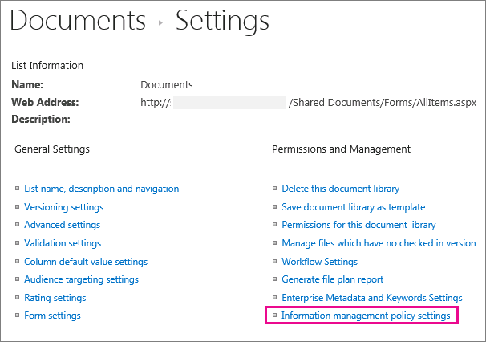

# Introdução às políticas de gerenciamento de informaçõesIntroduction to information management policies

Uma política de gerenciamento de informações é um conjunto de regras aplicáveis a um tipo de conteúdo.An information management policy is a set of rules for a type of content. As políticas de gerenciamento de informações permitem que as organizações controlem e rastreiem o tempo em que um documento é retido ou quais ações os usuários podem realizar com esse conteúdo, dentre outras coisas.Information management policies enable organizations to control and track things like how long content is retained or what actions users can take with that content. Essas políticas podem ajudar as organizações a cumprir regulamentações legais ou governamentais, ou podem simplesmente impor processos comerciais internos.Information management policies can help organizations comply with legal or governmental regulations, or they can simply enforce internal business processes. 
  
Por exemplo, uma organização que deve seguir normas governamentais que exijam que eles demonstrem "controles adequados" de seus demonstrativos financeiros podem criar uma ou mais políticas de gerenciamento de informações que auditam ações específicas na criação e processo de aprovação para todos os documentos relacionados a arquivamentos financeiros.For example, an organization that must follow government regulations requiring that they demonstrate "adequate controls" of their financial statements might create one or more information management policies that audit specific actions in the authoring and approval process for all documents related to financial filings.
  
Para obter informações sobre como fazer, confira [criar e aplicar políticas de gerenciamento de informações](create-info-mgmt-policies.md).For how-to information, see [Create and apply information management policies](create-info-mgmt-policies.md).
  
## Recursos de políticas de gerenciamento de informaçõesFeatures of information management policies

Há quatro categorias básicas de recursos predefinidos de política que as organizações podem usar individualmente ou em combinação para gerenciar o conteúdo e os processos.There are four basic categories of predefined policy features that organizations can use individually or in combination to manage content and processes. 
  

  
O recurso de política de auditoria ajuda as organizações a analisar como seus sistemas de gerenciamento de conteúdo são usados pelo registro em log de eventos e operações realizadas em documentos e itens de lista.The Auditing policy feature helps organizations analyze how their content management systems are used by logging events and operations that are performed on documents and list items. Você pode configurar o recurso de política de auditoria para registrar eventos, como quando um documento ou item é editado, exibido, verificado, com check-out, excluído ou tem suas permissões alteradas.You can configure the Auditing policy feature to log events such as when a document or item is edited, viewed, checked in, checked out, deleted, or has its permissions changed. Todas as informações de auditoria são armazenadas em um único log de auditoria no servidor, e os administradores de site podem executar relatórios nele.All of the audit information is stored in a single audit log on the server, and site administrators can run reports on it. 
  
O recurso de política de expiração ajuda as organizações a excluir ou remover conteúdo desatualizado de seus sites de forma consistente e rastreável.The Expiration policy feature helps organizations delete or remove out-of-date content from their sites in a consistent, trackable way. Isso ajuda você a gerenciar o custo e o risco associados à retenção de conteúdo desatualizado.This helps you manage both the cost and risk associated with retaining out-of-date content. Você pode configurar uma política de expiração para especificar que determinados tipos de conteúdo expirem em uma determinada data ou dentro de um período de tempo após o documento ter sido criado ou modificado pela última vez.You can configure an Expiration policy to specify that certain types of content expire on a particular date or within a period of time after the document was created or last modified.
  
As organizações também podem criar e implantar recursos de política personalizados para atender a necessidades específicas.Organizations can also create and deploy custom policy features to meet specific needs. Por exemplo, uma organização de fabricação pode querer definir uma política de gerenciamento de informações para todos os documentos de especificação de design de produto de rascunho que proíbem os usuários de imprimir cópias desses documentos em impressoras não seguras.For example, a manufacturing organization might want to define an information management policy for all draft product-design specification documents that prohibits users from printing copies of these documents on nonsecure printers. Para definir esse tipo de política de gerenciamento de informações, você pode criar e implantar um recurso de política de restrição de impressão que pode ser adicionado à política de gerenciamento de informações relevantes para o tipo de conteúdo de especificação de design de produto.To define this kind of information management policy, you can create and deploy a Printing Restriction policy feature that can be added to the relevant information management policy for the product design specification content type.
  
## Locais para usar uma política de gerenciamento de informaçõesLocations to use an information management policy

Para implementar uma política de gerenciamento de informações, você deve adicioná-la a uma lista, biblioteca ou tipo de conteúdo em um site.To implement an information management policy, you must add it to a list, library, or content type in a site. O local em que você cria ou adiciona uma política de gerenciamento de informações afeta o quão amplamente a política se aplica ou como ela pode ser usada de maneira ampla.The location where you create or add an information management policy affects how broadly the policy applies or how broadly it can be used. Você pode:You can:
  
 **Criar uma política de conjunto de sites e, em seguida, adicionar essa política a um tipo de conteúdo, lista ou biblioteca** Você pode criar uma política de conjunto de sites na lista de políticas no site de nível superior de um conjunto de sites.**Create a site collection policy and then add this policy to a content type, list, or library** You can create a site collection policy in the Policies list in the top-level site of a site collection. Depois de criar uma política de conjunto de sites, você pode exportá-la para que os administradores de outros conjuntos de sites possam importá-lo para a lista de políticas.After you create a site collection policy, you can export it so that administrators of other site collections can import it into their Policies list. A criação de uma política de conjunto de sites exportáveis permite padronizar as políticas de gerenciamento de informações nos sites da sua organização.Creating an exportable site collection policy enables you to standardize the information management policies across the sites in your organization. 
  
Quando você adiciona uma política de conjunto de sites a um tipo de conteúdo de site e uma instância desse tipo de conteúdo de site é adicionada a uma lista ou biblioteca, o proprietário dessa lista ou biblioteca não pode modificar a política de conjunto de sites para a lista ou biblioteca.When you add a site collection policy to a site content type, and an instance of that site content type is added to a list or library, the owner of that list or library cannot modify the site collection policy for the list or library. A adição de uma política de conjunto de sites a um tipo de conteúdo de site é uma boa maneira de garantir que as políticas de conjunto de sites sejam aplicadas em cada nível da hierarquia do site.Adding a site collection policy to a site content type is a good way to ensure that site collection policies are enforced at each level of your site hierarchy.
  

  
 **Criar uma política de gerenciamento de informações para um tipo de conteúdo de site na Galeria de tipos de conteúdo do site de nível superior e adicionar esse tipo de conteúdo a uma ou mais listas ou bibliotecas** Você também pode criar uma política de gerenciamento de informações diretamente para um tipo de conteúdo de site e, em seguida, associar uma instância desse tipo de conteúdo de site a várias listas ou bibliotecas.**Create an information management policy for a site content type in the top-level site's Site Content Type Gallery, and then add that content type to one or more lists or libraries** You can also create an information management policy directly for a site content type and then associate an instance of that site content type with multiple lists or libraries. Se você criar uma política de gerenciamento de informações dessa forma, cada item no conjunto de sites desse tipo de conteúdo ou um tipo de conteúdo que herda desse tipo de conteúdo terá a política.If you create an information management policy this way, every item in the site collection of that content type or a content type that inherits from that content type has the policy. No entanto, se você criar uma política de gerenciamento de informações diretamente para um tipo de conteúdo de site, será mais difícil reutilizar essa política de gerenciamento de informações em outros conjuntos de sites, porque as políticas criadas dessa forma não podem ser exportadas.However, if you create an information management policy directly for a site content type, it is more difficult to reuse this information management policy in other site collections, because policies that are created this way cannot be exported. 
  

  

  
Observação para controlar quais políticas são usadas em um conjunto de sites, os administradores de conjunto de sites podem desabilitar a capacidade de definir recursos de política diretamente em um tipo de conteúdo.Note To control which policies are used in a site collection, site collection administrators can disable the ability to set policy features directly on a content type. Quando essa restrição é ativada, os usuários que criam tipos de conteúdo são limitados à seleção de políticas na lista de políticas de conjunto de sites.When this restriction is in effect, users who create content types are limited to selecting policies from the site collection Policies list.
  
 **Criar uma política de gerenciamento de informações para uma lista ou biblioteca** Se sua organização precisar aplicar uma política de gerenciamento de informações específica a um conjunto muito limitado de conteúdo, você pode criar uma política de gerenciamento de informações que se aplica apenas a uma lista ou biblioteca individual.**Create an information management policy for a list or library** If your organization needs to apply a specific information management policy to a very limited set of content, you can create an information management policy that applies only to an individual list or library. Esse método de criação de uma política de gerenciamento de informações é o menos flexível, porque a política se aplica apenas a um local e não pode ser exportada ou reutilizada para outros locais.This method of creating an information management policy is the least flexible, because the policy applies only to one location, and it cannot be exported or reused for other locations. No entanto, às vezes você pode precisar criar políticas exclusivas de gerenciamento de informações com aplicabilidade limitada para tratar de situações específicas.However, sometimes you may need to create unique information management policies with limited applicability to address specific situations. 
  

  
ObservaçõesNotes 
  
Você pode criar uma política de gerenciamento de informações para uma lista ou biblioteca somente se essa lista ou biblioteca não oferecer suporte a vários tipos de conteúdo.You can create an information management policy for a list or library only if that list or library does not support multiple content types. Se uma lista ou biblioteca oferecer suporte a vários tipos de conteúdo, você precisará definir uma política de gerenciamento de informações para cada tipo de conteúdo de lista individual associado a essa lista ou biblioteca.If a list or library supports multiple content types, you need to define an information management policy for each individual list content type that is associated with that list or library. (Instâncias de um tipo de conteúdo de site que estão associados a uma lista ou biblioteca específica são conhecidas como tipos de conteúdo de lista.)(Instances of a site content type that are associated with a specific list or library are known as list content types.)
  
Para controlar quais políticas são usadas em um conjunto de sites, os administradores de conjunto de sites podem desabilitar a capacidade de definir recursos de política diretamente em uma lista ou biblioteca.To control which policies are used in a site collection, site collection administrators can disable the ability to set policy features directly on a list or library. Quando essa restrição estiver em vigor, os usuários que gerenciam listas ou bibliotecas são limitados a selecionar políticas na lista de políticas de conjunto de sites.When this restriction is in effect, users who manage lists or libraries are limited to selecting policies from the site collection Policies list.
  
[Uma política de gerenciamento de informações é um conjunto de regras para um tipo de conteúdo. As políticas de gerenciamento de informações permitem que as organizações controlem e controlem coisas como o tempo de retenção de conteúdo ou as ações que os usuários podem realizar com esse conteúdo. As políticas de gerenciamento de informações podem ajudar as organizações a cumprir normas legais ou governamentais, ou podem simplesmente impor processos comerciais internos. Por exemplo, uma organização que deve seguir normas governamentais que exijam que eles demonstrem "controles adequados" de seus demonstrativos financeiros podem criar uma ou mais políticas de gerenciamento de informações que auditam ações específicas na criação e processo de aprovação para todos os documentos relacionados a arquivamentos financeiros. Para obter informações sobre como fazer, confira criar e aplicar políticas de gerenciamento de informações.An information management policy is a set of rules for a type of content. Information management policies enable organizations to control and track things like how long content is retained or what actions users can take with that content. Information management policies can help organizations comply with legal or governmental regulations, or they can simply enforce internal business processes. For example, an organization that must follow government regulations requiring that they demonstrate "adequate controls" of their financial statements might create one or more information management policies that audit specific actions in the authoring and approval process for all documents related to financial filings.For how-to information, see Create and apply information management policies.](intro-to-info-mgmt-policies.md#__top)
  

