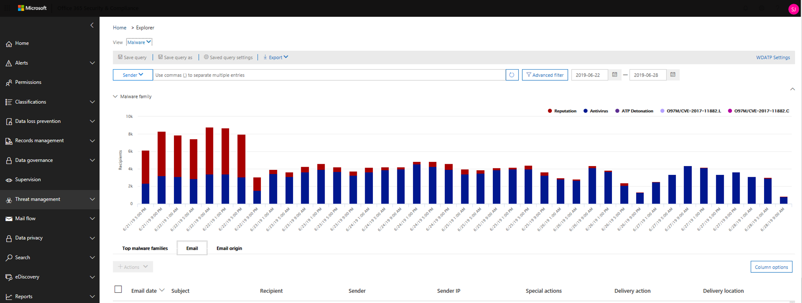
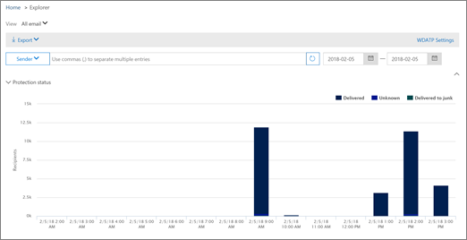

# Encontre e investigue emails mal-intencionados que foram entregues no Office 365

A [proteção avançada contra ameaças do Office 365](office-365-atp.md) permite investigar as atividades que colocam seus usuários em risco e tomar medidas para proteger sua organização. Por exemplo, se você fizer parte da equipe de segurança da sua organização, poderá encontrar e investigar mensagens de email suspeitas que foram entregues aos seus usuários. Você pode fazer isso usando o [Explorador de ameaças (ou detecções em tempo real)](threat-explorer.md).
  
## Antes de começar...

Verifique se os seguintes requisitos são atendidos:
  
- Sua organização tem a [proteção avançada contra ameaças do Office 365](office-365-atp.md) e as [licenças são atribuídas aos usuários](https://docs.microsoft.com/en-us/office365/admin/subscriptions-and-billing/assign-licenses-to-users).
    
- O [log de auditoria do Office 365](turn-audit-log-search-on-or-off.md) está ativado para sua organização. 
    
- Sua organização tem políticas definidas para antispam, anti-malware, anti-phishing e assim por diante. Confira [proteção contra ameaças no Office 365](protect-against-threats.md).
    
- Você é um administrador global do Office 365 ou tem o administrador de segurança ou a função de pesquisa e limpeza atribuída no centro de &amp; conformidade de segurança. Consulte [permissões no centro de conformidade de &amp; segurança do Office 365](permissions-in-the-security-and-compliance-center.md).
    
## Lidando com emails suspeitos

Invasores mal-intencionados podem estar enviando emails aos seus usuários para tentarem e Phish suas credenciais e obter acesso aos segredos corporativos! Para evitar isso, você deve usar os serviços de proteção contra ameaças no Office 365, incluindo [proteção do Exchange Online](eop/exchange-online-protection-overview.md) e [proteção avançada contra ameaças](office-365-atp.md). No entanto, há ocasiões em que um invasor pode enviar emails para seus usuários que contenham uma URL e apenas mais tarde, fazer essa URL apontar para conteúdo mal-intencionado (malware, etc.). 

Como alternativa, você pode perceber muito tarde que um usuário em sua organização foi comprometido e enquanto esse usuário foi comprometido, um invasor usou essa conta para enviar emails a outros usuários da sua empresa. Como parte da limpeza desses dois cenários, talvez você queira remover mensagens de email de caixas de entrada de usuários. Em situações como essas, você pode usar o [Explorador de ameaças (ou detecções em tempo real)](threat-explorer.md) para encontrar e remover essas mensagens de email!

## Onde os emails redirecionados são localizados após a tomada de ações

Então, onde os emails de problema vão e quais ferramentas ajudam os investigadores a entender o que aconteceu com eles? Os campos do explorador de ameaças relatam informações que ajudarão os administradores a decodificar eventos de email.

### Exibir os cabeçalhos de email e baixar o corpo do email

**O cabeçalho de email Preview e o download do corpo do email** são recursos úteis de gerenciamento de ameaças de email disponíveis no explorador de ameaças. Os administradores poderão analisar e baixar cabeçalhos e emails para ameaças. O acesso para usar esse recurso é controlado pelo RBAC (controle de acesso baseado em função) para reduzir o risco de exposição do conteúdo de email do usuário.

Uma nova *função*, chamada ' prévia ', deve ser adicionada a outro grupo de função do Office 365 (por exemplo, em operações da SEC, ou administração da SEC) para conceder a capacidade de baixar emails e Visualizar cabeçalhos no modo de exibição todos os emails.

Para ver o submenu com as opções de download e visualização de cabeçalho de email: 

1. Acesse [https://protection.office.com](https://protection.office.com) e entre usando sua conta corporativa ou de estudante para o Office 365. Isso leva você para o centro &amp; de conformidade de segurança. 
    
2. No painel de navegação à esquerda, escolha **Gerenciador**de **Gerenciamento** \> de ameaças.

3. Clique em um assunto na tabela Gerenciador de ameaças.

Isso abrirá o submenu, onde os links de visualização de cabeçalho e download de email são posicionados.

> [!IMPORTANT]
> Use ambas as tabelas que acompanham o conjunto. Uma informa o RBAC necessário, o outro, o local onde os direitos devem ser concedidos.

|Atividade  |RoleGroup RBAC com acesso |Função "Preview" necessária?  |
|---------|---------|---------|
|Usar o explorador de ameaças (e detecções em tempo real) para analisar ameaças     |  Administrador global do Office 365,  Administrador de segurança,   Leitor de segurança      | Não   |
|Usar o explorador de ameaças (e detecções em tempo real) para exibir cabeçalhos de emails, bem como Visualizar e baixar emails em quarentena    |     Administrador global do Office 365,   Administrador de segurança,  Leitor de segurança    |       Não  |
|Usar o explorador de ameaças para exibir cabeçalhos e baixar emails entregues a caixas de correio     |      Administrador global do Office 365,  Administrador de segurança,  Leitor de segurança,   Visualização    |   Sim      |

 

|RoleGroup RBAC  |Onde os usuários são atribuídos  |
|---------|---------|
| Administração Global   | Office 365 Admin Center        |
| Administrador de segurança      |    Centro de Conformidade e Segurança     |
| Leitor de segurança   |    Centro de Conformidade e Segurança     |
|      |    Centro de Conformidade e Segurança     |

> [!CAUTION]
> Lembre-se, "Preview" é uma função e não um RoleGroup e essa função deve ser adicionada a um RoleGroup posteriormente.

> [!IMPORTANT]
> Esse recurso não é exibido para emails que nunca foram encontrados na caixa de correio de um usuário, o que pode acontecer se um email tiver sido descartado ou se houvesse falha na entrega. Nos casos em que os emails foram excluídos das caixas de correio dos usuários, os administradores verão um erro ao mencionar "email não encontrado".

### Verificar a ação e o local de entrega

As detecções de tempo real do explorador de ameaças adicionaram os campos de ação de entrega e local de entrega no local do status de entrega. Isso resulta em uma imagem mais completa de onde seus emails se esterram. Parte do objetivo dessa alteração é tornar a busca mais fácil para pessoas de operações de segurança, mas o resultado líquido é saber o local dos emails de problemas em um relance.

O status de entrega agora é dividido em duas colunas:

- **Ação de entrega** -Qual é o status desse email?
- **Local de entrega** -onde esse email foi roteado como resultado?

A ação de entrega é a ação realizada em um email devido a políticas ou detecções existentes. Veja a seguir as possíveis ações que um email pode executar:

- **Entregue** – o email foi entregue à caixa de entrada ou pasta de um usuário, e o usuário pode acessá-lo diretamente.
- **Lixo eletrônico** – o email foi enviado à pasta de lixo eletrônico ou à pasta excluída do usuário, e o usuário tem acesso a emails na pasta lixo eletrônico ou excluído.
- **Bloqueado** – todos os emails que estão em quarentena, que falharam ou foram descartados. Isso é completamente inacessível pelo usuário!
- **Substituído** – qualquer email onde anexos mal-intencionados são substituídos por arquivos. txt que indicam que o anexo era mal-intencionado.
 
O local de entrega mostra os resultados das políticas e detecções que executam post-Delivery. Ele está vinculado a uma ação de entrega. Este campo foi adicionado para dar informações sobre a ação tomada quando um email de problema é encontrado. Estes são os possíveis valores de local de entrega:

- **Caixa de entrada ou pasta** – o email está na caixa de entrada ou uma pasta (de acordo com suas regras de email).
- **Local ou externo** – a caixa de correio não existe na nuvem, mas está no local.
- **Pasta lixo eletrônico** – o email na pasta lixo eletrônico de um usuário.
- **Pasta itens excluídos** – o email na pasta itens excluídos de um usuário.
- **Quarentena** – o email em quarentena e não está na caixa de correio de um usuário.
- **Falha** – o email não pôde chegar à caixa de correio.
- **Descartado** – o email é perdido em algum lugar no fluxo.

### Exibir a linha do tempo de seu email
  
 **Linha do tempo de email** outro campo no Gerenciador de ameaças também será mais fácil para administradores. Em vez de gastar uma verificação de tempo valioso onde o email pode ter desaparecido, quando, ao investigar um evento, quando vários eventos ocorrem ou próximos, ao mesmo tempo em um email, esses eventos serão exibidos em um modo de exibição de linha do tempo. Alguns eventos que acontecerão após a entrega ao seu email serão capturados na coluna "*ação especial*". A combinação de informações a partir da linha do tempo do email com a ação especial tomada no correio de envio de email fornece informações sobre políticas e tratamento de ameaças (por exemplo, onde o email foi roteado e, em alguns casos, qual era a avaliação final).

## Localizar e excluir emails suspeitos que foram entregues

> [!TIP]
> O Gerenciador de ameaças (às vezes chamado de Explorer) é um relatório poderoso que pode servir a vários propósitos, como localizar e excluir mensagens, identificar o endereço IP de um remetente de email mal-intencionado ou iniciar um incidente para investigação adicional. O procedimento a seguir se concentra no uso do Explorer para localizar e excluir emails mal-intencionados de caixas de correio de destinatários.

Para ver as alterações no campo status da entrega anterior (agora, a ação de entrega e o local de entrega): 

1. Acesse [https://protection.office.com](https://protection.office.com) e entre usando sua conta corporativa ou de estudante para o Office 365. Isso leva você para o centro &amp; de conformidade de segurança. 
    
2. No painel de navegação à esquerda, escolha **Gerenciador**de **Gerenciamento** \> de ameaças.

Você pode notar a nova coluna "ações especiais" neste gráfico. Esse recurso é destinado a informar aos administradores o resultado do processamento de um email. As ações especiais podem ser atualizadas no final da linha do *tempo de email*do explorador de ameaças, que é um novo recurso destinado a tornar a experiência de busca melhor para administradores.

O cronograma de email reduz a randomização porque há menos tempo gasto na verificação de locais diferentes para tentar entender os eventos que ocorreram desde que o email chegou. Quando vários eventos ocorrem ou próximos à mesma hora em um email, esses eventos serão exibidos em um modo de exibição de linha do tempo. Alguns eventos que acontecerão após a entrega ao seu email serão capturados na coluna ' ações especiais '. A combinação das informações da *linha do tempo de email* desse email com as *ações especiais* realizadas no envio de mensagens de email oferece aos administradores informações sobre como suas políticas funcionam, onde o email foi finalmente encaminhado e, em alguns casos, o que a última a avaliação foi. A coluna especial ações pode ser acessada no mesmo lugar que a ação de entrega e o local de entrega, mas para ver uma linha do tempo de email:

1. Clique no assunto do email.
2. No painel exibido, clique em *linha do tempo de email*. (Ele aparecerá entre outros títulos no painel como ' Resumo ' ou ' Detalhes ', et cetera.)

Depois de abrir a linha do tempo de email, você deve ver uma tabela que informa os eventos de envio de entrega para esse email ou, caso não haja mais eventos para o email, você deve ver um único evento para a entrega original que irá declarar um resultado como *bloqueado* com um veredicto como *phishing*. A guia também tem a opção de exportar toda a linha do tempo de email e isso exportará todos os detalhes na guia e detalhes sobre o email (coisas como assunto, remetente, destinatário, rede e ID da mensagem).

3. No menu Exibir, escolha **todos os emails**. 
  
4. Observe os rótulos que aparecem no relatório, como **entregue**, **desconhecido**ou **entregue ao lixo eletrônico**.  (Dependendo das ações que foram tomadas nas mensagens de email de sua organização, você poderá ver rótulos adicionais, como bloqueados **** ou **substituídos**.)
    
5. No relatório, escolha **entregue** para exibir apenas os emails que acabaram nas caixas de entrada dos usuários. 
  
6. Abaixo do gráfico, revise **** a lista de emails abaixo do gráfico. 
  
7. Na lista, escolha um item para exibir mais detalhes sobre a mensagem de email. Por exemplo, você pode clicar na linha de assunto para exibir informações sobre o remetente, destinatários, anexos e outras mensagens de email semelhantes. 
  
8. Após exibir informações sobre mensagens de email, selecione um ou mais itens na lista para ativar **+ ações**.
    
9. Use a lista de **ações +** para aplicar uma ação, como **mover para itens excluídos** . Isso excluirá as mensagens selecionadas das caixas de correio dos destinatários. 
  
## Tópicos relacionados

[Office 365 plano avançado de proteção contra ameaças 2](office-365-ti.md)
  
[Proteção contra ameaças no Office 365](protect-against-threats.md)
  
[Exibir relatórios para a proteção avançada contra ameaças do Office 365](view-reports-for-atp.md)
  

