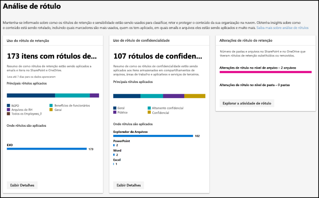
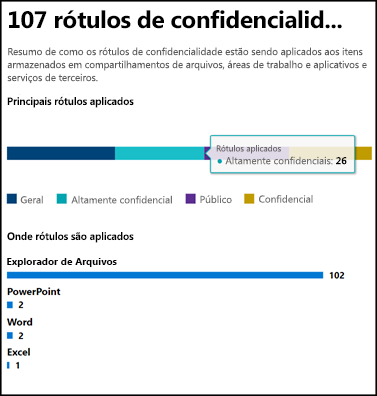
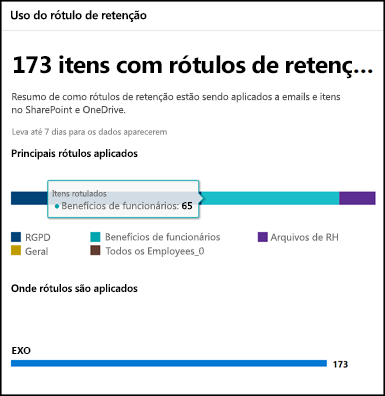
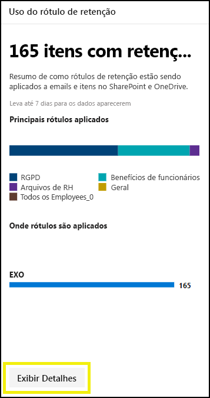
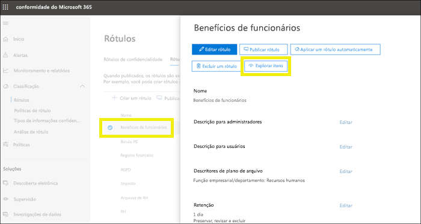
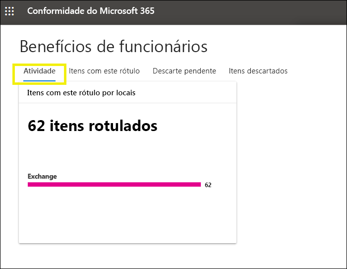
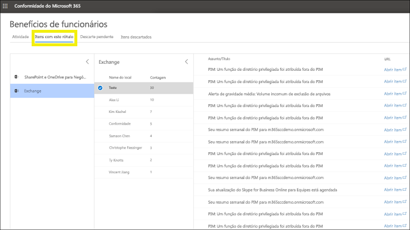

# Exibição do uso do rótulo com análises de rótuloView label usage with label analytics

Depois de criar seus rótulos de retenção e rótulos de sensibilidade, você desejará ver como eles estão sendo usados em seu locatário.After you create your retention labels and sensitivity labels, you’ll want to see how they’re being used across your tenant. Com a análise do rótulo no centro de conformidade do Microsoft 365 e no centro de segurança do Microsoft 365, você pode exibir rapidamente os rótulos mais usados e onde foram aplicados.With label analytics in the Microsoft 365 compliance center and Microsoft 365 security center, you can quickly see which labels are used the most and where they’re being applied.

Por exemplo, com a análise do rótulo, você pode exibir o:For example, with label analytics, you can view the:

- Total de rótulos de retenção e rótulos de confidencialidade aplicados ao conteúdo.Total number of retention labels and sensitivity labels applied to content.
- Rótulos superiores e a contagem de quantas vezes cada rótulo foi aplicado.Top labels and the count of how many times each label was applied.
- Locais onde os rótulos foram aplicados e a contagem de cada local.Locations where labels are applied and the count for each location.
- Conta quantos arquivos e pastas tiveram seu rótulo de retenção, alterado ou removido.Count for how many files and folders had their retention label changed or removed.

Você encontra a análise de rótulo no [Centro de conformidade do Microsoft 365](https://compliance.microsoft.com/labelanalytics) ou no [Centro de segurança do Microsoft 365](https://security.microsoft.com/labelanalytics) > **Classificação**  >  \*\* Análise de Rótulo\*\*.You can find label analytics in the [Microsoft 365 compliance center](https://compliance.microsoft.com/labelanalytics) or [Microsoft 365 security center](https://security.microsoft.com/labelanalytics) > **Classification** > **Label analytics**.

## Uso do rótulo de confidencialidadeSensitivity label usage

Os dados de uso do rótulo de confidencialidade são extraídos dos Relatórios de Proteção de Informações do Azure – para saber mais, confira [Central de relatórios de Proteção de Informações do Azure](https://docs.microsoft.com/pt-BR/azure/information-protection/reports-aip).The data on sensitivity label usage is pulled from the reports for Azure Information Protection – for more information, see [Central reporting for Azure Information Protection](https://docs.microsoft.com/en-us/azure/information-protection/reports-aip).

Observe que tem os relatórios de Proteção de Informações do Azure possuem [pré-requisitos](https://docs.microsoft.com/pt-BR/azure/information-protection/reports-aip#prerequisites-for-azure-information-protection-analytics) que também se aplicam a análise de rótulos nos rótulos de confidencialidade no centro de conformidade do Microsoft 365 e no centro de segurança do Microsoft 365.Note that the Azure Information Protection reports have [prerequisites](https://docs.microsoft.com/en-us/azure/information-protection/reports-aip#prerequisites-for-azure-information-protection-analytics) that also apply to label analytics on sensitivity labels in the Microsoft 365 compliance center and Microsoft 365 security center. Por exemplo, você precisa de uma assinatura do Azure que inclua a Análise de Log, pois esses relatórios são um resultado do envio de eventos de auditoria da Proteção de Informação de clientes de Proteção de Informações do Azure e scanners em um local centralizado com base no serviço de Análise de Log do Azure.For example, you need an Azure subscription that includes the Log Analytics because these reports are a result of sending information protection audit events from Azure Information Protection clients and scanners to a centralized location based on Azure Log Analytics service.

Para uso do rótulo de confidencialidade:For sensitivity label usage:

- Não há nenhum latência nos dados.There is no latency in the data. Este é um relatório em tempo real.This is a real-time report.
- Para ver a contagem de cada rótulo superior, aponte para o gráfico de barras e leia a dica de ferramenta que aparecerá.To see the count for each top label, point to the bar graph and read the tool tip that appears.
- O relatório mostra onde os rótulos de confidencialidade são aplicados por aplicativo (enquanto os rótulos de retenção são mostrados por local).The report shows where sensitivity labels are applied per app (whereas retention labels are shown per location).

## Uso do rótulo de retençãoRetention label usage

Este relatório mostra uma exibição rápida do que os rótulos superiores são e onde são aplicadas.This report shows a quick view of what the top labels are and where they’re applied. Para saber mais sobre como o conteúdo no SharePoint e OneDrive é rotulado, confira [Exibir a atividade de rótulos para documentos](view-label-activity-for-documents.md).For more detailed information on how content in SharePoint and OneDrive is labeled, see [View label activity for documents](view-label-activity-for-documents.md).

Para o uso do rótulo de retenção:For retention label usage:

- Os dados são agregados semanalmente, portanto pode levar até sete dias para que os dados sejam exibidos no relatório.Data is aggregated weekly, so it may take up to seven days for data to appear in the report.
- Para ver a contagem de cada rótulo superior, aponte para o gráfico de barras e leia a dica de ferramenta que aparecerá.To see the count for each top label, point to the bar graph and read the tool tip that appears.
- O relatório mostra onde os rótulos de retenção são aplicados por local (enquanto os rótulos de confidencialidade são mostrados por aplicativo).The report shows where retention labels are applied per location (whereas sensitivity labels are shown per app).
- Para rótulos de retenção, esse é um resumo de todos os dados de tempo em seu locatário; não é filtrado em um intervalo de dados específico.For retention labels, this is a summary of the all-time data in your tenant; it’s not filtered to a specific date range. Por outro lado, o [Explorador de Atividade de Rótulo](view-label-activity-for-documents.md) mostra apenas dados dos últimos 30 dias.By contrast, the [Label Activity Explorer](view-label-activity-for-documents.md) shows data from only the past 30 days.

## Exibir todo o conteúdo com um rótulo de retenção específico.View all content with a specific retention label

No relatório de uso do rótulo retenção, você pode rapidamente explorar todo o conteúdo em que esse rótulo foi aplicado.From the retention label usage report, you can quickly explore all content with that label applied. (Observe que estamos trabalhando nesse recurso, portanto algumas etapas serão necessárias para exibir todo o conteúdo rotulado).(Note that we're currently working on this feature, so that it will take fewer steps to view all the labeled content.)

Primeiro, escolha **Exibir Detalhes** na parte inferior do relatório.First, choose **View Details** at the bottom of the report.

Escolha um rótulo de retenção > **Explorar itens** no painel direito.Then choose a retention label > **Explore items** in the right pane.

Para esse rótulo, você pode escolher a guia **Atividade** para exibir uma contagem de itens com esse rótulo por local.For that label, you can choose the **Activity** tab to view a count of items with that label by location.

Você também pode escolher a guia **Itens com esse rótulo** guia. Em seguida, você pode ir para locais específicos:You can also choose the **Items with this label** tab. Then you can drill into specific locations:

- Para o Exchange Online, você verá uma lista de caixas de correio com contagem de itens rotulados em cada caixa de correio.For Exchange Online, you see a list of mailboxes with the count of labeled items in each mailbox.
- Para o SharePoint Online e OneDrive for Business, você verá uma lista de conjuntos de sites e contas do OneDrive com a contagem de itens rotulados em cada local.For SharePoint Online and OneDrive for Business, you see a list of site collections and OneDrive accounts with the count of labeled items in each location.

Quando você escolher um conjunto de site ou caixa de correio, você pode exibir uma lista de itens com esse rótulo retenção naquele local.When you choose a mailbox or site collection, you can view a list of items with that retention label in that location.

## PermissõesPermissions

Para exibir a análise do rótulo, você deve ter uma das seguintes funções no Azure Active Directory:To view label analytics, you must be assigned one of the following roles in Azure Active Directory:

- Administrador globalGlobal administrator
- Administrador de conformidadeCompliance administrator
- Administrador de segurançaSecurity administrator
- Leitor de segurançaSecurity reader

Além disso, observe que esses relatórios usam o Monitor do Azure para armazenar os dados em um espaço de trabalho de Análise de Log pertencente à sua organização.In addition, note these reports use Azure Monitor to store the data in a Log Analytics workspace that your organization owns. Portanto, o usuário deve ser adicionado como um leitor ao espaço de trabalho de monitoramento do Azure monitoramento que possui os dados, para saber mais, confira [Permissões necessárias para análise da Proteção de Informações do Azure](https://docs.microsoft.com/pt-BR/azure/information-protection/reports-aip#permissions-required-for-azure-information-protection-analytics).Therefore, the user should be added as a reader to the Azure Monitoring worksapce that holds the data - for more information, see [Permissions required for Azure Information Protection analytics](https://docs.microsoft.com/en-us/azure/information-protection/reports-aip#permissions-required-for-azure-information-protection-analytics).

