# <a name="overview-of-retention-labels"></a>Visão geral de rótulos de retenção

Provavelmente, há em sua organização tipos de conteúdo diferentes que exigem ações diferentes para atender às normas do setor e às políticas internas. Por exemplo, você pode ter:
  
- Formulários fiscais que precisam ser **mantidos** por um período mínimo. 
    
- Materiais de imprensa que precisam ser **excluídos permanentemente** quando atingem uma certa idade. 
    
- Pesquisa sobre a concorrência que precisa ser **mantida** e, depois, **excluída permanentemente**. 
    
- Vistos de trabalho que devem ser **marcados como um registro** para que não possam ser editados ou excluídos. 
    
Em todos esses casos, os rótulos no Office 365 podem ajudar você a executar as ações certas no conteúdo certo. Com os rótulos de retenção, você pode classificar os dados em toda a organização para prover governança e impor regras de retenção com base nessa classificação.
  
Com os rótulos de retenção, você pode:
  
- **Permitir que pessoas na sua organização apliquem um rótulo de retenção manualmente** ao conteúdo no Outlook na Web, Outlook 2010 e posterior, OneDrive, SharePoint e grupos do Office 365. Os usuários geralmente sabem melhor o tipo de conteúdo com o qual estão trabalhando; portanto, podem classificá-lo e aplicar a política apropriada. 
    
- **Aplique automaticamente os rótulos de retenção ao conteúdo** que corresponder a condições específicas, por exemplo, quando o conteúdo apresenta: 
    
  - Tipos específicos de informações confidenciais.
    
  - Palavras-chave específicas que correspondem a uma consulta criada por você.
    
    A capacidade de aplicar rótulos de retenção automaticamente ao conteúdo é importante porque:
    
  - Você não precisa treinar os usuários com relação a todas as suas classificações.
    
  - Você não precisa depender dos usuários para classificar corretamente o conteúdo.
    
  - Os usuários não precisam mais conhecer as políticas de governança de dados; em vez disso, eles podem se concentrar no próprio trabalho.

  > [!NOTE]
  > A capacidade de aplicar rótulos automaticamente requer uma licença do Office 365 Enterprise E5 para cada usuário que tem permissões para editar conteúdo que tenha sido rotulado automaticamente em um site ou caixa de correio. Os usuários que possuem apenas o acesso somente leitura não precisam de uma licença.
      
- **Aplique um rótulo de retenção padrão a uma biblioteca de documentos** em sites de grupo do SharePoint ou do Office 365, de forma que todos os documentos nessa biblioteca recebam o rótulo de retenção padrão. 
    
- **Implemente o gerenciamento de registros no Office 365**, inclusive em emails e documentos. Você pode usar um rótulo de retenção para classificar o conteúdo como registro. Quando isso acontece, o rótulo não pode ser alterado ou removido, e o conteúdo não pode ser editado ou excluído. 
    
Você pode criar e gerenciar políticas de retenção na guia**Retenção** e na página **Rótulos** no Centro de Conformidade e Segurança &amp; do Office 365. 
  
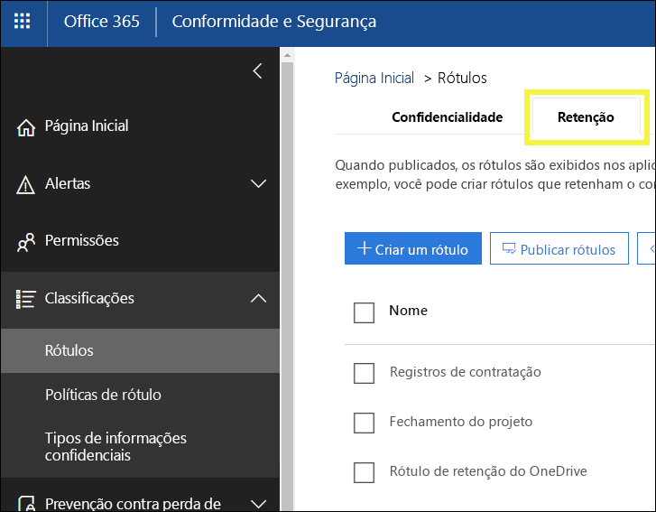
 
## <a name="how-retention-labels-work-with-label-policies"></a>Como os rótulos de retenção funcionam com políticas de rótulo

A disponibilização dos rótulos de retenção para as pessoas da sua organização, para que elas possam classificar o conteúdo, é um processo de duas etapas: primeiro você cria os rótulos e, depois, os publica nos locais escolhidos. Quando você publica os rótulos de retenção, uma política de rótulos é criada.
  
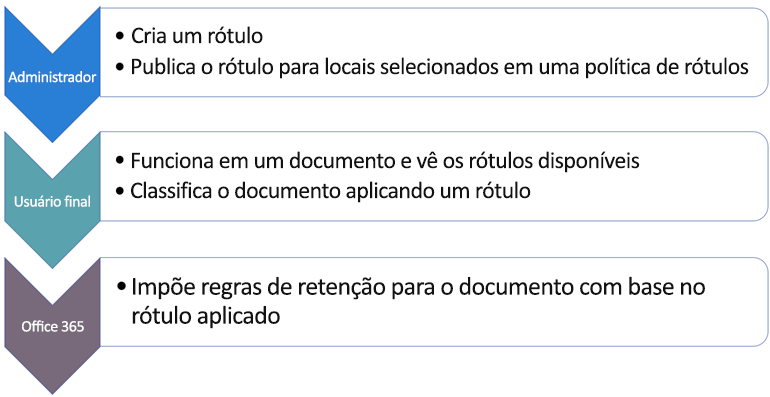
  
Os rótulos de retenção são blocos de construção independentes e reutilizáveis, incluídos em uma política de rótulos e publicados em locais diferentes. Eles podem ser reutilizados em várias políticas. O objetivo principal da política de rótulos é agrupar os rótulos de retenção e especificar os locais nos quais você deseja exibi-los.
  
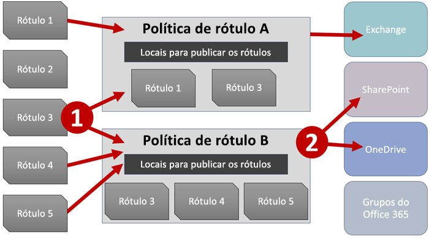
  
1. Ao publicar os rótulos de retenção, eles são incluídos em uma política de rótulos. Um único rótulo de retenção pode ser incluído em muitas políticas.
    
2. As políticas de rótulo especificam os locais de publicação dos rótulos de retenção.
    
## <a name="only-one-retention-label-at-a-time"></a>Apenas um rótulo de retenção por vez

É importante saber que um conteúdo, como um email ou documento, só pode receber um único rótulo de retenção por vez:
  
- No caso dos rótulos atribuídos manualmente por usuários finais, as pessoas podem remover ou alterar o rótulo de retenção atribuído.
    
- Se o conteúdo tiver um rótulo de aplicação automática, um rótulo de aplicação automática pode ser substituído por um rótulo de retenção atribuído manualmente por um usuário final.
    
- Se o conteúdo tiver um rótulo de retenção atribuído manualmente por um usuário final, um rótulo de aplicação automática não poderá substituir o rótulo de retenção atribuído manualmente.
    
- Se houver várias regras que atribuem um rótulo de aplicação automática, e o conteúdo atender às condições das regras, será atribuído o rótulo de retenção da regra mais antiga.
    
Os rótulos atribuídos manualmente são explicitamente atribuídos; os rótulos aplicados automaticamente são implicitamente atribuídos; um rótulo de retenção explícito tem precedência sobre um rótulo implícito. Para saber mais, confira a seção abaixo sobre [Os princípios de retenção ou o que tem precedência?](#the-principles-of-retention-or-what-takes-precedence).

Todas as informações nesta seção se aplicam somente aos rótulos de retenção. Observe que um item de conteúdo também pode ter um rótulo de confidencialidade aplicado a ele, além de um rótulo de retenção.
  
## <a name="how-long-it-takes-for-retention-labels-to-take-effect"></a>Quanto tempo demora para os rótulos de retenção entrarem em vigor

Quando você publica ou aplica rótulos de retenção automaticamente, eles não entram em vigor imediatamente:
  
1. Primeiro, a política de rótulos precisa ser sincronizada com os locais na política no Centro de Conformidade &amp; Segurança.
    
2. Depois, o local pode precisar de algum tempo para disponibilizar os rótulos manuais para os usuários finais, ou aplicar rótulos automaticamente ao conteúdo. Quanto tempo isso demora depende do local e do tipo de rótulo.
    
### <a name="manual-retention-labels"></a>Rótulos de retenção manuais

Se você publicar rótulos de retenção no SharePoint ou no OneDrive, talvez demore um dia para que esses rótulos de retenção apareçam para os usuários finais. Além disso, se você publicar os rótulos de retenção no Exchange, talvez demore 7 dias para que eles apareçam para os usuários finais, e a caixa de correio deles deve conter pelo menos 10 MB de dados.
  
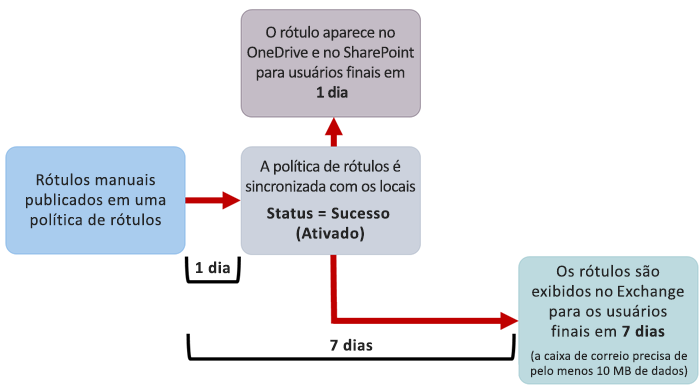
  
### <a name="auto-apply-retention-labels"></a>Aplicação automática de rótulos de retenção

Se você aplicar automaticamente os rótulos de retenção ao conteúdo que atenda a condições específicas, talvez demore sete dias para que os rótulos sejam aplicados a todo o conteúdo que corresponde às condições.
  
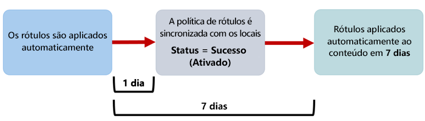
  
### <a name="how-to-check-on-the-status-of-exchange-labels"></a>Como verificar o status dos rótulos do Exchange

No Exchange Online, os rótulos de retenção são disponibilizados para os usuários finais por um processo executado a cada sete dias. Usando o Powershell, é possível ver quando esse processo foi executado pela última vez e, assim, determinar quando ele será executado novamente.
  
1. [Conectar-se ao Exchange Online PowerShell](https://go.microsoft.com/fwlink/?linkid=799773).
    
2. Execute estes comandos.
    
  ```
  $logProps = Export-MailboxDiagnosticLogs <user> -ExtendedProperties
  ```

  ```
  $xmlprops = [xml]($logProps.MailboxLog)
  ```

  ```
  $xmlprops.Properties.MailboxTable.Property | ? {$_.Name -like "ELC*"}
  ```

Nos resultados, a propriedade `ELCLastSuccessTimeStamp` (UTC) mostra quando o sistema processou sua caixa de correio pela última vez. Se isso não tiver ocorrido desde quando você criou a política, os rótulos não serão exibidos. Para forçar o processamento, execute `Start-ManagedFolderAssistant -Identity <user>`.
    
Se os rótulos não estiverem aparecendo no Outlook na Web, e você achar que deveriam aparecer, limpe o cache do navegador (CTRL + F5).
    
## <a name="label-policies-and-locations"></a>Políticas e locais de rótulo

É possível publicar tipos diferentes de rótulos de retenção em locais diferentes, dependendo do que o rótulo faz.
  
|**Se o rótulo de retenção for...**|**A política do rótulo poderá ser aplicada a...**|
|:-----|:-----|
|Publicado para usuários finais  <br/> |Exchange, SharePoint, OneDrive, grupos do Office 365  <br/> |
|Aplicado automaticamente com base em tipos de informações confidenciais  <br/> |Exchange (somente para todas as caixas de correio), SharePoint, OneDrive  <br/> |
|Aplicado automaticamente com base em uma consulta  <br/> |Exchange, SharePoint, OneDrive, grupos do Office 365  <br/> |
   
Observe que, no Exchange, os rótulos de retenção de aplicação automática (para consultas e tipos de informações confidenciais) são aplicados apenas a mensagens enviadas recentemente (dados em trânsito), e não a todos os itens na caixa de correio (dados em repouso). Além disso, a aplicação automática de rótulos de retenção para tipos de informações confidenciais só pode ocorrer para todas as caixas de correio; não é possível selecionar caixas de correio específicas.
  
As pastas públicas do Exchange e o Skype não dão suporte a rótulos.
  
## <a name="how-retention-labels-enforce-retention"></a>Como os rótulos de retenção impõem a retenção

Os rótulos de retenção podem impor exatamente as mesmas ações de retenção que uma política de retenção. Use rótulos de retenção para implementar um plano de conteúdo sofisticado (ou plano de arquivo). Para saber mais sobre como funciona a retenção, confira [Visão geral das políticas de retenção](retention-policies.md).
  
Além disso, um rótulo de retenção tem duas opções de retenção, disponíveis apenas em um rótulo, e não em uma política de retenção. Com um rótulo de retenção, você pode:
  
- Disparar uma revisão de disposição ao final do período de retenção, de modo que os documentos do SharePoint e do OneDrive sejam revisados antes de serem excluídos. Para saber mais, confira [Visão geral das revisões de disposição](disposition-reviews.md).
    
- Iniciar o período de retenção a partir do momento de aplicação do rótulo no conteúdo, em vez da idade do conteúdo ou da última modificação.
    
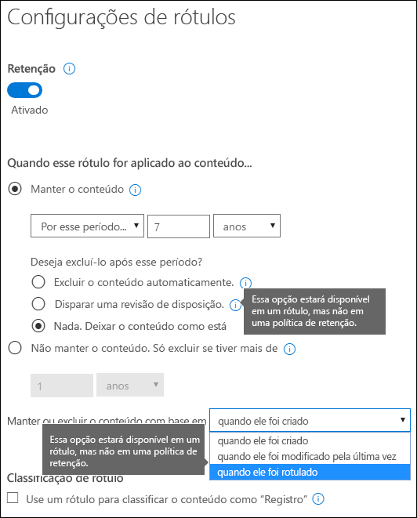
  
## <a name="where-published-retention-labels-can-appear-to-end-users"></a>Onde os rótulos de retenção publicados podem aparecer para os usuários finais

Se o seu rótulo de retenção for atribuído ao conteúdo por usuários finais, você poderá publicá-lo no:
  
- Outlook na Web
    
- Outlook 2010 e posterior
    
- OneDrive
    
- SharePoint
    
- Grupos do Office 365 (o site do grupo e a caixa de correio do grupo no Outlook na Web)
    
As seções a seguir mostram como os rótulos serão exibidos em aplicativos diferentes para as pessoas em sua organização.
  
### <a name="outlook-on-the-web"></a>Outlook na Web

Para rotular um item no Outlook na Web, clique com o botão direito no item \> **Atribuir Política** \> e escolha o rótulo. 
  
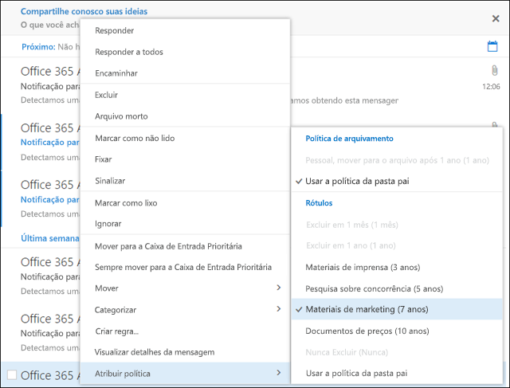
  
Após a aplicação do rótulo de retenção, você poderá exibir esse rótulo e a ação necessária na parte superior do item. Se um email for classificado e tiver um período de retenção associado, você poderá saber rapidamente quando o email expirará.
  
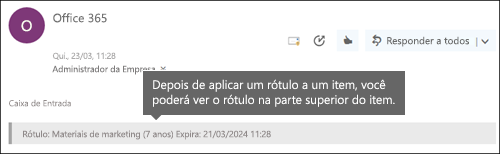
  
Você também pode aplicar os rótulos de retenção a pastas e, nesse caso:
  
- Todos os itens da pasta recebem automaticamente o mesmo rótulo de retenção, **exceto** os itens que receberam um rótulo de retenção explicitamente aplicado. Itens rotulados explicitamente mantêm o rótulo de retenção existente. Para saber mais, confira a seção abaixo sobre os princípios de retenção. 
    
- Se você alterar ou remover o rótulo de retenção padrão de uma pasta, ele também será alterado ou removido para todos os itens na pasta, **exceto** itens com rótulos de retenção explícitos. 
    
- Se você mover um item com um rótulo de retenção padrão de uma pasta para outra com um rótulo de retenção padrão diferente, o item receberá o novo rótulo de retenção padrão.
    
- Se você mover um item com um rótulo de retenção padrão de uma pasta para outra sem nenhum rótulo de retenção padrão, o antigo rótulo de retenção padrão será removido.
    
### <a name="outlook-2010-and-later"></a>Outlook 2010 e posterior

Para rotular um item no Outlook na Web, clique com o botão direito no item \> na **Faixa de Opções** \> **Atribuir Política** \> e escolha o rótulo de retenção. 
  
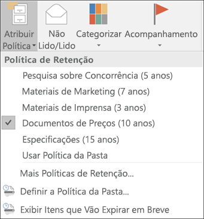
  
Após a aplicação do rótulo de retenção, você poderá exibir esse rótulo e a ação necessária na parte superior do item. Se um email for classificado e tiver um período de retenção associado, você poderá saber rapidamente quando o email expirará.
  
Você também pode aplicar rótulos de retenção a pastas. Isso funciona no Outlook 2010 ou posterior da mesma maneira que funciona no Outlook na Web. Confira a seção anterior para saber mais.
  
### <a name="onedrive-and-sharepoint"></a>OneDrive e SharePoint

Para rotular um documento (incluindo arquivos do OneNote) no OneDrive ou SharePoint, selecione o item \> no canto superior direito, escolha **Abrir no painel de detalhes** \> **Aplicar rótulo** \>e escolha o rótulo de retenção. 
  
Observe que você também pode aplicar um rótulo de retenção a uma pasta ou conjunto de documentos, e você pode definir um rótulo de retenção padrão para uma biblioteca de documentos. Confira a seção abaixo para saber mais.
  
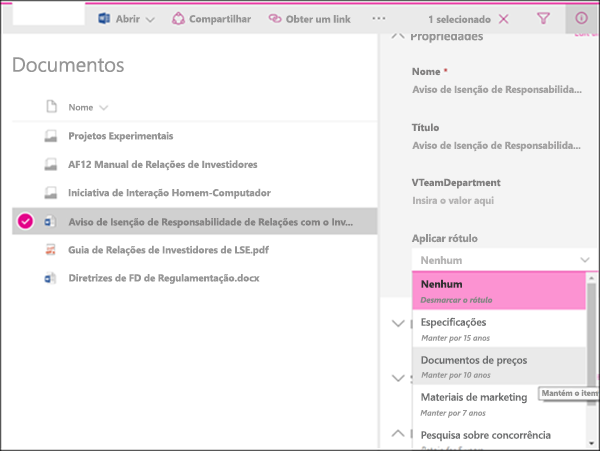
  
Após a aplicação de um rótulo de retenção a um item, será possível exibi-lo no painel de detalhes após a seleção do item.
  
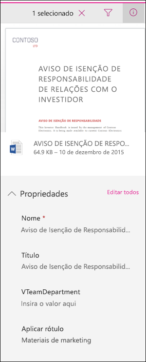
  
Também é possível criar um modo de exibição da biblioteca que contém a coluna **Rótulos** ou a coluna **Item é um Registro**, para que você possa ver rapidamente os rótulos de retenção atribuídos a todos os itens e quais itens são registros. No entanto, você não pode filtrar o modo de exibição pela coluna **Item é um Registro**. 
  
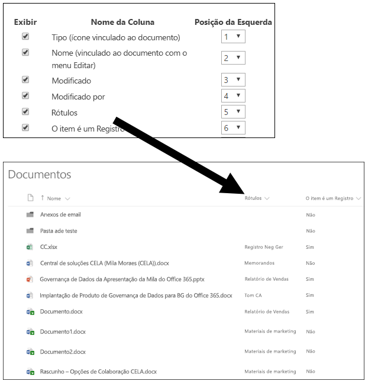
  
### <a name="office-365-groups"></a>Grupos do Office 365

Ao publicar rótulos de retenção em um grupo do Office 365, eles aparecem no site do grupo e na caixa de correio do grupo no Outlook na Web. A experiência de aplicação de um rótulo de retenção ao conteúdo é idêntica à exibida acima para email e documentos.

Para reter o conteúdo de um Grupo do Office 365, é necessário usar o local dos grupos do Office 365. Mesmo que um Grupo do Office 365 tenha uma caixa de correio do Exchange, uma política de retenção que inclua todo o local do Exchange não incluirá conteúdo nas caixas de correio de Grupo do Office 365.

Além disso, não é possível usar o local do Exchange para incluir ou excluir uma caixa de correio de grupo específica. Embora o local do Exchange permita inicialmente que uma caixa de correio de grupo seja selecionada, quando você tentar salvar a política de retenção, receberá um erro informando que "RemoteGroupMailbox" não é uma seleção válida para o local do Exchange.
  
## <a name="applying-a-retention-label-automatically-based-on-conditions"></a>Aplicar um rótulo de retenção automaticamente com base em condições

Um dos recursos mais avançados dos rótulos de retenção é a capacidade de aplicá-los automaticamente ao conteúdo que atende a certas condições. Nesse caso, as pessoas em sua organização não precisam aplicar os rótulos de retenção, o Office 365 faz isso por elas.
  
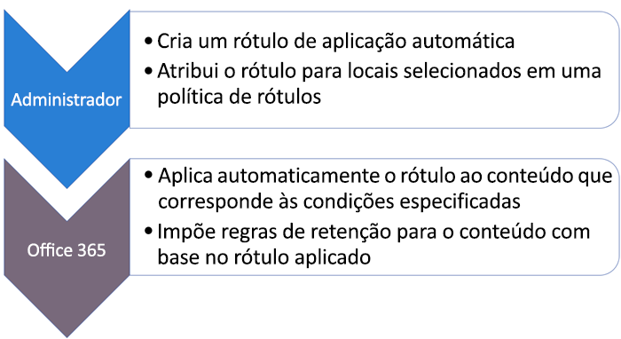
  
Os rótulos de retenção de aplicação automática são excelentes porque:
  
- Você não precisa treinar os usuários com relação a todas as suas classificações.
    
- Você não precisa depender dos usuários para classificar corretamente o conteúdo.
    
- Os usuários não precisam mais conhecer as políticas de governança de dados; assim podem se concentrar no próprio trabalho.
    
Você pode optar por aplicar os rótulos de retenção automaticamente ao conteúdo quando esse conteúdo apresentar:
  
- Tipos específicos de informações confidenciais.
    
- Palavras-chave específicas que correspondem a uma consulta criada por você.
    
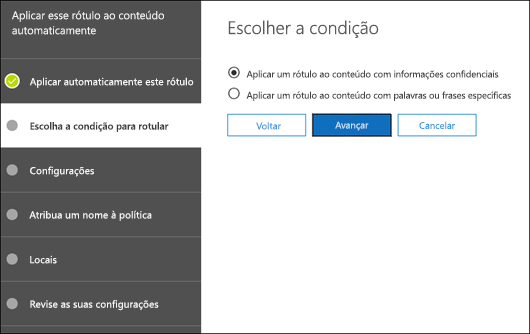
  
Observe que os rótulos de retenção de aplicação automática exigem uma assinatura do Office 365 Enterprise E5, e que pode demorar até sete dias para aplicação automática desses rótulos de retenção a todo o conteúdo que atenda às condições, conforme descrito acima.
  
### <a name="auto-apply-retention-labels-to-content-with-specific-types-of-sensitive-information"></a>Aplicar automaticamente rótulos de retenção a conteúdo com tipos específicos de informações confidenciais

Ao criar rótulos de retenção de aplicação automática para informações confidenciais, você vê a mesma lista de modelos de política exibida quando você cria uma política DLP (prevenção contra perda de dados). Cada modelo de política é pré-configurado para procurar tipos específicos de informações confidenciais; por exemplo, o modelo mostrado aqui procura pelo ITIN (Número de identificação de contribuinte individual) dos EUA, SSN (cadastro de pessoas físicas) e números de passaporte. Para saber mais sobre DLP, confira [Visão geral das políticas de prevenção de perda de dados](data-loss-prevention-policies.md).
  
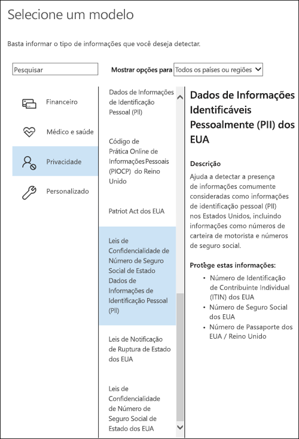
  
Depois de selecionar um modelo de política, você pode adicionar ou remover quaisquer tipos de informações confidenciais, e pode alterar a contagem de instâncias e a precisão de correspondência. No exemplo mostrado aqui, um rótulo de retenção será aplicado automaticamente apenas quando:
  
- O conteúdo tiver entre uma e nove instâncias de qualquer um destes três tipos de informações confidenciais. Você pode excluir o valor **max** para que mude para **any**.
    
- O tipo de informação confidencial detectado tiver uma precisão de correspondência (ou nível de confiança) de pelo menos 75. Muitos tipos de informações confidenciais são definidos com vários padrões, em que um padrão de precisão de correspondência superior exige mais evidências para ser encontrado (como palavras-chave, datas ou endereços), enquanto um padrão de precisão de correspondência inferior exige menos evidências. Resumindo, quanto menor a precisão de correspondência **min**, mais fácil será para o conteúdo atender à condição. 
    
Para saber mais sobre essas opções, confira [Como ajustar as regras para facilitar ou dificultar a correspondência](data-loss-prevention-policies.md#tuning-rules-to-make-them-easier-or-harder-to-match).
    
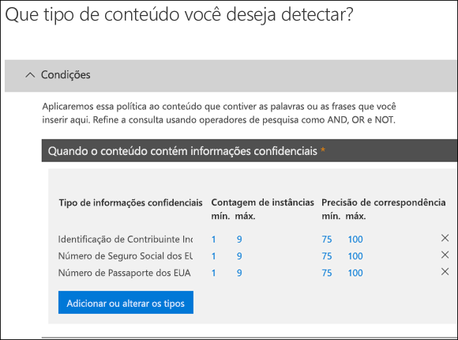
  
### <a name="auto-apply-labels-to-content-with-keywords-or-searchable-properties"></a>Aplicar rótulos automaticamente a conteúdos com palavras-chave ou propriedades pesquisáveis

Você pode aplicar automaticamente os rótulos ao conteúdo que atenda a certas condições. As condições disponíveis agora dão suporte à aplicação de um rótulo a conteúdos que incluem palavras ou frases específicas, ou valores de propriedades pesquisáveis. Você pode refinar a consulta usando os operadores de pesquisa AND, OR e NOT.

Para saber mais sobre sintaxe de consulta, confira:

- [Referência de sintaxe da Linguagem de Consulta de Palavra-chave (KQL)](https://docs.microsoft.com/pt-BR/sharepoint/dev/general-development/keyword-query-language-kql-syntax-reference)

Rótulos baseados em consultas usam o índice de pesquisa para identificar conteúdos. Para saber mais sobre propriedades pesquisáveis válidas, confira:

- [Consultas de palavra-chave e condições de pesquisa para Pesquisa de Conteúdo](keyword-queries-and-search-conditions.md)
- [Visão geral de propriedades rastreadas e gerenciadas no SharePoint Server](https://docs.microsoft.com/pt-BR/SharePoint/technical-reference/crawled-and-managed-properties-overview)

Consultas de exemplos:

- Exchange
    - assunto:"Finanças trimestrais"
    - destinatários:garthf<!--nolink-->@contoso.com
- SharePoint e OneDrive for Business
    - contenttype:contract
    - site:https<!--nolink-->://contoso.sharepoint.com/sites/teams/procurement E contenttype:contract

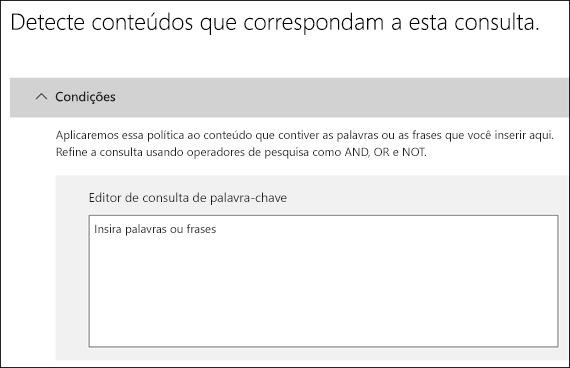

## <a name="applying-a-default-retention-label-to-all-content-in-a-sharepoint-library-folder-or-document-set"></a>Aplicar um rótulo de retenção padrão a todo o conteúdo em uma biblioteca do SharePoint, pasta ou conjunto de documentos

Além de permitir que as pessoas apliquem um rótulo de retenção a documentos individuais, você também pode aplicar um rótulo de retenção padrão a uma biblioteca, pasta ou conjunto de documentos do SharePoint, para que todos os documentos nesse local recebam o rótulo de retenção padrão.
  
Para uma biblioteca de documentos, isso é feito na página **Configurações da biblioteca**. Ao escolher o rótulo de retenção padrão, você também pode optar por aplicá-lo a todos os itens existentes na biblioteca. 
  
Por exemplo, se tiver uma marca para materiais de marketing, e souber que uma biblioteca de documentos específica incluirá apenas esse tipo de conteúdo, você poderá tornar padrão a marca de Materiais de Marketing para todos os documentos nessa biblioteca.
  
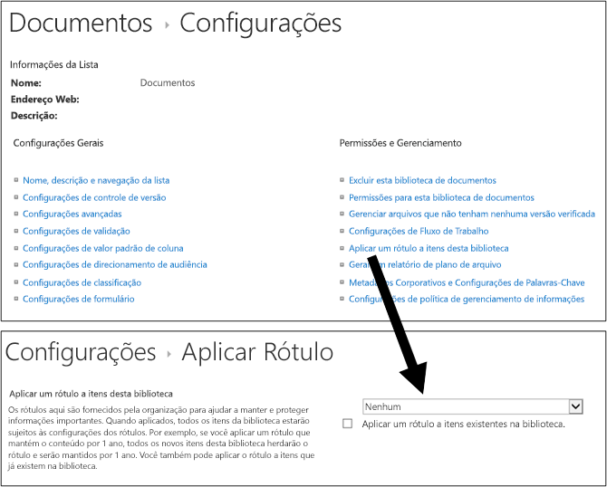
  
Se você aplicar um rótulo de retenção padrão aos itens existentes na biblioteca, pasta ou conjunto de documentos:
  
- Todos os itens na biblioteca, pasta ou conjunto de documentos recebem automaticamente o mesmo rótulo de retenção, **exceto**os itens que receberam um rótulo de retenção explicitamente aplicado. Os itens rotulados explicitamente mantêm o rótulo existente. Para saber mais, confira a seção abaixo sobre [Os princípios de retenção ou o que tem precedência?](#the-principles-of-retention-or-what-takes-precedence).
    
- Se você alterar ou remover o rótulo de retenção padrão de uma biblioteca, pasta ou conjunto de documentos, ele também será alterado ou removido para todos os itens na biblioteca, pasta ou conjunto de documentos, **exceto** os itens com rótulos de retenção explícitos. 
    
- Se você mover um item com um rótulo de retenção padrão de uma biblioteca, pasta ou conjunto de documentos para outra biblioteca, pasta ou conjunto de documentos, o item manterá o rótulo de retenção padrão existente, mesmo se o novo local tiver um rótulo de retenção padrão diferente.
    
## <a name="applying-a-retention-label-to-email-by-using-rules"></a>Aplicar um rótulo de retenção ao email usando regras

No Outlook 2010 ou posterior, você pode criar regras para aplicar um rótulo de retenção ou política de retenção.
  
Por exemplo, você pode criar uma regra que aplica um rótulo de retenção específico a todas as mensagens enviadas de ou para um grupo de distribuição específico.
  
Para criar uma regra, clique com botão direito em um item \> **Regras** \> **Criar Regra** \> **Opções Avançadas** \> **Assistente de Regras** \> **aplicar política de retenção**.
  
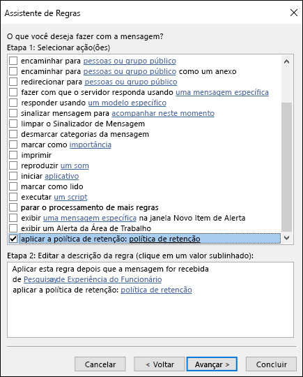
  
## <a name="classifying-content-without-applying-any-actions"></a>Classificação do conteúdo sem aplicar ações

Ao criar um rótulo de retenção, é possível fazer isso sem ativar qualquer retenção ou outras ações, conforme mostrado abaixo. Nesse caso, você pode usar um rótulo de retenção simplesmente como um rótulo de texto, sem impor nenhuma ação.
  
Por exemplo, você pode criar um rótulo de retenção chamado "Revisar depois" sem ações e, em seguida, aplicar automaticamente esse rótulo de retenção ao conteúdo com tipos de informações confidenciais ou conteúdo consultado.
  
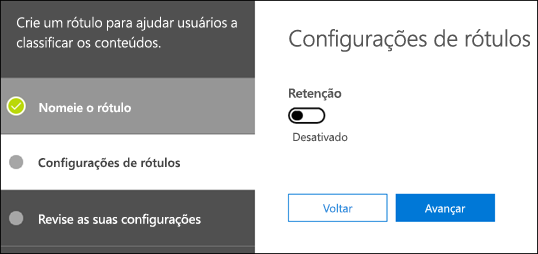
  
## <a name="using-retention-labels-for-records-management"></a>Usar rótulos de retenção para gerenciamento de registros

Em um nível alto, o gerenciamento de registros significa que:
  
- O conteúdo importante é classificado como um registro pelos usuários.
    
- Um registro não pode ser modificado ou excluído.
    
- Os registros são descartados após o término do tempo de vida declarado.
    
Use rótulos de retenção para implementar uma estratégia de gerenciamento de registros única e consistente no Office 365, quando outros recursos de gerenciamento de registros, como a Central de Registros, se aplicarem apenas ao conteúdo do SharePoint. E imponha ações de retenção em registros, para que eles sejam descartados automaticamente ao final do ciclo de vida.
  
Quando você cria um rótulo de retenção, tem a opção de usar o rótulo de retenção para classificar o conteúdo como um registro.
  
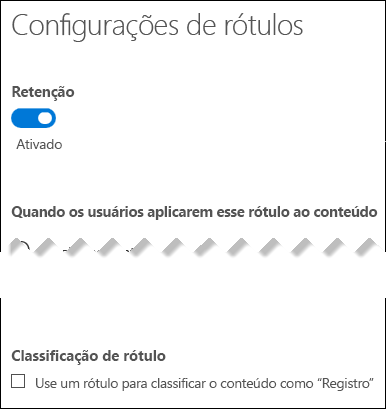
  
Quando um item é rotulado como registro, ocorrem quatro coisas:
  
- Não é possível excluir o item não permanentemente.
    
- Não é possível editar o item.
    
- Não é possível alterar o rótulo.
    
- Não é possível remover o rótulo.
    
### <a name="who-can-classify-content-as-a-record"></a>Quem pode classificar o conteúdo como registro

Para o conteúdo do SharePoint, qualquer usuário do grupo padrão Membros (o nível de permissão Contribuição) pode aplicar um rótulo de registro ao conteúdo. Somente o administrador do conjunto de sites pode remover ou alterar esse rótulo de retenção após a aplicação. Além disso, um rótulo de retenção que classifica o conteúdo como registro pode ser [aplicado automaticamente ao conteúdo](#auto-apply-retention-labels).
  
### <a name="records-and-folders"></a>Registros e pastas

Você pode aplicar um rótulo de retenção a uma pasta no Exchange, SharePoint ou OneDrive. Se uma pasta for rotulada como registro, e você mover um item para a pasta, o item será rotulado como registro. Quando você move o item para fora da pasta, o item continua rotulado como registro.
  
### <a name="records-cant-be-deleted"></a>Não é possível excluir registros

Se você tentar excluir um registro no Exchange, o item será movido para a pasta Itens Recuperáveis, conforme descrito em [Como funciona uma política de retenção com conteúdo in-loco](retention-policies.md#how-a-retention-policy-works-with-content-in-place).
  
Se você tentar excluir um registro no SharePoint, verá um erro informando que o item não foi excluído, e o item permanecerá na biblioteca.
  
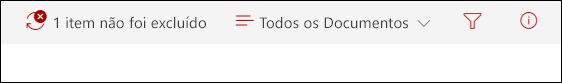
  
Se você tentar excluir um registro no OneDrive, o item será movido para a biblioteca de Retenção para Preservação, conforme descrito em [Como funciona uma política de retenção com conteúdo in-loco](retention-policies.md#how-a-retention-policy-works-with-content-in-place).
  
## <a name="using-a-retention-label-as-a-condition-in-a-dlp-policy"></a>Usar um rótulo de retenção como condição em uma política DLP

Um rótulo de retenção pode impor ações de retenção ao conteúdo. Além disso, você pode usar um rótulo de retenção como uma condição em uma política DLP (prevenção contra perda de dados). Isso significa que uma política DLP pode impor ações de proteção, como restringir o acesso, no conteúdo que inclui um rótulo específico. 
  
Para saber mais, confira [Usar um rótulo como condição em uma política DLP](data-loss-prevention-policies.md#using-a-label-as-a-condition-in-a-dlp-policy).
  
## <a name="using-the-label-activity-explorer-and-the-data-governance-reports"></a>Usar o Explorador de Atividade de Rótulo e os relatórios de governança de dados

Após a publicação ou aplicação automática dos rótulos de retenção, convém verificar se eles estão sendo aplicados ao conteúdo da forma pretendida. Para monitorar seus rótulos de retenção, use o:
  
- **Explorador de Atividade de Rótulo**. Com o explorador (exibido abaixo), você pode pesquisar e exibir rapidamente a atividade do rótulo para todo o conteúdo no SharePoint e OneDrive for Business nos últimos 30 dias. Para saber mais, confira [Exibir a atividade do rótulo para documentos](view-label-activity-for-documents.md).
    
- **Relatórios de governança de dados**. Com esses relatórios, você pode exibir rapidamente as tendências e atividades do rótulo de retenção para todo o conteúdo no Exchange, SharePoint e OneDrive for Business nos últimos 90 dias. Para saber mais, confira [Exibir relatórios de governança de dados](view-the-data-governance-reports.md).
    

  
## <a name="using-content-search-to-find-all-content-with-a-specific-retention-label-applied-to-it"></a>Usar a Pesquisa de Conteúdo para localizar todo o conteúdo com um rótulo de retenção específico aplicado

Após a atribuição dos rótulos de retenção ao conteúdo, por usuários ou automaticamente, você pode usar a pesquisa de conteúdo no Centro de Conformidade &amp; de Segurança para localizar todo o conteúdo classificado com um rótulo de retenção específico.
  
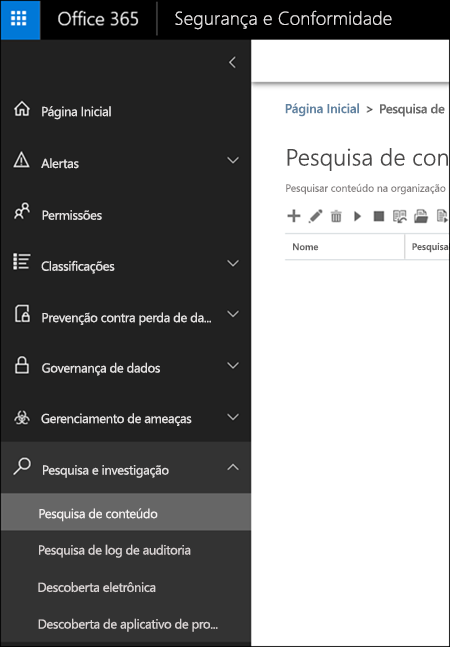
  
Quando você cria uma pesquisa de conteúdo, escolha a condição **Marca de Conformidade** e, em seguida, insira o nome do rótulo completo ou parte do nome do rótulo e use um caractere curinga. Para saber mais, confira [Consultas de palavra-chave e condições de pesquisa para Pesquisa de Conteúdo](keyword-queries-and-search-conditions.md).
  
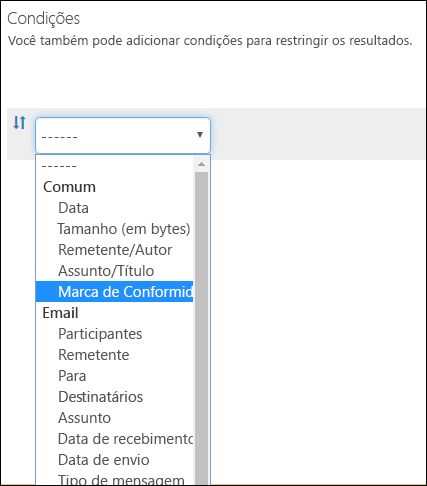
  
## <a name="the-principles-of-retention-or-what-takes-precedence"></a>Os princípios de retenção ou o que tem precedência?

É possível ou até mesmo provável que o conteúdo tenha várias políticas de retenção aplicadas a ele, cada uma com uma ação diferente (manter, excluir ou ambas) e o período de retenção. O que tem precedência? No nível mais alto, esteja certo de que o conteúdo retido por uma política não pode ser excluído permanentemente por outra política.
  
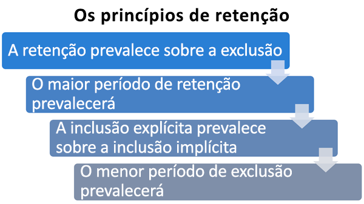
  
Para entender como os rótulos diferentes são aplicados ao conteúdo, lembre-se destes princípios de retenção:
  
1. **A retenção prevalece sobre a exclusão.** Suponha que uma política de retenção diga para excluir o email do Exchange após três anos, mas outra diga para manter o email do Exchange por cinco anos e depois excluí-lo. Qualquer conteúdo que tiver três anos será excluído e ocultado dos usuários, mas ainda será mantido na pasta Itens Recuperáveis até que o conteúdo atinja cinco anos, quando ele será permanentemente excluído. 
    
2. **O período de retenção mais longo prevalece.** Se o conteúdo estiver sujeito a várias políticas que retêm o conteúdo, ele será mantido até o final do período de retenção mais longo. 
    
3. **A inclusão explícita prevalece sobre a inclusão implícita.** Isso significa que: 
    
    1. Se um rótulo de retenção com configurações de retenção for atribuído manualmente por um usuário a um item, como um email do Exchange ou um documento do OneDrive, esse rótulo de retenção terá precedência sobre uma política atribuída no nível do site ou caixa de correio e um rótulo de retenção padrão atribuído pela biblioteca de documentos. Por exemplo, se o rótulo de retenção explícito disser para manter por dez anos, mas a política de retenção  atribuída ao site disser para manter por apenas cinco anos, o rótulo de retenção terá precedência. Observe que os rótulos de retenção de aplicação automática são considerados implícitos, não explícitos, pois são aplicados automaticamente pelo Office 365.
    
    2. Se uma política de retenção incluir um local específico, como a caixa de correio de um usuário específico ou conta OneDrive for Business, essa política terá precedência sobre outra política de retenção que se aplica a caixas de correio de todos os usuários ou contas do OneDrive for Business, mas não incluirá especificamente essa caixa de correio do usuário.
    
4. **O período de exclusão mais curto tem precedência.** Da mesma forma, se o conteúdo estiver sujeito a várias políticas que excluem o conteúdo (sem retenção), ele será excluído ao fim do período de retenção mais curto. 
    
Entenda que os princípios de retenção funcionam como um fluxo de desempate de cima para baixo: se as regras aplicadas por todas as políticas ou rótulos forem as mesmas em um nível, o fluxo se moverá para baixo até o próximo nível para determinar a precedência para a qual a regra será aplicada.
  
Por fim, uma política de retenção ou rótulo não pode excluir permanentemente qualquer conteúdo que esteja retido para Descoberta Eletrônica. Quando a retenção for liberada, o conteúdo estará novamente qualificado para o processo de limpeza descrito acima.
  
## <a name="use-retention-labels-instead-of-these-features"></a>Usar rótulos de retenção em vez destes recursos

Os rótulos de retenção podem ser disponibilizados facilmente para uma organização inteira e seu conteúdo no Office 365, incluindo Exchange, SharePoint, OneDrive e grupos do Office 365. Se você precisar classificar o conteúdo ou gerenciar registros em qualquer lugar no Office 365, recomendamos o uso de rótulos de retenção.
  
Vários outros recursos eram usados anteriormente para classificar o conteúdo ou gerenciar registros no Office 365. Confira-os abaixo. Esses recursos continuarão funcionando paralelamente aos rótulos de retenção criados no Centro de Conformidade e&amp; Segurança. Observe que, embora haja instâncias nas quais a implementação de rótulos de retenção difere dos recursos anteriores, a evolução dos rótulos de retenção conduzirá o futuro do gerenciamento de registros no Office 365. Portanto, a partir de agora, para governança de dados, recomendamos o uso de rótulos de retenção em vez desses recursos.
  
### <a name="exchange-online"></a>Exchange Online

- [Marcas de retenção e políticas de retenção](https://go.microsoft.com/fwlink/?linkid=846125), também conhecidas como [gerenciamento de registros de mensagens (MRM)](https://go.microsoft.com/fwlink/?linkid=846126) (apenas exclusão) 
    
### <a name="sharepoint-online-and-onedrive-for-business"></a>SharePoint Online e OneDrive for Business

- [Como configurar o gerenciamento de registros no local](https://support.office.com/article/7707a878-780c-4be6-9cb0-9718ecde050a) (retenção) 
    
- [Introdução à Central de Registros](https://support.office.com/article/bae6ca5a-7b19-40e0-b433-e3613a747c2c) (Retenção) 
    
- [Políticas de gerenciamento de informações](intro-to-info-mgmt-policies.md) (apenas exclusão) 
    
## <a name="permissions"></a>Permissões

Os membros da equipe de conformidade que criarão rótulos de retenção precisam de permissões para o &amp; Centro de Conformidade e Segurança. Por padrão, o administrador de locatários terá acesso a este local e poderá fornecer acesso a outras pessoas e aos responsáveis pela conformidade ao &amp; Centro de Conformidade e Segurança, sem lhes dar todas as permissões de um administrador de locatários. Para fazer isso, recomendamos que você acesse a página **Permissões** do &amp; Centro de Conformidade e Segurança, edite o grupo de função **Administrador de Conformidade** e adicione membros a esse grupo de função. 
  
Para saber mais, consulte [Dar aos usuários acesso ao &amp;Centro de Conformidade](grant-access-to-the-security-and-compliance-center.md) e Segurança do Office 365.
  
Essas permissões só serão necessárias para criar e aplicar rótulos de retenção. A imposição da política não exige acesso ao conteúdo.
  
## <a name="find-the-powershell-cmdlets-for-labels"></a>Encontrar os cmdlets do PowerShell para rótulos

Para usar cmdlets de rótulo, você precisa:
  
1. [Conecte-se ao PowerShell do Centro de Conformidade e Segurança do Office 365](https://docs.microsoft.com/powershell/exchange/office-365-scc/connect-to-scc-powershell/connect-to-scc-powershell)
    
2. Use esses cmdlets do Centro de Conformidade e Segurança do Office 365

  - [Get-ComplianceTag](https://docs.microsoft.com/powershell/module/exchange/policy-and-compliance-retention/get-compliancetag)

  - [New-ComplianceTag](https://docs.microsoft.com/powershell/module/exchange/policy-and-compliance-retention/new-compliancetag)

  - [Remove-ComplianceTag](https://docs.microsoft.com/powershell/module/exchange/policy-and-compliance-retention/remove-compliancetag)

  - [Set-ComplianceTag](https://docs.microsoft.com/powershell/module/exchange/policy-and-compliance-retention/set-compliancetag)

  - [Enable-ComplianceTagStorage](https://docs.microsoft.com/powershell/module/exchange/policy-and-compliance-retention/enable-compliancetagstorage)

  - [Get-ComplianceTagStorage](https://docs.microsoft.com/powershell/module/exchange/policy-and-compliance-retention/get-compliancetagstorage)

  - [Get-RetentionCompliancePolicy](https://docs.microsoft.com/powershell/module/exchange/policy-and-compliance-retention/get-retentioncompliancepolicy)

  - [New-RetentionCompliancePolicy](https://docs.microsoft.com/powershell/module/exchange/policy-and-compliance-retention/new-retentioncompliancepolicy)

  - [Remove-RetentionCompliancePolicy](https://docs.microsoft.com/powershell/module/exchange/policy-and-compliance-retention/remove-retentioncompliancepolicy)

  - [Set-RetentionCompliancePolicy](https://docs.microsoft.com/powershell/module/exchange/policy-and-compliance-retention/set-retentioncompliancepolicy)

  - [Get-RetentionComplianceRule](https://docs.microsoft.com/powershell/module/exchange/policy-and-compliance-retention/get-retentioncompliancerule)

  - [New-RetentionComplianceRule](https://docs.microsoft.com/powershell/module/exchange/policy-and-compliance-retention/new-retentioncompliancerule)

  - [Remove-RetentionComplianceRule](https://docs.microsoft.com/powershell/module/exchange/policy-and-compliance-retention/remove-retentioncompliancerule)

  - [Set-RetentionComplianceRule](https://docs.microsoft.com/powershell/module/exchange/policy-and-compliance-retention/set-retentioncompliancerule)

## <a name="more-information"></a>Mais informações

[Visão geral de políticas de retenção](retention-policies.md)
