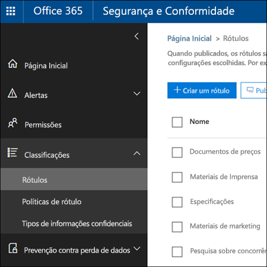

# <a name="overview-of-labels"></a><span data-ttu-id="663e5-105">Visão geral de rótulos</span><span class="sxs-lookup"><span data-stu-id="663e5-105">Overview of labels</span></span>

<span data-ttu-id="663e5-p102">Provavelmente, há em sua organização tipos de conteúdo diferentes que exigem ações diferentes para atender às normas do setor e às políticas internas. Por exemplo, você pode ter:</span><span class="sxs-lookup"><span data-stu-id="663e5-p102">Across your organization, you probably have different types of content that require different actions taken on them in order to comply with industry regulations and internal policies. For example, you might have:</span></span>
  
- <span data-ttu-id="663e5-108">Formulários fiscais que precisam ser **mantidos** por um período mínimo.</span><span class="sxs-lookup"><span data-stu-id="663e5-108">Tax forms that need to be **retained** for a minimum period of time.</span></span> 
    
- <span data-ttu-id="663e5-109">Materiais de imprensa que precisam ser **excluídos permanentemente** quando atingem uma certa idade.</span><span class="sxs-lookup"><span data-stu-id="663e5-109">Press materials that need to be **permanently deleted** when they reach a certain age.</span></span> 
    
- <span data-ttu-id="663e5-110">Pesquisa sobre a concorrência que precisa ser **mantida** e, depois, **excluída permanentemente**.</span><span class="sxs-lookup"><span data-stu-id="663e5-110">Competitive research that needs to be both **retained** and then **permanently deleted**.</span></span> 
    
- <span data-ttu-id="663e5-111">Vistos de trabalho que devem ser **marcados como um registro** para que não possam ser editados ou excluídos.</span><span class="sxs-lookup"><span data-stu-id="663e5-111">Work visas that must be **marked as a record** so that they can't be edited or deleted.</span></span> 
    
<span data-ttu-id="663e5-p103">Em todos esses casos, os rótulos no Office 365 podem ajudar você a executar as ações certas no conteúdo certo. Com os rótulos, você pode classificar os dados em toda a organização para prover governança e impor regras de retenção com base nessa classificação.</span><span class="sxs-lookup"><span data-stu-id="663e5-p103">In all of these cases, labels in Office 365 can help you take the right actions on the right content. With labels, you can classify data across your organization for governance, and enforce retention rules based on that classification.</span></span>
  
<span data-ttu-id="663e5-114">Com os rótulos, você pode:</span><span class="sxs-lookup"><span data-stu-id="663e5-114">With labels, you can:</span></span>
  
- <span data-ttu-id="663e5-p104">**Permitir que pessoas na sua organização apliquem um rótulo manualmente** ao conteúdo no Outlook na Web, Outlook 2010 e posterior, OneDrive, SharePoint e grupos do Office 365. Os usuários geralmente sabem melhor o tipo de conteúdo com o qual estão trabalhando, portanto, podem classificá-lo e aplicar a política apropriada.</span><span class="sxs-lookup"><span data-stu-id="663e5-p104">**Enable people in your organization to apply a label manually** to content in Outlook on the web, Outlook 2010 and later, OneDrive, SharePoint, and Office 365 groups. Users often know best what type of content they're working with, so they can classify it and have the appropriate policy applied.</span></span> 
    
- <span data-ttu-id="663e5-117">**Aplique automaticamente os rótulos ao conteúdo** que corresponder a condições específicas, por exemplo, quando o conteúdo apresenta:</span><span class="sxs-lookup"><span data-stu-id="663e5-117">**Apply labels to content automatically** if it matches specific conditions, such as when the content contains:</span></span> 
    
  - <span data-ttu-id="663e5-118">Tipos específicos de informações confidenciais.</span><span class="sxs-lookup"><span data-stu-id="663e5-118">Specific types of sensitive information.</span></span>
    
  - <span data-ttu-id="663e5-119">Palavras-chave específicas que correspondem a uma consulta criada por você.</span><span class="sxs-lookup"><span data-stu-id="663e5-119">Specific keywords that match a query you create.</span></span>
    
    <span data-ttu-id="663e5-120">A capacidade de aplicar rótulos automaticamente ao conteúdo é importante porque:</span><span class="sxs-lookup"><span data-stu-id="663e5-120">The ability to apply labels to content automatically is important because:</span></span>
    
  - <span data-ttu-id="663e5-121">Você não precisa treinar os usuários com relação a todas as suas classificações.</span><span class="sxs-lookup"><span data-stu-id="663e5-121">You don't need to train your users on all of your classifications.</span></span>
    
  - <span data-ttu-id="663e5-122">Você não precisa depender dos usuários para classificar corretamente o conteúdo.</span><span class="sxs-lookup"><span data-stu-id="663e5-122">You don't need to rely on users to classify all content correctly.</span></span>
    
  - <span data-ttu-id="663e5-123">Os usuários não precisam mais conhecer as políticas de governança de dados; em vez disso, eles podem se concentrar no próprio trabalho.</span><span class="sxs-lookup"><span data-stu-id="663e5-123">Users no longer need to know about data governance policies - they can instead focus on their work.</span></span>
    
    <span data-ttu-id="663e5-124">Observe que os rótulos de aplicação automática exigem uma assinatura do Office 365 Enterprise E5.</span><span class="sxs-lookup"><span data-stu-id="663e5-124">Note that auto-apply labels require an Office 365 Enterprise E5 subscription.</span></span>
    
- <span data-ttu-id="663e5-125">**Aplique um rótulo padrão a uma biblioteca de documentos** em sites de grupo do SharePoint ou do Office 365, de forma que todos os documentos nessa biblioteca recebam o rótulo padrão.</span><span class="sxs-lookup"><span data-stu-id="663e5-125">**Apply a default label to a document library** in SharePoint and Office 365 group sites, so that all documents in that library get the default label.</span></span> 
    
- <span data-ttu-id="663e5-p105">**Implemente o gerenciamento de registros no Office 365**, incluindo em emails e documentos. Você pode usar um rótulo para classificar o conteúdo como registro. Quando isso acontece, o rótulo não pode ser alterado ou removido, e o conteúdo não pode ser editado ou excluído.</span><span class="sxs-lookup"><span data-stu-id="663e5-p105">**Implement records management across Office 365**, including both email and documents. You can use a label to classify content as a record. When this happens, the label can't be changed or removed, and the content can't be edited or deleted.</span></span> 
    
<span data-ttu-id="663e5-129">Crie e gerencie rótulos na página **Rótulos** no Centro de Conformidade &amp; Segurança do Office 365.</span><span class="sxs-lookup"><span data-stu-id="663e5-129">You create and manage labels on the **Labels** page in the Office 365 Security &amp; Compliance Center.</span></span> 
  

 
## <a name="how-labels-work-with-label-policies"></a><span data-ttu-id="663e5-131">Como os rótulos funcionam com as políticas de rótulo</span><span class="sxs-lookup"><span data-stu-id="663e5-131">How labels work with label policies</span></span>

<span data-ttu-id="663e5-p106">A disponibilização dos rótulos para as pessoas da sua organização, para que elas possam classificar o conteúdo, é um processo de duas etapas: primeiro você cria os rótulos e, depois, os publica nos locais escolhidos. Quando você publica os rótulos, uma política de rótulos é criada.</span><span class="sxs-lookup"><span data-stu-id="663e5-p106">Making labels available to people in your organization so that they can classify content is a two-step process: first you create the labels, and then you publish them to the locations you choose. When you publish labels, a label policy gets created.</span></span>
  

  
<span data-ttu-id="663e5-p107">Os rótulos são blocos de construção independentes e reutilizáveis, incluídos em uma política de rótulos e publicados em locais diferentes. Eles podem ser reutilizados em várias políticas. O objetivo principal da política de rótulos é agrupar os rótulos e especificar os locais nos quais você deseja exibi-los.</span><span class="sxs-lookup"><span data-stu-id="663e5-p107">Labels are independent, reusable building blocks that are included in a label policy and published to different locations. Labels can be reused across many policies. The primary purpose of the label policy is to group a set of labels and specify the locations where you want those labels to appear.</span></span>
  

  
1. <span data-ttu-id="663e5-p108">Ao publicar os rótulos, eles são incluídos em uma política de rótulos. Um único rótulo pode ser incluído em muitas políticas.</span><span class="sxs-lookup"><span data-stu-id="663e5-p108">When you publish labels, they're included in a label policy. A single label can be included in many policies.</span></span>
    
2. <span data-ttu-id="663e5-141">As políticas de rótulo especificam os locais de publicação dos rótulos.</span><span class="sxs-lookup"><span data-stu-id="663e5-141">Label policies specify the locations to publish the labels.</span></span>
    
## <a name="only-one-label-at-a-time"></a><span data-ttu-id="663e5-142">Apenas um rótulo por vez</span><span class="sxs-lookup"><span data-stu-id="663e5-142">Only one label at a time</span></span>

<span data-ttu-id="663e5-143">É importante saber que um conteúdo como email ou documento só pode receber um único rótulo por vez:</span><span class="sxs-lookup"><span data-stu-id="663e5-143">It's important to know that content like an email or document can have only a single label assigned to it at a time:</span></span>
  
- <span data-ttu-id="663e5-144">No caso dos rótulos atribuídos manualmente por usuários finais, as pessoas podem remover ou alterar o rótulo.</span><span class="sxs-lookup"><span data-stu-id="663e5-144">For labels assigned manually by end users, people can remove or change the label that's assigned.</span></span>
    
- <span data-ttu-id="663e5-145">Se o conteúdo tiver um rótulo de aplicação automática, um rótulo de aplicação automática pode ser substituído por um rótulo atribuído manualmente por um usuário final.</span><span class="sxs-lookup"><span data-stu-id="663e5-145">If content has an auto-apply label assigned, an auto-apply label can be replaced by a label assigned manually by an end user.</span></span>
    
- <span data-ttu-id="663e5-146">Se o conteúdo tiver um rótulo atribuído manualmente por um usuário final, um rótulo de aplicação automática não poderá substituir o rótulo atribuído manualmente.</span><span class="sxs-lookup"><span data-stu-id="663e5-146">If content has a label assigned manually by an end user, an auto-apply label cannot replace the manually assigned label.</span></span>
    
- <span data-ttu-id="663e5-147">Se houver várias regras que atribuem um rótulo de aplicação automática, e o conteúdo atender às condições das regras, o rótulo da regra mais antiga será atribuída.</span><span class="sxs-lookup"><span data-stu-id="663e5-147">If there are multiple rules that assign an auto-apply label and content meets the conditions of multiple rules, the label for the oldest rule is assigned.</span></span>
    
<span data-ttu-id="663e5-p109">Os rótulos atribuídos manualmente são explicitamente atribuídos; os rótulos aplicados automaticamente são implicitamente atribuídos; um rótulo explícito tem precedência sobre um rótulo implícito. Para saber mais, confira a seção abaixo sobre [Os princípios de retenção ou o que tem precedência?](labels.md#principles).</span><span class="sxs-lookup"><span data-stu-id="663e5-p109">Manually assigned labels are explicitly assigned; auto-apply labels are implicitly assigned; an explicit label takes precedence over an implicit label. For more information, see the below section on [The principles of retention, or what takes precedence?](labels.md#principles).</span></span>
  
## <a name="how-long-it-takes-for-labels-to-take-effect"></a><span data-ttu-id="663e5-150">Quanto tempo demora até os rótulos entrarem em vigor</span><span class="sxs-lookup"><span data-stu-id="663e5-150">How long it takes for labels to take effect</span></span>

<span data-ttu-id="663e5-151">Quando você publica ou aplica rótulos automaticamente, eles não entram em vigor imediatamente:</span><span class="sxs-lookup"><span data-stu-id="663e5-151">When you publish or auto-apply labels, they don't take effect immediately:</span></span>
  
1. <span data-ttu-id="663e5-152">Primeiro, a política de rótulos precisa ser sincronizada com os locais na política no Centro de Conformidade &amp; Segurança.</span><span class="sxs-lookup"><span data-stu-id="663e5-152">First the label policy needs to be synced from the Security &amp; Compliance Center to the locations in the policy.</span></span>
    
2. <span data-ttu-id="663e5-p110">Depois, o local pode precisar de algum tempo para disponibilizar os rótulos manuais para os usuários finais, ou aplicar rótulos automaticamente ao conteúdo. Quanto tempo isso demora depende do local e do tipo de rótulo.</span><span class="sxs-lookup"><span data-stu-id="663e5-p110">Then the location may require time to make manual labels available to end users or auto-apply labels to content. How long this takes depends on the location and type of label.</span></span>
    
### <a name="manual-labels"></a><span data-ttu-id="663e5-155">Rótulos manuais</span><span class="sxs-lookup"><span data-stu-id="663e5-155">Manual labels</span></span>

<span data-ttu-id="663e5-p111">Se você publicar rótulos no SharePoint ou no OneDrive, talvez demore um dia para que esses rótulos apareçam para os usuários finais. Além disso, se você publicar os rótulos no Exchange, talvez demore sete dias para que eles apareçam para os usuários finais, e a caixa de correio deles deve conter pelo menos 10 MB de dados.</span><span class="sxs-lookup"><span data-stu-id="663e5-p111">If you publish labels to SharePoint or OneDrive, it can take one day for those labels to appear for end users. In addition, if you publish labels to Exchange, it can take 7 days for those labels to appear for end users, and the mailbox needs to contain at least 10 MB of data.</span></span>
  

  
### <a name="auto-apply-labels"></a><span data-ttu-id="663e5-159">Aplicar rótulos automaticamente</span><span class="sxs-lookup"><span data-stu-id="663e5-159">Auto-apply labels</span></span>

<span data-ttu-id="663e5-160">Se você aplicar automaticamente os rótulos ao conteúdo que atenda a condições específicas, talvez demore sete dias para que os rótulos sejam aplicados a todo o conteúdo que corresponde às condições.</span><span class="sxs-lookup"><span data-stu-id="663e5-160">If you auto-apply labels to content matching specific conditions, it can take seven days for the labels to be applied to all content that matches the conditions.</span></span>
  

  
### <a name="how-to-check-on-the-status-of-exchange-labels"></a><span data-ttu-id="663e5-162">Como verificar o status dos rótulos do Exchange</span><span class="sxs-lookup"><span data-stu-id="663e5-162">How to check on the status of Exchange labels</span></span>

<span data-ttu-id="663e5-p112">No Exchange Online, os rótulos são disponibilizados para os usuários finais por um processo executado a cada sete dias. Usando o Powershell, é possível ver quando esse processo foi executado pela última vez e, assim, determinar quando ele será executado novamente.</span><span class="sxs-lookup"><span data-stu-id="663e5-p112">In Exchange Online, labels are made available to end users by a process that runs every seven days. By using Powershell, you can see when this process last ran and thus determine when it will run again.</span></span>
  
1. <span data-ttu-id="663e5-165">[Conectar-se ao Exchange Online PowerShell](https://go.microsoft.com/fwlink/?linkid=799773).</span><span class="sxs-lookup"><span data-stu-id="663e5-165">[Connect to Exchange Online PowerShell](https://go.microsoft.com/fwlink/?linkid=799773).</span></span>
    
2. <span data-ttu-id="663e5-166">Execute estes comandos.</span><span class="sxs-lookup"><span data-stu-id="663e5-166">Run these commands.</span></span>
    
  ```
  $logProps = Export-MailboxDiagnosticLogs <user> -ExtendedProperties
  ```

  ```
  $xmlprops = [xml]($logProps.MailboxLog)
  ```

  ```
  $xmlprops.Properties.MailboxTable.Property | ? {$_.Name -like "ELC*"}
  ```

    <span data-ttu-id="663e5-p113">Nos resultados, a propriedade `ELCLastSuccessTimeStamp` (UTC) mostra quando o sistema processou sua caixa de correio pela última vez. Se isso não tiver ocorrido desde quando você criou a política, os rótulos não serão exibidos. Para forçar o processamento, execute `Start-ManagedFolderAssistant -Identity <user>`.</span><span class="sxs-lookup"><span data-stu-id="663e5-p113">In the results, the  `ELCLastSuccessTimeStamp` (UTC) property shows when the system last processed your mailbox. If it has not happened since the time you created the policy, the labels are not going to appear. To force processing, run  `Start-ManagedFolderAssistant -Identity <user>`.</span></span>
    
    <span data-ttu-id="663e5-170">Se os rótulos não estiverem aparecendo no Outlook na Web, e você achar que deveriam aparecer, limpe o cache do navegador (CTRL + F5).</span><span class="sxs-lookup"><span data-stu-id="663e5-170">If labels aren't appearing in Outlook on the web and you think they should be, make sure to clear the cache in your browser (CTRL+F5).</span></span>
    
## <a name="label-policies-and-locations"></a><span data-ttu-id="663e5-171">Políticas e locais de rótulo</span><span class="sxs-lookup"><span data-stu-id="663e5-171">Label policies and locations</span></span>

<span data-ttu-id="663e5-172">É possível publicar tipos diferentes de rótulos em locais diferentes, dependendo do que o rótulo faz.</span><span class="sxs-lookup"><span data-stu-id="663e5-172">Different types of labels can be published to different locations, depending on what the label does.</span></span>
  
|<span data-ttu-id="663e5-173">**Se o rótulo for...**.</span><span class="sxs-lookup"><span data-stu-id="663e5-173">**If the label is…**</span></span>|<span data-ttu-id="663e5-174">**A política do rótulo poderá ser aplicada a...**</span><span class="sxs-lookup"><span data-stu-id="663e5-174">**Then the label policy can be applied to…**</span></span>|
|:-----|:-----|
|<span data-ttu-id="663e5-175">Publicado para usuários finais</span><span class="sxs-lookup"><span data-stu-id="663e5-175">Published to end users</span></span>  <br/> |<span data-ttu-id="663e5-176">Exchange, SharePoint, OneDrive, grupos do Office 365</span><span class="sxs-lookup"><span data-stu-id="663e5-176">Exchange, SharePoint, OneDrive, Office 365 groups</span></span>  <br/> |
|<span data-ttu-id="663e5-177">Aplicado automaticamente com base em tipos de informações confidenciais</span><span class="sxs-lookup"><span data-stu-id="663e5-177">Auto-applied based on sensitive information types</span></span>  <br/> |<span data-ttu-id="663e5-178">Exchange (somente para todas as caixas de correio), SharePoint, OneDrive</span><span class="sxs-lookup"><span data-stu-id="663e5-178">Exchange (all mailboxes only), SharePoint, OneDrive</span></span>  <br/> |
|<span data-ttu-id="663e5-179">Aplicado automaticamente com base em uma consulta</span><span class="sxs-lookup"><span data-stu-id="663e5-179">Auto-applied based on a query</span></span>  <br/> |<span data-ttu-id="663e5-180">Exchange, SharePoint, OneDrive, grupos do Office 365</span><span class="sxs-lookup"><span data-stu-id="663e5-180">Exchange, SharePoint, OneDrive, Office 365 groups</span></span>  <br/> |
   
<span data-ttu-id="663e5-p114">Observe que, no Exchange, os rótulos de aplicação automática (para consultas e tipos de informações confidenciais) são aplicados apenas a mensagens recentemente enviadas (dado em trânsito), não a todos os itens na caixa de correio (dados em repouso). Além disso, a aplicação automática de rótulos para tipos de informações confidenciais só pode ocorrer para todas as caixas de correio; não é possível selecionar caixas de correio específicas.</span><span class="sxs-lookup"><span data-stu-id="663e5-p114">Note that in Exchange, auto-apply labels (for both queries and sensitive information types) are applied only to messages newly sent (data in transit), not to all items currently in the mailbox (data at rest). Also, auto-apply labels for sensitive information types can apply only to all mailboxes; you can't select the specific mailboxes.</span></span>
  
<span data-ttu-id="663e5-183">As pastas públicas do Exchange e o Skype não dão suporte a rótulos.</span><span class="sxs-lookup"><span data-stu-id="663e5-183">Note that Exchange public folders and Skype do not support labels.</span></span>
  
## <a name="how-labels-enforce-retention"></a><span data-ttu-id="663e5-184">Como os rótulos impõem a retenção</span><span class="sxs-lookup"><span data-stu-id="663e5-184">How labels enforce retention</span></span>

<span data-ttu-id="663e5-p115">Os rótulos podem impor exatamente as mesmas ações de retenção que uma política de retenção. Use rótulos para implementar um plano de conteúdo sofisticado (ou plano de arquivo). Para saber mais sobre como funciona a retenção, confira [Visão geral das políticas de retenção](retention-policies.md).</span><span class="sxs-lookup"><span data-stu-id="663e5-p115">Labels can enforce exactly the same retention actions that a retention policy can. You can use labels to implement a sophisticated content plan (or file plan). For more information on how retention works, see [Overview of retention policies](retention-policies.md).</span></span>
  
<span data-ttu-id="663e5-p116">Além disso, um rótulo tem duas opções de retenção, disponíveis apenas em um rótulo, e não em uma política de retenção. Com um rótulo, você pode:</span><span class="sxs-lookup"><span data-stu-id="663e5-p116">In addition, a label has two retention options that are available only in a label and not in a retention policy. With a label, you can:</span></span>
  
- <span data-ttu-id="663e5-p117">Disparar uma revisão de disposição ao final do período de retenção, de modo que os documentos do SharePoint e do OneDrive sejam revisados antes de serem excluídos. Para saber mais, confira [Visão geral das revisões de disposição](disposition-reviews.md).</span><span class="sxs-lookup"><span data-stu-id="663e5-p117">Trigger a disposition review at the end of the retention period, so that SharePoint and OneDrive documents must be reviewed before they can be deleted. For more information, see [Overview of disposition reviews](disposition-reviews.md).</span></span>
    
- <span data-ttu-id="663e5-192">Iniciar o período de retenção a partir do momento de aplicação do rótulo no conteúdo, em vez da idade do conteúdo ou da última modificação.</span><span class="sxs-lookup"><span data-stu-id="663e5-192">Start the retention period from when the content was labeled, instead of the age of the content or when it was last modified.</span></span>
    

  
## <a name="where-published-labels-can-appear-to-end-users"></a><span data-ttu-id="663e5-194">Onde os rótulos publicados podem aparecer aos usuários finais</span><span class="sxs-lookup"><span data-stu-id="663e5-194">Where published labels can appear to end users</span></span>

<span data-ttu-id="663e5-195">Se o seu rótulo for atribuído ao conteúdo por usuários finais, você poderá publicá-lo no:</span><span class="sxs-lookup"><span data-stu-id="663e5-195">If your label will be assigned to content by end users, you can publish it to:</span></span>
  
- <span data-ttu-id="663e5-196">Outlook na Web</span><span class="sxs-lookup"><span data-stu-id="663e5-196">Outlook on the web</span></span>
    
- <span data-ttu-id="663e5-197">Outlook 2010 e posterior</span><span class="sxs-lookup"><span data-stu-id="663e5-197">Outlook 2010 and later</span></span>
    
- <span data-ttu-id="663e5-198">OneDrive</span><span class="sxs-lookup"><span data-stu-id="663e5-198">OneDrive</span></span>
    
- <span data-ttu-id="663e5-199">SharePoint</span><span class="sxs-lookup"><span data-stu-id="663e5-199">SharePoint</span></span>
    
- <span data-ttu-id="663e5-200">Grupos do Office 365 (o site do grupo e a caixa de correio do grupo no Outlook na Web)</span><span class="sxs-lookup"><span data-stu-id="663e5-200">Office 365 groups (both the group site and group mailbox in Outlook on the web)</span></span>
    
<span data-ttu-id="663e5-201">As seções a seguir mostram como os rótulos serão exibidos em aplicativos diferentes para as pessoas em sua organização.</span><span class="sxs-lookup"><span data-stu-id="663e5-201">The sections below show how labels will appear in different apps to people in your organization.</span></span>
  
### <a name="outlook-on-the-web"></a><span data-ttu-id="663e5-202">Outlook na Web</span><span class="sxs-lookup"><span data-stu-id="663e5-202">Outlook on the web</span></span>

<span data-ttu-id="663e5-203">Para rotular um item no Outlook na Web, clique com o botão direito no item \> **Atribuir Política** \> escolha o rótulo.</span><span class="sxs-lookup"><span data-stu-id="663e5-203">To label an item in Outlook on the web, right-click the item \> **Assign policy** \> choose the label.</span></span> 
  

  
<span data-ttu-id="663e5-p118">Após a aplicação do rótulo, você poderá exibir esse rótulo e a ação necessária na parte superior do item. Se um email for classificado e tiver um período de retenção associado, você poderá saber rapidamente quando o email expirará.</span><span class="sxs-lookup"><span data-stu-id="663e5-p118">After the label is applied, you can view that label and what action it takes at the top of the item. If an email is classified and has an associated retention period, you can know at a glance when the email will expire.</span></span>
  

  
<span data-ttu-id="663e5-208">Você também pode aplicar os rótulos a pastas e, nesse caso:</span><span class="sxs-lookup"><span data-stu-id="663e5-208">You can also apply labels to folders, in which case:</span></span>
  
- <span data-ttu-id="663e5-p119">Todos os itens recebem automaticamente o mesmo rótulo, **exceto** itens que receberam um rótulo explicitamente aplicado. Itens rotulados explicitamente mantêm o rótulo existente. Para saber mais, confira a seção abaixo sobre os princípios de retenção.</span><span class="sxs-lookup"><span data-stu-id="663e5-p119">All items in the folder automatically get the same label, **except** for items that have had a label applied explicitly to them. Explicitly labeled items keep their existing label. For more information, see the below section on the principles of retention.</span></span> 
    
- <span data-ttu-id="663e5-212">Se você alterar ou remover o rótulo padrão de uma pasta, ele também será alterado ou removido para todos os itens na pasta, **exceto** itens com rótulos explícitos.</span><span class="sxs-lookup"><span data-stu-id="663e5-212">If you change or remove the default label for a folder, the label's also changed or removed for all items in the folder, **except** items with explicit labels.</span></span> 
    
- <span data-ttu-id="663e5-213">Se você mover um item com um rótulo padrão de uma pasta para outra com um rótulo padrão diferente, o item receberá o novo rótulo padrão.</span><span class="sxs-lookup"><span data-stu-id="663e5-213">If you move an item with a default label from one folder to another folder with a different default label, the item will get the new default label.</span></span>
    
- <span data-ttu-id="663e5-214">Se você mover um item com um rótulo padrão de uma pasta para outra sem um rótulo padrão, o rótulo padrão antigo será removido.</span><span class="sxs-lookup"><span data-stu-id="663e5-214">If you move an item with a default label from one folder to another folder with no default label, the old default label is removed.</span></span>
    
### <a name="outlook-2010-and-later"></a><span data-ttu-id="663e5-215">Outlook 2010 e posterior</span><span class="sxs-lookup"><span data-stu-id="663e5-215">Outlook 2010 and later</span></span>

<span data-ttu-id="663e5-216">Para rotular um item no Outlook na Web, clique com o botão direito no item \> na **Faixa de Opções** \> **Atribuir Política** \> escolha o rótulo.</span><span class="sxs-lookup"><span data-stu-id="663e5-216">To label an item in Outlook on the web, right-click the item \> on the **Ribbon** \> **Assign Policy** \> choose the label.</span></span> 
  

  
<span data-ttu-id="663e5-p120">Após a aplicação do rótulo, você poderá exibir esse rótulo e a ação necessária na parte superior do item. Se um email for classificado e tiver um período de retenção associado, você poderá saber rapidamente quando o email expirará.</span><span class="sxs-lookup"><span data-stu-id="663e5-p120">After the label is applied, you can view that label and what action it takes at the top of the item. If an email is classified and has an associated retention period, you can know at a glance when the email will expire.</span></span>
  
<span data-ttu-id="663e5-p121">Você também pode aplicar rótulos a pastas. Isso funciona no Outlook 2010 ou posterior da mesma maneira que funciona no Outlook na Web. Confira a seção anterior para saber mais.</span><span class="sxs-lookup"><span data-stu-id="663e5-p121">You can also apply labels to folders. This works the same in Outlook 2010 and later as it does in Outlook on the web -- see the previous section for more info.</span></span>
  
### <a name="onedrive-and-sharepoint"></a><span data-ttu-id="663e5-222">OneDrive e SharePoint</span><span class="sxs-lookup"><span data-stu-id="663e5-222">OneDrive and SharePoint</span></span>

<span data-ttu-id="663e5-223">Para rotular um documento (incluindo arquivos do OneNote) no OneDrive ou SharePoint, selecione o item \> no canto superior direito, escolha **Abrir no painel de detalhes** \> **Aplicar rótulo** \> escolha o rótulo.</span><span class="sxs-lookup"><span data-stu-id="663e5-223">To label a document (including OneNote files) in OneDrive or SharePoint, select the item \> in the upper-right corner, choose **Open the details pane** \> **Apply label** \> choose the label.</span></span> 
  
<span data-ttu-id="663e5-224">Observe que você também pode aplicar um rótulo a uma pasta ou conjunto de documentos, e você pode definir um rótulo padrão para uma biblioteca de documentos. Confira a seção abaixo para saber mais.</span><span class="sxs-lookup"><span data-stu-id="663e5-224">Note that you can also apply a label to a folder or document set, and you can set a default label for a document library - see the section below for more information.</span></span>
  

  
<span data-ttu-id="663e5-226">Após a aplicação de um rótulo a um item, será possível exibi-lo no painel de detalhes após a seleção do item.</span><span class="sxs-lookup"><span data-stu-id="663e5-226">After a label is applied to an item, you can view it in the details pane when that item's selected.</span></span>
  

  
<span data-ttu-id="663e5-p122">Também é possível criar um modo de exibição da biblioteca que contém a coluna **Rótulos** ou a coluna **Item é um Registro**, para que você possa ver rapidamente os rótulos atribuídos a todos os itens e quais itens são registros. No entanto, você não pode filtrar o modo de exibição pela coluna **Item é um Registro**.</span><span class="sxs-lookup"><span data-stu-id="663e5-p122">You can also create a view of the library that contains the **Labels** column or **Item is a Record** column, so that you can see at a glance the labels assigned to all items and which items are records. Note, however, that you can't filter the view by the **Item is a Record** column.</span></span> 
  

  
### <a name="office-365-groups"></a><span data-ttu-id="663e5-231">Grupos do Office 365</span><span class="sxs-lookup"><span data-stu-id="663e5-231">Office 365 groups</span></span>

<span data-ttu-id="663e5-p123">Ao publicar rótulos em um grupo do Office 365, eles aparecem no site do grupo e na caixa de correio do grupo no Outlook na Web. A experiência de aplicação de um rótulo ao conteúdo é idêntica à exibida acima para email e documentos.</span><span class="sxs-lookup"><span data-stu-id="663e5-p123">When you publish labels to an Office 365 group, the labels appear in both the group site and group mailbox in Outlook on the web. The experience of applying a label to content is identical to that shown above for email and documents.</span></span>
  
## <a name="applying-a-label-automatically-based-on-conditions"></a><span data-ttu-id="663e5-234">Aplicar um rótulo automaticamente com base em condições</span><span class="sxs-lookup"><span data-stu-id="663e5-234">Applying a label automatically based on conditions</span></span>

<span data-ttu-id="663e5-p124">Um dos recursos mais avançados dos rótulos é a capacidade de aplicá-los automaticamente ao conteúdo que atende a certas condições. Nesse caso, as pessoas em sua organização não precisam aplicar os rótulos, o Office 365 faz isso por elas.</span><span class="sxs-lookup"><span data-stu-id="663e5-p124">One of the most powerful features of labels is the ability to apply them automatically to content that matches certain conditions. In this case, people in your organization don't need to apply the labels - Office 365 does the work for them.</span></span>
  

  
<span data-ttu-id="663e5-238">Os rótulos de aplicação automática são excelentes porque:</span><span class="sxs-lookup"><span data-stu-id="663e5-238">Auto-apply labels are powerful because:</span></span>
  
- <span data-ttu-id="663e5-239">Você não precisa treinar os usuários com relação a todas as suas classificações.</span><span class="sxs-lookup"><span data-stu-id="663e5-239">You don't need to train your users on all of your classifications.</span></span>
    
- <span data-ttu-id="663e5-240">Você não precisa depender dos usuários para classificar corretamente o conteúdo.</span><span class="sxs-lookup"><span data-stu-id="663e5-240">You don't need to rely on users to classify all content correctly.</span></span>
    
- <span data-ttu-id="663e5-241">Os usuários não precisam mais conhecer as políticas de governança de dados; assim podem se concentrar no próprio trabalho.</span><span class="sxs-lookup"><span data-stu-id="663e5-241">Users no longer need to know about data governance policies - they can focus on their work.</span></span>
    
<span data-ttu-id="663e5-242">Você pode optar por aplicar os rótulos automaticamente ao conteúdo quando esse conteúdo apresentar:</span><span class="sxs-lookup"><span data-stu-id="663e5-242">You can choose to apply labels to content automatically when that content contains:</span></span>
  
- <span data-ttu-id="663e5-243">Tipos específicos de informações confidenciais.</span><span class="sxs-lookup"><span data-stu-id="663e5-243">Specific types of sensitive information.</span></span>
    
- <span data-ttu-id="663e5-244">Palavras-chave específicas que correspondem a uma consulta criada por você.</span><span class="sxs-lookup"><span data-stu-id="663e5-244">Specific keywords that match a query you create.</span></span>
    

  
<span data-ttu-id="663e5-246">Observe que os rótulos de aplicação automática exigem uma assinatura do Office 365 Enterprise E5, e que pode demorar até sete dias para aplicação automática desses rótulos a todo o conteúdo que atenda às condições, conforme descrito acima.</span><span class="sxs-lookup"><span data-stu-id="663e5-246">Note that auto-apply labels require an Office 365 Enterprise E5 subscription, and that it can take up to seven days for auto-apply labels to be applied to all content that matches the conditions, as described above.</span></span>
  
### <a name="auto-apply-labels-to-content-with-specific-types-of-sensitive-information"></a><span data-ttu-id="663e5-247">Aplicar automaticamente rótulos a conteúdo com tipos específicos de informações confidenciais</span><span class="sxs-lookup"><span data-stu-id="663e5-247">Auto-apply labels to content with specific types of sensitive information</span></span>

<span data-ttu-id="663e5-p125">Ao criar rótulos de aplicação automática para informações confidenciais, você vê a mesma lista de modelos de política exibida quando você cria uma política DLP (prevenção contra perda de dados). Cada modelo de política é pré-configurado para procurar tipos específicos de informações confidenciais, por exemplo, o modelo mostrado aqui procura pelo ITIN (Número de identificação de contribuinte individual) dos EUA, SSN (cadastro de pessoas físicas) e números de passaporte. Para saber mais sobre DLP, confira [Visão geral das políticas de prevenção contra perda de dados](data-loss-prevention-policies.md).</span><span class="sxs-lookup"><span data-stu-id="663e5-p125">When you create auto-apply labels for sensitive information, you see the same list of policy templates as when you create a data loss prevention (DLP) policy. Each policy template is preconfigured to look for specific types of sensitive information - for example, the template shown here looks for U.S. ITIN, SSN, and passport numbers. To learn more about DLP, see [Overview of data loss prevention policies](data-loss-prevention-policies.md).</span></span>
  

  
<span data-ttu-id="663e5-p126">Depois de selecionar um modelo de política, você pode adicionar ou remover quaisquer tipos de informações confidenciais, e pode alterar a contagem de instâncias e precisão de correspondência. No exemplo mostrado aqui, um rótulo será aplicado automaticamente apenas quando:</span><span class="sxs-lookup"><span data-stu-id="663e5-p126">After you select a policy template, you can add or remove any types of sensitive information, and you can change the instance count and match accuracy. In the example shown here, a label will be auto-applied only when:</span></span>
  
- <span data-ttu-id="663e5-p127">O conteúdo tiver entre uma e nove instâncias de qualquer um destes três tipos de informações confidenciais. Você pode excluir o valor **max** para que mude para **any**.</span><span class="sxs-lookup"><span data-stu-id="663e5-p127">The content contains between 1 and 9 instances of any of these three sensitive information types. You can delete the **max** value so that it changes to **any**.</span></span>
    
- <span data-ttu-id="663e5-p128">O tipo de informação confidencial detectado tiver uma precisão de correspondência (ou nível de confiança) de pelo menos 75. Muitos tipos de informações confidenciais são definidos com vários padrões, em que um padrão de precisão de correspondência superior exige mais evidências para ser encontrado (como palavras-chave, datas ou endereços), enquanto um padrão de precisão de correspondência inferior exige menos evidências. Resumindo, quanto menor a precisão de correspondência **min**, mais fácil será para o conteúdo atender à condição.</span><span class="sxs-lookup"><span data-stu-id="663e5-p128">The type of sensitive information that's detected has a match accuracy (or confidence level) of at least 75. Many sensitive information types are defined with multiple patterns, where a pattern with a higher match accuracy requires more evidence to be found (such as keywords, dates, or addresses), while a pattern with a lower match accuracy requires less evidence. Simply put, the lower the **min** match accuracy, the easier it is for content to match the condition.</span></span> 
    
    <span data-ttu-id="663e5-259">Se você alterar a precisão de correspondência (ou o nível de confiança), deverá usar um dos níveis de confiança usados em um padrão para esse tipo de informação confidencial, conforme definido em [O que os tipos de informações confidenciais procuram](what-the-sensitive-information-types-look-for.md).</span><span class="sxs-lookup"><span data-stu-id="663e5-259">If you change the match accuracy (or confidence level), you should use one of confidence levels used in a pattern for that type of sensitive information, as defined in [What the sensitive information types look for](what-the-sensitive-information-types-look-for.md).</span></span>
    

  
### <a name="auto-apply-labels-to-content-with-specific-keywords-or-searchable-properties"></a><span data-ttu-id="663e5-261">Aplicar automaticamente rótulos ao conteúdo com palavras-chave específicas ou propriedades pesquisáveis</span><span class="sxs-lookup"><span data-stu-id="663e5-261">Auto-apply labels to content with specific keywords</span></span>

<span data-ttu-id="663e5-p129">Você pode aplicar automaticamente os rótulos ao conteúdo que atenda a certas condições. As condições disponíveis agora dão suporte à aplicação de um rótulo ao conteúdo que inclui palavras ou frases específicas, ou propriedades pesquisáveis. Você pode refinar a consulta usando os operadores de pesquisa AND, OR e NOT. Para saber mais sobre esses operadores e sintaxe de consulta, confira:</span><span class="sxs-lookup"><span data-stu-id="663e5-p129">You can auto-apply labels to content that satisfies certain conditions. The conditions available now support applying a label to content that contains specific words or phrases. You can refine your query by using search operators like AND, OR, and NOT. For more information on operators, see Keyword queries and search conditions for Content Search.</span></span>

- [<span data-ttu-id="663e5-266">Consultas de palavra-chave e condições de pesquisa para Pesquisa de Conteúdo</span><span class="sxs-lookup"><span data-stu-id="663e5-266">Keyword queries and search conditions for Content Search</span></span>](keyword-queries-and-search-conditions.md)
- [<span data-ttu-id="663e5-267">Referência de sintaxe da Linguagem de Consulta de Palavra-chave (KQL)</span><span class="sxs-lookup"><span data-stu-id="663e5-267">Keyword Query Language (KQL) syntax reference (DMC)</span></span>](https://docs.microsoft.com/pt-BR/sharepoint/dev/general-development/keyword-query-language-kql-syntax-reference)
  
<span data-ttu-id="663e5-268">Consultas de exemplos:</span><span class="sxs-lookup"><span data-stu-id="663e5-268">Examples of search queries</span></span>

- <span data-ttu-id="663e5-269">Exchange</span><span class="sxs-lookup"><span data-stu-id="663e5-269">Exchange</span></span>
    - <span data-ttu-id="663e5-270">assunto:"Finanças trimestrais"</span><span class="sxs-lookup"><span data-stu-id="663e5-270">subject:"Quarterly Financials"</span></span>
- <span data-ttu-id="663e5-271">SharePoint e OneDrive for Business</span><span class="sxs-lookup"><span data-stu-id="663e5-271">SharePoint Online and OneDrive for Business</span></span>
    - <span data-ttu-id="663e5-272">contenttype:contract</span><span class="sxs-lookup"><span data-stu-id="663e5-272">contenttype:contract</span></span>
    - <span data-ttu-id="663e5-273">site:`https://contoso.sharepoint.com/sites/teams/procurement` AND contenttype:contract</span><span class="sxs-lookup"><span data-stu-id="663e5-273">site:`https://contoso.sharepoint.com/sites/teams/procurement` AND contenttype:contract</span></span>
  
<span data-ttu-id="663e5-274">Observe que os rótulos baseados em consulta usam o índice de pesquisa para identificar conteúdo.</span><span class="sxs-lookup"><span data-stu-id="663e5-274">Note that query-based labels use the search index to identify content.</span></span>
  

  
## <a name="applying-a-default-label-to-all-content-in-a-sharepoint-library-folder-or-document-set"></a><span data-ttu-id="663e5-276">Aplicar um rótulo padrão a todo o conteúdo em uma biblioteca do SharePoint, pasta ou conjunto de documentos</span><span class="sxs-lookup"><span data-stu-id="663e5-276">Applying a default label to all content in a SharePoint library, folder, or document set</span></span>

<span data-ttu-id="663e5-277">Além de permitir que as pessoas apliquem um rótulo a documentos individuais, você também pode aplicar um rótulo padrão a uma biblioteca, pasta ou conjunto de documentos do SharePoint, para que todos os documentos nesse local recebam o rótulo padrão.</span><span class="sxs-lookup"><span data-stu-id="663e5-277">In addition to enabling people to apply a label to individual documents, you can also apply a default label to a SharePoint library, folder, or document set, so that all documents in that location get the default label.</span></span>
  
<span data-ttu-id="663e5-p130">Para uma biblioteca de documentos, isso é feito na página **Configurações da biblioteca** de uma biblioteca de documentos. Ao escolher o rótulo padrão, você também pode optar por aplicá-lo a todos os itens existentes na biblioteca.</span><span class="sxs-lookup"><span data-stu-id="663e5-p130">For a document library, this is done on the **Library settings** page for a document library. When you choose the default label, you can also choose to apply it to any existing items in the library.</span></span> 
  
<span data-ttu-id="663e5-280">Por exemplo, se tiver uma marca para materiais de marketing, e souber que uma biblioteca de documentos específica incluirá apenas esse tipo de conteúdo, você poderá tornar padrão a marca de Materiais de Marketing para todos os documentos nessa biblioteca.</span><span class="sxs-lookup"><span data-stu-id="663e5-280">For example, if you have a tag for marketing materials, and you know a specific document library will contain only that type of content, you can make the Marketing Materials tag the default for all documents in that library.</span></span>
  

  
<span data-ttu-id="663e5-282">Se você aplicar um rótulo padrão aos itens existentes na biblioteca, pasta ou conjunto de documentos:</span><span class="sxs-lookup"><span data-stu-id="663e5-282">If you apply a default label to existing items in the library, folder, or document set:</span></span>
  
- <span data-ttu-id="663e5-p131">Todos os itens na biblioteca, pasta ou conjunto de documentos recebem automaticamente o mesmo rótulo, **exceto** itens que receberam um rótulo explicitamente aplicado. Itens rotulados explicitamente mantêm o rótulo existente. Para saber mais, confira a seção abaixo sobre [Os princípios de retenção ou o que tem precedência?](labels.md#principles).</span><span class="sxs-lookup"><span data-stu-id="663e5-p131">All items in the library, folder, or document set automatically get the same label, **except** for items that have had a label applied explicitly to them. Explicitly labeled items keep their existing label. For more information, see the below section on [The principles of retention, or what takes precedence?](labels.md#principles).</span></span>
    
- <span data-ttu-id="663e5-286">Se você alterar ou remover o rótulo padrão de uma biblioteca, pasta ou conjunto de documentos, ele também será alterado ou removido para todos os itens na biblioteca, pasta ou conjunto de documentos, **exceto** itens com rótulos explícitos.</span><span class="sxs-lookup"><span data-stu-id="663e5-286">If you change or remove the default label for a library, folder, or document set, the label's also changed or removed for all items in the library, folder, or document set, **except** items with explicit labels.</span></span> 
    
- <span data-ttu-id="663e5-287">Se você mover um item com um rótulo padrão de uma biblioteca, pasta ou conjunto de documentos para outra biblioteca, pasta ou conjunto de documentos, o item manterá o rótulo padrão existente, mesmo se o novo local tiver um rótulo padrão diferente.</span><span class="sxs-lookup"><span data-stu-id="663e5-287">If you move an item with a default label from one library, folder, or document set to another library, folder, or document set, the item keeps its existing default label, even if the new location has a different default label.</span></span>
    
## <a name="applying-a-label-to-email-by-using-rules"></a><span data-ttu-id="663e5-288">Aplicar um rótulo ao email usando regras</span><span class="sxs-lookup"><span data-stu-id="663e5-288">Applying a label to email by using rules</span></span>

<span data-ttu-id="663e5-289">No Outlook 2010 ou posterior, você pode criar regras para aplicar um rótulo ou política de retenção.</span><span class="sxs-lookup"><span data-stu-id="663e5-289">In Outlook 2010 or later, you can create rules to apply a label or retention policy.</span></span>
  
<span data-ttu-id="663e5-290">Por exemplo, você pode criar uma regra que aplica um rótulo específico a todas as mensagens enviadas de ou para um grupo de distribuição específico.</span><span class="sxs-lookup"><span data-stu-id="663e5-290">For example, you can create a rule that applies a specific label to all messages sent to or from a specific distribution group.</span></span>
  
<span data-ttu-id="663e5-291">Para criar uma regra, clique com botão direito em um item \> **Regras** \> **Criar Regra** \> **Opções Avançadas** \> **Assistente de Regras** \> **aplicar política de retenção**.</span><span class="sxs-lookup"><span data-stu-id="663e5-291">To create a rule, right-click an item \> **Rules** \> **Create Rule** \> **Advanced Options** \> **Rules Wizard** \> **apply retention policy**.</span></span>
  

  
## <a name="classifying-content-without-applying-any-actions"></a><span data-ttu-id="663e5-293">Classificação do conteúdo sem aplicar ações</span><span class="sxs-lookup"><span data-stu-id="663e5-293">Classifying content without applying any actions</span></span>

<span data-ttu-id="663e5-p132">Ao criar um rótulo, é possível fazer isso sem ativar qualquer retenção ou outras ações, conforme mostrado abaixo. Nesse caso, você pode usar um rótulo simplesmente como um rótulo de texto, sem aplicar ações.</span><span class="sxs-lookup"><span data-stu-id="663e5-p132">When you create a label, you can do so without turning on any retention or other actions, as shown below. In this case, you can use a label simply as a text label, without enforcing any actions.</span></span>
  
<span data-ttu-id="663e5-296">Por exemplo, você pode criar um rótulo chamado "Revisar depois" sem ações e, em seguida, aplicar automaticamente esse rótulo ao conteúdo com tipos de informações confidenciais ou conteúdo consultado.</span><span class="sxs-lookup"><span data-stu-id="663e5-296">For example, you can create a label named "Review later" with no actions, and then auto-apply that label to content with sensitive information types or queried content.</span></span>
  

  
## <a name="using-labels-for-records-management"></a><span data-ttu-id="663e5-298">Usar rótulos para gerenciamento de registros</span><span class="sxs-lookup"><span data-stu-id="663e5-298">Using labels for records management</span></span>

<span data-ttu-id="663e5-299">Em um nível alto, o gerenciamento de registros significa que:</span><span class="sxs-lookup"><span data-stu-id="663e5-299">At a high level, records management means that:</span></span>
  
- <span data-ttu-id="663e5-300">O conteúdo importante é classificado como um registro pelos usuários.</span><span class="sxs-lookup"><span data-stu-id="663e5-300">Important content is classified as a record by users.</span></span>
    
- <span data-ttu-id="663e5-301">Um registro não pode ser modificado ou excluído.</span><span class="sxs-lookup"><span data-stu-id="663e5-301">A record can't be modified or deleted.</span></span>
    
- <span data-ttu-id="663e5-302">Os registros são descartados após o término do tempo de vida declarado.</span><span class="sxs-lookup"><span data-stu-id="663e5-302">Records are finally disposed of after their stated lifetime is past.</span></span>
    
<span data-ttu-id="663e5-p133">Use rótulos para implementar uma estratégia de gerenciamento de registros única e consistente no Office 365, quando outros recursos de gerenciamento de registros, como a Central de Registros, se aplicarem apenas ao conteúdo do SharePoint. E imponha ações de retenção em registros, para que eles sejam descartados automaticamente ao final do ciclo de vida.</span><span class="sxs-lookup"><span data-stu-id="663e5-p133">You can use labels to implement a single, consistent records-management strategy across Office 365, whereas other records-management features such as the Record Center apply only to SharePoint content. And you can enforce retention actions on records, so that they're disposed of automatically at the end of their lifecycle.</span></span>
  
<span data-ttu-id="663e5-305">Quando você cria um rótulo, tem a opção de usar o rótulo para classificar o conteúdo como um registro.</span><span class="sxs-lookup"><span data-stu-id="663e5-305">When you create a label, you have the option to use the label to classify the content as a record.</span></span>
  

  
<span data-ttu-id="663e5-307">Quando um item é rotulado como registro, ocorrem quatro coisas:</span><span class="sxs-lookup"><span data-stu-id="663e5-307">When an item is labeled as a record, four things happen:</span></span>
  
- <span data-ttu-id="663e5-308">Não é possível excluir o item não permanentemente.</span><span class="sxs-lookup"><span data-stu-id="663e5-308">The item can't be permanently deleted.</span></span>
    
- <span data-ttu-id="663e5-309">Não é possível editar o item.</span><span class="sxs-lookup"><span data-stu-id="663e5-309">The item can't be edited.</span></span>
    
- <span data-ttu-id="663e5-310">Não é possível alterar o rótulo.</span><span class="sxs-lookup"><span data-stu-id="663e5-310">The label can't be changed.</span></span>
    
- <span data-ttu-id="663e5-311">Não é possível remover o rótulo.</span><span class="sxs-lookup"><span data-stu-id="663e5-311">The label can't be removed.</span></span>
    
### <a name="who-can-classify-content-as-a-record"></a><span data-ttu-id="663e5-312">Quem pode classificar o conteúdo como registro</span><span class="sxs-lookup"><span data-stu-id="663e5-312">Who can classify content as a record</span></span>

<span data-ttu-id="663e5-p134">Para o conteúdo do SharePoint, qualquer usuário do grupo padrão Membros (o nível de permissão Contribuição) pode aplicar um rótulo de registro ao conteúdo. Somente o administrador do conjunto de sites pode remover ou alterar esse rótulo após a aplicação. Além disso, um rótulo que classifica o conteúdo como registro precisa ser aplicado manualmente; ele não pode ser aplicado automaticamente.</span><span class="sxs-lookup"><span data-stu-id="663e5-p134">For SharePoint content, any user in the default Members group (the Contribute permission level) can apply a record label to content. Only the site collection administrator can remove or change that label after it's been applied. In addition, a label that classifies content as a record needs to be applied manually; it can't be auto-applied.</span></span>
  
### <a name="records-and-folders"></a><span data-ttu-id="663e5-316">Registros e pastas</span><span class="sxs-lookup"><span data-stu-id="663e5-316">Records and folders</span></span>

<span data-ttu-id="663e5-p135">Você pode aplicar um rótulo a uma pasta no Exchange, SharePoint ou OneDrive. Se uma pasta for rotulada como registro, e você mover um item para a pasta, o item será rotulado como registro. Quando você move o item para fora da pasta, o item continuará rotulado como registro.</span><span class="sxs-lookup"><span data-stu-id="663e5-p135">You can apply a label to a folder in Exchange, SharePoint, or OneDrive. If a folder is labeled as a record, and you move an item into the folder, the item is labeled as a record. When you move the item out of the folder, the item will continue to be labeled as a record.</span></span>
  
### <a name="records-cant-be-deleted"></a><span data-ttu-id="663e5-320">Não é possível excluir registros</span><span class="sxs-lookup"><span data-stu-id="663e5-320">Records can't be deleted</span></span>

<span data-ttu-id="663e5-321">Se você tentar excluir um registro no Exchange, o item será movido para a pasta Itens Recuperáveis, conforme descrito em [Como funciona uma política de retenção com conteúdo in-loco](retention-policies.md#how-a-retention-policy-works-with-content-in-place).</span><span class="sxs-lookup"><span data-stu-id="663e5-321">If you attempt to delete a record in Exchange, the item is moved to the Recoverable Items folder as described in [How a retention policy works with content in place](retention-policies.md#how-a-retention-policy-works-with-content-in-place).</span></span>
  
<span data-ttu-id="663e5-322">Se você tentar excluir um registro no SharePoint, verá um erro informando que o item não foi excluído, e o item permanecerá na biblioteca.</span><span class="sxs-lookup"><span data-stu-id="663e5-322">If you attempt to delete a record in a SharePoint, you see an error that the item wasn't deleted, and the item remains in the library.</span></span>
  

  
<span data-ttu-id="663e5-324">Se você tentar excluir um registro no OneDrive, o item será movido para a biblioteca de Retenção para Preservação, conforme descrito em [Como funciona uma política de retenção com conteúdo in-loco](retention-policies.md#how-a-retention-policy-works-with-content-in-place).</span><span class="sxs-lookup"><span data-stu-id="663e5-324">If you attempt to delete a record in OneDrive, the item is moved to the Preservation Hold library as described in [How a retention policy works with content in place](retention-policies.md#how-a-retention-policy-works-with-content-in-place).</span></span>
  
## <a name="using-a-label-as-a-condition-in-a-dlp-policy"></a><span data-ttu-id="663e5-325">Usar um rótulo como condição em uma política DLP</span><span class="sxs-lookup"><span data-stu-id="663e5-325">Using a label as a condition in a DLP policy</span></span>

<span data-ttu-id="663e5-p136">Um rótulo pode impor ações de **retenção** no conteúdo. Além disso, você pode usar um rótulo como uma condição em uma política DLP (prevenção contra perda de dados). Isso significa que uma política DLP pode impor ações de **proteção**, como restringir o acesso, no conteúdo que inclui um rótulo específico.</span><span class="sxs-lookup"><span data-stu-id="663e5-p136">A label can enforce **retention** actions on content. In addition, you can use a label as a condition in a data loss prevention (DLP) policy. This means that a DLP policy can enforce **protection** actions, such as restricting access, on content that contains a specific label.</span></span> 
  
<span data-ttu-id="663e5-329">Para saber mais, confira [Usar um rótulo como condição em uma política DLP](data-loss-prevention-policies.md#using-a-label-as-a-condition-in-a-dlp-policy).</span><span class="sxs-lookup"><span data-stu-id="663e5-329">For more information, see [Using a label as a condition in a DLP policy](data-loss-prevention-policies.md#using-a-label-as-a-condition-in-a-dlp-policy).</span></span>
  
## <a name="using-the-label-activity-explorer-and-the-data-governance-reports"></a><span data-ttu-id="663e5-330">Usar o Explorador de Atividade de Rótulo e os relatórios de governança de dados</span><span class="sxs-lookup"><span data-stu-id="663e5-330">Using the Label Activity Explorer and the data governance reports</span></span>

<span data-ttu-id="663e5-p137">Após a publicação ou aplicação automática dos rótulos, convém verificar se eles estão sendo aplicados ao conteúdo da forma pretendida. Para monitorar seus rótulos, use o:</span><span class="sxs-lookup"><span data-stu-id="663e5-p137">After you publish or auto-apply your labels, you'll want to verify that they're being applied to content as you intended. To monitor your labels, you can use the:</span></span>
  
- <span data-ttu-id="663e5-p138">**Explorador de Atividade de Rótulo**. Com o explorador (exibido abaixo), você pode pesquisar e exibir rapidamente a atividade do rótulo para todo o conteúdo no SharePoint e OneDrive for Business nos últimos 30 dias. Para saber mais, confira [Exibir a atividade do rótulo para documentos](view-label-activity-for-documents.md).</span><span class="sxs-lookup"><span data-stu-id="663e5-p138">**Label Activity Explorer**. With the explorer (shown below), you can quickly search and view label activity for all content across SharePoint and OneDrive for Business over the past 30 days. For more information, see [View label activity for documents](view-label-activity-for-documents.md).</span></span>
    
- <span data-ttu-id="663e5-p139">**Relatórios de governança de dados**. Com esses relatórios, você pode exibir rapidamente as tendências e atividades de rótulo para todo o conteúdo no Exchange, SharePoint e OneDrive for Business nos últimos 90 dias. Para saber mais, confira [Exibir relatórios de governança de dados](view-the-data-governance-reports.md).</span><span class="sxs-lookup"><span data-stu-id="663e5-p139">**Data governance reports**. With these reports, you can quickly view label trends and activity for all content across Exchange, SharePoint, and OneDrive for Business over the past 90 days. For more information, see [View the data governance reports](view-the-data-governance-reports.md).</span></span>
    

  
## <a name="using-content-search-to-find-all-content-with-a-specific-label-applied-to-it"></a><span data-ttu-id="663e5-340">Usar a Pesquisa de Conteúdo para localizar todo o conteúdo com um rótulo específico aplicado</span><span class="sxs-lookup"><span data-stu-id="663e5-340">Using Content Search to find all content with a specific label applied to it</span></span>

<span data-ttu-id="663e5-341">Após a atribuição dos rótulos ao conteúdo, por usuários ou automaticamente, você pode usar a pesquisa de conteúdo no Centro de Conformidade &amp; Segurança para localizar todo o conteúdo classificado com um rótulo específico.</span><span class="sxs-lookup"><span data-stu-id="663e5-341">After labels are assigned to content, either by users or auto-applied, you can use content search in the Security &amp; Compliance Center to find all content that's classified with a specific label.</span></span>
  

  
<span data-ttu-id="663e5-p140">Quando você cria uma pesquisa de conteúdo, escolha a condição **Marca de Conformidade** e, em seguida, insira o nome do rótulo completo ou parte do nome do rótulo e use um caractere curinga. Para saber mais, confira [Consultas de palavra-chave e condições de pesquisa para Pesquisa de Conteúdo](keyword-queries-and-search-conditions.md).</span><span class="sxs-lookup"><span data-stu-id="663e5-p140">When you create a content search, choose the **Compliance Tag** condition, and then enter the complete label name or part of the label name and use a wildcard. For more information, see [Keyword queries and search conditions for Content Search](keyword-queries-and-search-conditions.md).</span></span>
  

  
## <a name="the-principles-of-retention-or-what-takes-precedence"></a><span data-ttu-id="663e5-346">Os princípios de retenção ou o que tem precedência?</span><span class="sxs-lookup"><span data-stu-id="663e5-346">The principles of retention, or what takes precedence?</span></span>

<span data-ttu-id="663e5-p141">É possível ou até mesmo provável que o conteúdo tenha várias políticas de retenção aplicadas a ele, cada uma com uma ação diferente (manter, excluir ou ambas) e o período de retenção. O que tem precedência? No nível mais alto, esteja certo de que o conteúdo retido por uma política não pode ser excluído permanentemente por outra política.</span><span class="sxs-lookup"><span data-stu-id="663e5-p141">It's possible or even likely that content might have several retention policies applied to it, each with a different action (retain, delete, or both) and retention period. What takes precedence? At the highest level, rest assured that content being retained by one policy can't be permanently deleted by another policy.</span></span>
  

  
<span data-ttu-id="663e5-351">Para entender como os rótulos diferentes são aplicados ao conteúdo, lembre-se destes princípios de retenção:</span><span class="sxs-lookup"><span data-stu-id="663e5-351">To understand how different labels with retention actions are applied to content, keep these principles of retention in mind:</span></span>
  
1. <span data-ttu-id="663e5-p142">**A retenção prevalece sobre a exclusão.** Suponha que uma política de retenção diga para excluir o email do Exchange após três anos, mas outra diga para manter o email do Exchange por cinco anos e depois excluí-lo. Qualquer conteúdo que tiver três anos será excluído e ocultado dos usuários, mas ainda será mantido na pasta Itens Recuperáveis até que o conteúdo atinja cinco anos, quando ele será permanentemente excluído.</span><span class="sxs-lookup"><span data-stu-id="663e5-p142">**Retention wins over deletion.** Suppose that one retention policy says to delete Exchange email after three years, but another retention policy says to retain Exchange email for five years and then delete it. Any content that reaches three years old will be deleted and hidden from the users' view, but still retained in the Recoverable Items folder until the content reaches five years old, when it will be permanently deleted.</span></span> 
    
2. <span data-ttu-id="663e5-p143">**O período de retenção mais longo prevalece.** Se o conteúdo estiver sujeito a várias políticas que retêm o conteúdo, ele será mantido até o final do período de retenção mais longo.</span><span class="sxs-lookup"><span data-stu-id="663e5-p143">**The longest retention period wins.** If content's subject to multiple policies that retain content, it will be retained until the end of the longest retention period.</span></span> 
    
3. <span data-ttu-id="663e5-p144">**A inclusão explícita prevalece sobre a inclusão implícita.** Isso significa que:</span><span class="sxs-lookup"><span data-stu-id="663e5-p144">**Explicit inclusion wins over implicit inclusion.** This means:</span></span> 
    
    1. <span data-ttu-id="663e5-p145">Se um rótulo com configurações de retenção for atribuído manualmente por um usuário a um item, como um email do Exchange ou um documento do OneDrive, esse rótulo terá precedência sobre uma política atribuída no nível do site ou caixa de correio e um rótulo padrão atribuído pela biblioteca de documentos. Por exemplo, se o rótulo explícito disser para manter por dez anos, mas a política atribuída ao site disser para manter por apenas cinco anos, o rótulo terá precedência. Observe que os rótulos de aplicação automática são considerados implícitos, não explícitos, pois são aplicados automaticamente pelo Office 365.</span><span class="sxs-lookup"><span data-stu-id="663e5-p145">If a label with retention settings is manually assigned by a user to an item, such as an Exchange email or OneDrive document, that label takes precedence over both a policy assigned at the site or mailbox level and a default label assigned by the document library. For example, if the explicit label says to retain for ten years, but the policy assigned to the site says to retain for only five years, the label takes precedence. Note that auto-apply labels are considered implicit, not explicit, because they're applied automatically by Office 365.</span></span>
    
    2. <span data-ttu-id="663e5-362">Se uma política de retenção incluir um local específico, como a caixa de correio de um usuário específico ou conta OneDrive for Business, essa política terá precedência sobre outra política de retenção que se aplica a caixas de correio de todos os usuários ou contas do OneDrive for Business, mas não incluirá especificamente essa caixa de correio do usuário.</span><span class="sxs-lookup"><span data-stu-id="663e5-362">If a retention policy includes a specific location, such as a specific user's mailbox or OneDrive for Business account, that policy takes precedence over another retention policy that applies to all users' mailboxes or OneDrive for Business accounts but doesn't specifically include that user's mailbox.</span></span>
    
4. <span data-ttu-id="663e5-p146">**O período de exclusão mais curto tem precedência.** Da mesma forma, se o conteúdo estiver sujeito a várias políticas que excluem o conteúdo (sem retenção), ele será excluído ao fim do período de retenção mais curto.</span><span class="sxs-lookup"><span data-stu-id="663e5-p146">**The shortest deletion period wins.** Similarly, if content's subject to multiple policies that delete content (with no retention), it will be deleted at the end of the shortest retention period.</span></span> 
    
<span data-ttu-id="663e5-365">Entenda que os princípios de retenção funcionam como um fluxo de desempate de cima para baixo: se as regras aplicadas por todas as políticas ou rótulos forem as mesmas em um nível, o fluxo se moverá para baixo até o próximo nível para determinar a precedência para a qual a regra será aplicada.</span><span class="sxs-lookup"><span data-stu-id="663e5-365">Understand that the principles of retention work as a tie-breaking flow from top to bottom: If the rules applied by all policies or labels are the same at one level, the flow moves down to the next level to determine precedence for which rule is applied.</span></span>
  
<span data-ttu-id="663e5-p147">Por fim, uma política de retenção ou rótulo não pode excluir permanentemente qualquer conteúdo que esteja retido para Descoberta Eletrônica. Quando a retenção for liberada, o conteúdo estará novamente qualificado para o processo de limpeza descrito acima.</span><span class="sxs-lookup"><span data-stu-id="663e5-p147">Finally, a retention policy or label cannot permanently delete any content that's on hold for eDiscovery. When the hold is released, the content again becomes eligible for the cleanup process described above.</span></span>
  
## <a name="use-labels-instead-of-these-features"></a><span data-ttu-id="663e5-368">Usar rótulos em vez destes recursos</span><span class="sxs-lookup"><span data-stu-id="663e5-368">Use labels instead of these features</span></span>

<span data-ttu-id="663e5-p148">Os rótulos podem ser disponibilizados facilmente para uma organização inteira e seu conteúdo no Office 365, incluindo Exchange, SharePoint, OneDrive e grupos do Office 365. Se você precisar classificar o conteúdo ou gerenciar registros em qualquer lugar no Office 365, recomendamos o uso de rótulos.</span><span class="sxs-lookup"><span data-stu-id="663e5-p148">Labels can easily be made available to an entire organization and its content across Office 365, including Exchange, SharePoint, OneDrive, and Office 365 groups. If you need to classify content or manage records anywhere in Office 365, we recommend that you use labels.</span></span>
  
<span data-ttu-id="663e5-p149">Vários outros recursos eram usados anteriormente para classificar o conteúdo ou gerenciar registros no Office 365. Confira-os abaixo. Esses recursos continuarão funcionando paralelamente aos rótulos criados no Centro de Conformidade &amp; Segurança. Observe que, embora haja instâncias nas quais a implementação de rótulos difere dos recursos anteriores, a evolução dos rótulos conduzirá o futuro do gerenciamento de registros no Office 365. Portanto, a partir de agora, para governança de dados, recomendamos o uso de rótulos em vez desses recursos.</span><span class="sxs-lookup"><span data-stu-id="663e5-p149">There are several other features that have previously been used to classify content or manage records in Office 365. These are listed below. These features will continue to work side by side with labels created in the Security &amp; Compliance Center. Note that while there are instances where the implementation of labels differs from previous features, the evolution of labels will drive the future of records management across Office 365. Therefore, moving forward, for data governance, we recommend that you use labels instead of these features.</span></span>
  
### <a name="exchange-online"></a><span data-ttu-id="663e5-376">Exchange Online</span><span class="sxs-lookup"><span data-stu-id="663e5-376">Exchange Online</span></span>

- <span data-ttu-id="663e5-377">[Marcas de retenção e políticas de retenção](https://go.microsoft.com/fwlink/?linkid=846125), também conhecidas como [gerenciamento de registros de mensagens (MRM)](https://go.microsoft.com/fwlink/?linkid=846126) (apenas exclusão)</span><span class="sxs-lookup"><span data-stu-id="663e5-377">[Retention tags and retention policies](https://go.microsoft.com/fwlink/?linkid=846125), also known as [messaging records management (MRM)](https://go.microsoft.com/fwlink/?linkid=846126) (Deletion only)</span></span> 
    
### <a name="sharepoint-online-and-onedrive-for-business"></a><span data-ttu-id="663e5-378">SharePoint Online e OneDrive for Business</span><span class="sxs-lookup"><span data-stu-id="663e5-378">SharePoint Online and OneDrive for Business</span></span>

- <span data-ttu-id="663e5-379">[Como configurar o gerenciamento de registros no local](https://support.office.com/article/7707a878-780c-4be6-9cb0-9718ecde050a) (retenção)</span><span class="sxs-lookup"><span data-stu-id="663e5-379">[Configuring in place records management](https://support.office.com/article/7707a878-780c-4be6-9cb0-9718ecde050a) (Retention)</span></span> 
    
- <span data-ttu-id="663e5-380">[Introdução à Central de Registros](https://support.office.com/article/bae6ca5a-7b19-40e0-b433-e3613a747c2c) (Retenção)</span><span class="sxs-lookup"><span data-stu-id="663e5-380">[Introduction to the Records Center](https://support.office.com/article/bae6ca5a-7b19-40e0-b433-e3613a747c2c) (Retention)</span></span> 
    
- <span data-ttu-id="663e5-381">[Políticas de gerenciamento de informações](intro-to-info-mgmt-policies.md) (apenas exclusão)</span><span class="sxs-lookup"><span data-stu-id="663e5-381">[Information management policies](intro-to-info-mgmt-policies.md) (Deletion only)</span></span> 
    
## <a name="permissions"></a><span data-ttu-id="663e5-382">Permissões</span><span class="sxs-lookup"><span data-stu-id="663e5-382">Permissions</span></span>

<span data-ttu-id="663e5-p150">Os membros da equipe de conformidade que criarão rótulos precisam de permissões para o &amp; Centro de Conformidade e Segurança. Por padrão, o administrador de locatário terá acesso a esse local e pode dar acesso a outras pessoas e aos responsáveis pela conformidade ao &amp; Centro de Conformidade e Segurança, sem lhes dar todas as permissões de um administrador de locatários Para fazer isso, recomendamos que você acesse a página **Permissões** do &amp; Centro de Conformidade e Segurança, edite o grupo de função **Administrador de Conformidade** e adicione membros a esse grupo de função.</span><span class="sxs-lookup"><span data-stu-id="663e5-p150">Members of your compliance team who will create labels need permissions to the Security &amp; Compliance Center. By default, your tenant admin will have access to this location and can give compliance officers and other people access to the Security &amp; Compliance Center, without giving them all of the permissions of a tenant admin. To do this, we recommend that you go to the **Permissions** page of the Security &amp; Compliance Center, edit the **Compliance Administrator** role group, and add members to that role group.</span></span> 
  
<span data-ttu-id="663e5-385">Para saber mais, consulte [Dê aos usuários acesso ao Centro de Conformidade e Segurança&amp; do Office 365](grant-access-to-the-security-and-compliance-center.md).</span><span class="sxs-lookup"><span data-stu-id="663e5-385">For more information, see [Give users access to the Office 365 Security &amp; Compliance Center](grant-access-to-the-security-and-compliance-center.md).</span></span>
  
<span data-ttu-id="663e5-p151">Essas permissões só serão necessárias para criar e aplicar rótulos. A imposição da política não exige acesso ao conteúdo.</span><span class="sxs-lookup"><span data-stu-id="663e5-p151">These permissions are required only to create and apply labels and a label policy. Policy enforcement does not require access to the content.</span></span>
  
## <a name="find-the-powershell-cmdlets-for-labels"></a><span data-ttu-id="663e5-388">Encontrar os cmdlets do PowerShell para rótulos</span><span class="sxs-lookup"><span data-stu-id="663e5-388">Find the PowerShell cmdlets for labels</span></span>

<span data-ttu-id="663e5-389">Para usar cmdlets de rótulo, você precisa:</span><span class="sxs-lookup"><span data-stu-id="663e5-389">To use the label cmdlets, you need to:</span></span>
  
1. [<span data-ttu-id="663e5-390">Conectar ao &amp;Centro de Conformidade e Segurança do Office 365 usando o PowerShell remoto</span><span class="sxs-lookup"><span data-stu-id="663e5-390">Connect to the Office 365 Security &amp; Compliance Center using remote PowerShell</span></span>](http://go.microsoft.com/fwlink/?LinkID=799771&amp;clcid=0x409)
    
2. <span data-ttu-id="663e5-391">Use esses [cmdlets do &amp;Centro de Conformidade e Segurança do Office 365](http://go.microsoft.com/fwlink/?LinkID=799772&amp;clcid=0x409)</span><span class="sxs-lookup"><span data-stu-id="663e5-391">Use these [Office 365 Security &amp; Compliance Center cmdlets](http://go.microsoft.com/fwlink/?LinkID=799772&amp;clcid=0x409)</span></span>
    
## <a name="more-information"></a><span data-ttu-id="663e5-392">Mais informações</span><span class="sxs-lookup"><span data-stu-id="663e5-392">More information</span></span>

- [<span data-ttu-id="663e5-393">Visão geral de políticas de retenção</span><span class="sxs-lookup"><span data-stu-id="663e5-393">Overview of retention policies</span></span>](retention-policies.md)
    

