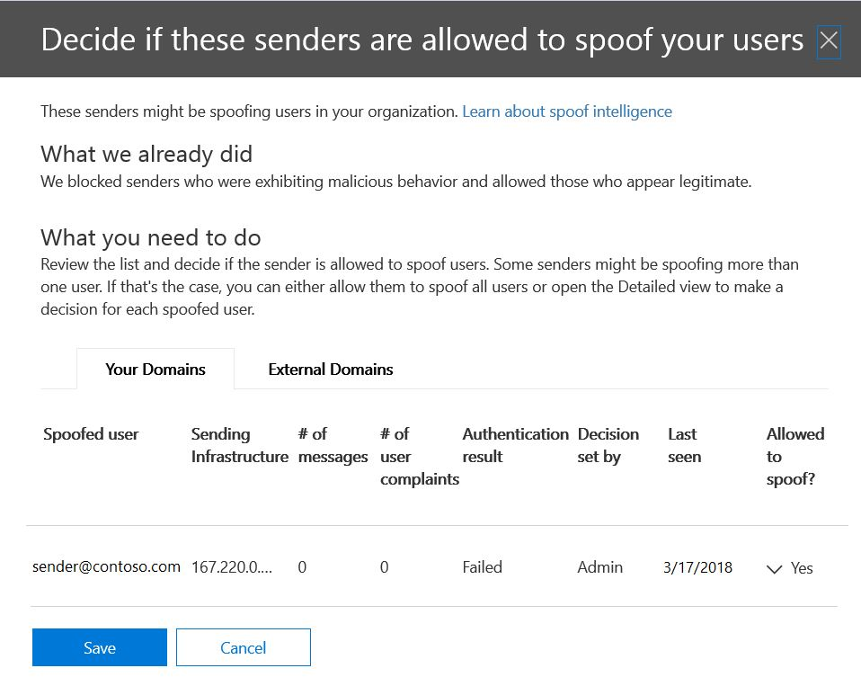

# Saiba mais sobre a inteligência de falsificação

Use a inteligência de spoof no &amp; centro de conformidade de segurança na **página configurações antispam** para examinar todos os remetentes que estão falsificando os domínios que fazem parte da sua organização ou falsificando domínios externos. A inteligência de falsificação está disponível como parte do Office 365 Enterprise E5 ou separadamente como parte da proteção avançada contra ameaças (ATP) e a partir de outubro, 2018 proteção do Exchange Online (EOP). 
  
## Quais tipos de falsificação de email posso revisar e qual devo proteger contra a inteligência de falsificação?

Para domínios de sua propriedade, você pode revisar os remetentes que estão falsificando seu domínio e, em seguida, optar por permitir que o remetente continue ou bloqueie o remetente. Para domínios externos, você pode permitir o domínio do remetente combinado com a infraestrutura de envio, embora não um endereço de email de envio individual.
  
Quando um remetente falsifica um endereço de email, ele parece estar enviando emails em nome de uma ou mais contas de usuário dentro de um dos domínios da sua organização ou um domínio externo enviando para sua organização. Surpreendentemente, há alguns motivos de negócios legítimos para falsificação. Por exemplo, nesses casos, você não bloquearia o remetente de falsificar seu domínio:
  
- Você tem remetentes de terceiros que usam seu domínio para enviar emails em massa para seus próprios funcionários para pesquisas da empresa.
    
- Você contratou uma empresa externa para gerar e enviar comunicados ou atualizações de produtos em seu nome.
    
- Um assistente que regularmente precisa enviar emails para outra pessoa em sua organização.
    
- Um aplicativo que é configurado para falsificar sua própria organização a fim de enviar notificações internas por email.
    
Domínios externos freqüentemente enviam emails falsificados, e muitos desses motivos são legítimos. Por exemplo, aqui estão alguns casos legítimos quando remetentes externos enviam emails falsificados:
  
- O remetente está em uma lista de endereçamento de discussão e a lista de endereçamento está retransmitindo o email do remetente original para todos os participantes na lista de endereçamento.
    
- Uma empresa externa está enviando emails em nome de outra empresa (por exemplo, um relatório automatizado ou uma empresa de software como serviço).
    
Você precisa de uma maneira de garantir que os emails enviados por fraudadores legítimos não sejam configurados em filtros de spam no Office 365 ou sistemas de email externos. Normalmente, o Office 365 trata essas mensagens de email como spam. Como um administrador do Office 365, você pode evitar isso Configurando os filtros de spoof no centro de &amp; conformidade de segurança. Se você é o proprietário do domínio, é possível configurar o SPF, o DKIM e o DMARC para permitir esses remetentes.
  
Por outro lado, falsificadores mal-intencionados, aqueles remetentes que estão falsificando seu domínio ou domínios externos, para enviar spam ou email de phishing, precisam ser bloqueados. A falsificação também é uma maneira comum de que os phishers obtenham credenciais de usuário. O Office 365 tem proteção de falsificação interna para ajudar a proteger sua organização contra remetentes desses emails mal-intencionados. A proteção contra falsificação dos domínios de sua organização está sempre ativada para todos os clientes do Office 365, e a proteção contra falsificação de domínio externo está ativada por padrão para clientes de proteção avançada contra ameaças e a partir de outubro de 2018 EOP. Para reforçar ainda mais essa proteção, diga-nos quais remetentes estão autorizados a falsificar os domínios da sua organização e enviar emails em seu nome e se qualquer domínio externo tem permissão para falsificar. Todos os emails enviados de um remetente que você não autorizar serão tratados como spam ou spoofing pelo Office 365. Mantenha um olho nos remetentes que falsificam seu domínio e ajude-nos a melhorar a inteligência de falsificação usando o centro de conformidade de segurança &amp; .
  
## Gerenciando a inteligência de spoofing no centro de conformidade de segurança &amp;

A política de inteligência de spoof que você configurou é sempre imposta pelo Office 365. Você não pode desabilitá-lo, mas pode escolher o quanto deseja gerenciá-lo ativamente.
  
Você pode revisar os remetentes que estão falsificando seu domínio ou domínios externos e, em seguida, decidir se cada remetente deve ter permissão para fazê-lo &amp; usando o centro de conformidade de segurança. Para cada conta de usuário falsificada que um remetente falsifica do seu domínio ou de um domínio externo, você pode exibir as informações na tabela a seguir.
  
|**Parâmetro**|**Description**|
|:-----|:-----|
|Sender    |Também chamado de verdadeiro remetente. Em geral, esse é o domínio do qual o email de falsificação é originado. O Office 365 determina o domínio do registro DNS de ponteiro (PTR) do endereço IP de envio que está falsificando sua organização. Se nenhum domínio for encontrado, o relatório exibirá o endereço IP do remetente.    |
|Usuário falsificado    |A conta de usuário que está sendo falsificada pelo remetente.    Somente a guia **interna** . Este campo contém um único endereço de email ou, se o remetente estiver falsificando várias contas de usuário, ele conterá **mais de um**.    Somente a guia **externa** . Os domínios externos só contêm um domínio de envio e não contêm um endereço de email completo.    **Tip! Para administradores avançados.** O usuário falsificado é o endereço de (5322. from) que também é o endereço exibido como o endereço de email. Isso às vezes é chamado de cabeçalho. do endereço. A validade desse endereço não é verificada por SPF.           |
|Número de mensagens    |O número de mensagens de email enviadas pelo remetente para sua organização em nome do remetente falsificado identificado ou remetentes nos últimos 30 dias.    |
|Número de reclamações de usuários    |Reclamações arquivadas pelos usuários em relação a esse remetente pelos seus usuários nos últimos 30 dias. As reclamações geralmente estão na forma de envios de lixo eletrônico para a Microsoft.    |
|Resultado da autenticação    |Esse valor é **passado** se o remetente passou por verificações de autenticação de remetentes do Exchange Online Protection (EOP), como SPF ou DKIM, **falhou** se o remetente falhou EOP verificações de autenticação de remetente ou **desconhecido** se o resultado dessas verificações não for desconhecido.    |
|Decisão definida por    |Mostra se o administrador do Office 365 ou a política de inteligência de spoof determina se o remetente tem permissão para falsificar o usuário.    |
|Visto pela última vez    |A última data em que uma mensagem foi recebida por este remetente em nome desse usuário falso.    |
|Permitido para falsificar?    | Exibe se este remetente tem ou não permissão para enviar emails em nome do usuário falsificado. Os valores possíveis incluem:    **Sim** Todos os endereços falsificados desse remetente de falsificação serão permitidos para falsificar sua organização.    **Nenhum** Os endereços falsificados desse remetente de falsificação não terão permissão para falsificar sua organização. Em vez disso, as mensagens desse remetente serão marcadas como spam pelo Office 365.    **Alguns usuários** Se um remetente estiver falsificando vários usuários, alguns endereços falsificados desse remetente serão permitidos para falsificar sua organização, o restante será marcado como spam. Use a guia **detalhada** para ver os endereços específicos.    |
|Tipo de spoof    |Esse valor é **interno** se o domínio for um dos domínios provisionados de sua organização, caso contrário, o valor será **externo**.    |
   
 **Para gerenciar remetentes que estão falsificando seu domínio usando o centro de &amp; conformidade de segurança**
  
1. Vá para o [Centro &amp; de conformidade de segurança](https://protection.office.com).
    
2. Entre no Office 365 com uma conta corporativa ou de estudante. Sua conta deve ter credenciais de administrador em sua organização do Office 365.
    
3. No centro de &amp; conformidade de segurança, expanda **anti-spam**de **política** \> de **Gerenciamento** \> de ameaças.  
  
    
  
4. Na página **configurações antispam** no painel direito, selecione a guia **personalizado** e role para baixo e expanda política de inteligência de **fraude**.  
  
    
  
5. Para exibir a lista de remetentes que falsificam seu domínio, escolha revisar **novos remetentes** e selecione a guia **domínios** . 
    
    Se você já examinou os remetentes e deseja alterar algumas de suas escolhas anteriores, você pode escolher **mostrar a mim que eu já analisei** em vez disso. Em ambos os casos, o painel a seguir é exibido.  
  
    
  
    Cada usuário falsificado é exibido em uma linha separada para que você possa optar por permitir ou impedir que o remetente falsifique individualmente cada usuário.  
  
    Para adicionar um remetente à lista de permissões para um usuário, selecione **Sim** na coluna **permitido para falsificação** . Para adicionar um remetente à lista de bloqueios de um usuário, escolha **não**.
     
    Para definir a política para domínios que você não possui, selecione a guia **domínios externos** . Altere qualquer remetente para **Sim** na coluna **permitido para falsificar** para permitir que o remetente envie emails não autenticados para sua organização. Como alternativa, se você acha que o Office 365 cometeu um erro ao permitir que o remetente envie emails falsificados, altere a coluna **permitido para falsificar** para **não**.  
  
    
  
6. Escolha **salvar** para salvar as alterações. 

Se você tiver uma assinatura do Office 365 Enterprise E5 ou se tiver uma proteção avançada contra ameaças adquiridas separadamente como um complemento, também poderá gerenciar os remetentes que estão falsificando seu domínio por meio da [compreensão de inteligência](https://docs.microsoft.com/en-us/office365/securitycompliance/walkthrough-spoof-intelligence-insight)de falsificação.
    
## Configurando a política antifalsificação

Além de permitir ou impedir que um remetente específico envie emails falsificados para sua organização, você também pode configurar o rigor que deseja que o filtro seja, e a ação a ser executada quando uma mensagem de falsificação é encontrada.
  
A proteção contra falsificação é aplicada a emails de remetentes de domínios externos à sua organização do Office 365. Você pode aplicar a política aos destinatários cujas caixas de correio são licenciadas para o Office 365 Enterprise e5, proteção avançada contra ameaças e a partir de outubro, 2018 EOP clientes também. Você gerencia a política antifalsificação junto com outras configurações de anti-phishing. Para obter mais informações sobre configurações anti-phishing, consulte [configurar as políticas anti-phishing do Office 365](https://support.office.com/article/set-up-office-365-atp-anti-phishing-policies-5a6f2d7f-d998-4f31-b4f5-f7cbf6f38578?ui=en-US&amp;rs=en-US&amp;ad=US#phishpolicyoptions).
  
O Office 365 inclui proteção contra falsificação padrão que está sempre em execução. Essa proteção padrão não está visível no centro de &amp; conformidade de segurança ou recuperável por meio dos cmdlets do Windows PowerShell. Não é possível modificar a proteção contra falsificação padrão. Em vez disso, você pode configurar o quão rigorosamente o Office 365 aplica a proteção contra falsificação em cada política anti-phishing que você criar. 
  
Embora a política antifalsificação apareça na política anti-phishing no centro de conformidade de segurança &amp; , ela não herda o comportamento padrão da configuração de phishing existente na configuração anti-spam. Se você tiver configurações em **** \> **phishing** antispam que deseja replicar para falsificação, será necessário criar uma política anti-phishing e, em seguida, editar a parte de falsificação da política anti-phishing para refletir suas configurações de spoof como descrito na seção a seguir, em vez de aceitar as configurações padrão que são executadas em segundo plano. 
  
 **Para configurar a proteção contra falsificação em uma política anti-phishing usando o centro de conformidade de &amp; segurança**
  
1. Vá para o [Centro &amp; de conformidade de segurança](https://protection.office.com).
    
2. Entre no Office 365 com uma conta corporativa ou de estudante. Sua conta deve ter credenciais de administrador em sua organização do Office 365.
    
3. No centro de &amp; conformidade de segurança, expanda **anti-phishing de** **política** \> de **Gerenciamento** \> de ameaças. 
    
4. Na página **anti-phishing** no painel direito, selecione a política anti-phishing que você deseja configurar. 
    
5. Na página que aparece, na linha **spoof** , escolha **Editar**. 
    
6. Em seguida, configure as ações a serem executadas quando uma mensagem for detectada como uma falsificação entre domínios. O comportamento padrão é mover a mensagem para a pasta lixo eletrônico do destinatário. A outra opção é enviar a mensagem para a quarentena. Para obter mais informações sobre o gerenciamento de mensagens enviadas para quarentena, consulte [Quarantine Email messages in Office 365](quarantine-email-messages.md).  
  
    
  
7. Faça sua escolha e, em seguida, escolha **salvar**. 
    
## Outras maneiras de gerenciar falsificação e phishing com o Office 365

Fique à medida sobre falsificação e proteção contra phishing. Aqui estão as maneiras relacionadas à verificação de remetentes que falsificam seu domínio e ajudam a evitar que eles danifiquem sua organização:
  
- Verifique o relatório de email de falsificação da proteção do Exchange Online como parte da sua rotina. Você pode usar esse relatório com frequência para exibir e ajudar a gerenciar remetentes falsificados. Para saber mais, confira **relatório de email falsificado** em [usar relatórios de proteção de email no Office 365 para exibir dados sobre detecções de malware, spam e de regra](https://technet.microsoft.com/library/dn500744%28v=exchg.150%29.aspx).
    
Para administradores do Office 365 mais avançados, você também pode concluir essas verificações:
    
    
- Revise a configuração da estrutura de política de remetente (SPF). Para obter uma introdução rápida sobre SPF e configurá-lo rapidamente, confira [Set up SPF in Office 365 to help prevent spoofing](https://technet.microsoft.com/library/dn789058%28v=exchg.150%29.aspx). Para compreender melhor como o Office 365 usa SPF, para solucionar problemas, ou para saber mais sobre implantações incomuns, como implantações híbridas, comece com [How Office 365 uses Sender Policy Framework (SPF) to prevent spoofing](https://technet.microsoft.com/library/mt712724%28v=exchg.150%29.aspx).
    
- Revise sua configuração de email identificado do DomainKeys (DKIM). Você deve usar o DKIM, além da SPF e do DMARC, para ajudar a evitar que spoofers enviem mensagens que pareçam que são provenientes de seu domínio. O DKIM possibilita adicionar uma assinatura digital a mensagens de email no cabeçalho da mensagem. Para saber mais, confira [usar DKIM para validar emails de saída enviados do seu domínio no Office 365](https://technet.microsoft.com/library/mt695945%28v=exchg.150%29.aspx).
    
- Revise a configuração de autenticação, geração de relatórios e conformidade da mensagem baseada em domínio (DMARC). Implementar o DMARC com SPF e DKIM proporciona proporção adicional contra o spoofing e o phishing no email. O DMARC ajuda os sistemas de recepção de email a determinarem o que fazer com as mensagens enviadas a partir do seu domínio que falharem em verificações de SPF ou de DKIM. Para saber mais, confira [usar DMARC para validar emails no Office 365](https://technet.microsoft.com/library/mt734386%28v=exchg.150%29.aspx).
    
- Use o cmdlet [Get-PhishFilterPolicy](https://technet.microsoft.com/en-us/library/mt735158%28v=exchg.160%29.aspx) do Windows PowerShell para coletar dados detalhados sobre remetentes falsificados, gerar listas de permissões e bloqueios e ajudá-lo a determinar como gerar registros de DNS SPF, DKIM e DMARC mais abrangentes, sem ter seu emails legítimos são capturados em filtros externos de spam. Para obter mais informações, consulte [como a proteção contra falsificação funciona no Office 365](https://blogs.msdn.microsoft.com/tzink/2016/02/23/how-antispoofing-protection-works-in-office-365/).
    

