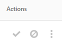
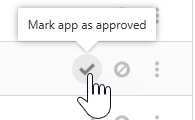
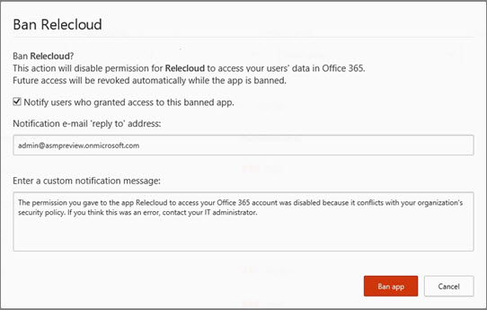

# Gerenciar aplicativos do OAuth usando o Office 365 Cloud App Security

|Avaliação * *\>**|Planejamento * *\>**|Implantação * *\>**|Utilização * * *|
|:-----|:-----|:-----|:-----|
|[Comece a avaliar](office-365-cas-overview.md)   |[Começar a planejar](get-ready-for-office-365-cas.md)   |[Começar a implantar](turn-on-office-365-cas.md)   |Você está aqui!    [Próximas etapas](manage-app-permissions-in-ocas.md#nextsteps)   |
   
Pessoas amor apps e eles baixá-las com frequência, especialmente os aplicativos que as pessoas utilizam pense salvará tempo, facilitando a obter no trabalho ou escola informações. No entanto, alguns aplicativos potencialmente poderia ser um risco de segurança para sua organização, dependendo de quais informações eles acessarem e como eles lidam com essas informações. Com a [Segurança de aplicativo de nuvem do Office 365](office-365-cas-overview.md), se você for um administrador global ou de segurança, você pode gerenciar aplicativos de OAuth para sua organização. Você pode ver as pessoas de aplicativos estão usando com dados do Office 365, que permissões estes aplicativos tem e muito mais. 
  
Este artigo descreve como criar uma consulta de aplicativo, como aprovar, proibir ou informar sobre um aplicativo e aonde ir para gerenciar aplicativos de OAuth.
  
## Como encontrar a página Gerenciar OAuth aplicativos

> [!NOTE]
> Aplicativos do OAuth são gerenciados no portal de segurança de aplicativo de nuvem do Office 365. Você deve ser um administrador global ou administrador de segurança para executar a tarefa a seguir. Para saber mais, consulte [permissões no Office 365 Security &amp; Centro de conformidade](permissions-in-the-security-and-compliance-center.md). 
  
1. Vá para o portal de segurança de aplicativo de nuvem ([https://portal.cloudappsecurity.com](https://portal.cloudappsecurity.com)) e entrar.
  
2. Escolha a **investigar** \> **OAuth apps**.  
  
## O que você verá na página Gerenciar OAuth aplicativos

A tabela a seguir descreve os controles e opções disponíveis na página Gerenciar OAuth aplicativos.
  
|**Item**|**Descrição**|
|:-----|:-----|
|Ícone básica na barra de aplicativos de consulta    |Selecione essa opção para alternar para o modo de exibição avançado.    (Se você vir **básica**, você está usando o modo de exibição avançado)    |
|Ícone Avançado na barra de aplicativos de consulta    |Selecione essa opção para alternar para modo de exibição básico.    (Se você vir **Avançado**, você está usando o modo de exibição básico.)    |
|Abrir ou fechar o ícone de todos os detalhes na lista de aplicativos    |Selecione esse ícone para exibir mais ou menos detalhes sobre cada aplicativo.    |
|Ícone de exportar na lista de aplicativos    |Selecione esse ícone para exportar um arquivo CSV que contém uma lista de aplicativos, o número de usuários para cada aplicativo, permissões associadas com o aplicativo, o nível de permissões, estado do aplicativo e usar nível de comunidade.    |
|Nome    |Usar esse recurso para ver o nome de um App. Selecione o nome para exibir mais informações, como seu descrição, o publisher, o site da Web app e o ID do aplicativo.    |
|Autorizado pelo    |Use esta opção para ver quantos usuários tenham autorizados a um aplicativo para acessar sua conta do Office 365. Selecione o número para exibir mais informações, como uma lista de contas de usuário.    |
|Nível de permissões    |Use esta opção para ver quanto acesso um aplicativo tem aos dados do Office 365. Níveis de permissões indicam **baixa**, **média**ou **alta**, onde **baixa** pode indicar que o aplicativo acessa somente perfil e o nome de um usuário. Selecione o nível para exibir mais informações, como permissões concedidas para o aplicativo, o uso da comunidade e atividade relacionada no [log de governança](suspend-or-restore-an-account-in-ocas.md).  |
|Última autorizados   |Use esta opção para ver a data e hora de que um aplicativo de OAuth última foi autorizado para acessar dados do Office 365 da sua organização.    |
|Ações   |Use esta opção para ver ou para marcar um aplicativo como aprovado ou Banned, um aplicativo do OAuth do relatório para a Microsoft ou deixá-lo como indeterminado.    |
   
## Marcar um aplicativo como aprovados

Na página **Gerenciar OAuth apps** , localize o aplicativo que você deseja aprovar e escolha o ícone **app marca como aprovado** . 
  

  
O ícone fica verde, e o aplicativo em particular for aprovado para todos os usuários do Office 365.
  
> [!NOTE]
> Quando você marca um aplicativo como aprovados, não há nenhum efeito sobre o usuário final. Marcação visualmente os aplicativos que foram aprovados ajuda a separá-los dos aplicativos que ainda não foram revisados ainda. 
  
## Proibir um aplicativo

1. Na página **Gerenciar OAuth apps** , localize o aplicativo que você deseja proibir e escolha o ícone **app marca como proibidos** . 
  
2. Na caixa de mensagem de notificação, mantenha o texto existente como está ou personalizar o texto. Escolha se deseja que os usuários saibam o que foi proibido seu aplicativo.   
  
3. Escolha **aplicativo proibir**.

## Reportar um aplicativo do OAuth para a Microsoft

Se você deseja enviar um aplicativo do OAuth para a Microsoft para análise, é possível denunciar desse aplicativo.

1. Na página **Gerenciar OAuth apps** , localize o aplicativo que você deseja enviar para análise.

2. Escolha as reticências vertical e, em seguida, escolha **relatório App...**.  

3. Na caixa de diálogo **deste aplicativo de relatório** , use a lista suspensa para indicar sua preocupação. Por padrão, **Este aplicativo é mal-intencionado** está selecionada. No entanto, você pode escolher em uma das outras opções disponíveis.  

4. (Recomendado) Mantenha a opção para contatá-lo selecionado e o endereço de email listado confirmar (ou editar).

5. Escolha **Enviar**. 
    
## Criar uma consulta de aplicativo

É recomendável usar o modo de exibição avançado, tem esta aparência: 

Na barra de consulta do aplicativo, se você vir **Avançado**, você está usando o modo de exibição básico. Clique (ou toque) **Avançado** para ir para o modo de exibição avançado. 

    
1. Na barra de consulta, use a lista **Selecionar um filtro** para escolher uma opção. 
    - **App** Aplicativos com determinados nomes
    - **Estado do aplicativo** Aplicativos com base em seu estado (aprovado, Banned ou Undetermined)
    - **Use da comunidade** Aplicativos com base na comunidade usam níveis (Rare, Uncommon ou comum)
    - **Nível de permissão** Aplicativos com base em determinados níveis de permissão 
    - **Permissões** Aplicativos que necessitam de determinadas permissões
    - **Publisher**  Aplicativos de determinados fornecedores
    - **Usuário** Aplicativos que um determinado usuário autorizado
   
2. Selecione **é igual a** ou **diferente**e, em seguida, especifique um valor para o filtro.
    
3. Para adicionar mais filtros, selecione o (sinal de adição) e repita as etapas 2 e 3.
    
4. Para remover um filtro, selecione o x () ao lado do nome de um filtro.
    
Os filtros são aplicados automaticamente e a lista de aplicativos é atualizada de acordo.
  
## Próximas etapas

- [Revise e agir em alertas](review-office-365-cas-alerts.md)
    
- Revise seus [logs de tráfego da Web e fontes de dados para segurança de aplicativo de nuvem do Office 365](web-traffic-logs-and-data-sources-for-ocas.md)
    
- Revise suas [atividades de utilização para segurança de aplicativo de nuvem do Office 365](utilization-activities-for-ocas.md)
    

