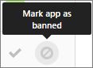

# Gerenciar permissões de aplicativo usando o Office 365 Cloud App SecurityManage app permissions using Office 365 Cloud App Security

Gerenciamento de segurança avançada do Office 365 agora é segurança de aplicativo de nuvem do Office 365.Office 365 Advanced Security Management is now Office 365 Cloud App Security.
  
|Avaliação * *\>******Evaluation** \>**|Planejamento * *\>******Planning** \>**|Implantação * *\>******Deployment** \>**|Utilização \* \* \*****Utilization****|
|:-----|:-----|:-----|:-----|
|[Comece a avaliarStart evaluating](office-365-cas-overview.md)   |[Começar a planejarStart planning](get-ready-for-office-365-cas.md)   |[Começar a implantarStart deploying](turn-on-office-365-cas.md)   |Você está aqui!You are here!    [Próximas etapasNext steps](manage-app-permissions-in-ocas.md#nextsteps)   |
   
Pessoas amor apps e eles baixá-las com frequência, especialmente os aplicativos que as pessoas utilizam pense salvará tempo, facilitando a obter no trabalho ou escola informações. No entanto, alguns aplicativos potencialmente poderia ser um risco de segurança para sua organização, dependendo de quais informações eles acessarem e como eles lidam com essas informações. Com a [Segurança de aplicativo de nuvem do Office 365](office-365-cas-overview.md), se você for um administrador global ou de segurança, você pode gerenciar permissões do aplicativo para sua organização. Você pode ver as pessoas de aplicativos estão usando com dados do Office 365, que permissões estes aplicativos tem e muito mais.People love apps and they download them often, especially apps that people think will save time by making it easier to get at their work or school information. However, some apps could potentially be a security risk to your organization, depending on what information they access and how they handle that information. With [Office 365 Cloud App Security](office-365-cas-overview.md), if you are a global or security administrator, you can manage app permissions for your organization. You can see the apps people are using with Office 365 data, what permissions those apps have, and more. 
  
Este artigo descreve como criar uma consulta de aplicativo, como aprovar ou proibir um aplicativo e aonde ir para gerenciar permissões de aplicativo.This article describes where to go to manage app permissions, how to approve or ban an app, and how to create an app query.
  
## Como encontrar a página Gerenciar aplicativo permissõesHow to find the Manage app permissions page

> [!NOTE]
> Permissões de aplicativo são gerenciadas no portal de segurança de aplicativo de nuvem do Office 365. Você deve ser um administrador global ou administrador de segurança para executar a tarefa a seguir. Para saber mais, consulte [permissões no Office 365 Security &amp; Centro de conformidade](permissions-in-the-security-and-compliance-center.md).App permissions are managed in the Office 365 Cloud App Security portal. You must be a global administrator or security administrator to perform the following task. To learn more see [Permissions in the Office 365 Security &amp; Compliance Center](permissions-in-the-security-and-compliance-center.md). 
  
1. Vá para [https://protection.office.com](https://protection.office.com) e entrar usando sua conta de trabalho ou da escola para o Office 365. (Isso leva você para a segurança &amp; Centro de conformidade.)Go to [https://protection.office.com](https://protection.office.com) and sign in using your work or school account for Office 365. (This takes you to the Security &amp; Compliance Center.) 
    
2. Vá para **alertas** \> **avançadas de gerenciar alertas**.Go to **Alerts** \> **Manage advanced alerts**.
    
3. Clique (ou toque) **vá para segurança de aplicativo de nuvem do Office 365**.Click (or tap) **Go to Office 365 Cloud App Security**.
    
    
  
    > [!NOTE]
    > Se a segurança de aplicativo de nuvem do Office 365 não está ativada ainda, você pode fazer isso nesta página. Consulte [Prepare-se para a segurança de aplicativo de nuvem do Office 365](get-ready-for-office-365-cas.md).If Office 365 Cloud App Security is not turned on yet, you can do that on this page. See [Get ready for Office 365 Cloud App Security](get-ready-for-office-365-cas.md). 
  
4. Escolha **investigar** \> **permissões do aplicativo**.Choose **Investigate** \> **App permissions**.
    
    
  
## O que você verá na página Gerenciar aplicativo permissõesWhat you'll see on the Manage app permissions page

A tabela a seguir descreve os controles e opções disponíveis na página Gerenciar aplicativo permissões.The following table describes the controls and options available on the Manage app permissions page.
  
|**Item****Item**|**Descrição****Description**|
|:-----|:-----|
|Ícone básica na barra de aplicativos de consultaBasic icon in the app query bar    |Selecione essa opção para alternar para o modo de exibição avançado.Select this to switch to the Advanced view.    (Se você vir **básica**, você está usando o modo de exibição avançado)(If you see **Basic**, you are using the Advanced view)    |
|Ícone Avançado na barra de aplicativos de consultaAdvanced icon in the app query bar    |Selecione essa opção para alternar para modo de exibição básico.Select this to switch to the Basic view.    (Se você vir **Avançado**, você está usando o modo de exibição básico.)(If you see **Advanced**, you are using the Basic view.)    |
|Abrir ou fechar o ícone de todos os detalhes na lista de aplicativosOpen or close all details icon in the app list    |Selecione esse ícone para exibir mais ou menos detalhes sobre cada aplicativo.Select this icon to view more or fewer details about each app.    |
|Ícone de exportar na lista de aplicativosExport icon in the app list    |Selecione esse ícone para exportar um arquivo CSV que contém uma lista de aplicativos, o número de usuários para cada aplicativo, permissões associadas com o aplicativo, o nível de permissões, estado do aplicativo e usar nível de comunidade.Select this icon to export a CSV file that contains a list of apps, number of users for each app, permissions associated with the app, permissions level, app state, and community use level.    |
|NomeName    |Usar esse recurso para ver o nome de um App. Selecione o nome para exibir mais informações, como seu descrição, o publisher, o site da Web app e o ID do aplicativo.Use this to see the name of an app. Select the name to view more information, such as its description, publisher, app website and app ID.    |
|Autorizado peloAuthorized by    |Use esta opção para ver quantos usuários tenham autorizados a um aplicativo para acessar sua conta do Office 365. Selecione o número para exibir mais informações, como uma lista de contas de usuário.Use this to see how many users have authorized an app to access their Office 365 account. Select the number to view more information, such as a list of user accounts.    |
|Nível de permissõesPermissions Level    |Use esta opção para ver quanto acesso um aplicativo tem aos dados do Office 365. Níveis de permissões indicam **baixa**, **média**ou **alta**, onde **baixa** pode indicar que o aplicativo acessa somente perfil e o nome de um usuário. Selecione o nível para exibir mais informações, como permissões concedidas para o aplicativo, o uso da comunidade e atividade relacionada no [log de governança](suspend-or-restore-an-account-in-ocas.md).Use this to see how much access an app has to Office 365 data. Permissions levels indicate **Low**, **Medium**, or **High**, where **Low** might indicate that the app only accesses a user's profile and name. Select the level to view more information, such as permissions granted to the app, community use, and related activity in the [Governance log](suspend-or-restore-an-account-in-ocas.md).    |
|Estado do aplicativo ( **Banned**, **aprovado**ou **Undetermined**)App state ( **Banned**, **Approved**, or **Undetermined**)    |Use esta opção para marcar um aplicativo como aprovado ou Banned ou deixá-lo como indeterminado.Use this to mark an app as Approved or Banned, or leave it as undetermined.    |
   
## Marcar um aplicativo como aprovadosMark an app as approved

Na página **Gerenciar permissões de aplicativo** , localize o aplicativo que você deseja aprovar e escolha o ícone **app marca como aprovado** .On the **Manage app permissions** page, locate the app you want to approve, and choose the **Mark app as approved** icon. 
  

  
O ícone fica verde, e o aplicativo em particular for aprovado para todos os usuários do Office 365.The icon turns green, and the app is approved for all your Office 365 users.
  
> [!NOTE]
> Quando você marca um aplicativo como aprovados, não há nenhum efeito sobre o usuário final. Marcação visualmente os aplicativos que foram aprovados ajuda a separá-los dos aplicativos que ainda não foram revisados ainda.When you mark an app as approved, there is no effect on the end user. Visually marking the apps that are approved helps to separate them from apps that haven't been reviewed yet. 
  
## Proibir um aplicativoBan an app

1. Na página **Gerenciar permissões de aplicativo** , localize o aplicativo que você deseja proibir e escolha o ícone **app marca como proibidos** .On the **Manage app permissions** page, locate the app you want to ban, and choose the **Mark app as banned** icon. 
    
    
  
2. Escolha se deseja que os usuários saibam o que foi proibido seu aplicativo.Choose whether to let users know that their app has been banned.
    
    (Recomendado) Para permitir que os usuários saibam, selecione **usuários Notify que recebem acesso para este aplicativo proibido**e adicione ou edite uma mensagem de notificação personalizada.(Recommended) To let users know, select **Notify users who granted access to this banned app**, and add or edit a custom notification message.
    
    Para não permitir que os usuários saibam, desmarque **usuários Notify que recebem acesso para este aplicativo proibido**.To not let users know, clear **Notify users who granted access to this banned app**.
    
    
  
3. Escolha **aplicativo proibir**.Choose **Ban app**.
    
## Criar uma consulta de aplicativoCreate an app query

1. Na barra de consulta do aplicativo, se você vir **Avançado**, clique (ou toque)-lo para ir para o modo de exibição avançado. (Se você vir Basic, você estiver usando o modo de exibição avançado; manter sua opinião como está.)In the app query bar, if you see **Advanced**, click (or tap) it to go to the Advanced view. (If you see Basic, you are using the Advanced view; keep your view as it is.)
    
2. Use a lista **Selecionar um filtro** para escolher uma opção. A tabela a seguir resume as opções de filtro disponíveis.Use the **Select a filter** list to choose an option. The following table summarizes your available filter options. 
    
|**Utilize esse filtro****Use this filter**|**Para exibir****To display**|
|:-----|:-----|
|**Aplicativo****App**   |Aplicativos com determinados nomesApps with certain names    |
|**Estado do aplicativo****App state**   |Aplicativos com base em seu estado (aprovado, Banned ou Undetermined)Apps based on their state (Approved, Banned, or Undetermined)    |
|**Uso da comunidade****Community use**   |Aplicativos com base na comunidade usam níveis (Rare, Uncommon ou comum)Apps based on community use levels (Rare, Uncommon, or Common)    |
|**Nível de permissão****Permission level**   |Aplicativos com base em determinados níveis de permissãoApps based on certain permission levels    |
|**Permissões****Permissions**   |Aplicativos que necessitam de determinadas permissõesApps that require certain permissions    |
|**Publicador****Publisher**   |Aplicativos de determinados fornecedoresApps from certain publishers    |
|**Usuário****User**   |Aplicativos que um determinado usuário autorizadoApps that a certain user authorized    |
   
3. Selecione **é igual a** ou **diferente**e, em seguida, especifique um valor para o filtro.Select **equals** or **does not equal**, and then specify a value for your filter.
    
4. Para adicionar mais filtros, selecione o (sinal de adiçãoTo add more filters, select the plus sign () e repita as etapas 2 e 3.), and then repeat steps 2 and 3.
    
5. Para remover um filtro, selecione o x (To remove a filter, select the x () ao lado do nome de um filtro.) next to a filter name.
    
Os filtros são aplicados automaticamente e a lista de aplicativos é atualizada de acordo.The filters are applied automatically, and the apps list is updated accordingly.
  
## Próximas etapasNext steps

- [Revise e agir em alertasReview and take action on alerts](review-office-365-cas-alerts.md)
    
- Revise seus [logs de tráfego da Web e fontes de dados para segurança de aplicativo de nuvem do Office 365](web-traffic-logs-and-data-sources-for-ocas.md)Review your [Web traffic logs and data sources for Office 365 Cloud App Security](web-traffic-logs-and-data-sources-for-ocas.md)
    
- Revise suas [atividades de utilização para segurança de aplicativo de nuvem do Office 365](utilization-activities-for-ocas.md)Review your [utilization activities for Office 365 Cloud App Security](utilization-activities-for-ocas.md)
    

