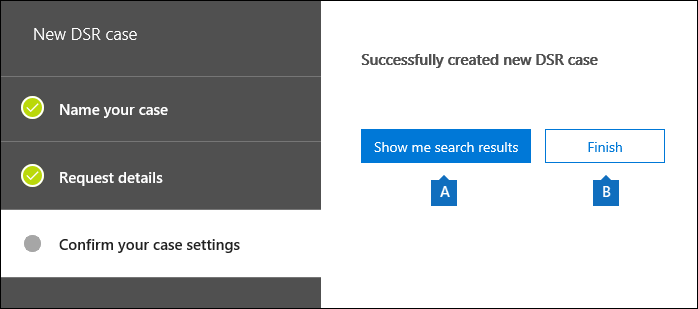
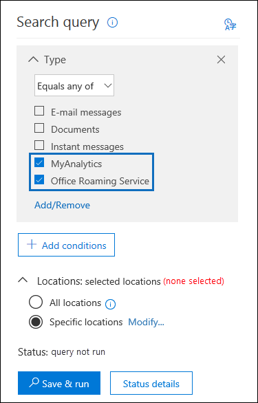

# <a name="manage-gdpr-data-subject-requests-with-the-dsr-case-tool-in-the-security--compliance-center"></a>Gerenciar solicitações de entidades de dados do RGPD com a ferramenta de casos DSR no centro de conformidade do & de segurança

A regulamentação geral de proteção de dados da UE (RGPD) é sobre a proteção e habilitação dos direitos de privacidade dos indivíduos dentro da União Européia (UE). O RGPD fornece aos indivíduos da União Européia (conhecidos como entidades de dados) o direito de acessar, recuperar, corrigir, apagar e restringir o processamento de seus dados pessoais. No RGPD, os dados pessoais significam qualquer informação relacionada a uma pessoa física identificada ou identificável. Uma solicitação formal de uma pessoa à sua organização para executar uma ação em seus dados pessoais é chamada de solicitação de assunto de dados ou DSR. Para obter informações detalhadas sobre como responder a DSRs para dados no Office 365, consulte [office 365 data Subject Request Guide](https://go.microsoft.com/fwlink/?linkid=871169 ).
  
Para gerenciar investigações em resposta a um DSR enviado por uma pessoa em sua organização, você pode usar a ferramenta de caso DSR no centro de conformidade do & de segurança para localizar o conteúdo armazenado em:
  
- Qualquer caixa de correio de usuário em sua organização. Isso inclui conversas do Skype for Business e chats um-para-um no Microsoft Teams
    
- Todas as caixas de correio associadas a um grupo do Office 365 e a todas as caixas de correio de equipe no Microsoft Teams
    
- Todos os sites do SharePoint Online e contas do OneDrive for Business em sua organização
    
- Todos os sites de equipe e sites de grupo do Office 365 em sua organização
    
- Todas as pastas públicas no Exchange Online
    
Usando a ferramenta de ocorrência de DSR, você pode:
  
- Criar uma ocorrência separada para cada investigação de DSR.
    
- Controle quem tem acesso à ocorrência de DSR adicionando pessoas como membros do caso; Somente membros podem acessar o caso e só podem ver seus casos na lista de casos na página de **casos de DSR** no centro de conformidade do _AMP_ de segurança. Além disso, você pode atribuir diferentes permissões a diferentes membros do mesmo caso. Por exemplo, você pode permitir que alguns membros apenas exibam os resultados de ocorrência e de pesquisa e permitir que outros membros criem pesquisas e exportem resultados de pesquisa. 
    
- Use a pesquisa interna para pesquisar todo o conteúdo criado ou carregado por um assunto de dados específico.
    
- Opcionalmente, revise a consulta de pesquisa interna e execute novamente a pesquisa para restringir os resultados da pesquisa.
    
- Adicione pesquisas de conteúdo adicionais associadas ao caso DSR. Isso inclui a criação de pesquisas que retornem itens parcialmente indexados e logs gerados pelo sistema a partir do My Analytics e do serviço de roaming do Office.
    
- Exportar dados em resposta a uma solicitação de exportação ou acesso DSR.
    
- Excluir casos em que o processo de investigação de DSR estiver concluído; Isso removerá todas as pesquisas e trabalhos de exportação associados ao caso.
    
Este é o processo de alto nível para usar a ferramenta de caso DSR para gerenciar investigações de DSR:
  
[Step 1: Assign eDiscovery permissions to potential case members](#step-1-assign-ediscovery-permissions-to-potential-case-members)

[Etapa 2: criar uma ocorrência de DSR e adicionar membros](#step-2-create-a-dsr-case-and-add-members)

[Etapa 3: executar a consulta de pesquisa](#step-3-run-the-search-query)

[Etapa 4: exportar os dados](#step-4-export-the-data)

[Opcion Etapa 5: reVisar a consulta de pesquisa interna](#optional-step-5-revise-the-built-in-search-query)

[Mais informações sobre como usar a ferramenta de ocorrência de DSR](#more-information-about-using-the-dsr-case-tool)
  
> [!IMPORTANT]
> Nossas ferramentas podem ajudar os administradores a executar o acesso DSR ou solicitações de exportação, permitindo que eles utilizem a funcionalidade interna de pesquisa e exportação encontrada na ferramenta de caso DSR. A ferramenta ajuda a facilitar um método de melhor esforço para exportar dados relevantes para uma solicitação de DSR enviada por um assunto de dados. No enTanto, é importante observar que os resultados da pesquisa podem variar com base no assunto dos dados ou nas ações de administrador realizadas que podem afetar a possibilidade de um item ser considerado "dados pessoais" para fins de exportação. Por exemplo, se o assunto dos dados foi a última pessoa a modificar um arquivo que ele não criou, o arquivo pode não ser retornado nos resultados da pesquisa. Da mesma forma, um administrador pode exportar dados sem incluir itens parcialmente indexados ou todas as versões de documentos do SharePoint. Portanto, as ferramentas fornecidas podem ajudar a facilitar o acesso e a exportação de solicitações de dados; no entanto, os resultados estão sujeitos aos cenários específicos de uso de entidades de dados e de administração. 
  
## <a name="step-1-assign-ediscovery-permissions-to-potential-case-members"></a>Etapa 1: atribuir permissões de Descoberta Eletrônica para possíveis membros da ocorrência

Por padrão, um administrador global do Office 365 pode acessar a ferramenta de caso DSR no centro de conformidade do & de segurança. Por design, outros usuários, como um diretor de privacidade de dados, um gerente de recursos humanos ou outras pessoas envolvidas nas investigações DSR não têm acesso à ferramenta de caso DSR e precisam receber as permissões apropriadas para acessar a ferramenta. A maneira mais fácil de fazer isso é ir para a página **permissões** no centro de conformidade do _AMP_ de segurança e adicionar usuários ao grupo de funções Gerenciador de descoberta eletrônica. Observe que você também precisa atribuir essas permissões para que possa adicioná-las como membros da ocorrência de DSR criada na etapa 2. 
  
Para obter instruções detalhadas, consulte [atribuir permissões de descoberta eletrônica no centro de conformidade do & de segurança do Office 365](assign-ediscovery-permissions.md).
  
> [!NOTE]
> Por padrão, um administrador global do Office 365 (ou outros membros do grupo de função gerenciamento da organização no centro de conformidade do & de segurança não têm as permissões necessárias para exportar resultados de pesquisa de conteúdo (consulte a etapa 4 neste artigo). Para resolver isso, um administrador pode adicionar a si mesmo como um membro do grupo de função Gerenciador de descoberta eletrônica. 
  
## <a name="step-2-create-a-dsr-case-and-add-members"></a>Etapa 2: criar uma ocorrência de DSR e adicionar membros

A próxima etapa é criar um caso DSR. Ao criar um caso, você pode optar por iniciar a pesquisa interna ou pode criar a ocorrência sem iniciar a pesquisa. O procedimento a seguir instrui você a criar o caso sem iniciar a pesquisa e, em seguida, mostrar como adicionar membros ao caso.
  
1. AcEsse [https://protection.office.com](https://protection.office.com) e entre no Office 365 usando sua conta corporativa ou de estudante. 
    
2. No centro de conformidade do & de segurança, clique em **solicitações de assunto de dados**de  privacidade \> de **dados** e clique em Adicionar ícone **novo caso de DSR**.
    
3. Na página **novo** submenu de caso em DSR, dê um nome ao caso, digite uma descrição opcional e clique em **Avançar**. Observe que o nome do caso deve ser exclusivo em sua organização.
    
    > [!TIP]
    > Considere adicionar o nome da pessoa que enviou a solicitação DSR que você está investigando no nome e/ou descrição do novo caso. Observe que somente os membros desse caso (e administradores de descoberta eletrônica) poderão ver o caso na lista de casos na página solicitações de **entidades de dados** . 
  
4. Na página **detalhes da solicitação** , em **assunto dos dados (a pessoa que encontrava essa solicitação)**, selecione a pessoa para a qual você deseja localizar e exportar dados e clique em **Avançar**.
    
5. Na página **confirmar suas configurações de caso** , você pode alterar o nome e a descrição do caso e selecionar um assunto de dados diferente. Caso contrário, basta clicar em **salvar**.
    
    É exibida uma página que confirma que o novo caso de DSR foi criado.
    
    
  
    Neste ponto, você pode executar uma das seguintes ações:
    
    a. Clicar em **Mostrar resultados de pesquisa** iniciará a pesquisa. Esta é a seleção padrão. A pesquisa interna executada quando você seleciona essa opção e os resultados retornados são discutidos na etapa 3.
    
    b. Clicar em **concluir** fecha o novo caso DSR sem iniciar a pesquisa interna. Quando você seleciona essa opção, a nova ocorrência de DSR é exibida na página **solicitações de entidades de dados** .
    
6. Clique em **concluir** para que você possa ir para o novo caso de DSR e adicionar membros a ele. 
    
7. Na página **solicitações de entidades de dados** , clique no nome da ocorrência de DSR que você acabou de criar. 
    
8. Na página **gerenciar este caso** , em **gerenciar Membros**, clique em **Adicionar**. 
    
    Em **usuários**, uma lista de pessoas às quais foram atribuídas as permissões de descoberta eletrônica apropriadas é exibida. Observe que as pessoas às quais você atribuiu permissões de descoberta eletrônica na etapa 1 serão exibidas na lista. 
    
9. Selecione as pessoas a serem adicionadas como membros do caso DSR, clique em **Adicionar**e salve suas alterações.
    
    Observe que você também pode adicionar grupos de função como membros do caso DSR clicando em **Adicionar** em **gerenciar grupos de função**. 
    
## <a name="step-3-run-the-search-query"></a>Etapa 3: executar a consulta de pesquisa

Depois de criar um caso DSR e adicionar membros, a próxima etapa é executar a pesquisa interna associada à ocorrência. Essa consulta de pesquisa padrão faz o seguinte:
  
- Pesquisa todas as caixas de correio em sua organização para todos os itens de email que foram enviados ou recebidos pelo assunto dos dados. Isso é feito usando a propriedade email de *participantes* , que procura o assunto dos dados em todos os campos de pessoas em uma mensagem de email. Essa propriedade retorna os itens nos quais os dados estão sujeitos nos campos **de**, **para**, **CC**e **Cco** . As pastas públicas no Exchange Online também são pesquisadas para mensagens enviadas ou recebidas pelo assunto dos dados. 
    
- Pesquisa todos os sites em sua organização para documentos e itens que foram criados ou carregados pelo assunto dos dados. Isso é feito usando as seguintes propriedades de site:
    
  - A propriedade *Author* retorna itens onde o assunto dos dados está listado no campo autor em documentos do Office. Esse valor persiste, mesmo que o documento seja copiado e carregado por outra pessoa. 
    
  - A propriedade *CreatedBy* retorna itens que foram criados ou carregados pelo assunto dos dados. 
    
Esta é a aparência da consulta de palavra-chave para a pesquisa interna que é criada automaticamente quando você cria um caso em DSR.
  
```
participants:"<email address>" OR author:"<display name>" OR createdby:"<display name>"
```

Por exemplo, se o nome do assunto de dados for INA Eduarda, a consulta de palavra-chave ficaria assim:
  
```
participants:"ina@contoso.com" OR author:"Ina Leonte" OR createdby:"Ina Leonte"
```

 **Para executar a pesquisa interna por um caso de DSR:**
  
1. No centro de conformidade do & de segurança, clique em **solicitações de assunto de dados**de privacidade \> de **dados** e clique em **abrir** ao lado do caso de DSR que você criou na etapa 2. 
    
    Clique na guia **Pesquisar** na parte superior da página e, em seguida, clique na caixa de seleção ao lado da pesquisa interna criada quando você criou o novo caso de DSR. Observe que a pesquisa tem o mesmo nome que o caso DSR. 
    
2. Na página de submenu de pesquisa, clique em **Abrir consulta**.
    
    Quando você abrir a consulta, a pesquisa será iniciada e será concluída em alguns momentos. 
    
3. Quando a pesquisa estiver concluída, clique em **Visualizar resultados** para visualizar os resultados da pesquisa. Para obter mais informações, consulte [Preview Search Results](content-search.md#preview-search-results).
    
    > [!TIP]
    > Você também pode exibir as estatísticas de consulta de pesquisa para ver o número de itens de caixa de correio e de site retornados pela pesquisa e os principais locais de conteúdo que contêm itens que correspondem à consulta de pesquisa. Para obter mais informações, consulte [Exibir informações e estatísticas sobre uma pesquisa](content-search.md#view-information-and-statistics-about-a-search). 
  
Você pode editar a consulta de pesquisa interna, alterar os locais de conteúdo que são pesquisados e, em seguida, executar novamente a pesquisa. Consulte a [etapa 5](#optional-step-5-revise-the-built-in-search-query) para obter mais informações. 
  
## <a name="step-4-export-the-data"></a>Etapa 4: exportar os dados

Depois de executar a pesquisa interna, você pode exportar os resultados da pesquisa. Como alternativa, antes de exportar os dados, talvez você queira revisar a consulta para reduzir o número de resultados da pesquisa. Consulte a etapa 5 para obter mais informações sobre a limitação dos resultados da pesquisa.
  
Quando você exporta os resultados da pesquisa, os itens da caixa de correio podem ser baixados em arquivos PST ou como mensagens individuais. Quando você exporta conteúdo de contas do SharePoint e do OneDrive, cópias de documentos nativos do Office e outros documentos são exportadas. Um arquivo de resultados que contém informações sobre cada item que é exportado também está incluído nos resultados da pesquisa. Para obter informações mais detalhadas sobre como exportar, consulte [Exportar resultados de pesquisa de conteúdo](export-search-results.md).
  
> [!NOTE]
> Por padrão, um administrador global do Office 365 (ou outros membros do grupo de função gerenciamento da organização no centro de conformidade do & de segurança) não tem as permissões necessárias para exportar os resultados da pesquisa de conteúdo. Para resolver isso, um administrador pode adicionar a si mesmo como um membro do grupo de função Gerenciador de descoberta eletrônica. 
  
O computador que você usa para exportar dados precisa atender aos seguintes requisitos de sistema:
  
- Versões de 32 e 64 bits do Windows 7 e versões posteriores
    
- Microsoft .NET Framework 4,7
    
- Um navegador com suporte:
    
  - Microsoft Edge
    
    Ou
    
  - Microsoft Internet Explorer 10 e versões posteriores
    
    > [!NOTE]
    > A Microsoft não fabrica extensões ou complementos de terceiros para aplicativos ClickOnce. Não há suporte para a exportação de dados usando um navegador sem suporte com extensões ou complementos de terceiros. 
  
 **Para exportar dados da pesquisa interna em um caso DSR:**
  
1. No centro de conformidade do & de segurança, clique em **solicitações de assunto de dados**de privacidade \> de **dados** e clique em **abrir** ao lado do caso de DSR do qual você deseja exportar dados. 
    
2. Clique na guia **Pesquisar** na parte superior da página e, em seguida, clique na caixa de seleção ao lado da pesquisa interna que foi criada quando você criou o caso de DSR. Ou clique em outra pesquisa para exportar dados dessa pesquisa. 
    
3. Na página de submenu de pesquisa  ícone de resultados de pesquisa **mais**e selecione **Exportar resultados** na lista suspensa. 
    
4. Na página **Exportar resultados** , selecione as opções recomendadas a seguir para solicitações de exportação de DSR. 
    
    
  
    a. Em **Opções de saída**, selecione a primeira opção ( **todos os itens, excluindo aqueles que têm um formato não reconhecido, estão criptografados ou não foram indexados por outros motivos**) para exportar somente itens indexados. O motivo pelo qual você não deseja exportar itens parcialmente indexados da pesquisa interna é porque itens parcialmente indexados de outros usuários serão exportados. Para exportar apenas os itens parcialmente indexados para o assunto dos dados, recomendamos que você crie uma pesquisa separada. Para obter mais informações, consulte exPortando [itens parcialmente indexados](#exporting-partially-indexed-items) na seção "mais informações sobre como usar a ferramenta de caso DSR".
    
    b. Em **exportar conteúdo do Exchange como**, selecione a terceira opção, **um arquivo PST contendo todas as mensagens em uma única pasta**. Como alguns dos resultados podem ser para itens originados na caixa de correio de outro usuário, essa opção apenas lista o item em uma única pasta sem indicar a caixa de correio real e é a melhor opção para usar quando você elimina a duplicação dos resultados, conforme recomendado no próximo item . Essa opção também permite que o assunto dos dados revise itens em ordem cronológica (os itens são classificados por data de envio) sem precisar navegar na estrutura de pastas da caixa de correio original de cada item.
    
    c. Selecione **habilitar opção de eliminação de duplicação** para excluir mensagens de email duplicadas. Recomendamos esta opção porque a pesquisa interna pesquisa todas as caixas de correio em sua organização. Portanto, se várias cópias da mesma mensagem forem encontradas nas caixas de correio que foram pesquisadas, essa opção significará que apenas uma cópia de uma mensagem será exportada. Essa opção, juntas, a exportação de mensagens em um arquivo PST em uma única pasta resulta na melhor experiência do usuário para solicitações de exportação de DSR. Observe que o relatório de exportação Results. csv listará todos os locais onde as mensagens duplicadas foram encontradas.
    
    Opcionalmente, você pode selecionar a opção **incluir versões para documentos do SharePoint** para exportar todas as versões dos documentos do SharePoint e do onedrive. Isso exige que o controle de versão esteja ativado para bibliotecas de documentos. Essa opção ajuda a garantir que todos os dados relevantes sejam exportados.
    
5. Após escolher as configurações de exportação, clique em **Exportar**.
    
    Os resultados da pesquisa são preparados para download, o que significa que eles são carregados para a área de armazenamento do Azure para sua organização na nuvem da Microsoft. As etapas a seguir mostram como baixar esses dados para o computador local.
    
6. Clique na guia **Exportar** para exibir o trabalho de exportação que você acabou de criar. Observe que os trabalhos de exportação têm o mesmo nome da pesquisa correspondente com o **_Export** acrescentado ao final do nome da pesquisa. 
    
7. Clique no trabalho de exportação que você acabou de criar para exibir a página de submenu exportar. Esta página mostra informações sobre a pesquisa, como o tamanho e o número total de itens a serem exportados, e a porcentagem dos itens que foram transferidos para uma área de armazenamento do Azure. Clique em **Atualizar** para atualizar as informações de status de carregamento. 
    
8. Em **Exportar chave**, clique em **Copiar para a área de transferência**. Você usará essa chave na etapa 11 para baixar os resultados da pesquisa.
    
9. Clique  pesquisa ícone **baixar resultados** na parte superior da página de submenu exportar. 
    
10. Na janela pop-up na parte inferior da página, clique em **abrir** para abrir a **ferramenta de exportação de descoberta eletrônica do Microsoft Office 365**. A **ferramenta de exportação de descoberta eletrônica** será instalada na primeira vez que você baixar os resultados da pesquisa. 
    
11. Na **ferramenta de exportação de descoberta eletrônica**, Cole a chave de exportação que você copiou na etapa 8 na caixa apropriada.
    
12. Clique em **Procurar** para especificar o local onde deseja baixar os arquivos de resultado da pesquisa. 
    
    > [!NOTE]
    > Devido à grande quantidade de atividade do disco (leituras e gravações), você deve baixar os resultados da pesquisa para uma unidade de disco local; Não baixe-os para uma unidade de rede mapeada ou outro local de rede. 
  
13. Clique em **Iniciar** para baixar os resultados da pesquisa em seu computador. 
    
    A **Ferramenta de Exportação de Descoberta Eletrônica** exibe informações de status sobre o processo de exportação, incluindo uma estimativa do número (e tamanho) dos itens restantes a serem baixados. Quando o processo de exportação estiver concluído, você poderá acessar os arquivos no local onde foram baixados. Para obter mais informações sobre os relatórios que foram incluídos ao baixar os resultados da pesquisa de conteúdo, consulte a seção [mais informações](export-search-results.md#more-information) em "exportar resultados de pesquisa de conteúdo". 
    
Depois que os dados são exportados, os resultados da pesquisa e os relatórios de exportação estão localizados em uma pasta com o mesmo nome do caso DSR. Os arquivos PST que contêm itens de caixa de correio estão localizados em uma subpasta denominada **Exchange**. Documentos e outros itens de sites estão localizados em uma subpasta denominada **SharePoint**. 
  
## <a name="optional-step-5-revise-the-built-in-search-query"></a>Opcion Etapa 5: reVisar a consulta de pesquisa interna

Depois de executar a pesquisa interna, você pode revisá-la para restringir o escopo a retornar menos resultados de pesquisa. Você pode fazer isso adicionando condições à consulta. Uma condição é conectada logicamente à consulta de palavra-chave pelo operador **and** . Isso significa ser retornado nos resultados da pesquisa, os itens devem atender à consulta de palavra-chave e às condições adicionadas. É assim que as condições ajudam a restringir os resultados. Se você adicionar duas ou mais condições exclusivas a uma consulta de pesquisa (condições que especificam propriedades diferentes), essas condições serão conectadas logicamente pelo operador **and** . Isso significa que somente os itens que atendem a todas as condições (além da consulta de palavra-chave) são retornados. Se você adicionar vários valores (separados por vírgulas ou pontos-e-vírgulas) a uma única condição, esses valores serão conectados pelo operador **or** . Isso significa que os itens serão retornados se contiverem qualquer um dos valores especificados para a propriedade na condição. 
  
Veja a seguir alguns exemplos de condições que você pode adicionar à consulta de pesquisa interna de um caso DSR. O nome da propriedade real usada em uma consulta de pesquisa é mostrado entre parênteses.
  
- **Tipo de arquivo `filetype`()** -especifica a extensão de um documento ou arquivo. Use esta condição para pesquisar documentos e arquivos criados por aplicativos específicos do Office, como o Word, o Excel e o OneNote. 
    
- **Tipo de mensagem `kind`()** -especifica o tipo de item de email a ser pesquisado. Por exemplo, você pode usar a sintaxe `kind:email OR kind:im` para retornar somente mensagens de email e conversas do Skype for Business ou bate-papos um-para-um no Microsoft Teams. 
    
- **Marca de conformidade`compliancetag`()** -especifica um rótulo atribuído a uma mensagem de email ou um documento. Essa condição retornará itens classificados com um rótulo específico. Os rótulos são usados para classificar emails e documentos para governança de dados e aplicar regras de retenção com base na classificação definida pelo rótulo. Essa é uma condição útil para investigações de DSR porque sua organização pode estar usando rótulos para classificar conteúdo relacionado à privacidade de dados ou que contém dados pessoais ou informações confidenciais. Para o valor dessa condição, use o nome completo do rótulo ou a primeira parte do nome do rótulo com um caractere curinga. Para obter mais informações, consulte [visão geral dos rótulos no Office 365](labels.md).
    
Para obter uma lista e descrição de todas as condições disponíveis na ferramenta de casos DSR, consulte [Search Conditions](keyword-queries-and-search-conditions.md#search-conditions) no artigo "consultas de palavra-chave e condições de pesquisa para pesquisa de conteúdo". 
  
### <a name="changing-the-content-locations-that-are-searched"></a>Alterando os locais de conteúdo pesquisados

Além de revisar a pesquisa interna de um caso DSR, você também pode alterar os locais de conteúdo pesquisados. Como explicado anteriormente, a pesquisa interna pesquisa todas as caixas de correio e sites na organização e qualquer pasta pública do Exchange Online. Por exemplo, você pode restringir a pesquisa para pesquisar apenas a caixa de correio de assunto de dados e a conta do OneDrive e os sites do SharePoint selecionados. Se você optar por pesquisar sites específicos, terá que adicionar cada site que deseja pesquisar.
  
Para modificar os locais de conteúdo para pesquisa:
  
1. Abra a pesquisa interna para a qual você deseja alterar os locais de conteúdo.
    
2. Na consulta de pesquisa, em **locais**, clique em **Modificar** ao lado da opção **locais específicos** . 
    
    
  
    A página de submenu **Modificar locais** é exibida. Veja a seguir uma descrição dos locais de conteúdo na pesquisa interna e algumas informações sobre como modificar os locais pesquisados. 
    
    
  
    a. A seção alternar em **selecionar tudo** na caixa de correio na parte superior da página do submenu está selecionada, indicando que todas as caixas de correio são pesquisadas. Para restringir o escopo da pesquisa, clique em alternar para desmarcar e, em seguida, clique em **escolher usuários, grupos ou equipes** e escolha caixas de correio específicas para pesquisa.
    
    b. A opção Alternar em **selecionar tudo** na seção sites no meio da página de submenu está selecionada, indicando que todos os sites foram pesquisados. Para restringir a pesquisa a sites selecionados, desmarque a opção Alternar e clique em **escolher sites**. Você terá que adicionar cada site específico que deseja pesquisar, incluindo a conta do OneDrive dos dados da entidade.
    
    c. A opção Alternar na seção pastas públicas do Exchange está selecionada, o que significa que todas as pastas públicas do Exchange são pesquisadas. Observe que você só pode pesquisar todas as pastas públicas do Exchange ou nenhuma delas. Você não pode escolher os itens específicos para pesquisa.
    
3. Se você modificar os locais de conteúdo na pesquisa interna, clique em **Salvar &amp; executar** para reiniciar a pesquisa. 
  
## <a name="more-information-about-using-the-dsr-case-tool"></a>Mais informações sobre como usar a ferramenta de ocorrência de DSR

As seções a seguir contêm mais informações sobre como usar a ferramenta de ocorrência de DSR para responder às solicitações de exportação de DSR.
  
[ExPortando dados do myAnalytics e do serviço de roaming do Office](#exporting-data-from-myanalytics-and-the-office-roaming-service)

[ExPortando itens parcialmente indexados](#exporting-partially-indexed-items)

[Pesquisando e exportando dados de grupos do Microsoft Teams e do Office 365](#searching-and-exporting-data-from-microsoft-teams-and-office-365-groups)

[Pesquisando pastas públicas do Exchange](#searching-exchange-public-folders)
  
### <a name="exporting-data-from-myanalytics-and-the-office-roaming-service"></a>ExPortando dados do myAnalytics e do serviço de roaming do Office

Você pode usar a ferramenta de caso DSR para pesquisar e exportar dados de uso gerados pelo myAnalytics e o serviço de roaming do Office. Veja a seguir uma descrição do que esses serviços fazem:
  
- **MyAnalytics** – fornece aos usuários informações sobre como eles passam o tempo com base nos dados de email e de calendário em suas caixas de correio. Todos os insights do myAnalytics são derivados dos cabeçalhos de email e de reunião da caixa de correio do usuário. Os usuários que receberam uma licença do myAnalytics podem entrar no Office 365 e acessar o painel myAnalytics para exibir os insights sobre como eles passam o tempo. (Os usuários podem fazer capturas de tela desses percepções em resposta a uma solicitação de acesso DSR). A pesquisa interna em um caso DSR exportará os dados usados para gerar o myAnalytics insights. 
    
- **Serviço de roamIng do Office** – o roaming é um serviço que armazena configurações relacionadas ao Office, como tema do Office, dicionário personalizado, configurações de idioma, modo de desenvolvedor e correção automática. 
    
Os dados do myAnalytics e do serviço de roaming do Office são armazenados na caixa de correio de um assunto de dados em pastas ocultas localizadas em uma subárvore de mensagens não interpessoais (não-IPM) de caixas de correio do Exchange Online. Isso significa que os dados ficam ocultos do modo de exibição do usuário quando eles usam o Outlook ou outros clientes de email para acessar sua caixa de correio. Para obter mais informações sobre pastas ocultas, consulte [pastas ocultas do MAPI](https://go.microsoft.com/fwlink/?linkid=872758).
  
Você pode criar uma pesquisa de conteúdo separada (e associá-la a uma ocorrência de DSR) que retorna o myAnalytics e os dados de uso do serviço de roaming do Office na caixa de correio de assuntos dos dados. Esses dados não estão incluídos nas estatísticas de pesquisa e não estarão disponíveis para visualização. Mas você pode exportá-lo e, em seguida, fornecê-lo ao requerente dos dados em resposta a uma solicitação de exportação de DSR.
  
Quando você exporta dados do myAnalytics e do serviço de roaming do Office, os dados são salvos em uma pasta separada para cada aplicativo localizado na pasta **ApplicationDataRoot** , que está em uma pasta que é nome com o endereço de email da entidade de dados. Esses dados são exportados como arquivos JSON, que são arquivos de texto legíveis para pessoas semelhantes aos arquivos XML ou TXT, anexados a mensagens de email. Atualmente, essas pastas são nomeadas com um identificador global exclusivo (GUID) atribuído ao myAnalytics e ao serviço de roaming do Office, que estão listados na tabela a seguir. Em versões futuras da ferramenta de caso DSR, o GUID será substituído pelo nome do aplicativo real. 
  
|**Aplicativo**|**GUID/nome da pasta**|
|:-----|:-----|
|MyAnalytics  <br/> |3c896ded-22c5-450F-91f6-3d1ef0848f6e  <br/> |
|Serviço de roaming do Office  <br/> |1caee58f-eb14-4a6b-9339-1fe2ddf6692b  <br/> |
   
 **Para pesquisar e exportar dados do serviço de roaming e do Office**
  
1. No centro de conformidade do & de segurança, clique em **solicitações de entidades**de **privacidade** \> de dados e clique em **abrir** ao lado do caso de DSR para o requerente de dados para o qual você deseja exportar os dados de uso. 
    
2. Clique na guia **Pesquisar** na parte superior da página e, em seguida,  adicionar **pesquisa orientada**a ícone.
    
3. Clique em **Cancelar** na página **nomear sua pesquisa** . 
    
4. Em **consulta de pesquisa**, na **condição tipo** , marque as caixas de seleção ao lado de myAnalytics e serviço de roaming **** **do Office**. 
    
    
  
    Observe que a condição de **tipo** (que são classes de mensagens de email) deve ser o único item na consulta de pesquisa. Você pode excluir a caixa **palavras-chave** ou deixá-la em branco. 
    
5. Em **locais**, verifique se a **localização específica** está selecionada e clique em **Modificar**.
    
6. Na parte superior da página de submenu **Modificar locais** (a seção caixa de correio), clique em **escolher usuários, grupos ou equipes**.
    
7. Na página **Editar locais** , clique em **escolher usuários, grupos ou equipes**, escolha a caixa de correio de assunto de dados e salve a seleção. 
    
8. Clique **em &amp; salvar executar**e nomeie a pesquisa e salve-a.
    
    A pesquisa foi iniciada.
    
 **Para exportar os dados do serviço de roaming do Office e do myAnalytics:**
  
1. Quando a pesquisa criada na etapa anterior estiver concluída, clique na guia **Pesquisar** na parte superior da página e, em seguida, clique na caixa de seleção ao lado da pesquisa. Talvez seja necessário clicar em  **atualização** para exibir a pesquisa. 
    
2. Na página de submenu de pesquisa  ícone de resultados de pesquisa **mais**e selecione **Exportar resultados** na lista suspensa. 
    
3. Na página **Exportar resultados** , selecione as opções recomendadas para exportar os dados de uso. 
    
    
  
    a. Em **Opções de saída**, selecione a primeira opção ( **todos os itens, excluindo aqueles que têm um formato não reconhecido, estão criptografados ou não foram indexados por outros motivos**) para exportar somente itens indexados.
    
    b. Em **exportar conteúdo do Exchange como**, selecione a segunda opção, **um arquivo PST contendo todas as mensagens**.
    
    c. Deixe as opções de exportação restantes desmarcadas.
    
4. Após escolher as configurações de exportação, clique em **Exportar**.
    
    Os resultados da pesquisa são preparados para download, o que significa que eles são carregados para a área de armazenamento do Azure para sua organização na nuvem da Microsoft. As etapas a seguir mostram como baixar esses dados para o computador local.
    
5. Clique na guia **Exportar** para exibir o trabalho de exportação que você acabou de criar. Observe que os trabalhos de exportação têm o mesmo nome da pesquisa correspondente com o **_Export** acrescentado ao final do nome da pesquisa. 
    
6. Clique no trabalho de exportação que você acabou de criar para exibir a página de submenu exportar. 
    
7. Em **Exportar chave**, clique em **Copiar para a área de transferência**. Você usará essa chave na etapa 10 para baixar os resultados da pesquisa.
    
8. Clique  pesquisa ícone **baixar resultados** na parte superior da página de submenu exportar. 
    
9. Na janela pop-up na parte inferior da página, clique em **abrir** para abrir a **ferramenta de exportação de descoberta eletrônica do Microsoft Office 365**. A **ferramenta de exportação de descoberta eletrônica** será instalada na primeira vez que você baixar os resultados da pesquisa. 
    
10. Na **Ferramenta de Exportação de Descoberta Eletrônica**, cole na caixa apropriada a chave de exportação que você copiou na etapa 7.
    
11. Clique em **Procurar** para especificar o local onde deseja baixar os arquivos de resultado da pesquisa. 
    
    > [!NOTE]
    > Devido à grande quantidade de atividade do disco (leituras e gravações), você deve baixar os resultados da pesquisa para uma unidade de disco local; Não baixe-os para uma unidade de rede mapeada ou outro local de rede. 
  
12. Clique em **Iniciar** para baixar os resultados da pesquisa em seu computador. 
    
    A **Ferramenta de Exportação de Descoberta Eletrônica** exibe informações de status sobre o processo de exportação, incluindo uma estimativa do número (e tamanho) dos itens restantes a serem baixados. Quando o processo de exportação estiver concluído, você poderá abrir o arquivo PST do Exchange no Outlook e ir até a pasta **ApplicationDataRoot** para acessar as subpastas no myAnalytics e no serviço de roaming. 
    
    Como explicado anteriormente, os arquivos JSON que contêm dados de uso são anexados a mensagens. Para exibir um arquivo JSON, clique em uma mensagem e, em seguida, abra o arquivo JSON anexado. 
  
### <a name="exporting-partially-indexed-items"></a>ExPortando itens parcialmente indexados

Recomendamos que você não exporte itens parcialmente indexados (também chamados de itens não indexados) da pesquisa interna criada quando você cria um novo caso de DSR. Isso ocorre porque os resultados da pesquisa mais do que provavelmente incluem itens parcialmente indexados para outros usuários em sua organização, e não apenas os itens parcialmente indexados para o assunto dos dados). Em vez disso, recomendamos que você crie uma pesquisa de conteúdo separada que esteja associada ao caso DSR projetado para exportar apenas os itens parcialmente indexados relacionados ao assunto dos dados. 
  
Aqui está um processo de alto nível para exportar itens parcialmente indexados. Depois de ser exportado, você pode revisá-los para determinar se um item está respondendo a uma solicitação de exportação ou acesso DSR.
  
1. Abra o caso DSR e crie uma nova pesquisa na página de **pesquisa** . 
    
2. Use os critérios a seguir para configurar a consulta de pesquisa e os locais de conteúdo a serem pesquisados:
    
    - Use uma consulta de palavra-chave vazia/em branco. Isso retornará todos os itens nos locais de conteúdo pesquisados.
    
    - Pesquisar somente a caixa de correio do Exchange Online da entidade de dados e sua conta do OneDrive.
    
3. Após executar a pesquisa e concluí-la, você poderá exportar e baixar os resultados da pesquisa (conforme descrito na [etapa 4](#step-4-export-the-data)). Use as configurações a seguir para exportar itens parcialmente indexados. 
    
    - Em **Opções de saída**, selecione a terceira opção ( **apenas itens que tenham um formato não reconhecido, sejam criptografadas ou não foram indexadas por outros motivos**) para exportar apenas itens parcialmente indexados.
    
    - Em **exportar conteúdo do Exchange como**, você pode selecionar qualquer opção com base em suas preferências. 
    
    - Selecionar a opção **incluir versões para documentos do SharePoint** exportará as versões dos documentos, se uma versão for parcialmente indexada. 
    
Para obter mais informações sobre itens parcialmente indexados, consulte: 
  
- [Itens parcialmente indexados na Pesquisa de Conteúdo do Office 365](partially-indexed-items-in-content-search.md)

- [ExPortando itens parcialmente indexados](export-search-results.md#exporting-partially-indexed-items)
    
### <a name="searching-and-exporting-data-from-microsoft-teams-and-office-365-groups"></a>Pesquisando e exportando dados de grupos do Microsoft Teams e do Office 365

As conversas que fazem parte da lista de chat no Microsoft Teams (chamadas de bate-papos de equipe ou chats de um para um) são armazenadas na caixa de correio do Exchange Online dos usuários que participam dos chat. Além disso, os arquivos que uma pessoa compartilha em um chat de um-para-um são armazenados na conta do OneDrive da pessoa que compartilha o arquivo. Como a pesquisa interna pesquisa todas as caixas de correio e contas do OneDrive na organização, os bate-papos da equipe e os documentos compartilhados em uma sessão de chat (que o assunto dos dados criados ou carregados) serão retornados pela pesquisa interna em um caso DSR.
  
Como alternativa, as conversas que fazem parte de um canal de equipe (também chamadas de mensagens de canal) são armazenadas na caixa de correio associada a uma equipe. Esses tipos de conversas que os dados do assunto participaram também são retornados pela pesquisa interna, pois todas as caixas de correio associadas ao Microsoft Teams são pesquisadas. Além disso, os blocos que um assunto de dados pode ter compartilhado em um canal Teams são armazenados no site do SharePoint da equipe. Arquivos criados ou uploadedby o assunto dos dados será retornado pela pesquisa interna em um caso DSR porque os sites associados ao Microsoft Teams estão incluídos na pesquisa.
  
Da mesma forma, as caixas de correio e os sites do SharePoint que correspondem a um grupo do Office 365 também são incluídos na pesquisa interna. Isso significa que serão retornadas as mensagens de email que foram enviadas ou recebidas pelo assunto de dados e os arquivos criados ou carregados pelo assunto dos dados. 
  
Para obter mais informações sobre como usar a pesquisa de conteúdo para pesquisar itens no Microsoft Teams e grupos do Office 365 ou para ver como obter uma lista de membros, consulte a seção "como pesquisar o Microsoft Teams e o Office 365 Groups" na [pesquisa de conteúdo no Office 365](content-search.md#searching-microsoft-teams-and-office-365-groups). 
  
### <a name="searching-exchange-public-folders"></a>Pesquisando pastas públicas do Exchange

A pesquisa interna em um caso DSR só retornará mensagens de email que o assunto dos dados enviou para uma ou mais pastas públicas habilitadas para email que outra pessoa enviou para uma pasta pública e também copiou o assunto dos dados. Ele não retornará uma mensagem informando que o assunto dos dados pode ter Postado em uma pasta pública. Para pesquisar itens que o assunto de dados publicou em uma pasta pública, você pode criar um separado criar uma pesquisa de conteúdo separada que pesquise qualquer item Postado em uma pasta pública pelo assunto dos dados.
  
Aqui está um processo de alto nível para pesquisar itens que o assunto dos dados pode ter Postado em uma pasta pública. 
  
1. Abra o caso DSR e crie uma nova pesquisa na página de **pesquisa** . 
    
2. Use os critérios a seguir para configurar a consulta de pesquisa e os locais de conteúdo a serem pesquisados:
    
  - Na caixa **palavras-chave** , use a seguinte consulta de pesquisa: 
    
    ```
    itemclass:ipm.post AND "<email address of the data subject>"
    ```

  - Pesquisar todas as pastas públicas do Exchange
    
  - Após executar a pesquisa e concluí-la, você poderá exportar e baixar os resultados da pesquisa (conforme descrito na [etapa 4](#step-4-export-the-data)). Use as configurações a seguir para exportar itens parcialmente indexados. 
