# Usar o Gerenciador de Conformidade para ajudar a atender aos requisitos regulamentares e de proteção de dados ao usar os serviços em nuvem da Microsoft

 *O Gerenciador de Conformidade não está disponível no Office 365 operado pela 21Vianet, Office 365 Germany, Office 365 US Government Community High (GCC High) ou Office 365 Department of Defense.* 
  
O Gerenciador de Conformidade, uma ferramenta de avaliação de risco baseada no [Portal de Confiança do Serviço](https://support.office.com/article/f30e2353-0bd6-41ed-8347-eea1fb8d2662) da Microsoft, permite monitorar, atribuir e verificar as atividades de conformidade normativas da sua organização relacionadas aos Serviços Profissionais e aos serviços em nuvem da Microsoft, como o Microsoft Office 365, o Microsoft Dynamics 365 e o Microsoft Azure. O Gerenciador de Conformidade:
  
- Combina as informações detalhadas fornecidas pela Microsoft para auditores e reguladores como parte de várias auditorias de terceiros dos serviços em nuvem da Microsoft em relação a vários padrões (por exemplo, ISO 27001, ISO 27018 e NIST) e as informações que a Microsoft compila internamente para sua conformidade com as regulamentações (como HIPAA ou o RGPD – Regulamento Geral sobre a Proteção de Dados da UE) com sua própria avaliação de conformidade da organização com esses padrões e regulamentações.
    
- Permite atribuir, controlar e registrar as atividades relacionadas à avaliação e conformidade, o que pode ajudar sua organização a cruzar as barreiras de equipe para alcançar as metas de conformidade da sua organização.
    
- Fornece uma Pontuação de Conformidade para ajudar a controlar o andamento e a priorizar os controles de auditoria que ajudam a reduzir a exposição ao risco da organização.
    
- Fornece um repositório seguro para carregar e gerenciar evidências e outros artefatos relacionados às suas atividades de conformidade.
    
- Produz relatórios ricos e detalhados no Microsoft Excel que documentam as atividades de conformidade executadas pela Microsoft e por sua organização, que podem ser fornecidos aos auditores, reguladores e outros participantes de conformidade.
    
> [!IMPORTANT]
> O Gerenciador de Conformidade é um painel que fornece um resumo de sua estatura de conformidade e de proteção de dados e as recomendações para melhorar a conformidade e a proteção de dados. As Ações de clientes fornecidas no Gerenciador de Conformidade são recomendações; cabe a cada organização avaliar a eficácia dessas recomendações em seus respectivos ambientes regulatórios antes da implementação. As recomendações encontradas no Gerenciador de Conformidade não devem ser interpretadas como garantia de conformidade.
    
## O que é o Gerenciador de Conformidade?

O Gerenciador de Conformidade é uma ferramenta de avaliação de risco com base no fluxo de trabalho projetada para ajudar a gerenciar a conformidade regulamentar no modelo de responsabilidade compartilhada da nuvem. O Gerenciador de Conformidade fornece um modo de exibição do painel de padrões, regulamentações e avaliações que contém detalhes de implementação de controles e resultados de testes da Microsoft, bem como orientação e rastreamento da implementação de controle do cliente para sua organização seguir. O Gerenciador de Conformidade fornece definições de controle de avaliação de certificação, orientação na implementação e testes de controles, pontuação ponderada de risco de controles, gerenciamento de acesso baseado na função e um fluxo de trabalho de atribuição de ação de controle in-loco para acompanhar a implementação de controles, o status de testes e o gerenciamento de evidências. O Gerenciador de Conformidade otimiza a carga de trabalho de conformidade, permitindo que os clientes agrupem as avaliações de forma lógica e que apliquem os testes de controle de avaliação a controles idênticos ou relacionados, reduzindo a duplicação de esforços que poderiam ser necessários para atender a requisitos de controle idênticos em certificações diferentes.
  
## Usar a pesquisa

  
Clique na lupa no canto superior direito da página para expandir o campo de entrada de Pesquisa, digite os termos da pesquisa e pressione Enter. O controle de pesquisa exibirá o termo de pesquisa no campo de entrada do painel de pesquisa e os resultados da pesquisa aparecerão abaixo.
  
Por padrão, a Pesquisa retorna resultados de Documentos e você pode usar os Filtros nas listas suspensas para refinar a lista de documentos exibidos, para adicionar ou remover resultados de pesquisa no modo de exibição. É possível usar vários atributos de filtro ao mesmo tempo para restringir os documentos retornados para o serviços em nuvem específico, categorias de práticas de conformidade ou segurança, regiões do mundo ou setores. Clique no link do nome do documento para baixar o documento.
  
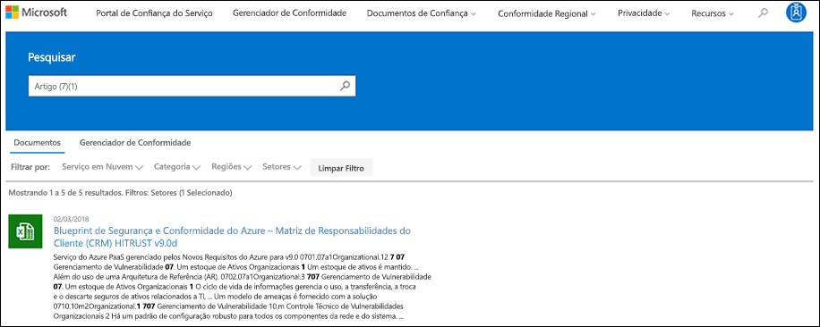
  
Clique no link Gerenciador de Conformidade para exibir os resultados de pesquisa para controles de avaliação do Gerenciador de Conformidade. Os resultados listados na pesquisa mostram a data em que a avaliação foi criada, o nome do agrupamento da avaliação, o serviço de nuvem aplicável e se os controles são gerenciados pela Microsoft ou pelo cliente.
  
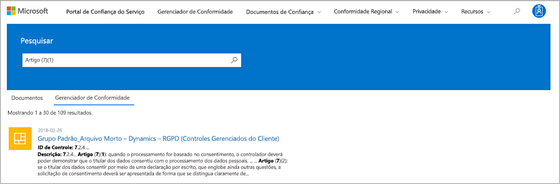
  
> [!NOTE]
> Os relatórios e documentos do Portal de Confiança do Serviço ficam disponíveis para baixar durante pelo menos doze meses após a publicação ou até uma nova versão do documento ficar disponível. 
 
## Suporte de localização

O Portal de Confiança do Serviço permite visualizar o conteúdo da página em diferentes idiomas. Para alterar o idioma da página, clique no ícone de globo no canto inferior esquerdo da página e selecione o idioma. 
  
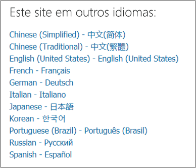

## Avaliações no Gerenciador de Conformidade

O componente principal do Gerenciador de Conformidade é chamado de *Avaliação*. Uma Avaliação avalia um serviço da Microsoft em relação a um padrão de certificação ou regulamentação de proteção de dados (como ISO 27001:2013 e o RGPD). As avaliações ajudam a discernir a postura de conformidade e proteção de dados da sua organização em relação ao padrão do setor do serviço de nuvem da Microsoft selecionado. As avaliações são concluídas com a implementação dos controles que mapeiam os padrões de certificação sob avaliação. 
  
A estrutura de uma Avaliação baseia-se na responsabilidade que é compartilhada entre a Microsoft e a sua organização para avaliar os riscos de segurança e conformidade na nuvem e implementar as garantias de proteção de dados especificadas por um padrão de conformidade, um padrão de proteção de dados, uma regulamentação ou uma lei.
  
Uma Avaliação tem vários componentes, que são:
  
- **Serviços no Escopo** – cada avaliação se aplica a um conjunto específico de serviços Microsoft, que são listados na seção Serviços em nuvem no escopo. 
    
- **Controles Gerenciados pela Microsoft** – para cada serviço de nuvem, a Microsoft implementa e gerencia um conjunto de *controles* como parte da conformidade da Microsoft com vários padrões e regulamentações. Esses controles são organizados em *famílias de controles* que se alinham com a estrutura de certificação ou regulamentação correspondente à qual a Avaliação está alinhada. Para cada controle gerenciado pela Microsoft, o Gerenciador de Conformidade fornece detalhes sobre como a Microsoft implementou o controle, como isso foi feito e quando essa implementação foi testada e validada por um auditor independente de terceiros. 
    
    Aqui está um exemplo de três controles gerenciados pela Microsoft na família de controle **Segurança** de uma Avaliação do Office 365 e do RGPD. 

    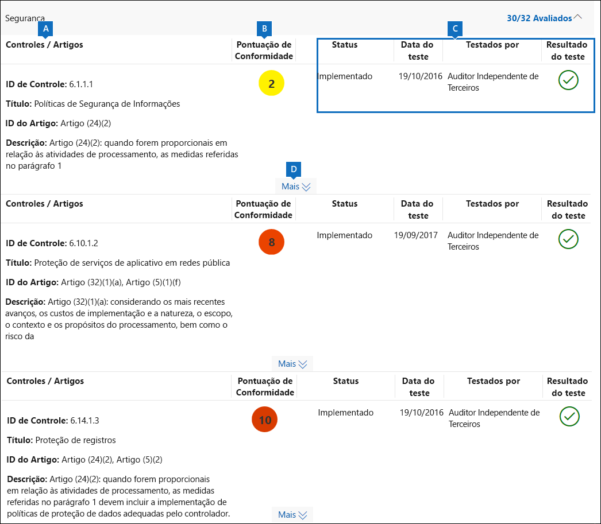
  
  a. Especifica as seguintes informações de certificação ou regulamentação mapeadas pelo controle gerenciado pela Microsoft.

  - **ID de Controle** – o número do artigo ou seção da certificação ou regulamentação mapeada pelo controle.
    
  - **Título** – o título da regulamentação ou certificação correspondente.
    
  - **ID do artigo** – esse campo é incluído somente para avaliações do RGPD, pois especifica o número do artigo correspondente do RGPD.
    
  - **Descrição** – texto do padrão ou regulamentação mapeado pelo Controle de gerenciado da Microsoft selecionado.

  b. A pontuação de conformidade do controle, que indica o nível de risco (devido à falha do controle ou não conformidade) associado a cada controle gerenciado pela Microsoft. Confira [Noções básicas sobre a pontuação de conformidade](#understanding-the-compliance-score) para saber mais. Observe que as Pontuações de conformidade são classificadas de 1 a 10 e são codificadas por cores. Amarelo indica os controles de baixo risco, laranja indica controles de médio risco e vermelho indica controles de alto risco. 
    
  c. Informações sobre o status de implementação de um controle, a data de teste do controle, quem executou o teste e o resultado de teste.
    
  d. Para cada controle, clique em **Mais** para ver informações adicionais, incluindo detalhes sobre a implementação do controle pela Microsoft e os detalhes sobre como o controle foi testado e validado por um auditor independente de terceiros. 
    
- **Controles gerenciados pelo cliente** – este é o conjunto de controles gerenciados pela sua organização. Sua organização é responsável por implementar esses controles como parte do processo de conformidade para um determinado padrão ou regulamentação. Os controles gerenciados pelo cliente também são organizados em famílias de controles para regulamentação ou certificação correspondente. Use os controles gerenciados pelo cliente para implementar as ações recomendadas sugeridas pela Microsoft como parte das atividades de conformidade. Sua organização pode usar a orientação prescritiva e as Ações do cliente recomendadas em cada controle gerenciado pelo cliente para gerenciar o processo de implementação e avaliação desse controle.
    
    Os controles gerenciados pelo cliente em Avaliações também têm a funcionalidade interna de gerenciamento de fluxo de trabalho que você pode usar para gerenciar e acompanhar o progresso da organização para concluir a Avaliação. Por exemplo, o Responsável pela conformidade em sua organização pode atribuir um Item de ação para um administrador de TI que tenha a responsabilidade e as permissões necessárias para executar as ações recomendadas para o controle. Após a conclusão do trabalho, o administrador de TI pode carregar as evidências das tarefas de implementação (por exemplo, capturas de tela das configurações ou configurações de políticas) e atribuir o Item de ação de volta para o Responsável pela conformidade avaliar as evidências coletadas, testar a implementação do controle e registrar a data de implementação e os resultados do teste no Gerenciador de Conformidade. Para saber mais, confira a seção [Como gerenciar o processo de avaliação](#managing-the-assessment-process) no artigo. 
  
## Permissões e controle de acesso baseado na função

Por padrão, todos em sua organização com uma conta do Office 365 ou do Azure Active Directory têm acesso ao Gerenciador de Conformidade e podem executar qualquer ação nele. Para alterar as permissões padrão no modelo de controle de acesso baseado na função, pelo menos um usuário deve ser adicionado a cada função do Gerenciador de Conformidade (confira as instruções a seguir). Depois que um usuário é adicionado a uma função, as permissões para executar as ações atribuídas a essa função são removidas do conjunto de permissões disponíveis para todos os usuários e somente os usuários que foram atribuídos àquela função podem acessar o Gerenciador de Conformidade e executar as ações permitidas para aquela função.
  
Depois que o acesso baseado na função é implementado, qualquer usuário que não tenha recebido uma função definida no Gerenciador de Conformidade terá acesso como Convidado.
  
> [!NOTE]
> Para implementar totalmente o controle de acesso baseado na função para gerenciar quem pode acessar e executar as ações no Gerenciador de Conformidade, um usuário deve ser adicionado a cada função para alterar as permissões padrão. Por exemplo, se você adicionar um usuário a uma função que permite que os usuários gerenciem Avaliações, somente membros dessa função poderão gerenciar as Avaliações. Da mesma forma, se você não adicionar um usuário a uma função que permita que os usuários leiam os dados no Avaliações, todos os usuários em sua organização poderão acessar o Gerenciador de Conformidade e ler os dados de qualquer Avaliação. 
  
A tabela a seguir descreve cada permissão do Gerenciador de Conformidade e o que ela permite que o usuário faça. A tabela também indica a função para a qual cada permissão é atribuída.
  
||**Leitor do Gerenciador de Conformidade**|**Colaborador do Gerenciador de Conformidade**|**Consultor do Gerenciador de Conformidade**|**Administrador do Gerenciador de Conformidade**|**Administrador do Portal**|
|:-----|:-----|:-----|:-----|:-----|:-----|
|**Ler dados** – os usuários podem ler, mas não podem editar os dados.    |             |             |             |             |             |
|**Editar dados** – os usuários podem editar todos os campos, exceto os campos Resultado e Data do teste.    ||             |             |             |             |
|**Editar resultados do teste** – os usuários podem editar os campos Resultado e Data do teste.    |||             |             |             |
|**Gerenciar avaliações** – os usuários podem criar, arquivar e excluir as Avaliações.    ||||             |             |
|**Gerenciar usuários** – os usuários podem adicionar outros usuários em sua organização nas funções de Leitor, Colaborador, Consultor e Administrador. Somente os usuários com a função de Administrador Global na organização podem adicionar ou remover os usuários da função de Administrador do Portal.  |||||             |
   
### Acesso de convidados
  
Depois que o acesso ao Gerenciador de Conformidade estiver configurado, qualquer usuário que não tenha uma função atribuída recebe por padrão o **Acesso de convidados** (que também é a experiência de todas as contas não atribuídas da organização, como Contas pessoais da Microsoft). Os usuários com Acesso de convidados não têm acesso total aos recursos do Gerenciador de Conformidade e não podem ver nenhum dado de avaliação de conformidade da organização, entretanto podem usar o Gerenciador de Conformidade para exibir os relatórios de avaliação de conformidade da Microsoft e os documentos do Service Trust. Para obter uma ilustração do que é ou não acessível, consulte as imagens abaixo, nas quais os recursos acessíveis são destacados em azul e os recursos inacessíveis são destacados em vermelho. 
  
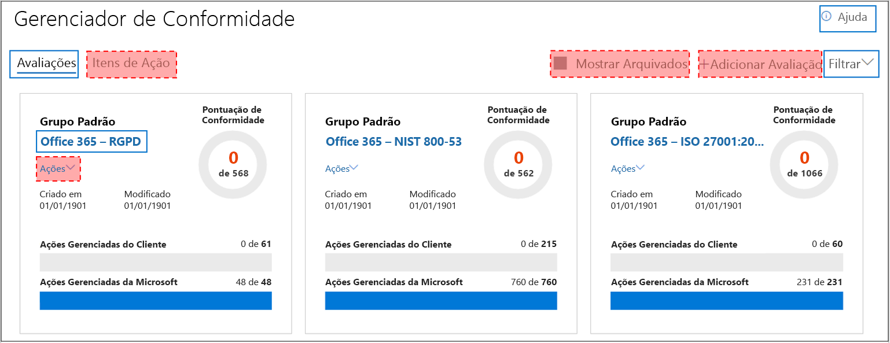
  
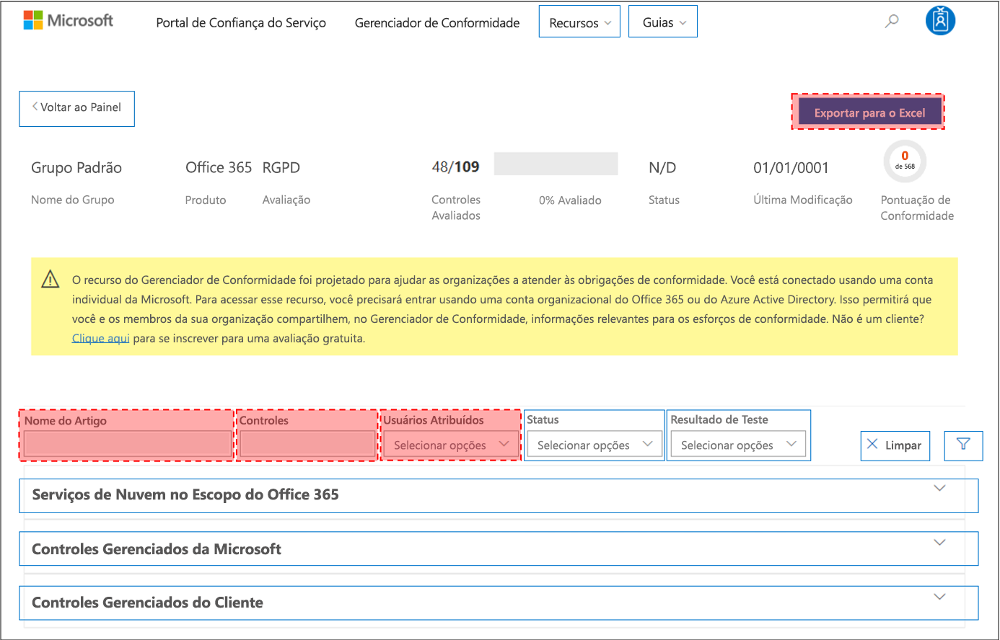

## Noções básicas sobre a pontuação de conformidade

No Painel, o Gerenciador de Conformidade exibe uma pontuação total para avaliações do Office 365 no canto superior direito do bloco. Este é o total geral da Pontuação de Conformidade da Avaliação e apresenta o acúmulo de pontos recebidos para cada avaliação de controle marcada como Implementada e Testada na Avaliação. Ao adicionar uma Avaliação, você verá que a Pontuação de Conformidade já está a caminho da conclusão porque os pontos para os controles gerenciados da Microsoft que foram implementados pela Microsoft e testados por terceiros independentes já foram aplicados.
  
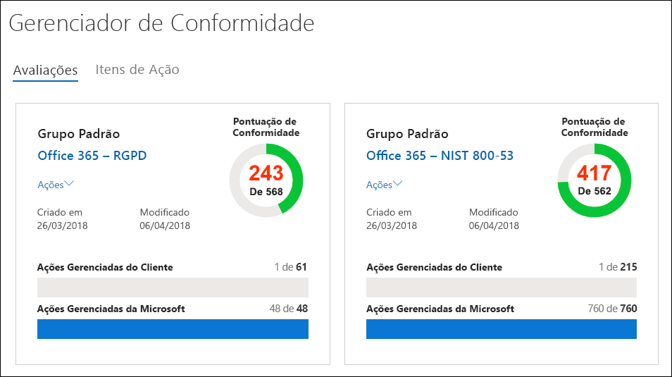
  
Os pontos restantes vêm da avaliação bem-sucedida do controle do cliente, desde a implementação e teste dos controles gerenciados pelo cliente, cada um com um valor específico que contribui para a pontuação geral de conformidade. 
  
Cada Avaliação exibe uma Pontuação de Conformidade com base no risco para ajudá-lo a avaliar o nível de risco (devido a problemas de incompatibilidades ou controle) associado a cada controle (incluindo os gerenciados pela Microsoft e pelo cliente) em uma Avaliação. A cada controle de gerenciamento de cliente é atribuído um número de pontos possíveis (chamados de *classificação de gravidade*) em uma escala de 1 a 10, onde mais pontos são concedidos para controles associados a um fator de risco mais alto se o controle falhar e menos pontos são concedidos para controles de menor risco. 
  
Por exemplo, o controle de avaliação do Gerenciamento de acesso do usuário mostrado abaixo tem uma classificação de risco de gravidade muito alta e exibe um valor atribuído de 10.
  
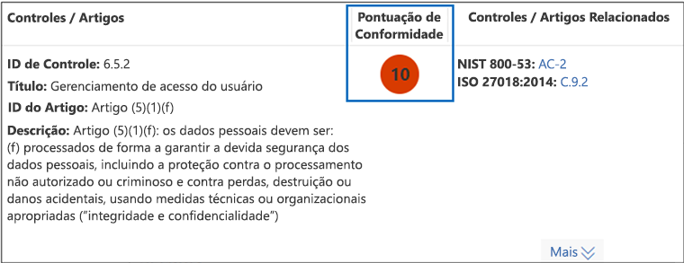
  
 Em comparação, o controle de avaliação de Backup de informações mostrado abaixo tem uma classificação de risco de gravidade baixa e exibe um valor atribuído de 3. 
  
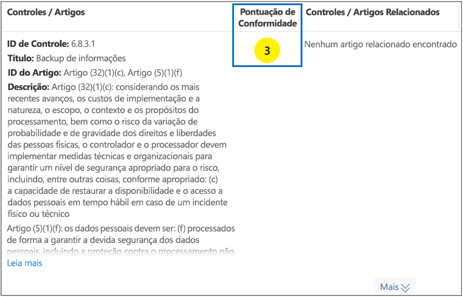
  
O Gerenciador de Conformidade atribui uma classificação de severidade padrão para cada controle. As classificações de risco são calculadas com base nos seguintes critérios:
  
- Se um controle impede a ocorrência de incidentes (classificação mais alta), detecta incidentes que aconteceram ou corrige o impacto de um incidente (classificação mais baixa). Em termos de classificação de gravidade, uma pontuação maior é atribuída a um controle que impeça uma ameaça e seja obrigatório; os controles que são detectores ou corretivos (independentemente de serem obrigatórios ou discricionários) recebem uma pontuação menor.
    
- Se for um controle obrigatório (depois que for implementado) e, portanto, não pode ser ignorado pelos usuários (por exemplo, os usuários tem que redefinir a senha e atender aos requisitos de comprimento e caracteres da senha) ou se for opcional e os usuários podem ignorá-lo (por exemplo, as regras de negócios que exigem que os usuários bloqueiem suas telas quando os computadores estão sem supervisão).
    
- Controles relacionados aos riscos de confidencialidade, integridade e disponibilidade de dados, quer esses riscos venham de ameaças internas ou externas e se forem acidentais ou mal-intencionadas. Por exemplo, são atribuídos mais pontos aos controles que podem ajudar a impedir que um invasor externo viole a rede e obtenha acesso a informações de identificação pessoal do que a um controle relacionado a impedir que um funcionário configure acidentalmente um roteador de rede de forma incorreta que resulte em uma interrupção da rede.
    
- Os riscos relacionados a gatilhos legais e externos, como contratos, regulamentos e compromissos públicos, para cada controle.
    
Os valores exibidos da Pontuação de Conformidade de um controle são aplicados *em sua totalidade* à Pontuação total de conformidade em uma base de aprovar/reprovar, ou seja, o controle é implementado e passa no teste de avaliação subsequente ou não; não há crédito parcial para uma implementação parcial. Somente quando o controle tem seu **Status de Implementação** definido como **Implementado** ou **Implementação Alternativa** e o **Resultado do Teste** é definido como **Aprovado** que os pontos atribuídos são adicionados à Pontuação total de conformidade. 
  
O mais importante é que a Pontuação de Conformidade pode ajudá-lo a priorizar em quais controles a implementação deve se concentrar, indicando quais controles têm maior risco potencial se houver uma falha relacionada. Além da priorização baseada no risco, vale a pena observar quais controles de avaliação estão relacionados a outros controles (seja dentro da mesma avaliação ou em outra avaliação que esteja no mesmo grupo de avaliação) e concluir um único controle com sucesso pode resultar em uma redução significativa de esforço com base na sincronização dos resultados dos testes de controles.
  
Por exemplo, na imagem abaixo vemos que a Avaliação de RGPD no Office 365 atualmente está com 46% concluído, com 51 de 111 avaliações de controle concluídas para uma Pontuação total de conformidade de 289 em um máximo de 600.
  
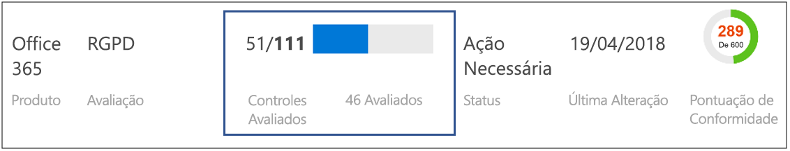
  
Na avaliação, o controle RGPD 7.5.5 está relacionado a 5 outros controles (7.4.1, 7.4.3, 7.4.4, 7.4.8 e 7.4.9), cada um com uma pontuação de classificação de risco de severidade de moderada a alta – 6 ou 8). Usando o filtro de avaliação, selecionamos todos esses controles, tornando-os visíveis no modo de exibição de avaliação, e podemos ver abaixo que nenhum deles foi avaliado. 
  
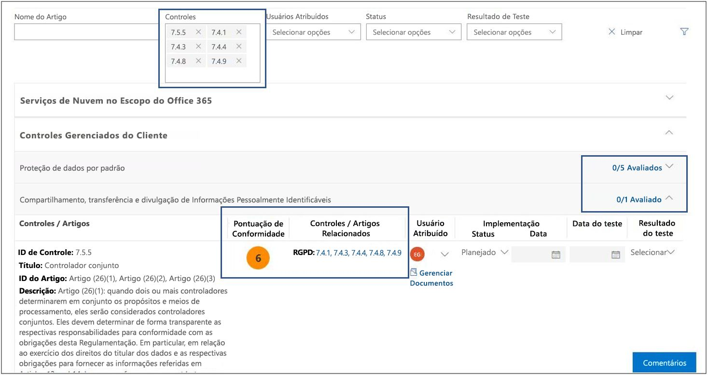 Como esses 6 controles estão relacionados, a conclusão de qualquer um deles causará a sincronização dos resultados do teste entre os controles relacionados dentro da avaliação (da mesma forma que ocorre com qualquer controle relacionado em uma avaliação que esteja no mesmo grupo de avaliação). Após a conclusão da implementação e do teste do controle RGPD 7.5.5, a área de detalhes de controle é atualizada para mostrar que todos os 6 controles foram avaliados, com um aumento correspondente no número de controles avaliados para 57 e 51% avaliados, e uma mudança na Pontuação de Conformidade total de +40. 
  
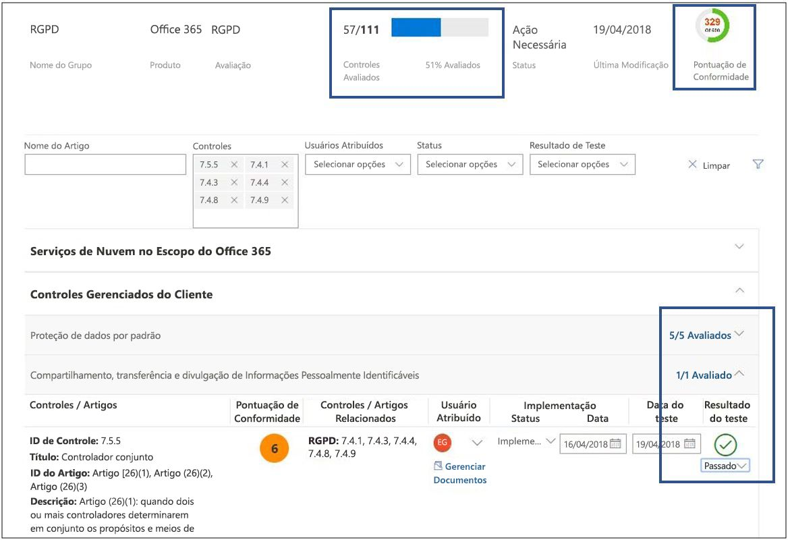
  
Essa caixa de diálogo de atualização de confirmação será exibida se você tentar alterar o Status de implementação de um controle relacionado de maneira que afete os outros controles relacionados.
  
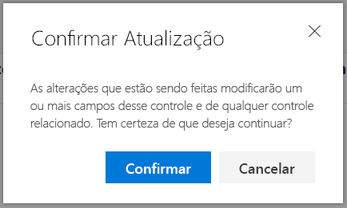
  
> [!NOTE]
> Atualmente, apenas as Avaliações de serviços em nuvem do Office 365 incluem uma Pontuação de Conformidade. As Avaliações do Azure e Dynamics mostram um status de avaliação. 

## Metodologia da Pontuação de Conformidade

A Pontuação de Conformidade, como a Microsoft Secure Score, é semelhante a outros sistemas de pontuação com base no comportamento; as atividades da sua organização podem aumentar a Pontuação de Conformidade executando atividades relacionadas à segurança, privacidade e proteção de dados.
  
> [!NOTE]
> A Pontuação de Conformidade não expressa uma medida absoluta da conformidade organizacional em relação a qualquer padrão ou regulamentação específicos. Ela expressa até que ponto você adotou os controles que podem reduzir os riscos aos dados pessoais e à privacidade individual. Nenhum serviço pode garantir que você esteja em conformidade com um padrão ou regulamentação e a Pontuação de Conformidade não deve ser interpretada como uma garantia de forma alguma. 
  
As Avaliações no Gerenciador de Conformidade são baseadas no modelo de responsabilidade compartilhada para computação em nuvem. No Modelo de responsabilidade compartilhada, a Microsoft e cada cliente compartilham a responsabilidade de proteção dos dados do cliente quando esses dados são armazenados em nossa nuvem.
  
Como mostrado abaixo na Avaliação do RGPD do Office 365, a Microsoft e os clientes são responsáveis por executar diversas Ações projetadas para atender aos requisitos da norma ou regulamentação que está sendo avaliada. Para racionalizar e compreender as Ações necessárias em vários padrões e regulamentações, o Gerenciador de Conformidade trata todos os padrões e regulamentações como se fossem estruturas de controle. Assim, as Ações realizadas pela Microsoft e pelos clientes para cada Avaliação envolvem a implementação e validação de vários controles.
  
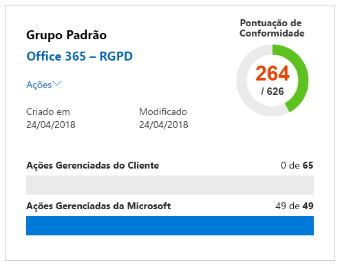
  
Aqui está o fluxo de trabalho básico de uma Ação típica:
  
1. O Diretor de proteção de dados e/ou Conformidade, Risco e Privacidade de uma organização atribui as tarefas a alguém na organização para implementar um controle. Essa pessoa pode ser:

    - Um proprietário de política da empresa
    
    - Um implementador de TI
    
    - Outra pessoa na organização que seja responsável por executar a tarefa
    
2. Esse indivíduo executa as tarefas necessárias para implementar o controle, carrega as evidências de implementação no Gerenciador de Conformidade e marca os controles vinculados à Ação conforme implementados. Depois que essas tarefas forem concluídas, a Ação é atribuída a um Consultor para validação. Os Consultores podem ser:
    
    - Consultores internos que executam a validação de controles na organização
    
    - Consultores externos que examinam, verificam e certificam a conformidade, como as organizações independentes de terceiros que auditam os serviços em nuvem da Microsoft
    
3. O Consultor valida o controle, examina a evidência e marca os controles como avaliados e os resultados da avaliação (por exemplo, aprovado).
    
Depois que todos os controles associados com uma Avaliação foram avaliados, a Avaliação é considerado concluída.
  
Todas as Avaliação no Gerenciador de Conformidade são previamente carregadas com informações que fornecem detalhes sobre as Ações tomadas pela Microsoft para atender aos requisitos de controles para as quais a Microsoft é responsável. Essas informações incluem detalhes sobre como a Microsoft implementou cada controle e como e quando s implementação da Microsoft foi avaliada e verificada por um auditor de terceiros. Por esse motivo, os Controles de gerenciamento da Microsoft de cada Avaliação são marcados como Avaliados e a Pontuação de Conformidade da Avaliação reflete isso.
  
Cada Avaliação inclui uma Pontuação de Conformidade total com base no modelo de responsabilidade compartilhado. A implementação e os testes da Microsoft dos controles do Office 365 contribui com uma parte do total de pontos possíveis associados a uma avaliação do RGPD. Como o cliente implementa e testa cada Ação do cliente, a Pontuação de Conformidade para a Avaliação aumentará de acordo com o valor atribuído ao controle. 
  
 ### Metodologia de pontuação com base em risco
  
O Gerenciador de Conformidade usa uma metodologia de pontuação com base em risco em uma escala de 1 a 10 que atribui um valor maior aos controles que representam um risco maior no caso de falha do controle ou de não conformidade. O sistema de pontuação usado pela Pontuação de Conformidade se baseia em diversos fatores, como:
  
- A essência do controle
    
- O nível de risco do controle baseado nos tipos de ameaças
    
- Os gatilhos externos do controle
    
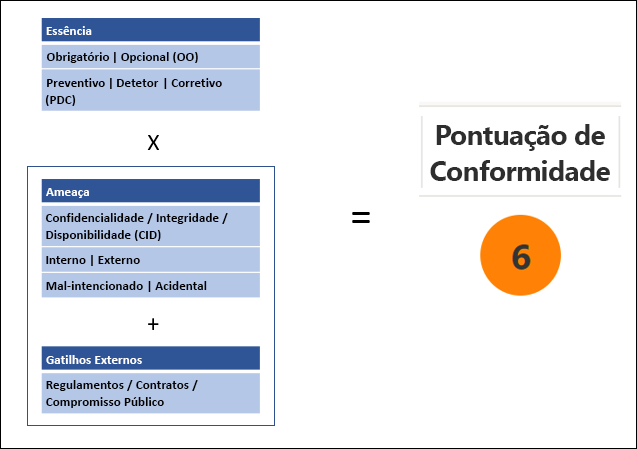
  
 ### Essência do controle
  
A essência do controle se baseia no fato do controle ser obrigatório ou opcional e se é do tipo Preventivo, Detector ou Corretivo.
  
 ### Obrigatório ou opcional
  
 *Controles obrigatórios* são controles que não podem ser ignorados intencionalmente ou acidentalmente. Um exemplo de um controle obrigatório comum é uma política de senha gerenciada centralmente que define os requisitos de tamanho, complexidade e vencimento da senha. Os usuários devem cumprir esses requisitos para acessar o sistema. 
  
 *Controles opcionais* dependem dos usuários, que devem entender a política e agir de acordo. Por exemplo, uma política que exige que os usuários bloqueiem seus computadores ao se ausentarem é um controle opcional, pois depende do usuário. 
  
 ### Preventivo, detector ou corretivo
  
 *Controles preventivos* são aqueles que impedem riscos específicos. Por exemplo, a proteção de informações em repouso usando a criptografia é um controle preventivo contra ataques, violações, etc. A separação de funções é um controle preventivo para gerenciar o conflito de interesses e proteger contra fraudes. 
  
 *Controles detectores* são aqueles que monitoram ativamente os sistemas para identificar condições ou comportamentos irregulares que representem riscos ou que possam ser usados para detectar intrusões, ou ainda determinam se ocorreu uma violação. A auditoria de acesso ao sistema e a auditoria de ações administrativas privilegiadas são tipos de controles de monitoramento detectores; as auditorias de conformidade normativa são um tipo de controle detector usado para localizar os problemas do processo. 
  
 *Controles corretivos* são aqueles que tentam minimizar os efeitos negativos de um incidente de segurança, tomam medidas corretivas para reduzir o efeito imediato e revertem os danos, se possível. A resposta do incidente de privacidade é um controle corretivo para limitar os danos e restaurar os sistemas para um estado operacional após uma violação. 
  
Ao avaliar cada controle usando esses fatores, determinamos a essência do controle e atribuímos a eles um valor relativo ao risco que representam.
  
 **Ameaça**
  
||||
|:-----|:-----|:-----|
||**Obrigatório**   |**Opcional**   |
|**Preventivo**   |Alto risco    |Médio risco    |
|**Detector**   |Médio risco    |Baixo risco    |
|**Corretivo**   |Médio risco    |Baixo risco    |
   
Ameaça refere-se a qualquer coisa que represente um risco ao padrão fundamental de segurança aceito universalmente, conhecido como tríade CIA de dados: Confidencialidade, Integridade e Disponibilidade:
  
- Confidencialidade significa que as informações podem ser lidas e compreendidas apenas por fornecedores confiáveis, autorizados.
    
- Integridade significa que as informações não foram modificadas ou destruídas por terceiros.
    
- Disponibilidade significa que as informações podem ser facilmente acessadas com um alto nível de qualidade do serviço.
    
Uma falha nessas características é considerada como comprometimento do sistema como um todo. As ameaças podem vir de fontes internas e externas e a finalidade do causador pode ser acidental ou mal-intencionada. Esses fatores são estimados em uma matriz de ameaças que atribui níveis de ameaças alta, moderada ou baixa para cada combinação dos cenários.

||**Interno** ||**Externo** ||||
|:-----|:-----|:-----|:-----|:-----|:-----|:-----|
||*Mal-intencionado* |*Acidental* |*Mal-intencionado* |*Acidental* |||
|**Confidencialidade** |(A, M ou B)    |(A, M ou B)    |(A, M ou B)    |(A, M ou B)|
|**Integridade** |(A, M ou B)    |(A, M ou B)    |(A, M ou B)    |(A, M ou B)|
|**Disponibilidade** |(A, M ou B)    |(A, M ou B)    |(A, M ou B)    |(A, M ou B)|
   
 **Gatilhos externos**
  
|**Contratos**|**Regulamentos**|**Compromissos públicos**|
|:-----|:-----|:-----|
|(A, M ou B)    |(A, M ou B)    |(A, M ou B)    |
   
Fatores externos como regulamentos aplicáveis, contratos e compromissos públicos podem influenciar controles desenvolvidos para proteger dados e evitar violações de dados, e cada um desses fatores são valores de risco atribuídos, seja alto, moderado ou baixo.
  
A quantidade estimada de ocorrências desses valores de risco Alto, Moderado ou Baixo nos 15 cenários possíveis de riscos representados na CIA/ameaças e Gatilhos Jurídicos/Externos é combinada para fornecer uma ponderação de risco que considera a probabilidade e o número de ocorrências de riscos em um determinado valor como significativo e é considerado ao calcular a classificação de gravidade do controle.
  
Com base na classificação da gravidade do controle, o controle recebe seu valor de pontuação de conformidade, um número entre 1 (baixo) e 10 (alto), agrupado nas seguintes categorias de risco:
  
|**Nível de risco**|**Valor do controle**|
|:-----|:-----|
|Baixo    |1 a 3    |
|Moderado    |6    |
|Alto    |8    |
|Grave    |10    |
   
Ao priorizar os controles de avaliação com os valores mais altos de pontuação de conformidade, a organização se concentra nos itens de maior risco e recebe um retorno positivo proporcionalmente maior na forma de mais pontos adicionados à pontuação total de conformidade para a avaliação de cada avaliação de controle concluída.
  
### Resumo da metodologia de pontuação
  
A Pontuação de Conformidade é o principal componente da maneira em que o Gerenciador de Conformidade ajuda as organizações a entenderem e gerenciarem a conformidade. A Pontuação de Conformidade de uma avaliação é uma expressão da conformidade da empresa com um determinado padrão ou regulamentação, como um número onde quanto maior a pontuação (até o número máximo de pontos alocado para a Avaliação), melhor a postura de conformidade da empresa. Entender a metodologia da pontuação de conformidade, na qual os controles de avaliação recebem valores de gravidade de risco entre 1 a 10 (baixo a alto) e como as avaliações de controle concluídas aumentam a pontuação total de conformidade, é algo crucial para as organizações priorizarem suas ações.

## Agrupamento de avaliações

Ao criar uma nova Avaliação, você precisa criar um novo grupo para atribuir a Avaliação ou então deve atribuir a Avaliação a um grupo existente. Os grupos permitem organizar logicamente as Avaliações e compartilhar informações comuns e tarefas de fluxo de trabalho entre as Avaliações que possuem os mesmos controles relacionados gerenciados pelo cliente.
  
Por exemplo, você pode agrupar Avaliações por ano ou equipes, departamentos ou agências em sua organização ou agrupá-las por ano. Aqui estão alguns exemplos de grupos e as Avaliações que eles podem conter.
  
- Avaliações de RGPD – 2018
    
  - Office 365 + RGPD
    
  - Azure + RGPD
    
  - Dynamics + RGPD
    
- Avaliações do Azure – 2018
    
  - Azure + RGPD
    
  - Azure + ISO 27001:2013
    
  - Azure + ISO 27018:2014
    
- As avaliações de privacidade e segurança de dados
    
  - Office 365 + ISO 27001:2013
    
  - Office 365 + ISO 27018:2014
    
  - Azure + ISO 27001:2013
    
  - Azure + ISO 27018:2014
    
> [!TIP]
> Recomendamos determinar uma estratégia de agrupamento para sua organização antes de adicionar novas avaliações. 
  
Estes são os requisitos para agrupar Avaliações:
  
- Os nomes de grupo (também chamado de *IDs de grupo*) devem ser exclusivos em sua organização. 
    
- Os grupos podem conter Avaliações da mesma certificação/regulamentação, mas cada grupo pode conter uma Avaliação para um par específico de certificação/serviços em nuvem. Por exemplo, um grupo não pode conter duas Avaliações do Office 365 e RGPD. Da mesma forma, um grupo pode conter várias Avaliações no mesmo serviço de nuvem desde que a certificação/regulamentação correspondente para cada uma delas seja diferente.
    
Depois que uma avaliação for adicionada a um agrupamento de avaliação, o agrupamento não poderá ser alterado. Você pode renomear o grupo de avaliação, o que altera o nome do agrupamento de avaliação para todas as avaliações associadas a esse grupo. É possível criar uma nova avaliação e um novo grupo de avaliações e então copiar informações de uma avaliação existente, o que efetivamente cria uma duplicata dessa avaliação em um grupo de avaliação diferente. Arquivar uma avaliação quebra a relação entre essa avaliação e o grupo de avaliações; quaisquer outras atualizações em outras avaliações relacionadas não serão mais refletidas na avaliação arquivada.
  
Como explicado anteriormente, uma vantagem importante do uso de grupos é que, quando duas Avaliações diferentes no mesmo grupo compartilham o mesmo controle gerenciado pelo cliente (portanto as ações do cliente seriam as mesmas para cada controle), então a conclusão dos detalhes da implementação, as informações de testes e o status do controle em uma Avaliação seriam sincronizados com o mesmo controle em qualquer outra Avaliação do grupo. Em outras palavras, se as avaliações compartilharem o mesmo controle e essas Avaliações estiverem no mesmo grupo, você só precisará gerenciar o processo de avaliação do controle em uma Avaliação. Os resultados desse controle serão automaticamente sincronizados com as outras Avaliações. Por exemplo, a ISO 27001 e a ISO 27018 possuem um controle relacionado às políticas de senha. Se o Status do Teste para o controle for definido como "Aprovado" em uma Avaliação, o controle será atualizado (e marcado como "Aprovado") na outra Avaliação, desde que ambas as avaliações façam parte do mesmo Grupo de Avaliação.
  
Como exemplo disto, considere esses dois controles de avaliação relacionados, ambos relacionados com a criptografia de dados em redes públicas, o controle 6.10.1.2 no Office 365 – avaliação de RGPD, e o controle SC 13 no Office 365 – avaliação do NIST 800-53. Estes controles de avaliação se relacionam em duas avaliações diferentes, ambas no Grupo Padrão; inicialmente, nenhuma avaliação foi concluída em nenhuma das avaliações de controle de cliente, conforme exibido no Painel do Gerenciador de Conformidade que mostra estas duas Avaliações.
  

  
Ao clicar na avaliação **Office 365 – RGPD** e usar os controles de filtro para exibir o controle RGPD 6.10.1.2, podemos ver que o controle NIST 800-53 SC-13 está listado como um controle relacionado.
  
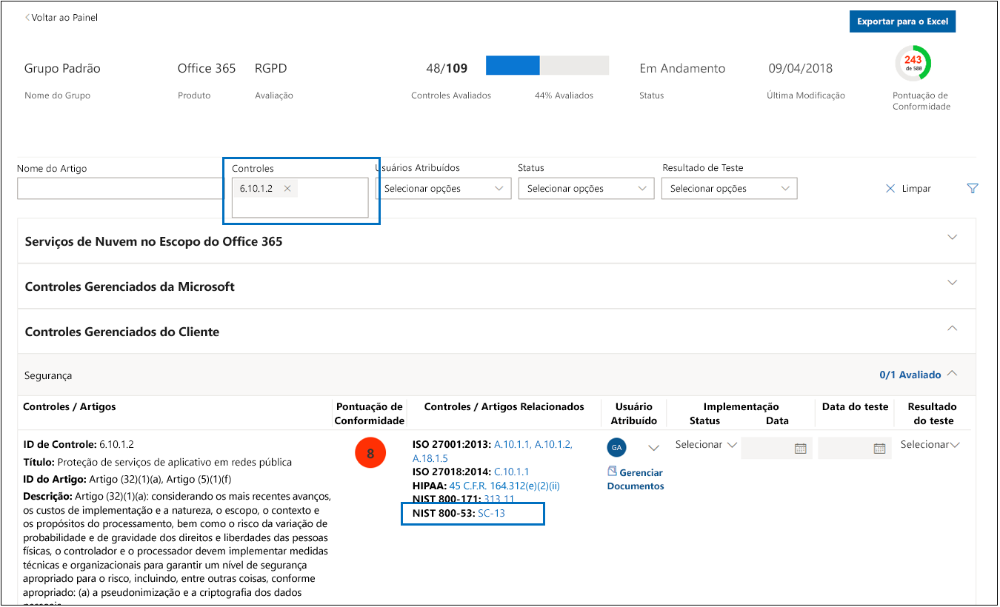
  
 Aqui mostramos a conclusão da implementação e testes do controle RGPD 6.10.1.2. 
  
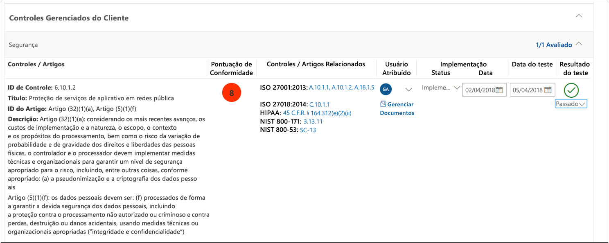
  
Ao navegar até o controle relacionado na avaliação agrupada, podemos ver que NIST 800-53 SC-13 também foi marcada como concluída com a mesma data e hora, sem a necessidade de implementação adicional ou teste.
  
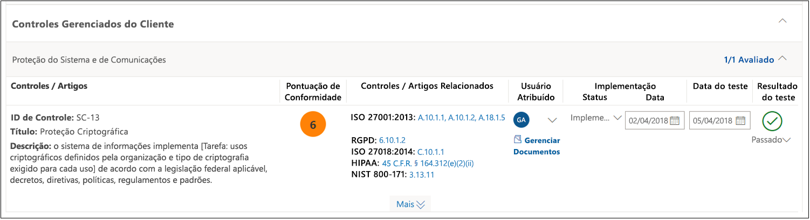
  
Novamente no Painel, podemos ver que cada avaliação tem 1 avaliação de controle concluída e a Pontuação total de conformidade para cada avaliação aumentou em 8 (o valor de pontuação de conformidade do controle compartilhado).
  
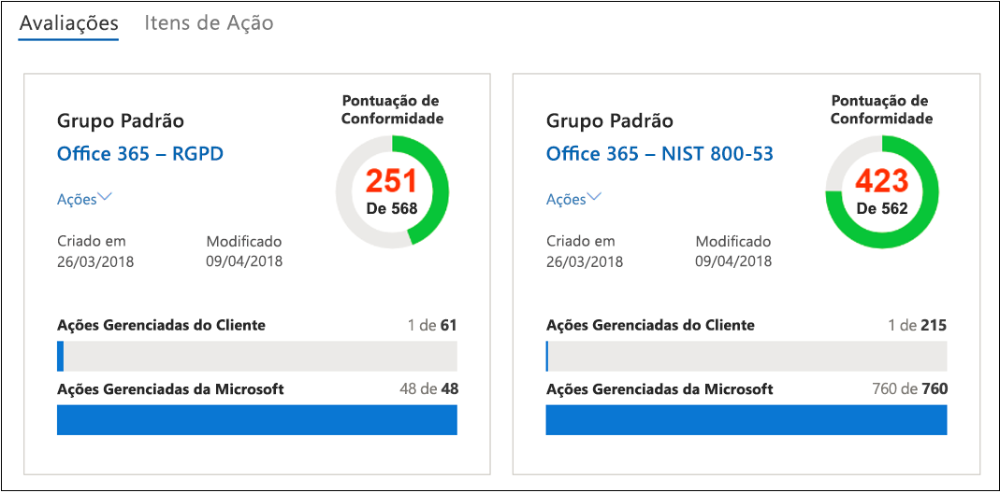

## Funções administrativas

Há funções administrativas específicas disponíveis apenas para a conta de administrador do locatário e que só ficam visíveis após login como administrador global.
  
> [!NOTE]
> A permissão Acesso a documentos restritos na lista suspensa permite que os administradores forneçam aos usuários o acesso a documentos restritos compartilhados pela Microsoft no Portal de Confiança do Serviço. O recurso Documentos restritos ainda não está disponível, mas será lançado em breve. 
  
### Atribuir funções do Gerenciador de Conformidade aos usuários

Cada função do Gerenciador de Conformidade tem permissões ligeiramente diferentes. Você pode exibir as permissões atribuídas a cada função, conferir quais usuários estão em quais funções e adicionar ou remover usuários dessa função no Portal de Confiança do Serviço, selecionando o item de menu **Administração** e, em seguida, escolhendo **Configurações **. 
  

  
Para adicionar ou remover usuários das funções do Gerenciador de Conformidade.
  
1. Acesse [https://servicetrust.microsoft.com](https://servicetrust.microsoft.com).
    
2. Entre com sua conta de administrador global do Azure Active Directory.
    
3. Na barra de menus superior do Portal de Confiança do Serviço, clique em **Administração** e, em seguida, escolha **Configurações**. 
    
4. Na lista suspensa **Selecionar Função**, clique na função que deseja gerenciar. 
    
5. Os usuários adicionados a cada função são listados na página **Selecionar função**. 
    
6. Para adicionar usuários a essa função, clique em **Adicionar**. Na caixa de diálogo **Adicionar Usuários**, clique no campo do usuário. Você pode percorrer a lista de usuários disponíveis ou começar a digitar o nome de usuário para filtrar a lista com base no termo de pesquisa. Clique no usuário para adicionar essa conta à lista **Adicionar Usuários** que será provisionada com essa função. Se você quiser adicionar vários usuários ao mesmo tempo, comece a digitar um nome de usuário para filtrar a lista e, em seguida, clique no usuário para adicioná-lo à lista. Clique em **Salvar** para provisionar a função selecionada a esses usuários. 
    
    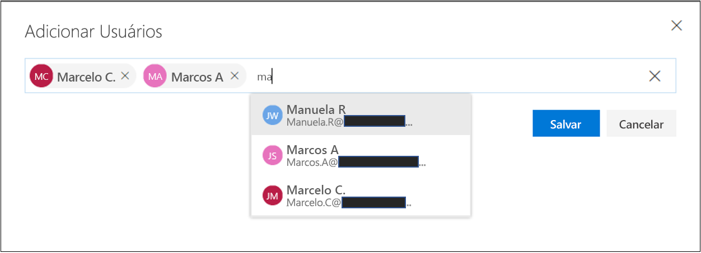
  
7. Para remover os usuários dessa função, selecione os usuários e clique em **Excluir**. 
    
    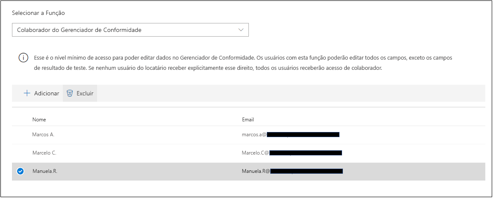
 
## Configurações de privacidade do usuário

Determinadas regulamentações exigem que uma organização deve ser capaz de excluir os dados de histórico do usuário. Para ativar isso, o Gerenciador de Conformidade fornece as funções de **Configurações de Privacidade do Usuário** que permitem aos administradores: 
  
- [Procurar um usuário](#search-for-a-user)

- [Exportar um relatório do histórico de dados da conta](#export-report-of-account-data-history)

- [Reatribuir os itens de ação](#reassign-action-items)

- [Excluir o histórico de dados do usuário](#delete-user-data-history)
    
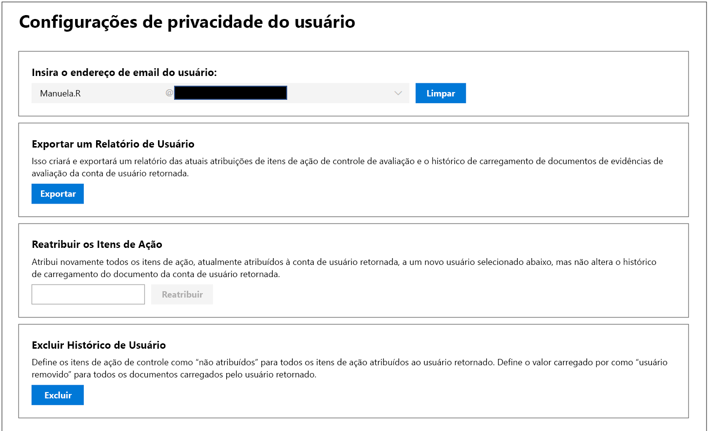
  
### Procurar um usuário

Para procurar uma conta de usuário:
  
1. Insira o endereço de email do usuário digitando o alias (informações à esquerda do símbolo @) e escolhendo o nome de domínio clicando na lista sufixo de domínio à direita. Se esse for um locatário com vários domínios registrados, você pode verificar novamente o sufixo do nome de domínio do endereço de email para garantir que esteja correto.
    
2. Assim que o nome de usuário for inserido corretamente, clique em **Pesquisar**. 
    
3. Se a conta de usuário não for encontrada, a página exibe a mensagem de erro "Usuário não encontrado". Verifique as informações de endereço de email do usuário, faça as correções necessárias e clique em **Pesquisar** para tentar novamente. 
    
4. Se a conta de usuário for encontrada, o texto do botão será alterado de **Pesquisar** para **Limpar**, o que indica que a conta de usuário retornada é o contexto operacional para as funções adicionais que serão exibidas abaixo e que a execução dessas funções será aplicada a essa conta de usuário. 
    
5. Para limpar os resultados da pesquisa e pesquisar um usuário diferente, clique em **Limpar**. 
    
### Exportar um relatório do histórico de dados da conta

Depois de identificar a conta de usuário, você poderá gerar um relatório das dependências existentes vinculadas a essa conta. Essas informações permitirão reatribuir itens de ação abertos ou garantir o acesso às evidências carregadas anteriormente. 
  
 Para gerar e exportar um relatório:
  
1. Clique em **Exportar** para gerar e baixar um relatório dos itens de ação de controle do Gerenciador de Conformidade atualmente atribuídos à conta de usuário retornada, bem como a lista de documentos carregados pelo usuário. Se não surgirem ações atribuídas ou documentos carregados, uma mensagem de erro informará "Nenhum dado para esse usuário". 
    
2. O relatório é baixado em segundo plano na janela ativa do navegador, assim, se você não vir um pop-up, verifique o histórico de download do navegador.
    
3. Abra o documento para verificar os dados do relatório.
    
> [!NOTE]
> Este não é um relatório histórico que retêm e exibe as alterações de estado no histórico de atribuições de itens de ação. O relatório gerado é um instantâneo dos itens de ação de controle atribuídos no momento em que o relatório é executado (carimbo de data e hora gravado no relatório). Por exemplo, qualquer reatribuição subsequente de itens de ação resultará em dados de relatório de captura instantânea diferentes se esse relatório for gerado novamente para o mesmo usuário. 
  
### Reatribuir os itens de ação

Esta função permite que uma organização remova quaisquer dependências ativas ou pendentes da conta do usuário, reatribuindo todas as propriedades de item de ação (o que inclui os itens de ação ativos e concluídos) da conta de usuário retornada para um novo usuário selecionado abaixo. Essa ação não altera o histórico de carregamento do documento para a conta de usuário retornada. 
  
 Para reatribuir itens de ação para outro usuário:
  
1. Clique na caixa de entrada para procurar e selecionar outro usuário na organização para o qual os itens de ação do usuário retornado devem ser atribuídos.
    
2. Selecione **Substituir** para reatribuir todos os itens de ação de controle do usuário retornado ao usuário recém-selecionado. 
    
3. A caixa de diálogo de confirmação exibida informa "Isso reatribuirá todos os itens de ação de controle do usuário atual para o usuário selecionado. Essa ação não pode ser desfeita. Tem certeza de que deseja continuar?"
    
4. Para continuar, clique em **OK**, senão clique em **Cancelar**. 
    
> [!NOTE]
> Todos os itens de ação (ativos e concluídos) serão atribuídos ao usuário recém-selecionado. No entanto, essa ação não afetará o histórico de carregamento do documento, todos os documentos carregados pelo usuário atribuído previamente ainda exibirão a data/hora e nome do usuário atribuído anteriormente. 
  
Alterar o histórico de carregamento do documento para remover o usuário atribuído previamente precisará ser realizado como um processo manual. Nesse caso, o administrador precisará:
  
1. Abrir o relatório de exportação baixado anteriormente.
  
2. Identificar e navegar até o item de ação de controle desejado.
  
3. Clicar em **Gerenciar Documentos** para navegar até o repositório de evidências daquele controle. 
  
4. Baixar o documento.
  
5. Excluir o documento no repositório de evidências.
  
6. Carregar o documento novamente. Agora, o documento terá uma nova data e hora de carregamento, e Carregado pelo nome de usuário. 
  
### Excluir o histórico de dados do usuário

Isso configura os itens de ação de controle como "Não atribuídos" para todos os itens de ação atribuídos ao usuário retornado. Isso também configura o Carregado por com valor "usuário removeu" para todos os documentos carregados pelo usuário retornado
  
 Para excluir o item de ação de conta de usuário e o histórico de carregamento de documento:
  
1. Clique em **Excluir**. 

    Uma caixa de diálogo de confirmação é exibida, informando "Isso removerá todas as atribuições de item de ação de controle e o histórico de carregamento do documento do usuário selecionado. Essa ação não pode ser desfeita. Tem certeza de que deseja continuar?"
    
3. Para continuar, clique em **OK**, senão clique em **Cancelar**. 
  
## Como usar o Gerenciador de Conformidade

O Gerenciador de Conformidade fornece ferramentas para atribuir, controlar e registrar as atividades relacionadas à avaliação e conformidade, e ajuda sua organização a cruzar as barreiras de equipe para alcançar as metas de conformidade da sua organização.
  
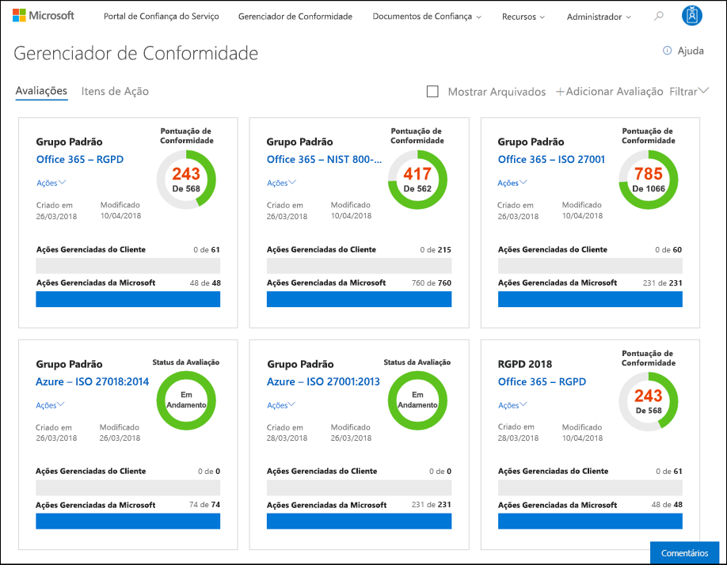

## Como acessar o Gerenciador de Conformidade

Acesse o Gerenciador de Conformidade no Portal de Confiança do Serviço. Qualquer pessoa com uma conta Microsoft ou uma conta organizacional do Azure Active Directory pode acessar o Gerenciador de Conformidade.
  

  
1. Acesse [https://servicetrust.microsoft.com](https://servicetrust.microsoft.com/).
    
2. Entre com sua conta de usuário do Azure Active Directory (Azure AD).
    
3. No Portal de Confiança do Serviço, clique em **Gerenciador de Conformidade**. 
    
4. Quando o acordo de confidencialidade for exibido, leia-o e, em seguida, clique em **Concordar** para continuar. Você só precisa fazer isso uma vez e, em seguida, o painel do Gerenciador de Conformidade é exibido. 

    Para começar, adicionamos as Avaliações a seguir por padrão:
    
    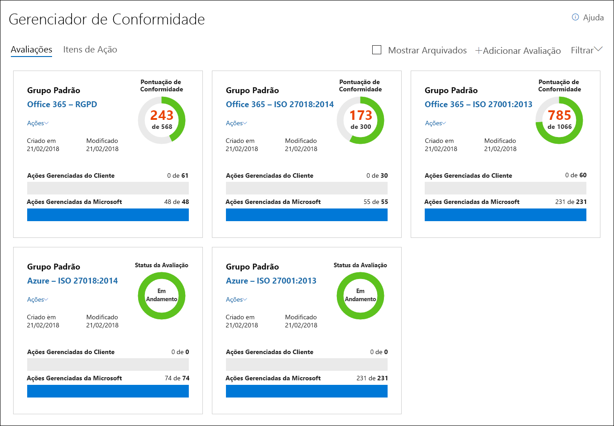
    
5. Clique no  **Ajuda** para fazer um tour rápido no Gerenciador de Conformidade. 
  
## Exibir os itens de ação

O Gerenciador de Conformidade fornece uma exibição conveniente de todos os itens de ação de avaliações de controles atribuídos, permitindo que você tome ações de forma rápida e fácil. Você pode visualizar todos os itens de ação ou selecionar os itens de ação que correspondem a uma certificação específica ao clicar na guia associada a essa avaliação. Por exemplo, na imagem abaixo, a guia RGPD foi selecionada, mostrando os controles relacionados à avaliação RGPD.
  
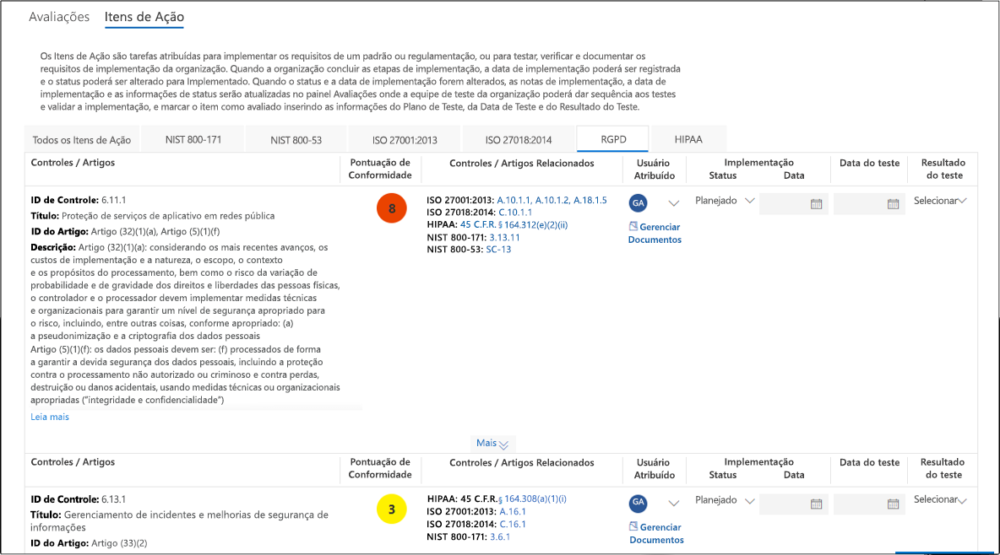
  
Para exibir seus itens de ação:
  
1. Acesse o painel do Gerenciador de Conformidade
    
2. Clique no link **Itens de Ação** e a página será atualizada para mostrar os itens de ação atribuídos a você. 
    
    Por padrão, todos os itens de ação são mostrados. Se você tiver itens de ação em várias certificações, os nomes das certificações serão listados nas guias da parte superior do controle de avaliação. Para ver os itens de ação de uma certificação específico, clique nessa guia.

## Adicionar uma avaliação

Para adicionar uma avaliação ao Gerenciador de Conformidade:
  
1. No painel Gerenciador de Conformidade, clique em  **Adicionar Avaliação**. 
    
2. Na janela **Adicionar uma Avaliação**, você pode criar um novo grupo ao qual adicionará a avaliação ou pode adicioná-la a um grupo existente (o grupo interno é denominado "Grupo inicial"). Dependendo da opção escolhida, digite o nome do novo grupo ou selecione um grupo existente na lista suspensa. Para saber mais, confira [Agrupamento de avaliações](meet-data-protection-and-regulatory-reqs-using-microsoft-cloud.md#grouping).
    
    Se você criar um novo grupo, também tem a opção de copiar informações de um grupo existente para a nova avaliação. Isso significa que as informações adicionadas aos campos Detalhes da implementação, Plano de teste e Resposta de gerenciamento dos controles gerenciados pelo cliente das avaliações do grupo que você está copiando ficarão iguais nos mesmos controles gerenciados pelo cliente (ou relacionados) na nova avaliação. Se você adicionar uma nova avaliação a um grupo existente, as informações comuns das avaliações desse grupo serão copiadas para a nova avaliação. Para saber mais, confira [Copiar informações de avaliações existentes](meet-data-protection-and-regulatory-reqs-using-microsoft-cloud.md#copying).
    
3. Clique em **Avançar** e faça o seguinte:
    
    a. Escolha um serviço de nuvem da Microsoft para avaliar a conformidade na lista suspensa **Selecionar um produto**. 
    
    b. Escolha uma certificação para avaliar o serviço de nuvem selecionado em comparação com uma opção da lista suspensa **Selecionar uma certificação**. 
    
4. Clique em **Adicionar ao Painel** para criar a avaliação, que será adicionada ao painel Gerenciador de Conformidade como um novo bloco no final da lista de blocos existentes. 
    
    O **Bloco de Avaliação** do painel Gerenciador de Conformidade exibe o agrupamento de avaliações, o nome da avaliação (criado automaticamente como uma combinação da certificação selecionado e do nome do serviço), a data da criação e a data da última modificação, a pontuação total de conformidade (que é a soma de todos os valores de risco de controles atribuídos que foram implementados, testados e aprovados) e, na parte inferior, o andamento dos indicadores que mostram o número de controles avaliados. 
    
5. Clique no nome da avaliação para abri-la e exibir seus detalhes.
    
6. Clique no menu **Ações** para ver seus itens de ações atribuídas, renomear o grupo de avaliação, exportar o relatório de avaliação ou arquivar a avaliação. 
    
    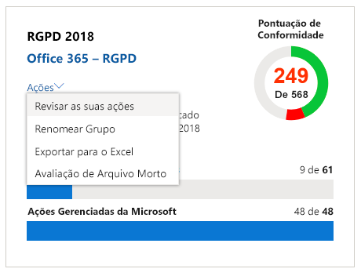

## Copiar informações de avaliações existentes

Como já explicado, quando você cria um novo grupo de avaliação, tem a opção de copiar informações das Avaliações em um grupo existente para a nova Avaliação no grupo novo. Isso permite aplicar o trabalho de avaliação e testes já concluídos aos mesmos controles de gerenciados do cliente na nova Avaliação. Por exemplo, se você tiver um grupo para todas as Avaliações relacionadas a RGPD na sua organização, pode copiar as informações comuns do trabalho de avaliação existente ao adicionar uma nova Avaliação ao grupo.
  
Você pode copiar as seguintes informações de cliente para uma nova Avaliação:
  
- Usuários da Avaliação. Um usuário da avaliação é um usuário ao qual o controle está atribuído.
    
- Status, Data de Teste e Resultados de Teste.
    
- Os detalhes da implementação e informações do plano de testes.
    
Da mesma forma, as informações de controles gerenciados do cliente compartilhadas no mesmo grupo de Avaliação são sincronizadas. E as informações nos controles gerenciados de clientes relacionadas na mesma avaliação também são sincronizadas.

## Como exibir avaliações

1. Localize o Bloco Avaliação correspondente à Avaliação que deseja exibir e, em seguida, clique no nome de avaliação para abri-la e visualizar os controles gerenciados da Microsoft e do cliente associados à Avaliação, junto com uma lista dos serviços em nuvem que estão no escopo da Avaliação. Aqui está um exemplo da Avaliação para o Office 365 e RGPD.
    
    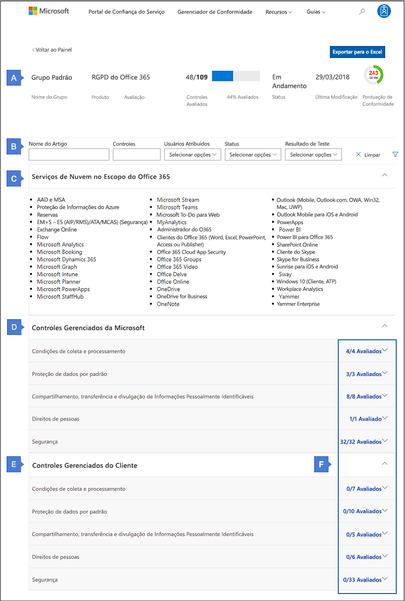
  
1. Esta seção mostra as informações do resumo da Avaliação, incluindo o nome de agrupamento, o produto, o nome e o número de controles da Avaliação
    
2. Esta seção mostra os controles de Filtro de avaliação. Para obter uma explicação mais detalhada de como usar os controles de Filtro de avaliação, confira a seção [Como gerenciar o processo de avaliação](meet-data-protection-and-regulatory-reqs-using-microsoft-cloud.md#managecomplianceprocess_1). 
    
3. Esta seção mostra os serviços em nuvem individuais no escopo da avaliação.
    
4. Esta seção contém controles gerenciados pela Microsoft. Controles relacionados são organizados por família de controle. Clique em uma família de controle para expandi-la e exibir os controles de individuais.
    
5. Esta seção contém controles gerenciados pelo cliente, que também são organizados por família de controle. Clique em uma família de controle para expandi-la e exibir os controles de individuais.
    
6. Exibe o número total de controles da família de controles e quantos desses controles já foram avaliados. Um recurso chave do Gerenciador de Conformidade é acompanhar o andamento da organização na avaliação dos controles gerenciados pelo cliente. Para saber mais, confira a seção [Noções básicas sobre a pontuação de conformidade](meet-data-protection-and-regulatory-reqs-using-microsoft-cloud.md#compliancescore). 

## Gerenciar o processo de avaliação

O criador de uma avaliação inicialmente é o único usuário da avaliação. Para cada controle gerenciado pelo cliente, você pode atribuir um Item de ação para uma pessoa da organização para que ela se torne o usuário de avaliação que pode executar as ações recomendadas ao cliente e também reunir e carregar evidências. Quando você atribui um Item de ação, pode optar por enviar para a pessoa um email com os detalhes, incluindo as Ações de cliente recomendadas e a prioridade do Item de ação. A notificação por email inclui um link para o painel **Itens de ação** que lista todos os itens de ação atribuídos a essa pessoa. 
  
Aqui está uma lista de tarefas a executar usando os recursos do fluxo de trabalho do Gerenciador de Conformidade.
  

  
1. **Use as opções de filtragem para encontrar os controles de avaliação específicos** – o Gerenciador de Conformidade fornece **Opções de filtro**, que proporcionam critérios de seleção altamente precisos para exibir os controles de avaliação, ajudando a visar com precisão as áreas de destino específicas dos esforços de conformidade. 
    
    Clique no ícone de funil no lado direito da página para mostrar ou ocultar os controles de **Opções de filtro**. Esses controles permitem especificar critérios de filtro e somente os controles de avaliação que atenderem a esses critérios serão exibidos abaixo. 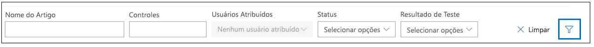
  
    - **Artigos** – filtra o nome do artigo e retorna os controles de avaliação associados a esse artigo. Por exemplo, digitar "Artigo (5)" retorna uma lista de seleção de artigos cujos nomes incluem essa cadeia de caracteres, ou seja, o artigo (5)(1)(a), o artigo (5)(1)(b), o artigo (5)(1)(c), etc. Selecionar o artigo (5)(1)(c) retorna os controles associados ao artigo (5)(1)(c). Esse é um campo de seleções múltiplas que usa um operador OR (ou) com vários valores – por exemplo, se você selecionar o artigo (5)(1)(a) e depois adicionar o artigo (5)(1)(c), o filtro retornará controles associados tanto ao artigo (5)(1)(a) como ao artigo (5)(1)(c). 
    
      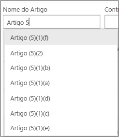
  
    - **Controles** – retorna a lista de controles cujos nomes se encaixam no filtro, por exemplo, digitar em 7.3 retorna uma lista de seleção de itens como 7.3.1, 7.3.4, 7.3.5, etc. Esse campo de seleções múltiplas usa um operador OR com vários valores; por exemplo, se você selecionar 7.3.1 e depois adicionar 7.3.4, o filtro retornará controles associados a 7.3.1 ou a 7.3.4. 
    
      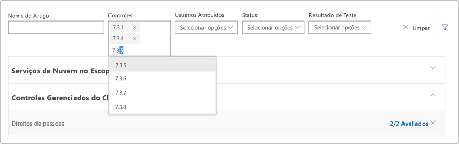
  
    - **Usuários atribuídos** – retorna a lista de controles atribuídos ao usuário selecionado. 
    
    - **Status** – retorna a lista de controles com o status selecionado. 
    
    - **Resultado do teste** – retorna a lista de controles do resultado de teste selecionado. 
    
    Conforme você aplica as condições de filtragem, o modo de exibição dos controles aplicáveis é alterado para corresponder às condições dessa filtragem. Expanda as seções das famílias de controles para mostrar os detalhes dos controles abaixo. 
    
    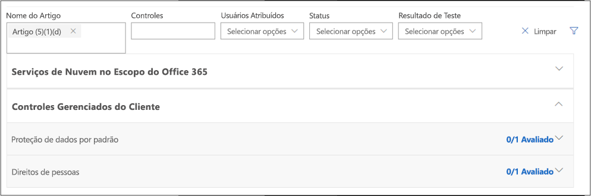
  
2. Se nenhum resultado for mostrado após a seleção dos filtros desejados, isso significa que não existem controles que correspondam às condições especificadas no filtro. Por exemplo, se você selecionar um determinado **Usuário Atribuído** e, em seguida, escolher um nome de **Controle** que correspondem ao controle atribuído ao usuário, nenhuma avaliação será exibida na página abaixo. 
    
3. **Atribuir item de ação a um usuário** – você pode atribuir um Item de ação para uma pessoa implementar os requisitos de certificação/regulamentação ou para testar, verificar e documentar os requisitos de implementação da sua organização. Ao atribuir um Item de ação, você pode optar por enviar para a pessoa um email com os detalhes, incluindo as Ações de cliente recomendadas e a prioridade do Item de ação. Você também pode cancelar a atribuição ou reatribuir um Item de ação para outra pessoa. 
    
4. **Gerenciar documentos** – controles gerenciados por clientes também têm um local para gerenciar documentos relacionados a realizar tarefas de implementação, de teste e de validação. Qualquer pessoa com permissões para editar dados no Gerenciador de Conformidade pode carregar documentos clicando em **Gerenciar documentos**. Depois de carregar um documento, você pode clicar em **Gerenciar documentos** para exibir e baixar os arquivos. 
    
5. **Fornecer detalhes de implementações e testes** – cada controle gerenciado por cliente tem um campo editável em que os usuários podem adicionar os detalhes da implementação que documentam as etapas executadas pela sua organização para atender aos requisitos da certificação/regulamento e para validar e documentar como sua organização atendeu a esses requisitos.
    
6. **Definir Status** – define o status de cada item como parte do processo de avaliação. Os valores de status disponíveis são **Implementado**, **Implementação alternativa**, **Planejado** e **Fora do Escopo**. 
    
7. **Inserir resultado de testes e data de teste** – a pessoa com a função de Consultor do Gerenciador de Conformidade pode verificar se os testes adequados foram realizados, revisar os detalhes da implementação, o plano de teste, os resultados do teste e quaisquer evidências carregadas e depois definir a Data do teste e o Resultado do teste. Os valores de resultados de testes disponíveis são **Aprovado**, **Reprovado–baixo risco**, **Reprovado–médio risco** ** ** e **Reprovado–alto risco**. 

## Gerenciar itens de ação

As pessoas envolvidas no processo de avaliação em sua organização podem usar o Gerenciador de Conformidade para examinar os controles gerenciados pelo cliente de todas as avaliações para as quais eles são usuários. Quando um usuário entra no Gerenciador de Conformidade e abre o painel **Itens de ação**, é exibida uma lista dos itens de ação atribuídos a ele. Dependendo da função do Gerenciador de Conformidade atribuída ao usuário, eles podem fornecer detalhes de implementações ou testes, atualizar o status ou atribuir itens de ação. 
  
Como os controles de certificação geralmente são implementados por uma pessoa e testados por outra, o item de ação do controle pode ser atribuído a uma pessoa para a implementação e, quando estiver concluída, essa pessoa pode reatribuir o item de ação do controle para a próxima pessoa controlar o teste e carregar as evidências. Essa atribuição/reatribuição de ações de controle pode ser realizada por todos os usuários que tenham uma função no Gerenciador de Conformidade com as permissões adequadas, permitindo o gerenciamento central de tarefas de controle ou o encaminhamento descentralizado de itens de ação de controle, do implementador ao testador, conforme apropriado.
  
Para atribuir um item de ação:
  
1. No painel do Gerenciador de Conformidade, localize o bloco da avaliação com o qual você deseja trabalhar e clique no nome da avaliação para acessar a página de detalhes da avaliação.
    
2. Você pode clicar em **Filtrar** e usar os controles de filtros para localizar o controle de avaliação específico que você deseja atribuir ou 
    
3. Role para baixo até a seção Controles Gerenciados por Cliente, expanda a família de controle e role pela lista de controles até localizar o controle de avaliação a atribuir
    
4. Na coluna **Usuário Atribuído**, clique em **Atribuir**. 
    
5. Na caixa de diálogo Atribuir itens de ação, clique no campo **Atribuir a** para preencher a lista de usuários para quem é possível atribuir a ação. Você pode rolar pela lista até encontrar o usuário desejado ou comece a digitar no campo para pesquisar o nome de usuário. 
    
6. Clique no usuário para atribuir este item de ação a ele.
    
7. Se quiser enviar uma notificação por email para o usuário, certifique-se de marcar a caixa de seleção **Enviar notificação por email**. 
    
8. Digite as anotações que você deseja exibir para esse usuário e clique em **Atribuir**. 
 
    O usuário receberá as notificações sobre a atribuição de itens de ação e as anotações que você forneceu.
    
As anotações associadas aos itens de ação são mantidas na seção Anotações e ficam disponíveis para a próxima vez que o item de ação for atribuído. Essas anotações não são somente leitura, podem ser editadas, substituídas ou removidas pela pessoa que atribuir itens de ação.

## Exportar informações de uma avaliação

Você pode exportar a avaliação de um arquivo do Excel, que pode ser revisada por participantes de conformidade em sua organização e fornecida para auditores e regulamentadores. Este relatório da avaliação é como um instantâneo da avaliação na data e hora em que o relatório foi criado e contém os detalhes dos controles gerenciados da Microsoft e do cliente para essa avaliação, incluindo o status de implementação de controle, a data e os resultados dos testes de controles, e fornece os links para os documentos de evidências carregados. É recomendável exportar o relatório de avaliação antes do arquivamento da avaliação, pois avaliações arquivadas não mantêm os links para os documentos carregados.
  
Para exportar um relatório de Avaliação:
  
- No painel do Gerenciador de conformidade, clique em **Ações** no bloco de avaliação que deseja exportar e, em seguida, escolha **Exportar para Excel**

  Ou
    
- Se você estiver exibindo a página de detalhes da Avaliação, clique no botão **Exportar para Excel** localizado no canto superior direito da página, acima da Pontuação de Conformidade da avaliação.
    
O relatório de avaliação será baixado em sua sessão de navegador. Se você não vir um pop-up informando sobre isso, convém verificar a pasta de downloads do seu navegador.

## Arquivar uma avaliação

Ao concluir uma Avaliação, se você não precisar mais dela para fins de conformidade, poderá arquivá-la. Quando uma Avaliação é arquivada, é removida do painel Avaliações.
  
> [!NOTE]
> Quando uma Avaliação é arquivada, não poderá ser 'desarquivada' ou restaurada para um estado de leitura/gravação em andamento. Observe que as Avaliações arquivadas não retêm seus links para os documentos de evidencias carregados, portanto, é altamente recomendável realizar uma Exportação da Avaliação antes de arquivá-la, pois o relatório de avaliação exportado conterá os links para os documentos de evidência, permitindo que você continue a acessá-los. 
  
Para arquivar uma avaliação:
  
1. No bloco do painel de avaliação desejado, clique em **Ações**. 
    
2. Selecione **Arquivar Avaliação**. 
 
    A caixa de diálogo **Arquivar Avaliações** é exibida, solicitando que você confirme que deseja arquivar a avaliação.
    
4. Para continuar com o arquivamento, clique em **Arquivar** ou clique em **Cancelar**. 
    
Para exibir as avaliações arquivadas:
  
1. No painel do Gerenciador de conformidade, marque a caixa de seleção **Mostrar arquivados**. 
    
    As avaliações arquivadas serão exibidas em uma nova seção abaixo do restante das avaliações ativas, abaixo da barra de título **Avaliações Arquivadas**.
    
3. Clique no nome de avaliação que deseja exibir.
    
Ao exibir uma avaliação arquivada, nenhum dos controles normalmente editáveis (ou seja, Implementação, Resultados de testes) estarão ativos e o botão **Documentos gerenciados** estará ausente.

## Alterar log para Controles gerenciados do cliente

O Gerenciador de Conformidade foi projetado para ser atualizado regularmente para acompanhar as mudanças nos requisitos regulamentares e as mudanças nos nossos serviços em nuvem. Essas atualizações incluem alterações nos Controles gerenciados do cliente. Um Log de alterações é fornecido para ajudá-lo a entender o impacto dessas alterações, incluindo os detalhes do conteúdo que está sendo adicionado ou alterado e orientações sobre o efeito que as alterações terão nas avaliações existentes. Geralmente existem dois tipos de alterações:
  
- Uma alteração **principal** é uma alteração significativa de uma ação de cliente, como adição ou remoção de um controle ou etapas numeradas específicas, ou como uma alteração nas orientações sobre responsabilidades, recomendações ou evidências. No caso de alterações principais, recomendamos avaliar novamente sua implementação e/ou avaliação do controle afetado.
    
- Uma alteração **secundária** é uma alteração pequena das Ações do cliente, como corrigir um erro de digitação ou problemas de formatação, atualizar ou corrigir hiperlinks. Alterações secundárias geralmente não exigem que o controle seja novamente avaliado; no entanto, é recomendável examinar a Ação de cliente atualizada.
  
### Controles gerenciados pelo cliente do Office 365 – Alterar log de julho de 2018

|**ID de Controle**|**Avaliação**|**Tipo de alteração**|**Descrição da alteração**|**Ações recomendadas para clientes**|
|:-----|:-----|:-----|:-----|:-----|:-----|:-----|:-----|:-----|
|45 C.F.R. § 164.308(a)(7)(ii)(A)  |Office 365: HIPAA|Principal|Controle HITECH adicionado à avaliação de HIPAA do Office 365 |Revise o controle adicionado e as ações recomendadas ao cliente  |
|45 C.F.R.  164.312(a)(6)(ii)|Office 365: HIPAA|Principal|Controle HITECH adicionado à avaliação de HIPAA do Office 365|Revise o controle adicionado e as ações recomendadas ao cliente |
45 C.F.R. § 164.312(c)(1)| Office 365: HIPAA|Principal| Controle HITECH adicionado à avaliação de HIPAA do Office 365 |Revise o controle adicionado e as ações recomendadas ao cliente  |
45 C.F.R.  § 164.316(b)(2)(iii)| Office 365: HIPAA|Principal|Controle HITECH adicionado à avaliação de HIPAA do Office 365|Revise o controle adicionado e as ações recomendadas ao cliente |
|

### Controles gerenciados pelo cliente do Office 365 – Alterar log de abril de 2018

|**RGPD**|**HIPAA**|**ISO 27001**|**ISO 27018**|**NIST 800-53**|**NIST 800-171**|**Tipo de alteração**|**Descrição da alteração**|**Ações recomendadas para clientes**|
|:-----|:-----|:-----|:-----|:-----|:-----|:-----|:-----|:-----|
|6.13.2    |||C.16.1.1    |||Principal    |Anteriormente numerada como 6.12.1.1.    Detalhes adicionados a recomendações.    |Avaliar o controle novamente: examine as instruções atualizadas nas Ações do cliente e siga as etapas recomendadas para implementar e avaliar o controle.    |
||||||3.1.6    |Principal    |Etapas adicionais da orientação que incluem habilitar auditoria e pesquisar os logs de auditoria.    |Revise as recomendações atualizadas nas ações do cliente.    |
|6.8.2    |||A.10.2    |||Principal    |Anteriormente numerada como 6.7.2.9.    Orientação atualizada com recomendações e itens de ação adicionais.    |Avaliar o controle novamente: examine as instruções atualizadas nas Ações do cliente e siga as etapas recomendadas para implementar e avaliar o controle.    |
|6.6.4    |45 C.F.R. § 164.312(a)(2)(i)              45 C.F.R. § 164.312(d)    |A.9.4.2    ||IA-2    |3.5.1    |Principal    |Anteriormente numerada como 6.5.2.3.    Orientação atualizada com recomendações e itens de ação adicionais.    |Avaliar o controle novamente: examine as instruções atualizadas nas Ações do cliente e siga as etapas recomendadas para implementar e avaliar o controle.    |
|6.13.1    |45 C.F.R. § 164.308(a)(1)(i)    |A.16.1    |C.16.1    |IR-4(a)    |3.6.1    |Principal    |Anteriormente numerada como 6.12.1.    Orientação atualizada com recomendações e itens de ação adicionais.    |Avaliar o controle novamente: examine as instruções atualizadas nas Ações do cliente e siga as etapas recomendadas para implementar e avaliar o controle.    |
|6.7    ||||||Principal    |Anteriormente numerada como 6.6.1.1.    Orientação atualizada com recomendações e itens de ação adicionais.    |Avaliar o controle novamente: examine as instruções atualizadas nas Ações do cliente e siga as etapas recomendadas para implementar e avaliar o controle.    |
|6.6.5    |||A.10.8    |IA-3    |3.5.2    |Principal    |Anteriormente numerada como 6.5.4.2.    Orientação atualizada com recomendações e itens de ação adicionais.    |Avaliar o controle novamente: examine as instruções atualizadas nas Ações do cliente e siga as etapas recomendadas para implementar e avaliar o controle.    |
|6.15.1    ||||||Principal    |Anteriormente numerada como 6.14.1.3.    Orientação atualizada com recomendações e itens de ação adicionais.    |Avaliar o controle novamente: examine as instruções atualizadas nas Ações do cliente e siga as etapas recomendadas para implementar e avaliar o controle.    |
|||||AC-2(h)(2)    ||Secundária    |Link adicionado à folha Habilitar Auditoria.    |Nenhuma ação necessária.    |
|||||AC-2(7)(b)    ||Secundária    |Link adicionado à folha Habilitar Auditoria.    |Nenhuma ação necessária.    |
|||||AC-2(h)(1)    ||Secundária    |Link adicionado à folha Habilitar Auditoria.    |Nenhuma ação necessária.    |
||45 C.F.R. § 164.308(a)(5)(ii)(C)    |||AC-2(g)    ||Secundária    |Link adicionado à folha Habilitar Auditoria.    |Nenhuma ação necessária.    |
|||||AC-2(12)    ||Secundária    |Link adicionado à folha Habilitar Auditoria.    |Nenhuma ação necessária.    |
||45 C.F.R. § 164.312(b)    |A.12.4.3    ||AU-2(d)    ||Secundária    |Link adicionado à folha Habilitar Auditoria.    |Nenhuma ação necessária.    |
|||||AC-2(4)    ||Secundária    |Link adicionado à folha Habilitar Auditoria.    |Nenhuma ação necessária.    |
||||||3.1.7    |Secundária    |Link adicionado à folha Habilitar Auditoria.    |Nenhuma ação necessária.    |
|||A.16.1.7    |C.12.4.2, parte 2    |||Secundária    |Link adicionado à folha Habilitar Auditoria.    |Nenhuma ação necessária.    |
|||||AC-2(h)(3)    ||Secundária    |Link adicionado à folha Habilitar Auditoria.    |Nenhuma ação necessária.    |
|||A.12.4.2    ||||Secundária    |Link adicionado à folha Habilitar Auditoria.    |Nenhuma ação necessária.    |
|||A.7.2.8    ||||Secundária    |Links adicionados à folha Pesquisa de Conteúdo e ao portal DSR.    |Nenhuma ação necessária.    |
||45 C.F.R. § 164.308(a)(3)(ii)(C)    |||||Secundária    |Links adicionados à folha Habilitar Auditoria e aos tópicos de suporte de função de administrador do Office 365.    |Nenhuma ação necessária.    |
|5.2.1    ||||||Secundária    |Anteriormente numerada como 5.2.2.    Responsabilidades do cliente esclarecidas em orientação.    |Revise as recomendações atualizadas nas ações do cliente.    |
|6.11.1    |45 C.F.R. § 164.312(e)(2)(ii)    |A.10.1.1          A.10.1.2          A.18.1.5    |C.10.1.1    |SC-13    |3.13.11    |Secundária    |Anteriormente numerada como 6.10.1.2.    Corrigido erro de digitação.    |Nenhuma ação necessária.    |
|7.5.1    ||||||Secundária    |Anteriormente numerada como A.7.4.1.    Corrigido erro de digitação.    |Nenhuma ação necessária.    |
|||A.8.2.3    |||3.1.3    |Secundária    |Removidas frases adicionais desnecessárias.    |Nenhuma ação necessária.    |
||45 C.F.R. § 164.308(a)(4)(i)    |A.6.1.2    ||AC-5(a)    |3.1.2          3.1.4    |Secundária    |Orientação atualizada com recomendações e itens de ação adicionais.    |Revise as recomendações atualizadas nas ações do cliente.    |
||45 C.F.R. § 164.308(a)(7)(ii)(E)    |||RA-2(a)    ||Secundária    |Atualizado link de tópico da Ajuda de serviço de importação para usar FWLink.    |Nenhuma ação necessária.    |
|

### Referência de alteração de ID de controle de avaliação RGPD – alterar Log de fevereiro de 2018 

|**ID do controle anterior (Visualização de novembro de 2017)**|**Nova ID de controle (versão de fevereiro de 2018 GA)**|
|:-----|:-----|
|5.2.2    |5.2.1    |
|5.2.3    |5.2.2    |
|5.2.4    |5.2.3    |
|6.1.1.1    |6.2    |
|6.10.1.2    |6.11.1    |
|6.10.2.5    |6.11.2    |
|6.11.1.2    |6.12    |
|6.12.1    |6.13.1    |
|6.12.1.1    |6.13.2    |
|6.12.1.5    |6.13.3    |
|6.14.1.3    |6.15.1    |
|6.14.2.1    |6.15.2    |
|6.14.2.3    |6.15.3    |
|6.2.1.1    |6.3    |
|6.3.2.2    |6.4    |
|6.4.3.1    |6.5.2    |
|6.4.3.2    |6.8.1    |
|6.4.3.3    |6.5.3    |
|6.5.2    |6.6.1    |
|6.5.2.1    |6.6.2    |
|6.5.2.2    |6.6.3    |
|6.5.2.3    |6.6.4    |
|6.5.4.2    |6.6.5    |
|6.6.1.1    |6.7      |
|6.7.2.7    |6.8.1    |
|6.7.2.9    |6.8.2    |
|6.8.1.4    |6.9.1    |
|6.8.4.1    |6.9.3    |
|6.8.4.2    |6.9.4    |
|6.9.2.1    |6.10.1   |
|6.9.2.3    |6.10.2   |
|A.7.1.1    |7.2.1    |
|A.7.1.2    |7.2.2    |
|A.7.1.3    |7.2.3    |
|A.7.1.4    |7.2.4    |
|A.7.1.5    |7.2.5    |
|A.7.1.6    |7.2.6    |
|A.7.1.7    |7.2.7    |
|A.7.2.1    |7.3.1    |
|A.7.2.10   |7.3.9    |
|A.7.2.11   |7.3.10   |
|A.7.2.2    |7.3.2    |
|A.7.2.3    |7.3.3    |
|A.7.2.4    |7.3.4    |
|A.7.2.5    |7.3.5    |
|A.7.2.6    |7.3.6    |
|A.7.2.7    |7.3.7    |
|A.7.2.8    |7.3.8    |
|A.7.3.1    |7.4.1    |
|A.7.3.10   |7.4.10   |
|A.7.3.2    |7.4.2    |
|A.7.3.3    |7.4.3    |
|A.7.3.4    |7.4.4    |
|A.7.3.5    |7.4.5    |
|A.7.3.6    |7.4.6    |
|A.7.3.7    |7.4.7    |
|A.7.3.8    |7.4.8    |
|A.7.3.9    |7.4.9    |
|A.7.4.1    |7.5.1    |
|A.7.4.2    |7.5.2    |
|A.7.4.3    |7.5.3    |
|A.7.4.4    |7.5.4    |
|A.7.4.5    |7.5.5    |
|B.8.1.1    |8.2.1    |
|B.8.1.2    |8.2.2    |
|B.8.1.3    |8.2.3    |
|B.8.1.4    |8.2.4    |
|B.8.1.5    |8.2.5    |
|B.8.1.6    |8.2.6    |
|B.8.2.1    |8.3.1    |
|B.8.3.1    |8.4.1    |
|B.8.3.2    |8.4.2    |
|B.8.3.3    |8.4.3    |
|B.8.4.1    |8.5.1    |
|B.8.4.2    |8.5.2    |
|B.8.4.3    |8.5.4    |
|B.8.4.4    |8.5.5    |
|B.8.4.5    |8.5.3    |
|B.8.4.6    |8.5.6    |
|B.8.4.7    |8.5.7    |
|B.8.4.8    |8.5.8    |
|
   
## Confira também

- [Guia interativo do Gerenciador de Conformidade](https://content.cloudguides.com/guides/Compliance%20Manager)

- [Anúncio da disponibilidade geral do Gerenciador de Conformidade](https://techcommunity.microsoft.com/t5/Security-Privacy-and-Compliance/Announcing-Compliance-Manager-general-availability/ba-p/161922)

- [O Microsoft 365 oferece uma estratégia de proteção de informações para ajudar com o RGPD](https://blogs.office.com/pt-BR/2018/02/22/microsoft-365-provides-an-information-protection-strategy-to-help-with-the-gdpr)
