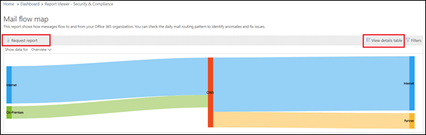

# Relatório de mapa de fluxo de email

> [!NOTE]
> Os recursos descritos neste tópico não foram implantados em todas as organizações do Office 365 e estão sujeitos a alterações.

Este relatório fornece ideias sobre como os emails fluem pela sua organização do Office 365. Você pode usar essas informações para aprender padrões, identificar anomalias e corrigir problemas conforme eles surgem.

## Widget mapa de fluxo de email

Por padrão, o mapa de fluxo de emails mostra o padrão de fluxo de emails de alto nível do dia anterior. Você pode usar as setas à esquerda e à direita para dias diferentes. Focalizar o cursor do mouse sobre cada área no relatório mostrará o volume de emails de e para sua organização do Office 365, conforme mostrado no diagrama a seguir:

## Visão Geral

Clicar no widget **mapa de fluxo** de emails o levará para o relatório de **mapa de fluxo** de emails. Aqui você pode ver o nível mais granular do relatório, você pode clicar em Exibir tabela de detalhes para ver os dados detalhados. Você também pode baixar o relatório detalhado clicando em solicitação de relatório.

## Detalhes

Por padrão, **Mostrar dados por** está definido como o valor **visão geral**. Ao clicar no menu suspenso e selecionar **detalhes**, o modo de exibição alterna para o nível de domínio detalhes.

Os principais remetentes e domínios de destinatário são listados, e o restante será colocado em **outros** , conforme mostrado nos seguintes diagramas:

## Informações relacionadas

Os insights relacionados são mostrados abaixo do mapa de fluxo de emails, se estiverem disponíveis (por exemplo, o remetente do domínio ou as informações de loop de email).

## Confira também

Para obter mais informações sobre outros insights de fluxo de email no painel de fluxo de emails, consulte [Mail Flow insights no centro de conformidade de & de segurança](mail-flow-insights-v2.md).