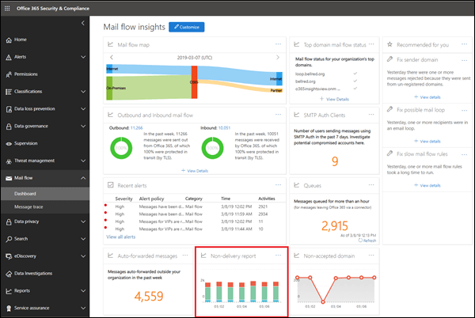

# Notificação de falha na entrega

A notificação de falha na **entrega** mostra os códigos de erro mais encontrados nas notificações de falha na entrega (também conhecidas como NDRs ou mensagens de devolução) para usuários em sua organização. Este relatório tem como objetivo mostrar os detalhes dos NDRs, para que você possa solucionar problemas.

Você pode exibir informações de todos os códigos de notificação de falha ou de um código específico clicando em **Mostrar dados para**. Você também pode clicar em **Exibir tabela de detalhes** para ver um modo de exibição mais detalhado, conforme mostrado no diagrama a seguir:

Ao selecionar uma linha na tabela para exibir os detalhes do NDR específico, você pode usar as informações detalhadas para solucionar problemas e tomar as medidas necessárias.

## Confira também

Para obter mais informações sobre outros insights de fluxo de email no painel de fluxo de emails, consulte [Mail Flow insights no centro de conformidade de & de segurança](mail-flow-insights-v2.md).
