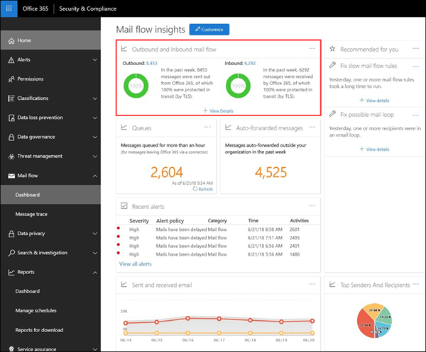
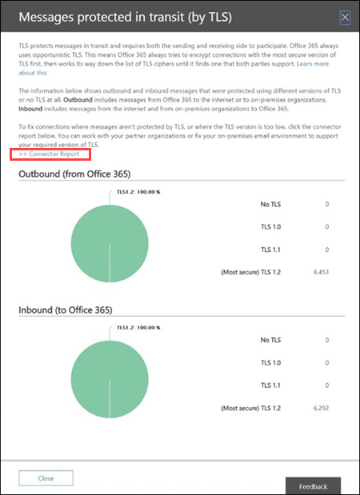

# Fluxo de entrada e saída de emailsOutbound and inbound mail flow

O widget **saída e fluxo** de emails de entrada combina as informações do **relatório de conector** e o **relatório de visão geral de TLS** anterior em um só lugar.The **Outbound and inbound mail flow** widget combines the information from the **Connector Report** and the former **TLS Overview Report** in one place.

As informações no widget estão relacionadas a conectores e proteção de mensagem TLS no Office 365.The information in the widget is related to connectors and TLS message protection in Office 365. Para obter mais informações, consulte estes tópicos:For more information, see these topics:

- [Configure mail flow using connectors in Office 365Configure mail flow using connectors in Office 365](https://technet.microsoft.com/library/ms.exch.eac.connectorselection.aspx)

- [Como o Exchange Online usa o TLS para proteger conexões de email no Office 365How Exchange Online uses TLS to secure email connections in Office 365](https://support.office.com/article/4CDE0CDA-3430-4DC0-B489-F2C0736C929F)

## Mensagem protegida em trânsito (por TLS)Message protected in transit (by TLS)

O widget **saída e fluxo** de emails de entrada exibe a criptografia TLS que é usada para a conexão quando as mensagens são entregues e de sua organização do Office 365.The **Outbound and inbound mail flow** widget displays the TLS encryption that's used for the connection when messages are delivered to and from your Office 365 organization. As conexões estabelecidas com outros serviços de email são criptografadas por TLS quando o TLS é oferecido por ambos os lados.The connections that are established with other email services are encrypted by TLS when TLS is offered by both sides. O widget oferece um instantâneo da última semana de fluxo de emails.The widget offers a snapshot of the last week of mail flow. Quando você clica em **Exibir detalhes**, o submenu **mensagem protegido por transporte (TLS)** mostra a proteção TLS para mensagens que entram e saem da sua organização.When you click **View Details**, the **Message protected in transit (by TLS)** flyout shows you the TLS protection for messages entering and leaving your organization.

Atualmente, o TLS 1,2 é a versão mais segura do TLS oferecido pelo Office 365.Currently, TLS 1.2 is the most secure version of TLS that's offered by Office 365. Muitas vezes, você precisará saber a criptografia TLS que está sendo usada para auditorias de conformidade.Often, you'll need to know the TLS encryption that's being used for compliance audits. Provavelmente você não tem uma relação direta com a maioria dos servidores de email de origem e de destino (você não é proprietário deles, e nenhuma da Microsoft), portanto, você não tem muitas opções para melhorar a criptografia TLS usada por esses servidores.You probably don't have a direct relationship with most of the source and destination email servers (you don't own them, and neither does Microsoft), so you don't have many options to improve the TLS encryption that's used by those servers.

No enTanto, você  pode usar conectores para garantir a melhor proteção TLS disponível para mensagens enviadas entre seus servidores de email e o Office 365.But, you can use [connectors](https://technet.microsoft.com/library/ms.exch.eac.connectorselection.aspx) to ensure the best available TLS protection for messages that are sent between your email servers and Office 365. O fluxo de email entre o Office 365 e seus próprios servidores de email ou servidores que pertencem a seus parceiros é freqüentemente mais importante e confidencial do que as mensagens normais, portanto, você deve aplicar segurança e vigilância extra a essas mensagens.Mail flow between Office 365 and your own email servers or servers that belong to your partners is often more important and sensitive than regular messages, so you'll want to apply extra security and vigilance to those messages. Você pode atualizar ou corrigir seus próprios servidores de email para melhorar a criptografia TLS que está sendo usada ou acessar seus parceiros para fazer o mesmo.You can upgrade or fix your own email servers to improve the TLS encryption that's being used, or reach out to your partners to do the same. O **relatório do conector** exibe o volume de fluxo de emails e a criptografia TLS para mensagens que usam os conectores do Office 365.The **Connector Report** displays both mail flow volume and TLS encryption for messages that use your Office 365 connectors.

## Relatório do conectorConnector report

Quando você clica no link de **relatório do conector** a partir do submenu **mensagem protegido em trânsito (por TLS)** , o relatório exibe informações sobre as mensagens que são entregues na sua organização do Office 365 usando conectores.When you click on the **Connector Report** link from the **Message protected in transit (by TLS)** flyout, the report displays information about messages that are delivered to and from your Office 365 organization using connectors. Você usa conectores entre seus próprios servidores de email e o Office 365 ou os servidores do seu parceiro e o Office 365.You use connectors between your own email servers and Office 365 or your partner's servers and Office 365. O volume da mensagem para cada conector e a criptografia TLS para a conexão está disponível.The message volume for each connector and the TLS encryption for the connection is available. Além disso, você também pode exibir dados de mensagens que foram enviadas ou recebidas no Office 365 sem usar um conector.In addition, you can also view data for messages that were sent or received in Office 365 without using a connector.

O modo de exibição de **fluxo** de emails mostra o volume de mensagens por meio do conector da última semana.The **Mail Flow** view shows the volume of messages through the connector for the past week. Você pode alterar o intervalo de datas selecionando **filtro** onde você pode aumentar o intervalo para no máximo 30 dias.You can change the date range by selecting **Filter** where you can increase the range to a maximum of 30 days. O modo de exibição **All Mail Flow** mostra todo o fluxo de emails de e para sua organização do Office 365 por meio de todos os conectores.The **All Mail Flow** view shows all mail flow to and from your Office 365 organization through all connectors. Você pode selecionar um conector específico por nome no menu suspenso.You can select a specific connector by name in the drop down menu.

Você pode selecionar o modo de exibição de **uso de TLS** no menu suspenso para ver a divisão da proteção TLS para mensagens por meio do conector.You can select the **TLS usage** view from the drop down to see the breakdown of TLS protection for messages through the connector. Assim como o relatório de **relatório de visão geral de TLS** , este modo de exibição mostra a porcentagem das diferentes versões de TLS.As with the **TLS Overview Report** report, this view shows the percentage of the different TLS versions. Para conexões TLS 1,0, você realmente precisa obter o servidor de email ou o servidor de seu parceiro atualizado ou corrigido para evitar qualquer problema quando o suporte a TLS 1,0 for eventualmente preterido no Office 365.For TLS 1.0 connections, you really need to get your email server or your partner's server upgraded or fixed to avoid any issues when TLS 1.0 support is eventually deprecated in Office 365. Para obter mais informações, consulte [Technical Reference Details about Encryption in Office 365](https://support.office.com/article/862cbe93-4268-4ef9-ba79-277545ecf221).For more information, see [Technical reference details about encryption in Office 365](https://support.office.com/article/862cbe93-4268-4ef9-ba79-277545ecf221).

O ideias aponta para conectores para ajudar a chamar a atenção para possíveis problemas de criptografia TLS para o conector.Insights point to connectors to help draw your attention to potential TLS encryption problems for the connector. Os insights são: **nenhum TLS é maior que 25%** ou **TLS 1,0 está acima de 50%**.The insights are: **No TLS is over 25%** or **TLS 1.0 is above 50%**. Se você vir esses insights, será necessário investigar seus servidores de email associados ao conector ou acessar sua organização de parceiro.If you see these insights, you need to investigate your email servers that are associated with the connector, or reach out to your partner organization.

## Confira tambémSee also

Para obter mais informações sobre outros insights de fluxo de email no painel de fluxo de emails, consulte [Mail Flow insights no centro de conformidade de & de segurança](mail-flow-insights.md).For more information about other mail flow insights in the mail flow dashboard, see [Mail flow insights in the Security & Compliance Center](mail-flow-insights.md).
