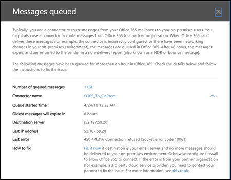

# Alertas de filas e filasQueue alerts and Queues

## Alertas de filaQueue alerts

Quando as mensagens não podem ser enviadas da sua organização do Office 365 para seus servidores de email locais ou parceiros usando conectores, as mensagens são enfileiradas no Office 365.When messages can't be sent from your Office 365 organization to your on-premises or partner email servers using connectors, the messages are queued in Office 365. Exemplos comuns que causam essa condição são:Common examples that cause this condition are:

- O conector está configurado incorretamente.The connector is incorrectly configured.

- Houve alterações de rede ou firewall no seu ambiente local.There have been networking or firewall changes in your on-premises environment.

O Office 365 continuará a tentar a entrega por 48 horas.Office 365 will continue to retry to delivery for 48 hours. Após 48 horas, as mensagens expirarão e serão retornadas para os remetentes nas notificações de falha na entrega (também conhecidas como NDRs ou mensagens de devolução).After 48 hours, the messages will expire and will be returned to the senders in non-delivery reports (also known as a NDRs or bounce messages).

Se o volume de email em fila exceder o limite predefinido (o valor padrão é 2000), os alertas estarão disponíveis no painel de fluxo de emails em **alertas recentes**, e os administradores receberão uma notificação por email (para o endereço de email alternativo) .If the queued email volume exceeds the pre-defined threshold (the default value is 2000 messages), the alerts will be available in the mail flow dashboard at **Recent alerts**, and admins will receive an email notification (to their alternative email address). Para configurar o limite de alerta, o limite de notificação diária e/ou os destinatários do alerta, consulte a seção **Personalizar alertas de fila** abaixo.To configure the alert threshold, daily notification limit, and/or recipients of the alert, see the **Customize queue alerts** section below.

## Personalizar alertas de filaCustomize queue alerts

Informações de fluxo de emails criar uma política de alerta chamada **mensagens atrasadas** (a caixa de seleção **enviar notificações por email** na captura de tela de exemplo abaixo) foi encontrada em **alertas** \> **políticas de alerta**.Mail flow insights create an alert policy named **Messages have been delayed** (the **Send email notifications** check box in the example screen shot below) found in **Alerts** \> **Alert Policies**. Você pode modificar os destinatários de limite e alerta clicando na política.You can modify the threshold and alert recipients by clicking on the policy.

Você verá uma nova folha de informações de política, agora é possível clicar em **Editar política**.You'll see a new policy information blade, you can now click **Edit Policy**.

A lâmina de informações será alterada para a **política de edição**.The information blade will change to the **Edit Policy**. Agora você pode alterar os destinatários para o email de alerta, o limite do número de notificações enviadas por dia e o limite mínimo para acionar o alerta (200 ou mais).You can now change the recipients for the alert email, the limit on the number of notifications sent per day, and the minimum threshold to trigger the alert (200 or more).

## Detalhes de alerta da filaQueue alert details

Quando você clica no alerta, os detalhes de alerta aparecem em um painel de submenu.When you click the alert, the alert details appear in a flyout pane.

Você pode clicar em **Exibir fila** nos detalhes do alerta para ver os detalhes da fila, os problemas e os links para as correções disponíveis em um novo painel de submenu.You can click **View queue** in the alert details to see the queue details, problems, and links to the available fixes in a new flyout pane.

## FilasQueues

Mesmo que o volume da mensagem na fila não tenha excedido o limite, você ainda pode usar a área **filas** do painel de fluxo de email para ver as mensagens que foram enfileiradas por mais de uma hora.Even if the queued message volume hasn't exceeded the threshold, you can still use the **Queues** area of the mail flow dashboard to see messages that have been queued for more than one hour. Você pode usar a área **filas** para monitorar o número de mensagens em fila (o valor 0 indica que o fluxo de emails está ok) e tomar medidas antes que o número de mensagens na fila fique muito grande.You can use the **Queues** area to monitor the number of queued messages (the value 0 indicates mail flow is OK) and take action before the number of queued messages becomes too large.

Quando você clica no número de mensagens em filas, \*\*\*\* os detalhes e a orientação da fila para corrigir o problema aparecerão em um painel de submenu (o mesmo submenu exibido depois que você clicar em **Exibir fila** nos detalhes de um alerta de fila).When you click the number of queued messages in **Queues**, the queue details and guidance for how to fix the issue will appear in a flyout pane (the same flyout that appears after you click **View queue** in the details of a queue alert).

## Confira tambémSee also

Para obter mais informações sobre outros insights de fluxo de email no painel de fluxo de emails, consulte [Mail Flow insights no centro de conformidade de & de segurança](mail-flow-insights.md).For more information about other mail flow insights in the mail flow dashboard, see [Mail flow insights in the Security & Compliance Center](mail-flow-insights.md).
