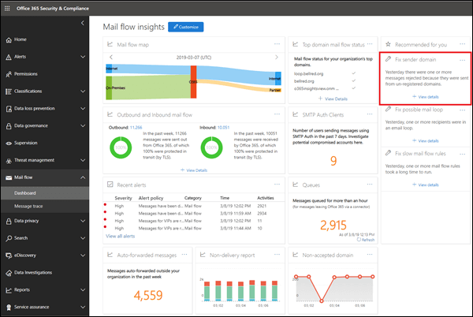
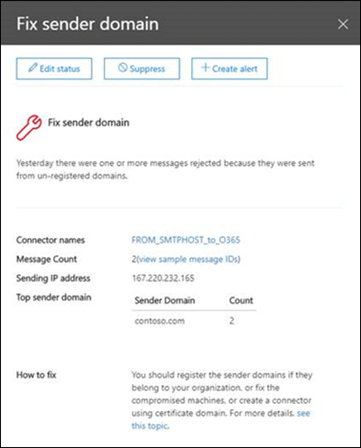

# Corrigir a percepção do domínio do remetente

O Office 365 requer mensagens de envio de ambientes de email locais internos para o Office 365 para atender a determinados critérios de segurança:

- Você criou um conector de entrada no Office 365 para autenticar conexões SMTP do seu servidor de email local usando o endereço IP de origem ou um certificado.

- Você configurou seu servidor de email local para retransmitir emails por meio do Office 365 para o mundo externo.

- Na configuração, uma das seguintes instruções é verdadeira:

  - O domínio de email do remetente está registrado na sua organização do Office 365. Para obter mais informações, consulte adicionar domínios no Office 365.

  - Seu servidor de email local está configurado para usar um certificado para enviar emails para o Office 365, o certificado contém ou corresponde exatamente a um nome de domínio que você registrou no Office 365 e criou um conector baseado em certificado no Office 365 com esse Domain. 

As mensagens que não atenderem aos critérios não serão atribuídas à organização e poderão ser rejeitadas.

A **solução de correção de domínio do remetente** mostra emails do seu ambiente local que não atendem aos critérios, ajuda a identificar máquinas potencialmente comprometidas e contas de usuário em seu ambiente de email local e ajuda você a realizar ações de correção.

Ao clicar em **Exibir detalhes**, você será levado para outro widget com mais detalhes, conforme mostrado no diagrama a seguir:

Você verá o conector de entrada usado para entregar as mensagens ao Office 365. Você também pode clicar em **Exibir IDs de mensagem de amostra** para ver os detalhes das mensagens que foram enviadas de seu ambiente de email local. Como essas mensagens foram rejeitadas pelo Office 365, não é possível usar o rastreamento de mensagens, mas você pode usar as IDs de mensagem de exemplo para rastrear as mensagens no seu ambiente de email local.

## Confira também

Para obter mais informações sobre outros insights de fluxo de email no painel de fluxo de emails, consulte [Mail Flow insights no centro de conformidade de & de segurança](mail-flow-insights-v2.md).
