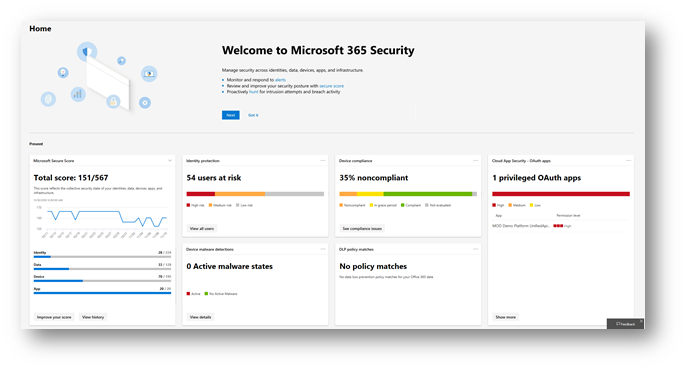

# A nova central de segurança do Microsoft 365 e o centro de conformidade da Microsoft 365 agora estão disponíveis em geral

**Temos o prazer de anunciar que a nova central de [segurança do Microsoft 365](#microsoft-365-security-center) e o [centro de conformidade da Microsoft 365](#microsoft-365-compliance-center)**, agora estão disponíveis em geral. Leia este artigo para obter uma visão geral das novidades, [o que esperar](#what-to-expect)e [as licenças e permissões necessárias](#required-licenses-and-permissions).

## Centro de segurança do Microsoft 365

Sua nova [central de segurança do Microsoft 365](overview-security-center.md) inclui um painel para ajudá-lo a gerenciar e monitorar a segurança em suas identidades, dados, dispositivos, aplicativos e infraestrutura. Você também terá acesso fácil à sua nova [Pontuação segura da Microsoft](microsoft-secure-score.md), a novos relatórios de ameaças de dispositivos, novos relatórios de ameaças de identidade e seus relatórios de segurança de aplicativos na nuvem. 

Ao usar a central de segurança do Microsoft 365 pela primeira vez, você verá as informações na parte superior da tela para ajudá-lo a começar. Você também verá como navegar facilmente para os recursos de segurança mais interessados em explorar. Para saber mais, confira [visão geral da central de segurança do Microsoft 365](overview-security-center.md).

Você poderá acessar a central de segurança do Microsoft 365 em [https://security.microsoft.com](https://security.microsoft.com). 

> [!NOTE]
> Você deve receber uma função válida do Azure Active Directory para acessar o centro de segurança do Microsoft 365. Para saber mais, confira a seção [licenças e permissões necessárias](#required-licenses-and-permissions) (neste artigo).

## Centro de conformidade do Microsoft 365

Seu novo [centro de conformidade da microsoft 365](microsoft-365-compliance-center.md) fornece visibilidade do Microsoft Compliance Manager, que reflete sua postura geral de conformidade e fornece ações recomendadas para ajudá-lo a definir as configurações para atender à conformidade complexa obrigação. 

Você terá acesso fácil a rótulos e políticas de confidencialidade e retenção, prevenção de perda de dados (DLP), governança de dados, descoberta eletrônica, solicitações de entidades de dados (DSRs), gerenciamento de casos e segurança de aplicativos em nuvem. Além disso, você pode obter informações acionáveis e aproveitar a automação inteligente para reduzir seus riscos de conformidade e proteger seu imóvel digital. 

Ao usar o centro de conformidade da Microsoft 365 pela primeira vez, você verá as informações na parte superior da tela para ajudá-lo a começar. Você verá como navegar facilmente para os recursos de conformidade que está mais interessado em explorar. Para saber mais, confira [Bem-vindo ao novo centro de conformidade do Microsoft 365](microsoft-365-compliance-center.md).

Você será acessar o centro de conformidade da Microsoft 365 em [https://compliance.microsoft.com](https://compliance.microsoft.com).  

> [!NOTE]
> Você deve ser atribuído a uma função válida do Azure Active Directory para acessar o centro de conformidade da Microsoft 365. Para saber mais, confira a seção [licenças e permissões necessárias](#required-licenses-and-permissions) (neste artigo).

## O que esperar

### Disponível agora!

A nova central de segurança do Microsoft 365 e o novo centro de conformidade do Microsoft 365 agora estão disponíveis para os clientes da Microsoft 365, desde o final de março de 2019. 

Se você tiver outra assinatura, como um plano autônomo que inclui o centro de conformidade do & de segurança do Office 365, terá acesso à nova central de segurança do Microsoft 365 e ao centro de conformidade da Microsoft 365 em breve. Para saber mais, confira o [Microsoft 365 Roadmap](https://www.microsoft.com/microsoft-365/roadmap).

### Fácil acesso!

Com a navegação aprimorada, soluções integradas e uma experiência simplificada, você poderá ver e acessar as informações das quais está mais interessado e aproveitar as vantagens das soluções de segurança e conformidade avançadas no Microsoft 365. E, enquanto mais funcionalidades e soluções estão sendo adicionadas nos próximos meses, o centro de conformidade do & de segurança[https://protection.microsoft.com](https://protection.microsoft.com)do Office 365 () ainda está disponível.

### Transição suave!

Você pode esperar uma transição suave para os novos centros. Eventualmente, o antigo centro de conformidade do Microsoft 365 Security[https://protection.microsoft.com](https://protection.microsoft.com)& () será desativado. Embora a experiência do administrador mude, isso não afetará suas configurações atuais de segurança e conformidade. Se sua organização tem o Microsoft 365 Enterprise E3 ou e5, seus administradores de segurança e conformidade podem:

- Navegue diretamente para [https://security.microsoft.com](https://security.microsoft.com) e [https://compliance.microsoft.com](https://compliance.microsoft.com);  or  
- Vá para o centro de administração do Microsoft[https://admin.microsoft.com](https://admin.microsoft.com)365 () e navegue de lá (no painel de navegação, clique em **Mostrar tudo**e, em seguida, escolha **segurança** ou **conformidade**).

Além disso, você ainda pode configurar e gerenciar as configurações no centro de conformidade do Office 365 Security &[https://protection.office.com](http://protection.office.com)(). Suas configurações serão mantidas no centro de conformidade do & de segurança do Office 365 existente e na nova central de segurança do Microsoft 365 e no centro de conformidade da Microsoft 365.  

## Licenças e permissões necessárias

### Licenças

Para obter a nova central de segurança do Microsoft 365 e o centro de conformidade da Microsoft 365, sua organização deve ter uma assinatura do Microsoft 365 E3 ou e5, ou um equivalente de licenciamento por volume (que consiste no Office 365 Enterprise E3 ou e5, Enterprise Mobility + Security E3 ou E5 e Windows 10 Enterprise E3/e5. Para saber mais sobre esses planos, confira [Discover The Microsoft 365 Enterprise Solution mais adequada para você](https://www.microsoft.com/microsoft-365/compare-all-microsoft-365-plans).

### Funções e permissões

Os usuários devem ser atribuídos à função de administrador global, administrador de conformidade, administrador de dados de conformidade, administrador de segurança, operador de segurança ou leitor de segurança no Azure Active Directory para acessar o novo centro de segurança do Microsoft 365 ou Centro de conformidade da Microsoft 365.

- Os administradores globais podem acessar a central de segurança e o centro de conformidade

- Administradores de conformidade e dados de conformidade podem acessar o centro de conformidade

- Administradores de segurança, operadores de segurança e leitores de segurança podem acessar a central de segurança

 Para saber mais sobre essas funções, confira [permissões no centro de conformidade do & de segurança do Office 365](permissions-in-the-security-and-compliance-center.md).
 
A tabela a seguir resume quem pode acessar vários portais no Azure, no Office 365 e no Windows:

|Portal |Administrador global |Administrador de segurança, operador de segurança ou leitor de segurança|Administrador de conformidade ou administrador de dados de conformidade |
|---------|---------|---------|---------|
|[Centro de conformidade do & de segurança](https://protection.office.com) |Sim |Sim  |Sim |
|[Centro de segurança do Microsoft 365](https://security.microsoft.com) |Sim  | Sim  | Não        |
|[Centro de conformidade do Microsoft 365](https://compliance.microsoft.com) | Sim | Não | Sim |
|[Gerente de Conformidade](https://aka.ms/compliancemanager) |Sim | Sim |Sim  |
|[Proteção de Informações do Azure](https://docs.microsoft.com/azure/information-protection) |Sim |Sim |Não |
|[Central de Segurança do Azure](https://docs.microsoft.com/azure/security-center/)  |Sim |Sim |Não |
|[Proteção Avançada contra Ameaças do Azure](https://docs.microsoft.com/azure-advanced-threat-protection/what-is-atp)  |Sim |Sim |Não |
|[Windows Defender ATP](https://docs.microsoft.com/windows/security/threat-protection/windows-defender-atp/windows-defender-advanced-threat-protection?ocid=tia-260153000#windows-defender-atp) |Sim |Sim |Não |
|[Proteção de identidade](https://docs.microsoft.com/azure/active-directory/identity-protection)     |Sim |Sim |Não |
|[Gerenciamento de identidade privilegiado](https://docs.microsoft.com/azure/active-directory/privileged-identity-management)     |Sim |Sim |Não |
|[Intune](https://docs.microsoft.com/intune)     |Sim |Sim |Sim |
|[Segurança no Aplicativo na Nuvem](https://docs.microsoft.com/cloud-app-security/)     |Sim |Sim |Sim |
|[Classificação de Segurança](https://docs.microsoft.com/office365/securitycompliance/office-365-secure-score)     |Sim |Sim |Não |
|[Exchange](https://docs.microsoft.com/exchange/)     |Sim |Sim |Sim |

## Recursos adicionais

[Centro de segurança do Microsoft 365](overview-security-center.md)

[Centro de conformidade do Microsoft 365](microsoft-365-compliance-center.md)

[Roteiro do Microsoft 365](https://www.microsoft.com/microsoft-365/roadmap)

[Descrição do serviço centro de conformidade do & de segurança do Office 365](https://docs.microsoft.com/office365/servicedescriptions/office-365-platform-service-description/office-365-securitycompliance-center)

Para fornecer comentários sobre a central de segurança da Microsoft 365 e o centro de conformidade da Microsoft 365, como ideias para novos recursos, visite [o feedback dos clientes do Microsoft Office 365](https://office365.uservoice.com)
