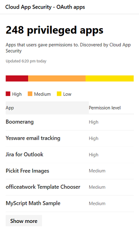
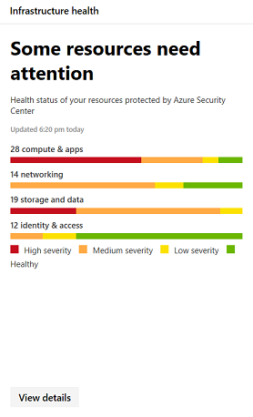

# Monitorar e relatar o status do aplicativo no Microsoft 365 Security

[!include[Prerelease�information](prerelease.md)]

Esses relatórios fornecem mais informações sobre como os aplicativos de nuvem estão sendo usados na sua organização, incluindo os tipos de aplicativos, seu nível de risco e alertas.

## Monitorar contas de email em risco

A **proteção de email** mostra as contas de email em risco. Você pode clicar em uma conta para investigar mais a central de segurança do Windows Defender.

## Monitorar permissões de aplicativo concedidas por usuários

**Cloud app Security-aplicativos OAuth** lista aplicativos descobertos pela Cloud app Security que receberam permissões pelos usuários. O catálogo de riscos do Cloud app Security inclui mais de 16.000 aplicativos que são avaliados usando mais de 70 fatores de risco.

Os fatores de risco são iniciados a partir de informações gerais, como o editor de aplicativos, medidas de segurança e controles, como se o aplicativo dá suporte para criptografia em repouso ou fornece um log de auditoria da atividade do usuário.

## Monitorar contas de usuário do aplicativo na nuvem

**Contas de aplicativo em nuvem para análise** lista contas que podem exigir atenção.

## Entender quais aplicativos de nuvem são usados

Os **aplicativos de nuvem descobertos (categorias)** mostram quais tipos de aplicativos estão sendo usados na sua organização e links para o painel de descoberta de nuvem no Cloud app Security. Para obter mais informações, consulte [QuickStart: work with untected apps](https://docs.microsoft.com/cloud-app-security/discovered-apps).  

## Monitorar onde os usuários acessam os aplicativos de nuvem

**Locais de atividade do aplicativo na nuvem** mostram onde os usuários estão acessando aplicativos em nuvem.

## Monitorar a integridade das cargas de trabalho da infraestrutura

**Infrastructure Health** mostra alertas de status de integridade para cargas de trabalho de infraestrutura na central de segurança do Azure.

A central de segurança do Azure oferece gerenciamento de segurança unificado e proteção avançada contra ameaças em cargas de trabalho locais e em nuvem. Você pode coletar, Pesquisar e analisar dados de segurança de várias fontes, incluindo firewalls e outras soluções de parceiros.

Para obter mais informações, consulte a [documentação da central de segurança do Azure](https://docs.microsoft.com/azure/security-center/).

