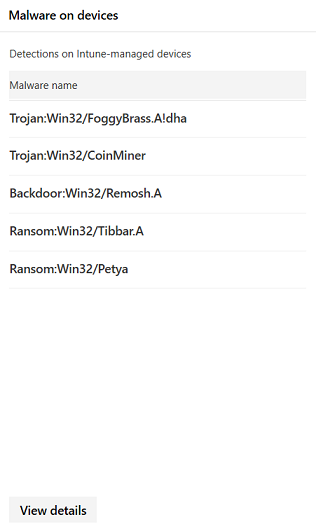
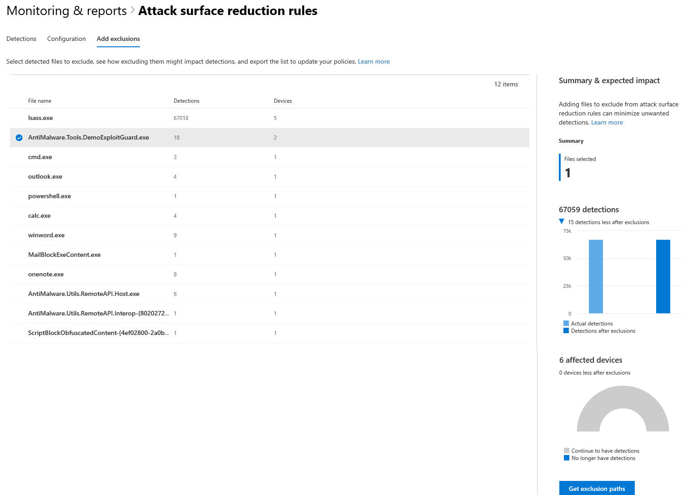

# Monitorar dispositivos no Microsoft 365 SecurityMonitor devices in Microsoft 365 security

Mantenha seus dispositivos seguros, atualizados e identifique as possíveis ameaças no centro de segurança do Microsoft 365.Keep your devices secure, up-to-date, and spot potential threats in the Microsoft 365 security center.

## Exibir alertas de dispositivoView device alerts

Obtenha alertas atualizados sobre a atividade de violação e outras ameaças em seus dispositivos do Windows Defender ATP (disponível com uma licença E5).Get up-to-date alerts about breach activity and other threats on your devices from Windows Defender ATP (available with an E5 license). A central de segurança do Microsoft 365 tem vários cartões que permitem monitorar efetivamente esses alertas em um nível superior, dependendo do seu fluxo de trabalho preferido.Microsoft 365 security center has several cards that allow you to effectively monitor these alerts at a high-level, depending on your preferred workflow.

### Monitorar alertas de alto impactoMonitor high-impact alerts

Cada alerta ATP do Windows Defender tem uma severidade correspondente, alta, média, baixa ou informativa — que indica seu impacto em potencial para a sua rede se não for deixado autônomo.Each Windows Defender ATP alert has a corresponding severity—high, medium, low, or informational—that indicates its potential impact to your network if left unattended.  

Use o cartão de **severidade de alerta de dispositivo** para se concentrar especificamente nos alertas que são mais graves e podem exigir resposta imediata.Use the **Device alert severity** card to focus specifically on alerts that are more severe and might require immediate response. Neste cartão, você pode exibir mais informações sobre o portal da central de segurança do Windows Defender.From this card, you can view more information on the Windows Defender Security Center portal.

### Entender fontes de alertasUnderstand sources of alerts

O Windows Defender ATP aproveita dados de uma ampla variedade de sensores de segurança e fontes de inteligência para gerar alertas.Windows Defender ATP leverages data from a broad range of security sensors and intelligence sources to generate alerts. Por exemplo, ele pode usar informações de detecção do Windows Defender Antivirus e antimalware de terceiros, bem como sua própria inteligência de ameaças personalizada fornecida por meio da API do serviço Web.For example, it can use detection information from Windows Defender Antivirus and third-party antimalware, as well as your own custom threat intelligence provided through the web service API.

O cartão de fontes de **detecção de alerta de dispositivo** mostra a distribuição de alertas por fonte.The **Device alert detection** sources card shows the distribution of alerts by source. Este cartão pode ajudá-lo a controlar atividades relacionadas a determinadas fontes, particularmente suas fontes personalizadas.This card can help you track activity related to certain sources, particularly your custom sources. Você também pode usá-lo para se concentrar nos alertas provenientes de sensores que não estão configurados para bloquear automaticamente atividades ou componentes mal-intencionados.You can also use this to focus on alerts coming from sensors that are not configured to automatically block malicious activity or components.

Neste cartão, você pode exibir mais informações sobre o portal da central de segurança do Windows Defender.From this card, you can view more information on the Windows Defender Security Center portal.

### Compreender os tipos de ameaças que acionam alertasUnderstand the types of threats that trigger alerts

O Windows Defender ATP classifica cada alerta em uma categoria que representa um determinado estágio na cadeia de ataque ou um tipo de componente de ameaça.Windows Defender ATP sorts each alert into a category representing a certain stage in the attack chain or a type of threat component. Por exemplo, as atividades de ameaça detectadas podem ser categorizadas em "movimento lateral" para indicar que a atividade envolvia uma tentativa de alcançar outros dispositivos na rede e que provavelmente ocorreu após os invasores terem um incorrido inicial.For example, detected threat activity might be categorized into “lateral movement” to indicate that the activity involved an attempt to reach other devices on the network and has likely occurred after attackers have gained an initial foothold. Quando detectado, um componente de ameaça pode ser classificado amplamente como "malware" ou mais especificamente como "ransomware", "roubo de credenciais" ou outros tipos de softwares mal-intencionados ou indesejados.When detected, a threat component might either be classified broadly as “malware” or more specifically as “ransomware”, “credential stealing” or other types of malicious or unwanted software.

O cartão de **categorias de ameaça de dispositivo** mostra a distribuição de alertas nessas categorias.The **Device threat categories** card shows the distribution of alerts into these categories. Você pode usar essas informações para identificar a atividade de ameaças, como tentativas de roubo de credenciais, que podem ter um impacto mais significativo em comparação às tentativas da engenharia social, por exemplo.You can use this information to identify threat activity, such as attempts at credential theft, which can have more significant impact compared to attempts at social engineering, for example. Você também pode usar isso para monitorar ameaças potencialmente destrutivas, como ransomware.You can also use this to monitor for potentially destructive threats like ransomware.

### Monitorar alertas ativosMonitor active alerts

O cartão de **status de alerta de dispositivo** indica o número de alertas que não foram resolvidos e podem exigir atenção.The **Device alert status** card indicates the number of alerts that have not been resolved and might require attention. Neste cartão, você pode exibir mais informações sobre o portal da central de segurança do Windows Defender.From this card, you can view more information on the Windows Defender Security Center portal.

### Monitorar a classificação de alertas resolvidosMonitor classification of resolved alerts

Ao resolver um alerta ATP do Window defender, sua equipe de segurança pode especificar se um alerta foi verificado como:When resolving a Window Defender ATP alert, your security staff can specify whether an alert has been verified as:

* Um alerta verdadeiro que identifica atividade de violação real ou componentes de ameaçaA true alert that identifies actual breach activity or threat components
* Um alerta falso que foi detectado incorretamente uma atividade normalA false alert that has incorrectly detected normal activity

O cartão de **classificação de alerta de dispositivo** mostra se seus alertas resolvidos foram classificados como verdadeiros ou falsos alertas.The **Device alert classification** card shows whether your resolved alerts have been classified as true or false alerts. Neste cartão, você pode exibir mais informações sobre o portal da central de segurança do Windows Defender.From this card, you can view more information on the Windows Defender Security Center portal.

Observação: em alguns casos, as informações de classificação não estão disponíveis para determinados alertas.Note: In some cases, classification information is unavailable for certain alerts.

### Monitorar a determinação dos alertas resolvidosMonitor determination of resolved alerts

Além de classificar se um alerta é verdadeiro ou falso durante a resolução, sua equipe de segurança pode fornecer uma determinação, indicando o tipo de atividade normal ou mal-intencionada encontrada durante a validação do alerta.In addition to classifying whether an alert is true or false during resolution, your security staff can provide a determination, indicating the type of normal or malicious activity that was found while validating the alert.

O cartão de **determinação de alerta de dispositivo** mostra a determinação oferecida para cada alerta, especificamente:The **Device alert determination** card shows the determination provided for each alert, specifically:

* **Apt** – ameaça persistente avançada, indicando que a atividade detectada ou o componente de ameaça faz parte de uma violação sofisticada projetada para obter uma brecha na rede afetada**APT** – advanced persistent threat, indicating that the detected activity or threat component is part of a sophisticated breach designed to gain a foothold in the affected network  
* **Malware** – arquivo mal-intencionado ou código**Malware** – malicious file or code
* **Equipe de segurança** – atividade normal realizada pela equipe de segurança**Security personnel** – normal activity performed by security staff
* **Teste de segurança** – atividade ou componentes projetados para simular ameaças reais e que devem disparar sensores de segurança e gerar alertas**Security testing** – activity or components designed to simulate actual threats and expected to trigger security sensors and generate alerts
* **Software** indesejado – aplicativos e outros softwares que não são considerados mal-intencionados, mas que, de outra forma, violam os padrões de política ou de uso aceitáveis**Unwanted software** – apps and other software that are not considered malicious, but otherwise violate policy or acceptable use standards
* **Outros** – qualquer outra determinação que não se enquadr nos tipos fornecidos**Others** – any other determination that does not fall under the provided types

Neste cartão, você pode exibir mais informações na central de segurança do Windows Defender.From this card, you can view more information in Windows Defender security center.

### Entender quais dispositivos estão em riscoUnderstand which devices are at risk

**Proteção de dispositivo** mostra o nível de risco para dispositivos.**Device protection** shows the risk level for devices. O nível de risco é baseado em fatores como o tipo e a gravidade de alertas no dispositivo.The risk level is based on factors such as the type and severity of alerts on the device.

## Monitorar e relatar o status dos dispositivos gerenciados pelo IntuneMonitor and report status of Intune-managed devices

Os seguintes monitoramento e relatórios contêm dados de dispositivos registrados no Intune.The following monitoring and reports contain data from devices enrolled in Intune. Dados de dispositivos não registrados não estão incluídos.Data from unenrolled devices is not included. Somente os administradores globais podem exibir esses cartões.Only Global Administrators can view these cards.

Os dados do dispositivo registrados do Intune incluem:Intune enrolled device data includes:

* Conformidade do dispositivoDevice compliance
* Dispositivos com malware ativoDevices with active malware
* Tipos de malware em dispositivosTypes of malware on devices
* Malware em dispositivosMalware on devices
* Dispositivos com detecções de malwareDevices with malware detections
* Usuários com detecções de malwareUsers with malware detections

### Monitorar a conformidade do dispositivoMonitor device compliance

A **conformidade do dispositivo** mostra quantos dispositivos estão registrados no Intune em conformidade com as políticas de configuração.**Device compliance** shows how many devices that are enrolled in Intune comply with configuration policies.

### Descobrir dispositivos com detecções de malwareDiscover devices with malware detections

As **detecções de malware de dispositivo** fornecem o número de dispositivos registrados do Intune com malware que não foram totalmente resolvidos devido a ações pendentes, uma reinicialização, uma ação de usuário manual ou de verificação completa, ou se a ação de correção não for concluída com êxito.**Device malware detections** provides the number of Intune enrolled devices with malware that have not been fully resolved due to pending actions—a restart, a full scan or manual user actions—or if the remediation action did not complete successfully.

### Compreender os tipos de malware detectadosUnderstand the types of malware detected

**Tipos de malware em dispositivos** mostra diferentes tipos de malware detectados em dispositivos registrados no Intune.**Types of malware on devices** shows different kinds of malware that have been detected on devices enrolled in Intune. Você pode investigar cada tipo no centro de segurança do Microsoft 365.You can investigate each type in Microsoft 365 security center.

### Entender o malware específico detectado em seus dispositivosUnderstand the specific malware detected on your devices

**Malware em dispositivos** fornece uma lista de malware específico detectado em seus dispositivos.**Malware on devices** provides a list of the specific malware detected on your devices.

### Entender quais dispositivos têm mais malwareUnderstand which devices have the most malware

**Dispositivos com detecções de malware** mostram quais dispositivos têm a maior quantidade de detecções de malware.**Devices with malware detections** shows which devices have the most malware detections. No centro de segurança do Microsoft 365, você pode investigar se o malware está ativo, quem usa o dispositivo e seu status de gerenciamento no Intune.In Microsoft 365 security center, you can investigate whether malware is active, who uses the device, and its management status in Intune.

### Entender quais usuários têm dispositivos com mais malwareUnderstand which users have devices with the most malware

**Os usuários com detecções de malware** mostram aos usuários dispositivos com mais detecções de malware.**Users with malware detections** shows users with devices that had the most malware detections. No centro de segurança do Microsoft 365, você pode ver quantos dispositivos são atribuídos a cada usuário e mais informações sobre cada dispositivo e o tipo de malware.In Microsoft 365 security center, you can see how many devices are assigned to each user and more information about each device and the type of malware.

## Monitorar e gerenciar a implantação e as detecções de regras ASRMonitor and manage ASR rule deployment and detections

[As regras de redução da superfície de ataque (ASR)](https://docs.microsoft.com/en-us/windows/security/threat-protection/windows-defender-exploit-guard/attack-surface-reduction-exploit-guard) ajudam a evitar ações e aplicativos normalmente usados por malware de busca de exploração para infectar máquinas.[Attack Surface Reduction (ASR) rules](https://docs.microsoft.com/en-us/windows/security/threat-protection/windows-defender-exploit-guard/attack-surface-reduction-exploit-guard) help prevent actions and apps that are typically used by exploit-seeking malware to infect machines. Essas regras controlam quando e como os executáveis podem ser executados.These rules control when and how executables can run. Por exemplo, você pode impedir que JavaScript ou VBScript inicie um executável baixado, bloqueie as chamadas da API Win32 de macros do Office ou bloqueie processos executados a partir de unidades USB.For example, you can prevent JavaScript or VBScript from launching a downloaded executable, block Win32 API calls from Office macros, or block processes that run from USB drives.

O cartão de **regras de redução da superfície de ataque** fornece uma visão geral da implantação de regras nos seus dispositivos.The **Attack surface reduction rules** card provides an overview of the deployment of rules across your devices.

A barra superior do cartão mostra o número total de dispositivos que estão nos seguintes modos de implantação:The top bar on the card shows the total number of devices that are in the following deployment modes:

* **Modo de bloqueio** – dispositivos com pelo menos uma regra configurada para bloquear a atividade detectada**Block mode** – devices with at least one rule configured to block detected activity
* **Modo de auditoria** – dispositivos sem regras definidas para bloquear a atividade detectada, mas tem pelo menos um conjunto de regras para auditar a atividade detectada**Audit mode** – devices with no rules set to block detected activity, but has at least one rule set to audit detected activity  
* **Desligado** – dispositivos com todas as regras ASR desativadas**Off** – devices with all ASR rules turned off

A parte inferior deste cartão mostra as configurações por regra em seus dispositivos.The lower part of this card shows settings by rule across your devices. Cada barra indica o número de dispositivos que estão configurados para bloquear ou auditar a detecção ou a regra completamente desativada.Each bar indicates the number of devices that are set to block or audit detection or have the rule completely turned off.

### Exibir detecções ASRView ASR detections

Para exibir informações detalhadas sobre detecções de regra ASR em sua rede, selecione **Exibir detecções** no cartão de **regras de redução de superfície de ataque** .To view detailed information about ASR rule detections in your network, select **View detections** on the **Attack surface reduction rules** card. A guia **detecções** da página relatório detalhado será aberta.The **Detections** tab in the detailed report page will open.

O gráfico na parte superior da página mostra as detecções com as detecções de empilhamento de tempo que foram bloqueadas ou auditadas.The chart at the top of the page shows detections over time stacking detections that were either blocked or audited. A tabela na parte inferior lista as detecções mais recentes.The table at the bottom lists the most recent detections. Use as seguintes informações na tabela para entender a natureza das detecções:Use the following information on the table to understand the nature of the detections:

* **Arquivo detectado** – o arquivo, geralmente um script ou um documento, cujo conteúdo disparou a atividade de ataque suspeito**Detected file** – the file, typically a script or a document, whose contents triggered the suspected attack activity
* **Regra** – nome que descreve as atividades de ataque que a regra foi projetada para capturar.**Rule** – name describing the attack activities the rule is designed to catch. Leia sobre regras de ASR existentesRead about existing ASR rules
* **Aplicativo de origem** – o aplicativo que carregou ou executou o conteúdo que está disparando a atividade de ataque suspeita.**Source app** – the application that loaded or executed content triggering the suspected attack activity. Pode ser um aplicativo legítimo, como navegador da Web, um aplicativo do Office ou uma ferramenta do sistema, como o PowerShellThis could be a legitimate application, such as web browser, an Office application, or a system tool like PowerShell
* **Publisher** – o fornecedor que liberou o aplicativo de origem**Publisher** – the vendor that released the source app

### Examinar as configurações de regra ASR do dispositivoReview device ASR rule settings

Na página relatório de **regras de redução da superfície de ataque** , vá para a guia **configuração** para analisar as configurações de regra para dispositivos individuais.In the **Attack surface reduction rules** report page, go to the **Configuration** tab to review rule settings for individual devices. Selecione um dispositivo para obter informações detalhadas sobre se cada regra está no modo de bloqueio, modo de auditoria ou desativada inteiramente.Select a device to get detailed information about whether each rule is in block mode, audit mode, or turned off entirely.

O Microsoft Intune fornece funcionalidade de gerenciamento para suas regras ASR.Microsoft Intune provides management functionality for your ASR rules. Se você quiser atualizar suas configurações, selecione **começar** em **configurar dispositivos** na guia para abrir o gerenciamento de dispositivos no Intune.If you want to update your settings, select **Get started** under **Configure devices** in the tab to open device management on Intune.

### Excluir arquivos de regras ASRExclude files from ASR rules

Ao excluir arquivos de detecções, você pode evitar detecções de falsos positivos e de implantar com segurança as regras de redução de superfície de ataque no modo de bloqueio.By excluding files from detections, you can prevent unwanted false positive detections and more confidently deploy attack surface reduction rules in block mode.

Enquanto as exclusões de arquivo para regras de redução de superfície de ataque são gerenciadas no Microsoft Intune, a central de segurança do Microsoft 365 oferece uma ferramenta de análise para ajudá-lo a entender os arquivos que estão disparando detecções.While file exclusions for attack surface reduction rules are managed on Microsoft Intune, Microsoft 365 security center provides an analysis tool to help you understand the files that are triggering detections. Também ajuda a coletar os nomes dos arquivos que você pode querer excluir.It also helps collect the names of the files you might want to exclude.

Para começar a analisar detecções e coletar arquivos para exclusão, vá para a guia **adicionar exclusões** na página relatório de **regras de redução de superfície de ataque** .To start analyzing detections and collecting files for exclusion, go to the **Add exclusions** tab in the **Attack surface reduction rules** report page.

A tabela lista todos os nomes de arquivo detectados por suas regras de redução de superfície de ataque.The table lists all the file names detected by your attack surface reduction rules. Depois de selecionar um arquivo ou vários arquivos, você pode revisar o impacto da adição desses arquivos às suas exceções:Once you select a file or multiple files, you can review the impact of adding those files to your exceptions:

* A redução no número total de detecçõesThe reduction in the total number of detections
* A redução no número total de dispositivos afetados pelas detecçõesThe reduction in the total number of devices affected by the detections

Para obter uma lista dos arquivos selecionados com seus caminhos completos para exclusão, selecione **obter caminhos de exclusão**.To get a list of the selected files with their full paths for exclusion, select **Get exclusion paths**.

Para obter mais informações sobre exclusões e instruções detalhadas sobre como adicioná-las, leia [solucionar problemas de regras de redução de superfície de ataque](https://docs.microsoft.com/en-us/windows/security/threat-protection/windows-defender-exploit-guard/troubleshoot-asr).For more information about exclusions and detailed instructions about how to add them, read [troubleshoot attack surface reduction rules](https://docs.microsoft.com/en-us/windows/security/threat-protection/windows-defender-exploit-guard/troubleshoot-asr).
