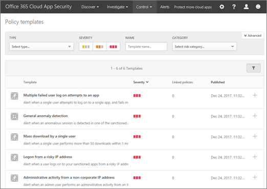
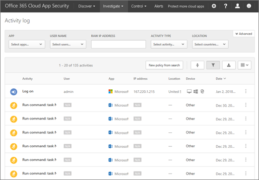

# Visão geral do Office 365 Cloud App SecurityOverview of Office 365 Cloud App Security
  
|Avaliação \* *\>*\*\*\*\*\*Evaluation\*\* \>\*\*|Planejamento \* *\>*\*\*\*\*\*Planning\*\* \>\*\*|Implantação \* *\>*\*\*\*\*\*Deployment\*\* \>\*\*|Utilização \* \* \*\*\*\*\*Utilization\*\*\*\*|
|:-----|:-----|:-----|:-----|
|Você está aqui!You are here!    [Próxima etapaNext step](get-ready-for-office-365-cas.md)   |[Começar a planejarStart planning](get-ready-for-office-365-cas.md)   |[Começar a implantarStart deploying](turn-on-office-365-cas.md)   |[Iniciar a utilizaçãoStart utilizing](utilization-activities-for-ocas.md)   |
   
> [!NOTE]
> Segurança de aplicativo de nuvem do Office 365 está disponível no Office 365 Enterprise E5. Se sua organização estiver usando outra assinatura do Office 365 Enterprise, a segurança de aplicativo de nuvem do Office 365 pode ser adquirida como um complemento. (Como um administrador global, no Centro de administração do Office 365, escolha **faturamento** \> **Adicionar assinaturas**.) Para obter mais informações, consulte [Descrição do serviço de plataforma do Office 365: segurança do Office 365 &amp; Centro de conformidade](https://technet.microsoft.com/en-us/library/dn933793.aspx) e [comprar ou editar um complemento para o Office 365 para empresas](https://support.office.com/article/4e7b57d6-b93b-457d-aecd-0ea58bff07a6).Office 365 Cloud App Security is available in Office 365 Enterprise E5. If your organization is using another Office 365 Enterprise subscription, Office 365 Cloud App Security can be purchased as an add-on. (As a global administrator, in the Office 365 admin center, choose **Billing** \> **Add subscriptions**.) For more information, see [Office 365 Platform Service Description: Office 365 Security &amp; Compliance Center](https://technet.microsoft.com/en-us/library/dn933793.aspx) and [Buy or edit an add-on for Office 365 for business](https://support.office.com/article/4e7b57d6-b93b-457d-aecd-0ea58bff07a6). 
  
Segurança de aplicativo de nuvem do Office 365 oferece percepção atividades suspeitas no Office 365 para que você possa investigar situações em que são potencialmente problemáticas e, se necessário, execute uma ação para solucionar problemas de segurança. Com a segurança de aplicativo de nuvem do Office 365, você pode receber notificações de alertas disparadas para atividades atípicos ou suspeitas, consulte como os dados da sua organização no Office 365 são acessados e usados, suspender apresentando atividades suspeitas de contas de usuário e exigem usuários façam logon novamente para aplicativos do Office 365 depois que tiver sido disparado um alerta. Leia este artigo para obter uma visão geral dos recursos de segurança de aplicativo de nuvem do Office 365.Office 365 Cloud App Security gives you insight into suspicious activity in Office 365 so you can investigate situations that are potentially problematic and, if needed, take action to address security issues. With Office 365 Cloud App Security, you can receive notifications of triggered alerts for atypical or suspicious activities, see how your organization's data in Office 365 is accessed and used, suspend user accounts exhibiting suspicious activity, and require users to log back in to Office 365 apps after an alert has been triggered. Read this article to get an overview of Office 365 Cloud App Security features and capabilities.
  
    
## Como localizar o portal de segurança de aplicativo de nuvem do Office 365How to find the Office 365 Cloud App Security portal

> [!NOTE]
> Para acessar o portal de segurança de aplicativo de nuvem do Office 365, você deve ser um administrador global, administrador de segurança ou leitor de segurança. Para saber mais, consulte [permissões no Office 365 Security &amp; Centro de conformidade](permissions-in-the-security-and-compliance-center.md).To access the Office 365 Cloud App Security portal, you must be a global administrator, security administrator, or security reader. To learn more, see [Permissions in the Office 365 Security &amp; Compliance Center](permissions-in-the-security-and-compliance-center.md). 
  
Você pode obter o portal de segurança de aplicativo de nuvem do Office 365 através de segurança do Office 365 &amp; Centro de conformidade. Aqui está uma boa maneira de fazê-la:You can get to the Office 365 Cloud App Security portal through the Office 365 Security &amp; Compliance Center. Here's one good way to do it:
  
1. Vá para [https://security.microsoft.com](https://security.microsoft.com) e entrar usando sua conta de trabalho ou da escola para o Office 365. (Isso leva você para a segurança &amp; Centro de conformidade.)Go to [https://security.microsoft.com](https://security.microsoft.com) and sign in using your work or school account for Office 365. (This takes you to the Security &amp; Compliance Center.) 
    
2. Na segurança &amp; Centro de conformidade, escolha **alertas** \> **avançadas de gerenciar alertas**.In the Security &amp; Compliance Center, choose **Alerts** \> **Manage advanced alerts**.   (Se a segurança de aplicativo de nuvem do Office 365 ainda não estiver habilitada, e você é um administrador global, [Ative a segurança de aplicativo do Office 365 nuvem](turn-on-office-365-cas.md).)(If Office 365 Cloud App Security is not yet enabled, and you are a global administrator, [turn on Office 365 Cloud App Security](turn-on-office-365-cas.md).)
    
3. Escolha **vá para segurança de aplicativo do Office 365 nuvem**.Choose **Go to Office 365 Cloud App Security**. 
    
## DiretivasPolicies

O Office 365 segurança de aplicativo de nuvem trabalha com as políticas definidas para sua organização. Com a segurança de aplicativo de nuvem do Office 365, sua organização obtém 10 políticas de detecção de anomalia predefinidos e vários modelos de políticas de atividade. Essas diretivas são projetadas para detectar problemas gerais, identificar usuários de log de um endereço IP riscado, detectar ransomware atividades, detectar atividades de administrador de não-corporativos endereços IP e muito mais.Office 365 Cloud App Security works with the policies that are defined for your organization. With Office 365 Cloud App Security, your organization gets 10 predefined anomaly detection policies and several templates for activity policies. These policies are designed to detect general anomalies, identify users logging in from a risky IP address, detect ransomware activities, detect administrator activities from non-corporate IP addresses, and more.
  

  
Para exibir/uso modelos de política, no portal de segurança de aplicativo de nuvem do Office 365, vá para o **controle** \> **modelos**.To view/use policy templates, in the Office 365 Cloud App Security portal, go to **Control** \> **Templates**. 
  

  
Para saber mais sobre políticas, consulte os seguintes recursos:To learn more about policies, see the following resources:
  
- [Políticas de atividades e alertas no Office 365 Cloud App SecurityActivity policies and alerts in Office 365 Cloud App Security](activity-policies-and-alerts.md)
    
- [Políticas de detecção de anomalias no Office 365 Cloud App SecurityAnomaly detection policies in Office 365 Cloud App Security](anomaly-detection-policies-in-ocas.md)
    
## AlertasAlerts

Quando as diretivas são definidas, alertas notificação-lo sobre atividades suspeitas ou atípicos detectados. Para exibir alertas para sua organização, escolha **alertas** na barra de navegação na parte superior da tela.When policies are defined, alerts notify you about suspicious or atypical activities that were detected. To view alerts for your organization, choose **Alerts** in the navigation bar across the top of the screen. 
  

  
Como os alertas são acionados, você poderá analisá-los para saber mais sobre o que está acontecendo. Em seguida, se a atividade for ainda suspeita, você pode executar a ação. Por exemplo, você pode notificar o usuário sobre um problema, suspender a um usuário faça logon para o Office 365 ou exigem um usuário entrar novamente para aplicativos do Office 365.As alerts are triggered you can review them to learn more about what is going on. Then, if the activity is still suspicious, you can take action. For example, you can notify a user about an issue, suspend a user from signing in to Office 365, or require a user to sign back in to Office 365 apps.
  
Para saber mais sobre os alertas, consulte os seguintes recursos:To learn more about alerts, see the following resources:
  
- [Políticas de atividades e alertas no Office 365 Cloud App SecurityActivity policies and alerts in Office 365 Cloud App Security](activity-policies-and-alerts.md)
    
- [Políticas de detecção de anomalias no Office 365 Cloud App SecurityAnomaly detection policies in Office 365 Cloud App Security](anomaly-detection-policies-in-ocas.md)
    
- [Revise e agir em alertas de segurança de aplicativo de nuvem do Office 365Review and take action on Office 365 Cloud App Security alerts](review-office-365-cas-alerts.md)
    
## Logs de atividadeActivity logs

Exibir informações sobre as atividades do usuário em sua página de log da atividade na segurança de aplicativo de nuvem do Office 365.View information about user activities on your Activity log page in Office 365 Cloud App Security.
  

  
Para obter a esta página, no portal de segurança de aplicativo de nuvem do Office 365, vá para **investigar** \> **log da atividade**.To get to this page, in the Office 365 Cloud App Security portal, go to **Investigate** \> **Activity log**. 
  

  
Você pode usar os logs de tráfego da web com segurança de aplicativo de nuvem do Office 365, muito. Os detalhes mais incluídos em que os arquivos de log, a melhor visibilidade que você vai ter em atividade do usuário. Você pode usar os arquivos de log de Barracuda, pelo azul, ponto de verificação, Cisco, Clavister, Dell SonicWALL, Fortinet, Juniper, McAfee, Microsoft, Palo Alto, Sophos, lula, Websence, Zscaler e muito mais.You can use your web traffic logs with Office 365 Cloud App Security, too. The more details that are included in those log files, the better visibility you'll have into user activity. You can use log files from Barracuda, Blue Coat, Check Point, Cisco, Clavister, Dell SonicWALL, Fortinet, Juniper, McAfee, Microsoft, Palo Alto, Sophos, Squid, Websence, Zscaler, and more.
  
[Saiba mais sobre as fontes de dados e logs de tráfego da web para segurança de aplicativo de nuvem do Office 365Learn about web traffic logs and data sources for Office 365 Cloud App Security](web-traffic-logs-and-data-sources-for-ocas.md)
  
## Permissões de aplicativoApp permissions

Com a segurança de aplicativo de nuvem do Office 365, você pode permitir ou impedir que as pessoas na sua organização para usar aplicativos de terceiros que acessam dados no Office 365.With Office 365 Cloud App Security, you can allow or prevent people in your organization to use third-party apps that access data in Office 365.
  

  
Para acessar esta página, vá para **investigar** \> **permissões do aplicativo**.To get to this page, go to **Investigate** \> **App permissions**. 
  

  
[Gerenciar permissões de aplicativo usando o Office 365 Cloud App SecurityManage app permissions using Office 365 Cloud App Security](manage-app-permissions-in-ocas.md)
  
## Painel de descoberta de nuvemCloud Discovery Dashboard

O **Painel de descoberta de nuvem**, também conhecida como a **Descoberta de aplicativos de produtividade**, mostra informações sobre o uso do aplicativo de nuvem dentro da sua organização. Você pode exibir informações sobre aplicativos, usuários, tráfego, transações e muito mais usando este painel. O painel de descoberta de nuvem é semelhante à seguinte imagem:The **Cloud Discovery Dashboard**, also referred to as **Productivity App Discovery**, shows information about cloud app usage within your organization. You can view information about apps, users, traffic, transactions, and more using this dashboard. The Cloud Discovery Dashboard resembles the following image: 
  

  
Para obter a este painel, no portal de segurança de aplicativo de nuvem do Office 365, vá para **descobrir** \> **Painel de descoberta de nuvem**.To get to this dashboard, in the Office 365 Cloud App Security portal, go to **Discover** \> **Cloud Discovery dashboard**. 
  

  
[Analisar descobertas de aplicativos do Office 365 Cloud App SecurityReview app discovery findings in Office 365 Cloud App Security](review-app-discovery-findings-in-ocas.md)
  
## Próximas etapasNext steps

- Obtenha o [guia de uso e casos de uso de segurança de aplicativo do Office 365 nuvem](https://aka.ms/O365CASGuide)Get the [Office 365 Cloud App Security Use Cases and Usage Guide](https://aka.ms/O365CASGuide)
    
- [Introdução ao Office 365 Cloud App SecurityGet ready for Office 365 Cloud App Security](get-ready-for-office-365-cas.md)
    

