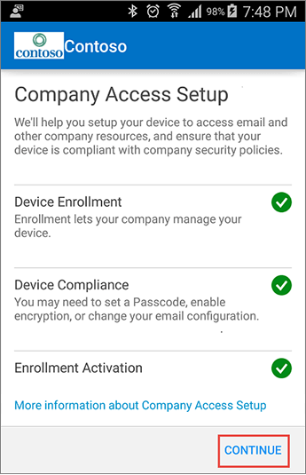

# Visão geral do gerenciamento de dispositivos móveis (MDM) para o Office 365

Você pode gerenciar e proteger dispositivos móveis se estivessem conectados à sua organização do Office 365 usando o gerenciamento de dispositivos móveis para o Office 365. Dispositivos móveis, como smartphones e tablets que são usados para acessar o trabalho de email, calendário, contatos e documentos ter um papel importante no certificando-se de que os funcionários realizar seus trabalhos a qualquer momento, em qualquer lugar. Isso é muito importante que você ajudar a proteger informações da sua organização, quando as pessoas usam dispositivos. Você pode usar o MDM para o Office 365 para definir regras de acesso e políticas de segurança de dispositivo e apagar dispositivos móveis se eles estiver perdidos ou roubados.
  

  
## Que tipos de dispositivos você pode gerenciar?

Você pode usar o MDM para o Office 365 para gerenciar muitos tipos de dispositivos móveis, como Android, Windows Phone, iPhone e iPad. Para gerenciar os dispositivos móveis usados pelas pessoas em sua organização, cada pessoa deve ter uma licença do Office 365 aplicável e seus dispositivos devem ser registrados em MDM para o Office 365. 
  
Para ver o que MDM para o Office 365 suporta para cada tipo de dispositivo, consulte [Os recursos de gerenciamento de dispositivos móveis para o Office 365](capabilities-of-mobile-device-management.md).
  
## Etapas de configuração para MDM

Um administrador global do Office 365 deve concluir as seguintes etapas para ativar e configurar o MDM para Office 365. Siga as orientações no tópico na [configuração do MDM para o Office 365](set-up-mobile-device-management.md) para ver as etapas detalhadas. Aqui está um resumo rápido: 
  
> Etapa 1: Ative MDM para o Office 365, seguindo as etapas no [conjunto de backup Mobile Device Management (MDM) no Office 365](set-up-mobile-device-management.md).
    
> Etapa 2: Configure MDM para o Office 365, por exemplo, criar um certificado APNs para gerenciar dispositivos iOS e adicionar um registro de sistema de nome de domínio (DNS) para seu domínio dar suporte ao Windows phones.
    
> Etapa 3: Criar políticas de dispositivo e aplicá-las a grupos de usuários. Quando você fizer isso, os usuários receberá uma [mensagem de inscrição no dispositivo](enroll-your-mobile-device.md). E quando concluírem a inscrição, seus dispositivos serão restritos pelas políticas que você configurou para eles.
    
    
  
## Tarefas de gerenciamento de dispositivo

Depois que você acaba de criar MDM para o Office 365, configurar e os usuários tenham sido registrados seus dispositivos, você pode gerenciar os dispositivos, bloqueie o acesso ou apagar um dispositivo, se necessário. Saiba mais sobre [algumas tarefas comuns de gerenciamento de dispositivo](manage-devices-in-mdm.md), incluindo where concluir as tarefas.
  
## Outras maneiras de gerenciar os aplicativos e dispositivos

Se precisar de mais funcionalidade do que MDM para o Office 365 inclui, confira desta [comparação dos recursos MDM e Microsoft Intune](choose-between-mdm-and-intune.md) para ver se uma assinatura Intune seria atender às necessidades da sua organização. 
  
Se você precisa apenas de gerenciamento de aplicativo móvel (MAM), talvez para pessoas Atualizando projetos de trabalho em seus próprios dispositivos, Intune fornece outra opção além inscrevendo e gerenciamento de dispositivos. Uma assinatura Intune permite que você defina as políticas MAM usando o portal do Azure, mesmo se os dispositivos de pessoas não estão inscritos no Intune. Consulte a [proteger os dados de aplicativo usando diretivas MAM](https://go.microsoft.com/fwlink/?LinkId=825439). 
  
## Confira também

[Obter detalhes sobre os dispositivos gerenciados por MDM](get-details-about-mdm-managed-devices.md)

[Configurar o MDM para Office 365](set-up-mobile-device-management.md)
  
[Registrar a dispositivos móveis no MDM](enroll-your-mobile-device.md)
  
[Gerenciar dispositivos inscritos no MDM](manage-devices-in-mdm.md)

