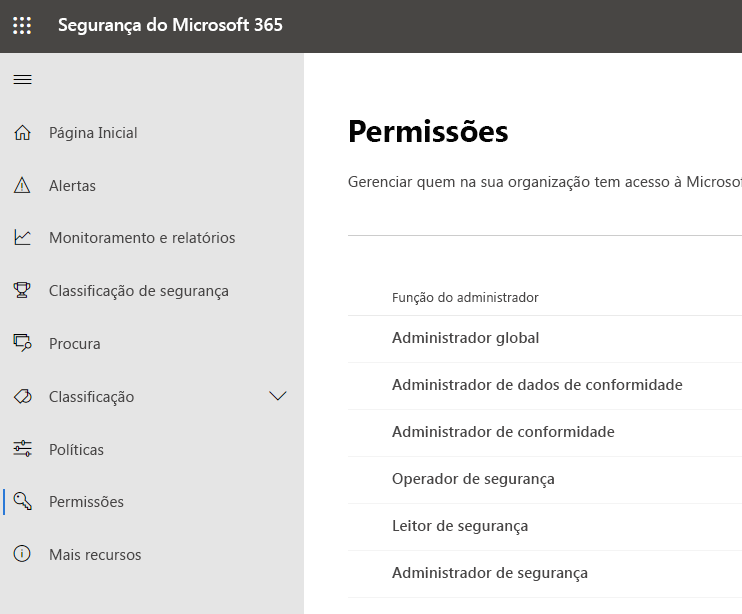
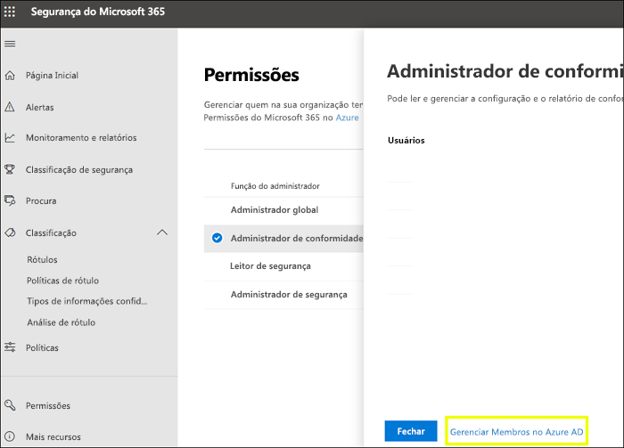
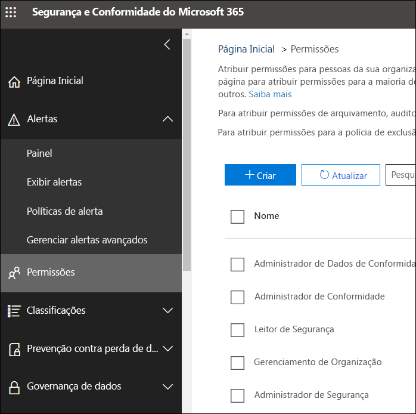

# Permissões novo centro de segurança do Microsoft 365 e no centro de conformidade do Microsoft 365

Sua organização precisa gerenciar cenários de segurança e conformidade que abrangem todos os serviços do Microsoft 365. E você precisa ter flexibilidade para dar permissões de administrador para as pessoas certas no grupo de TI da sua organização. Usando a central de segurança do Microsoft 365 ou o centro de conformidade da Microsoft 365, você pode gerenciar as permissões centralmente para todas as tarefas relacionadas à segurança ou conformidade.

Depois que o administrador global atribuir essas funções de administrador, os administradores têm acesso aos recursos e dados que abrangem todos os serviços no Microsoft 365, como a central de segurança da Microsoft 365, o centro de conformidade da Microsoft 365, o Azure, o Office 365 e o Enterprise Mobility + Security.

## Quais são as funções do Microsoft 365

As funções que aparecem no centro de conformidade do Microsoft 365 e no centro de segurança da Microsoft 365 são funções do Azure Active Directory. Essas funções foram projetadas para se alinharem com funções de trabalho no grupo de TI da sua organização, tornando mais fácil dar a uma pessoa todas as permissões necessárias para realizar o trabalho.

|**Função**|**Descrição**|
|:-----|:-----|
|**Administrador global**|Os usuários com essa função têm acesso a todos os recursos administrativos em todos os serviços do Microsoft 365. Somente os administradores globais podem atribuir outras funções de administrador.|
|**Administrador de dados de conformidade**|Os usuários com essa função podem controlar os dados da sua organização no Microsoft 365, verificar se eles estão protegidos e obter informações para ajudar a reduzir os riscos.|
|**Administrador de conformidade**|Os usuários que têm essa função podem ajudar sua organização a manter a conformidade com os requisitos regulamentares, gerenciar casos de descoberta eletrônica e manter políticas de governança de dados em locais, identidades e aplicativos do Microsoft 365.|
|**Operador de segurança**|Os usuários com essa função podem exibir, investigar e responder a ameaças ativas a seus usuários, dispositivos e conteúdo da Microsoft 365.|
|**Leitor de segurança**|Os usuários que têm essa função podem exibir e investigar ameaças ativas a seus usuários, dispositivos e conteúdo da Microsoft 365, mas (diferentemente do operador de segurança) não têm permissões para responder executando uma ação.|
|**Administrador de segurança**|Os usuários que têm essa função podem controlar a segurança global da sua organização, gerenciando políticas de segurança, analisando análises e relatórios de segurança em produtos da Microsoft 365 e ficando sempre atualizado sobre o panorama das ameaças.|

## Ao que as funções do Microsoft 365 têm acesso

Veja as funções disponíveis e o que as pessoas atribuídas a elas podem fazer.

### Administrador global

Os usuários com essa função têm acesso a todos os recursos administrativos do Azure Active Directory, bem como aos serviços que usam identidades do Azure Active Directory como centro de segurança do Microsoft 365, centro de conformidade do Microsoft 365, Exchange Online, SharePoint Online e Skype for Business Online. A pessoa que se inscreve no locatário do Azure Active Directory torna-se um administrador global. Somente os administradores globais podem atribuir outras funções de administrador. Pode haver mais de um administrador global na sua empresa. Administradores globais podem redefinir a senha para qualquer usuário e todos os outros administradores.

### Administrador de conformidade

Os usuários com essa função têm permissões para gerenciar recursos relacionados à conformidade no centro de conformidade do Microsoft 365, no centro de administração do Microsoft 365, no Azure e no Centro de Conformidade e Segurança do Office 365. Os usuários também podem gerenciar todos os recursos no centro de administração do Exchange e no centro de administração do Teams e do Skype for Business e criar tíquetes de suporte para o Azure e o Microsoft 365.

|**Neste serviço...**|**O administrador de conformidade pode...**|
|:-----|:-----|
|[**Centro de conformidade do Microsoft 365**](https://compliance.microsoft.com/)|Proteger e gerenciar dados da sua organização em todos os serviços do Microsoft 365.    Gerenciar alertas de conformidade.|
|[**Gerenciador de Conformidade**](https://docs.microsoft.com/office365/securitycompliance/meet-data-protection-and-regulatory-reqs-using-microsoft-cloud)|Acompanhar, atribuir e verificar as atividades de conformidade regulatória da sua organização.|
|[**Centro de Conformidade e Segurança do Office 365**](https://support.office.com/article/About-Office-365-admin-roles-da585eea-f576-4f55-a1e0-87090b6aaa9d)|Gerenciar governança de dados.    Executar investigação jurídica e de dados.    Gerenciar solicitação do titular dos dados.|
|[**Intune**](https://docs.microsoft.com/intune/role-based-access-control)|Exibir todos os dados de auditoria do Intune.|
|[**Segurança no Aplicativo na Nuvem**](https://docs.microsoft.com/cloud-app-security/manage-admins)|Tem permissões somente leitura e pode gerenciar alertas.    Pode criar e modificar políticas de arquivo e permitir ações de governança de arquivo.    Pode exibir todos os relatórios internos em Gerenciamento de Dados.|

### Administrador de dados de conformidade

Os usuários com esta função têm permissões para proteger e controlar dados no centro de conformidade do Microsoft 365, no centro de administração do Microsoft 365 e no Azure. Os usuários também podem gerenciar todos os recursos no Centro de administração do Exchange, no Gerenciador de Conformidade e no Centro de administração do Teams e do Skype for Business, além de criar tíquetes de suporte para o Azure e o Microsoft 365.

|**Neste serviço...**|**O administrador de dados de conformidade pode...**|
|:-----|:-----|
|[**Centro de conformidade do Microsoft 365**](https://compliance.microsoft.com/)|Proteger e gerenciar dados da sua organização em todos os serviços do Microsoft 365.    Gerenciar alertas de conformidade.    Gerenciar rótulos de sensibilidade|
|[**Gerenciador de Conformidade**](https://docs.microsoft.com/office365/securitycompliance/meet-data-protection-and-regulatory-reqs-using-microsoft-cloud)|Acompanhar, atribuir e verificar as atividades de conformidade regulatória da sua organização.|
|[**Centro de Conformidade e Segurança do Office 365**](https://support.office.com/article/About-Office-365-admin-roles-da585eea-f576-4f55-a1e0-87090b6aaa9d)|Gerenciar governança de dados.    Executar investigação jurídica e de dados.    Gerenciar solicitação do titular dos dados.    Gerenciar rótulos de sensibilidade|
|[** Intune**](https://docs.microsoft.com/intune/role-based-access-control) (em breve)|Exibir todos os dados de auditoria do Intune.|
|[**Segurança no Aplicativo na Nuvem**](https://docs.microsoft.com/cloud-app-security/manage-admins)|Usar permissões somente leitura para exibir informações.  Gerenciar Alertas.    Criar e modificar políticas de arquivo e permitir ações de governança de arquivo.    Exibir todos os relatórios internos em Gerenciamento de Dados.|

### Administrador de segurança

Os usuários com essa função têm permissões para gerenciar recursos relacionados à segurança na central de segurança do Microsoft 365, Azure Active Directory Identity Protection, Proteção de Informações do Azure e Centro de Conformidade e Segurança do Office 365.

|**Neste serviço...**|**O administrador de segurança pode...**|
|:-----|:-----|
|[**Centro de segurança do Microsoft 365**](https://security.microsoft.com/)|Monitorar políticas relacionadas a segurança em todos os serviços do Microsoft 365.     Gerenciar alertas e ameaças de segurança.    Exibir relatórios.    Gerenciar rótulos de confidencialidade.|
|**Identity Protection Center**|Fazer tudo que o Leitor de Segurança pode fazer, além de executar todas as operações da central de proteção de identidade, exceto redefinir senhas.|
|[**Privileged Identity Management**](https://docs.microsoft.com/azure/active-directory/privileged-identity-management/pim-configure)|Realizar tudo o que o Leitor de Segurança pode fazer.    **Não pode** gerenciar atribuições de função ou configurações do Azure AD.|
|[**Centro de Conformidade e Segurança do Office 365**](https://support.office.com/article/About-Office-365-admin-roles-da585eea-f576-4f55-a1e0-87090b6aaa9d)|Gerenciar políticas de segurança.    Exibir, investigar e responder a ameaças de segurança    Exibir relatórios.    Gerenciar rótulos de confidencialidade.|
|**Proteção Avançada contra Ameaças do Azure**|Monitorar e responder a atividades suspeitas de segurança.|
|**Windows Defender ATP e EDR**|Atribuir funções.    Gerenciar grupos de computadores.    Configurar a detecção de ameaças do ponto de extremidade e a correção automatizada.    Exibir, investigar e responder a alertas.|
|[**Intune**](https://docs.microsoft.com/intune/role-based-access-control)|Exibe informações de usuário, dispositivo, registro, configuração e aplicativo.    **Não** pode fazer alterações no Intune.|
|[**Segurança no Aplicativo na Nuvem**](https://docs.microsoft.com/cloud-app-security/manage-admins)|Adicionar administradores, adicionar políticas e configurações, carregar logs e executar ações de governança.|
|[** Central**](https://docs.microsoft.com/azure/role-based-access-control/built-in-roles) de segurança do Azure (em breve)|Exibir políticas de segurança, exibir estados de segurança, editar políticas de segurança, exibir alertas e recomendações, ignorar alertas e recomendações.|
|[**Integridade do serviço do Office 365**](https://docs.microsoft.com/office365/enterprise/view-service-health)|Exibir a integridade de serviços do Office 365.|

### Operador de segurança

Usuários com essa função podem gerenciar alertas e ter acesso global somente leitura em recurso relacionado à segurança, incluindo todas as informações no centro de segurança do Microsoft 365, no Azure Active Directory, no Identity Protection e no Privileged Identity Management, bem como a capacidade de ler logs de auditoria e relatórios de entrada do Azure Active Directory e no Centro de Conformidade e Segurança do Office 365.

|**Neste serviço...**|**O operador de segurança pode...**|
|:-----|:-----|
|[**Centro de segurança do Microsoft 365**](https://security.microsoft.com/)|Realizar tudo o que o Leitor de Segurança pode fazer.    Exibir, investigar e responder a alertas de segurança.|
|**Identity Protection Center** (em breve)|Realizar tudo o que o Leitor de Segurança pode fazer.|
|[**Privileged Identity Management**](https://docs.microsoft.com/azure/active-directory/privileged-identity-management/pim-configure)|Realizar tudo o que o Leitor de Segurança pode fazer.|
|[**Centro de Conformidade e Segurança do Office 365**](https://support.office.com/article/About-Office-365-admin-roles-da585eea-f576-4f55-a1e0-87090b6aaa9d)|Realizar tudo o que o Leitor de Segurança pode fazer.    Exibir, investigar e responder a ameaças de segurança|
|**Windows Defender ATP e EDR**|Realizar tudo o que o Leitor de Segurança pode fazer.    Exibir, investigar e responder a alertas.|
|[**Intune**](https://docs.microsoft.com/intune/role-based-access-control)|Exibe informações de usuário, dispositivo, registro, configuração e aplicativo.    **Não** pode fazer alterações no Intune.|
|[**Segurança no Aplicativo na Nuvem**](https://docs.microsoft.com/cloud-app-security/manage-admins)|Realizar tudo o que o Leitor de Segurança pode fazer, além de exibir e descartar alertas.|
|[**Integridade do serviço do Office 365**](https://docs.microsoft.com/office365/enterprise/view-service-health)|Exibir a integridade de serviços do Office 365.|

### Leitor de segurança

Usuários com essa função têm acesso somente leitura global em recurso relacionado à segurança, incluindo todas as informações no centro de segurança do Microsoft 365, no Azure Active Directory, no Identity Protection e no Privileged Identity Management, bem como a capacidade de ler logs de auditoria e relatórios de entrada do Azure Active Directory e no Centro de Conformidade e Segurança do Office 365.

|**Neste serviço...**|**O leitor de segurança pode...**|
|:-----|:-----|
|[**Centro de segurança do Microsoft 365**](https://security.microsoft.com/)|Exibir políticas relacionadas à segurança em todos os serviços do Microsoft 365.    Exibir alertas e ameaças de segurança.    Exibir relatórios.|
|**Identity Protection Center**|Lê todas as informações sobre as configurações e os relatórios de segurança para recursos de segurança: antispam, criptografia, prevenção contra perda de dados (DLP), anti-malware, proteção avançada contra ameaças (ATP), anti-phishing e regras de fluxo de email (também conhecidas como regras de transporte).|
|[**Privileged Identity Management**](https://docs.microsoft.com/azure/active-directory/privileged-identity-management/pim-configure)|Use o acesso somente leitura para exibir todas as informações exibidas no Azure AD PIM: políticas e relatórios de atribuições de função do Azure AD, análises de segurança e, no futuro, dados de política e relatórios para cenários além da atribuição de função do Azure AD.    **Não pode** se inscrever no Azure AD PIM nem fazer alterações nele. No portal do PIM ou por meio do PowerShell, alguém nesta função poderá ativar funções adicionais (por exemplo, administrador global ou administrador com função com privilégios) se o usuário for elegível para a elas.|
|[**Centro de Conformidade e Segurança do Office 365**](https://support.office.com/article/About-Office-365-admin-roles-da585eea-f576-4f55-a1e0-87090b6aaa9d)|Exibir políticas de segurança.    Exibir e investigar ameaças de segurança.    Exibir relatórios.|
|**Windows Defender ATP e EDR**|Exibir e investigar alertas.|
|[**Intune**](https://docs.microsoft.com/intune/role-based-access-control)|Exibe informações de usuário, dispositivo, registro, configuração e aplicativo.    **Não** pode fazer alterações no Intune.|
|[**Segurança no Aplicativo na Nuvem**](https://docs.microsoft.com/cloud-app-security/manage-admins)|Usar permissões somente leitura para exibir informações.    Gerenciar Alertas.|
|[**Central de Segurança do Azure**](https://docs.microsoft.com/azure/role-based-access-control/built-in-roles)|Exibir recomendações e alertas.    Exibir políticas de segurança.    Exibir estados de segurança, mas sem poder fazer alterações.|
|[**Integridade do serviço do Office 365**](https://docs.microsoft.com/office365/enterprise/view-service-health)|Exibir a integridade de serviços do Office 365.|

## Os administradores globais podem gerenciar as funções no Azure Active Directory

No centro de conformidade do Microsoft 365 e no centro de segurança do Microsoft 365, ao selecionar uma função, você pode exibir suas tarefas. No entanto, para gerenciar essas tarefas, você precisa ir para o Azure Active Directory.

Para saber mais informações, consulte [Exibir e atribuir funções de administrador no Azure Active Directory](https://docs.microsoft.com/azure/active-directory/users-groups-roles/directory-manage-roles-portal).

## Gerenciamento de funções em um serviço, em vez do Azure Active Directory

As funções que aparecem no centro de conformidade do Microsoft 365 e no centro de segurança da Microsoft 365 também são exibidas nos serviços que têm permissões. Por exemplo, você pode ver essas funções no Centro de Conformidade e Segurança do Office 365.

### Interrompendo herança

É importante compreender que quando você gerencia essas funções no Azure Active Directory, está fazendo centralmente para **todos** os serviços da Microsoft 365. No entanto, ao gerenciar uma função em um serviço específico, como no Centro de Conformidade e Segurança do Office 365, você está gerenciando **apenas** a função para esse serviço específico. As atribuições e permissões para uma função em um serviço substituem as permissões concedidas à função do Azure Active Directory.

Isso pode ser útil, por exemplo, quando uma pessoa recebe a função de administrador de segurança e ela não tem permissões para gerenciar incidentes. No entanto, você pode usar as permissões da proteção avançada contra ameaças do Windows Defender para conceder a eles a permissão específica de gerenciamento de incidentes naquele serviço.

## Onde encontrar informações sobre a função de cada serviço da Microsoft 365

Ao atribuir um usuário a uma das funções de administrador de conformidade ou segurança do Microsoft 365, conceda a essas permissões de usuário a uma série de serviços do Microsoft 365. Use os links abaixo para saber mais sobre as permissões específicas para uma função em cada serviço.

|**Serviço da Microsoft 365**|**Informações da função**|
|:-----|:-----|
|Funções de administrador em planos de negócios do Office 365 e do Microsoft 365|[Funções de administrador do Office 365](https://docs.microsoft.com/office365/admin/add-users/about-admin-roles?view=o365-worldwide)|
|Azure AD (Azure Active Directory) e Azure AD Identity Protection|[Funções de administrador do Azure AD](https://docs.microsoft.com/azure/active-directory/users-groups-roles/directory-assign-admin-roles)|
|Proteção Avançada contra Ameaças do Azure|[Grupos de funções do ATP do Azure](https://docs.microsoft.com/azure-advanced-threat-protection/atp-role-groups)|
|Proteção de Informações do Azure|[Funções de administrador do Azure AD](https://docs.microsoft.com/azure/active-directory/users-groups-roles/directory-assign-admin-roles)|
|Gerente de Conformidade|[Funções do gerenciador de conformidade](https://docs.microsoft.com/office365/securitycompliance/meet-data-protection-and-regulatory-reqs-using-microsoft-cloud#permissions-and-role-based-access-control)|
|Exchange Online|[Controle de acesso baseado em função do Exchange](https://docs.microsoft.com/exchange/understanding-role-based-access-control-exchange-2013-help)|
|Intune|[Controle de acesso baseado em função do Intune](https://docs.microsoft.com/intune/role-based-access-control)|
|Área de trabalho gerenciada|[Funções de administrador do Azure AD](https://docs.microsoft.com/azure/active-directory/users-groups-roles/directory-assign-admin-roles)|
|Microsoft Cloud App Security|[Controle de acesso baseado em função](https://docs.microsoft.com/cloud-app-security/manage-admins)|
|Centro de Conformidade e Segurança do Office 365|[Funções de administrador do Office 365](https://docs.microsoft.com/office365/SecurityCompliance/permissions-in-the-security-and-compliance-center)|
|Privileged Identity Management|[Funções de administrador do Azure AD](https://docs.microsoft.com/azure/active-directory/users-groups-roles/directory-assign-admin-roles)|
|Classificação de Segurança|[Funções de administrador do Azure AD](https://docs.microsoft.com/azure/active-directory/users-groups-roles/directory-assign-admin-roles)|
|SharePoint Online|[Funções de administrador do Azure AD](https://docs.microsoft.com/azure/active-directory/users-groups-roles/directory-assign-admin-roles)    [Sobre a função de administrador do SharePoint no Office 365](https://docs.microsoft.com/sharepoint/sharepoint-admin-role)|
|Equipes/Skype for Business|[Funções de administrador do Azure AD](https://docs.microsoft.com/azure/active-directory/users-groups-roles/directory-assign-admin-roles)|
|Proteção Avançada Contra Ameaças do Windows Defender|[Controle de acesso baseado em função do Windows Defender ATP](https://docs.microsoft.com/windows/security/threat-protection/windows-defender-atp/rbac-windows-defender-advanced-threat-protection)|

## O que será lançado em breve

Ainda estamos trabalhando nas permissões do centro de conformidade do Microsoft 365 e do centro de segurança da Microsoft 365. Por exemplo, no momento estamos trabalhando para oferecer suporte à capacidade de:

- Gerenciar funções no centro de conformidade do Microsoft 365 e no centro de segurança da Microsoft 365, em vez de ir para o Azure Active Directory.

- Personalizar funções adicionando ou removendo permissões específicas.

- Criar funções personalizadas com as permissões que você escolher.
