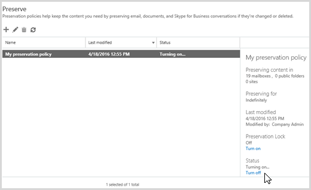

# Visão geral das políticas de preservação

> [!IMPORTANT]
> Se você estivesse usando uma política de preservação, essa política foi automaticamente convertida para uma política de retenção, que é um novo recurso que faz tudo o uma política de preservação e muito mais. A política de preservação continuarão trabalhar e preservar o seu conteúdo sem precisar de quaisquer mudanças de você. Você pode encontrar essas políticas na página **retenção** de segurança &amp; Centro de conformidade. Para obter mais informações, consulte [o que aconteceu com políticas de preservação?](retention-policies.md#what-happened-to-preservation-policies)
  
Para cumprir as normas do setor ou políticas internas, as organizações desejam preservar o conteúdo para um determinado período de tempo. Com uma política de preservação no Office 365, você pode preservar o conteúdo em sites, caixas de correio e pastas públicas indefinidamente ou por um período específico. Você também pode filtrar o conteúdo que será preservado, fornecendo palavras-chave ou um intervalo de datas para reduzir os resultados.
  
Por exemplo, você pode preservar o conteúdo em sites que pertencem ao departamento de vendas por sete anos e de caixas de correio específicas e ainda mais restringir o escopo da política dizendo que você deseja preservar somente conteúdo de últimos dois anos que contém uma versão específica nome do cliente.
  
Quando o conteúdo está sujeito a uma política de preservação, as pessoas podem continuar a editar e trabalhar com o conteúdo conforme se nada for alterado porque o conteúdo preservados no lugar, em seu local original. Mas, se alguém edita ou exclui o conteúdo que está sujeito a política, uma cópia é salvo em um local seguro, onde ela é preservada enquanto a política estiver em vigor.
  
Finalmente, algumas organizações, talvez seja necessário cumprir as regras definidas por órgãos normativos, como a regra de títulos and Exchange comissão (s) 17a-4, que requer que depois que uma política de preservação estiver ativada, ele não pode ser desativado ou feito menos restritivo. Para atender a esse requisito, você pode usar o bloqueio de preservação. Depois que uma política do sido bloqueada, ninguém — incluindo o administrador — pode desativar a diretiva ou torná-lo menos restritivas.
  
Criar e gerenciar políticas de preservação na página retenção de segurança do Office 365 &amp; Centro de conformidade.
  

  
> [!NOTE]
> Para incluir uma caixa de correio do Exchange Online em uma política de preservação, a caixa de correio deve ser atribuída uma licença do Exchange Online plano 2. Se uma caixa de correio for atribuída a uma licença do Exchange Online plano 1, você teria atribuí-lo uma licença separada de arquivamento do Exchange Online para incluí-lo em uma política de preservação. 
  
## Como funciona uma política de preservação com conteúdo in-loco

Ao incluir um site, caixa de correio ou pasta pública em uma política de preservação, o conteúdo permanece em seu local original. As pessoas podem continuar a trabalhar com seus documentos ou email, mas uma cópia do conteúdo como ela se encontrava quando você tiver iniciado a política é preservado. Para sites, conteúdo preservado na biblioteca de retenção para preservação; para caixas de correio e pastas públicas, conteúdo preservado na pasta itens recuperáveis. Não são visíveis para a maioria das pessoas desses locais seguros e o conteúdo preservado. Com uma política de preservação, as pessoas não ainda precisará saber que seu conteúdo está sujeito a política.
  

  
### Conteúdo do site

Uma política de preservação será aplicada no nível de um site. Quando você incluir um site em uma política de preservação, uma biblioteca de retenção para preservação é criada, caso ainda não exista. A maioria dos usuários não podem exibir a biblioteca de retenção para preservação porque ele é visível somente para os proprietários do conjunto de sites.
  
Se uma pessoa tentar alterar ou excluir o conteúdo em um site que está sujeito a uma política de preservação, primeiro a política verifica se o conteúdo do foram alterado desde que a política foi aplicada. Se essa for a primeira alteração desde que a política de preservação foi aplicada, a política copia o conteúdo na biblioteca de retenção para preservação e, em seguida, permite que a pessoa alterar ou excluir o conteúdo original. Observe que qualquer conteúdo do site pode ser copiado para a biblioteca de retenção para preservação, mesmo se o conteúdo não coincide com o filtro da consulta utilizada pela política preservação.
  
Em seguida, uma tarefa do temporizador limpa a Biblioteca de Retenções para Preservação. A tarefa do temporizador é executada periodicamente e compara todo o conteúdo da biblioteca de Retenção para Preservação com os filtros usados pelas políticas de preservação no site. A menos que o conteúdo corresponda a pelo menos um dos filtros, a tarefa do temporizador excluirá permanentemente o conteúdo da Biblioteca de Retenções para Preservação.
  
Anterior se aplica ao conteúdo que existe quando a preservação de política será aplicada. Além disso, qualquer conteúdo novo que tenha criado ou adicionados ao site depois que ela foi incluída na política será preservado após a exclusão. No entanto, novo conteúdo não é copiado para o tempo de biblioteca o primeiro bloqueio preservação que for editado, somente quando ele é excluído. Para preservar as versões para todos os arquivos, você precisa ativar o controle de versão — consulte a seção posterior sobre controle de versão.
  
### Conteúdo da pasta pública e da caixa de correio

Para os emails de um usuário e outros itens, uma política de preservação é aplicada no nível de uma caixa de correio. Para uma pasta pública, uma política de preservação é aplicada ao nível da pasta, não ao nível da caixa de correio. Tanto uma caixa de correio quanto uma pasta pública usam a pasta Itens Recuperáveis para preservar itens. Somente as pessoas às quais foram atribuídas permissões de descoberta eletrônica podem exibir a pasta de itens recuperáveis de outro usuário.  
  
Por padrão, quando uma pessoa exclui uma mensagem de uma pasta que não seja a pasta Itens excluídos, a mensagem é movida para a pasta Itens excluídos. Quando uma pessoa exclui um item da pasta Itens excluídos, a mensagem é movida para a pasta itens recuperáveis e desaparecerá da exibição do usuário. Além disso, uma pessoa soft pode excluir um item (SHIFT + DELETE) em qualquer pasta, o que ignora a pasta Itens excluídos e coloca o item diretamente na pasta itens recuperáveis.
  
Quando uma caixa de correio é incluída em uma política de preservação, os itens excluídos são movidos para a pasta DiscoveryHold dentro da pasta Itens Recuperáveis. Quando o assistente de caixa de correio processa periodicamente a caixa de correio, avalia as mensagens nessa pasta. A menos que o conteúdo corresponda a pelo menos um dos filtros usados por uma política de preservação, o assistente de caixa de correio excluirá permanentemente o conteúdo da pasta Itens Recuperáveis.
  
A pasta itens recuperáveis também contém uma pasta de versões. Quando uma pessoa tenta alterar determinadas propriedades de um item de caixa de correio — como o assunto, corpo, anexos, remetentes e destinatários, ou data enviadas ou recebidas de uma mensagem — uma cópia do item original é salva na pasta de versões antes da alteração ser submetida. Isso acontece para cada alteração subsequente. Depois que a política de preservação for removida, as cópias na pasta de versões são removidas pelo Assistente de caixa de correio.
  
### Quando uma política de preservação é armazenada

Quando você cria uma política de preservação, ele está armazenado centralmente na segurança &amp; Centro de conformidade e, em seguida, implantados para as fontes de conteúdo diferentes que inclui a diretiva, como sites, caixas de correio e pastas públicas.
  
Após a implantação de uma política de preservação nessas fontes de conteúdo, a política funciona exatamente como um bloqueio in-loco de Descoberta Eletrônica. Para obter mais informações sobre bloqueios in-loco, consulte:
  
- [Visão geral do eDiscovery e in-loco retenções](https://go.microsoft.com/fwlink/p/?LinkID=404352) (SharePoint Online) 
    
- [In-loco espera e litígio](https://go.microsoft.com/fwlink/p/?LinkID=404353) (Exchange Online) 
    
- [Pasta itens recuperáveis](https://go.microsoft.com/fwlink/p/?LinkID=404354) (Exchange Online) 
    
### Política de preservação versus espera de descoberta eletrônica

Embora seja true que esses recursos reter conteúdo, esses recursos não devem ser confundidos porque eles têm finalidades diferentes:
  
- **Se você precisar preservar o conteúdo como parte de um requisito de retenção, usar uma política de preservação.** Por exemplo, se você precisar manter o conteúdo por sete anos como parte do seu plano de retenção, use uma política de preservação. Uma política de preservação pode preservar o conteúdo por um período de tempo específico, e no final do período de tempo, o conteúdo automaticamente liberados da diretiva. A política também pode ser bloqueada para que ninguém possa desativar a diretiva ou torná-lo menos restritivas. Uma espera de eDiscovery não pode ser bloqueado ou especifique um período de tempo. Além disso, uma política de preservação comumente possui uma duração de anos, enquanto uma espera de descoberta eletrônica é temporária e dura comumente apenas a duração de um caso jurídico. 
    
    Além disso, você pode criar uma diretiva de preservação sem as etapas adicionais que pode exigir eDiscovery, como a criação de casos, adicionando membros, ou fazer o conteúdo de pesquisa.
    
- **Se você precisar reter conteúdo como parte de um requisito legal ou eDiscovery, use uma espera de descoberta eletrônica.** Por exemplo, se você precisar reter o conteúdo em locais específicos como parte de uma solicitação legal, use uma espera de descoberta eletrônica. Na descoberta eletrônica, o conteúdo relevante a um caso é geralmente confidencial ou privilegiados, tão diferentes casos podem ser restritos aos membros de diferentes. Além disso, as pesquisas de conteúdo que podem ser salvo, visualizadas, analisadas com eDiscovery avançado oferece suporte a descoberta eletrônica ou exportar os resultados. 
    
    Ao contrário de uma política de preservação, uma espera de descoberta eletrônica não é possível especificar um período de tempo - uma espera de descoberta eletrônica está em vigor até você desativá-lo ou excluí-lo. Além disso, uma espera de eDiscovery não pode ser bloqueada.
    
## Como funciona uma política de preservação com versões de documento em um site

Uma política de preservação automaticamente não preserva todas as versões de um documento em um site. Para fazer isso, você precisa ativar o controle de versão para as bibliotecas de documentos no site. Para obter mais informações, consulte [Habilitar e configurar o controle de versão para uma lista ou biblioteca](https://go.microsoft.com/fwlink/p/?LinkID=404350).
  
Se um documento for excluído de um site que está sendo preservado e controle de versão do documento está ativado para a biblioteca, todas as versões do documento excluído serão preservadas. 
  
Se o controle de versão de documento não está ativado e um item está sujeito a várias políticas de preservação, a versão é preservada é aquele que é o atual quando cada política preservação entrará em vigor. Por exemplo, se a versão 27 de um item é a mais recente quando o site é preservado a primeira vez e a versão 51 é a mais recente quando o site é preservado na segunda vez, versões 27 e 51 serão preservadas.
  
## Filtrando uma política de preservação

Você pode restringir o conteúdo sujeito a uma política de preservação adicionando palavras-chave ou um intervalo de datas à política. 
  

  
### Filtrar usando palavras-chave

Uma política de preservação oferece suporte a linguagem de consulta de palavra-chave (KQL). Por exemplo, você pode usar os operadores básicos e like e ou, e você pode fazer uma pesquisa de proximidade onde "marketing de NEAR(30) wingtip" identifica resultados onde "wingtip" é dentro de 30 caracteres de "marketing". Uma consulta de palavra-chave ajuda a identificar e preservar apenas o conteúdo relevante.
  
### Filtrar usando um intervalo de datas

Você também pode filtrar a política de modo que ela preserve somente o conteúdo dentro de um intervalo de datas específico. Para mensagens, a data é relativa à data do recebimento e, para documentos e sites, a data é relativa à data de modificação. Isso significa que você pode preservar conteúdo que inclua emails recebidos e documentos modificados em um intervalo de datas específico ou antes ou depois uma data de início ou de término.
  
## Preservando o conteúdo durante um período específico

Com uma política de preservação, você pode preservar o conteúdo indefinidamente ou por uma quantidade específica de dias, de meses ou de anos. Observe que a duração da preservação do conteúdo será calculada a partir da idade do conteúdo, e não a partir da criação da política de preservação. 
  
Por exemplo, se você deseja preservar o conteúdo em um site por sete anos e um documento nesse site não tenha sido modificado em seis anos, o documento será preservado por apenas mais um ano se ela não é modificada. Se o documento for editado novamente, a idade do documento é calculada a partir da nova data da última modificação e ele será preservado para outro sete anos.
  
De maneira semelhante, se você quiser preservar o conteúdo em uma caixa de correio por sete anos, e uma mensagem tiver sido enviada há seis anos, a mensagem será preservada somente por mais um ano, a menos que a data do recebimento seja modificada. Nesse caso, uma nova versão da mensagem como ela existia antes de ser editada é preservada na pasta Itens Recuperáveis, e a idade da mensagem é calculada a partir da nova data do recebimento, e ela será preservada por mais sete anos.
  

  
## Bloqueando uma política de preservação

Algumas organizações talvez seja necessário cumprir as regras definidas por órgãos normativos, como a regra de títulos and Exchange comissão (s) 17a-4, que requer que depois que uma política de preservação estiver ativada, ele não pode ser desativado ou feito menos restritivo. Com preservação Lock, você pode bloquear a diretiva de modo que ninguém — incluindo o administrador — pode desativar a diretiva ou torná-lo menos restritivas.
  
Depois que uma política do sido bloqueada, ninguém pode desativá-la ou remover o conteúdo da diretiva. E não é possível modificar ou excluir o conteúdo que está sujeito a política durante o período de preservação. Depois que a política do sido bloqueada, das maneiras só é possível modificar a política de preservação são adicionando o conteúdo a ela ou estendendo sua duração. Uma política bloqueada pode ser aumentada ou estendida, mas não podem ser reduzido ou desativado.
  
Portanto, antes de bloquear uma política de preservação, é essencial que você entenda os requisitos de conformidade da sua organização e não bloquear uma política, até que você tiver certeza de que é o que você precisa.
  

  
## Desativar uma política de preservação

Se você escolher não bloquear a política de preservação, você pode liberá-la a qualquer momento, incluindo antes do fim do período de tempo especificado pela diretiva. Para fazer isso, basta desative a política.
  

  
No entanto, você não pode excluir uma política de preservação enquanto a política 's ainda está ativa. Para excluir uma política de preservação, primeiro desative e exclua a política.
  
Após desativar uma política de preservação, todos os itens sujeitos a essa política na biblioteca de retenção para preservação ou pasta itens recuperáveis estão qualificados para o processo de limpeza standard descrito anteriormente. Observe que isso significa que lançada de uma política de itens não são excluídos imediatamente; em vez disso, eles permanecem na biblioteca de retenção para preservação ou pasta itens recuperáveis até que o processo periodicamente limpa a pasta ou biblioteca.
  
## Usando as políticas de preservação com políticas de retenção e política de exclusão de documentos

Uma política de preservação garante que o conteúdo seja preservado indefinidamente ou durante um período específico, enquanto uma política de retenção para uma caixa de correio e uma política de exclusão de documentos para um site garantem que o conteúdo seja excluído após um período específico. Se você precisar reter o conteúdo por um período fixo, poderá usar uma política de preservação em conjunto com uma política de retenção ou de exclusão. 
  
### Conteúdo do site

Para um site, você pode usar uma política de preservação em conjunto com uma política de exclusão de documentos. Por exemplo, você poderia preservar documentos por cinco anos depois de modificados e, então, configurar uma política de exclusão para excluí-los cinco anos após a última modificação.
  
Se uma política de exclusão de documentos exclui o conteúdo que está sujeito a uma política de preservação, o conteúdo ainda será preservado na biblioteca de retenção para preservação. Por exemplo, se uma política de preservação preserva o conteúdo por dois anos, mas uma política de exclusão de documentos exclui o conteúdo depois de um ano, qualquer conteúdo que é excluído ainda será preservado. Para obter mais informações, consulte [Visão geral das políticas de exclusão de documentos](https://support.office.com/article/55e8d858-f278-482b-a198-2e62d6a2e6e5).
  
### Conteúdo da caixa de correio

Para uma caixa de correio, você pode combinar uma política de preservação com uma política de retenção que possui uma marca de política única padrão. Por exemplo, você poderia preservar itens de caixa de correio por sete anos e, em seguida, configure uma política de retenção para excluí-los sete anos depois que eles foram recebidos (para mensagens) ou criados (para itens que não são enviados, como anotações). A política de preservação garante que os itens excluídos de obtém são preservados para pelo menos o período especificado, enquanto a política de retenção que garante que os itens de caixa de correio são excluídos no final do período. Para obter mais informações, consulte [marcas de retenção e políticas de retenção](https://go.microsoft.com/fwlink/p/?LinkID=404351).
  
## Permissões

Membros de sua equipe de conformidade que usarão a segurança &amp; Centro de conformidade para criar políticas de preservação precisa de permissões para o:
  
-  Segurança do Office 365 &amp; Centro de conformidade 
    
- Sites com conteúdo que precisa ser preservado
    
- Caixas de correio com conteúdo que precisa ser preservado
    
### Segurança do Office 365 &amp; Centro de conformidade

Como um administrador proprietário, você deseja ser capaz de fornecer oficiais de conformidade e acesso de outras pessoas para a segurança &amp; Centro de conformidade, sem lhes todas as permissões de um administrador de locatário. Para obter mais informações, consulte [permissões no Office 365 Security &amp; Centro de conformidade](permissions-in-the-security-and-compliance-center.md).
  
### Sites

Os membros da sua equipe de conformidade que criam políticas de preservação precisam de permissões para os conjuntos de sites aos quais as políticas serão aplicadas. Além disso, se os responsáveis pela conformidade também criam políticas de exclusão de documentos, eles precisam de permissões para o conjunto de sites do Centro de Políticas de Conformidade onde as políticas de exclusão de documento são criadas e armazenadas. Recomendamos que você:
  
1. Criar um grupo de segurança que contém todos os usuários do Centro de conformidade de política — mais provável sua equipe de gerenciamento de políticas de conformidade. Consulte [Grupos de segurança Manage Mail-Enabled](https://go.microsoft.com/fwlink/p/?LinkID=404345) para obter mais informações. 
    
2. No Centro de política de conformidade, adicione o grupo de segurança para o grupo de proprietários do conjunto de sites. Consulte as [permissões para os administradores de conjunto de sites](https://go.microsoft.com/fwlink/p/?LinkID=404346) para obter mais informações. 
    
3. Em cada conjunto de sites para o qual você precisa atribuir políticas de preservação, adicione o grupo de segurança para o grupo Visitantes do conjunto de sites (permissões de leitura).
    
### Caixas de correio e pastas públicas

Para aplicar uma política de preservação a uma caixa de correio, os responsáveis pela conformidade precisam, pelo menos, de permissões de leitura para essa caixa de correio. 
  
Para aplicar uma política de preservação a uma pasta pública, os responsáveis pela conformidade precisam, pelo menos, de permissões de leitura para todas as pastas públicas.
  

