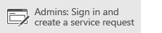

# <a name="prevent-email-from-being-marked-as-spam-in-office-365-and-exchange-online-protection"></a><span data-ttu-id="76f78-104">Impedir que o email que está sendo marcada como spam no Office 365 e o Exchange Online Protection</span><span class="sxs-lookup"><span data-stu-id="76f78-104">Prevent email from being marked as spam in Office 365 and Exchange Online Protection</span></span>

<span data-ttu-id="76f78-105">Os administradores do Exchange Online ou Exchange Online Protection (EOP) com as credenciais de acesso apropriado podem usar estas etapas para ajudar a garantir que uma mensagem de email em viagem através do serviço não está marcada como spam.</span><span class="sxs-lookup"><span data-stu-id="76f78-105">Exchange Online or Exchange Online Protection (EOP) administrators with the appropriate access credentials can use these steps to help ensure that an email message traveling through the service isn't marked as spam.</span></span>
  
<span data-ttu-id="76f78-p102">Pode ser frustrante ter email legítimo, boa em quarentena ou bloqueada como spam e inicial em uma pasta de quarentena. Você pode usar uma lista de remetentes confiáveis ou uma regra de fluxo de email a fim de ignorar a filtragem de spam e impedir que mensagens de email boa obtendo marcadas como lixo eletrônico. Quando uma mensagem é marcada incorretamente como spam pelo filtro de spam, ele se chama um falso positivo. O filtro de spam do Office 365 também fornece algumas opções que os usuários finais podem personalizar a fim de ajudar a evitar falsos positivos.</span><span class="sxs-lookup"><span data-stu-id="76f78-p102">It can be frustrating to have legitimate, good email quarantined or blocked as spam and landing in a quarantine folder. You can use a safe sender list or a mail flow rule to bypass spam filtering and prevent good email messages from getting marked as junk mail. When a message is incorrectly marked as spam by the spam filter, it's called a false positive. The Office 365 spam filter also provides some options that end users can customize in order to help prevent false positives.</span></span>
  
<span data-ttu-id="76f78-110">Se você está procurando ajuda com mensagens de falsa negativa, ou seja, uma mensagem de spam que obterá quando ele não deve, confira as dicas em [email de bloqueio de spam com o filtro de spam do Office 365 para evitar problemas de negativos falsos](block-email-spam-to-prevent-false-negatives.md).</span><span class="sxs-lookup"><span data-stu-id="76f78-110">If you're looking for help with false negative mail, that is, a spam message that gets through when it shouldn't, check out the tips in [Block email spam with the Office 365 spam filter to prevent false negative issues](block-email-spam-to-prevent-false-negatives.md).</span></span>
  
## <a name="eop-only-customers-use-directory-synchronization"></a><span data-ttu-id="76f78-111">Os clientes somente EOP: usar sincronização de diretórios</span><span class="sxs-lookup"><span data-stu-id="76f78-111">EOP-only customers: use directory synchronization</span></span>

<span data-ttu-id="76f78-p103">EOP é um serviço que ajuda a proteger sua organização contra spam e malware de filtragem de email baseada em nuvem. Se você tiver caixas de correio no Office 365, eles são protegidos automaticamente pelo EOP pois ele é parte do serviço.</span><span class="sxs-lookup"><span data-stu-id="76f78-p103">EOP is a cloud-based email filtering service that helps protect your organization against spam and malware. If you have mailboxes in Office 365, they are automatically protected by EOP since it is part of the service.</span></span> 
  
<span data-ttu-id="76f78-p104">Se você é um cliente somente EOP, ou seja, você assina o serviço EOP para uso com o seu servidor do Exchange local, você deve sincronizar com o serviço de configurações do usuário usando a sincronização de diretório. Isso garante que seus remetentes listas são respeitadas pelo EOP. Para obter mais informações, consulte "Usar a sincronização de diretórios para gerenciar usuários de email" no [Manage Mail Users in EOP](https://go.microsoft.com/fwlink/?LinkId=534098).</span><span class="sxs-lookup"><span data-stu-id="76f78-p104">If you're an EOP-only customer, that is, you subscribe to the EOP service for use with your on-premises Exchange Server, you should sync user settings with the service by using directory synchronization. Doing this ensures that your safe senders lists are respected by EOP. For more information, see "Use directory synchronization to manage mail users" in [Manage Mail Users in EOP](https://go.microsoft.com/fwlink/?LinkId=534098).</span></span>
  
## <a name="prevent-false-positive-email-by-using-the-connection-filters-ip-allow-list"></a><span data-ttu-id="76f78-117">Impedir que o email positivo falso usando a conexão lista de permissões de IP do filtro</span><span class="sxs-lookup"><span data-stu-id="76f78-117">Prevent false positive email by using the connection filter's IP allow list</span></span>

<span data-ttu-id="76f78-p105">Se você achar que o email de um remetente sempre é movido para as pastas lixo em sua organização, você pode adicionar o endereço IP do remetente do email como IP do seu filtro de conexão lista de permissões. Normalmente, isso impede que false respostas positivas deste remetente para todos os destinatários dentro da sua organização. A exceção ocorre quando um usuário habilita a opção "seguros lista apenas: somente os emails de pessoas ou domínios na sua lista de remetentes confiáveis ou lista de destinatários confiáveis serão entregues na caixa de entrada" no Outlook e não adicionar remetente à lista de remetentes confiáveis. Para obter informações sobre como substituir essa opção, consulte [solução de problemas: uma mensagem termina na pasta Lixo eletrônico, embora EOP tiver marcado a mensagem como não spam](prevent-email-from-being-marked-as-spam-0.md#TroubleshootingJunkEOPNonSpam).</span><span class="sxs-lookup"><span data-stu-id="76f78-p105">If you find that a sender's email is always moved to the Junk folders in your organization, you can add the email sender's IP address to your connection filter's IP allow list. Normally, this prevents false positive responses for this sender for all recipients within your organization. The exception is when a user enables the option "Safe Lists Only: Only mail from people or domains on your Safe Senders list or Safe Recipients List will be delivered to your Inbox" in Outlook and does not add that sender to the Safe Sender List. For information on overriding that option, see [Troubleshooting: A message ends up in the Junk folder even though EOP marked the message as non-spam](prevent-email-from-being-marked-as-spam-0.md#TroubleshootingJunkEOPNonSpam).</span></span>
  
 <span data-ttu-id="76f78-122">**Para adicionar um endereço IP à sua conexão lista de permissões de IP do filtro**</span><span class="sxs-lookup"><span data-stu-id="76f78-122">**To add an IP address to your connection filter's IP allow list**</span></span>
  
1. <span data-ttu-id="76f78-p106">Obter o cabeçalho da mensagem enviada pelo remetente que você deseja permitir. Você pode fazer isso do seu cliente de email, como o Outlook ou o Outlook na Web, conforme descrito no [Analisador de cabeçalho de mensagem](https://go.microsoft.com/fwlink/p/?LinkId=306583).</span><span class="sxs-lookup"><span data-stu-id="76f78-p106">Obtain the header from a message sent by the sender that you want to allow. You can do this from your mail client such as Outlook or Outlook on the Web, as described in [Message Header Analyzer](https://go.microsoft.com/fwlink/p/?LinkId=306583).</span></span>
    
2. <span data-ttu-id="76f78-125">Procure manualmente o endereço IP após a marca CIP no cabeçalho X-Forefront-Antispam-Report ou usando a guia do **Analisador de mensagem** do [Remote Connectivity Analyzer](https://testconnectivity.microsoft.com/?tabid=mha).</span><span class="sxs-lookup"><span data-stu-id="76f78-125">Manually search for the IP address following the CIP tag in the X-Forefront-Antispam-Report header or by using the **Message Analyzer** tab of the [Remote Connectivity Analyzer](https://testconnectivity.microsoft.com/?tabid=mha).</span></span>
    
3. <span data-ttu-id="76f78-126">Adicione o IP endereço como o IP lista de permissões, seguindo as etapas descritas em "Usar o EAC para editar a política de filtro de conexão padrão" em [Configure a política de filtro de conexão](https://go.microsoft.com/fwlink/?LinkId=534132).</span><span class="sxs-lookup"><span data-stu-id="76f78-126">Add the IP address to the IP allow list by following the steps in "Use the EAC to edit the default connection filter policy" in [Configure the connection filter policy](https://go.microsoft.com/fwlink/?LinkId=534132).</span></span>
    
## <a name="prevent-false-positive-email-by-configuring-spam-filter-policies"></a><span data-ttu-id="76f78-127">Impedir que o email positivo falso, definindo políticas de filtro de spam</span><span class="sxs-lookup"><span data-stu-id="76f78-127">Prevent false positive email by configuring spam filter policies</span></span>

<span data-ttu-id="76f78-128">Você pode adicionar domínios ou endereços de email individuais a uma lista Permitir seguindo as etapas em [configurar suas políticas de filtro de spam](https://go.microsoft.com/fwlink/?LinkID=534136).</span><span class="sxs-lookup"><span data-stu-id="76f78-128">You can add domains or individual email addresses to an allow list by following the steps in [Configure your spam filter policies](https://go.microsoft.com/fwlink/?LinkID=534136).</span></span>
  
## <a name="review-your-advanced-spam-filter-policies"></a><span data-ttu-id="76f78-129">Revise suas políticas de filtro de spam avançadas</span><span class="sxs-lookup"><span data-stu-id="76f78-129">Review your advanced spam filter policies</span></span>

<span data-ttu-id="76f78-p107">Se você tiver restrição especial configurada em uma política de filtro de spam, por exemplo, se tiver bloqueado todo um domínio, você deve examiná-los para verificar se pode estar causando falsos positivos. Consulte [configurar suas políticas de filtro de spam](https://go.microsoft.com/fwlink/?LinkId=534136)e desativar adicional [Opções de filtragem de spam avançada](https://go.microsoft.com/fwlink/?LinkId=534137) que podem causar mensagens sejam marcadas como spam.</span><span class="sxs-lookup"><span data-stu-id="76f78-p107">If you have special restrictions set up in a spam filter policy, for example, if you have blocked an entire domain, you should review them to check if they may be causing false positives. See [Configure your spam filter policies](https://go.microsoft.com/fwlink/?LinkId=534136), and turn off additional [Advanced spam filtering options](https://go.microsoft.com/fwlink/?LinkId=534137) that might cause messages to be marked as spam.</span></span> 
  
## <a name="help-your-end-users-create-a-safe-sender-list-to-prevent-good-email-from-being-marked-as-spam"></a><span data-ttu-id="76f78-132">Ajudar seus usuários finais a criar uma lista de remetentes seguros para impedir que o e-mail bom sendo marcada como spam</span><span class="sxs-lookup"><span data-stu-id="76f78-132">Help your end users create a safe sender list to prevent good email from being marked as spam</span></span>
<span data-ttu-id="76f78-133"><a name="BKMK_email-user-help-safelist"> </a></span><span class="sxs-lookup"><span data-stu-id="76f78-133"></span></span>

<span data-ttu-id="76f78-p108">Avise os usuários para adicionar os endereços dos remetentes que eles confiam à sua lista de remetentes confiáveis do [Outlook](https://go.microsoft.com/fwlink/p/?LinkId=270065) ou do [Outlook na Web](https://go.microsoft.com/fwlink/p/?LinkId=294862). Para começar a no Outlook na Web, escolha **configurações** \> **Opções** \> **Bloquear ou permitir**. O diagrama a seguir mostra um exemplo de adicionar algo a uma lista de remetentes seguros.</span><span class="sxs-lookup"><span data-stu-id="76f78-p108">Tell your users to add addresses from senders that they trust to their safe sender list in [Outlook](https://go.microsoft.com/fwlink/p/?LinkId=270065) or [Outlook on the Web](https://go.microsoft.com/fwlink/p/?LinkId=294862). To get started in Outlook on the Web, choose **Settings** \> **Options** \> **Block or allow**. The following diagram shows an example of adding something to a safe sender list.</span></span>
  

  
<span data-ttu-id="76f78-p109">Aceita a EOP remetentes confiáveis dos usuários e destinatários, mas não os domínios confiáveis. Isso ocorre mesmo se o domínio é adicionado por meio do Outlook na Web ou adicionado no Outlook e sincronizados usando a sincronização de diretório.</span><span class="sxs-lookup"><span data-stu-id="76f78-p109">EOP will honor your users' Safe Senders and Recipients, but not Safe Domains. This is true regardless of whether the domain is added through the Outlook on the Web, or added in Outlook and synchronized using Directory Sync.</span></span>
  
## <a name="troubleshooting-a-message-ends-up-in-the-junk-folder-even-though-eop-marked-the-message-as-non-spam"></a><span data-ttu-id="76f78-140">Solução de problemas: Uma mensagem acaba na pasta Lixo eletrônico, embora EOP tiver marcado a mensagem como não spam</span><span class="sxs-lookup"><span data-stu-id="76f78-140">Troubleshooting: A message ends up in the Junk folder even though EOP marked the message as non-spam</span></span>
<span data-ttu-id="76f78-141"><a name="TroubleshootingJunkEOPNonSpam"> </a></span><span class="sxs-lookup"><span data-stu-id="76f78-141"></span></span>

<span data-ttu-id="76f78-p110">Se seus usuários terão a opção no Outlook habilitado para "Safe lista apenas: somente emails de pessoas ou domínios na sua lista de remetentes confiáveis ou lista de destinatários confiáveis serão entregues na caixa de entrada", e em seguida, todos os emails irão para a pasta Lixo eletrônico para que um remetente, a menos que o remetente está no reci lista de remetentes confiáveis do pient. Isso acontecerá independentemente de se EOP marca uma mensagem como não spam ou se você tiver configurado a uma regra no EOP para marcar uma mensagem como não spam.</span><span class="sxs-lookup"><span data-stu-id="76f78-p110">If your users have the option in Outlook enabled for "Safe Lists Only: Only mail from people or domains on your Safe Senders list or Safe Recipients List will be delivered to your Inbox", then all email will go to the junk folder for a sender unless the sender is on the recipient's Safe Sender list. This will happen regardless of whether EOP marks a message as non-spam, or if you have set up a rule in EOP to mark a message as non-spam.</span></span>
  
<span data-ttu-id="76f78-144">Você pode desabilitar a opção apenas listas de confiança para os usuários do Outlook seguindo as instruções em [Outlook: configuração de diretiva para desabilitar a interface do usuário do lixo eletrônico e o mecanismo de filtragem](https://support.microsoft.com/en-us/kb/2180568).</span><span class="sxs-lookup"><span data-stu-id="76f78-144">You can disable the Safe Lists Only option for your Outlook users by following the instructions in [Outlook: Policy setting to disable the Junk E-mail UI and filtering mechanism](https://support.microsoft.com/en-us/kb/2180568).</span></span>
  
<span data-ttu-id="76f78-145">Se você visualizar a mensagem no Outlook na Web, haverá uma dica safety amarelo que indica que a mensagem está na pasta Lixo eletrônico, porque o remetente não estiver na lista de remetentes confiáveis do destinatário.</span><span class="sxs-lookup"><span data-stu-id="76f78-145">If you view the message in Outlook on the Web, there will be a yellow safety tip that indicates that the message is in the Junk folder because the sender is not on the recipient's Safe Senders list.</span></span>
  
<span data-ttu-id="76f78-p111">Se você observar o cabeçalho de uma mensagem, ela pode incluir o carimbo sfv: skn (permissões de IP ou permitir ETR) ou SFV:NSPM (não-spam), mas a mensagem ainda for colocada na pasta de lixo eletrônico do usuário. Não há nada no cabeçalho da mensagem que indica que o usuário tem "Apenas listas de confiança" habilitado. Isso acontece porque a opção "Apenas listas de confiança" definida pelos usuários no Outlook substitui a configuração do EOP.</span><span class="sxs-lookup"><span data-stu-id="76f78-p111">If you look at the header of a message, it may include the stamp SFV:SKN (IP Allow or ETR Allow) or SFV:NSPM (non-spam), but the message is still placed in the user's junk folder. There is nothing in the message header that indicates that the user has "Safe Lists Only" enabled. This happens because the "Safe Lists Only" option set by users in Outlook overrides the EOP setting.</span></span> 
  
 <span data-ttu-id="76f78-149">**Para verificar por que uma mensagem de um remetente seguro será marcada como não spam no cabeçalho da mensagem, mas ainda extremidades na pasta de lixo eletrônico do usuário**</span><span class="sxs-lookup"><span data-stu-id="76f78-149">**To verify why a message from a safe sender is marked as non-spam in the message header, but still ends up in the user's Junk folder**</span></span>
  
1. <span data-ttu-id="76f78-150">Para saber como se conectar ao Exchange Online PowerShell, consulte [Connect to Exchange Online PowerShell](https://go.microsoft.com/fwlink/p/?LinkId=396554).</span><span class="sxs-lookup"><span data-stu-id="76f78-150">To learn how to connect to Exchange Online PowerShell, see [Connect to Exchange Online PowerShell](https://go.microsoft.com/fwlink/p/?LinkId=396554).</span></span> 
    
2. <span data-ttu-id="76f78-151">Execute o seguinte comando para exibir as definições de configuração de lixo eletrônico do usuário:</span><span class="sxs-lookup"><span data-stu-id="76f78-151">Run the following command to view the user's junk email configuration settings:</span></span>
    
  ```
  Get-MailboxJunkEmailConfiguration example@contoso.com | fl TrustedListsOnly,ContactsTrusted,TrustedSendersAndDomains
  ```

    <span data-ttu-id="76f78-p112">Se TrustedListsOnly for definido como True, isso significa que essa configuração estiver habilitada. Se ContactsTrusted for definido como True, significa que o usuário confia contatos e remetentes confiáveis. O TrustedSendersAndDomains lista o conteúdo da lista de remetentes confiáveis do usuário.</span><span class="sxs-lookup"><span data-stu-id="76f78-p112">If TrustedListsOnly is set to True, it means that this setting is enabled. If ContactsTrusted is set to True, it means that the user trusts both Contacts and Safe Senders. The TrustedSendersAndDomains lists the contents of the user's Safe Senders list.</span></span>
    
## <a name="still-need-help"></a><span data-ttu-id="76f78-155">Precisa de mais ajuda?</span><span class="sxs-lookup"><span data-stu-id="76f78-155">Still need help?</span></span>
<span data-ttu-id="76f78-156"><a name="TroubleshootingJunkEOPNonSpam"> </a></span><span class="sxs-lookup"><span data-stu-id="76f78-156"></span></span>

<span data-ttu-id="76f78-157">[](https://go.microsoft.com/fwlink/p/?LinkId=518605)</span><span class="sxs-lookup"><span data-stu-id="76f78-157">[](https://go.microsoft.com/fwlink/p/?LinkId=518605)</span></span>
  
<span data-ttu-id="76f78-158">[]( https://go.microsoft.com/fwlink/p/?LinkId=519124)</span><span class="sxs-lookup"><span data-stu-id="76f78-158">[]( https://go.microsoft.com/fwlink/p/?LinkId=519124)</span></span>
  
<span data-ttu-id="76f78-159">[](https://go.microsoft.com/fwlink/p/?LinkID=518322)</span><span class="sxs-lookup"><span data-stu-id="76f78-159">[](https://go.microsoft.com/fwlink/p/?LinkID=518322)</span></span>
  
## <a name="see-also"></a><span data-ttu-id="76f78-160">Confira também</span><span class="sxs-lookup"><span data-stu-id="76f78-160">See also</span></span>
<span data-ttu-id="76f78-161"><a name="TroubleshootingJunkEOPNonSpam"> </a></span><span class="sxs-lookup"><span data-stu-id="76f78-161"></span></span>

[<span data-ttu-id="76f78-162">Visão geral do filtro de lixo eletrônico</span><span class="sxs-lookup"><span data-stu-id="76f78-162">Overview of the Junk Email Filter</span></span>](https://support.office.com/article/5AE3EA8E-CF41-4FA0-B02A-3B96E21DE089)
  
[<span data-ttu-id="76f78-163">Bloquear ou permitir (configurações de lixo eletrônico)</span><span class="sxs-lookup"><span data-stu-id="76f78-163">Block or allow (junk email settings)</span></span>](https://support.office.com/article/48c9f6f7-2309-4f95-9a4d-de987e880e46)
  
[<span data-ttu-id="76f78-164">Bloquear spam de email com o filtro de spam do Office 365 para evitar problemas de falsos negativos</span><span class="sxs-lookup"><span data-stu-id="76f78-164">Block email spam with the Office 365 spam filter to prevent false negative issues</span></span>](block-email-spam-to-prevent-false-negatives.md)

