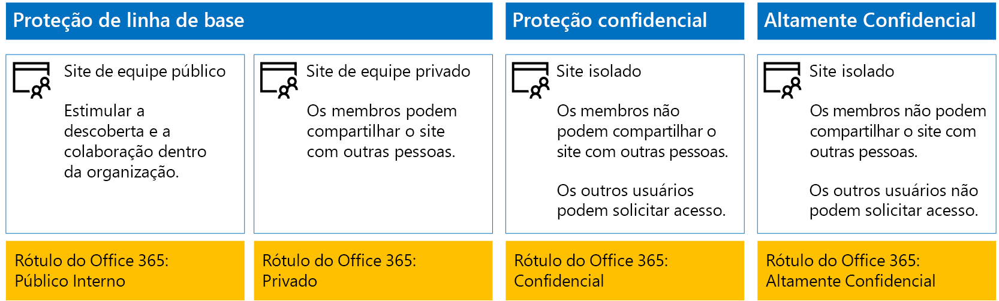
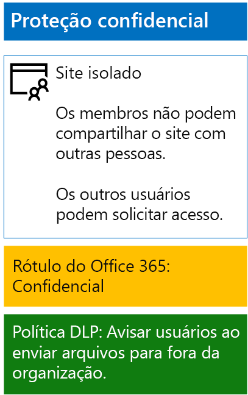
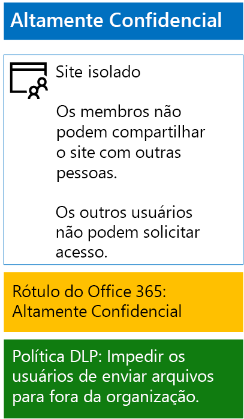

# Proteja arquivos do SharePoint Online com DLP e rótulos de retenção

 **Resumo:** Aplique rótulos de retenção e políticas de DLP (prevenção de perda de dados) aos sites de equipe do SharePoint Online com vários níveis de proteção de informações.
  
Use as etapas neste artigo para projetar e implantar rótulos de retenção e políticas de DLP (prevenção de perda de dados) para sites de equipe do SharePoint Online de linha de base, confidenciais e altamente confidenciais. Para obter mais informações sobre essas três camadas de proteção, consulte [Proteção de arquivos e sites do SharePoint Online](secure-sharepoint-online-sites-and-files.md).
  
## Como isso funciona
1. Crie e publique as etiquetas de retenção desejadas. Pode levar até 12 horas para que elas sejam publicadas.
2. Para os sites do SharePoint desejados, edite as configurações de biblioteca de documentos para aplicar os rótulos de retenção desejados a itens na biblioteca.
3. Crie políticas DLP para executar ações com base nos rótulos de retenção.

Quando os usuários adicionarem um documento à biblioteca, este receberá por padrão o rótulo de retenção atribuído. Os usuários podem alterar o rótulo, se necessário. Quando um usuário compartilha um documento para fora da organização, a DLP verificará se há um rótulo atribuído e agirá se houver uma política DLP que corresponda ao rótulo. A DLP também procurará outras políticas que correspondam, como proteger arquivos com números de cartão de crédito, caso este tipo de política estiver configurado. 

## Rótulos de retenção para seus sites do SharePoint Online

Há três etapas para criar e atribuir rótulos de retenção a sites de equipe do SharePoint Online.
  
### Etapa 1: Determinar os nomes dos rótulos de retenção

Nesta fase, você determina os nomes dos rótulos de retenção para os quatro níveis de proteção de informações aplicados a sites de equipe do SharePoint Online. A tabela a seguir lista os nomes recomendados para cada nível.
  
|**Nível de proteção do site de equipe do SharePoint Online**|**Nome do rótulo**|
|:-----|:-----|
|Linha de base público    |Público interno    |
|Linha de base privado    |Private    |
|Confidencial    |Confidencial    |
|Altamente Confidencial    |Altamente confidencial    |
   
### Fase 2: Criar as etiquetas de retenção

Nesta fase, você cria e publica seus rótulos determinados para os diferentes níveis de proteção de informações.
  
1. Entre no [portal de segurança do Microsoft 365](https://security.microsoft.com) com uma conta que tenha a função de Administrador de Segurança ou Administrador da Empresa.
    
2. Na guia **Início – Segurança do Microsoft 365** do navegador, clique em **Classificações > Rótulos**.
    
3. Clique em **Rótulos de retenção > Criar um rótulo**.
    
4. No painel **Atribuir nome ao seu rótulo**, digite o nome do rótulo e uma descrição para administradores e usuários e, em seguida, clique em **Avançar**.

5. No painel **Descritores do planejamento de arquivo**, preencha conforme necessário e clique em **Avançar**.
    
6. No painel **Configurações de rótulo**, se necessário, defina **Retenção** como **Ligado** e faça as configurações de retenção. Clique em **Avançar**.
    
7. No painel **Revise suas configurações**, clique em **Criar o rótulo**.
    
8. Para seus rótulos adicionais, clique em **Criar um rótulo**, e, em seguida, repita as etapas 4 a 7.
    

### Publique seus novos rótulos

Em seguida, use estas etapas para publicar os novos rótulos de retenção.
  
1. No painel **Rótulos**, clique na guia **Rótulos de retenção** e, em seguida, clique em **Publicar rótulos**.
    
2. No painel **Escolher rótulos para publicar**, clique em **Escolher rótulos para publicar**.
    
3. No painel **Escolher rótulos**, clique em **Adicionar**, selecione todos os quatro rótulos, clique em **Adicionar**.
    
4. Clique em **Concluído**.
    
5. No painel **Escolher rótulos para publicar**, clique em **Avançar**.
    
6. No painel **Escolher locais**, clique em **Avançar**.
    
7. No painel **Atribuir um nome à política**, digite um nome para o conjunto de rótulos em **Nome** e clique em **Avançar**.
    
8. No painel **Examine as configurações**, clique em **Publicar rótulos** e clique em **Fechar**.

    
### Etapa 3: Aplicar os rótulos de retenção aos seus sites do SharePoint Online

Use estas etapas para aplicar os rótulos de retenção às pastas de documentos de seus sites de equipe do SharePoint Online.
  
1. Acesse o [portal do Office 365](https://www.office.com), clique no aplicativo **SharePoint**.
    
2. Na nova guia **SharePoint** no seu navegador, clique em um site que precise de um rótulo de retenção atribuído.
    
3. Na nova guia de site do SharePoint do navegador, clique em **Documentos**.
    
4. Clique no ícone de configurações e clique em **Configurações de biblioteca**.
    
5. Em **Permissões e Gerenciamento**, clique em **Aplicar o rótulo aos itens nessa biblioteca**.
    
6. Em **Configurações – Aplicar Rótulo**, selecione o rótulo de retenção adequado e clique em **Salvar**.
    
7. Feche a guia para o site do SharePoint Online.
    
8. Repita as etapas 2 a 8 acima para atribuir rótulos de retenção aos seus sites adicionais do SharePoint Online.
    
Esta é a configuração resultante.
  

  
## Políticas DLP para seus sites do SharePoint Online

Use estas etapas para configurar uma política DLP que notifica os usuários quando eles compartilham um documento em um site de equipe confidencial do SharePoint Online fora da organização.

1. Entre no [portal de conformidade do Microsoft 365](https://compliance.microsoft.com/) com uma conta que tenha a função de Administrador de Segurança ou Administrador da Empresa.
    
2. Na nova guia **conformidade do Microsoft 365** em seu navegador, clique em**Políticas > Prevenção de perda de dados**.
    
3. No painel **Início > Prevenção de perda de dados**, clique em **Criar uma política**.
    
4. No painel **Iniciar com um modelo ou criar uma política personalizada**, clique em **Personalizado** e, em seguida, clique em **Avançar**.
    
5. No painel **Atribuir um nome à política**, digite o nome da política DLP de nível confidencial em **Nome** e clique em **Avançar**.
    
6. No painel **Escolher locais**, clique em **Deixe-me escolher locais específicos** e, em seguida, clique em **Avançar**.
    
7. Na lista de locais, desabilite os locais **email do Exchange**, **contas do OneDrive** e **Mensagens do canal e do chat do Teams** e, em seguida, clique em **Avançar**.
    
8. No painel **Personalizar o tipo de conteúdo que você deseja proteger**, clique em **Editar**.
    
9. No painel **Escolher os tipos de conteúdo para proteger**, clique em **Adicionar** na caixa suspensa e, em seguida, clique em **Rótulos de retenção**.
    
10. No painel **Rótulos de retenção**, clique em ** Adicionar**, selecione o rótulo **Confidencial**, clique em **Adicionar** e, em seguida, clique em **Concluído**.
    
11. No painel **Escolher os tipos de conteúdo para proteger**, clique em **Salvar**.
    
12. No painel **personalizar um tipo de conteúdo que deseja proteger**, clique em **próxima**.

13. No painel **O que deseja fazer se detectarmos informações confidenciais?**, clique em **Personalizar a dica e o email**.
    
14. No painel **Personalizar dicas de política e notificações de email**, clique em **Personalizar o texto da dica da política**.
    
15. Na caixa de texto, digite ou cole uma das dicas a seguir, dependendo de se você implementou a Proteção de Informações do Azure para proteger arquivos altamente confidenciais:
    
  - Para compartilhar com um usuário de fora da organização, baixe o arquivo e abra-o. Clique em Arquivo, em seguida, Proteger Documento e Criptografar com Senha e especifique uma senha forte. Envie a senha em um email separado ou outros meios de comunicação.
  - Arquivos altamente confidenciais são protegidos com criptografia. Somente usuários externos que recebam permissões do seu departamento de TI para esses arquivos poderão lê-los.
    
    Como alternativa, digite ou cole em sua própria dica de política que instrui os usuários sobre como compartilhar um arquivo fora da organização.
    
16. Clique em **OK**.
    
17. No painel **O que deseja fazer se detectarmos informações confidenciais?**, clique em **Avançar**.
    
18. No painel **Deseja ativar a política ou testar primeiro?**, clique em **Sim** para ativá-la imediatamente e clique em **Avançar**.
    
19. No painel **Examine as configurações**, clique em **Criar** e em **Fechar**.
    
Aqui está a configuração resultante dos sites confidenciais da equipe do SharePoint Online.
  

  
Em seguida, use estas etapas para configurar uma política DLP que bloqueia os usuários quando eles compartilham um documento em um site de equipe altamente confidencial do SharePoint Online fora da organização.
  
1. Na nova guia **conformidade do Microsoft 365** em seu navegador, clique em**Políticas > Prevenção de perda de dados**.
    
2. No painel **Prevenção de perda de dados**, clique em **Criar uma política**.
    
3. No painel **Iniciar com um modelo ou criar uma política personalizada**, clique em **Personalizado** e clique em **Avançar**.
    
4. No painel **Atribuir um nome à política**, digite o nome da política DLP de nível altamente confidencial em **Nome** e clique em **Avançar**.
    
5. No painel **Escolher locais**, clique em **Deixe-me escolher locais específicos** e, em seguida, clique em **Avançar**.
    
6. Na lista de locais, desabilite os locais **email do Exchange**, **contas do OneDrive** e **Mensagens do canal e do chat do Teams** e, em seguida, clique em **Avançar**.
    
7. No painel **Personalizar os tipos de informações confidenciais que deseja proteger**, clique em **Editar**.
    
8. No painel **Escolher os tipos de conteúdo para proteger**, clique em **Adicionar** na caixa suspensa e, em seguida, clique em **Rótulos de retenção**.
    
9. No painel **Rótulos de retenção**, clique em **Adicionar**, selecione o rótulo **Altamente Confidencial**, clique em **Adicionar** e, em seguida, clique em **Concluído**.
    
10. No painel **Escolher os tipos de conteúdo para proteger**, clique em **Salvar**.
    
12. No painel **Personalizar os tipos de informações confidenciais que deseja proteger** e clique em **Avançar**.
    
13. No painel **O que deseja fazer se detectarmos informações confidenciais?**, clique em **Personalizar a dica e o email**.
    
14. No painel **Personalizar dicas de política e notificações de email**, clique em **Personalizar o texto da dica da política**.
    
15. Na caixa de texto, digite ou cole o seguinte:
    
  - Para compartilhar com um usuário de fora da organização, baixe o arquivo e abra-o. Clique em Arquivo, em seguida, Proteger Documento e Criptografar com Senha e especifique uma senha forte. Envie a senha em um email separado ou outros meios de comunicação.
    
    Como alternativa, digite ou cole em sua própria dica de política que instrui os usuários sobre como compartilhar um arquivo fora da organização.
    
16. Clique em **OK**.
    
17. No painel **O que deseja fazer se detectarmos informações confidenciais?**, clique em **Avançar**.
    
18. No painel **Deseja ativar a política ou testar primeiro?**, clique em **Sim** para ativá-la imediatamente e clique em **Avançar**.
    
19. No painel **Examine as configurações**, clique em **Criar** e em **Fechar**.
    
Aqui está a configuração resultante para sites de equipe do SharePoint Online de alta confidencialidade.
  

  
## Próxima etapa

[Proteger arquivos do SharePoint Online com a Proteção de Informações do Azure](protect-sharepoint-online-files-with-azure-information-protection.md)
    
## Confira também

[Proteger arquivos e sites do SharePoint Online](secure-sharepoint-online-sites-and-files.md)
  
[Diretrizes de segurança da Microsoft para campanhas políticas, instituições sem fins lucrativos e outras organizações do Agile](microsoft-security-guidance-for-political-campaigns-nonprofits-and-other-agile-o.md)
  
[Adoção da nuvem e de soluções híbridas](https://docs.microsoft.com/office365/enterprise/cloud-adoption-and-hybrid-solutions)

