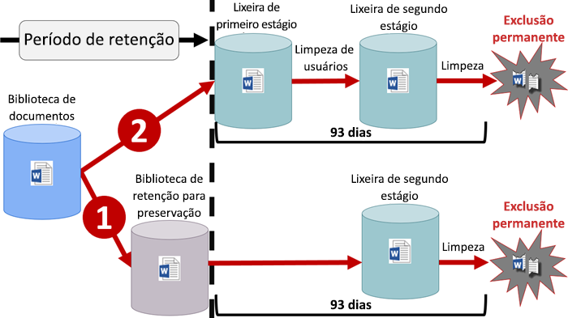

# Visão geral de políticas de retençãoOverview of retention policies

Para a maioria das organizações, o volume e a complexidade dos dados aumentam diariamente, como emails, documentos, mensagens instantâneas e muito mais. O gerenciamento ou controle efetivo dessas informações é importante porque você precisa:For most organizations, the volume and complexity of their data is increasing daily - email, documents, instant messages, and more. Effectively managing or governing this information is important because you need to:
  
- **Estar em conformidade de forma proativa com as regulamentações do setor e as políticas internas** que exigem a retenção do conteúdo por um período mínimo de tempo, por exemplo, a lei Sarbanes-Oxley, pode exigir que você guarde determinados tipos de conteúdo por sete anos.**Comply proactively with industry regulations and internal policies** that require you to retain content for a minimum period of time - for example, the Sarbanes-Oxley Act might require you to retain certain types of content for seven years. 
    
- **Reduzir seu risco em caso de litígio ou violação de segurança** excluindo definitivamente o conteúdo antigo que você não tem mais obrigação de guardar.**Reduce your risk in the event of litigation or a security breach** by permanently deleting old content that you're no longer required to keep. 
    
- **Ajudar a sua organização a compartilhar conhecimento de maneira eficaz e ser mais ágil** garantindo que seus usuários trabalhem apenas com conteúdo atual e relevante para eles.**Help your organization to share knowledge effectively and be more agile** by ensuring that your users work only with content that's current and relevant to them. 
    
Uma política de retenção pode ajudá-lo a atingir todos esses objetivos. O gerenciamento de conteúdo normalmente requer duas ações:A retention policy can help you achieve all of these goals. Managing content commonly requires two actions:
  
- **Reter** conteúdo para que ele não seja excluído permanentemente antes do fim do período de retenção.**Retaining** content so that it can't be permanently deleted before the end of the retention period. 
    
- **Excluir** conteúdo permanentemente no final do período de retenção.**Deleting** content permanently at the end of the retention period. 
    
Com uma política de retenção, você pode:With a retention policy, you can:
  
- Decidir proativamente se deseja reter o conteúdo, excluí-lo ou ambos, reter e depois excluir o conteúdo.Decide proactively whether to retain content, delete content, or both - retain and then delete the content.
    
- Aplicar uma única política para a organização inteira ou apenas locais ou usuários específicos.Apply a single policy to the entire organization or just specific locations or users.
    
- Aplicar uma política a todo o conteúdo ou apenas ao conteúdo que corresponder a determinadas condições, por exemplo, como palavras-chave específicas ou [tipos específicos de informações confidenciais](what-the-sensitive-information-types-look-for.md).Apply a policy to all content or just content meeting certain conditions, such as content containing specific keywords or [specific types of sensitive information](what-the-sensitive-information-types-look-for.md).
    
Quando o conteúdo está sujeito a uma política de retenção, as pessoas podem continuar editando e trabalhando com o conteúdo como de costume, pois o conteúdo é retido no local, em seu local original. Mas se alguém edita ou exclui um conteúdo sujeito à política, uma cópia é salva em um local seguro, no qual será retido enquanto a política estiver em vigor.When content is subject to a retention policy, people can continue to edit and work with the content as if nothing's changed because the content is retained in place, in its original location. But if someone edits or deletes content that's subject to the policy, a copy is saved to a secure location where it's retained while the policy is in effect.
  
Por fim, algumas organizações talvez precisem cumprir regulamentações, como a Regra 17a-4 do Securities and Exchange Commission (SEC), que exige que após uma política de retenção ser ativada, ela não pode ser desativada ou se tornar menos restritiva. Para atender a esse requisito, você pode usar o Bloqueio de Preservação. Após uma política ser bloqueada, ninguém, nem mesmo o administrador, poderá desativar a política ou torná-la menos restritiva.Finally, some organizations might need to comply with regulations such as Securities and Exchange Commission (SEC) Rule 17a-4, which requires that after a retention policy is turned on, it cannot be turned off or made less restrictive. To meet this requirement, you can use Preservation Lock. After a policy's been locked, no one—including the administrator—can turn off the policy or make it less restrictive.
  
Você cria e gerencia políticas de retenção na:You create and manage retention policies on the:

- Página **Políticas** no centro de conformidade do Microsoft 365.**Policies** page in the Microsoft 365 compliance center.
- Página **Retenção** sob **Governança de dados** no Centro de Conformidade &amp;e Segurança do Office 365.**Retention** page under **Data governance** in the Office 365 Security &amp; Compliance Center.
  
## Como funciona uma política de retenção com conteúdo in-locoHow a retention policy works with content in place

Quando você incluir um local como um site ou caixa de correio em uma política de retenção, o conteúdo permanecerá no local original. As pessoas podem continuar a trabalhar com seus documentos ou emails como se nada tivesse mudado. Mas, se elas editarem ou excluírem o conteúdo incluído na política, será mantida uma cópia do conteúdo conforme existia antes da aplicação da política.When you include a location such as a site or mailbox in a retention policy, the content remains in its original location. People can continue to work with their documents or mail as if nothing's changed. But if they edit or delete content that's included in the policy, a copy of the content as it existed when you applied the policy is retained.
  
Para conjuntos de sites do SharePoint, uma cópia do conteúdo original é guardada na biblioteca de retenção para preservação quando os usuários o editam ou o excluem. No caso de emails e pastas públicas, a cópia é mantida na pasta Itens Recuperáveis. Esses locais seguros e o conteúdo retido não ficam visíveis para a maioria das pessoas. Com uma política de retenção, as pessoas nem mesmo precisam saber que o conteúdo está sujeito a uma política.For Sharepoint site collections, a copy of the original content is retained in the Preservation Hold library when users edit or delete it; for email and public folders, the copy is retained in the Recoverable Items folder. These secure locations and the retained content are not visible to most people. With a retention policy, people do not even need to know that their content is subject to the policy.
  
Observações:Notes:
  
- O conteúdo do Skype é armazenado no Exchange, onde a aplicação da política é baseada no tipo de mensagem (email ou conversa).Skype content is stored in Exchange, where the policy is applied based on message type (email or conversation).
    
- Uma política de retenção aplicada a um grupo do Office 365 inclui a caixa de correio do grupo e um site.A retention policy applied to an Office 365 group includes both the group mailbox and site.
    
### Conteúdo em contas do OneDrive e dos sites do SharePointContent in OneDrive accounts and SharePoint sites

Uma política de retenção é aplicada no nível de um conjunto de sites. Quando você inclui um conjunto de sites do SharePoint ou uma conta do OneDrive em uma política de retenção, uma biblioteca de retenção para preservação é criada, caso ainda não exista uma. Essa biblioteca está disponível para exibição na página **Conteúdo do site**. A maioria dos usuários não consegue exibir a biblioteca de retenção para preservação porque ela fica visível apenas para administradores de conjuntos de sites.A retention policy is applied at the level of a site collection. When you include a SharePoint site collection or OneDrive account in a retention policy, a Preservation Hold library will be created, if one doesn't already exist. You can view this library on the **Site contents** page in the top-level site of the site collection. Most users can't view the Preservation Hold library because it's visible only to site collection administrators.
  
Caso uma pessoa tente alterar ou excluir o conteúdo de um site que esteja sujeito à política de retenção, primeiro a política verificará se o conteúdo foi alterado desde a aplicação da política. Se essa for a primeira alteração desde que a política de retenção foi aplicada, a política copiará o conteúdo na biblioteca de retenção para preservação e, em seguida, permitirá que a pessoa altere ou exclua o conteúdo original. Observe que qualquer conteúdo do conjunto de sites poderá ser copiado para a biblioteca de retenção para preservação, mesmo que não corresponda à consulta usada pela política de retenção.If a person attempts to change or delete content in a site that's subject to a retention policy, first the policy checks whether the content's been changed since the policy was applied. If this is the first change since the policy was applied, the retention policy copies the content to the Preservation Hold library, and then allows the person to change or delete the original content. Note that any content in the site collection can be copied to the Preservation Hold library, even if the content does not match the query used by the retention policy.
  
Em seguida, uma tarefa do temporizador limpa a Biblioteca de Retenções para Preservação. A tarefa do temporizador é executada periodicamente e compara todo o conteúdo da biblioteca de Retenção com todas as consultas usadas pelas políticas de retenção no site. A menos que o conteúdo corresponda a pelo menos uma das consultas, a tarefa do temporizador excluirá permanentemente o conteúdo da Biblioteca de Retenções para Preservação.Then a timer job cleans up the Preservation Hold library. The timer job runs periodically and compares all content in the Preservation Hold library to all of the queries used by the retention policies on the site. Unless content matches at least one of the queries, the timer job permanently deletes the content from the Preservation Hold library.
  
A medida anterior se aplica ao conteúdo existente, na ocasião em que a política de retenção é aplicada. Além disso, qualquer conteúdo novo criado ou adicionado ao conjunto de sites depois que ele for incluído na política será retido após a exclusão. Entretanto, o novo conteúdo não será copiado na biblioteca de retenção para preservação na primeira vez em que for editado, somente quando for excluído. Para reter todas as versões de um arquivo, será necessário ativar o controle de versão. Confira a seção abaixo sobre controle de versão.The previous applies to content that exists when the retention policy is applied. In addition, any new content that's created or added to the site collection after it was included in the policy will be retained after deletion. However, new content isn't copied to the Preservation Hold library the first time it's edited, only when it's deleted. To retain all versions of a file, you need to turn on versioning — see the below section on versioning.
  
Observe que um usuário receberá uma mensagem de erro se tentar excluir uma biblioteca, lista, pasta ou um site que está sujeito a uma política de retenção. Ele poderá excluir uma pasta, se primeiro mover ou excluir os arquivos da pasta que está sujeita à política. Além disso, a biblioteca de retenção para preservação é criada apenas quando o primeiro item precisa ser copiado para a biblioteca, e não quando você cria a política de retenção. Portanto, para testar a política, primeiro edite ou exclua um documento em um site que esteja sujeito à política e, em seguida, navegue até a biblioteca de retenção para preservação para exibir a cópia retida.Note that a user will receive an error if they try to delete a library, list, folder, or site that's subject to a retention policy. A user can delete a folder if they first move or delete any files in the folder that are subject to the policy. Also note that the Preservation Hold library is created only when the first item needs to be copied to the library - not when you create the retention policy. Therefore, to test your policy, you first need to edit or delete a document in a site subject to the policy, and then browse to the Preservation Hold library to view the retained copy.
  

  
Depois que uma política de retenção é atribuída a uma conta do OneDrive ou site do SharePoint, o conteúdo pode seguir um destes dois caminhos:After a retention policy is assigned to a OneDrive account or SharePoint site, content can follow one of two paths:
  
1. **Se o conteúdo for modificado ou excluído** durante o período de retenção, uma cópia do conteúdo original existente na ocasião em que a política de retenção foi atribuída será criada na biblioteca de Retenção para Preservação.**If the content is modified or deleted** during the retention period, a copy of the original content as it existed when the retention policy was assigned is created in the Preservation Hold library. There, a timer job runs periodically and identifies items whose retention period has expired, and these items are permanently deleted within seven days of the end of the retention period. Lá, um trabalho de temporizador é executado periodicamente e identifica itens cujo período de retenção expirou, e esses itens são movidos para a lixeira de segundo estágio, onde serão excluídos permanentemente ao final de 93 dias.There, a timer job runs periodically and identifies items whose retention period has expired, and those items are moved to the second-stage Recycle Bin, where they're permanently deleted at the end of 93 days. Observe que a lixeira de segundo estágio não está visível para os usuários finais (somente a lixeira de primeiro estágio está), mas os administradores de conjunto de sites podem exibir e restaurar o conteúdo de lá.Note that the second-stage Recycle Bin is not visible to end users (only the first-stage Recycle Bin is), but site collection admins can view and restore content from there.

    > [!NOTE]
    > Alteramos recentemente como o conteúdo é excluído da biblioteca de Retenção para Preservação.We've recently changed how content is deleted from the Preservation Hold library. Para ajudar a evitar a perda de dados acidental, não excluímos mais permanentemente o conteúdo da biblioteca de Retenção para Preservação.To help prevent inadvertent data loss, we no longer permanently delete content from the Preservation Hold library. Em vez disso, excluímos permanentemente somente o conteúdo da lixeira, portanto, todo o conteúdo da biblioteca de Retenção para Preservação agora passará pela lixeira de segundo estágio.Instead, we permanently delete content only from the Recycle Bin, so all content from the Preservation Hold library now goes through the second-stage Recycle Bin.
    
2. **Se o conteúdo não for modificado ou excluído** durante o período de retenção, ele será movido para a Lixeira de primeiro estágio no final do período de retenção. Se um usuário excluir o conteúdo a partir daí, ou se esvaziar a Lixeira (também conhecido como limpeza), o documento será transferido para a Lixeira de segundo estágio. Um período de retenção de 93 dias abrange as duas lixeiras de primeiro e segundo estágio. O documento será excluído permanentemente no final de 93 dias, de onde eles estiverem, no primeiro ou segundo estágio. Observe que a Lixeira não é indexada e, portanto, pesquisas não localizam seu conteúdo. Isso significa que um bloqueio de Descoberta Eletrônica não consegue localizar o conteúdo da Lixeira para retê-lo.**If the content is not modified or deleted** during the retention period, it's moved to the first-stage Recycle Bin at the end of the retention period. If a user deletes the content from there or empties this Recycle Bin (also known as purging), the document is moved to the second-stage Recycle Bin. A 93-day retention period spans both the first- and second-stage recycle bins. At the end of 93 days, the document is permanently deleted from wherever it resides, in either the first- or second-stage Recycle Bin. Note that the Recycle Bin is not indexed and therefore searches do not find content there. This means that an eDiscovery hold can't locate any content in the Recycle Bin in order to hold it. 
    
### Conteúdo em caixas de correio e pastas públicasContent in mailboxes and public folders

Para os emails de um usuário, calendário e outros itens, uma política de retenção é aplicada no nível de uma caixa de correio. Para uma pasta pública, uma política de retenção é aplicada ao nível da pasta, não ao nível da caixa de correio. Tanto uma caixa de correio quanto uma pasta pública usam a pasta Itens Recuperáveis para reter itens. Somente as pessoas às quais foram atribuídas permissões de Descoberta Eletrônica podem exibir itens na pasta de itens recuperáveis de outro usuário. For a user's mail, calendar, and other items, a retention policy is applied at the level of a mailbox. For a public folder, a retention policy is applied at the folder level, not the mailbox level. Both a mailbox and a public folder use the Recoverable Items folder to retain items. Only people whom have been assigned eDiscovery permissions can view items in another user's Recoverable Items folder.
  
Por padrão, quando alguém exclui uma mensagem de uma pasta diferente da pasta Itens Excluídos, a mensagem é movida para a pasta Itens Excluídos. Quando alguém exclui um item da pasta Itens Excluídos, a mensagem é movida para a pasta Itens Recuperáveis. Além disso, uma pessoa pode excluir um item de forma reversível (SHIFT+DELETE) em qualquer pasta, o que ignora a pasta Itens Excluídos e move o item diretamente para a pasta Itens Recuperáveis.By default, when a person deletes a message in a folder other than the Deleted Items folder, the message is moved to the Deleted Items folder. When a person deletes an item in the Deleted Items folder, the message is moved to the Recoverable Items folder. In addition, a person can soft delete an item (SHIFT+DELETE) in any folder, which bypasses the Deleted Items folder and moves the item directly to the Recoverable Items folder.
  
Um processo avalia itens periodicamente na pasta Itens Recuperáveis. Se um item não corresponder às regras de pelo menos uma política de retenção, o item será excluído permanentemente (também chamado exclusão forçada) da pasta Itens Recuperáveis.A process periodically evaluates items in the Recoverable Items folder. If an item doesn't match the rules of at least one retention policy, the item is permanently deleted (also called hard deleted) from the Recoverable Items folder.
  
Quando uma pessoa tenta alterar determinadas propriedades de um item de caixa de correio, como assunto, corpo, anexos, remetentes e destinatários, ou a data de envio ou de recebimento de uma mensagem, uma cópia do item original é salva na pasta Itens Recuperáveis antes da confirmação da alteração. Isso acontecerá para todas as alterações subsequentes. Após o período de retenção, as cópias na pasta Itens Recuperáveis serão removidas permanentemente.When a person attempts to change certain properties of a mailbox item — such as the subject, body, attachments, senders and recipients, or date sent or received for a message — a copy of the original item is saved to the Recoverable Items folder before the change is committed. This happens for each subsequent change. At the end of the retention period, copies in the Recoverable Items folder are permanently deleted.
  
Se um usuário deixar a sua organização e a sua caixa de correio for incluída em uma política de retenção, a caixa de correio se tornará inativa quando a conta do Office 365 do usuário for excluída. O conteúdo de uma caixa de correio inativa ainda está sujeito a qualquer política de retenção que tiver sido aplicada a essa caixa antes de ela se tornar inativa e fica disponível para uma pesquisa de Descoberta Eletrônica. Para saber mais, confira [Caixas de correio inativas no Exchange Online](inactive-mailboxes-in-office-365.md).If a user leaves your organization, and their mailbox is included in a retention policy, the mailbox becomes an inactive mailbox when the user's Office 365 account is deleted. The contents of an inactive mailbox are still subject to any retention policy that was placed on the mailbox before it was made inactive, and the contents are available to an eDiscovery search. For more information, see [Inactive mailboxes in Exchange Online](inactive-mailboxes-in-office-365.md).
  

  
Depois que uma política de retenção é atribuída a uma caixa de correio ou pasta pública, o conteúdo pode seguir um destes dois caminhos:After a retention policy is assigned to a mailbox or public folder, content can follow one of two paths:
  
1. **Se o item for modificado ou excluído permanentemente** pelo usuário (usando SHIFT + DELETE ou excluído de Itens Excluídos) durante o período de retenção, o item será movido (ou copiado, no caso de edição) para a pasta Itens Recuperáveis. Lá, um processo é executado periodicamente e identifica itens cujo período de retenção tenha expirado, e esses itens são permanentemente excluídos em até 14 dias após o fim do período de retenção. Observe que 14 dias é a configuração padrão, que pode ser estendida para até 30 dias.**If the item is modified or permanently deleted** by the user (either SHIFT+DELETE or deleted from Deleted Items) during the retention period, the item is moved (or copied, in the case of edit) to the Recoverable Items folder. There, a process runs periodically and identifies items whose retention period has expired, and these items are permanently deleted within 14 days of the end of the retention period. Note that 14 days is the default setting, but it can be configured up to 30 days.
    
2. **Se o item não for modificado ou excluído** durante o período de retenção, o mesmo processo será executado periodicamente em todas as pastas na caixa de correio e identificará itens cujo período de retenção tenha expirado, e esses itens serão permanentemente excluídos em até 14 dias após o fim do período de retenção. Observe que 14 dias é a configuração padrão, que pode ser estendida para até 30 dias.**If the item is not modified or deleted** during the retention period, the same process runs periodically on all folders in the mailbox and identifies items whose retention period has expired, and these items are permanently deleted within 14 days of the end of the retention period. Note that 14 days is the default setting but it can be configured up to 30 days. 
    
## Como funciona uma política de retenção com versões de documento em um conjunto de sitesHow a retention policy works with document versions in a site collection

O controle de versão é um recurso de todas as bibliotecas de documentos no SharePoint Online e no OneDrive for Business. Por padrão, o controle de versão guarda um mínimo de quinhentas versões principais, embora você possa aumentar esse limite. Para saber mais, confira [Habilitar e configurar o controle de versão para uma lista ou biblioteca](https://support.office.com/article/1555d642-23ee-446a-990a-bcab618c7a37).Versioning is a feature of all document libraries in SharePoint Online and OneDrive for Business. By default, versioning retains a minimum of five hundred major versions, though you can increase this limit. For more information, see [Enable and configure versioning for a list or library](https://support.office.com/article/1555d642-23ee-446a-990a-bcab618c7a37).
  
Uma política de retenção guarda todas as versões de um documento em um conjunto de sites do SharePoint ou em uma conta do OneDrive. Sempre que um documento sujeito a uma política de retenção é editado ou excluído, uma versão é copiada para a biblioteca de retenção para preservação. Cada versão do documento na biblioteca de retenção para preservação existe como um item separado com um período de retenção próprio:A retention policy retains all versions of a document in a SharePoint site collection or OneDrive account. Each time a document subject to a retention policy is edited or deleted, a version is copied to the Preservation Hold library. Each version of a document in the Preservation Hold library exists as a separate item with its own retention period:
  
- Se a política de retenção se basear em quando o conteúdo foi criado, cada versão terá a mesma data de expiração do documento original. O documento original e suas versões expirarão ao mesmo tempo.If the retention policy is based on when the content was created, each version has the same expiration date as the original document. The original document and its versions all expire at the same time.
    
- Se a política de retenção estiver baseada na data da última modificação do conteúdo, cada versão terá sua própria data de expiração com base em quando o documento original foi modificado para criar essa versão. Os documentos originais e suas versões expirarão de maneira independente entre si.If the retention policy is based on when the content was last modified, each version has its own expiration date based on when the original document was modified to create that version. The original documents and its versions expire independently of each other.
    
## Reter o conteúdo por um período específicoRetaining content for a specific period of time

Com uma política de retenção, é possível reter o conteúdo indefinidamente ou por um número específico de dias, meses ou anos. Observe que a duração para a retenção do conteúdo é calculada com base na idade desse conteúdo e não de quando a política de retenção tiver sido aplicada. Você pode escolher se a idade se baseia em quando o conteúdo tiver sido criado ou (para o OneDrive e do SharePoint) quando ele foi modificado pela última vez.With a retention policy, you can retain content indefinitely or for a specific number of days, months, or years. Note that the duration for how long content is retained is calculated from the age of the content, not from when the retention policy is applied. You can choose whether the age is based on when the content was created or (for OneDrive and SharePoint) when it was last modified.
  
Por exemplo, se você quiser reter o conteúdo em um conjunto de sites por sete anos desde que foi modificado pela última vez, e se um documento nesse conjunto de sites não tiver sido modificado em seis anos, o documento será retido somente por mais um ano, caso não seja modificado. Se o documento for editado novamente, a idade do documento será calculada a partir da data da última modificação, e ele será retido por mais sete anos.For example, if you want to retain content in a site collection for seven years since it was last modified, and a document in that site collection hasn't been modified in six years, the document will be retained for only another year if it's not modified. If the document is edited again, the age of the document is calculated from the new last modified date, and it will be retained for another seven years.
  
Da mesma forma, se você desejar reter o conteúdo em uma caixa de correio por sete anos, e uma mensagem tiver sido enviada há seis anos, a mensagem será retida por apenas um ano. Para conteúdo do Exchange, a idade sempre se baseará na data de recebimento ou de envio (elas são iguais). A retenção do conteúdo com base em quando ele foi modificado pela última vez aplica-se apenas ao conteúdo de site do OneDrive e do SharePoint.Similarly, if you want to retain content in a mailbox for seven years, and a message was sent six years ago, the message will be retained for only one year. For Exchange content, the age is always based on the date received or sent (they are the same). Retaining content based on when it was last modified applies only to site content in OneDrive and SharePoint.
  
Você pode escolher se deseja que o conteúdo seja excluído permanentemente no final do período de retenção. Uma política de retenção também pode simplesmente excluir o conteúdo antigo sem retê-lo. Confira a próxima seção.You can choose whether you want the content to be permanently deleted at the end of the retention period. A retention policy can also simply delete old content without retaining it - see the next section.
  

  
## Como excluir conteúdo mais antigo que uma idade específicaDeleting content that's older than a specific age

Uma política de retenção pode tanto reter e excluir o conteúdo ou simplesmente excluir o conteúdo antigo sem retê-lo.A retention policy can both retain and then delete content, or simply delete old content without retaining it.
  
Se sua política de retenção excluir conteúdo, será importante entender que o período de tempo especificado para uma política de retenção é calculado pelo tempo em que o documento foi criado ou modificado, e não a partir do momento em que a política foi atribuída.If your retention policy deletes content, it's important to understand that the time period specified for a retention policy is calculated from the time when the content was created or modified, not the time since the policy was assigned.
  

  
Por exemplo, suponha que você crie uma política de retenção que exclui conteúdo após três anos e, em seguida, atribui essa política a todas as contas do OneDrive, que incluem uma grande quantidade de conteúdo criado há quatro ou cinco anos. Nesse caso, muito conteúdo será excluído logo após atribuir a política de retenção pela primeira vez. Por esse motivo **uma política de retenção que exclui conteúdo pode ter um impacto considerável sobre o conteúdo**.For example, suppose that you create a retention policy that deletes content after three years, and then assign that policy to all OneDrive accounts, which contain a lot of content that was created four or five years ago. In this case, a lot of content will be deleted soon after assigning the retention policy for the first time. For this reason, **a retention policy that deletes content can have a considerable impact on your content**. 
  
Portanto, quando atribuir uma política de retenção a um conjunto de sites pela primeira vez, primeiro considere a idade do conteúdo e de que modo a política poderá afetá-los. Você também poderá informar os usuários sobre a nova política antes de atribuí-la, para que eles tenham tempo de avaliar o possível impacto. Observe esse aviso que é exibido quando você revisa as configurações da política de retenção antes de criá-la.Therefore, before you assign a retention policy to a site collection for the first time, you should first consider the age of the existing content and how the policy may impact that content. You may also want to communicate the new policy to your users before assigning it, to give them time to assess the possible impact. Note this warning that appears when you review the settings for your retention policy just before creating it.
  

  
## Configurações avançadas que aplicam uma política apenas ao conteúdo que atenda a determinadas condiçõesAdvanced settings that apply a policy only to content that meets certain conditions

Uma política de retenção pode ser aplicada a todo o conteúdo nos locais em que inclui ou você pode aplicar uma política de retenção apenas ao conteúdo que inclui palavras-chave específicas ou [tipos específicos de informações confidenciais](what-the-sensitive-information-types-look-for.md).A retention policy can apply to all content in the locations that it includes, or you can choose to apply a retention policy only to content that contains specific keywords or [specific types of sensitive information](what-the-sensitive-information-types-look-for.md).
  

  
### Reter conteúdo que inclui palavras-chave específicasRetain content that contains specific keywords

Você pode aplicar uma política de retenção apenas ao conteúdo que atenda a certas condições e realizar ações de retenção apenas nesse conteúdo. As condições disponíveis agora dão suporte à aplicação de uma política de retenção ao conteúdo que inclui palavras ou frases específicas. Você pode refinar a consulta usando os operadores de pesquisa AND, OR e NOT. Para saber mais sobre esses operadores, confira [Consultas de palavra-chave e critérios de pesquisa para pesquisa de conteúdo](keyword-queries-and-search-conditions.md).You can apply a retention policy only to content that satisfies certain conditions, and then take retention actions on just that content. The conditions available now support applying a retention policy to content that contains specific words or phrases. You can refine your query by using search operators like AND, OR, and NOT. For more information on these operators, see [Keyword queries and search conditions for Content Search](keyword-queries-and-search-conditions.md).
  
O suporte à adição de propriedades pesquisáveis (por exemplo, **assunto:**) estará disponível em breve.Support for adding searchable properties (for example, **subject:**) is coming soon.
  
Observe que a retenção com base em consulta usa o índice de pesquisa para identificar conteúdo.Note that query-based retention uses the search index to identify content.
  

  
### Reter conteúdo com informações confidenciaisRetain content that contains sensitive information

Você também pode aplicar uma política de retenção apenas ao conteúdo que inclui [tipos específicos de informações confidenciais](what-the-sensitive-information-types-look-for.md). Por exemplo, você pode optar por aplicar exigências de retenção exclusivas somente ao conteúdo com informações de identificação pessoal (PII) como números de identificação de contribuinte, números de CPF ou números de passaporte.You can also apply a retention policy only to content that contains [specific types of sensitive information](what-the-sensitive-information-types-look-for.md). For example, you can choose to apply unique retention requirements only to content that contains personally identifiable information (PII) such as taxpayer identification numbers, social security numbers, or passport numbers.
  

  
Observações:Notes:
  
- A retenção avançada para informações confidenciais não se aplica a pastas públicas do Exchange ou Skype for Business, pois esses locais não dão suporte a tipos de informações confidenciais.Advanced retention for sensitive information doesn't apply to Exchange public folders or Skype for Business because those locations don't support sensitive information types.
    
- Você deve compreender que o Exchange Online usa regras de fluxo de emails (também conhecidas como regras de transporte) para identificar informações confidenciais; portanto, isso funciona apenas em mensagens em trânsito, não em todos os itens já armazenados em uma caixa de correio. Para o Exchange Online, isso significa que uma política de retenção pode identificar informações confidenciais e realizar ações de retenção apenas em mensagens recebidas **após** a política ser aplicada à caixa de correio. (Observe que a retenção com base em consulta descrita na seção anterior não apresenta essa limitação porque ela usa o índice de pesquisa para identificar conteúdo).You should understand that Exchange Online uses mail flow rules (also known as transport rules) to identify sensitive information, so this works only on messages in transit — not on all items already stored in a mailbox. For Exchange Online, this means that a retention policy can identify sensitive information and take retention actions only on messages that are received **after** the policy is applied to the mailbox. (Note that query-based retention described in the previous section doesn't have this limitation because it uses the search index to identify content.) 
    
## Aplicar uma política de retenção a uma organização inteira ou locais específicosApplying a retention policy to an entire organization or specific locations

Você pode facilmente aplicar uma política de retenção a uma organização inteira, locais inteiros ou apenas a locais ou usuários específicos.You can easily apply a retention policy to an entire organization, entire locations, or only to specific locations or users.
  
### Política no âmbito da organizaçãoOrg-wide policy

Um dos recursos mais avançados de política de retenção é que, por padrão, aplica-se aos locais no Office 365, incluindo:One of the most powerful features of a retention policy is that by default it applies to locations across Office 365, including:
  
- Email do ExchangeExchange email
    
- Conjuntos de sites do SharePointSharePoint site collections
    
- Contas do OneDriveOneDrive accounts
    
- Grupos do Office 365 (aplicável ao conteúdo da caixa de correio, sites e documentos do grupo. O suporte para o conteúdo no Planner, no Yammer e no CRM estará disponível em breve).Office 365 groups (applies to content in the group's mailbox, site, and documents. Support for content in Planner, Yammer, and CRM is coming soon.)
    
- Pastas públicas do ExchangeExchange public folders
    

  
Outros recursos importantes de uma política de retenção no âmbito da organização incluem:Other important features of an org-wide retention policy include:
  
- Não há um limite para o número de caixas de correio ou sites que essa política pode incluir.There is no limit to the number of mailboxes or sites the policy can include.
    
- Para o Exchange, as caixas de correio criadas após a aplicação da política herdam a política automaticamente.For Exchange, any new mailbox created after the policy is applied will automatically inherit the policy.
  
### Uma política aplicável a locais inteirosA policy that applies to entire locations

Ao escolher locais, você poderá facilmente incluir ou excluir um local inteiro, como os emails do Exchange ou contas do OneDrive. Para fazer isso, basta ativar ou desativar o **Status** desse local.When you choose locations, you can easily include or exclude an entire location, such as Exchange email or OneDrive accounts. To do so, simply toggle the **Status** of that location on or off. 
  
Como uma política no âmbito da organização, se uma política for aplicada a qualquer combinação de locais inteiros, não haverá um limite para o número de caixas de correio ou sites que essa política poderá incluir. Por exemplo, se uma política incluir todos os emails do Exchange e sites do SharePoint, todos os sites e caixas de correio serão incluídas, independentemente da quantidade. E para o Exchange, as caixas de correio criadas após a aplicação da política herdarão a política automaticamente.Like an org-wide policy, if a policy applies to any combination of entire locations, there is no limit to the number of mailboxes or sites the policy can include. For example, if a policy includes all Exchange email and all SharePoint sites, all sites and mailboxes will be included, no matter how many. And for Exchange, any new mailbox created after the policy is applied will automatically inherit the policy.
 

  
### Uma política com inclusões ou exclusões específicasA policy with specific inclusions or exclusions

Você também pode aplicar uma política de retenção a usuários específicos. Para fazer isso, ative o **Status** desse local e, em seguida, use os links para incluir ou excluir usuários, grupos do Office 365 ou locais específicos.You can also apply a retention policy to specific users. To do so, toggle the **Status** of that location on, and then use the links to include or exclude specific users, Office 365 groups, or locations. 
  
No entanto, observe que os seguintes limites existem para uma política de retenção que inclui ou exclui mais de 1.000 usuários específicos:However, note that the following limits exist for a retention policy that includes or excludes over 1,000 specific users:
  
- Essa política de retenção pode conter, no máximo, 1.000 caixas de correio e 100 conjuntos de sites.Such a retention policy can contain no more than 1,000 mailboxes and 100 site collections.
    
- Um locatário pode conter no máximo 10.000 políticas de retenção.A tenant can contain no more than 10,000 retention policies.
    
Embora esses limites existam, entenda que você pode acessar ignorá-los aplicando uma política no âmbito da organização ou uma política a locais inteiros.Although these limits exist, understand that you can get over these limits by applying either an org-wide policy or a policy that applies to entire locations.
  
### Locais do SkypeSkype locations

Ao contrário de email do Exchange, você não pode apenas ativar/desativar o status de local do Skype para incluir todos os usuários, mas pode ativar esse local e depois selecionar manualmente os usuários cujas conversas deseja manter.Unlike Exchange email, you can't simply toggle the status of the Skype location on to include all users, but you can turn on that location and then manually choose the users whose conversations you want to retain.
  
Quando você escolhe os usuários do Skype for Business, pode incluir rapidamente todos os usuários selecionando a caixa **Nome** no cabeçalho da coluna; no entanto, é importante compreender que cada usuário conta como uma inclusão específica na política. Portanto, se você incluir mais de 1.000 usuários, serão aplicados os limites indicados na seção anterior. Selecionar todos os usuários de Skype nessa situação não será o mesmo se uma política no âmbito da organização pudesse incluir todos os usuários do Skype por padrão.When you choose Skype for Business users, you can quickly include all users by selecting the **Name** box in the column header - however, it's important to understand that each user counts as a specific inclusion in the policy. Therefore, if you include over 1,000 users, the limits noted in the previous section apply. Selecting all Skype users here is not the same as if an org-wide policy were able to include all Skype users by default. 
  

  
Observe que o **Histórico da Conversa**, uma pasta no Outlook, é um recurso que não tem nada a ver com o arquivamento do Skype. **Histórico da Conversa** pode ser desativado pelo usuário final, mas o arquivamento para o Skype é feito armazenando-se uma cópia das conversas do Skype em uma pasta oculta que é inacessível ao usuário, mas disponível para Descoberta Eletrônica.Note that **Conversation History**, a folder in Outlook, is a feature that has nothing to do with Skype archiving. **Conversation History** can be turned off by the end user, but archiving for Skype is done by storing a copy of Skype conversations in a hidden folder that is inaccessible to the user but available to eDiscovery.

### Locais de grupos do Office 365Office 365 groups locations

Para reter o conteúdo de um Grupo do Office 365, é necessário usar o local dos grupos do Office 365. Mesmo que um Grupo do Office 365 tenha uma caixa de correio do Exchange, uma política de retenção que inclua todo o local do Exchange não incluirá conteúdo nas caixas de correio de Grupo do Office 365. Uma política de retenção aplicada a um grupo do Office 365 inclui a caixa de correio do grupo e um site.To retain content for an Office 365 group, you need to use the Office 365 groups location. Even though an Office 365 group has an Exchange mailbox, a retention policy that includes the entire Exchange location won't include content in Office 365 group mailboxes. A retention policy applied to an Office 365 group includes both the group mailbox and site.

Além disso, não é possível usar o local do Exchange para incluir ou excluir uma caixa de correio de grupo específica. Embora o local do Exchange permita inicialmente que uma caixa de correio de grupo seja selecionada, quando você tentar salvar a política de retenção, receberá um erro informando que "RemoteGroupMailbox" não é uma seleção válida para o local do Exchange.In addition, it's not possible to use the Exchange location to include or exclude a specific group mailbox. Although the Exchange location initially allows a group mailbox to be selected, when you try to save the retention policy, you'll receive an error that "RemoteGroupMailbox" is not a valid selection for the Exchange location. 
  
### Locais do TeamsTeams locations

Você pode usar uma política de retenção para manter as conversas e as mensagens de canal em Teams. As conversas do Teams são armazenadas em uma pasta oculta na caixa de correio de cada usuário incluído na conversa e as mensagens de canal do Teams são armazenadas em uma pasta oculta semelhante na caixa de correio de grupo para a equipe. No entanto, é importante compreender que o Teams usa um serviço de chat fornecido pelo Azure que também armazena esses dados e, por padrão, esse serviço armazena os dados para sempre. Por esse motivo, é altamente recomendável usar a localização para reter e excluir dados do Teams. Usar o local do Teams excluirá permanentemente os dados de caixa de correio do Exchange e o serviço de chat subjacente fornecido pelo Azure. Para saber mais, confira [Visão geral de segurança e conformidade no Microsoft Teams](https://go.microsoft.com/fwlink/?linkid=871258).You can use a retention policy to retain chats and channel messages in Teams. Teams chats are stored in a hidden folder in the mailbox of each user included in the chat, and Teams channel messages are stored in a similar hidden folder in the group mailbox for the team. However, it's important to understand that Teams uses an Azure-powered chat service that also stores this data, and by default this service stores the data forever. For this reason, we strongly recommend that you use the Teams location to retain and delete Teams data. Using the Teams location will permanently delete data from both the Exchange mailboxes and the underlying Azure-powered chat service. For more information, see [Overview of security and compliance in Microsoft Teams](https://go.microsoft.com/fwlink/?linkid=871258).
  
Observe que os chats e as mensagens de canal do Teams não são afetados pelas políticas de retenção aplicadas a caixas de correio de usuário ou grupo nos locais de grupos do Exchange ou Office 365. Embora os chats e as mensagens de canal do Teams são armazenadas no Exchange, eles são afetados apenas por uma política de retenção que é aplicada ao local do Teams.Note that Teams chats and channel messages are not affected by retention policies applied to user or group mailboxes in the Exchange or Office 365 groups locations. Even though Teams chats and channel messages are stored in Exchange, they're affected only by a retention policy that's applied to the Teams location.
  
Ainda estamos trabalhando em retenção no Teams e outros recursos estão chegando. Enquanto isso, aqui estão algumas limitações a serem consideradas:We're still working on retention in Teams, and additional features are coming. In the meantime, here are a few limitations to be aware of:
  
- **O Teams exige uma política de retenção separada** Quando você cria uma política de retenção e alterna o local do Teams, todos os outros locais são desativados. Uma política de retenção que inclui o Teams pode incluir apenas o Teams e nenhum outro local.**Teams require a separate retention policy** When you create a retention policy and toggle on the Teams location, all other locations toggle off. A retention policy that includes Teams can include only Teams and no other locations. 
    
- **O Teams não está incluído em uma política no âmbito da organização** Se você criar uma política no âmbito da organização, o Teams não estará incluído, porque ele exige uma política de retenção separada.**Teams are not included in an org-wide policy** If you create an org-wide policy, Teams are not included because they require a separate retention policy. 
    
- **O Teams não dá suporte a retenção avançada** Quando você cria uma política de retenção, se escolher [Configurações avançadas que aplicam uma política apenas ao conteúdo que atende a determinadas condições](#advanced-settings-that-apply-a-policy-only-to-content-that-meets-certain-conditions), o local do Teams não estará disponível. No momento, a retenção no Teams aplica-se a todo o conteúdo de chat e mensagens de canal.**Teams doesn't support advanced retention** When you create a retention policy, if you choose the [Advanced settings that apply a policy only to content that meets certain conditions](#advanced-settings-that-apply-a-policy-only-to-content-that-meets-certain-conditions), the Teams location is not available. At this time, retention in Teams applies to all of the chat and channel message content.
    
- **O conteúdo do Teams deve ter pelo menos 30 dias para ser excluído** Neste momento, não há suporte para criar uma política para excluir o conteúdo do Teams com menos de 30 dias. Se quiser que essa política seja aplicada ao conteúdo do Teams, especifique um período de retenção igual ou maior do que 30 dias.**Teams content must be at least 30 days old to be deleted** At this time, creating a policy to delete Teams content that's less than 30 days old is not supported. If you want this policy to apply to Teams content, specify a retention period that's equal to or greater than 30 days. 
    
- **O Teams pode levar até 30 dias para limpar o conteúdo retido** Uma política de retenção aplicada ao Teams excluirá o conteúdo de todos os locais de armazenamento relevantes. No entanto, imediatamente após o lançamento, poderá levar até 30 dias para os clientes do Teams limpar o conteúdo com base na política de retenção. Mas mesmo que o conteúdo ainda apareça nos clientes do Teams, esse conteúdo não será exibido na pesquisa de conteúdo ou Descoberta Eletrônica após o término do período de retenção.**Teams may take up to 30 days to clean up retained content** A retention policy applied to Teams will delete the content from all relevant storage locations. However, immediately after launch, it may take up to 30 days for Teams clients to clean up content based on the retention policy. But even though content still appears in the Teams clients, that content will not appear in content search or eDiscovery after the end of the retention period. 
    
Em uma equipe, os arquivos compartilhados em um chat são armazenados na conta do OneDrive do usuário que compartilhou o arquivo. Os arquivos que são carregados nos canais são armazenados no site do SharePoint para a equipe. Portanto, para manter ou excluir arquivos em uma equipe, você precisará criar uma política de retenção que se aplica aos locais do SharePoint e do OneDrive. Se quiser aplicar uma política aos arquivos de apenas uma equipe específica, você poderá escolher o site do SharePoint para a equipe e as contas de usuários do OneDrive na equipe.In a Team, files that are shared in chat are stored in the OneDrive account of the user who shared the file. Files that are uploaded into channels are stored in the SharePoint site for the Team. Therefore, to retain or delete files in a Team, you need to create a retention policy that applies to the SharePoint and OneDrive locations. If you want to apply a policy to the files of just a specific team, you can choose the SharePoint site for the Team and the OneDrive accounts of users in the Team.
  
Uma política de retenção que se aplica ao Teams pode usar [Bloqueio de Preservação](#locking-a-retention-policy).A retention policy that applies to Teams can use [Preservation Lock](#locking-a-retention-policy).
  

  
## Como excluir tipos específicos de itens do Exchange de uma política de retençãoExcluding specific types of Exchange items from a retention policy
Usando o PowerShell, você poderá excluir tipos específicos de itens do Exchange de uma política de retenção. Por exemplo, você poderá excluir mensagens de caixa postal, conversas de mensagens instantâneas e outro conteúdo do Skype for Business Online nas caixas de correio. Você também pode excluir o calendário, as anotações e os itens de tarefas. Esse recurso está disponível apenas usando o PowerShell; não está disponível na interface de usuário quando você cria uma política de retenção.By using PowerShell, you can exclude specific types of Exchange items from a retention policy. For example, you can exclude voicemail messages, IM conversations, and other Skype for Business Online content in mailboxes. You can also exclude calendar, note, and task items. This capability is available only by using PowerShell; it's not available in the UI when you create a retention policy.
  
Para fazer isso, use o parâmetro `ExcludedItemClasses` dos cmdlets `New-RetentionComplianceRule` e `Set-RetentionComplianceRule`. Para saber mais sobre o PowerShell, confira a seção abaixo [Encontre os cmdlets do PowerShell para políticas de retenção](#find-the-powershell-cmdlets-for-retention-policies).To do this, use the  `ExcludedItemClasses` parameter of the  `New-RetentionComplianceRule` and  `Set-RetentionComplianceRule` cmdlets. For more information about PowerShell, see the below section [Find the PowerShell cmdlets for retention policies](#find-the-powershell-cmdlets-for-retention-policies).

## Como bloquear uma política de retençãoLocking a retention policy
Algumas organizações talvez precisem cumprir regras definidas por órgãos regulamentadores, como a Regra 17a-4 do Securities and Exchange Commission (SEC), que exige que após uma política de retenção ser ativada, ela não pode ser desativada ou se tornar menos restritiva. Com o Bloqueio de Preservação, você pode bloquear a política para que ninguém, nem o administrador, possa desativar a política ou torná-la menos restritiva.Some organizations may need to comply with rules defined by regulatory bodies such as the Securities and Exchange Commission (SEC) Rule 17a-4, which requires that after a retention policy is turned on, it cannot be turned off or made less restrictive. With Preservation Lock, you can lock the policy so that no one — including the administrator — can turn off the policy or make it less restrictive.
  
Após o bloqueio de uma política, ninguém poderá desativá-la nem remover locais da política. Além disso, não é possível modificar ou excluir o conteúdo que está sujeito à política durante o período de retenção. Depois que a política for bloqueada, só se poderá modificar a política de retenção adicionando locais a ela ou ampliando sua duração. Uma política bloqueada pode ser aumentada ou estendida, mas não poderá ser reduzida ou desativada.After a policy's been locked, no one can turn it off or remove locations from the policy. And it's not possible to modify or delete content that's subject to the policy during the retention period. After the policy's been locked, the only ways you can modify the retention policy are by adding locations to it or extending its duration. A locked policy can be increased or extended, but it can't be reduced or turned off.
  
Portanto, antes de bloquear uma política de retenção, é **fundamental** que você entenda os requisitos de conformidade da sua organização e **não bloqueie uma política** até ter certeza de que isso é necessário.Therefore, before you lock a retention policy, it's **critical** that you understand your organization's compliance requirements, and that **you do not lock a policy** until you're certain that's what you need.

### Bloquear uma política de retenção usando o PowerShellLock a retention policy by using PowerShell
  
Você pode bloquear uma política de retenção apenas usando o PowerShell.You can lock a retention policy only by using PowerShell.

Primeiro, [conecte-se ao PowerShell do Centro de Conformidade e Segurança do Office 365](http://go.microsoft.com/fwlink/p/?LinkID=799771).First, [connect to Office 365 Security & Compliance Center PowerShell](http://go.microsoft.com/fwlink/p/?LinkID=799771).

Em segundo lugar, para exibir uma lista de suas políticas de retenção e encontrar o nome da política que você quer bloquear, execute `Get-RetentionCompliancePolicy`.Second, to view a list of your retention policies and find the name of the policy that you want to lock, run `Get-RetentionCompliancePolicy`.

Terceiro lugar, para colocar um bloqueio de preservação a política de retenção, execute `Set-RetentionCompliancePolicy` com o `RestrictiveRetention` parâmetro definido como verdadeiro, por exemplo:Third, to place a Preservation Lock on the retention policy, run `Set-RetentionCompliancePolicy` with the `RestrictiveRetention` parameter set to true -- for example:

`Set-RetentionCompliancePolicy -Identity “<Name of Policy>” – RestrictiveRetention $true`

Depois de executar esse cmdlet, você pode ver um prompt de confirmação. Escolha **Sim para todos**.After you run that cmdlet, you see a confirmation prompt. Choose **Yes to All**.

Agora, o bloqueio de preservação é colocado na política de retenção. Se você executar o parâmetro `Get-RetentionCompliancePolicy`, o `RestrictiveRetention` é definido como verdadeiro, por exemplo:A Preservation Lock is now placed on the retention policy. If you run `Get-RetentionCompliancePolicy`, the `RestrictiveRetention` parameter is set to true -- for example:

`Get-RetentionCompliancePolicy -Identity “<Name of Policy>” |Fl`

  
## Como liberar uma política de retençãoLocking a retention policy

Você pode desativar ou excluir uma política de retenção a qualquer momento.You can turn off a DLP policy at any time. Quando você faz isso, todo o conteúdo do SharePoint ou do OneDrive que está sendo mantido não é excluído imediata e permanentemente.When you do so, any SharePoint or OneDrive content that's being retained is not immediately and permanently deleted. Em vez disso, para ajudar a evitar a perda acidental de dados, há um período de cortesia de 30 dias, durante o qual a expiração de conteúdo dessa política não acontece na biblioteca de retenção para preservação para que você possa restaurar todo o conteúdo de lá, se necessário.Instead, to help prevent inadvertent data loss, there is a 30-day grace period, during which content expiration for that policy does not happen in the Preservation Hold library, so that you can restore any content from there, if needed. Você também pode ativar a política de retenção novamente durante o período de cortesia e nenhum conteúdo será excluído para essa política.You can also turn on the retention policy again during the grace period, and no content will be deleted for that policy. Esse período de cortesia é configurável usando o PowerShell.This grace period is configurable by using PowerShell.

Primeiro, [conecte-se ao PowerShell do Centro de Conformidade e Segurança do Office 365](http://go.microsoft.com/fwlink/p/?LinkID=799771).First, [connect to Office 365 Security & Compliance Center PowerShell](http://go.microsoft.com/fwlink/p/?LinkID=799771).

Em seguida, execute esse script do PowerShell.Then run this PowerShell script. Você pode definir a `ip_tenantGracePeriodInDays` propriedade nas configurações de assinatura do locatário em qualquer valor entre 0 a 100 dias.You can set `ip_tenantGracePeriodInDays` property in the tenant subscription settings to any value between 0-100 days. Se você definir essa configuração como 0, não haverá período de cortesia e qualquer política de retenção será liberada imediatamente.If you set this to 0, there is no grace period, and any retention policy will be released immediately. 

`
$siteSubscription = Get-SPSiteSubscription -Identity 
$siteSubScriptionId 
$siteSubSettingsMgr = [Microsoft.SharePoint.SPSiteSubscriptionSettingsManager]::Local
$properties = $siteSubSettingsMgr.GetProperties($siteSubscription)
$properties.SetValue("ip_tenantGracePeriodInDays",  30)
`

O período de cortesia de 30 dias no SharePoint e no OneDrive corresponde à retenção por atraso de 30 dias no Exchange.This 30-day grace period in SharePoint and OneDrive corresponds to the 30-day delay hold in Exchange. Para saber mais, confira [Gerenciar caixas de correios em retenção por atraso](https://docs.microsoft.com/pt-BR/office365/securitycompliance/identify-a-hold-on-an-exchange-online-mailbox#managing-mailboxes-on-delay-hold).For more information, see [Managing mailboxes on delay hold](https://docs.microsoft.com/en-us/office365/securitycompliance/identify-a-hold-on-an-exchange-online-mailbox#managing-mailboxes-on-delay-hold).

## Os princípios de retenção ou o que tem precedência?The principles of retention, or what takes precedence?

É possível ou até mesmo provável que o conteúdo tenha várias políticas de retenção aplicadas a ele, cada uma com uma ação diferente (manter, excluir ou ambas) e o período de retenção. O que tem precedência? No nível mais alto, esteja certo de que o conteúdo retido por uma política não pode ser excluído permanentemente por outra política.It's possible or even likely that content might have several retention policies applied to it, each with a different action (retain, delete, or both) and retention period. What takes precedence? At the highest level, rest assured that content being retained by one policy can't be permanently deleted by another policy.
  

  
Para entender como as diferentes políticas de retenção são aplicadas ao conteúdo, lembre-se destes princípios de retenção:To understand how different retention policies are applied to content, keep these principles of retention in mind:
  
1. **A retenção prevalece sobre a exclusão.** Suponha que uma política de retenção diga para excluir o email do Exchange após três anos, mas outra diga para manter o email do Exchange por cinco anos e depois excluí-lo. Qualquer conteúdo que tiver três anos será excluído e ocultado dos usuários, mas ainda será mantido na pasta Itens Recuperáveis até que o conteúdo atinja cinco anos, quando ele será permanentemente excluído.**Retention wins over deletion.** Suppose that one retention policy says to delete Exchange email after three years, but another retention policy says to retain Exchange email for five years and then delete it. Any content that reaches three years old will be deleted and hidden from the users' view, but still retained in the Recoverable Items folder until the content reaches five years old, when it will be permanently deleted. 
    
2. **O período de retenção mais longo prevalece.** Se o conteúdo estiver sujeito a várias políticas que retêm o conteúdo, ele será mantido até o final do período de retenção mais longo.**The longest retention period wins.** If content's subject to multiple policies that retain content, it will be retained until the end of the longest retention period. 
    
3. **A inclusão explícita prevalece sobre a inclusão implícita.** Isso significa que:**Explicit inclusion wins over implicit inclusion.** This means: 
    
    1. Se um rótulo com configurações de retenção for atribuído manualmente por um usuário a um item, como um email do Exchange ou um documento do OneDrive, esse rótulo terá precedência sobre uma política atribuída no nível do site ou caixa de correio e um rótulo padrão atribuído pela biblioteca de documentos. Por exemplo, se o rótulo explícito disser para manter por dez anos, mas a política atribuída ao site disser para manter por apenas cinco anos, o rótulo terá precedência. Observe que os rótulos de aplicação automática são considerados implícitos, não explícitos, pois são aplicados automaticamente pelo Office 365.If a label with retention settings is manually assigned by a user to an item, such as an Exchange email or OneDrive document, that label takes precedence over both a policy assigned at the site or mailbox level and a default label assigned by the document library. For example, if the explicit label says to retain for ten years, but the policy assigned to the site says to retain for only five years, the label takes precedence. Note that auto-apply labels are considered implicit, not explicit, because they're applied automatically by Office 365.
    
    2. Se uma política de retenção incluir um local específico, como a caixa de correio de um usuário específico ou conta OneDrive for Business, essa política terá precedência sobre outra política de retenção que se aplica a caixas de correio de todos os usuários ou contas do OneDrive for Business, mas não incluirá especificamente essa caixa de correio do usuário.If a retention policy includes a specific location, such as a specific user's mailbox or OneDrive for Business account, that policy takes precedence over another retention policy that applies to all users' mailboxes or OneDrive for Business accounts but doesn't specifically include that user's mailbox.
    
4. **O período de exclusão mais curto tem precedência.** Da mesma forma, se o conteúdo estiver sujeito a várias políticas que excluem o conteúdo (sem retenção), ele será excluído ao fim do período de retenção mais curto.**The shortest deletion period wins.** Similarly, if content's subject to multiple policies that delete content (with no retention), it will be deleted at the end of the shortest retention period. 
    
Entenda que os princípios de retenção funcionam como um fluxo de desempate de cima para baixo: se as regras aplicadas por todas as políticas ou rótulos forem as mesmas em um nível, o fluxo se moverá para baixo até o próximo nível para determinar a precedência para a qual a regra será aplicada.Understand that the principles of retention work as a tie-breaking flow from top to bottom: If the rules applied by all policies or labels are the same at one level, the flow moves down to the next level to determine precedence for which rule is applied.
  
Por fim, uma política de retenção ou rótulo não pode excluir permanentemente qualquer conteúdo que esteja retido para Descoberta Eletrônica. Quando a retenção for liberada, o conteúdo estará novamente qualificado para o processo de limpeza descrito acima.Finally, a retention policy or label cannot permanently delete any content that's on hold for eDiscovery. When the hold is released, the content again becomes eligible for the cleanup process described above.
  
## Usar uma política de retenção em vez destes recursosUse a retention policy instead of these features

Uma única política de retenção pode facilmente ser aplicada a uma organização inteira e locais no Office 365, incluindo o Exchange Online, o SharePoint Online, o OneDrive for Business e os grupos do Office 365. Se você precisar manter ou excluir conteúdo em praticamente qualquer lugar no Office 365, recomendamos usar uma política de retenção. (Você também pode usar rótulos com configurações de retenção. Para saber mais, confira [Visão geral de rótulos](labels.md).)A single retention policy can easily apply to an entire organization and locations across Office 365, including Exchange Online, SharePoint Online, OneDrive for Business, and Office 365 groups. If you need to retain or delete content anywhere in Office 365, we recommend that you use a retention policy. (You can also use labels with retention settings - for more information, see [Overview of labels](labels.md).)
  
Há vários outros recursos que já foram usados para reter ou excluir conteúdo no Office 365.There are several other features that have previously been used to retain or delete content in Office 365. Eles estão listados abaixo.These are listed below. Esses recursos continuarão a funcionar lado a lado com políticas de retenção e rótulos de retenção.These features will continue to work side by side with retention policies and retention labels. Porém, futuramente, para governança de dados, recomendamos o uso de uma política de retenção ou o uso de rótulos no lugar de todos esses recursos.But moving forward, for data governance, we recommend that you use a retention policy or labels instead of all of these features. Uma política de retenção é o único recurso que pode tanto reter quanto excluir conteúdo por todo o Office 365.A retention policy is the only feature that can both retain and delete content across Office 365.
  
### Exchange OnlineExchange Online

- [Gerenciar ocorrências de Descoberta Eletrônica no &amp;Centro de Conformidade e Segurança ](https://support.office.com/article/edea80d6-20a7-40fb-b8c4-5e8c8395f6da)do Office 365 (Retenção de Descoberta Eletrônica)[Manage eDiscovery cases in the Office 365 Security &amp; Compliance Center](https://support.office.com/article/edea80d6-20a7-40fb-b8c4-5e8c8395f6da) (eDiscovery hold) 
    
- [Bloqueio In-loco e a Retenção de Litígio](https://go.microsoft.com/fwlink/?linkid=846124) (Retenção de Descoberta Eletrônica)[In-Place Hold and Litigation Hold](https://go.microsoft.com/fwlink/?linkid=846124) (eDiscovery hold) 
    
- [Marcas de retenção e políticas de retenção](https://go.microsoft.com/fwlink/?linkid=846125), também conhecidas como [gerenciamento de registros de mensagens (MRM)](https://go.microsoft.com/fwlink/?linkid=846126) (apenas exclusão)[Retention tags and retention policies](https://go.microsoft.com/fwlink/?linkid=846125), also known as [messaging records management (MRM)](https://go.microsoft.com/fwlink/?linkid=846126) (Deletion only) 
    
### SharePoint Online e OneDrive for BusinessSharePoint Online and OneDrive for Business

- [Gerenciar ocorrências de Descoberta Eletrônica no &amp;Centro de Conformidade e Segurança ](https://support.office.com/article/edea80d6-20a7-40fb-b8c4-5e8c8395f6da)do Office 365 (Retenção de Descoberta Eletrônica)[Manage eDiscovery cases in the Office 365 Security &amp; Compliance Center](https://support.office.com/article/edea80d6-20a7-40fb-b8c4-5e8c8395f6da) (eDiscovery hold) 
    
- [Adicionar conteúdo a uma ocorrência e colocar fontes em retenção na Descoberta Eletrônica](https://support.office.com/article/54d70de9-1ec2-4325-84f3-aeb588554479) (Retenção de Descoberta Eletrônica)[Add content to a case and place sources on hold in the eDiscovery Center](https://support.office.com/article/54d70de9-1ec2-4325-84f3-aeb588554479) (eDiscovery hold) 
    
- [Visão geral das políticas de exclusão de documentos](https://support.office.com/article/55e8d858-f278-482b-a198-2e62d6a2e6e5) (apenas exclusão)[Overview of document deletion policies](https://support.office.com/article/55e8d858-f278-482b-a198-2e62d6a2e6e5) (Deletion only) 
    
- [Como configurar o gerenciamento de registros no local](https://support.office.com/article/7707a878-780c-4be6-9cb0-9718ecde050a) (retenção)[Configuring in place records management](https://support.office.com/article/7707a878-780c-4be6-9cb0-9718ecde050a) (Retention) 
    
- [Use políticas de fechamento de site e exclusão](https://support.office.com/article/a8280d82-27fd-48c5-9adf-8a5431208ba5) (apenas exclusão)[Use policies for site closure and deletion](https://support.office.com/article/a8280d82-27fd-48c5-9adf-8a5431208ba5) (Deletion only) 
    
- [Políticas de gerenciamento de informações](intro-to-info-mgmt-policies.md) (apenas exclusão)[Information management policies](intro-to-info-mgmt-policies.md) (Deletion only) 
    
Observe que se você tiver usado anteriormente qualquer um dos bloqueios de descoberta eletrônica para fins de governança de dados, você deve usar uma política de retenção para conformidade proativa.Note that if you've previously used any of the eDiscovery holds for the purpose of data governance, you should instead use a retention policy for proactive compliance. Você deve usar um bloqueio apenas para a descoberta eletrônica.You should use a hold only for eDiscovery.
  
### As políticas de retenção substituem as políticas de gerenciamento de informaçõesRetention policies override information management policies

Nos sites do SharePoint, talvez você esteja usando [políticas de gerenciamento de informações](intro-to-info-mgmt-policies.md) para reter conteúdo.In SharePoint sites, you may be using [information management policies](intro-to-info-mgmt-policies.md) to retain content. Se você aplicar uma política de retenção em um site que já usa políticas de tipo de conteúdo ou políticas de gerenciamento de informações para uma lista ou biblioteca, essas políticas serão ignoradas enquanto a política de retenção estiver em vigor.If you apply a retention policy to a site that already uses content type policies or information management policies for a list or library, those policies are ignored while the retention policy is in effect. 
  
## O que aconteceu com as políticas de preservação?What happened to preservation policies?

Se você estava usando uma política de preservação, essa política foi automaticamente convertida em uma política de retenção que usa apenas a ação de retenção - a política não excluirá conteúdo.If you were using a preservation policy, that policy has been automatically converted to a retention policy that uses only the retain action - the policy won't delete content. A política de preservação continuará a funcionar e preservar seu conteúdo sem exigir mudanças da sua parte.The preservation policy will continue to work and preserve your content without requiring any changes from you. Você pode encontrar essas políticas na página **Políticas** no centro de conformidade do Microsoft 365 ou na página **Retenção**, em **Governança de dados**, no &amp;Centro de Conformidade e Segurança.You can find these policies on the **Policies** page in the Microsoft 365 compliance center, or on the **Retention** page under **Data governance** in the Security &amp; Compliance Center. Você pode editar uma política de preservação para alterar o período de retenção, mas você não pode fazer outras alterações, como adicionar ou remover locais.You can edit a preservation policy to change the retention period, but you can't make other changes, such as adding or removing locations. 
  
## PermissõesPermissions

Os membros da equipe de conformidade que criarão políticas de retenção precisam de permissões para o &amp; Centro de Conformidade e Segurança. Por padrão, o administrador de locatário terá acesso a esse local e pode fornecer acesso a outras pessoas e aos responsáveis pela conformidade ao &amp; Centro de Conformidade e Segurança, sem lhes dar todas as permissões de um administrador de locatários Para fazer isso, recomendamos que você acesse a página **Permissões** do &amp; Centro de Conformidade e Segurança, edite o grupo de função **Administrador de Conformidade** e adicionar membros a esse grupo de função.Members of your compliance team who will create retention policies need permissions to the Security &amp; Compliance Center. By default, your tenant admin will have access to this location and can give compliance officers and other people access to the Security &amp; Compliance Center, without giving them all of the permissions of a tenant admin. To do this, we recommend that you go to the **Permissions** page of the Security &amp; Compliance Center, edit the **Compliance Administrator** role group, and add members to that role group. 
  
Para saber mais, consulte [Dê aos usuários acesso ao Centro de Conformidade e Segurança&amp; do Office 365](grant-access-to-the-security-and-compliance-center.md).For more information, see [Give users access to the Office 365 Security &amp; Compliance Center](grant-access-to-the-security-and-compliance-center.md).
  
Essas permissões são necessárias somente para criar e aplicar uma política de retenção. A imposição da política não exige acesso ao conteúdo.These permissions are required only to create and apply a retention policy. Policy enforcement does not require access to the content.
  
## Localizar os cmdlets do PowerShell para políticas de retençãoFind the PowerShell cmdlets for retention policies

Para usar os cmdlets de política de retenção, você precisará:To use the retention policy cmdlets, you need to:
  
1. [Conectar ao &amp;Centro de Conformidade e Segurança do Office 365 usando o PowerShell remotoConnect to the Office 365 Security &amp; Compliance Center using remote PowerShell](http://go.microsoft.com/fwlink/?LinkID=799771&amp;clcid=0x409)
    
2. Use esses [cmdlets do &amp;Centro de Conformidade e Segurança do Office 365](http://go.microsoft.com/fwlink/?LinkID=799772&amp;clcid=0x409)Use these [Office 365 Security &amp; Compliance Center cmdlets](http://go.microsoft.com/fwlink/?LinkID=799772&amp;clcid=0x409)
    
## Mais informaçõesMore information

- [Visão geral de rótulosOverview of labels](labels.md)
    

