# Visão geral de políticas de retenção

Para a maioria das organizações, o volume e a complexidade dos dados aumentam diariamente, como emails, documentos, mensagens instantâneas e muito mais. O gerenciamento ou controle efetivo dessas informações é importante porque você precisa:
  
- **Estar em conformidade de forma proativa com as regulamentações do setor e as políticas internas** que exigem a retenção do conteúdo por um período mínimo de tempo, por exemplo, a lei Sarbanes-Oxley, pode exigir que você guarde determinados tipos de conteúdo por sete anos. 
    
- **Reduzir seu risco em caso de litígio ou violação de segurança** excluindo definitivamente o conteúdo antigo que você não tem mais obrigação de guardar. 
    
- **Ajudar a sua organização a compartilhar conhecimento de maneira eficaz e ser mais ágil** garantindo que seus usuários trabalhem apenas com conteúdo atual e relevante para eles. 
    
Uma política de retenção pode ajudá-lo a atingir todos esses objetivos. O gerenciamento de conteúdo normalmente requer duas ações:
  
- **Reter** conteúdo para que ele não seja excluído permanentemente antes do fim do período de retenção. 
    
- **Excluir** conteúdo permanentemente no final do período de retenção. 
    
Com uma política de retenção, você pode:
  
- Decidir proativamente se deseja reter o conteúdo, excluí-lo ou ambos, reter e depois excluir o conteúdo.
    
- Aplicar uma única política para a organização inteira ou apenas locais ou usuários específicos.
    
- Aplicar uma política a todo o conteúdo ou apenas ao conteúdo que corresponder a determinadas condições, por exemplo, como palavras-chave específicas ou [tipos específicos de informações confidenciais](what-the-sensitive-information-types-look-for.md).
    
Quando o conteúdo está sujeito a uma política de retenção, as pessoas podem continuar editando e trabalhando com o conteúdo como de costume, pois o conteúdo é retido no local, em seu local original. Mas se alguém edita ou exclui um conteúdo sujeito à política, uma cópia é salva em um local seguro, no qual será retido enquanto a política estiver em vigor.
  
Por fim, algumas organizações talvez precisem cumprir regulamentações, como a Regra 17a-4 do Securities and Exchange Commission (SEC), que exige que após uma política de retenção ser ativada, ela não pode ser desativada ou se tornar menos restritiva. Para atender a esse requisito, você pode usar o Bloqueio de Preservação. Após uma política ser bloqueada, ninguém, nem mesmo o administrador, poderá desativar a política ou torná-la menos restritiva.
  
Você cria e gerencia políticas de retenção na:

- Página **Políticas** no centro de conformidade do Microsoft 365.
- Página **Retenção** sob **Governança de dados** no Centro de Conformidade &amp;e Segurança do Office 365.
  
## Como funciona uma política de retenção com conteúdo in-loco

Quando você incluir um local como um site ou caixa de correio em uma política de retenção, o conteúdo permanecerá no local original. As pessoas podem continuar a trabalhar com seus documentos ou emails como se nada tivesse mudado. Mas, se elas editarem ou excluírem o conteúdo incluído na política, será mantida uma cópia do conteúdo conforme existia antes da aplicação da política.
  
Para conjuntos de sites do SharePoint, uma cópia do conteúdo original é guardada na biblioteca de retenção para preservação quando os usuários o editam ou o excluem. No caso de emails e pastas públicas, a cópia é mantida na pasta Itens Recuperáveis. Esses locais seguros e o conteúdo retido não ficam visíveis para a maioria das pessoas. Com uma política de retenção, as pessoas nem mesmo precisam saber que o conteúdo está sujeito a uma política.
  
Observações:
  
- O conteúdo do Teams (chat) é armazenado no Exchange, em que a política é aplicada com base no tipo de mensagem (email ou conversas).
    
- Uma política de retenção aplicada a um grupo do Office 365 inclui a caixa de correio do grupo e um site.
    
### Conteúdo em contas do OneDrive e dos sites do SharePoint

Uma política de retenção é aplicada no nível de um conjunto de sites. Quando você inclui um conjunto de sites do SharePoint ou uma conta do OneDrive em uma política de retenção, uma biblioteca de retenção para preservação é criada, caso ainda não exista uma. Essa biblioteca está disponível para exibição na página **Conteúdo do site**. A maioria dos usuários não consegue exibir a biblioteca de retenção para preservação porque ela fica visível apenas para administradores de conjuntos de sites.
  
Caso uma pessoa tente alterar ou excluir o conteúdo de um site que esteja sujeito à política de retenção, primeiro a política verificará se o conteúdo foi alterado desde a aplicação da política. Se essa for a primeira alteração desde que a política de retenção foi aplicada, a política copiará o conteúdo na biblioteca de retenção para preservação e, em seguida, permitirá que a pessoa altere ou exclua o conteúdo original. Observe que qualquer conteúdo do conjunto de sites poderá ser copiado para a biblioteca de retenção para preservação, mesmo que não corresponda à consulta usada pela política de retenção.
  
Em seguida, uma tarefa do temporizador limpa a Biblioteca de Retenções para Preservação. A tarefa do temporizador é executada periodicamente e compara todo o conteúdo da biblioteca de Retenção com todas as consultas usadas pelas políticas de retenção no site. A menos que o conteúdo corresponda a pelo menos uma das consultas, a tarefa do temporizador excluirá permanentemente o conteúdo da Biblioteca de Retenções para Preservação.
  
A medida anterior se aplica ao conteúdo existente, na ocasião em que a política de retenção é aplicada. Além disso, qualquer conteúdo novo criado ou adicionado ao conjunto de sites depois que ele for incluído na política será retido após a exclusão. Entretanto, o novo conteúdo não será copiado na biblioteca de retenção para preservação na primeira vez em que for editado, somente quando for excluído. Para reter todas as versões de um arquivo, será necessário ativar o controle de versão. Confira a seção abaixo sobre controle de versão.
  
Observe que um usuário receberá uma mensagem de erro se tentar excluir uma biblioteca, lista, pasta ou um site que está sujeito a uma política de retenção. Ele poderá excluir uma pasta, se primeiro mover ou excluir os arquivos da pasta que está sujeita à política. Além disso, a biblioteca de retenção para preservação é criada apenas quando o primeiro item precisa ser copiado para a biblioteca, e não quando você cria a política de retenção. Portanto, para testar a política, primeiro edite ou exclua um documento em um site que esteja sujeito à política e, em seguida, navegue até a biblioteca de retenção para preservação para exibir a cópia retida.
  
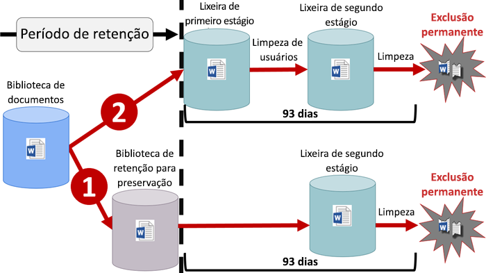
  
Depois que uma política de retenção é atribuída a uma conta do OneDrive ou site do SharePoint, o conteúdo pode seguir um destes dois caminhos:
  
1. **Se o conteúdo for modificado ou excluído** durante o período de retenção, uma cópia do conteúdo original existente na ocasião em que a política de retenção foi atribuída será criada na biblioteca de Retenção para Preservação. Lá, um trabalho de temporizador é executado periodicamente e identifica itens cujo período de retenção expirou, e esses itens são movidos para a lixeira de segundo estágio, onde serão excluídos permanentemente ao final de 93 dias. Observe que a lixeira de segundo estágio não está visível para os usuários finais (somente a lixeira de primeiro estágio está), mas os administradores de conjunto de sites podem exibir e restaurar o conteúdo de lá.

    > [!NOTE]
    > Alteramos recentemente como o conteúdo é excluído da biblioteca de Retenção para Preservação. Para ajudar a evitar a perda de dados acidental, não excluímos mais permanentemente o conteúdo da biblioteca de Retenção para Preservação. Em vez disso, excluímos permanentemente somente o conteúdo da lixeira, portanto, todo o conteúdo da biblioteca de Retenção para Preservação agora passará pela lixeira de segundo estágio.
    
2. **Se o conteúdo não for modificado ou excluído** durante o período de retenção, ele será movido para a Lixeira de primeiro estágio no final do período de retenção. Se um usuário excluir o conteúdo a partir daí, ou se esvaziar a Lixeira (também conhecido como limpeza), o documento será transferido para a Lixeira de segundo estágio. Um período de retenção de 93 dias abrange as duas lixeiras de primeiro e segundo estágio. O documento será excluído permanentemente no final de 93 dias, de onde eles estiverem, no primeiro ou segundo estágio. Observe que a Lixeira não é indexada e, portanto, pesquisas não localizam seu conteúdo. Isso significa que um bloqueio de Descoberta Eletrônica não consegue localizar o conteúdo da Lixeira para retê-lo. 
    
### Conteúdo em caixas de correio e pastas públicas

Para os emails de um usuário, calendário e outros itens, uma política de retenção é aplicada no nível de uma caixa de correio. Para uma pasta pública, uma política de retenção é aplicada ao nível da pasta, não ao nível da caixa de correio. Tanto uma caixa de correio quanto uma pasta pública usam a pasta Itens Recuperáveis para reter itens. Somente as pessoas às quais foram atribuídas permissões de Descoberta Eletrônica podem exibir itens na pasta de itens recuperáveis de outro usuário. 
  
Por padrão, quando alguém exclui uma mensagem de uma pasta diferente da pasta Itens Excluídos, a mensagem é movida para a pasta Itens Excluídos. Quando alguém exclui um item da pasta Itens Excluídos, a mensagem é movida para a pasta Itens Recuperáveis. Além disso, uma pessoa pode excluir um item de forma reversível (SHIFT+DELETE) em qualquer pasta, o que ignora a pasta Itens Excluídos e move o item diretamente para a pasta Itens Recuperáveis.
  
Um processo avalia itens periodicamente na pasta Itens Recuperáveis. Se um item não corresponder às regras de pelo menos uma política de retenção, o item será excluído permanentemente (também chamado exclusão forçada) da pasta Itens Recuperáveis.
  
Quando uma pessoa tenta alterar determinadas propriedades de um item de caixa de correio, como assunto, corpo, anexos, remetentes e destinatários, ou a data de envio ou de recebimento de uma mensagem, uma cópia do item original é salva na pasta Itens Recuperáveis antes da confirmação da alteração. Isso acontecerá para todas as alterações subsequentes. Após o período de retenção, as cópias na pasta Itens Recuperáveis serão removidas permanentemente.
  
Se um usuário deixar a sua organização e a sua caixa de correio for incluída em uma política de retenção, a caixa de correio se tornará inativa quando a conta do Office 365 do usuário for excluída. O conteúdo de uma caixa de correio inativa ainda está sujeito a qualquer política de retenção que tiver sido aplicada a essa caixa antes de ela se tornar inativa e fica disponível para uma pesquisa de Descoberta Eletrônica. Para saber mais, confira [Caixas de correio inativas no Exchange Online](inactive-mailboxes-in-office-365.md).
  
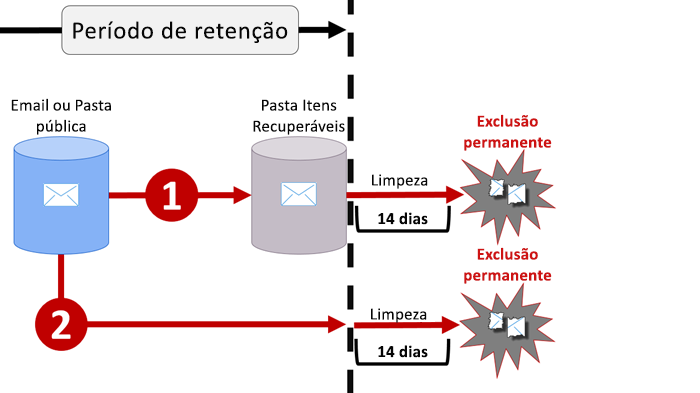
  
Depois que uma política de retenção é atribuída a uma caixa de correio ou pasta pública, o conteúdo pode seguir um destes dois caminhos:
  
1. **Se o item for modificado ou excluído permanentemente** pelo usuário (usando SHIFT + DELETE ou excluído de Itens Excluídos) durante o período de retenção, o item será movido (ou copiado, no caso de edição) para a pasta Itens Recuperáveis. Lá, um processo é executado periodicamente e identifica itens cujo período de retenção tenha expirado, e esses itens são permanentemente excluídos em até 14 dias após o fim do período de retenção. Observe que 14 dias é a configuração padrão, que pode ser estendida para até 30 dias.
    
2. **Se o item não for modificado ou excluído** durante o período de retenção, o mesmo processo será executado periodicamente em todas as pastas na caixa de correio e identificará itens cujo período de retenção tenha expirado, e esses itens serão permanentemente excluídos em até 14 dias após o fim do período de retenção. Observe que 14 dias é a configuração padrão, que pode ser estendida para até 30 dias. 
    
## Como funciona uma política de retenção com versões de documento em um conjunto de sites

O controle de versão é um recurso de todas as bibliotecas de documentos no SharePoint Online e no OneDrive for Business. Por padrão, o controle de versão guarda um mínimo de quinhentas versões principais, embora você possa aumentar esse limite. Para saber mais, confira [Habilitar e configurar o controle de versão para uma lista ou biblioteca](https://support.office.com/article/1555d642-23ee-446a-990a-bcab618c7a37).
  
Uma política de retenção guarda todas as versões de um documento em um conjunto de sites do SharePoint ou em uma conta do OneDrive. Sempre que um documento sujeito a uma política de retenção é editado ou excluído, uma versão é copiada para a biblioteca de retenção para preservação. Cada versão do documento na biblioteca de retenção para preservação existe como um item separado com um período de retenção próprio:
  
- Se a política de retenção se basear em quando o conteúdo foi criado, cada versão terá a mesma data de expiração do documento original. O documento original e suas versões expirarão ao mesmo tempo.
    
- Se a política de retenção estiver baseada na data da última modificação do conteúdo, cada versão terá sua própria data de expiração com base em quando o documento original foi modificado para criar essa versão. Os documentos originais e suas versões expirarão de maneira independente entre si.
    
## Reter o conteúdo por um período específico

Com uma política de retenção, é possível reter o conteúdo indefinidamente ou por um número específico de dias, meses ou anos. Observe que a duração para a retenção do conteúdo é calculada com base na idade desse conteúdo e não de quando a política de retenção tiver sido aplicada. Você pode escolher se a idade se baseia em quando o conteúdo tiver sido criado ou (para o OneDrive e do SharePoint) quando ele foi modificado pela última vez.
  
Por exemplo, se você quiser reter o conteúdo em um conjunto de sites por sete anos desde que foi modificado pela última vez, e se um documento nesse conjunto de sites não tiver sido modificado em seis anos, o documento será retido somente por mais um ano, caso não seja modificado. Se o documento for editado novamente, a idade do documento será calculada a partir da data da última modificação, e ele será retido por mais sete anos.
  
Da mesma forma, se você desejar reter o conteúdo em uma caixa de correio por sete anos, e uma mensagem tiver sido enviada há seis anos, a mensagem será retida por apenas um ano. Para conteúdo do Exchange, a idade sempre se baseará na data de recebimento ou de envio (elas são iguais). A retenção do conteúdo com base em quando ele foi modificado pela última vez aplica-se apenas ao conteúdo de site do OneDrive e do SharePoint.
  
Você pode escolher se deseja que o conteúdo seja excluído permanentemente no final do período de retenção. Uma política de retenção também pode simplesmente excluir o conteúdo antigo sem retê-lo. Confira a próxima seção.
  
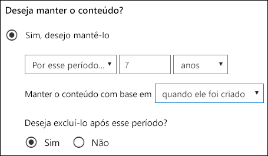
  
## Como excluir conteúdo mais antigo que uma idade específica

Uma política de retenção pode tanto reter e excluir o conteúdo ou simplesmente excluir o conteúdo antigo sem retê-lo.
  
Se sua política de retenção excluir conteúdo, será importante entender que o período de tempo especificado para uma política de retenção é calculado pelo tempo em que o documento foi criado ou modificado, e não a partir do momento em que a política foi atribuída.
  
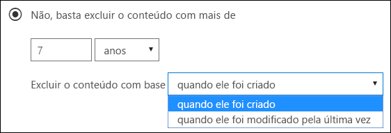
  
Por exemplo, suponha que você crie uma política de retenção que exclui conteúdo após três anos e, em seguida, atribui essa política a todas as contas do OneDrive, que incluem uma grande quantidade de conteúdo criado há quatro ou cinco anos. Nesse caso, muito conteúdo será excluído logo após atribuir a política de retenção pela primeira vez. Por esse motivo **uma política de retenção que exclui conteúdo pode ter um impacto considerável sobre o conteúdo**. 
  
Portanto, quando atribuir uma política de retenção a um conjunto de sites pela primeira vez, primeiro considere a idade do conteúdo e de que modo a política poderá afetá-los. Você também poderá informar os usuários sobre a nova política antes de atribuí-la, para que eles tenham tempo de avaliar o possível impacto. Observe esse aviso que é exibido quando você revisa as configurações da política de retenção antes de criá-la.
  
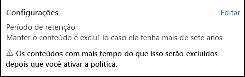
  
## Configurações avançadas que aplicam uma política apenas ao conteúdo que atenda a determinadas condições

Uma política de retenção pode ser aplicada a todo o conteúdo nos locais em que inclui ou você pode aplicar uma política de retenção apenas ao conteúdo que inclui palavras-chave específicas ou [tipos específicos de informações confidenciais](what-the-sensitive-information-types-look-for.md).
  
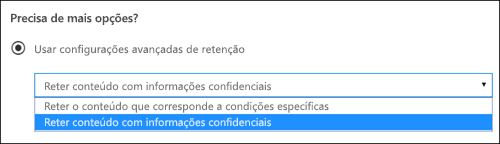
  
### Reter conteúdo que inclui palavras-chave específicas

Você pode aplicar uma política de retenção apenas ao conteúdo que atenda a certas condições e realizar ações de retenção apenas nesse conteúdo. As condições disponíveis agora dão suporte à aplicação de uma política de retenção ao conteúdo que inclui palavras ou frases específicas. Você pode refinar a consulta usando os operadores de pesquisa AND, OR e NOT. Para saber mais sobre esses operadores, confira [Consultas de palavra-chave e critérios de pesquisa para pesquisa de conteúdo](keyword-queries-and-search-conditions.md).
  
O suporte à adição de propriedades pesquisáveis (por exemplo, **assunto:**) estará disponível em breve.
  
Observe que a retenção com base em consulta usa o índice de pesquisa para identificar conteúdo.
  
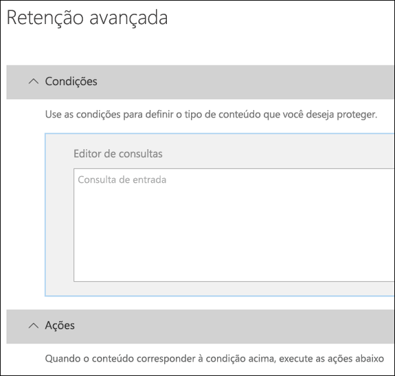
  
### Reter conteúdo com informações confidenciais

Você também pode aplicar uma política de retenção apenas ao conteúdo que inclui [tipos específicos de informações confidenciais](what-the-sensitive-information-types-look-for.md). Por exemplo, você pode optar por aplicar exigências de retenção exclusivas somente ao conteúdo com informações de identificação pessoal (PII) como números de identificação de contribuinte, números de CPF ou números de passaporte.
  
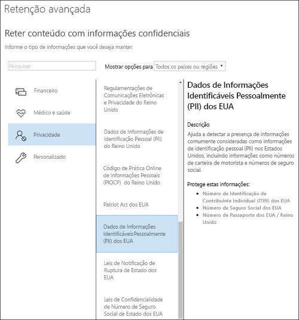
  
Observações:
  
- A retenção avançada para informações confidenciais não se aplica a pastas públicas do Exchange ou Skype for Business, pois esses locais não dão suporte a tipos de informações confidenciais.
    
- Você deve compreender que o Exchange Online usa regras de fluxo de emails (também conhecidas como regras de transporte) para identificar informações confidenciais; portanto, isso funciona apenas em mensagens em trânsito, não em todos os itens já armazenados em uma caixa de correio. Para o Exchange Online, isso significa que uma política de retenção pode identificar informações confidenciais e realizar ações de retenção apenas em mensagens recebidas **após** a política ser aplicada à caixa de correio. (Observe que a retenção com base em consulta descrita na seção anterior não apresenta essa limitação porque ela usa o índice de pesquisa para identificar conteúdo). 
    
## Aplicar uma política de retenção a uma organização inteira ou locais específicos

Você pode facilmente aplicar uma política de retenção a uma organização inteira, locais inteiros ou apenas a locais ou usuários específicos.
  
### Política no âmbito da organização

Um dos recursos mais avançados de política de retenção é que, por padrão, aplica-se aos locais no Office 365, incluindo:
  
- Email do Exchange
    
- Conjuntos de sites do SharePoint
    
- Contas do OneDrive
    
- Grupos do Office 365 (aplicável ao conteúdo da caixa de correio, sites e documentos do grupo. O suporte para o conteúdo no Planner, no Yammer e no CRM estará disponível em breve).
    
- Pastas públicas do Exchange
    
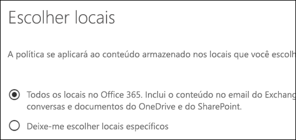
  
Outros recursos importantes de uma política de retenção no âmbito da organização incluem:
  
- Não há um limite para o número de caixas de correio ou sites que essa política pode incluir.
    
- Para o Exchange, as caixas de correio criadas após a aplicação da política herdam a política automaticamente.
  
### Uma política aplicável a locais inteiros

Ao escolher locais, você poderá facilmente incluir ou excluir um local inteiro, como os emails do Exchange ou contas do OneDrive. Para fazer isso, basta ativar ou desativar o **Status** desse local. 
  
Como uma política no âmbito da organização, se uma política for aplicada a qualquer combinação de locais inteiros, não haverá um limite para o número de caixas de correio ou sites que essa política poderá incluir. Por exemplo, se uma política incluir todos os emails do Exchange e sites do SharePoint, todos os sites e caixas de correio serão incluídas, independentemente da quantidade. E para o Exchange, as caixas de correio criadas após a aplicação da política herdarão a política automaticamente.
 
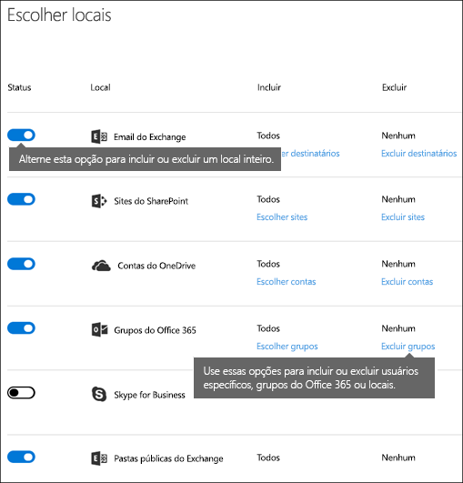
  
### Uma política com inclusões ou exclusões específicas

Você também pode aplicar uma política de retenção a usuários específicos. Para fazer isso, ative o **Status** desse local e, em seguida, use os links para incluir ou excluir usuários, grupos do Office 365 ou locais específicos. 
  
No entanto, observe que os seguintes limites existem para uma política de retenção que inclui ou exclui mais de 1.000 usuários específicos:
  
- Essa política de retenção pode conter, no máximo, 1.000 caixas de correio e 100 conjuntos de sites.
    
- Um locatário pode conter no máximo 10.000 políticas de retenção.
    
Embora esses limites existam, entenda que você pode acessar ignorá-los aplicando uma política no âmbito da organização ou uma política a locais inteiros.
  
### Locais do Skype

Ao contrário de email do Exchange, você não pode apenas ativar/desativar o status de local do Skype para incluir todos os usuários, mas pode ativar esse local e depois selecionar manualmente os usuários cujas conversas deseja manter.
  
Quando você escolhe os usuários do Skype for Business, pode incluir rapidamente todos os usuários selecionando a caixa **Nome** no cabeçalho da coluna; no entanto, é importante compreender que cada usuário conta como uma inclusão específica na política. Portanto, se você incluir mais de 1.000 usuários, serão aplicados os limites indicados na seção anterior. Selecionar todos os usuários de Skype nessa situação não será o mesmo se uma política no âmbito da organização pudesse incluir todos os usuários do Skype por padrão. 
  
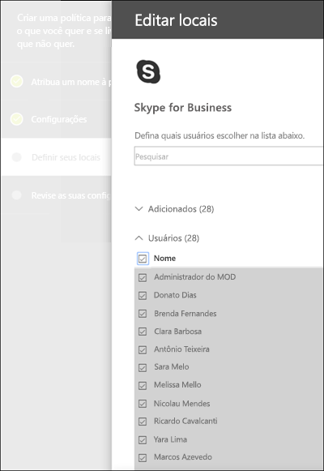
  
Observe que o **Histórico da Conversa**, uma pasta no Outlook, é um recurso que não tem nada a ver com o arquivamento do Skype. **Histórico da Conversa** pode ser desativado pelo usuário final, mas o arquivamento para o Skype é feito armazenando-se uma cópia das conversas do Skype em uma pasta oculta que é inacessível ao usuário, mas disponível para Descoberta Eletrônica.

### Locais de grupos do Office 365

Para reter o conteúdo de um Grupo do Office 365, é necessário usar o local dos grupos do Office 365. Mesmo que um Grupo do Office 365 tenha uma caixa de correio do Exchange, uma política de retenção que inclua todo o local do Exchange não incluirá conteúdo nas caixas de correio de Grupo do Office 365. Uma política de retenção aplicada a um grupo do Office 365 inclui a caixa de correio do grupo e um site.

Além disso, não é possível usar o local do Exchange para incluir ou excluir uma caixa de correio de grupo específica. Embora o local do Exchange permita inicialmente que uma caixa de correio de grupo seja selecionada, quando você tentar salvar a política de retenção, receberá um erro informando que "RemoteGroupMailbox" não é uma seleção válida para o local do Exchange. 
  
### Locais do Teams

Você pode usar uma política de retenção para manter as conversas e as mensagens de canal em Teams. As conversas do Teams são armazenadas em uma pasta oculta na caixa de correio de cada usuário incluído na conversa e as mensagens de canal do Teams são armazenadas em uma pasta oculta semelhante na caixa de correio de grupo para a equipe. No entanto, é importante compreender que o Teams usa um serviço de chat fornecido pelo Azure que também armazena esses dados e, por padrão, esse serviço armazena os dados para sempre. Por esse motivo, é altamente recomendável usar a localização para reter e excluir dados do Teams. Usar o local do Teams excluirá permanentemente os dados de caixa de correio do Exchange e o serviço de chat subjacente fornecido pelo Azure. Para saber mais, confira [Visão geral de segurança e conformidade no Microsoft Teams](https://go.microsoft.com/fwlink/?linkid=871258).
  
Observe que os chats e as mensagens de canal do Teams não são afetados pelas políticas de retenção aplicadas a caixas de correio de usuário ou grupo nos locais de grupos do Exchange ou Office 365. Embora os chats e as mensagens de canal do Teams são armazenadas no Exchange, eles são afetados apenas por uma política de retenção que é aplicada ao local do Teams.
  
Ainda estamos trabalhando em retenção no Teams e outros recursos estão chegando. Enquanto isso, aqui estão algumas limitações a serem consideradas:
  
- **O Teams exige uma política de retenção separada** Quando você cria uma política de retenção e alterna o local do Teams, todos os outros locais são desativados. Uma política de retenção que inclui o Teams pode incluir apenas o Teams e nenhum outro local. 
    
- **O Teams não está incluído em uma política no âmbito da organização** Se você criar uma política no âmbito da organização, o Teams não estará incluído, porque ele exige uma política de retenção separada. 
    
- **O Teams não dá suporte a retenção avançada** Quando você cria uma política de retenção, se escolher [Configurações avançadas que aplicam uma política apenas ao conteúdo que atende a determinadas condições](#advanced-settings-that-apply-a-policy-only-to-content-that-meets-certain-conditions), o local do Teams não estará disponível. No momento, a retenção no Teams aplica-se a todo o conteúdo de chat e mensagens de canal.
    
- **O conteúdo do Teams deve ter pelo menos 30 dias para ser excluído** Neste momento, não há suporte para criar uma política para excluir o conteúdo do Teams com menos de 30 dias. Se quiser que essa política seja aplicada ao conteúdo do Teams, especifique um período de retenção igual ou maior do que 30 dias. 
    
- **O Teams pode levar até 30 dias para limpar o conteúdo retido** Uma política de retenção aplicada ao Teams excluirá o conteúdo de todos os locais de armazenamento relevantes. No entanto, imediatamente após o lançamento, poderá levar até 30 dias para os clientes do Teams limpar o conteúdo com base na política de retenção. Mas mesmo que o conteúdo ainda apareça nos clientes do Teams, esse conteúdo não será exibido na pesquisa de conteúdo ou Descoberta Eletrônica após o término do período de retenção. 
    
Em uma equipe, os arquivos compartilhados em um chat são armazenados na conta do OneDrive do usuário que compartilhou o arquivo. Os arquivos que são carregados nos canais são armazenados no site do SharePoint para a equipe. Portanto, para manter ou excluir arquivos em uma equipe, você precisará criar uma política de retenção que se aplica aos locais do SharePoint e do OneDrive. Se quiser aplicar uma política aos arquivos de apenas uma equipe específica, você poderá escolher o site do SharePoint para a equipe e as contas de usuários do OneDrive na equipe.
  
Uma política de retenção que se aplica ao Teams pode usar [Bloqueio de Preservação](#locking-a-retention-policy).
  
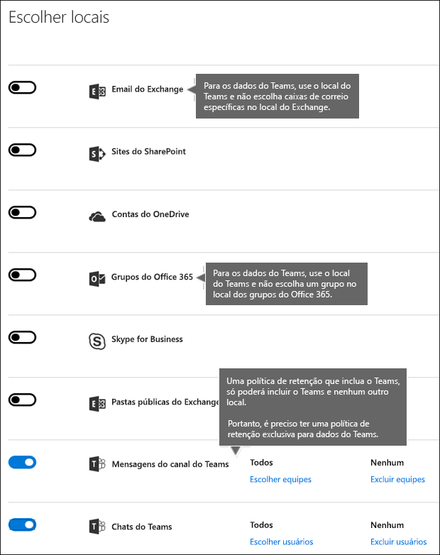
  
## Como excluir tipos específicos de itens do Exchange de uma política de retenção
Usando o PowerShell, você poderá excluir tipos específicos de itens do Exchange de uma política de retenção. Por exemplo, você poderá excluir mensagens de caixa postal, conversas de mensagens instantâneas e outro conteúdo do Skype for Business Online nas caixas de correio. Você também pode excluir o calendário, as anotações e os itens de tarefas. Esse recurso está disponível apenas usando o PowerShell; não está disponível na interface de usuário quando você cria uma política de retenção.
  
Para fazer isso, use o parâmetro `ExcludedItemClasses` dos cmdlets `New-RetentionComplianceRule` e `Set-RetentionComplianceRule`. Para saber mais sobre o PowerShell, confira a seção abaixo [Encontre os cmdlets do PowerShell para políticas de retenção](#find-the-powershell-cmdlets-for-retention-policies).

## Como bloquear uma política de retenção
Algumas organizações talvez precisem cumprir regras definidas por órgãos regulamentadores, como a Regra 17a-4 do Securities and Exchange Commission (SEC), que exige que após uma política de retenção ser ativada, ela não pode ser desativada ou se tornar menos restritiva. Com o Bloqueio de Preservação, você pode bloquear a política para que ninguém, nem o administrador, possa desativar a política ou torná-la menos restritiva.
  
Após o bloqueio de uma política, ninguém poderá desativá-la nem remover locais da política. Além disso, não é possível modificar ou excluir o conteúdo que está sujeito à política durante o período de retenção. Depois que a política for bloqueada, só se poderá modificar a política de retenção adicionando locais a ela ou ampliando sua duração. Uma política bloqueada pode ser aumentada ou estendida, mas não poderá ser reduzida ou desativada.
  
Portanto, antes de bloquear uma política de retenção, é **fundamental** que você entenda os requisitos de conformidade da sua organização e **não bloqueie uma política** até ter certeza de que isso é necessário.

### Bloquear uma política de retenção usando o PowerShell
  
Você pode bloquear uma política de retenção apenas usando o PowerShell.

Primeiro, [conecte-se ao PowerShell do Centro de Conformidade e Segurança do Office 365](http://go.microsoft.com/fwlink/p/?LinkID=799771).

Em segundo lugar, para exibir uma lista de suas políticas de retenção e encontrar o nome da política que você quer bloquear, execute `Get-RetentionCompliancePolicy`.

Terceiro lugar, para colocar um bloqueio de preservação a política de retenção, execute `Set-RetentionCompliancePolicy` com o `RestrictiveRetention` parâmetro definido como verdadeiro, por exemplo:

`Set-RetentionCompliancePolicy -Identity “<Name of Policy>” – RestrictiveRetention $true`

Depois de executar esse cmdlet, você pode ver um prompt de confirmação. Escolha **Sim para todos**.

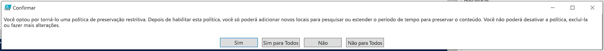

Agora, o bloqueio de preservação é colocado na política de retenção. Se você executar o parâmetro `Get-RetentionCompliancePolicy`, o `RestrictiveRetention` é definido como verdadeiro, por exemplo:

`Get-RetentionCompliancePolicy -Identity “<Name of Policy>” |Fl`

  
## Como liberar uma política de retenção

Você pode desativar ou excluir uma política de retenção a qualquer momento. Quando você faz isso, todo o conteúdo do SharePoint ou do OneDrive que está sendo mantido na biblioteca de retenção de preservação não é excluído imediata e permanentemente. Em vez disso, para ajudar a evitar a perda acidental de dados, há um período de cortesia de 30 dias, durante o qual a expiração de conteúdo dessa política não acontece na biblioteca de retenção para preservação para que você possa restaurar todo o conteúdo de lá, se necessário. Você também pode ativar a política de retenção novamente durante o período de cortesia e nenhum conteúdo será excluído para essa política.

O período de cortesia de 30 dias no SharePoint e no OneDrive corresponde à retenção por atraso de 30 dias no Exchange. Para saber mais, confira [Gerenciar caixas de correios em retenção por atraso](https://docs.microsoft.com/pt-BR/office365/securitycompliance/identify-a-hold-on-an-exchange-online-mailbox#managing-mailboxes-on-delay-hold).

## Os princípios de retenção ou o que tem precedência?

É possível ou até mesmo provável que o conteúdo tenha várias políticas de retenção aplicadas a ele, cada uma com uma ação diferente (manter, excluir ou ambas) e o período de retenção. O que tem precedência? No nível mais alto, esteja certo de que o conteúdo retido por uma política não pode ser excluído permanentemente por outra política.
  

  
Para entender como as diferentes políticas de retenção são aplicadas ao conteúdo, lembre-se destes princípios de retenção:
  
1. **A retenção prevalece sobre a exclusão.** Suponha que uma política de retenção diga para excluir o email do Exchange após três anos, mas outra diga para manter o email do Exchange por cinco anos e depois excluí-lo. Qualquer conteúdo que tiver três anos será excluído e ocultado dos usuários, mas ainda será mantido na pasta Itens Recuperáveis até que o conteúdo atinja cinco anos, quando ele será permanentemente excluído. 
    
2. **O período de retenção mais longo prevalece.** Se o conteúdo estiver sujeito a várias políticas que retêm o conteúdo, ele será mantido até o final do período de retenção mais longo. 
    
3. **A inclusão explícita prevalece sobre a inclusão implícita.** Isso significa que: 
    
    1. Se um rótulo com configurações de retenção for atribuído manualmente por um usuário a um item, como um email do Exchange ou um documento do OneDrive, esse rótulo terá precedência sobre uma política atribuída no nível do site ou caixa de correio e um rótulo padrão atribuído pela biblioteca de documentos. Por exemplo, se o rótulo explícito disser para manter por dez anos, mas a política atribuída ao site disser para manter por apenas cinco anos, o rótulo terá precedência. Observe que os rótulos de aplicação automática são considerados implícitos, não explícitos, pois são aplicados automaticamente pelo Office 365.
    
    2. Se uma política de retenção incluir um local específico, como a caixa de correio de um usuário específico ou conta OneDrive for Business, essa política terá precedência sobre outra política de retenção que se aplica a caixas de correio de todos os usuários ou contas do OneDrive for Business, mas não incluirá especificamente essa caixa de correio do usuário.
    
4. **O período de exclusão mais curto tem precedência.** Da mesma forma, se o conteúdo estiver sujeito a várias políticas que excluem o conteúdo (sem retenção), ele será excluído ao fim do período de retenção mais curto. 
    
Entenda que os princípios de retenção funcionam como um fluxo de desempate de cima para baixo: se as regras aplicadas por todas as políticas ou rótulos forem as mesmas em um nível, o fluxo se moverá para baixo até o próximo nível para determinar a precedência para a qual a regra será aplicada.
  
Por fim, uma política de retenção ou rótulo não pode excluir permanentemente qualquer conteúdo que esteja retido para Descoberta Eletrônica. Quando a retenção for liberada, o conteúdo estará novamente qualificado para o processo de limpeza descrito acima.
  
## Usar uma política de retenção em vez destes recursos

Uma única política de retenção pode facilmente ser aplicada a uma organização inteira e locais no Office 365, incluindo o Exchange Online, o SharePoint Online, o OneDrive for Business e os grupos do Office 365. Se você precisar manter ou excluir conteúdo em praticamente qualquer lugar no Office 365, recomendamos usar uma política de retenção. (Você também pode usar rótulos com configurações de retenção. Para saber mais, confira [Visão geral de rótulos](labels.md).)
  
Há vários outros recursos que já foram usados para reter ou excluir conteúdo no Office 365. Eles estão listados abaixo. Esses recursos continuarão a funcionar lado a lado com políticas de retenção e rótulos de retenção. Porém, futuramente, para governança de dados, recomendamos o uso de uma política de retenção ou o uso de rótulos no lugar de todos esses recursos. Uma política de retenção é o único recurso que pode tanto reter quanto excluir conteúdo por todo o Office 365.
  
### Exchange Online

- [Gerenciar ocorrências de Descoberta Eletrônica no &amp;Centro de Conformidade e Segurança ](https://support.office.com/article/edea80d6-20a7-40fb-b8c4-5e8c8395f6da)do Office 365 (Retenção de Descoberta Eletrônica) 
    
- [Bloqueio In-loco e a Retenção de Litígio](https://go.microsoft.com/fwlink/?linkid=846124) (Retenção de Descoberta Eletrônica) 
    
- [Marcas de retenção e políticas de retenção](https://go.microsoft.com/fwlink/?linkid=846125), também conhecidas como [gerenciamento de registros de mensagens (MRM)](https://go.microsoft.com/fwlink/?linkid=846126) (apenas exclusão) 
    
### SharePoint Online e OneDrive for Business

- [Gerenciar ocorrências de Descoberta Eletrônica no &amp;Centro de Conformidade e Segurança ](https://support.office.com/article/edea80d6-20a7-40fb-b8c4-5e8c8395f6da)do Office 365 (Retenção de Descoberta Eletrônica) 
    
- [Adicionar conteúdo a uma ocorrência e colocar fontes em retenção na Descoberta Eletrônica](https://support.office.com/article/54d70de9-1ec2-4325-84f3-aeb588554479) (Retenção de Descoberta Eletrônica) 
    
- [Visão geral das políticas de exclusão de documentos](https://support.office.com/article/55e8d858-f278-482b-a198-2e62d6a2e6e5) (apenas exclusão) 
    
- [Como configurar o gerenciamento de registros no local](https://support.office.com/article/7707a878-780c-4be6-9cb0-9718ecde050a) (retenção) 
    
- [Use políticas de fechamento de site e exclusão](https://support.office.com/article/a8280d82-27fd-48c5-9adf-8a5431208ba5) (apenas exclusão) 
    
- [Políticas de gerenciamento de informações](intro-to-info-mgmt-policies.md) (apenas exclusão) 
    
Observe que se você tiver usado anteriormente qualquer um dos bloqueios de descoberta eletrônica para fins de governança de dados, você deve usar uma política de retenção para conformidade proativa. Você deve usar um bloqueio apenas para a descoberta eletrônica.
  
### As políticas de retenção substituem as políticas de gerenciamento de informações

Nos sites do SharePoint, talvez você esteja usando [políticas de gerenciamento de informações](intro-to-info-mgmt-policies.md) para reter conteúdo. Se você aplicar uma política de retenção em um site que já usa políticas de tipo de conteúdo ou políticas de gerenciamento de informações para uma lista ou biblioteca, essas políticas serão ignoradas enquanto a política de retenção estiver em vigor. 
  
## O que aconteceu com as políticas de preservação?

Se você estava usando uma política de preservação, essa política foi automaticamente convertida em uma política de retenção que usa apenas a ação de retenção - a política não excluirá conteúdo. A política de preservação continuará a funcionar e preservar seu conteúdo sem exigir mudanças da sua parte. Você pode encontrar essas políticas na página **Políticas** no centro de conformidade do Microsoft 365 ou na página **Retenção**, em **Governança de dados**, no &amp;Centro de Conformidade e Segurança. Você pode editar uma política de preservação para alterar o período de retenção, mas você não pode fazer outras alterações, como adicionar ou remover locais. 
  
## Permissões

Os membros da equipe de conformidade que criarão políticas de retenção precisam de permissões para o &amp; Centro de Conformidade e Segurança. Por padrão, o administrador de locatário terá acesso a esse local e pode fornecer acesso a outras pessoas e aos responsáveis pela conformidade ao &amp; Centro de Conformidade e Segurança, sem lhes dar todas as permissões de um administrador de locatários Para fazer isso, recomendamos que você acesse a página **Permissões** do &amp; Centro de Conformidade e Segurança, edite o grupo de função **Administrador de Conformidade** e adicionar membros a esse grupo de função. 
  
Para saber mais, consulte [Dê aos usuários acesso ao Centro de Conformidade e Segurança&amp; do Office 365](grant-access-to-the-security-and-compliance-center.md).
  
Essas permissões são necessárias somente para criar e aplicar uma política de retenção. A imposição da política não exige acesso ao conteúdo.
  
## Localizar os cmdlets do PowerShell para políticas de retenção

Para usar os cmdlets de política de retenção, você precisará:
  
1. [Conectar ao &amp;Centro de Conformidade e Segurança do Office 365 usando o PowerShell remoto](http://go.microsoft.com/fwlink/?LinkID=799771&amp;clcid=0x409)
    
2. Use esses [cmdlets do &amp;Centro de Conformidade e Segurança do Office 365](http://go.microsoft.com/fwlink/?LinkID=799772&amp;clcid=0x409)
    
## Mais informações

- [Visão geral de rótulos](labels.md)
    

