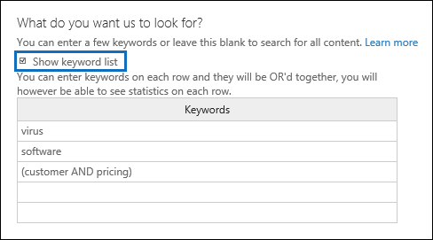

# <a name="run-a-content-search-in-the-office-365-security-amp-compliance-center"></a>Executar uma pesquisa de conteúdo no centro de conformidade &amp; de segurança do Office 365

Você pode usar a ferramenta de descoberta eletrônica de pesquisa de conteúdo no &amp; centro de conformidade de segurança do Office 365 para pesquisar itens como email, documentos e conversas de mensagens instantâneas em sua organização do Office 365. Use esta ferramenta para pesquisar itens nestes serviços do Office 365:
  
- Caixas de correio do Exchange Online e pastas públicas
    
- Sites do SharePoint Online e do OneDrive for Business
    
- Conversas do Skype for Business
    
- Microsoft Teams 
    
- Grupos do Office 365
    
A Pesquisa de conteúdo é uma nova ferramenta de pesquisa de Descoberta Eletrônica com recursos novos e aprimorados de desempenho e dimensionamento. Use a Pesquisa de conteúdo para executar pesquisas de Descoberta Eletrônica muito grandes. Você pode pesquisar todas as caixas de correio, todas as pastas públicas do Exchange e todos os sites do SharePoint Online e do OneDrive for Business em uma única pesquisa de conteúdo. Não há limites para o número de locais de conteúdo que você pode pesquisar. Também não há limites para o número de pesquisas que podem ser executadas ao mesmo tempo. Após executar uma pesquisa de conteúdo, o número de locais de conteúdo e um número estimado de resultados de pesquisa são exibidos no painel de detalhes na página de **pesquisa de conteúdo** . Depois de executar uma pesquisa, você pode visualizar os resultados, obter estatísticas de palavras-chave para uma ou mais pesquisas, editar pesquisas de conteúdo em massa e exportar os resultados para um computador local. 
  
 **Sumário**
  
[Create a search](run-a-content-search-in-the-security-and-compliance-center.md#create)
  
[Exportar resultados de pesquisa](run-a-content-search-in-the-security-and-compliance-center.md#export)
  
[Preview search results](run-a-content-search-in-the-security-and-compliance-center.md#preview)
  
[Update search results](run-a-content-search-in-the-security-and-compliance-center.md#restart)
  
[Edit a search](run-a-content-search-in-the-security-and-compliance-center.md#edit)
  
[Retry a search](run-a-content-search-in-the-security-and-compliance-center.md#retry)
  

  
## <a name="before-you-begin"></a>Antes de começar

- Para obter informações e orientações sobre como criar consultas de pesquisa e usar operadores de pesquisa booleanos, consulte [keyword queries and Search Conditions for Content Search](keyword-queries-and-search-conditions.md). Este artigo também contém informações sobre a pesquisa de tipos de informações confidenciais e a pesquisa de conteúdo compartilhado com pessoas dentro e fora da sua organização.
    
- Para ter acesso à página de **pesquisa de conteúdo** para executar pesquisas e visualizar e exportar os resultados da pesquisa, um administrador, um responsável pela conformidade ou um gerente de descoberta eletrônica deve ser membro do grupo de &amp; função Gerenciador de descoberta eletrônica na conformidade de segurança Centro. Você não precisa atribuir permissões de pesquisa adicionais no Exchange Online, no SharePoint Online ou no OneDrive for Business sites. Para obter mais informações, consulte [atribuir permissões de descoberta eletrônica no centro &amp; de conformidade de segurança do Office 365](assign-ediscovery-permissions.md).
    
- Há limites aplicados à pesquisa de conteúdo para manter a integridade e a qualidade dos serviços fornecidos nas organizações do Office 365. Na maioria dos casos, não é possível modificar os limites, mas você deve estar ciente deles para que possa levá-los em consideração ao planejar, executar e solucionar problemas de pesquisas. Para obter mais informações, consulte [Limits for Search in The Office &amp; 365 Security Compliance Center](limits-for-content-search.md).
    
- Consulte a seção sobre tempos estimados de pesquisa com base no número de caixas de correio pesquisadas em uma única pesquisa de conteúdo. 
    
- Conforme mencionado anteriormente, você pode usar a pesquisa de conteúdo para pesquisar conteúdo nos grupos do Office 365 e no Microsoft Teams. Isso significa que você pode pesquisar a caixa de correio de grupo, o calendário compartilhado e os sites do SharePoint associados a um grupo do Office 365 e a uma equipe da Microsoft. Além disso, você pode pesquisar as conversas de canal em uma equipe da Microsoft. Para obter informações sobre grupos do Office 365 e o Microsoft Teams, consulte:
    
  - [Saiba mais sobre os grupos do Office 365](https://support.office.com/article/b565caa1-5c40-40ef-9915-60fdb2d97fa2)
    
  - [Ajuda do Microsoft Teams](https://support.office.com/article/23156c0c-2c6e-49dd-8b7b-7c564b76508c)
    
    Consulte a seção sobre dicas de pesquisa de conteúdo nos grupos do Office 365 e no Microsoft Teams. 
    
[Return to top](run-a-content-search-in-the-security-and-compliance-center.md#top)
  
## <a name="create-a-search"></a>Create a search
<a name="create"> </a>

1. Acesse [https://protection.office.com](https://protection.office.com).
    
2. Entre no Office 365 usando a sua conta corporativa ou de estudante.
    
3. No painel esquerdo do Centro de Conformidade e Segurança, clique em **Pesquisa&amp; investigação** \> **Pesquisa de Conteúdo**.
    
4. Clique em **Novo**.
    
5. Na página **Nova pesquisa**, digite um nome para a Pesquisa de Conteúdo. O nome deve ser exclusivo em sua organização. 
    
6. Escolha os locais de conteúdo que você deseja pesquisar. Você pode pesquisar caixas de correio, sites e pastas públicas na mesma pesquisa.
    
    
  
1. **Pesquisar em qualquer lugar** Selecione essa opção para pesquisar em todos os locais de conteúdo da sua organização. Ao selecionar essa opção, você pode optar por pesquisar todas as caixas de correio (incluindo caixas de correio inativas e as caixas de correio de todos os grupos do Office 365 e do Microsoft Teams), todos os sites do SharePoint e do OneDrive for Business (que inclui os sites de todos os grupos do Office 365 e Microsoft Teams) e todas as pastas públicas.
    
    
  
2. **Seleção de local Personalizada** Selecione essa opção para selecionar as caixas de correio e os sites que você deseja pesquisar. Se você escolher essa opção, terá flexibilidade para pesquisar todos os locais de conteúdo de um serviço específico (como pesquisar todas as caixas de correio do Exchange) ou pode pesquisar locais de conteúdo específicos para um serviço do Office 365.
    
    Tenha em mente o seguinte ao adicionar locais de conteúdo para pesquisa:
    
    **Caixas de correio**
    
  - Ao clicar em **Adicionar** de adicionar para especificar as caixas de correio a serem pesquisadas, o seletor de caixa de correio exibido estará vazio. Isso foi desenvolvido para melhorar o desempenho. Para adicionar destinatários a essa lista, digite um nome (no mínimo 3 caracteres) na caixa de pesquisa e clique em ****de pesquisa de pesquisa.
    
  - Você pode adicionar caixas de correio e grupos de distribuição inativos à lista de caixas de correio a serem pesquisadas. Para grupos de distribuição, as caixas de correio dos membros do grupo são pesquisadas. Observe que não há suporte para grupos dinâmicos de distribuição.
    
  - Para obter uma lista das caixas de correio inativas em sua organização, execute o `Get-Mailbox -InactiveMailboxOnly` comando no PowerShell do Exchange Online. Como alternativa, você pode ir para a **retenção** de **governança** \> de dados &amp; no centro de conformidade de segurança e, em seguida,](media/9723029d-e5cd-4740-b5b1-2806e4f28208.gif) \> clicar em **mais**![reticências de barras de navegação inativas. ****
    
  - Você também pode adicionar a caixa de correio que está associada a um grupo do Office 365 ou a uma equipe da Microsoft. Nesse caso, somente a caixa de correio de grupo ou de equipe é pesquisada; as caixas de correio do grupo ou membros da equipe não são pesquisadas. Para procurá-los, adicione-os especificamente à pesquisa.
    
  - Se você não quiser incluir caixas de correio na pesquisa, selecione **escolher caixas de correio específicas para pesquisa**, mas não adicionar uma caixa de correio à lista.
    
    **Sites**
    
  - Clique em **Adicionar** de adição para adicionar sites à pesquisa. Digite a URL de cada site que você deseja pesquisar. A ferramenta de pesquisa de conteúdo validará a URL e a adicionará à lista de sites para pesquisa. 
    
  - Você pode adicionar o SharePoint associado a um grupo do Office 365 ou a uma equipe da Microsoft. Consulte a seção para obter orientação sobre como encontrar a URL do grupo ou da equipe. 
    
  - Se você não quiser incluir sites em uma pesquisa, selecione **escolher sites específicos para pesquisa**, mas não adicione um site à lista.
    
    **Pastas públicas**
    
    Para pastas públicas, você pode optar por pesquisar todas as pastas públicas em sua organização do Exchange Online ou não Pesquisar por pastas públicas.
    
7. Clique em **Avançar**.
    
8. Na página **Nova pesquisa**, você pode adicionar palavras-chave e condições para criar a consulta de pesquisa. 
    
    
  
1. Na caixa sob o **que você deseja que procuremos?**, digite uma consulta de pesquisa na caixa. Você pode especificar palavras-chave, propriedades de mensagem, como datas de envio e recebimento, ou propriedades de documento, como nomes de arquivo ou a data em que um documento foi alterado pela última vez. Você pode usar consultas mais complexas que usam um operador Boolean, como **e**, **ou**, **não**, **Near**ou **ONEAR**. Você também pode pesquisar informações confidenciais (como números de seguridade social) em documentos ou pesquisar documentos que foram compartilhados externamente. Se você deixar a caixa de palavras-chave vazia, todo o conteúdo localizado nos locais de conteúdo especificado será incluído nos resultados da pesquisa. 
    
2. Você pode clicar na caixa de seleção **Mostrar lista de palavras-chave** e a palavra-chave tipo a em cada linha. Se você fizer isso, as palavras-chave em cada linha serão conectadas pelo operador **or** na consulta de pesquisa criada. 
    
    
  
    Por que usar a lista de palavras-chave? Você pode obter estatísticas que mostram quantos itens correspondem a cada palavra-chave. Isso pode ajudá-lo a identificar rapidamente quais palavras-chave são mais (e menos) eficientes. Você também pode usar uma frase de palavra-chave (entre parênteses) em uma linha. Para obter mais informações sobre estatísticas de pesquisa, consulte [View keyword Statistics for Content Search Results](view-keyword-statistics-for-content-search.md).
    
    Consulte a seção para obter orientação sobre como usar a lista de palavras-chave. 
    
3. Clique em **verificar erros de ortografia** para verificar a consulta em busca de caracteres não suportados e para operadores booleanos que podem não estar em maiúsculas. Os caracteres sem suporte são geralmente ocultos e geralmente causam um erro de pesquisa ou retornam resultados indesejados. Para obter mais informações sobre os caracteres não suportados verificados, confira [verificar se há erros na consulta de pesquisa de conteúdo](check-your-content-search-query-for-errors.md).
    
4. Em **condições**, adicione condições a uma consulta de pesquisa para restringir uma pesquisa e retornar um conjunto mais refinado de resultados. Cada condição adiciona uma cláusula à consulta de pesquisa KQL que é criada e executada quando você inicia a pesquisa. Uma condição é logicamente conectada à consulta de palavra-chave (especificada na caixa de palavra-chave) pelo operador **AND**. Isso significa que os itens precisam atender à consulta de palavra-chave e à condição para serem incluídos nos resultados. É assim que as condições ajudam a restringir os resultados. 
    
||
|:-----|
|Para obter mais informações sobre como criar uma consulta de pesquisa e usar condições, consulte [keyword queries and Search Conditions for Content Search ](keyword-queries-and-search-conditions.md). |
   
9. Clique em **Pesquisar** para salvar as configurações da pesquisa e iniciá-la. 
    
    A pesquisa foi iniciada. Quando a pesquisa é concluída, as informações a seguir são exibidas no painel de detalhes.
    
    
  
1. A data e hora em que a pesquisa foi executada pela última vez.
    
2. O número (e o tamanho total) dos itens que foram encontrados que correspondem à consulta de pesquisa. Exemplos de tipos de item incluem mensagens de email, itens de calendário e documentos. Se um item contiver várias instâncias de uma palavra-chave que está sendo pesquisada, ela só será contada uma vez no número total de itens. Por exemplo, se você estiver pesquisando palavras "stock" ou "Tip" e uma mensagem de email contiver três instâncias da palavra "stock", ela só será contada uma vez no campo **itens** . 
    
3. O número e o tamanho total dos itens não indexados nos locais de conteúdo que foram pesquisados. O número de itens não indexados que não atendem aos critérios de pesquisa será incluído nas estatísticas de pesquisa exibidas no painel de detalhes. Se um item não indexado corresponder à consulta de pesquisa (porque outras propriedades de mensagem ou de documento atendem aos critérios de pesquisa), ela não será incluída no número estimado de itens não indexados. No enTanto, se um item não indexado for excluído pelos critérios de pesquisa, ele não será incluído na estimativa de itens não indexados.
    
4. O número de cada tipo de local de conteúdo pesquisado. Para caixas de correio, observe que as caixas de correio de arquivo morto são incluídas no número total de caixas de correio que foram pesquisadas. No exemplo anterior, quatro caixas de correio de usuário foram pesquisadas e a caixa de correio de arquivo morto para cada um desses usuários está habilitada. É por isso que oito caixas de correio são citadas nas estatísticas de pesquisa.
    
5. Links para visualizar os resultados da pesquisa ou executar a pesquisa novamente para atualizar as estatísticas de pesquisa.
    
    Se necessário, clique em **Atualizar** de atualização para atualizar as informações no painel de detalhes para a pesquisa selecionada. 
    
[Return to top](run-a-content-search-in-the-security-and-compliance-center.md#top)
  
## <a name="export-search-results"></a>Exportar resultados de pesquisa
<a name="export"> </a>

Após uma pesquisa ser executada com êxito, você pode exportar os resultados da pesquisa para um computador local. Quando você exporta os resultados de email, eles são baixados para seu computador como arquivos PST. Quando você exporta conteúdo de sites do SharePoint e do OneDrive for Business, cópias de documentos nativos do Office são exportadas. Também há outros documentos e relatórios que são incluídos nos resultados de pesquisa exportados. Para obter mais informações, consulte [Exportar resultados de pesquisa do centro de &amp; conformidade de segurança do Office 365](export-search-results.md).
  
## <a name="preview-search-results"></a>Visualização de resultados de pesquisa
<a name="preview"> </a>

Após a conclusão da pesquisa, você poderá visualizar os resultados. Há uma série de limites relacionados à visualização dos resultados da Pesquisa de Conteúdo. Para obter mais informações, consulte [Limits for Search in The Office &amp; 365 Security Compliance Center](limits-for-content-search.md). Observe que itens não indexados não estão disponíveis para visualização.
  
1. Na página **pesquisa de conteúdo** , selecione uma pesquisa. 
    
2. No painel de detalhes, em **Resultados**, clique em **Visualizar resultados da pesquisa**. A página **Visualizar resultados da pesquisa** é exibida contendo uma lista de itens de resultado da pesquisa. 
    
    Você pode clicar em um cabeçalho de coluna para classificar os resultados com base no assunto, no tipo, no remetente ou na data em que um item foi recebido na caixa de correio de origem.
    
3. Clique em um item para visualização.
    
    O item é aberto no painel de visualização.
    
4. Se não houver suporte para o tipo de arquivo para visualização ou para baixar uma cópia de um documento, você poderá clicar em **baixar arquivo original** para baixá-lo no computador local. Para páginas da Web. aspx, a URL da página é incluída, embora você talvez não tenha permissões para acessar a página. 
    
> [!NOTE]
> Se você visualizar os resultados da pesquisa de uma pesquisa realizada há mais de 7 dias, deverá atualizar os resultados da pesquisa. A pesquisa é executada novamente para obter os resultados mais atuais que atendem à consulta de pesquisa. 
  
### <a name="file-types-that-can-be-previewed"></a>Tipos de arquivo que podem ser visualizados

Você pode visualizar tipos de arquivo suportados no painel de visualização. Se não houver suporte para um tipo de arquivo, será necessário baixar uma cópia do arquivo para o computador local para visualizá-lo. Os tipos de arquivo a seguir têm suporte e podem ser visualizados na página **Visualizar resultados da pesquisa** . 
  
- . txt,. html,. mhtml
    
- . eml
    
- . doc,. docx,. docm
    
- . pptm,. pptx
    
- .pdf
    
Além disso, há suporte para os seguintes tipos de contêiner de arquivos. Você pode exibir a lista de arquivos no contêiner no painel de visualização.
  
- . zip
    
- . gzip
    
[Return to top](run-a-content-search-in-the-security-and-compliance-center.md#top)
  
## <a name="update-search-results"></a>Atualizar os resultados da pesquisa
<a name="restart"> </a>

Quando você atualiza os resultados de uma pesquisa de conteúdo existente, a consulta de pesquisa é executada novamente em todos os locais de conteúdo especificados. O motivo óbvio para atualizar os resultados da pesquisa é obter os dados mais recentes.
  
1. Na página **Pesquisa de Conteúdo**, selecione a pesquisa para a qual você deseja atualizar os resultados. 
    
2. No painel de detalhes, em **Resultados**, clique em **Atualizar resultados da pesquisa**.
    
    Uma mensagem de status é exibida para informar que os resultados estão sendo recuperados. Após a conclusão da pesquisa, as informações atualizadas serão exibidas em **Resultados** no painel de detalhes. Observe que a data no campo **Pesquisado em** no painel de detalhes é atualizada para a data e a hora atuais. Para atualizar as informações na lista de pesquisas de conteúdo, clique em **Atualizar**de atualização.
    
[Return to top](run-a-content-search-in-the-security-and-compliance-center.md#top)
  
## <a name="edit-a-search"></a>Editar uma pesquisa
<a name="edit"> </a>

Você pode alterar as caixas de correio de origem e a consulta de pesquisa para uma pesquisa de conteúdo existente.
  
1. Na página **pesquisa de conteúdo** , selecione uma pesquisa. 
    
2. No painel de detalhes, em **Consulta**, clique em **Editar a pesquisa**.
    
3. Na página **locais** , você pode alterar quais caixas de correio, grupos, sites do SharePoint ou sites do onedrive for Business para pesquisa. Também pode marcar ou desmarcar a opção para pesquisar todas as pastas públicas no Exchange. 
    
4. Na página de **consulta** , você pode editar a consulta de pesquisa. 
    
5. Para iniciar a pesquisa revisada, clique em **Pesquisar** na página **fontes** ou **locais** . 
    
    A pesquisa revista é iniciada. Quando o sistema conclui a pesquisa, os resultados esperados da pesquisa revista são exibidos no painel de detalhes.
    
## <a name="retry-a-search"></a>Repetir uma pesquisa
<a name="retry"> </a>

Se uma pesquisa retornar algum erro, você não precisará pesquisar novamente todos os locais de conteúdo. Você pode executar novamente a pesquisa para que apenas os locais de conteúdo que falharam sejam pesquisados novamente. Para pesquisar novamente todos os locais de conteúdo, você pode atualizar os resultados da pesquisa.
  
1. Na página **pesquisa de conteúdo** , selecione a pesquisa que contém os locais de conteúdo que você deseja pesquisar novamente. 
    
2. No painel de detalhes, em **Erro**, clique em **Repetir a pesquisa**.
    
    Uma mensagem de status é exibida informando que os resultados estão sendo recuperados. Após a conclusão da pesquisa, as informações atualizadas serão exibidas em **Resultados** no painel de detalhes. Observe que a data no campo **Pesquisado em** no painel de detalhes é atualizada para a data e hora atuais. Para atualizar as informações na lista de pesquisas, clique em **Atualizar**de atualização.
    
[Return to top](run-a-content-search-in-the-security-and-compliance-center.md#top)
  
## <a name="more-information"></a>Mais informações
<a name="moreinfo"> </a>

Veja mais informações sobre as pesquisas de conteúdo.
  
[Limites e desempenho](#limits-and-performance)
  
[Itens não indexados](#unindexed-items) 
 
[Microsoft Teams e grupos do Office 365](#microsoft-teams-and-office-365-groups)
  
[OneDrive for Business](#onedrive-for-business)
  
[Consultas de pesquisa](#search-queries)
  
[Pesquisando caixas de correio inativas](#searching-inactive-mailboxes)
  
[Miscellaneous](#miscellaneous)
  
[Return to top](#before-you-begin)
  
### <a name="limits-and-performance"></a>Limites e desempenho
  
- Para obter uma descrição dos limites que são aplicados ao recurso de pesquisa de conteúdo, consulte [Limits for Search in The Office &amp; 365 Security Compliance Center](limits-for-content-search.md).
    
- A Microsoft coleta informações de desempenho para pesquisas de conteúdo executadas por todas as organizações do Office 365. Embora a complexidade da consulta de pesquisa possa causar impacto nos tempos de pesquisa, o maior fator que afeta a duração das pesquisas longas é o número de caixas de correio pesquisadas. Embora a Microsoft não forneça um contrato de nível de serviço para tempos de pesquisa, a tabela a seguir lista os tempos de pesquisa médios de uma pesquisa de conteúdo com base no número de caixas de correio incluídas na pesquisa.
    
|**Número de caixas de correio**|**Tempo médio de pesquisa**|
|:-----|:-----|
|100  <br/> |30 segundos  <br/> |
|1.000  <br/> |45 segundos  <br/> |
|10.000  <br/> |4 minutos  <br/> |
|25.000  <br/> |10 minutos  <br/> |
|50.000  <br/> |20 minutos  <br/> |
|100.000  <br/> |25 minutos  <br/> |
   
  
### <a name="unindexed-items"></a>Itens não indexados
  
- Como explicado anteriormente, os itens não indexados em locais de conteúdo pesquisados são incluídos nos resultados estimados da pesquisa. Se um item não indexado corresponder à consulta de pesquisa (porque outras propriedades de mensagem ou de documento atendem aos critérios de pesquisa), ela não será incluída no número estimado de itens não indexados. Se um item não indexado for excluído pelos critérios de pesquisa, ele também não será incluído no número estimado de itens não indexados. Para saber mais, confira [Unindexed items in Content Search](https://go.microsoft.com/fwlink/p/?LinkId=780739).
    

  
### <a name="microsoft-teams-and-office-365-groups"></a>Microsoft Teams e grupos do Office 365
  
- O Microsoft Teams é desenvolvido em grupos do Office 365. Portanto, procurá-los é muito semelhante. Lembre-se do seguinte ao pesquisar conteúdo no Microsoft Teams e nos grupos do Office 365.
    
  - Para pesquisar conteúdo localizado no Microsoft Teams e nos grupos do Office 365, você precisa especificar a caixa de correio e o site do SharePoint associados a uma equipe ou a um grupo.
    
  - Execute o cmdlet **Get-** unificado no Exchange Online para exibir as propriedades de um grupo do Microsoft Team ou do Office 365. Essa é uma boa maneira de obter a URL do site que está associado a uma equipe ou a um grupo. Por exemplo, o comando a seguir exibe as propriedades selecionadas de um grupo do Office 365 chamado equipe de liderança sênior: 
    
  ```
  Get-UnifiedGroup "Senior Leadership Team" | FL DisplayName,Alias,PrimarySmtpAddress,SharePointSiteUrl
  DisplayName            : Senior Leadership Team
  Alias                  : seniorleadershipteam
  PrimarySmtpAddress     : seniorleadershipteam@contoso.onmicrosoft.com
  SharePointSiteUrl      : https://contoso.sharepoint.com/sites/seniorleadershipteam
  
  ```

    > [!NOTE]
    > Para executar o cmdlet **Get-** unificado, você deve receber a função de destinatários somente para exibição no Exchange Online ou ser um membro de um grupo de função atribuído à função de destinatários somente para exibição. 
  
  - Quando a caixa de correio de um usuário é pesquisada, qualquer Microsoft Team ou grupo do Office 365 do qual o usuário é membro não será pesquisado. Da mesma forma, quando você pesquisa um grupo do Microsoft Team ou do Office 365, somente a caixa de correio de grupo e o site de grupo que você especifica são pesquisados; as contas de caixas de correio e do OneDrive for Business dos membros do grupo não são pesquisadas, a menos que você as adicione explicitamente à pesquisa.
    
  - Para obter uma lista dos membros de um grupo do Microsoft Team ou do Office 365, você pode exibir as propriedades na página **grupos \> domésticos** no centro de administração do Office 365. Como alternativa, você pode executar o seguinte comando no PowerShell do Exchange Online: 
    
  ```
  Get-UnifiedGroupLinks <group or team name> -LinkType Members | FL DisplayName,PrimarySmtpAddress 
  ```

    > [!NOTE]
    > Para executar o cmdlet **Get-UnifiedGroupLinks** , você deve ser atribuído à função de destinatários somente para exibição no Exchange Online ou ser um membro de um grupo de função atribuído à função de destinatários somente para exibição. 
  
  - As conversas que fazem parte de um canal do Microsoft Teams são armazenadas na caixa de correio que está associada à equipe da Microsoft. Da mesma forma, os arquivos que os membros da equipe compartilham em um canal são armazenados no site do SharePoint da equipe. Portanto, você precisa adicionar a caixa de correio do Microsoft Team e o site do SharePoint como um local de conteúdo para pesquisar conversas e arquivos em um canal.
    
  - 
    
    Como alternativa, as conversas que fazem parte da lista de chat no Microsoft Teams são armazenadas na caixa de correio do Exchange Online dos usuários que participam do chat. Os arquivos que um usuário compartilha em conversas de chat são armazenados na conta do OneDrive for Business do usuário que compartilha o arquivo. Portanto, você precisa adicionar as caixas de correio de usuário individuais e as contas do OneDrive for Business como locais de conteúdo para pesquisar conversas e arquivos na lista de chat.
    
    > [!NOTE]
    > Os usuários que participam de conversas que fazem parte da lista de chat no Microsoft Teams devem ter uma caixa de correio do Exchange Online (baseada na nuvem) para que você pesquise conversas de chat. Isso ocorre porque as conversas que fazem parte da lista de chat são armazenadas nas caixas de correio baseadas em nuvem dos participantes do chat. Se um participante de chat não tiver uma caixa de correio do Exchange Online, você não conseguirá Pesquisar conversas de chat. Por exemplo, em uma implantação híbrida do Exchange, os usuários com uma caixa de correio local podem conseguir participar de conversas que fazem parte da lista de chat no Microsoft Teams. No enTanto, nesse caso, o conteúdo dessas conversas não é pesquisável porque os usuários não têm caixas de correio baseadas em nuvem. 
  
  - Cada equipe do Microsoft ou canal de equipe contém um wiki para anotações e colaboração. O conteúdo wiki é automaticamente salvo em um arquivo com um formato. mht. Esse arquivo é armazenado na biblioteca de documentos de dados wiki do teams no site do SharePoint da equipe. Você pode usar a ferramenta de pesquisa de conteúdo para pesquisar o wiki especificando o site do SharePoint da equipe como o local de conteúdo a ser pesquisado. 
    
    > [!NOTE]
    > A capacidade de Pesquisar o wiki para uma equipe ou um canal da Microsoft (quando você pesquisa o site do SharePoint da equipe) foi lançada em 22 de junho de 2017. Páginas wiki que foram salvas ou atualizadas nessa data ou após estão disponíveis para serem pesquisadas. Páginas wiki salvas ou atualizadas pela última vez antes da data não estão disponíveis para pesquisa. 
  
### <a name="onedrive-for-business"></a>OneDrive for Business
  
- Para coletar uma lista das URLs para os sites do OneDrive for Business em sua organização, consulte [criar uma lista de todos os locais do onedrive em sua organização](https://support.office.com/article/8e200cb2-c768-49cb-88ec-53493e8ad80a). O script neste artigo cria um arquivo de texto que contém uma lista de todos os sites do OneDrive for Business. Para executar esse script, você precisará instalar e usar o Shell de gerenciamento do SharePoint Online. Certifique-se de acrescentar a URL para o domínio meusite da sua organização a cada site do OneDrive for Business que você deseja pesquisar. Este é o domínio que contém todos os seus OneDrive for Business; por exemplo, `https://contoso-my.sharepoint.com`. Veja um exemplo de uma URL para o site do OneDrive for Business de um usuário `https://contoso-my.sharepoint.com/personal/sarad_contoso_onmicrosoft.com`:.
    

### <a name="search-queries"></a>Consultas de pesquisa
  
- Lembre-se do seguinte ao usar a lista de palavras-chave para criar uma consulta de pesquisa.
    
  - Você precisa selecionar a caixa de seleção **Mostrar lista de palavras-chave** e, em seguida, digitar cada palavra-chave em uma linha separada para criar uma consulta de pesquisa onde as palavras-chave (ou palavras-chave) em cada linha estejam conectadas pelo operador **or** . Se você apenas colar uma lista de palavras-chave na caixa keyword ou pressionar a tecla **Enter** depois de digitar uma palavra-chave, elas não serão conectadas pelo operador **or** . Aqui estão incorretos e estão corretos exemplo de adição de uma lista de palavras-chave. 
    
    **Correcta**
    
    
  
    **Maneira**
    
    
  
  - Você também pode preparar uma lista de palavras-chave ou frases de palavras-chave em um arquivo do Excel ou em um arquivo de texto sem formatação e, em seguida, copiar e colar a lista na lista de palavras-chave. Para fazer isso, você precisa selecionar a caixa de seleção **Mostrar lista de palavras-chave** . Em seguida, clique na primeira linha da lista de palavras-chave e cole sua lista. Cada linha do Excel ou arquivo de texto será colada em uma linha separada na lista de palavras-chave. 
    
  - Após criar uma consulta usando a lista de palavras-chave, é uma boa ideia verificar a sintaxe da consulta de pesquisa (no painel de detalhes da pesquisa selecionada) para fazer com que a consulta de pesquisa seja o que você pretendia. Na consulta de pesquisa exibida em **consulta** no painel de detalhes, as palavras-chave são separadas pelo texto **(c:s)**. Isso indica que as palavras-chave estão conectadas pelo operador **or** . Da mesma forma, se a consulta de pesquisa incluir condições, as palavras-chave e as condições serão separadas pelo texto **(c:c)**. Isso indica que as palavras-chave estão conectadas às condições pelo operador **and** . Veja a seguir um exemplo da consulta de pesquisa (exibido no painel de detalhes) que ocorre quando se usa a lista de palavras-chave e uma condição. 
    
    
  
  - Se você tiver uma consulta de pesquisa que contenha palavras-chave para caracteres não inglesas (como caracteres chineses), talvez seja necessário usar o cmdlet **set-ComplianceSearch** para configurar a propriedade Language para a pesquisa de conteúdo. Ao criar uma pesquisa de conteúdo usando a GUI no centro de &amp; conformidade de segurança, o idioma padrão é neutro. 
    
    Como saber se você precisa alterar a configuração de idioma de uma pesquisa de conteúdo? Se você estiver certo de que os locais de conteúdo contêm os caracteres que você está procurando, mas a pesquisa não retornar nenhum resultado, a configuração de idioma poderá ser a causa.
    
    Para alterar a configuração de idioma de uma pesquisa de conteúdo existente, execute o seguinte comando &amp; no PowerShell do centro de conformidade de segurança:
    
  ```
  Set-ComplianceSearch <name of content search> -Language <culture code value>
  ```

    Por exemplo, para alterar a configuração de idioma para chinês, você usaria `zh-CN` o valor do código de cultura. Depois de alterar a configuração de idioma, você terá que executar novamente a pesquisa. Para obter uma lista de possíveis valores de código de cultura, confira [classe CultureInfo](https://go.microsoft.com/fwlink/p/?LinkID=184859). Para pesquisas de conteúdo, recomendamos que você use códigos de cultura de duas partes para o valor da configuração de idioma; por exemplo, `ja-JP` e não `ja`.
    

### <a name="searching-inactive-mailboxes"></a>Pesquisando caixas de correio inativas
  
Conforme mencionado anteriormente, você pode pesquisar caixas de correio inativas em uma pesquisa de conteúdo. Veja algumas coisas que você deve ter em mente ao pesquisar caixas de correio inativas.
  
- Se uma pesquisa de conteúdo incluir uma caixa de correio de usuário e essa caixa de correio for desativada, a pesquisa de conteúdo continuará a Pesquisar a caixa de correio inativa quando você executar novamente a pesquisa após ela se tornar inativa.
    
- Em alguns casos, um usuário pode ter uma caixa de correio ativa e uma caixa de correio inativa que tenha o mesmo endereço SMTP. Nesse caso, somente a caixa de correio específica que você selecionar como um local para uma pesquisa de conteúdo será pesquisada. Em outras palavras, se você adicionar a caixa de correio de um usuário a uma pesquisa, não poderá supor que as suas caixas de correio ativas e inativas serão pesquisadas; somente a caixa de correio que você adicionar explicitamente à pesquisa será pesquisada.
    
- É altamente recomendável que você evite ter uma caixa de correio ativa e uma caixa de correio inativa com o mesmo endereço SMTP. Se você precisar reutilizar o endereço SMTP atualmente atribuído a uma caixa de correio inativa, recomendamos recuperar a caixa de correio inativa ou restaurar o conteúdo de uma caixa de correio inativa para uma caixa de correio ativa (ou o arquivo de uma caixa de correio ativa) e excluir o caixa de correio inativa. Para obter mais informações, consulte um dos seguintes tópicos:
    
  - [Recuperar uma caixa de correio inativa no Office 365](recover-an-inactive-mailbox.md)
    
  - [Restaurar uma caixa de correio inativa no Office 365](restore-an-inactive-mailbox.md)
    
  - [Excluir uma caixa de correio inativa no Office 365](delete-an-inactive-mailbox.md)
    
### <a name="miscellaneous"></a>Diversos
  
- As pesquisas de conteúdo criadas na página de **pesquisa** de conteúdo &amp; no centro de conformidade de segurança não são exibidas na página de **bloqueio de descoberta eletrônica &amp; in-loco** no centro de administração do Exchange. Isso ocorre porque a arquitetura de pesquisa de conteúdo e os objetos de pesquisa criados &amp; no centro de conformidade de segurança são completamente diferentes do recurso de descoberta eletrônica in-loco no Exchange Online. 
    
    Pelo mesmo motivo, as pesquisas criadas na página de **pesquisa de conteúdo** não são exibidas na página **pesquisas** de um caso de descoberta eletrônica &amp; no centro de conformidade de segurança. 
    
- Qual é a diferença entre reiniciar e repetir uma pesquisa? Quando você reinicia uma pesquisa, todos os locais de conteúdo especificados na pesquisa são pesquisados novamente em uma nova pesquisa de visualização. No enTanto, quando você repetir uma pesquisa, somente os locais de conteúdo que falharam quando a pesquisa foi executada pela última vez serão pesquisadas novamente.
   

