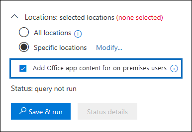

# <a name="searching-cloud-based-mailboxes-for-on-premises-users-in-office-365"></a><span data-ttu-id="01f9d-103">Pesquisando caixas de correio baseadas em nuvem para usuários locais no Office 365</span><span class="sxs-lookup"><span data-stu-id="01f9d-103">Searching cloud-based mailboxes for on-premises users in Office 365</span></span>

<span data-ttu-id="01f9d-p101">Se sua organização tiver uma implantação híbrida do Exchange e tiver habilitado o Microsoft Teams, os usuários poderão usar o aplicativo de chat do teams para mensagens instantâneas. Para o usuário baseado em nuvem, os dados de chat do Teams (também chamados de chats do 1xN) são salvos em sua caixa de correio baseada na nuvem principal. Quando um usuário local usa o aplicativo chat de equipe, sua caixa de correio principal está localizada no local. Para contornar essa limitação, a Microsoft lançou um novo recurso em que uma área de armazenamento baseada em nuvem (chamada de caixa de correio baseada em nuvem para usuários locais) é criada para armazenar dados de chat de equipes para usuários locais. Isso permite que você use a ferramenta de pesquisa de conteúdo no centro &amp; de conformidade de segurança do Office 365 para pesquisar e exportar dados de chat do teams para usuários locais.</span><span class="sxs-lookup"><span data-stu-id="01f9d-p101">If your organization has an Exchange hybrid deployment and has enabled Microsoft Teams, users can use the Teams chat application for instant messaging. For the cloud-based user, the Teams chat data (also called 1xN chats) is saved to their primary cloud-based mailbox. When an on-premises user uses the Team chat application, their primary mailbox is located on-premises. To get around this limitation, Microsoft has released a new feature where a cloud-based storage area (called a cloud-based mailbox for on-premises users) is created to store Teams chat data for on-premises users. This lets you use the Content Search tool in the Office 365 Security &amp; Compliance Center to search and export Teams chat data for on-premises users.</span></span> 
  
<span data-ttu-id="01f9d-109">Estes são os requisitos e limitações para configurar e configurar e Pesquisar caixas de correio baseadas em nuvem para usuários locais:</span><span class="sxs-lookup"><span data-stu-id="01f9d-109">Here are the requirements and limitation for setting up and to set up and search cloud-based mailboxes for on-premises users:</span></span>
  
- <span data-ttu-id="01f9d-p102">As contas de usuário no serviço de diretório local (como Active Directory) devem ser sincronizadas com o Active Directory do Azure, o serviço de diretório no Office 365. Isso significa que uma conta de usuário de email é criada no Office 365 e é associada a um usuário cuja caixa de correio principal está localizada na organização local.</span><span class="sxs-lookup"><span data-stu-id="01f9d-p102">The user accounts in your on-premises directory service (such as Active Directory) must be synchronized with Azure Active Directory, the directory service in Office 365. This means that a mail user account is created in Office 365 and is associated with a user whose primary mailbox is located in the on-premises organization.</span></span>
    
- <span data-ttu-id="01f9d-p103">A caixa de correio baseada em nuvem para usuários locais é usada apenas para dados de chat de equipes de repositório. Um usuário local não pode entrar na caixa de correio baseada em nuvem ou acessar de qualquer forma. Ele não pode ser usado para enviar ou receber mensagens de email.</span><span class="sxs-lookup"><span data-stu-id="01f9d-p103">The cloud-based mailbox for on-premises users is used only store Teams chat data. An on-premises user can't sign in to the cloud-based mailbox or access in any way. It can't be used to send or receive email messages.</span></span> 
    
- <span data-ttu-id="01f9d-p104">Você precisa enviar uma solicitação ao suporte da Microsoft para permitir que sua organização pesquise dados de chat de equipes nas caixas de correio baseadas em nuvem para usuários locais. ConFira [como arquivar uma solicitação com o suporte da Microsoft para habilitar &amp; esse recurso no centro de conformidade de segurança](#filing-a-request-with-microsoft-support-to-enable-this-feature-in-the-security-amp-compliance-center) neste artigo.</span><span class="sxs-lookup"><span data-stu-id="01f9d-p104">You have to submit a request to Microsoft Support to enable your organization to search for Teams chat data in the cloud-based mailboxes for on-premises users. See [Filing a request with Microsoft Support to enable this feature in the Security &amp; Compliance Center](#filing-a-request-with-microsoft-support-to-enable-this-feature-in-the-security-amp-compliance-center) in this article.</span></span> 
    
 <span data-ttu-id="01f9d-p105">**Observação:** As conversas de canal do teams sempre são armazenadas na caixa de correio baseada em nuvem associada à equipe. Isso significa que você pode usar a pesquisa de conteúdo para pesquisar conversas de canal sem ter que arquivar uma solicitação de suporte. Para obter mais informações sobre como Pesquisar conversas de canal de equipes, consulte [searchIng Microsoft Teams and Office 365 groups](content-search.md#searching-microsoft-teams-and-office-365-groups).</span><span class="sxs-lookup"><span data-stu-id="01f9d-p105">**Note:** Teams channel conversations are always stored in the cloud-based mailbox that's associated with the Team. That means you can use Content Search to search channel conversations without have to file a support request. For more information about searching Teams channel conversations, see [Searching Microsoft Teams and Office 365 Groups](content-search.md#searching-microsoft-teams-and-office-365-groups).</span></span>
  
## <a name="how-it-works"></a><span data-ttu-id="01f9d-120">Como funciona</span><span class="sxs-lookup"><span data-stu-id="01f9d-120">How it works</span></span>

<span data-ttu-id="01f9d-p106">Se um usuário habilitado para o Microsoft Teams tem uma caixa de correio local e sua conta/identidade de usuário foi sincronizada com a nuvem, a Microsoft cria uma caixa de correio baseada em nuvem para armazenar dados de chat do 1xN Teams. Depois que os dados de bate-papo do teams são armazenados na caixa de correio baseada em nuvem, eles são indexados para pesquisa. Isso permite usar a pesquisa de conteúdo (e pesquisas associadas às ocorrências de descoberta eletrônica) para pesquisar, Visualizar e exportar dados de chat de equipes para usuários locais. você também pode usar \*\* \*\*\* os cmdlets do ComplianceSearch no PowerShell do &amp; centro de conformidade de segurança do Office 365 para pesquisar dados de chat do teams para usuários locais.</span><span class="sxs-lookup"><span data-stu-id="01f9d-p106">If a Microsoft Teams-enabled user has an on-premises mailbox and their user account/identity has been synched to the cloud, Microsoft creates a cloud-based mailbox to store 1xN Teams chat data. After the Teams chat data is stored in the cloud-based mailbox, it's indexed for search. This lets you Use Content Search (and searches associated with eDiscovery cases) to search, preview, and export Teams chat data for on-premises users. You can also use **\*ComplianceSearch** cmdlets in the Office 365 Security &amp; Compliance Center PowerShell to search for Teams chat data for on-premises users.</span></span> 
  
<span data-ttu-id="01f9d-125">O gráfico a seguir mostra o fluxo de trabalho de como os dados de chat do Microsoft Teams para usuários locais estão disponíveis para pesquisa, visualização e exportação.</span><span class="sxs-lookup"><span data-stu-id="01f9d-125">The following graphic shows the workflow of how Teams chat data for on-premises users is available to search, preview, and export.</span></span>
  

  
<span data-ttu-id="01f9d-127">Além desse novo recurso, você ainda pode usar a pesquisa de conteúdo para pesquisar, Visualizar e exportar o conteúdo do teams no site do SharePoint baseado na nuvem e na caixa de correio do Exchange associada a todos os dados de chat do Microsoft Team e do 1xN Teams na caixa de correio do Exchange Online para usuários baseados em nuvem.</span><span class="sxs-lookup"><span data-stu-id="01f9d-127">In addition to this new capability, you can still use Content Search to search, preview, and export Teams content in the cloud-based SharePoint site and Exchange mailbox associated with each Microsoft Team and 1xN Teams chat data in the Exchange Online mailbox for cloud-based users.</span></span>

## <a name="filing-a-request-with-microsoft-support-to-enable-this-feature-in-the-security-amp-compliance-center"></a><span data-ttu-id="01f9d-128">Arquivar uma solicitação com o suporte da Microsoft para habilitar esse recurso &amp; no centro de conformidade de segurança</span><span class="sxs-lookup"><span data-stu-id="01f9d-128">Filing a request with Microsoft Support to enable this feature in the Security &amp; Compliance Center</span></span>

<span data-ttu-id="01f9d-p107">Você deve arquivar uma solicitação com o suporte da Microsoft para permitir que sua organização Use a interface gráfica do &amp; usuário no centro de conformidade de segurança para pesquisar dados de chat de equipes nas caixas de correio baseadas em nuvem para usuários locais. Observe que esse recurso está disponível no PowerShell do centro &amp; de conformidade de segurança do Office 365. Você não precisa enviar uma solicitação de suporte para usar o PowerShell para pesquisar dados de chat do teams para usuários locais.</span><span class="sxs-lookup"><span data-stu-id="01f9d-p107">You must file a request with Microsoft Support to enable your organization to use the graphical user interface in the Security &amp; Compliance Center to search for Teams chat data in the cloud-based mailboxes for on-premises users. Note that this feature is available in Office 365 Security &amp; Compliance Center PowerShell. You don't have to submit a support request to use PowerShell to search for Teams chat data for on-premises users.</span></span> 
  
<span data-ttu-id="01f9d-132">Inclua as seguintes informações ao enviar a solicitação para o suporte da Microsoft:</span><span class="sxs-lookup"><span data-stu-id="01f9d-132">Include the following information when you submit the request to Microsoft Support:</span></span>
  
- <span data-ttu-id="01f9d-133">O nome de domínio padrão da sua organização do Office 365.</span><span class="sxs-lookup"><span data-stu-id="01f9d-133">The default domain name of your Office 365 organization.</span></span>
    
- <span data-ttu-id="01f9d-p108">O nome do locatário e a ID do locatário de sua organização do Office 365. Você pode encontrá-los no portal do Azure Active Directory (em **gerenciar** \> **Propriedades**). ConFira [localizar sua ID de locatário do Office 365](https://support.office.com/article/6891b561-a52d-4ade-9f39-b492285e2c9b).</span><span class="sxs-lookup"><span data-stu-id="01f9d-p108">The tenant name and tenant ID of your Office 365 organization. You can find these in the Azure Active Directory portal (under **Manage** \> **Properties**). See [Find your Office 365 tenant ID](https://support.office.com/article/6891b561-a52d-4ade-9f39-b492285e2c9b).</span></span>
    
- <span data-ttu-id="01f9d-p109">O seguinte título ou descrição da finalidade da solicitação de suporte: "Habilitar pesquisa de conteúdo de aplicativo para usuários locais". Isso ajudará a encaminhar a solicitação para a equipe de engenharia de descoberta eletrônica do Office 365 que implementará a solicitação.</span><span class="sxs-lookup"><span data-stu-id="01f9d-p109">The following title or description of the purpose of the support request: "Enable Application Content Search for On-premises Users". This will help route the request to the Office 365 eDiscovery engineering team who will implement the request.</span></span> 
    
<span data-ttu-id="01f9d-p110">Após a alteração da engenharia ser feita, o suporte da Microsoft lhe enviará uma data de implantação estimada. Observe que o processo de implantação geralmente leva 2-3 semanas após o envio da solicitação de suporte.</span><span class="sxs-lookup"><span data-stu-id="01f9d-p110">After the engineering change is made, Microsoft Support will send you an estimated deployment date. Note that the deployment process usually takes 2-3 weeks after you submit the support request.</span></span> 
  
### <a name="what-happens-after-this-feature-is-enabled"></a><span data-ttu-id="01f9d-141">O que acontece depois que este recurso é habilitado?</span><span class="sxs-lookup"><span data-stu-id="01f9d-141">What happens after this feature is enabled?</span></span>

<span data-ttu-id="01f9d-142">Depois que esse recurso é implantado na sua organização do Office 365, as seguintes alterações são feitas na pesquisa de conteúdo e nas pesquisas associadas a uma &amp; ocorrência de descoberta eletrônica no centro de conformidade de segurança:</span><span class="sxs-lookup"><span data-stu-id="01f9d-142">After this feature is deployed in your Office 365 organization, the following changes are made in Content Search and in searches associated with an eDiscovery case in the Security &amp; Compliance Center:</span></span>
  
- <span data-ttu-id="01f9d-143">A caixa de seleção **adicionar conteúdo do aplicativo do Office para usuários locais** é adicionada sob os **locais** na pesquisa de conteúdo.</span><span class="sxs-lookup"><span data-stu-id="01f9d-143">The **Add Office app content for on-premises users** checkbox is added under the **Locations** in Content Search.</span></span> 
    
    
  
- <span data-ttu-id="01f9d-145">Os usuários locais são exibidos no seletor de locais de conteúdo que você usa para selecionar caixas de correio de usuário para pesquisa.</span><span class="sxs-lookup"><span data-stu-id="01f9d-145">On-premises users are displayed in the content locations picker that you use to select user mailboxes to search.</span></span> 
    

  
## <a name="searching-for-teams-chat-content-in-cloud-based-mailboxes-for-on-premises-users"></a><span data-ttu-id="01f9d-146">Pesquisando conteúdo de chat do teams em caixas de correio baseadas em nuvem para usuários locais</span><span class="sxs-lookup"><span data-stu-id="01f9d-146">Searching for Teams chat content in cloud-based mailboxes for on-premises users</span></span>

<span data-ttu-id="01f9d-147">Após a habilitação do recurso, você pode usar a pesquisa de conteúdo no &amp; centro de conformidade de segurança para pesquisar dados de chat de equipes nas caixas de correio baseadas em nuvem para usuários locais.</span><span class="sxs-lookup"><span data-stu-id="01f9d-147">After the feature has been enabled, you can use Content Search in the Security &amp; Compliance Center to search for Teams chat data in the cloud-based mailboxes for on-premises users.</span></span> 
  
1. <span data-ttu-id="01f9d-148">No centro de &amp; conformidade de segurança, vá para pesquisa de \> **conteúdo** de \*\*investigação de pesquisa &amp; \*\*</span><span class="sxs-lookup"><span data-stu-id="01f9d-148">In the Security &amp; Compliance Center, go to **Search &amp; investigation** \> **Content search**</span></span>
    
2. <span data-ttu-id="01f9d-149">Na página de **pesquisa** , clique  ícone **nova pesquisa**.</span><span class="sxs-lookup"><span data-stu-id="01f9d-149">On the **Search** page, click  **New search**.</span></span>
    
    <span data-ttu-id="01f9d-p111">Como explicado anteriormente, a caixa de seleção **adicionar conteúdo do aplicativo do Office para usuários locais** é exibida em **locais**. Observe que ela está selecionada por padrão.</span><span class="sxs-lookup"><span data-stu-id="01f9d-p111">As previously explained, the **Add Office app content for on-premises users** checkbox is displayed under **Locations**. Note that it is selected by default.</span></span>
    
3. <span data-ttu-id="01f9d-p112">Crie a consulta de palavra-chave e adicione condições à consulta de pesquisa, se necessário. Para pesquisar dados de chats de equipe apenas, você pode adicionar a seguinte consulta na caixa **palavras-chave** :</span><span class="sxs-lookup"><span data-stu-id="01f9d-p112">Create the keyword query and add conditions to the search query if necessary. To only search for Team chats data, you can add the following query in the **Keywords** box:</span></span> 
    
    ```
    kind:im
    ``` 

4. <span data-ttu-id="01f9d-154">Neste ponto, você pode escolher uma das seguintes opções em **locais**:</span><span class="sxs-lookup"><span data-stu-id="01f9d-154">At this point, you can choose one of the following options under **Locations**:</span></span>
    
    - <span data-ttu-id="01f9d-p113">**Todos os locais** -Selecione essa opção para pesquisar as caixas de correio de todos os usuários em sua organização. Quando a caixa de seleção é selecionada, todas as caixas de correio baseadas em nuvem para usuários locais também serão pesquisadas.</span><span class="sxs-lookup"><span data-stu-id="01f9d-p113">**All locations** - Select this option to search the mailboxes of all users in your organization. When the checkbox is selected, all cloud-based mailboxes for on-premises users will also be searched.</span></span> 
    
    - <span data-ttu-id="01f9d-p114">**Locais específicos** -Selecione essa opção e clique em **Modificar** \> escolher usuário, grupos ou equipes para pesquisar caixas de correio específicas. Conforme explicado anteriormente, o seletor de locais permitirá que você pesquise os usuários locais.</span><span class="sxs-lookup"><span data-stu-id="01f9d-p114">**Specific locations** - Select this option and then click **Modify** \> Choose user, groups, or teams to search specific mailboxes. As previously explained, the locations picker will let you search for on-premises users.</span></span> 
    
5. <span data-ttu-id="01f9d-p115">Salve e execute a pesquisa. Quaisquer resultados de pesquisa das caixas de correio baseadas em nuvem para usuários locais podem ser visualizados como qualquer outro resultado de pesquisa. Além disso, você pode exportar os resultados da pesquisa (incluindo quaisquer dados de chat do Teams) para um arquivo PST. Para obter mais informações, consulte:</span><span class="sxs-lookup"><span data-stu-id="01f9d-p115">Save and run the search. Any search results from the cloud-based mailboxes for on-premises users can be previewed like any other search results. Additionally, you can you can export the search results (including any Teams chat data) to a PST file. For more information, see:</span></span> 
    
    - [<span data-ttu-id="01f9d-163">Criar uma nova pesquisa</span><span class="sxs-lookup"><span data-stu-id="01f9d-163">Create a new search</span></span>](content-search.md#create-a-new-search)
    
    - [<span data-ttu-id="01f9d-164">Visualização de resultados de pesquisa</span><span class="sxs-lookup"><span data-stu-id="01f9d-164">Preview search results</span></span>](content-search.md#preview-search-results)
    
    - [<span data-ttu-id="01f9d-165">Exportar resultados de pesquisa de conteúdo do centro de &amp; conformidade de segurança do Office 365</span><span class="sxs-lookup"><span data-stu-id="01f9d-165">Export Content Search results from the Office 365 Security &amp; Compliance Center</span></span>](export-search-results.md)
    
## <a name="using-powershell-to-search-for-teams-chat-data-in-cloud-based-mailboxes-for-on-premises-users"></a><span data-ttu-id="01f9d-166">Usando o PowerShell para pesquisar dados de chat do teams em caixas de correio baseadas em nuvem para usuários locais</span><span class="sxs-lookup"><span data-stu-id="01f9d-166">Using PowerShell to search for Teams chat data in cloud-based mailboxes for on-premises users</span></span>

<span data-ttu-id="01f9d-p116">Você pode usar os cmdlets **New-ComplianceSearch** e **set-ComplianceSearch** no PowerShell do centro de &amp; conformidade de segurança do Office 365 para pesquisar a caixa de correio baseada em nuvem para usuários locais. Conforme explicado anteriormente, você não precisa enviar uma solicitação de suporte para usar o PowerShell para pesquisar dados de chat do teams para usuários locais.</span><span class="sxs-lookup"><span data-stu-id="01f9d-p116">You can use the **New-ComplianceSearch** and **Set-ComplianceSearch** cmdlets in the Office 365 Security &amp; Compliance Center PowerShell to search the cloud-based mailbox for on-premises users. As previously explained, you don't have to submit a support request to use PowerShell to search for Teams chat data for on-premises users.</span></span> 
  
1. <span data-ttu-id="01f9d-169">[Conecte-se ao PowerShell &amp; do centro de conformidade de segurança do Office 365](https://docs.microsoft.com/powershell/exchange/office-365-scc/connect-to-scc-powershell/connect-to-scc-powershell).</span><span class="sxs-lookup"><span data-stu-id="01f9d-169">[Connect to Office 365 Security &amp; Compliance Center PowerShell](https://docs.microsoft.com/powershell/exchange/office-365-scc/connect-to-scc-powershell/connect-to-scc-powershell).</span></span>
    
2. <span data-ttu-id="01f9d-170">Execute o seguinte comando do PowerShell para criar um novo conteúdo pesquisa as caixas de correio baseadas em nuvem de usuários locais.</span><span class="sxs-lookup"><span data-stu-id="01f9d-170">Run the following PowerShell command to create a new content searches the cloud-based mailboxes of on-premises users.</span></span>
    
    ```
    New-ComplianceSearch <name of new search> -ContentMatchQuery <search query> -ExchangeLocation <on-premises user> -IncludeUserAppContent $true -AllowNotFoundExchangeLocationsEnabled $true  
    ```
   
    <span data-ttu-id="01f9d-p117">O parâmetro *IncludeUserAppContent* é usado para especificar a caixa de correio baseada em nuvem para o usuário ou usuários que são especificados pelo parâmetro *ExchangeLocation* . O *AllowNotFoundExchangeLocationsEnabled* permite caixas de correio baseadas em nuvem para usuários locais. Quando você usa o `$true` valor para esse parâmetro, a pesquisa não tenta validar a existência da caixa de correio antes de ser executada. Isso é necessário para pesquisar as caixas de correio baseadas em nuvem para usuários locais, pois esses tipos de caixas de correio não são resolvidos como caixas de correio normais.</span><span class="sxs-lookup"><span data-stu-id="01f9d-p117">The  *IncludeUserAppContent*  parameter is used to specify the cloud-based mailbox for the user or users who are specified by the  *ExchangeLocation*  parameter. The  *AllowNotFoundExchangeLocationsEnabled*  allows cloud-based mailboxes for on-premises users. When you use the `$true` value for this parameter, the search doesn't try to validate the existence of the mailbox before it runs. This is required to search the cloud-based mailboxes for on-premises users because these types of mailboxes don't resolve as regular mailboxes.</span></span> 
    
    <span data-ttu-id="01f9d-175">O exemplo a seguir procura por chats do Teams (que são mensagens instantâneas) que contêm palavra-chave "Redstone" na caixa de correio baseada em nuvem de Sara Davis, que é um usuário local na organização Contoso.</span><span class="sxs-lookup"><span data-stu-id="01f9d-175">The following example searches for Teams chats (which are instant messages) that contain keyword "redstone" in the cloud-based mailbox of Sara Davis, who is an on-premises user in the Contoso organization.</span></span>
  
    ```
    New-ComplianceSearch "Redstone_Search" -ContentMatchQuery "redstone AND kind:im" -ExchangeLocation sarad@contoso.com -IncludeUserAppContent $true -AllowNotFoundExchangeLocationsEnabled $true  
    ```

   <span data-ttu-id="01f9d-176">Depois de criar uma nova pesquisa, certifique-se de usar o cmdlet **Start-ComplianceSearch** para executar a pesquisa.</span><span class="sxs-lookup"><span data-stu-id="01f9d-176">After you create a new search, be sure to use the **Start-ComplianceSearch** cmdlet to run the search.</span></span> 
  
<span data-ttu-id="01f9d-177">Para obter mais informações sobre como usar esses cmdlets, consulte:</span><span class="sxs-lookup"><span data-stu-id="01f9d-177">For more information using these cmdlets, see:</span></span>
  
- [<span data-ttu-id="01f9d-178">New-ComplianceSearch</span><span class="sxs-lookup"><span data-stu-id="01f9d-178">New-ComplianceSearch</span></span>](https://docs.microsoft.com/powershell/module/exchange/policy-and-compliance-content-search/new-compliancesearch)
    
- [<span data-ttu-id="01f9d-179">Set-ComplianceSearch</span><span class="sxs-lookup"><span data-stu-id="01f9d-179">Set-ComplianceSearch</span></span>](https://docs.microsoft.com/powershell/module/exchange/policy-and-compliance-content-search/set-compliancesearch)
    
- [<span data-ttu-id="01f9d-180">Start-ComplianceSearch</span><span class="sxs-lookup"><span data-stu-id="01f9d-180">Start-ComplianceSearch</span></span>](https://docs.microsoft.com/powershell/module/exchange/policy-and-compliance-content-search/start-compliancesearch)
    

## <a name="known-issues"></a><span data-ttu-id="01f9d-181">Problemas conhecidos</span><span class="sxs-lookup"><span data-stu-id="01f9d-181">Known issues</span></span>

- <span data-ttu-id="01f9d-p118">No momento, só é possível pesquisar, Visualizar e exportar conteúdo em caixas de correio baseadas em nuvem para usuários locais. Não há suporte para a colocação de uma caixa de correio baseada em nuvem para um usuário local em um bloqueio associado a um caso de descoberta eletrônica ou a atribuição de uma política de retenção do Office 365.</span><span class="sxs-lookup"><span data-stu-id="01f9d-p118">Currently, you can only search, preview, and export content in cloud-based mailboxes for on-premises users. Placing a cloud-based mailbox for an on-premises user on a hold associated with an eDiscovery case or assigning it to an Office 365 retention policy is not supported.</span></span> 
    
- <span data-ttu-id="01f9d-p119">O seletor de local de conteúdo para descoberta eletrônica exibe os usuários locais e permite que você os selecione. No enTanto, conforme explicado anteriormente, a suspensão não será aplicada ao usuário local.</span><span class="sxs-lookup"><span data-stu-id="01f9d-p119">The content location picker for eDiscovery holds displays on-premises users and will let you select them. However, as previously explained the hold will not be applied to the on-premises user.</span></span>
    
## <a name="frequently-asked-questions"></a><span data-ttu-id="01f9d-186">Perguntas frequentes</span><span class="sxs-lookup"><span data-stu-id="01f9d-186">Frequently asked questions</span></span>

 <span data-ttu-id="01f9d-187">**Onde são localizadas caixas de correio baseadas em nuvem para usuários locais?**</span><span class="sxs-lookup"><span data-stu-id="01f9d-187">**Where are cloud-based mailboxes for on-premises users located?**</span></span>
  
<span data-ttu-id="01f9d-188">Caixas de correio baseadas em nuvem são criadas e armazenadas no mesmo datacenter que sua organização do Office 365.</span><span class="sxs-lookup"><span data-stu-id="01f9d-188">Cloud-based mailboxes are created and stored in the same datacenter as your Office 365 organization.</span></span> 
  
 <span data-ttu-id="01f9d-189">**Há outros requisitos diferentes de enviar uma solicitação de suporte?**</span><span class="sxs-lookup"><span data-stu-id="01f9d-189">**Are there any other requirements other than submitting a support request?**</span></span>
  
 <span data-ttu-id="01f9d-p120">Conforme explicado anteriormente, as identidades de usuários com caixas de correio locais devem ser sincronizadas com a sua organização baseada em nuvem para que uma conta de usuário de email correspondente seja criada para cada conta de usuário local no Office 365. Além disso, sua organização deve ter uma assinatura empresarial do Office 365, como uma assinatura do Office 365 Enterprise E1, E3 ou e5.</span><span class="sxs-lookup"><span data-stu-id="01f9d-p120">As previously explained, the identities of users with on-prem mailboxes must be synchronized to your cloud-based organization so that a corresponding mail user account is created for each on-premises user account in Office 365. Additionally, your organization must have an Office 365 enterprise subscription, such as an Office 365 Enterprise E1, E3, or E5 subscription.</span></span> 
  
 <span data-ttu-id="01f9d-192">**Há um risco de perder os dados de chat do Microsoft Teams se a caixa de correio local do usuário for migrada para a nuvem?**</span><span class="sxs-lookup"><span data-stu-id="01f9d-192">**Is there a risk of losing the Teams chat data if the user's on-premises mailbox is migrated to the cloud?**</span></span>
  
<span data-ttu-id="01f9d-p121">Não. Quando você migrar a caixa de correio principal de um usuário local para a nuvem, os dados de chat do teams para esse usuário serão migrados para sua nova caixa de correio principal baseada na nuvem.</span><span class="sxs-lookup"><span data-stu-id="01f9d-p121">No. When you migrate the primary mailbox of an on-premises user to the cloud, the Teams chat data for that user will be migrated to their new cloud-based primary mailbox.</span></span>
  
 <span data-ttu-id="01f9d-195">**Posso aplicar uma política de retenção de descoberta eletrônica ou do Office 365 a usuários locais?**</span><span class="sxs-lookup"><span data-stu-id="01f9d-195">**Can I apply an eDiscovery hold or Office 365 retention policies to on-premises users?**</span></span>
  
<span data-ttu-id="01f9d-196">Não.</span><span class="sxs-lookup"><span data-stu-id="01f9d-196">No.</span></span>
  
 <span data-ttu-id="01f9d-197">**A pesquisa de conteúdo pode localizar chats mais antigos de equipes para usuários locais antes do momento em que minha organização enviou a solicitação para habilitar esse recurso?**</span><span class="sxs-lookup"><span data-stu-id="01f9d-197">**Can Content Search find older Teams chats for on-premises users before the time my organization submitted the request to enable this feature?**</span></span>
  
<span data-ttu-id="01f9d-p122">A Microsoft começou a armazenar dados de chat do Microsoft Teams para usuários locais em 31 de janeiro de 2018. Portanto, se a identidade de um usuário do teams local tiver sido sincronizada entre o Active Directory e o Azure Active Directory desde essa data, os dados de chat de suas equipes serão armazenados em uma caixa de correio baseada em nuvem e poderão ser pesquisados usando a pesquisa de conteúdo. A Microsoft também está trabalhando no armazenamento de dados de chat do Microsoft Teams de antes de 31 de janeiro de 2018 nas caixas de correio baseadas em nuvem para usuários locais. Mais informações sobre isso estarão disponíveis em breve.</span><span class="sxs-lookup"><span data-stu-id="01f9d-p122">Microsoft started storing the Teams chat data for on-premises users on January 31, 2018. So, if the identity of an on-premises Teams user has been synched between Active Directory and Azure Active Directory since this date, then their Teams chat data will be stored in a cloud-based mailbox and will be searchable using Content Search. Microsoft is also working on storing Teams chat data from prior to January 31, 2018 in the cloud-based mailboxes for on-premises users. More information about this will be available soon.</span></span>
