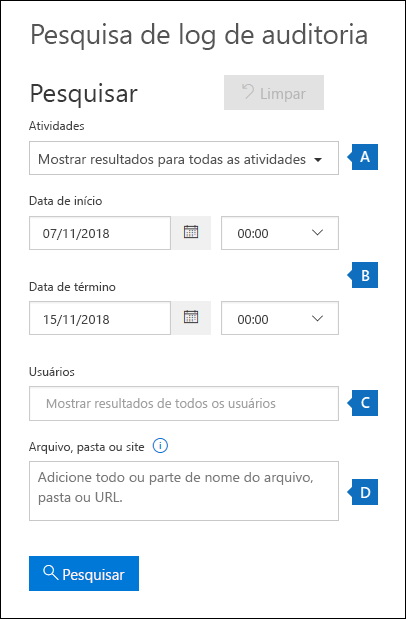
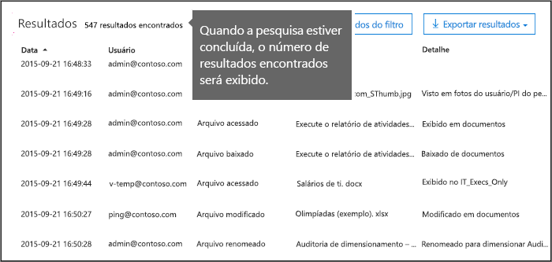
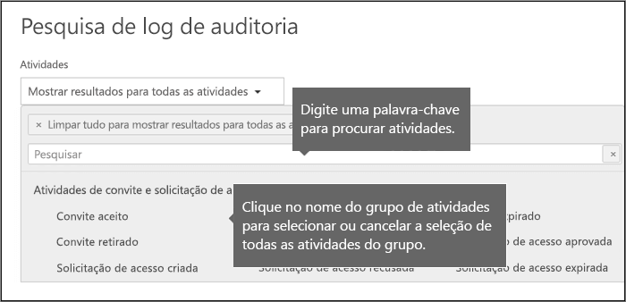
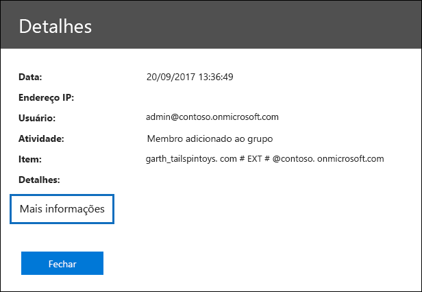
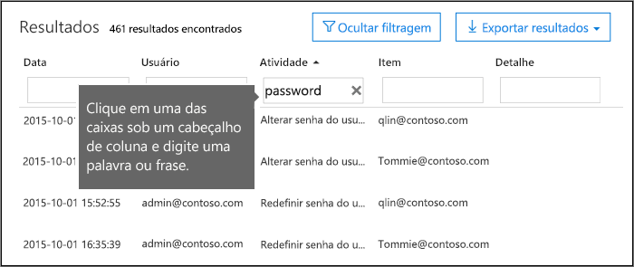
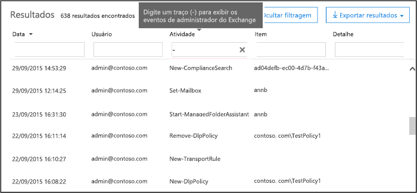

# <a name="search-the-audit-log-in-the-office-365-security--compliance-center"></a><span data-ttu-id="18a9f-103">O log de auditoria de pesquisa do Centro de conformidade do & de segurança do Office 365</span><span class="sxs-lookup"><span data-stu-id="18a9f-103">Search the audit log in the Office 365 Security & Compliance Center</span></span>

<span data-ttu-id="18a9f-p101">Precisa encontrar se um usuário exibido um documento específico ou removidos de um item de suas caixas de correio? Se precisar, você pode usar a segurança do Office 365 &amp; Centro de conformidade para pesquisar o log de auditoria unificada para exibir a atividade de administrador e usuário em sua organização do Office 365. Por que uma auditoria unificada efetuar? Porque você pode pesquisar os seguintes tipos de atividade do usuário e administração no Office 365:</span><span class="sxs-lookup"><span data-stu-id="18a9f-p101">Need to find if a user viewed a specific document or purged an item from their mailbox? If so, you can use the Office 365 Security &amp; Compliance Center to search the unified audit log to view user and administrator activity in your Office 365 organization. Why a unified audit log? Because you can search for the following types of user and admin activity in Office 365:</span></span>
  
- <span data-ttu-id="18a9f-108">Atividade do usuário no SharePoint Online e o OneDrive for Business</span><span class="sxs-lookup"><span data-stu-id="18a9f-108">User activity in SharePoint Online and OneDrive for Business</span></span>
    
- <span data-ttu-id="18a9f-109">Atividade do usuário no Exchange Online (log de auditoria de caixa de correio do Exchange)</span><span class="sxs-lookup"><span data-stu-id="18a9f-109">User activity in Exchange Online (Exchange mailbox audit logging)</span></span>
    
    > [!IMPORTANT]
    > <span data-ttu-id="18a9f-p102">Auditoria de caixa de correio log deve ser ativado para cada caixa de correio do usuário antes de atividade do usuário no Exchange Online será registrada. Para obter mais informações, consulte [Habilitar caixa de correio auditorias no Office 365](enable-mailbox-auditing.md).</span><span class="sxs-lookup"><span data-stu-id="18a9f-p102">Mailbox audit logging must be turned on for each user mailbox before user activity in Exchange Online will be logged. For more information, see [Enable mailbox auditing in Office 365](enable-mailbox-auditing.md).</span></span>
  
- <span data-ttu-id="18a9f-112">Atividade de administração no SharePoint Online</span><span class="sxs-lookup"><span data-stu-id="18a9f-112">Admin activity in SharePoint Online</span></span>
    
- <span data-ttu-id="18a9f-113">Atividade de administração no Windows Azure Active Directory (o serviço de diretório para o Office 365)</span><span class="sxs-lookup"><span data-stu-id="18a9f-113">Admin activity in Azure Active Directory (the directory service for Office 365)</span></span>
    
- <span data-ttu-id="18a9f-114">Atividade de administrador no Exchange Online (log de auditoria do administrador do Exchange)</span><span class="sxs-lookup"><span data-stu-id="18a9f-114">Admin activity in Exchange Online (Exchange admin audit logging)</span></span>
    
- <span data-ttu-id="18a9f-115">Atividade do usuário e administração no Sway</span><span class="sxs-lookup"><span data-stu-id="18a9f-115">User and admin activity in Sway</span></span>
    
- <span data-ttu-id="18a9f-116">atividades de descoberta eletrônica no Centro de conformidade do & de segurança do Office 365</span><span class="sxs-lookup"><span data-stu-id="18a9f-116">eDiscovery activities in the Office 365 Security & Compliance Center</span></span>
    
- <span data-ttu-id="18a9f-117">Atividade do usuário e administração no Power BI</span><span class="sxs-lookup"><span data-stu-id="18a9f-117">User and admin activity in Power BI</span></span>
    
- <span data-ttu-id="18a9f-118">Atividade do administrador e usuário em Teams da Microsoft</span><span class="sxs-lookup"><span data-stu-id="18a9f-118">User and admin activity in Microsoft Teams</span></span>

- <span data-ttu-id="18a9f-119">Atividade do usuário e administração no Dynamics 365</span><span class="sxs-lookup"><span data-stu-id="18a9f-119">User and admin activity in Dynamics 365</span></span>
    
- <span data-ttu-id="18a9f-120">Atividade do usuário e administração no Yammer</span><span class="sxs-lookup"><span data-stu-id="18a9f-120">User and admin activity in Yammer</span></span>
 
- <span data-ttu-id="18a9f-121">Atividade do administrador e usuário no Microsoft Flow</span><span class="sxs-lookup"><span data-stu-id="18a9f-121">User and admin activity in Microsoft Flow</span></span>
    
- <span data-ttu-id="18a9f-122">Atividade do administrador e usuário em Stream da Microsoft</span><span class="sxs-lookup"><span data-stu-id="18a9f-122">User and admin activity in Microsoft Stream</span></span>

- <span data-ttu-id="18a9f-123">Atividade do administrador e analista na análise de local de trabalho do Microsoft</span><span class="sxs-lookup"><span data-stu-id="18a9f-123">Analyst and admin activity in Microsoft Workplace Analytics</span></span>
    
   
## <a name="before-you-begin"></a><span data-ttu-id="18a9f-124">Antes de começar</span><span class="sxs-lookup"><span data-stu-id="18a9f-124">Before you begin</span></span>

<span data-ttu-id="18a9f-125">Certifique-se de ler o log de auditoria de itens a seguir antes de você inicia a pesquisa do Office 365.</span><span class="sxs-lookup"><span data-stu-id="18a9f-125">Be sure to read the following items before you start searching the Office 365 audit log.</span></span>
  
- <span data-ttu-id="18a9f-p103">Você (ou outro administrador) deve primeiro ativar log de auditoria antes de começar a pesquisar o log de auditoria do Office 365. Para ativá-lo, basta clicar em **Iniciar gravação de usuário e a atividade de admin** na página de **pesquisa de log de auditoria** na segurança &amp; Centro de conformidade. (Se você não vir este link, auditoria já foi ativado para sua organização.) Depois que você ativá-lo, será exibida uma mensagem que informa que o log de auditoria está sendo preparado e que você pode executar uma pesquisa de duas horas após a preparação estiver concluída. Você só precisa fazer isso vez.</span><span class="sxs-lookup"><span data-stu-id="18a9f-p103">You (or another admin) must first turn on audit logging before you can start searching the Office 365 audit log. To turn it on, just click **Start recording user and admin activity** on the **Audit log search** page in the Security &amp; Compliance Center. (If you don't see this link, auditing has already been turned on for your organization.) After you turn it on, a message is displayed that says the audit log is being prepared and that you can run a search in a couple of hours after the preparation is complete. You only have to do this once.</span></span> 
    
    > [!NOTE]
    > <span data-ttu-id="18a9f-p104">Estamos no processo de ativação de auditoria, por padrão. Enquanto isso, você pode ativá-lo conforme descrito anteriormente.</span><span class="sxs-lookup"><span data-stu-id="18a9f-p104">We're in the process of turning on auditing by default. Until then, you can turn it on as previously described.</span></span> 
  
- <span data-ttu-id="18a9f-p105">Você precisa ter a função Logs de auditoria somente para exibição ou Logs de auditoria no Exchange Online para pesquisar o log de auditoria do Office 365. Por padrão, essas funções são atribuídas aos grupos de função de gerenciamento de conformidade e gerenciamento da organização na página **permissões** no Centro de administração do Exchange. Para conceder a um usuário a capacidade de pesquisar o log de auditoria do Office 365 com o nível mínimo de privilégios, você pode criar um grupo de função personalizada no Exchange Online, adicionar a função Logs de auditoria somente para exibição ou Logs de auditoria e, em seguida, adicionar o usuário como um membro do novo grupo de função. Para obter mais informações, consulte a [função de gerenciar grupos no Exchange Online](https://go.microsoft.com/fwlink/p/?LinkID=730688).</span><span class="sxs-lookup"><span data-stu-id="18a9f-p105">You have to be assigned the View-Only Audit Logs or Audit Logs role in Exchange Online to search the Office 365 audit log. By default, these roles are assigned to the Compliance Management and Organization Management role groups on the **Permissions** page in the Exchange admin center. To give a user the ability to search the Office 365 audit log with the minimum level of privileges, you can create a custom role group in Exchange Online, add the View-Only Audit Logs or Audit Logs role, and then add the user as a member of the new role group. For more information, see [Manage role groups in Exchange Online](https://go.microsoft.com/fwlink/p/?LinkID=730688).</span></span>
    
    > [!IMPORTANT]
    > <span data-ttu-id="18a9f-p106">Se você atribuir um usuário a função Logs de auditoria somente para exibição ou Logs de auditoria na página **permissões** na segurança &amp; Centro de conformidade, eles não poderão pesquisar o log de auditoria do Office 365. Você precisa atribuir as permissões no Exchange Online. Isso ocorre porque o cmdlet subjacente usado para pesquisar o log de auditoria é um cmdlet do Exchange Online.</span><span class="sxs-lookup"><span data-stu-id="18a9f-p106">If you assign a user the View-Only Audit Logs or Audit Logs role on the **Permissions** page in the Security &amp; Compliance Center, they won't be able to search the Office 365 audit log. You have to assign the permissions in Exchange Online. This is because the underlying cmdlet used to search the audit log is an Exchange Online cmdlet.</span></span> 
  
- <span data-ttu-id="18a9f-p107">Quando uma atividade auditada é executada por um usuário ou administrador, um registro de auditoria é gerado e armazenado no log de auditoria do Office 365 para sua organização. O período de tempo que um registro de auditoria é retido (e pesquisável no log de auditoria) depende de sua assinatura do Office 365 e especificamente o tipo da licença atribuída a um usuário específico.</span><span class="sxs-lookup"><span data-stu-id="18a9f-p107">When an audited activity is performed by a user or admin, an audit record is generated and stored in the Office 365 audit log for your organization. The length of time that an audit record is retained (and searchable in the audit log) depends on your Office 365 subscription, and specifically the type of the license that is assigned to a specific user.</span></span>

     - <span data-ttu-id="18a9f-p108">**Office 365 E3** - auditoria registros são mantidos por 90 dias. Isso significa que você pode pesquisar o log de auditoria para atividades que foram executadas nos últimos 90 dias.</span><span class="sxs-lookup"><span data-stu-id="18a9f-p108">**Office 365 E3** - Audit records are retained for 90 days. That means you can search the audit log for activities that were performed within the last 90 days.</span></span>

     - <span data-ttu-id="18a9f-p109">**Office 365 E5** - auditoria registros são mantidos por 365 dias (um ano). Isso significa que você pode pesquisar o log de auditoria para atividades que foram executadas no último ano. Reter registros de auditoria para um ano também está disponível para usuários que recebem uma licença E3/Exchange Online plano 1 e têm uma licença de complemento de conformidade avançadas do Office 365.</span><span class="sxs-lookup"><span data-stu-id="18a9f-p109">**Office 365 E5** - Audit records are retained for 365 days (one year). That means you can search the audit log for activities that were performed within the last year. Retaining audit records for one year is also available for users that are assigned an E3/Exchange Online Plan 1 license and have an Office 365 Advanced Compliance add-on license.</span></span>

        > [!NOTE]
        > <span data-ttu-id="18a9f-p110">O período de retenção de um ano para registros de auditoria para organizações E5 (ou E3 organizações que têm licenças de complemento de conformidade avançados) está atualmente disponível apenas como parte de um programa de visualização particular. Para inscrever neste programa de visualização, uma solicitação ao [Suporte da Microsoft](https://docs.microsoft.com/en-us/office365/admin/contact-support-for-business-products?redirectSourcePath=%252fen-us%252farticle%252fcontact-support-for-business-products-admin-help-32a17ca7-6fa0-4870-8a8d-e25ba4ccfd4b&view=o365-worldwide&tabs=online) e incluem o seguinte conforme a descrição do que você precisa de Ajuda: "Longo prazo auditoria log privada visualização do Office 365".</span><span class="sxs-lookup"><span data-stu-id="18a9f-p110">The one-year retention period for audit records for E5 organizations (or E3 organizations that have Advanced Compliance add-on licenses) is currently available only as part of a private preview program. To enroll in this preview program, please file a request with [Microsoft Support](https://docs.microsoft.com/en-us/office365/admin/contact-support-for-business-products?redirectSourcePath=%252fen-us%252farticle%252fcontact-support-for-business-products-admin-help-32a17ca7-6fa0-4870-8a8d-e25ba4ccfd4b&view=o365-worldwide&tabs=online) and include the following as the description of what you need help with: "Long-term Office 365 audit log private preview".</span></span>

- <span data-ttu-id="18a9f-148">Se você deseja desativar a pesquisa de log de auditoria no Office 365 para sua organização, você pode executar o seguinte comando no PowerShell remoto conectado à sua organização do Exchange Online:</span><span class="sxs-lookup"><span data-stu-id="18a9f-148">If you want to turn off audit log search in Office 365 for your organization, you can run the following command in remote PowerShell connected to your Exchange Online organization:</span></span>
    
  ```
  Set-AdminAuditLogConfig -UnifiedAuditLogIngestionEnabled $false
  ```

    <span data-ttu-id="18a9f-149">Para ativar novamente a pesquisa de auditoria, você pode executar o seguinte comando no PowerShell do Exchange Online:</span><span class="sxs-lookup"><span data-stu-id="18a9f-149">To turn on audit search again, you can run the following command in Exchange Online PowerShell:</span></span>
    
  ```
  Set-AdminAuditLogConfig -UnifiedAuditLogIngestionEnabled $true
  ```

    <span data-ttu-id="18a9f-150">Para obter mais informações, consulte [desativar a pesquisa de log de auditoria no Office 365](turn-audit-log-search-on-or-off.md).</span><span class="sxs-lookup"><span data-stu-id="18a9f-150">For more information, see [Turn off audit log search in Office 365](turn-audit-log-search-on-or-off.md).</span></span>
    
- <span data-ttu-id="18a9f-p111">Conforme indicado anteriormente, o cmdlet subjacente usado para pesquisar o log de auditoria é um cmdlet do Exchange Online, que é **UnifiedAuditLog de pesquisa**. Isso significa que você pode usar esse cmdlet para pesquisar o log de auditoria do Office 365 em vez de usar a página de **pesquisa de log de auditoria** na segurança &amp; Centro de conformidade. Você precisa executar esse cmdlet do PowerShell remoto conectado à sua organização do Exchange Online. Para obter mais informações, consulte [UnifiedAuditLog de pesquisa](https://go.microsoft.com/fwlink/p/?linkid=834776).</span><span class="sxs-lookup"><span data-stu-id="18a9f-p111">As previously stated, the underlying cmdlet used to search the audit log is an Exchange Online cmdlet, which is **Search-UnifiedAuditLog**. That means you can use this cmdlet to search the Office 365 audit log instead of using the **Audit log search** page in the Security &amp; Compliance Center. You have to run this cmdlet in remote PowerShell connected to your Exchange Online organization. For more information, see [Search-UnifiedAuditLog](https://go.microsoft.com/fwlink/p/?linkid=834776).</span></span>
    
- <span data-ttu-id="18a9f-p112">Se você deseja baixar programaticamente os dados do log de auditoria do Office 365, é recomendável que você usar a API de atividade de gerenciamento do Office 365 em vez de usar um script do PowerShell. A API de atividade de gerenciamento do Office 365 é um serviço web REST que você pode usar para desenvolver soluções de monitoramento de conformidade para sua organização, segurança e operações. Para obter mais informações, consulte [referência de API de atividade de gerenciamento do Office 365](https://go.microsoft.com/fwlink/?linkid=852309).</span><span class="sxs-lookup"><span data-stu-id="18a9f-p112">If you want to programmatically download data from the Office 365 audit log, we recommend that you use the Office 365 Management Activity API instead of using a PowerShell script. The Office 365 Management Activity API is a REST web service that you can use to develop operations, security, and compliance monitoring solutions for your organization. For more information, see [Office 365 Management Activity API reference](https://go.microsoft.com/fwlink/?linkid=852309).</span></span>
    
- <span data-ttu-id="18a9f-p113">Ele pode levar até 30 minutos ou backup de 24 horas após um evento ocorre para a entrada de log de auditoria correspondente a ser exibido nos resultados da pesquisa. A tabela a seguir mostra o tempo que leva para os diferentes serviços no Office 365.</span><span class="sxs-lookup"><span data-stu-id="18a9f-p113">It can take up to 30 minutes or up to 24 hours after an event occurs for the corresponding audit log entry to be displayed in the search results. The following table shows the time it takes for the different services in Office 365.</span></span>
    
    |<span data-ttu-id="18a9f-160">**Serviço do Office 365**</span><span class="sxs-lookup"><span data-stu-id="18a9f-160">**Office 365 service**</span></span>|<span data-ttu-id="18a9f-161">**30 minutos**</span><span class="sxs-lookup"><span data-stu-id="18a9f-161">**30 minutes**</span></span>|<span data-ttu-id="18a9f-162">**24 horas**</span><span class="sxs-lookup"><span data-stu-id="18a9f-162">**24 hours**</span></span>|
    |:-----|:-----|:-----|
    |<span data-ttu-id="18a9f-163">Proteção contra ameaças avançadas e inteligência de ameaça</span><span class="sxs-lookup"><span data-stu-id="18a9f-163">Advanced Threat Protection and Threat Intelligence</span></span>  <br/> || |
    |<span data-ttu-id="18a9f-165">Azure Active Directory (eventos de logon do usuário)</span><span class="sxs-lookup"><span data-stu-id="18a9f-165">Azure Active Directory (user login events)</span></span>  <br/> ||           <br/> |
    |<span data-ttu-id="18a9f-167">Azure Active Directory (admin events)</span><span class="sxs-lookup"><span data-stu-id="18a9f-167">Azure Active Directory (admin events)</span></span>  <br/> || |
    |<span data-ttu-id="18a9f-169">Azure Active Directory (eventos de logon do usuário)</span><span class="sxs-lookup"><span data-stu-id="18a9f-169">Azure Active Directory (user login events)</span></span>  <br/> ||           <br/> |
    |<span data-ttu-id="18a9f-171">Prevenção contra perda de dados</span><span class="sxs-lookup"><span data-stu-id="18a9f-171">Data Loss Prevention</span></span>  <br/> |           <br/>| |
    |<span data-ttu-id="18a9f-173">Dynamics 365 CRM</span><span class="sxs-lookup"><span data-stu-id="18a9f-173">Dynamics 365 CRM</span></span> <br/> |           <br/>| |
    |<span data-ttu-id="18a9f-175">Descoberta Eletrônica</span><span class="sxs-lookup"><span data-stu-id="18a9f-175">eDiscovery</span></span>  <br/> |           <br/>| |
    |<span data-ttu-id="18a9f-177">Exchange Online</span><span class="sxs-lookup"><span data-stu-id="18a9f-177">Exchange Online</span></span>  <br/> |           <br/> ||
    |<span data-ttu-id="18a9f-179">Microsoft Flow</span><span class="sxs-lookup"><span data-stu-id="18a9f-179">Microsoft Flow</span></span>  <br/> |           <br/>| |
    |<span data-ttu-id="18a9f-181">Microsoft Forms</span><span class="sxs-lookup"><span data-stu-id="18a9f-181">Microsoft Forms</span></span>  <br/> |           <br/>| |
    |<span data-ttu-id="18a9f-183">Microsoft Project</span><span class="sxs-lookup"><span data-stu-id="18a9f-183">Microsoft Project</span></span>  <br/> |           <br/>| |
    |<span data-ttu-id="18a9f-185">Microsoft Stream</span><span class="sxs-lookup"><span data-stu-id="18a9f-185">Microsoft Stream</span></span>  <br/> |           <br/>| |
    |<span data-ttu-id="18a9f-187">Microsoft Teams</span><span class="sxs-lookup"><span data-stu-id="18a9f-187">Microsoft Teams</span></span>  <br/> |           <br/> ||
    |<span data-ttu-id="18a9f-189">Power BI</span><span class="sxs-lookup"><span data-stu-id="18a9f-189">Power BI</span></span>  <br/> |           <br/>| |
    |<span data-ttu-id="18a9f-191">Segurança &amp; Centro de conformidade</span><span class="sxs-lookup"><span data-stu-id="18a9f-191">Security &amp; Compliance Center</span></span>  <br/> |           <br/> ||
    |<span data-ttu-id="18a9f-193">SharePoint Online e OneDrive for Business</span><span class="sxs-lookup"><span data-stu-id="18a9f-193">SharePoint Online and OneDrive for Business</span></span>  <br/> |           <br/> ||
    |<span data-ttu-id="18a9f-195">Sway</span><span class="sxs-lookup"><span data-stu-id="18a9f-195">Sway</span></span>  <br/> ||           <br/> |
    |<span data-ttu-id="18a9f-197">Yammer</span><span class="sxs-lookup"><span data-stu-id="18a9f-197">Yammer</span></span>  <br/> ||           <br/> |
   
- <span data-ttu-id="18a9f-p114">Azure Active Directory (AD Azure) é o serviço de diretório para o Office 365. O log de auditoria unificada contém o usuário, grupo, aplicativo, domínio e atividades de diretório realizadas no Centro de administração do Office 365 ou no Azure no portal de gerenciamento. Para obter uma lista completa de eventos do Windows Azure AD, consulte [Eventos de relatório de auditoria do Active Directory do Windows Azure](https://go.microsoft.com/fwlink/p/?LinkID=616549).</span><span class="sxs-lookup"><span data-stu-id="18a9f-p114">Azure Active Directory (Azure AD) is the directory service for Office 365. The unified audit log contains user, group, application, domain, and directory activities performed in the Office 365 admin center or in the in Azure management portal. For a complete list of Azure AD events, see [Azure Active Directory Audit Report Events](https://go.microsoft.com/fwlink/p/?LinkID=616549).</span></span>
    
- <span data-ttu-id="18a9f-p115">Logs de auditoria Exchange Online consistem em dois tipos de eventos: eventos de administração (ações executadas pelos administradores) e eventos de caixa de correio (ações tomadas pelos usuários em caixas de correio) do Exchange. Observe que a auditoria de caixa de correio não está habilitado por padrão. Ela deve ser ativar para cada caixa de correio do usuário antes de eventos de caixa de correio podem ser pesquisados no log de auditoria do Office 365. Para obter mais informações sobre a auditoria de caixa de correio e a caixa de correio auditoria de ações que serão registradas, consulte [Habilitar caixa de correio auditorias no Office 365](enable-mailbox-auditing.md).</span><span class="sxs-lookup"><span data-stu-id="18a9f-p115">Exchange Online audit logs consist of two types of events: Exchange admin events (actions taken by administrators) and mailbox events (actions taken by users on mailboxes). Note that mailbox auditing isn't enabled by default. It must be enable for each user mailbox before mailbox events can be searched for in the Office 365 audit log. For more information about mailbox auditing and the mailbox auditing actions that are logged, see [Enable mailbox auditing in Office 365](enable-mailbox-auditing.md).</span></span>
    
- <span data-ttu-id="18a9f-p116">Log de auditoria para Power BI não está habilitado por padrão. Para procurar atividades Power BI no log de auditoria do Office 365, você precisa habilitar a auditoria no portal de administração do Power BI. Para obter instruções, consulte a seção "Logs de auditoria" no [portal de administração do Power BI](https://docs.microsoft.com/power-bi/service-admin-portal#audit-logs).</span><span class="sxs-lookup"><span data-stu-id="18a9f-p116">Audit logging for Power BI isn't enabled by default. To search for Power BI activities in the Office 365 audit log, you have to enable auditing in the Power BI admin portal. For instructions, see the "Audit logs" section in [Power BI admin portal](https://docs.microsoft.com/power-bi/service-admin-portal#audit-logs).</span></span>
    
    
## <a name="search-the-audit-log"></a><span data-ttu-id="18a9f-209">Pesquisas o log de auditoria</span><span class="sxs-lookup"><span data-stu-id="18a9f-209">Search the audit log</span></span>

<span data-ttu-id="18a9f-210">Aqui é o processo para pesquisar o log de auditoria no Office 365.</span><span class="sxs-lookup"><span data-stu-id="18a9f-210">Here's the process for searching the audit log in Office 365.</span></span>
  
[<span data-ttu-id="18a9f-211">Etapa 1: Executar uma pesquisa de log de auditoria</span><span class="sxs-lookup"><span data-stu-id="18a9f-211">Step 1: Run an audit log search</span></span>](#step-1-run-an-audit-log-search)
  
[<span data-ttu-id="18a9f-212">Etapa 2: Exibir os resultados da pesquisa</span><span class="sxs-lookup"><span data-stu-id="18a9f-212">Step 2: View the search results</span></span>](#step-2-view-the-search-results)

[<span data-ttu-id="18a9f-213">Etapa 3: Filtrar os resultados de pesquisa</span><span class="sxs-lookup"><span data-stu-id="18a9f-213">Step 3: Filter the search results</span></span>](#step-3-filter-the-search-results)

[<span data-ttu-id="18a9f-214">Etapa 4: Exportar os resultados da pesquisa para um arquivo</span><span class="sxs-lookup"><span data-stu-id="18a9f-214">Step 4: Export the search results to a file</span></span>](#step-4-export-the-search-results-to-a-file)
  
### <a name="step-1-run-an-audit-log-search"></a><span data-ttu-id="18a9f-215">Etapa 1: Executar uma pesquisa de log de auditoria</span><span class="sxs-lookup"><span data-stu-id="18a9f-215">Step 1: Run an audit log search</span></span>

1. <span data-ttu-id="18a9f-216">Acesse [https://protection.office.com](https://protection.office.com).</span><span class="sxs-lookup"><span data-stu-id="18a9f-216">Go to [https://protection.office.com](https://protection.office.com).</span></span>
    
    > [!TIP]
    > <span data-ttu-id="18a9f-p117">Usar uma sessão de navegação privada (não uma sessão normal) para acessar a segurança do Office 365 &amp; conformidade centraliza porque isso impedirá que as credenciais que você está conectado atualmente com sejam usados. Para abrir uma sessão de Navegação InPrivate no Internet Explorer ou Microsoft Edge, basta pressione CTRL + SHIFT + P. Para abrir uma sessão de navegação privada no Google Chrome (chamados de uma janela incognito), pressione CTRL + SHIFT + N.</span><span class="sxs-lookup"><span data-stu-id="18a9f-p117">Use a private browsing session (not a regular session) to access the Office 365 Security &amp; Compliance Center because this will prevent the credential that you are currently logged on with from being used. To open an InPrivate Browsing session in Internet Explorer or Microsoft Edge, just press CTRL+SHIFT+P. To open a private browsing session in Google Chrome (called an incognito window), press CTRL+SHIFT+N.</span></span> 
  
2. <span data-ttu-id="18a9f-220">Entre no Office 365 usando a sua conta corporativa ou de estudante.</span><span class="sxs-lookup"><span data-stu-id="18a9f-220">Sign in to Office 365 using your work or school account.</span></span>
    
3. <span data-ttu-id="18a9f-221">No painel à esquerda da segurança &amp; Centro de conformidade, clique em **pesquisa &amp; investigação**e clique em **pesquisa de log de auditoria**.</span><span class="sxs-lookup"><span data-stu-id="18a9f-221">In the left pane of the Security &amp; Compliance Center, click **Search &amp; investigation**, and then click **Audit log search**.</span></span>
    
    <span data-ttu-id="18a9f-222">A página de **pesquisa de log de auditoria** é exibida.</span><span class="sxs-lookup"><span data-stu-id="18a9f-222">The **Audit log search** page is displayed.</span></span> 
    
    
  
    > [!NOTE]
    > <span data-ttu-id="18a9f-p118">Você deve primeiro ativar o log de auditoria antes de executar uma pesquisa de log de auditoria. Se o link **Iniciar gravação atividade de administrador e usuário** for exibido, clique para ativar a auditoria. Se você não vir este link, auditoria já foi ativado para sua organização.</span><span class="sxs-lookup"><span data-stu-id="18a9f-p118">You have to first turn on audit logging before you can run an audit log search. If the **Start recording user and admin activity** link is displayed, click it to turn on auditing. If you don't see this link, auditing has already been turned on for your organization.</span></span> 
  
4. <span data-ttu-id="18a9f-227">Configure os seguintes critérios de pesquisa:</span><span class="sxs-lookup"><span data-stu-id="18a9f-227">Configure the following search criteria:</span></span>
    
    <span data-ttu-id="18a9f-p119">r. **atividades** clique na lista suspensa para exibir as atividades que você pode pesquisar. Atividades de administrador e usuário são organizadas em grupos de atividades relacionadas. Você pode selecionar atividades específicas ou você pode clicar no nome do grupo de atividade para selecionar todas as atividades no grupo. Você também pode clicar uma atividade selecionada para limpar a seleção. Após executar a pesquisa, apenas as entradas de log de auditoria para as atividades selecionadas são exibidas. A seleção de **Mostrar os resultados de todas as atividades** exibirá resultados para todas as atividades realizadas pelo usuário selecionado ou grupo de usuários.</span><span class="sxs-lookup"><span data-stu-id="18a9f-p119">a. **Activities** Click the drop-down list to display the activities that you can search for. User and admin activities are organized in to groups of related activities. You can select specific activities or you can click the activity group name to select all activities in the group. You can also click a selected activity to clear the selection. After you run the search, only the audit log entries for the selected activities are displayed. Selecting **Show results for all activities** will display results for all activities performed by the selected user or group of users.</span></span> 
    
    <span data-ttu-id="18a9f-p120">Mais de 100 atividades de administrador e usuário são registradas no log de auditoria do Office 365. Clique na guia **atividades auditadas** , no tópico deste artigo para ver as descrições de cada atividade em cada um dos serviços do Office 365 diferentes.</span><span class="sxs-lookup"><span data-stu-id="18a9f-p120">Over 100 user and admin activities are logged in the Office 365 audit log. Click the **Audited activities** tab at the topic of this article to see the descriptions of every activity in each of the different Office 365 services.</span></span> 
    
    <span data-ttu-id="18a9f-p121">b. **Data de início** e **Data de término** últimos sete dias são marcadas por padrão. Selecione um intervalo de data e hora para exibir os eventos que ocorreram dentro desse período. A data e hora são apresentados no formato Tempo Universal Coordenado (UTC). O intervalo de datas máximo que você pode especificar é 90 dias. Um erro será exibido se o intervalo de datas selecionado é maior que 90 dias.</span><span class="sxs-lookup"><span data-stu-id="18a9f-p121">b. **Start date** and **End date** The last seven days are selected by default. Select a date and time range to display the events that occurred within that period. The date and time are presented in Coordinated Universal Time (UTC) format. The maximum date range that you can specify is 90 days. An error is displayed if the selected date range is greater than 90 days.</span></span> 
    
    > [!TIP]
    > <span data-ttu-id="18a9f-p122">Se você estiver usando o intervalo de datas máximo de 90 dias, selecione a hora atual para a **Data de início**. Caso contrário, você receberá uma mensagem de erro informando que a data de início é anterior à data de término. Se você tiver ativado a auditoria nos últimos 90 dias, o intervalo de datas máximo não pode iniciar antes da data em que a auditoria foi ativada.</span><span class="sxs-lookup"><span data-stu-id="18a9f-p122">If you're using the maximum date range of 90 days, select the current time for the **Start date**. Otherwise, you'll receive an error saying that the start date is earlier than the end date. If you've turned on auditing within the last 90 days, the maximum date range can't start before the date that auditing was turned on.</span></span> 
  
    <span data-ttu-id="18a9f-p123">c. resultados para mais **os usuários** clicam nesta caixa e selecione um ou mais usuários para exibir a pesquisa. As entradas do log de auditoria da atividade selecionada executadas pelos usuários que você selecionar nesta caixa são exibidas na lista de resultados. Deixe esta caixa em branco para retornar as entradas para todos os usuários (e contas de serviço) em sua organização.</span><span class="sxs-lookup"><span data-stu-id="18a9f-p123">c. **Users** Click in this box and then select one or more users to display search results for. The audit log entries for the selected activity performed by the users you select in this box are displayed in the list of results. Leave this box blank to return entries for all users (and service accounts) in your organization.</span></span> 
    
    <span data-ttu-id="18a9f-p124">d. **site, arquivo ou pasta,** digite parte ou todo um nome de arquivo ou pasta para procurar a atividade relacionada ao arquivo da pasta que contém a palavra-chave especificada. Você também pode especificar uma URL de um arquivo ou pasta. Se você usar uma URL, certifique-se de que o tipo o caminho completo do URL, ou se você digitar apenas uma parte da URL, não inclua quaisquer caracteres especiais ou espaços.</span><span class="sxs-lookup"><span data-stu-id="18a9f-p124">d. **File, folder, or site** Type some or all of a file or folder name to search for activity related to the file of folder that contains the specified keyword. You can also specify a URL of a file or folder. If you use a URL, be sure the type the full URL path or if you just type a portion of the URL, don't include any special characters or spaces.</span></span> 
    
    <span data-ttu-id="18a9f-254">Deixe esta caixa em branco para retornar as entradas para todos os arquivos e pastas em sua organização.</span><span class="sxs-lookup"><span data-stu-id="18a9f-254">Leave this box blank to return entries for all files and folders in your organization.</span></span>
    
    > [!TIP]
    > <span data-ttu-id="18a9f-255">Se você estiver procurando por todas as atividades relacionadas a um **site**, adicione o símbolo de caractere curinga (\*) após a URL para retornar todas as entradas do site; Por exemplo, **"https://contoso-my.sharepoint.com/personal/\*"**.</span><span class="sxs-lookup"><span data-stu-id="18a9f-255">If you're looking for all activities related to a **site**, add the wildcard symbol (\*) after the URL to return all entries for that site; for example, **"https://contoso-my.sharepoint.com/personal/\*"**.</span></span>
    
5. <span data-ttu-id="18a9f-256">Clique em **pesquisa** para executar a pesquisa usando os critérios de pesquisa.</span><span class="sxs-lookup"><span data-stu-id="18a9f-256">Click **Search** to run the search using your search criteria.</span></span> 
    
    <span data-ttu-id="18a9f-p125">Os resultados da pesquisa são carregados e, após alguns momentos, eles são exibidos em **resultados**. Quando a pesquisa for concluída, o número de resultados encontrados é exibido. Observe que um máximo de 5.000 eventos será exibido no painel de **resultados** , em incrementos de 150 eventos; Se mais de 5.000 eventos atendam aos critérios de pesquisa, os eventos de 5.000 mais recentes serão exibidos.</span><span class="sxs-lookup"><span data-stu-id="18a9f-p125">The search results are loaded, and after a few moments they are displayed under **Results**. When the search is finished, the number of results found is displayed. Note that a maximum of 5,000 events will be displayed in the **Results** pane in increments of 150 events; if more than 5,000 events meet the search criteria, the most recent 5,000 events are displayed.</span></span> 
    
    
  
  
#### <a name="tips-for-searching-the-audit-log"></a><span data-ttu-id="18a9f-261">Dicas para pesquisar o log de auditoria</span><span class="sxs-lookup"><span data-stu-id="18a9f-261">Tips for searching the audit log</span></span>

- <span data-ttu-id="18a9f-p126">Você pode selecionar atividades específicas para procurar clicando no nome da atividade. Ou você pode pesquisar todas as atividades em um grupo (por exemplo, **as atividades de arquivos e pastas**), clicando no nome do grupo. Se uma atividade for selecionada, você pode clicar para cancelar a seleção. Você também pode usar a caixa de pesquisa para exibir as atividades que contêm a palavra-chave que você digita.</span><span class="sxs-lookup"><span data-stu-id="18a9f-p126">You can select specific activities to search for by clicking on the activity name. Or you can search for all activities in a group (such as **File and folder activities**) by clicking on the group name. If an activity is selected, you can click it to cancel the selection. You can also use the search box to display the activities that contain the keyword that you type.</span></span>
    
    
  
- <span data-ttu-id="18a9f-p127">Você precisa selecionar **Mostrar resultados para todas as atividades** na lista de **atividades** para exibir eventos de log de auditoria do administrador do Exchange. Eventos de log de auditoria este exibem um nome de cmdlet (por exemplo, **Set-Mailbox** ) na coluna nos resultados da **atividade** . Para obter mais informações, clique na guia **atividades auditadas** neste tópico e clique em **atividades de administração do Exchange**.</span><span class="sxs-lookup"><span data-stu-id="18a9f-p127">You have to select **Show results for all activities** in the **Activities** list to display events from the Exchange admin audit log. Events from this audit log display a cmdlet name (for example, **Set-Mailbox** ) in the **Activity** column in the results. For more information, click the **Audited activities** tab in this topic and then click **Exchange admin activities**.</span></span>
    
    <span data-ttu-id="18a9f-p128">Da mesma forma, há algumas atividades de auditoria que não têm um item correspondente na lista de **atividades** . Se você souber o nome da operação para essas atividades, você pode pesquisar todas as atividades e filtrar os resultados, digitando o nome da operação na caixa para a coluna de **atividade** . Consulte [etapa 3: filtrar os resultados de pesquisa](#step-3-filter-the-search-results) para obter mais informações sobre como filtrar os resultados.</span><span class="sxs-lookup"><span data-stu-id="18a9f-p128">Similarly, there are some auditing activities that don't have a corresponding item in the **Activities** list. If you know the name of the operation for these activities, you can search for all activities, then filter the results by typing the name of the operation in the box for the **Activity** column. See [Step 3: Filter the search results](#step-3-filter-the-search-results) for more information about filtering the results.</span></span> 
    
- <span data-ttu-id="18a9f-p129">Clique em **Limpar** para limpar os critérios de pesquisa atual. O intervalo de datas retorna o valor padrão de últimos sete dias. Também é possível clicar **Limpar tudo para mostrar os resultados de todas as atividades** para cancelar todas as atividades selecionadas.</span><span class="sxs-lookup"><span data-stu-id="18a9f-p129">Click **Clear** to clear the current search criteria. The date range returns to the default of the last seven days. You can also click **Clear all to show results for all activities** to cancel all selected activities.</span></span> 
    
- <span data-ttu-id="18a9f-p130">Se forem encontrados 5.000 resultados, você pode assumir provavelmente há mais de 5.000 eventos que atendidos os critérios de pesquisa. Você pode refinar os critérios de pesquisa e execute novamente a pesquisa para retornar resultados menos ou você pode exportar todos os resultados de pesquisa, selecionando **exportar os resultados da** \> **Baixe todos os resultados**.</span><span class="sxs-lookup"><span data-stu-id="18a9f-p130">If 5,000 results are found, you can probably assume there are more than 5,000 events that met the search criteria. You can either refine the search criteria and rerun the search to return fewer results, or you can export all of the search results by selecting **Export results** \> **Download all results**.</span></span>

  
### <a name="step-2-view-the-search-results"></a><span data-ttu-id="18a9f-278">Etapa 2: Exibir os resultados da pesquisa</span><span class="sxs-lookup"><span data-stu-id="18a9f-278">Step 2: View the search results</span></span>

<span data-ttu-id="18a9f-p131">Os resultados de uma pesquisa de log de auditoria são exibidos em **resultados** na página de **pesquisa de log de auditoria** . Conforme anteriormente mencionado um máximo de 5.000 eventos (mais recentes) são exibidos em incrementos de 150 eventos. Para exibir mais eventos você pode usar a barra de rolagem no painel de **resultados** ou você pode pressionar **Shift + End** para exibir os eventos de 150 Avançar.</span><span class="sxs-lookup"><span data-stu-id="18a9f-p131">The results of an audit log search are displayed under **Results** on the **Audit log search** page. As previously stated a maximum of 5,000 (newest) events are displayed in increments of 150 events. To display more events you can use the scroll bar in the **Results** pane or you can press **Shift + End** to display the next 150 events.</span></span> 
  
<span data-ttu-id="18a9f-282">Os resultados contêm as seguintes informações sobre cada evento retornado pela pesquisa.</span><span class="sxs-lookup"><span data-stu-id="18a9f-282">The results contain the following information about each event returned by the search.</span></span>
  
- <span data-ttu-id="18a9f-283">**Data:** A data e a hora (no formato UTC) quando o evento ocorreu.</span><span class="sxs-lookup"><span data-stu-id="18a9f-283">**Date:** The date and time (in UTC format) when the event occurred.</span></span> 
    
- <span data-ttu-id="18a9f-p132">**Endereço IP:** O endereço IP do dispositivo que foi usado quando a atividade foi registrada. O endereço IP é exibido no formato de endereço de um IPv4 ou IPv6.</span><span class="sxs-lookup"><span data-stu-id="18a9f-p132">**IP address:** The IP address of the device that was used when the activity was logged. The IP address is displayed in either an IPv4 or IPv6 address format.</span></span> 
    
- <span data-ttu-id="18a9f-286">**Usuário:** A conta de usuário (ou serviço) que executou a ação que acionou o evento.</span><span class="sxs-lookup"><span data-stu-id="18a9f-286">**User:** The user (or service account) who performed the action that triggered the event.</span></span> 
    
- <span data-ttu-id="18a9f-p133">**Atividade:** A atividade foi executada pelo usuário. Esse valor corresponde às atividades selecionado na lista suspensa **atividades** . Para um evento do log de auditoria do administrador do Exchange, o valor nessa coluna é um cmdlet do Exchange.</span><span class="sxs-lookup"><span data-stu-id="18a9f-p133">**Activity:** The activity performed by the user. This value corresponds to the activities that you selected in the **Activities** drop down list. For an event from the Exchange admin audit log, the value in this column is an Exchange cmdlet.</span></span> 
    
- <span data-ttu-id="18a9f-p134">**Item:** O objeto que foi criado ou modificado como resultado da atividade correspondente. Por exemplo, o arquivo que foi exibido ou modificado ou a conta de usuário que foi atualizada. Nem todas as atividades têm um valor nessa coluna.</span><span class="sxs-lookup"><span data-stu-id="18a9f-p134">**Item:** The object that was created or modified as a result of the corresponding activity. For example, the file that was viewed or modified or the user account that was updated. Not all activities have a value in this column.</span></span> 
    
- <span data-ttu-id="18a9f-p135">**Detalhes:** Detalhes adicionais sobre uma atividade. Novamente, nem todas as atividades terá um valor.</span><span class="sxs-lookup"><span data-stu-id="18a9f-p135">**Detail:** Additional detail about an activity. Again, not all activities will have a value.</span></span> 
    
> [!TIP]
> <span data-ttu-id="18a9f-p136">Clique em um cabeçalho de coluna em **resultados** para classificar os resultados. Você pode classificar os resultados de À Z ou Z a. Clique o cabeçalho de **Data** para classificar os resultados do mais antigo mais recente para o mais antiga ou mais recente.</span><span class="sxs-lookup"><span data-stu-id="18a9f-p136">Click a column header under **Results** to sort the results. You can sort the results from A to Z or Z to A. Click the **Date** header to sort the results from oldest to newest or newest to oldest.</span></span> 
  
#### <a name="view-the-details-for-a-specific-event"></a><span data-ttu-id="18a9f-297">Exibir os detalhes de um evento específico</span><span class="sxs-lookup"><span data-stu-id="18a9f-297">View the details for a specific event</span></span>

<span data-ttu-id="18a9f-p137">Você pode exibir mais detalhes sobre um evento clicando o registro de evento na lista de resultados da pesquisa. É exibida uma página de **detalhes** que contém as propriedades detalhadas do registro de eventos. As propriedades que são exibidas dependem do serviço do Office 365 no qual o evento ocorre. Para exibir esses detalhes, clique em **obter mais informações**. Para obter descrições, consulte o [log de auditoria de propriedades detalhadas no Office 365](detailed-properties-in-the-office-365-audit-log.md).</span><span class="sxs-lookup"><span data-stu-id="18a9f-p137">You can view more details about an event by clicking the event record in the list of search results. A **Details** page is displayed that contains the detailed properties from the event record. The properties that are displayed depend on the Office 365 service in which the event occurs. To display these details, click **More information**. For descriptions, see [Detailed properties in the Office 365 audit log](detailed-properties-in-the-office-365-audit-log.md).</span></span>
  


  
### <a name="step-3-filter-the-search-results"></a><span data-ttu-id="18a9f-304">Etapa 3: Filtrar os resultados de pesquisa</span><span class="sxs-lookup"><span data-stu-id="18a9f-304">Step 3: Filter the search results</span></span>

<span data-ttu-id="18a9f-p138">Além de classificar, você também pode filtrar os resultados de uma pesquisa de log de auditoria. Este é um ótimo recurso que pode ajudar você a filtrar rapidamente os resultados para um usuário específico ou atividade. Você pode criar inicialmente uma ampla pesquisa e então rapidamente filtrar os resultados para ver eventos específicos. Em seguida, você pode restringir os critérios de pesquisa e execute novamente a pesquisa para retornar um conjunto menor, mais conciso de resultados.</span><span class="sxs-lookup"><span data-stu-id="18a9f-p138">In addition to sorting, you can also filter the results of an audit log search. This is a great feature that can help you quickly filter the results for a specific user or activity. You can initially create a wide search and then quickly filter the results to see specific events. Then you can narrow the search criteria and re-run the search to return a smaller, more concise set of results.</span></span>
  
<span data-ttu-id="18a9f-309">Para filtrar os resultados:</span><span class="sxs-lookup"><span data-stu-id="18a9f-309">To filter the results:</span></span>
  
1. <span data-ttu-id="18a9f-310">Execute uma pesquisa de log de auditoria.</span><span class="sxs-lookup"><span data-stu-id="18a9f-310">Run an audit log search.</span></span>
    
2. <span data-ttu-id="18a9f-311">Quando os resultados são exibidos, clique em **filtrar os resultados**.</span><span class="sxs-lookup"><span data-stu-id="18a9f-311">When the results are displayed, click **Filter results**.</span></span>
    
    <span data-ttu-id="18a9f-312">Caixas de palavra-chave serão exibidas em cada cabeçalho de coluna.</span><span class="sxs-lookup"><span data-stu-id="18a9f-312">Keyword boxes are displayed under each column header.</span></span>
    
3. <span data-ttu-id="18a9f-p139">Clique em uma das caixas em um cabeçalho de coluna e digite uma palavra ou frase, dependendo da coluna que você está filtrando. Os resultados serão reajustar dinamicamente para exibir os eventos que correspondem ao seu filtro.</span><span class="sxs-lookup"><span data-stu-id="18a9f-p139">Click one of the boxes under a column header and type a word or phrase, depending on the column you're filtering on. The results will dynamically readjust to display the events that match your filter.</span></span>
    
    
  
4. <span data-ttu-id="18a9f-316">Para limpar um filtro, clique em **X** na caixa filtro ou basta clicar em **ocultar a filtragem**.</span><span class="sxs-lookup"><span data-stu-id="18a9f-316">To clear a filter, click the **X** in the filter box or just click **Hide filtering**.</span></span>
    
> [!TIP]
> <span data-ttu-id="18a9f-p140">Para exibir eventos de log de auditoria do administrador do Exchange, digite um **-** (traço) na caixa de filtro de **atividade** . Isso exibirá os nomes de cmdlet, que são exibidos na coluna **atividade** para eventos de administração do Exchange. Em seguida, você pode classificar os nomes de cmdlet em ordem alfabética.</span><span class="sxs-lookup"><span data-stu-id="18a9f-p140">To display events from the Exchange admin audit log, type a **-** (dash) in the **Activity** filter box. This will display cmdlet names, which are displayed in the **Activity** column for Exchange admin events. Then you can sort the cmdlet names in alphabetical order.</span></span> 

### <a name="step-4-export-the-search-results-to-a-file"></a><span data-ttu-id="18a9f-320">Etapa 4: Exportar os resultados da pesquisa para um arquivo</span><span class="sxs-lookup"><span data-stu-id="18a9f-320">Step 4: Export the search results to a file</span></span>

<span data-ttu-id="18a9f-p141">Você pode exportar os resultados de uma pesquisa de log de auditoria para um arquivo de (CSV) de valores separados por vírgulas no computador local. Você pode abrir este arquivo no Microsoft Excel e usar recursos como pesquisa, classificação, filtragem e a divisão de uma única coluna (que contém as células de valores múltiplos) em várias colunas.</span><span class="sxs-lookup"><span data-stu-id="18a9f-p141">You can export the results of an audit log search to a comma separated value (CSV) file on your local computer. You can open this file in Microsoft Excel and use features such as search, sorting, filtering, and splitting a single column (that contains multi-value cells) into multiple columns.</span></span>
  
1. <span data-ttu-id="18a9f-323">Executar uma pesquisa de log de auditoria e posteriormente revisar os critérios de pesquisa até que você tenha os resultados desejados.</span><span class="sxs-lookup"><span data-stu-id="18a9f-323">Run an audit log search, and then revise the search criteria until you have the desired results.</span></span>
    
2. <span data-ttu-id="18a9f-324">Clique em **exportar os resultados** e selecione uma das seguintes opções:</span><span class="sxs-lookup"><span data-stu-id="18a9f-324">Click **Export results** and select one of the following options:</span></span> 
    
  - <span data-ttu-id="18a9f-p142">**Salvar resultados carregados** Escolher esta opção para exportar apenas as entradas que são exibidas em **resultados** no \* \* pesquisa de log de auditoria \* \* página. O arquivo CSV que é baixado contém as mesmas colunas (e dados) exibidos na página (data, usuário, atividade, Item e detalhes). Uma coluna adicional (chamada **mais**) está incluída no arquivo CSV que contém mais informações da entrada de log de auditoria. Porque você está exportando os mesmos resultados que são carregados (e visualizável) na página de **pesquisa de log de auditoria** , um máximo de 5.000 entradas são exportados.</span><span class="sxs-lookup"><span data-stu-id="18a9f-p142">**Save loaded results** Choose this option to export only the entries that are displayed under **Results** on the \*\* Audit log search \*\* page. The CSV file that is downloaded contains the same columns (and data) displayed on the page (Date, User, Activity, Item, and Details). An additional column (named **More**) is included in the CSV file that contains more information from the audit log entry. Because you're exporting the same results that are loaded (and viewable) on the **Audit log search** page, a maximum of 5,000 entries are exported.</span></span> 
    
  - <span data-ttu-id="18a9f-p143">**Baixe todos os resultados** Escolha esta opção para exportar todas as entradas de log de auditoria do Office 365 que atendam aos critérios de pesquisa. Para um grande conjunto de resultados da pesquisa, escolha essa opção para baixar todas as entradas do log de auditoria, além de 5.000 resultados que podem ser exibidos na página de **pesquisa de log de auditoria** . Essa opção baixar os dados brutos do log de auditoria para um arquivo CSV e contém informações adicionais da entrada de log de auditoria em uma coluna chamada **AuditData**. Pode levar mais tempo para baixar o arquivo, se você escolher essa opção de exportação porque o arquivo pode ser muito maior daquela que é baixado se você escolher a opção outra.</span><span class="sxs-lookup"><span data-stu-id="18a9f-p143">**Download all results** Choose this option to export all entries from the Office 365 audit log that meet the search criteria. For a large set of search results, choose this option to download all entries from the audit log in addition to the 5,000 results that can be displayed on the **Audit log search** page. This option will download the raw data from the audit log to a CSV file, and contains additional information from the audit log entry in a column named **AuditData**. It may take longer to download the file if you choose this export option because the file may be much larger than the one that's downloaded if you choose the other option.</span></span>
    
    > [!IMPORTANT]
    > <span data-ttu-id="18a9f-p144">Você pode baixar um máximo de 50.000 entradas para um arquivo CSV de uma pesquisa de log de auditoria único. Se 50.000 entradas são baixadas para o arquivo CSV, você pode assumir provavelmente há mais de 50.000 eventos que atendidos os critérios de pesquisa. Para exportar mais do que esse limite, tente usar um intervalo de datas para reduzir o número de entradas de log de auditoria. Você pode precisar executar várias pesquisas com menores intervalos de data para exportar entradas mais de 50.000.</span><span class="sxs-lookup"><span data-stu-id="18a9f-p144">You can download a maximum of 50,000 entries to a CSV file from a single audit log search. If 50,000 entries are downloaded to the CSV file, you can probably assume there are more than 50,000 events that met the search criteria. To export more than this limit, try using a date range to reduce the number of audit log entries. You might have to run multiple searches with smaller date ranges to export more than 50,000 entries.</span></span> 
  
3. <span data-ttu-id="18a9f-337">Depois de selecionar uma opção de exportação, uma mensagem é exibida na parte inferior da janela solicitando que você abra o arquivo CSV, salve-o na pasta Downloads ou salvá-lo em uma pasta específica.</span><span class="sxs-lookup"><span data-stu-id="18a9f-337">After you select an export option, a message is displayed at the bottom of the window that prompts you to open the CSV file, save it to the Downloads folder, or save it to a specific folder.</span></span>

  
#### <a name="more-information-about-exporting-audit-log-search-results"></a><span data-ttu-id="18a9f-338">Para obter mais informações sobre como exportar os resultados de pesquisa do log de auditoria</span><span class="sxs-lookup"><span data-stu-id="18a9f-338">More information about exporting audit log search results</span></span>

- <span data-ttu-id="18a9f-p145">A opção **Baixar todos os resultados de** baixa os dados brutos do log de auditoria do Office 365 para um arquivo CSV. Esse arquivo contém os nomes de coluna diferentes (CreationDate, UserIds, operação, AuditData) que o arquivo é baixado, se você selecionar a opção **Salvar resultados carregados** . Os valores nos dois arquivos CSV diferentes para a mesma atividade também podem ser diferentes. Por exemplo, a atividade na coluna **ação** no CSV do arquivo e pode ter um valor diferente do que a versão "amigável" é exibido na coluna **atividade** na página de **pesquisa de log de auditoria** ; Por exemplo, MailboxLogin versus usuário conectado à caixa de correio.</span><span class="sxs-lookup"><span data-stu-id="18a9f-p145">The **Download all results** option downloads the raw data from the Office 365 audit log to a CSV file. This file contains different column names (CreationDate, UserIds, Operation, AuditData) than the file that's downloaded if you select the **Save loaded results** option. The values in the two different CSV files for the same activity may also be different. For example, the activity in the **Action** column in the CSV file and may have a different value than the "user-friendly" version that's displayed in the **Activity** column on the **Audit log search** page; for example, MailboxLogin vs. User signed in to mailbox.</span></span>
    
- <span data-ttu-id="18a9f-p146">Se você baixe todos os resultados, o arquivo CSV contém uma coluna chamada **AuditData**, que contém informações adicionais sobre cada evento. Conforme indicado anteriormente, esta coluna contém uma propriedade de múltiplos valor para várias propriedades do registro de log de auditoria. Cada um dos pares de **valor da propriedade:** nessa propriedade de valores múltiplos são separados por uma vírgula. Você pode usar a consulta de energia no Excel para dividir essa coluna em várias colunas, de modo que cada propriedade terá sua própria coluna. Isso permitirá que você classificar e filtrar em uma ou mais dessas propriedades. Para saber como fazer isso, consulte a seção "Dividir uma coluna por delimitador" em [uma coluna de texto (Power consulta) de divisão](https://support.office.com/article/5282d425-6dd0-46ca-95bf-8e0da9539662).</span><span class="sxs-lookup"><span data-stu-id="18a9f-p146">If you download all results, the CSV file contains a column named **AuditData**, which contains additional information about each event. As previously stated, this column contains a multi-value property for multiple properties from the audit log record. Each of the **property:value** pairs in this multi-value property are separated by a comma. You can use the Power Query in Excel to split this column into multiple columns so that each property will have its own column. This will let you sort and filter on one or more of these properties. To learn how to do this, see the "Split a column by delimiter" section in [Split a column of text (Power Query)](https://support.office.com/article/5282d425-6dd0-46ca-95bf-8e0da9539662).</span></span>
    
    <span data-ttu-id="18a9f-349">Depois de dividir a coluna **AuditData** , você pode filtrar a coluna de **operações** para exibir as propriedades detalhadas para um tipo específico de atividade.</span><span class="sxs-lookup"><span data-stu-id="18a9f-349">After you split the **AuditData** column, you can filter on the **Operations** column to display the detailed properties for a specific type of activity.</span></span> 
    
- <span data-ttu-id="18a9f-p147">Há um limite de caracteres 3,060 para os dados que são exibidos no campo **AuditData** para um registro de auditoria. Se o limite de caracteres 3,060 for excedido, os dados neste campo serão truncados.</span><span class="sxs-lookup"><span data-stu-id="18a9f-p147">There's a 3,060-character limit for the data that's displayed in the **AuditData** field for an audit record. If the 3,060-character limit is exceeded, the data in this field is truncated.</span></span> 
    
- <span data-ttu-id="18a9f-p148">Quando você baixe todos os resultados de uma consulta de pesquisa que contém eventos de serviços diferentes do Office 365, a coluna **AuditData** no arquivo CSV contém propriedades diferentes, dependendo de qual serviço a ação foi realizado no. Por exemplo, as entradas de logs de auditoria do Exchange e o Azure AD incluem uma propriedade denominada **ResultStatus** que indica se a ação foi bem-sucedida ou não. Essa propriedade não está incluída para eventos no SharePoint. Da mesma forma, o SharePoint eventos possuem uma propriedade que identifica o site de atividades relacionadas à URL para arquivos e pastas. Para atenuar esse comportamento, considere o uso de pesquisas diferentes para exportar os resultados para atividades de um único serviço.</span><span class="sxs-lookup"><span data-stu-id="18a9f-p148">When you download all results from a search query that contains events from different Office 365 services, the **AuditData** column in the CSV file contains different properties depending on which service the action was performed in. For example, entries from Exchange and Azure AD audit logs include a property named **ResultStatus** that indicates if the action was successful or not. This property isn't included for events in SharePoint. Similarly, SharePoint events have a property that identifies the site URL for file and folder related activities. To mitigate this behavior, consider using different searches to export the results for activities from a single service.</span></span> 
    
    <span data-ttu-id="18a9f-357">Para obter uma descrição das propriedades listadas na coluna **AuditData** no arquivo CSV quando você baixe todos os resultados e o serviço de cada uma se aplica ao, consulte o [log de auditoria de propriedades detalhadas no Office 365](detailed-properties-in-the-office-365-audit-log.md).</span><span class="sxs-lookup"><span data-stu-id="18a9f-357">For a description of the properties that are listed in the **AuditData** column in the CSV file when you download all results, and the service each one applies to, see [Detailed properties in the Office 365 audit log](detailed-properties-in-the-office-365-audit-log.md).</span></span>

## <a name="audited-activities"></a><span data-ttu-id="18a9f-358">Atividades auditadas</span><span class="sxs-lookup"><span data-stu-id="18a9f-358">Audited activities</span></span>

<span data-ttu-id="18a9f-p149">As tabelas desta seção descrevem as atividades que são auditadas no Office 365. Você pode pesquisar esses eventos pesquisando o log de auditoria no Centro de conformidade do & de segurança.</span><span class="sxs-lookup"><span data-stu-id="18a9f-p149">The tables in this section describe the activities that are audited in Office 365. You can search for these events by searching the audit log in the Security & Compliance Center.</span></span>
  
<span data-ttu-id="18a9f-p150">Nestas tabelas Agrupar atividades relacionadas ou as atividades de um serviço específico do Office 365. As tabelas incluem o nome amigável que é exibido na lista suspensa de **atividades** e o nome da operação correspondente que aparece nas informações detalhadas de um registro de auditoria e no arquivo CSV ao exportar os resultados da pesquisa. Para obter descrições das informações detalhadas, consulte o [log de auditoria de propriedades detalhadas no Office 365](detailed-properties-in-the-office-365-audit-log.md).</span><span class="sxs-lookup"><span data-stu-id="18a9f-p150">These tables group related activities or the activities from a specific Office 365 service. The tables include the friendly name that's displayed in the **Activities** drop-down list and the name of the corresponding operation that appears in the detailed information of an audit record and in the CSV file when you export the search results. For descriptions of the detailed information, see [Detailed properties in the Office 365 audit log](detailed-properties-in-the-office-365-audit-log.md).</span></span>
  
<span data-ttu-id="18a9f-364">Clique em um dos seguintes links para ir para uma tabela específica.</span><span class="sxs-lookup"><span data-stu-id="18a9f-364">Click one of the following links to go to a specific table.</span></span>
  
||||
|:-----|:-----|:-----|
|[<span data-ttu-id="18a9f-365">Atividades de arquivo e página</span><span class="sxs-lookup"><span data-stu-id="18a9f-365">File and page activities</span></span>](#file-and-page-activities)<br/> |[<span data-ttu-id="18a9f-366">Atividades de pasta</span><span class="sxs-lookup"><span data-stu-id="18a9f-366">Folder activities</span></span>](#folder-activities)<br/> |[<span data-ttu-id="18a9f-367">Atividades de solicitação de compartilhamento e acesso</span><span class="sxs-lookup"><span data-stu-id="18a9f-367">Sharing and access request activities</span></span>](#sharing-and-access-request-activities)<br/> |
|[<span data-ttu-id="18a9f-368">Atividades de sincronização</span><span class="sxs-lookup"><span data-stu-id="18a9f-368">Synchronization activities</span></span>](#synchronization-activities)<br/> |[<span data-ttu-id="18a9f-369">Atividades de administração de site</span><span class="sxs-lookup"><span data-stu-id="18a9f-369">Site administration activities</span></span>](#site-administration-activities)<br/> |[<span data-ttu-id="18a9f-370">Atividades de caixa de correio do Exchange</span><span class="sxs-lookup"><span data-stu-id="18a9f-370">Exchange mailbox activities</span></span>](#exchange-mailbox-activities)<br/> |
|[<span data-ttu-id="18a9f-371">Atividades de sway</span><span class="sxs-lookup"><span data-stu-id="18a9f-371">Sway activities</span></span>](#sway-activities) <br/> |[<span data-ttu-id="18a9f-372">Atividades de administração do usuário</span><span class="sxs-lookup"><span data-stu-id="18a9f-372">User administration activities</span></span>](#user-administration-activities) <br/> |[<span data-ttu-id="18a9f-373">Atividades de administração de grupo do Windows Azure AD</span><span class="sxs-lookup"><span data-stu-id="18a9f-373">Azure AD group administration activities</span></span>](#azure-ad-group-administration-activities) <br/> |
|[<span data-ttu-id="18a9f-374">Atividades de administração do aplicativo</span><span class="sxs-lookup"><span data-stu-id="18a9f-374">Application administration activities</span></span>](#application-administration-activities) <br/> |[<span data-ttu-id="18a9f-375">Atividades de administração de função</span><span class="sxs-lookup"><span data-stu-id="18a9f-375">Role administration activities</span></span>](#role-administration-activities) <br/> |[<span data-ttu-id="18a9f-376">Atividades de administração de diretório</span><span class="sxs-lookup"><span data-stu-id="18a9f-376">Directory administration activities</span></span>](#directory-administration-activities) <br/> |
|[<span data-ttu-id="18a9f-377">atividades de descoberta eletrônica</span><span class="sxs-lookup"><span data-stu-id="18a9f-377">eDiscovery activities</span></span>](#ediscovery-activities) <br/> |[<span data-ttu-id="18a9f-378">Atividades do Power BI</span><span class="sxs-lookup"><span data-stu-id="18a9f-378">Power BI activities</span></span>](#power-bi-activities) <br/> |[<span data-ttu-id="18a9f-379">Análise do local de trabalho do Microsoft</span><span class="sxs-lookup"><span data-stu-id="18a9f-379">Microsoft Workplace Analytics</span></span>](#microsoft-workplace-analytics-activities)<br/>|
[<span data-ttu-id="18a9f-380">Atividades de Teams da Microsoft</span><span class="sxs-lookup"><span data-stu-id="18a9f-380">Microsoft Teams activities</span></span>](#microsoft-teams-activities) <br/> |[<span data-ttu-id="18a9f-381">Atividades do Yammer</span><span class="sxs-lookup"><span data-stu-id="18a9f-381">Yammer activities</span></span>](#yammer-activities) <br/> |[<span data-ttu-id="18a9f-382">Microsoft Flow</span><span class="sxs-lookup"><span data-stu-id="18a9f-382">Microsoft Flow</span></span>](#microsoft-flow) <br/> 
|[<span data-ttu-id="18a9f-383">Microsoft Stream</span><span class="sxs-lookup"><span data-stu-id="18a9f-383">Microsoft Stream</span></span>](#microsoft-stream) <br/>|[<span data-ttu-id="18a9f-384">Atividades de administração do Exchange</span><span class="sxs-lookup"><span data-stu-id="18a9f-384">Exchange admin activities</span></span>](#exchange-admin-audit-log)<br/>
||||
   
  
### <a name="file-and-page-activities"></a><span data-ttu-id="18a9f-385">Atividades de arquivo e página</span><span class="sxs-lookup"><span data-stu-id="18a9f-385">File and page activities</span></span>
  
<span data-ttu-id="18a9f-386">A tabela a seguir descreve as atividades de página e o arquivo no SharePoint Online e o OneDrive for Business.</span><span class="sxs-lookup"><span data-stu-id="18a9f-386">The following table describes the file and page activities in SharePoint Online and OneDrive for Business.</span></span>
  
|<span data-ttu-id="18a9f-387">**Nome amigável**</span><span class="sxs-lookup"><span data-stu-id="18a9f-387">**Friendly name**</span></span>|<span data-ttu-id="18a9f-388">**Operation**</span><span class="sxs-lookup"><span data-stu-id="18a9f-388">**Operation**</span></span>|<span data-ttu-id="18a9f-389">**Descrição**</span><span class="sxs-lookup"><span data-stu-id="18a9f-389">**Description**</span></span>|
|:-----|:-----|:-----|
|<span data-ttu-id="18a9f-390">Arquivos acessados</span><span class="sxs-lookup"><span data-stu-id="18a9f-390">Accessed file</span></span>  <br/> |<span data-ttu-id="18a9f-391">FileAccessed</span><span class="sxs-lookup"><span data-stu-id="18a9f-391">FileAccessed</span></span>  <br/> |<span data-ttu-id="18a9f-392">Conta de usuário ou o sistema acessa um arquivo.</span><span class="sxs-lookup"><span data-stu-id="18a9f-392">User or system account accesses a file.</span></span>  <br/> |
|<span data-ttu-id="18a9f-393">(nenhum)</span><span class="sxs-lookup"><span data-stu-id="18a9f-393">(none)</span></span>  <br/> |<span data-ttu-id="18a9f-394">FileAccessedExtended</span><span class="sxs-lookup"><span data-stu-id="18a9f-394">FileAccessedExtended</span></span>  <br/> |<span data-ttu-id="18a9f-p151">Isso está relacionado ao "arquivo acessado" atividade (FileAccessed). Um evento FileAccessedExtended é registrado quando a mesma pessoa continuamente acessa um arquivo por um longo período de tempo (até 3 horas). A finalidade do log de eventos FileAccessedExtended é reduzir o número de eventos de FileAccessed que são registrados quando um arquivo é acessado continuamente. Isso ajuda a reduzir o ruído de vários registros de FileAccessed para o que é essencialmente a mesma atividade do usuário e permite que você se concentrar no evento FileAccessed inicial (e mais importante).</span><span class="sxs-lookup"><span data-stu-id="18a9f-p151">This is related to the "Accessed file" (FileAccessed) activity. A FileAccessedExtended event is logged when the same person continually accesses a file for an extended period of time (up to 3 hours). The purpose of logging FileAccessedExtended events is to reduce the number of FileAccessed events that are logged when a file is continually accessed. This helps reduce the noise of multiple FileAccessed records for what is essentially the same user activity, and lets you focus on the initial (and more important) FileAccessed event.</span></span>  <br/> |
|<span data-ttu-id="18a9f-399">Check-in do arquivo</span><span class="sxs-lookup"><span data-stu-id="18a9f-399">Checked in file</span></span>  <br/> |<span data-ttu-id="18a9f-400">FileCheckedIn</span><span class="sxs-lookup"><span data-stu-id="18a9f-400">FileCheckedIn</span></span>  <br/> |<span data-ttu-id="18a9f-401">Verificações de usuário em um documento que eles check-out de uma biblioteca de documentos.</span><span class="sxs-lookup"><span data-stu-id="18a9f-401">User checks in a document that they checked out from a document library.</span></span>  <br/> |
|<span data-ttu-id="18a9f-402">Check-out do arquivo</span><span class="sxs-lookup"><span data-stu-id="18a9f-402">Checked out file</span></span>  <br/> |<span data-ttu-id="18a9f-403">FileCheckedOut</span><span class="sxs-lookup"><span data-stu-id="18a9f-403">FileCheckedOut</span></span>  <br/> |<span data-ttu-id="18a9f-p152">Usuário fizer o check-out de um documento localizado em uma biblioteca de documentos. Os usuários podem fazer check-out e fazer alterações em documentos que foram compartilhados com eles.</span><span class="sxs-lookup"><span data-stu-id="18a9f-p152">User checks out a document located in a document library. Users can check out and make changes to documents that have been shared with them.</span></span>  <br/> |
|<span data-ttu-id="18a9f-406">Arquivo copiado</span><span class="sxs-lookup"><span data-stu-id="18a9f-406">Copied file</span></span>  <br/> |<span data-ttu-id="18a9f-407">FileCopied</span><span class="sxs-lookup"><span data-stu-id="18a9f-407">FileCopied</span></span>  <br/> |<span data-ttu-id="18a9f-p153">Usuário copia um documento de um site. Pode ser salvo o arquivo copiado para outra pasta no site.</span><span class="sxs-lookup"><span data-stu-id="18a9f-p153">User copies a document from a site. The copied file can be saved to another folder on the site.</span></span>  <br/> |
|<span data-ttu-id="18a9f-410">Arquivo excluído</span><span class="sxs-lookup"><span data-stu-id="18a9f-410">Deleted file</span></span>  <br/> |<span data-ttu-id="18a9f-411">FileDeleted</span><span class="sxs-lookup"><span data-stu-id="18a9f-411">FileDeleted</span></span>  <br/> |<span data-ttu-id="18a9f-412">Usuário exclui um documento de um site.</span><span class="sxs-lookup"><span data-stu-id="18a9f-412">User deletes a document from a site.</span></span>  <br/> |
|<span data-ttu-id="18a9f-413">Arquivo excluído da Lixeira</span><span class="sxs-lookup"><span data-stu-id="18a9f-413">Deleted file from recycle bin</span></span>  <br/> |<span data-ttu-id="18a9f-414">FileDeletedFirstStageRecycleBin</span><span class="sxs-lookup"><span data-stu-id="18a9f-414">FileDeletedFirstStageRecycleBin</span></span>  <br/> |<span data-ttu-id="18a9f-415">Usuário exclui um arquivo da Lixeira de um site.</span><span class="sxs-lookup"><span data-stu-id="18a9f-415">User deletes a file from the recycle bin of a site.</span></span>  <br/> |
|<span data-ttu-id="18a9f-416">Arquivo excluído da Lixeira de segundo estágio</span><span class="sxs-lookup"><span data-stu-id="18a9f-416">Deleted file from second-stage recycle bin</span></span>  <br/> |<span data-ttu-id="18a9f-417">FileDeletedSecondStageRecycleBin</span><span class="sxs-lookup"><span data-stu-id="18a9f-417">FileDeletedSecondStageRecycleBin</span></span>  <br/> |<span data-ttu-id="18a9f-418">Usuário exclui um arquivo da Lixeira de segundo estágio de um site.</span><span class="sxs-lookup"><span data-stu-id="18a9f-418">User deletes a file from the second-stage recycle bin of a site.</span></span>  <br/> |
|<span data-ttu-id="18a9f-419">Malware detectado no arquivo</span><span class="sxs-lookup"><span data-stu-id="18a9f-419">Detected malware in file</span></span>  <br/> |<span data-ttu-id="18a9f-420">FileMalwareDetected</span><span class="sxs-lookup"><span data-stu-id="18a9f-420">FileMalwareDetected</span></span>  <br/> |<span data-ttu-id="18a9f-421">Mecanismo de antivírus do SharePoint detecta malware em um arquivo.</span><span class="sxs-lookup"><span data-stu-id="18a9f-421">SharePoint anti-virus engine detects malware in a file.</span></span>  <br/> |
|<span data-ttu-id="18a9f-422">Check-out do arquivo descartada</span><span class="sxs-lookup"><span data-stu-id="18a9f-422">Discarded file checkout</span></span>  <br/> |<span data-ttu-id="18a9f-423">FileCheckOutDiscarded</span><span class="sxs-lookup"><span data-stu-id="18a9f-423">FileCheckOutDiscarded</span></span>  <br/> |<span data-ttu-id="18a9f-p154">O usuário descarta (ou desfaz) o check-out de um arquivo. Isso significa que as alterações feitas no arquivo no momento do check-out serão descartadas e não serão salvas na versão do documento na biblioteca de documentos.</span><span class="sxs-lookup"><span data-stu-id="18a9f-p154">User discards (or undos) a checked out file. That means any changes they made to the file when it was checked out are discarded, and not saved to the version of the document in the document library.</span></span>  <br/> |
|<span data-ttu-id="18a9f-426">Arquivo baixado</span><span class="sxs-lookup"><span data-stu-id="18a9f-426">Downloaded file</span></span>  <br/> |<span data-ttu-id="18a9f-427">FileDownloaded</span><span class="sxs-lookup"><span data-stu-id="18a9f-427">FileDownloaded</span></span>  <br/> |<span data-ttu-id="18a9f-428">Usuário baixa um documento de um site.</span><span class="sxs-lookup"><span data-stu-id="18a9f-428">User downloads a document from a site.</span></span>  <br/> |
|<span data-ttu-id="18a9f-429">Arquivo modificado</span><span class="sxs-lookup"><span data-stu-id="18a9f-429">Modified file</span></span>  <br/> |<span data-ttu-id="18a9f-430">FileModified</span><span class="sxs-lookup"><span data-stu-id="18a9f-430">FileModified</span></span>  <br/> |<span data-ttu-id="18a9f-431">Conta de usuário ou sistema modifica o conteúdo ou as propriedades de um documento localizado em um site.</span><span class="sxs-lookup"><span data-stu-id="18a9f-431">User or system account modifies the content or the properties of a document located on a site.</span></span>  <br/> |
|<span data-ttu-id="18a9f-432">(nenhum)</span><span class="sxs-lookup"><span data-stu-id="18a9f-432">(none)</span></span>  <br/> |<span data-ttu-id="18a9f-433">FileModifiedExtended</span><span class="sxs-lookup"><span data-stu-id="18a9f-433">FileModifiedExtended</span></span>  <br/> |<span data-ttu-id="18a9f-p155">Isso está relacionado ao "arquivo modificado" atividade (FileModified). Um evento FileModifiedExtended é registrado quando a mesma pessoa continuamente modifica um arquivo por um longo período de tempo (até 3 horas). A finalidade do log de eventos FileModifiedExtended é reduzir o número de eventos de FileModified que são registrados quando um arquivo é modificado continuamente. Isso ajuda a reduzir o ruído de vários registros de FileModified para o que é essencialmente a mesma atividade do usuário e permite que você se concentrar no evento FileModified inicial (e mais importante).</span><span class="sxs-lookup"><span data-stu-id="18a9f-p155">This is related to the "Modified file" (FileModified) activity. A FileModifiedExtended event is logged when the same person continually modifies a file for an extended period of time (up to 3 hours). The purpose of logging FileModifiedExtended events is to reduce the number of FileModified events that are logged when a file is continually modified. This helps reduce the noise of multiple FileModified records for what is essentially the same user activity, and lets you focus on the initial (and more important) FileModified event.</span></span>  <br/> |
|<span data-ttu-id="18a9f-438">Arquivo movido</span><span class="sxs-lookup"><span data-stu-id="18a9f-438">Moved file</span></span>  <br/> |<span data-ttu-id="18a9f-439">FileMoved</span><span class="sxs-lookup"><span data-stu-id="18a9f-439">FileMoved</span></span>  <br/> |<span data-ttu-id="18a9f-440">Usuário move um documento de seu local atual em um site para um novo local.</span><span class="sxs-lookup"><span data-stu-id="18a9f-440">User moves a document from its current location on a site to a new location.</span></span>  <br/> |
|<span data-ttu-id="18a9f-441">Reciclado, todas as versões secundárias do arquivo</span><span class="sxs-lookup"><span data-stu-id="18a9f-441">Recycled all minor versions of file</span></span>  <br/> |<span data-ttu-id="18a9f-442">FileVersionsAllMinorsRecycled</span><span class="sxs-lookup"><span data-stu-id="18a9f-442">FileVersionsAllMinorsRecycled</span></span>  <br/> |<span data-ttu-id="18a9f-p156">Usuário exclui todas as versões secundárias do histórico de versão de um arquivo. As versões excluídas são movidas para o Lixeira do site.</span><span class="sxs-lookup"><span data-stu-id="18a9f-p156">User deletes all minor versions from the version history of a file. The deleted versions are moved to the site's recycle bin.</span></span>  <br/> |
|<span data-ttu-id="18a9f-445">Reciclado, todas as versões do arquivo</span><span class="sxs-lookup"><span data-stu-id="18a9f-445">Recycled all versions of file</span></span>  <br/> |<span data-ttu-id="18a9f-446">FileVersionsAllRecycled</span><span class="sxs-lookup"><span data-stu-id="18a9f-446">FileVersionsAllRecycled</span></span>  <br/> |<span data-ttu-id="18a9f-p157">Usuário exclui todas as versões do histórico de versão de um arquivo. As versões excluídas são movidas para o Lixeira do site.</span><span class="sxs-lookup"><span data-stu-id="18a9f-p157">User deletes all versions from the version history of a file. The deleted versions are moved to the site's recycle bin.</span></span>  <br/> |
|<span data-ttu-id="18a9f-449">Versão reciclado do arquivo.</span><span class="sxs-lookup"><span data-stu-id="18a9f-449">Recycled version of file</span></span>  <br/> |<span data-ttu-id="18a9f-450">FileVersionRecycled</span><span class="sxs-lookup"><span data-stu-id="18a9f-450">FileVersionRecycled</span></span>  <br/> |<span data-ttu-id="18a9f-p158">Usuário exclui uma versão do histórico de versão de um arquivo. A versão excluída será movida para a Lixeira do site.</span><span class="sxs-lookup"><span data-stu-id="18a9f-p158">User deletes a version from the version history of a file. The deleted version is moved to the site's recycle bin.</span></span>  <br/> |
|<span data-ttu-id="18a9f-453">Arquivo renomeado</span><span class="sxs-lookup"><span data-stu-id="18a9f-453">Renamed file</span></span>  <br/> |<span data-ttu-id="18a9f-454">FileRenamed</span><span class="sxs-lookup"><span data-stu-id="18a9f-454">FileRenamed</span></span>  <br/> |<span data-ttu-id="18a9f-455">Usuário renomeia um documento em um site.</span><span class="sxs-lookup"><span data-stu-id="18a9f-455">User renames a document on a site.</span></span>  <br/> |
|<span data-ttu-id="18a9f-456">Arquivo restaurado</span><span class="sxs-lookup"><span data-stu-id="18a9f-456">Restored file</span></span>  <br/> |<span data-ttu-id="18a9f-457">FileRestored</span><span class="sxs-lookup"><span data-stu-id="18a9f-457">FileRestored</span></span>  <br/> |<span data-ttu-id="18a9f-458">Usuário restaura um documento da Lixeira de um site.</span><span class="sxs-lookup"><span data-stu-id="18a9f-458">User restores a document from the recycle bin of a site.</span></span>  <br/> |
|<span data-ttu-id="18a9f-459">Arquivo carregado</span><span class="sxs-lookup"><span data-stu-id="18a9f-459">Uploaded file</span></span>  <br/> |<span data-ttu-id="18a9f-460">FileUploaded</span><span class="sxs-lookup"><span data-stu-id="18a9f-460">FileUploaded</span></span>  <br/> |<span data-ttu-id="18a9f-461">Usuário carrega um documento em uma pasta em um site.</span><span class="sxs-lookup"><span data-stu-id="18a9f-461">User uploads a document to a folder on a site.</span></span>  <br/> |
|<span data-ttu-id="18a9f-462">Página exibida</span><span class="sxs-lookup"><span data-stu-id="18a9f-462">Viewed page</span></span>  <br/> |<span data-ttu-id="18a9f-463">PageViewed</span><span class="sxs-lookup"><span data-stu-id="18a9f-463">PageViewed</span></span>  <br/> |<span data-ttu-id="18a9f-p159">Usuário exibe uma página em um site. Isso não inclui usando um navegador da Web para exibir arquivos localizados em uma biblioteca de documentos.</span><span class="sxs-lookup"><span data-stu-id="18a9f-p159">User views a page on a site. This doesn't include using a Web browser to view files located in a document library.</span></span>  <br/> |
|<span data-ttu-id="18a9f-466">(nenhum)</span><span class="sxs-lookup"><span data-stu-id="18a9f-466">(none)</span></span>  <br/> |<span data-ttu-id="18a9f-467">PageViewedExtended</span><span class="sxs-lookup"><span data-stu-id="18a9f-467">PageViewedExtended</span></span>  <br/> |<span data-ttu-id="18a9f-p160">Isso está relacionado à "página exibido" atividade (PageViewed). Um evento PageViewedExtended é registrado quando a mesma pessoa continuamente exibe uma página da web por um longo período de tempo (até 3 horas). A finalidade do log de eventos PageViewedExtended é reduzir o número de eventos de PageViewed que são registrados quando uma página continuamente é exibida. Isso ajuda a reduzir o ruído de vários registros de PageViewed para o que é essencialmente a mesma atividade do usuário e permite que você se concentrar no evento PageViewed inicial (e mais importante).</span><span class="sxs-lookup"><span data-stu-id="18a9f-p160">This is related to the "Viewed page" (PageViewed) activity. A PageViewedExtended event is logged when the same person continually views a web page for an extended period of time (up to 3 hours). The purpose of logging PageViewedExtended events is to reduce the number of PageViewed events that are logged when a page is continually viewed. This helps reduce the noise of multiple PageViewed records for what is essentially the same user activity, and lets you focus on the initial (and more important) PageViewed event.</span></span>  <br/> |
||||
  
### <a name="folder-activities"></a><span data-ttu-id="18a9f-472">Atividades de pasta</span><span class="sxs-lookup"><span data-stu-id="18a9f-472">Folder activities</span></span>
  
<span data-ttu-id="18a9f-473">A tabela a seguir descreve as atividades de pasta no SharePoint Online e o OneDrive for Business.</span><span class="sxs-lookup"><span data-stu-id="18a9f-473">The following table describes the folder activities in SharePoint Online and OneDrive for Business.</span></span>
  
|<span data-ttu-id="18a9f-474">**Nome amigável**</span><span class="sxs-lookup"><span data-stu-id="18a9f-474">**Friendly name**</span></span>|<span data-ttu-id="18a9f-475">**Operation**</span><span class="sxs-lookup"><span data-stu-id="18a9f-475">**Operation**</span></span>|<span data-ttu-id="18a9f-476">**Descrição**</span><span class="sxs-lookup"><span data-stu-id="18a9f-476">**Description**</span></span>|
|:-----|:-----|:-----|
|<span data-ttu-id="18a9f-477">Pasta copiada</span><span class="sxs-lookup"><span data-stu-id="18a9f-477">Copied folder</span></span>  <br/> |<span data-ttu-id="18a9f-478">FolderCopied</span><span class="sxs-lookup"><span data-stu-id="18a9f-478">FolderCopied</span></span>  <br/> |<span data-ttu-id="18a9f-479">Usuário copia uma pasta de um site para outro local no SharePoint ou OneDrive for Business.</span><span class="sxs-lookup"><span data-stu-id="18a9f-479">User copies a folder from a site to another location in SharePoint or OneDrive for Business.</span></span>  <br/> |
|<span data-ttu-id="18a9f-480">Pasta criada</span><span class="sxs-lookup"><span data-stu-id="18a9f-480">Created folder</span></span>  <br/> |<span data-ttu-id="18a9f-481">FolderCreated</span><span class="sxs-lookup"><span data-stu-id="18a9f-481">FolderCreated</span></span>  <br/> |<span data-ttu-id="18a9f-482">Usuário cria uma pasta em um site.</span><span class="sxs-lookup"><span data-stu-id="18a9f-482">User creates a folder on a site.</span></span>  <br/> |
|<span data-ttu-id="18a9f-483">Pasta excluída</span><span class="sxs-lookup"><span data-stu-id="18a9f-483">Deleted folder</span></span>  <br/> |<span data-ttu-id="18a9f-484">FolderDeleted</span><span class="sxs-lookup"><span data-stu-id="18a9f-484">FolderDeleted</span></span>  <br/> |<span data-ttu-id="18a9f-485">Usuário exclui uma pasta de um site.</span><span class="sxs-lookup"><span data-stu-id="18a9f-485">User deletes a folder from a site.</span></span>  <br/> |
|<span data-ttu-id="18a9f-486">Pasta excluída da Lixeira</span><span class="sxs-lookup"><span data-stu-id="18a9f-486">Deleted folder from recycle bin</span></span>  <br/> |<span data-ttu-id="18a9f-487">FolderDeletedFirstStageRecycleBin</span><span class="sxs-lookup"><span data-stu-id="18a9f-487">FolderDeletedFirstStageRecycleBin</span></span>  <br/> |<span data-ttu-id="18a9f-488">Usuário exclui uma pasta da Lixeira em um site.</span><span class="sxs-lookup"><span data-stu-id="18a9f-488">User deletes a folder from the recycle bin on a site.</span></span>  <br/> |
|<span data-ttu-id="18a9f-489">Pasta excluída da Lixeira de segundo estágio</span><span class="sxs-lookup"><span data-stu-id="18a9f-489">Deleted folder from second-stage recycle bin</span></span>  <br/> |<span data-ttu-id="18a9f-490">FolderDeletedSecondStageRecycleBin</span><span class="sxs-lookup"><span data-stu-id="18a9f-490">FolderDeletedSecondStageRecycleBin</span></span>  <br/> |<span data-ttu-id="18a9f-491">Usuário exclui uma pasta da Lixeira de segundo estágio em um site.</span><span class="sxs-lookup"><span data-stu-id="18a9f-491">User deletes a folder from the second-stage recycle bin on a site.</span></span>  <br/> |
|<span data-ttu-id="18a9f-492">Pasta modificada</span><span class="sxs-lookup"><span data-stu-id="18a9f-492">Modified folder</span></span>  <br/> |<span data-ttu-id="18a9f-493">FolderModified</span><span class="sxs-lookup"><span data-stu-id="18a9f-493">FolderModified</span></span>  <br/> |<span data-ttu-id="18a9f-p161">Usuário modifica uma pasta em um site. Isso inclui alterando os metadados de pasta, como a alteração de marcas e propriedades.</span><span class="sxs-lookup"><span data-stu-id="18a9f-p161">User modifies a folder on a site. This includes changing the folder metadata, such as changing tags and properties.</span></span>  <br/> |
|<span data-ttu-id="18a9f-496">Pasta movida</span><span class="sxs-lookup"><span data-stu-id="18a9f-496">Moved folder</span></span>  <br/> |<span data-ttu-id="18a9f-497">FolderMoved</span><span class="sxs-lookup"><span data-stu-id="18a9f-497">FolderMoved</span></span>  <br/> |<span data-ttu-id="18a9f-498">Usuário move uma pasta em um local diferente em um site.</span><span class="sxs-lookup"><span data-stu-id="18a9f-498">User moves a folder to a different location on a site.</span></span>  <br/> |
|<span data-ttu-id="18a9f-499">Pasta renomeada</span><span class="sxs-lookup"><span data-stu-id="18a9f-499">Renamed folder</span></span>  <br/> |<span data-ttu-id="18a9f-500">FolderRenamed</span><span class="sxs-lookup"><span data-stu-id="18a9f-500">FolderRenamed</span></span>  <br/> |<span data-ttu-id="18a9f-501">Usuário renomeia uma pasta em um site.</span><span class="sxs-lookup"><span data-stu-id="18a9f-501">User renames a folder on a site.</span></span>  <br/> |
|<span data-ttu-id="18a9f-502">Pasta restaurada</span><span class="sxs-lookup"><span data-stu-id="18a9f-502">Restored folder</span></span>  <br/> |<span data-ttu-id="18a9f-503">FolderRestored</span><span class="sxs-lookup"><span data-stu-id="18a9f-503">FolderRestored</span></span>  <br/> |<span data-ttu-id="18a9f-504">Usuário restaura uma pasta excluída da Lixeira em um site.</span><span class="sxs-lookup"><span data-stu-id="18a9f-504">User restores a deleted folder from the recycle bin on a site.</span></span>  <br/> |
||||
  
### <a name="sharing-and-access-request-activities"></a><span data-ttu-id="18a9f-505">Atividades de solicitação de compartilhamento e acesso</span><span class="sxs-lookup"><span data-stu-id="18a9f-505">Sharing and access request activities</span></span>
  
<span data-ttu-id="18a9f-p162">A tabela a seguir descreve as compartilhamento e acesso solicitação atividades dos usuários no SharePoint Online e o OneDrive for Business. Para eventos de compartilhamento, a coluna de **detalhes** em **resultados da** identifica o nome do usuário ou grupo que o item foi compartilhado com e se esse usuário ou grupo é um membro ou convidado em sua organização. Para obter mais informações, consulte [Use compartilhamento auditorias no log de auditoria do Office 365](use-sharing-auditing.md).</span><span class="sxs-lookup"><span data-stu-id="18a9f-p162">The following table describes the user sharing and access request activities in SharePoint Online and OneDrive for Business. For sharing events, the **Detail** column under **Results** identifies the name of the user or group the item was shared with and whether that user or group is a member or guest in your organization. For more information, see [Use sharing auditing in the Office 365 audit log](use-sharing-auditing.md).</span></span>
  
> [!NOTE]
> <span data-ttu-id="18a9f-p163">Os usuários podem ser *membros* ou *convidados* com base na propriedade UserType do objeto de usuário. Membro é geralmente um funcionário e um convidado normalmente é um colaborador fora da sua organização. Quando um usuário aceita um convite de compartilhamento (e já não fizer parte de sua organização), uma conta de convidado é criada para eles no diretório da sua organização. Depois que o usuário convidado tiver uma conta em seu diretório, os recursos podem ser compartilhados diretamente com elas (sem exigir um convite).</span><span class="sxs-lookup"><span data-stu-id="18a9f-p163">Users can be either  *members*  or  *guests*  based on the UserType property of the user object. A member is usually an employee, and a guest is usually a collaborator outside of your organization. When a user accepts a sharing invitation (and isn't already part of your organization), a guest account is created for them in your organization's directory. Once the guest user has an account in your directory, resources may be shared directly with them (without requiring an invitation).</span></span> 
  
|<span data-ttu-id="18a9f-513">**Nome amigável**</span><span class="sxs-lookup"><span data-stu-id="18a9f-513">**Friendly name**</span></span>|<span data-ttu-id="18a9f-514">**Operation**</span><span class="sxs-lookup"><span data-stu-id="18a9f-514">**Operation**</span></span>|<span data-ttu-id="18a9f-515">**Descrição**</span><span class="sxs-lookup"><span data-stu-id="18a9f-515">**Description**</span></span>|
|:-----|:-----|:-----|
|<span data-ttu-id="18a9f-516">Aceita a solicitação de acesso</span><span class="sxs-lookup"><span data-stu-id="18a9f-516">Accepted access request</span></span>  <br/> |<span data-ttu-id="18a9f-517">AccessRequestAccepted</span><span class="sxs-lookup"><span data-stu-id="18a9f-517">AccessRequestAccepted</span></span>  <br/> |<span data-ttu-id="18a9f-518">Uma solicitação de acesso a um site, uma pasta ou um documento foi aceita e o usuário solicitante recebeu acesso.</span><span class="sxs-lookup"><span data-stu-id="18a9f-518">An access request to a site, folder, or document was accepted and the requesting user has been granted access.</span></span>  <br/> |
|<span data-ttu-id="18a9f-519">Aceita o convite de compartilhamento</span><span class="sxs-lookup"><span data-stu-id="18a9f-519">Accepted sharing invitation</span></span>  <br/> |<span data-ttu-id="18a9f-520">SharingInvitationAccepted</span><span class="sxs-lookup"><span data-stu-id="18a9f-520">SharingInvitationAccepted</span></span>  <br/> |<span data-ttu-id="18a9f-p164">Usuário (membro ou convidado) aceita um convite de compartilhamento e concedeu acesso a um recurso. Esse evento inclui informações sobre o usuário convidado e o endereço de email que foi usado para aceitar o convite (eles poderia ser diferentes). Esta atividade geralmente vem acompanhada de um segundo evento que descreve como o usuário concedeu acesso ao recurso, por exemplo, adicione o usuário a um grupo que tenha acesso ao recurso.</span><span class="sxs-lookup"><span data-stu-id="18a9f-p164">User (member or guest) accepted a sharing invitation and was granted access to a resource. This event includes information about the user who was invited and the email address that was used to accept the invitation (they could be different). This activity is often accompanied by a second event that describes how the user was granted access to the resource, for example, adding the user to a group that has access to the resource.</span></span>  <br/> |
|<span data-ttu-id="18a9f-524">Nível de permissão adicionadas ao conjunto de sites</span><span class="sxs-lookup"><span data-stu-id="18a9f-524">Added permission level to site collection</span></span>  <br/> |<span data-ttu-id="18a9f-525">PermissionLevelAdded</span><span class="sxs-lookup"><span data-stu-id="18a9f-525">PermissionLevelAdded</span></span>  <br/> |<span data-ttu-id="18a9f-526">Um nível de permissão foi adicionado a um conjunto de sites.</span><span class="sxs-lookup"><span data-stu-id="18a9f-526">A permission level was added to a site collection.</span></span>  <br/> |
|<span data-ttu-id="18a9f-527">Usuário adicionado a link seguro</span><span class="sxs-lookup"><span data-stu-id="18a9f-527">User added to secure link</span></span>  <br/> |<span data-ttu-id="18a9f-528">AddedToSecureLink</span><span class="sxs-lookup"><span data-stu-id="18a9f-528">AddedToSecureLink</span></span>  <br/> |<span data-ttu-id="18a9f-529">Um usuário foi adicionado à lista de entidades que pode usar este link seguro de compartilhamento.</span><span class="sxs-lookup"><span data-stu-id="18a9f-529">A user was added to the list of entities who can use this secure sharing link.</span></span>  <br/> |
|<span data-ttu-id="18a9f-530">Bloqueado o convite de compartilhamento</span><span class="sxs-lookup"><span data-stu-id="18a9f-530">Blocked sharing invitation</span></span>  <br/> |<span data-ttu-id="18a9f-531">SharingInvitationBlocked</span><span class="sxs-lookup"><span data-stu-id="18a9f-531">SharingInvitationBlocked</span></span>  <br/> | <span data-ttu-id="18a9f-p165">Um convite de compartilhamento enviado por um usuário em sua organização estiver bloqueado por conta de uma política de compartilhamento externa que permita ou nega compartilhamento externo com base no domínio do usuário de destino. Nesse caso, o convite de compartilhamento foi bloqueado, pois:</span><span class="sxs-lookup"><span data-stu-id="18a9f-p165">A sharing invitation sent by a user in your organization is blocked because of an external sharing policy that either allows or denies external sharing based on the domain of the target user. In this case, the sharing invitation was blocked because:  </span></span><br/>  <span data-ttu-id="18a9f-534">Domínio do usuário de destino não está incluído na lista de domínios permitidos.</span><span class="sxs-lookup"><span data-stu-id="18a9f-534">The target user's domain isn't included in the list of allowed domains.</span></span>  <br/>  <span data-ttu-id="18a9f-535">Ou</span><span class="sxs-lookup"><span data-stu-id="18a9f-535">Or</span></span>  <br/>  <span data-ttu-id="18a9f-536">Domínio do usuário de destino está incluído na lista de domínios bloqueados.</span><span class="sxs-lookup"><span data-stu-id="18a9f-536">The target user's domain is included in the list of blocked domains.</span></span>  <br/>  <span data-ttu-id="18a9f-537">Para obter mais informações sobre permitindo ou bloqueando compartilhamento externo com base em domínios, consulte [domínios restritos compartilhamento no SharePoint Online e o OneDrive for Business](https://support.office.com/article/5d7589cd-0997-4a00-a2ba-2320ec49c4e9).</span><span class="sxs-lookup"><span data-stu-id="18a9f-537">For more information about allowing or blocking external sharing based on domains, see [Restricted domains sharing in SharePoint Online and OneDrive for Business](https://support.office.com/article/5d7589cd-0997-4a00-a2ba-2320ec49c4e9).</span></span>  <br/> |
|<span data-ttu-id="18a9f-538">Violou a herança de nível de permissão</span><span class="sxs-lookup"><span data-stu-id="18a9f-538">Broke permission level inheritance</span></span>  <br/> |<span data-ttu-id="18a9f-539">PermissionLevelsInheritanceBroken</span><span class="sxs-lookup"><span data-stu-id="18a9f-539">PermissionLevelsInheritanceBroken</span></span>  <br/> |<span data-ttu-id="18a9f-540">Um item foi alterado para que ele não é mais herda níveis de permissão de seu pai.</span><span class="sxs-lookup"><span data-stu-id="18a9f-540">An item was changed so that it no longer inherits permission levels from its parent.</span></span>  <br/> |
|<span data-ttu-id="18a9f-541">Violou a herança de compartilhamento</span><span class="sxs-lookup"><span data-stu-id="18a9f-541">Broke sharing inheritance</span></span>  <br/> |<span data-ttu-id="18a9f-542">SharingInheritanceBroken</span><span class="sxs-lookup"><span data-stu-id="18a9f-542">SharingInheritanceBroken</span></span>  <br/> |<span data-ttu-id="18a9f-543">Um item foi alterado para que ele não é mais herda permissões de compartilhamento de seu pai.</span><span class="sxs-lookup"><span data-stu-id="18a9f-543">An item was changed so that it no longer inherits sharing permissions from its parent.</span></span>  <br/> |
|<span data-ttu-id="18a9f-544">Criou um link compartilhável da empresa</span><span class="sxs-lookup"><span data-stu-id="18a9f-544">Created a company shareable link</span></span>  <br/> |<span data-ttu-id="18a9f-545">CompanyLinkCreated</span><span class="sxs-lookup"><span data-stu-id="18a9f-545">CompanyLinkCreated</span></span>  <br/> |<span data-ttu-id="18a9f-p166">Um link de toda a empresa para um recurso de criado pelo usuário. links de toda a empresa só pode ser usado pelos membros em sua organização. Eles não podem ser usados por convidados.</span><span class="sxs-lookup"><span data-stu-id="18a9f-p166">User created a company-wide link to a resource. company-wide links can only be used by members in your organization. They can't be used by guests.</span></span>  <br/> |
|<span data-ttu-id="18a9f-549">Criou a solicitação de acesso</span><span class="sxs-lookup"><span data-stu-id="18a9f-549">Created access request</span></span>  <br/> |<span data-ttu-id="18a9f-550">AccessRequestCreated</span><span class="sxs-lookup"><span data-stu-id="18a9f-550">AccessRequestCreated</span></span>  <br/> |<span data-ttu-id="18a9f-551">Usuário solicita acesso a um site, a pasta ou o documento não terem permissões para acessar.</span><span class="sxs-lookup"><span data-stu-id="18a9f-551">User requests access to a site, folder, or document they don't have permissions to access.</span></span>  <br/> |
|<span data-ttu-id="18a9f-552">Criou um link anônimo</span><span class="sxs-lookup"><span data-stu-id="18a9f-552">Created an anonymous link</span></span>  <br/> |<span data-ttu-id="18a9f-553">AnonymousLinkCreated</span><span class="sxs-lookup"><span data-stu-id="18a9f-553">AnonymousLinkCreated</span></span>  <br/> |<span data-ttu-id="18a9f-p167">Um link anônimo a um recurso de criado pelo usuário. Qualquer pessoa com esse link pode acessar o recurso sem precisar ser autenticado.</span><span class="sxs-lookup"><span data-stu-id="18a9f-p167">User created an anonymous link to a resource. Anyone with this link can access the resource without having to be authenticated.</span></span>  <br/> |
|<span data-ttu-id="18a9f-556">Criou um link seguro</span><span class="sxs-lookup"><span data-stu-id="18a9f-556">Created secure link</span></span>  <br/> |<span data-ttu-id="18a9f-557">SecureLinkCreated</span><span class="sxs-lookup"><span data-stu-id="18a9f-557">SecureLinkCreated</span></span>  <br/> |<span data-ttu-id="18a9f-558">Um link seguro de compartilhamento foi criado para esse item.</span><span class="sxs-lookup"><span data-stu-id="18a9f-558">A secure sharing link was created to this item.</span></span>  <br/> |
|<span data-ttu-id="18a9f-559">Criado o convite de compartilhamento</span><span class="sxs-lookup"><span data-stu-id="18a9f-559">Created sharing invitation</span></span>  <br/> |<span data-ttu-id="18a9f-560">SharingInvitationCreated</span><span class="sxs-lookup"><span data-stu-id="18a9f-560">SharingInvitationCreated</span></span>  <br/> |<span data-ttu-id="18a9f-561">Usuário compartilhou um recurso no SharePoint Online ou OneDrive for Business com um usuário que não estiver no diretório da sua organização.</span><span class="sxs-lookup"><span data-stu-id="18a9f-561">User shared a resource in SharePoint Online or OneDrive for Business with a user who isn't in your organization's directory.</span></span>  <br/> |
|<span data-ttu-id="18a9f-562">Link seguro excluído</span><span class="sxs-lookup"><span data-stu-id="18a9f-562">Deleted secure link</span></span>  <br/> |<span data-ttu-id="18a9f-563">SecureLinkDeleted</span><span class="sxs-lookup"><span data-stu-id="18a9f-563">SecureLinkDeleted</span></span>  <br/> |<span data-ttu-id="18a9f-564">Um link seguro de compartilhamento foi excluído.</span><span class="sxs-lookup"><span data-stu-id="18a9f-564">A secure sharing link was deleted.</span></span>  <br/> |
|<span data-ttu-id="18a9f-565">Negou a solicitação de acesso</span><span class="sxs-lookup"><span data-stu-id="18a9f-565">Denied access request</span></span>  <br/> |<span data-ttu-id="18a9f-566">AccessRequestDenied</span><span class="sxs-lookup"><span data-stu-id="18a9f-566">AccessRequestDenied</span></span>  <br/> |<span data-ttu-id="18a9f-567">Uma solicitação de acesso a um site, uma pasta ou um documento foi negada.</span><span class="sxs-lookup"><span data-stu-id="18a9f-567">An access request to a site, folder, or document was denied.</span></span>  <br/> |
|<span data-ttu-id="18a9f-568">Nível de permissão modificadas no conjunto de sites</span><span class="sxs-lookup"><span data-stu-id="18a9f-568">Modified permission level on site collection</span></span>  <br/> |<span data-ttu-id="18a9f-569">PermissionLevelModified</span><span class="sxs-lookup"><span data-stu-id="18a9f-569">PermissionLevelModified</span></span>  <br/> |<span data-ttu-id="18a9f-570">Um nível de permissão foi alterado em um conjunto de sites.</span><span class="sxs-lookup"><span data-stu-id="18a9f-570">A permission level was changed on a site collection.</span></span>  <br/> |
|<span data-ttu-id="18a9f-571">Removido um link compartilhável da empresa</span><span class="sxs-lookup"><span data-stu-id="18a9f-571">Removed a company shareable link</span></span>  <br/> |<span data-ttu-id="18a9f-572">CompanyLinkRemoved</span><span class="sxs-lookup"><span data-stu-id="18a9f-572">CompanyLinkRemoved</span></span>  <br/> |<span data-ttu-id="18a9f-p168">Usuário removido um link de toda a empresa para um recurso. O link não possa mais ser usado para acessar o recurso.</span><span class="sxs-lookup"><span data-stu-id="18a9f-p168">User removed a company-wide link to a resource. The link can no longer be used to access the resource.</span></span>  <br/> |
|<span data-ttu-id="18a9f-575">Removido um link anônimo</span><span class="sxs-lookup"><span data-stu-id="18a9f-575">Removed an anonymous link</span></span>  <br/> |<span data-ttu-id="18a9f-576">AnonymousLinkRemoved</span><span class="sxs-lookup"><span data-stu-id="18a9f-576">AnonymousLinkRemoved</span></span>  <br/> |<span data-ttu-id="18a9f-p169">Usuário removido um link anônimo a um recurso. O link não possa mais ser usado para acessar o recurso.</span><span class="sxs-lookup"><span data-stu-id="18a9f-p169">User removed an anonymous link to a resource. The link can no longer be used to access the resource.</span></span>  <br/> |
|<span data-ttu-id="18a9f-579">Removido o nível de permissão do conjunto de sites</span><span class="sxs-lookup"><span data-stu-id="18a9f-579">Removed permission level from site collection</span></span>  <br/> |<span data-ttu-id="18a9f-580">PermissionLevelRemoved</span><span class="sxs-lookup"><span data-stu-id="18a9f-580">PermissionLevelRemoved</span></span>  <br/> |<span data-ttu-id="18a9f-581">Um nível de permissão foi removido de um conjunto de sites.</span><span class="sxs-lookup"><span data-stu-id="18a9f-581">A permission level was removed from a site collection.</span></span>  <br/> |
|<span data-ttu-id="18a9f-582">Restaurado compartilhamento herança</span><span class="sxs-lookup"><span data-stu-id="18a9f-582">Restored sharing inheritance</span></span>  <br/> |<span data-ttu-id="18a9f-583">SharingInheritanceReset</span><span class="sxs-lookup"><span data-stu-id="18a9f-583">SharingInheritanceReset</span></span>  <br/> |<span data-ttu-id="18a9f-584">Uma alteração foi feita para que um item herda as permissões de compartilhamento de seu pai.</span><span class="sxs-lookup"><span data-stu-id="18a9f-584">A change was made so that an item inherits sharing permissions from its parent.</span></span>  <br/> |
|<span data-ttu-id="18a9f-585">Arquivo compartilhado, pasta ou site</span><span class="sxs-lookup"><span data-stu-id="18a9f-585">Shared file, folder, or site</span></span>  <br/> |<span data-ttu-id="18a9f-586">SharingSet</span><span class="sxs-lookup"><span data-stu-id="18a9f-586">SharingSet</span></span>  <br/> |<span data-ttu-id="18a9f-p170">Usuário (membro ou convidado) compartilhadas um arquivo, pasta ou site no SharePoint ou OneDrive for Business com um usuário no diretório da sua organização. O valor na coluna **detalhes** para esta atividade identifica o nome do usuário com que o recurso foi compartilhado, e se esse usuário é um membro ou um convidado. Geralmente, essa atividade vem acompanhada de um segundo evento que descreve como o usuário concedeu acesso ao recurso; Por exemplo, adicione o usuário a um grupo que tenha acesso ao recurso.</span><span class="sxs-lookup"><span data-stu-id="18a9f-p170">User (member or guest) shared a file, folder, or site in SharePoint or OneDrive for Business with a user in your organization's directory. The value in the **Detail** column for this activity identifies the name of the user the resource was shared with and whether this user is a member or a guest. This activity is often accompanied by a second event that describes how the user was granted access to the resource; for example, adding the user to a group that has access to the resource.  </span></span><br/> |
|<span data-ttu-id="18a9f-590">Solicitação de acesso atualizados</span><span class="sxs-lookup"><span data-stu-id="18a9f-590">Updated access request</span></span>  <br/> |<span data-ttu-id="18a9f-591">AccessRequestUpdated</span><span class="sxs-lookup"><span data-stu-id="18a9f-591">AccessRequestUpdated</span></span>  <br/> |<span data-ttu-id="18a9f-592">Uma solicitação de acesso a um item foi atualizada.</span><span class="sxs-lookup"><span data-stu-id="18a9f-592">An access request to an item was updated.</span></span>  <br/> |
|<span data-ttu-id="18a9f-593">Atualizado um link anônimo</span><span class="sxs-lookup"><span data-stu-id="18a9f-593">Updated an anonymous link</span></span>  <br/> |<span data-ttu-id="18a9f-594">AnonymousLinkUpdated</span><span class="sxs-lookup"><span data-stu-id="18a9f-594">AnonymousLinkUpdated</span></span>  <br/> |<span data-ttu-id="18a9f-p171">Usuário atualizado um link anônimo a um recurso. O campo atualizado está incluído na propriedade EventData ao exportar os resultados da pesquisa.</span><span class="sxs-lookup"><span data-stu-id="18a9f-p171">User updated an anonymous link to a resource. The updated field is included in the EventData property when you export the search results.</span></span>  <br/> |
|<span data-ttu-id="18a9f-597">Atualizado o convite de compartilhamento</span><span class="sxs-lookup"><span data-stu-id="18a9f-597">Updated sharing invitation</span></span>  <br/> |<span data-ttu-id="18a9f-598">SharingInvitationUpdated</span><span class="sxs-lookup"><span data-stu-id="18a9f-598">SharingInvitationUpdated</span></span>  <br/> |<span data-ttu-id="18a9f-599">Um convite de compartilhamento externo foi atualizado.</span><span class="sxs-lookup"><span data-stu-id="18a9f-599">An external sharing invitation was updated.</span></span>  <br/> |
|<span data-ttu-id="18a9f-600">Usado um link anônimo</span><span class="sxs-lookup"><span data-stu-id="18a9f-600">Used an anonymous link</span></span>  <br/> |<span data-ttu-id="18a9f-601">AnonymousLinkUsed</span><span class="sxs-lookup"><span data-stu-id="18a9f-601">AnonymousLinkUsed</span></span>  <br/> |<span data-ttu-id="18a9f-p172">Um usuário anônimo acessado um recurso usando um link anônimo. A identidade do usuário pode ser desconhecida, mas você pode obter outros detalhes como o endereço IP do usuário.</span><span class="sxs-lookup"><span data-stu-id="18a9f-p172">An anonymous user accessed a resource by using an anonymous link. The user's identity might be unknown, but you can get other details such as the user's IP address.</span></span>  <br/> |
|<span data-ttu-id="18a9f-604">Arquivo não compartilhado, pasta ou site</span><span class="sxs-lookup"><span data-stu-id="18a9f-604">Unshared file, folder, or site</span></span>  <br/> |<span data-ttu-id="18a9f-605">SharingRevoked</span><span class="sxs-lookup"><span data-stu-id="18a9f-605">SharingRevoked</span></span>  <br/> |<span data-ttu-id="18a9f-606">Usuário (membro ou convidado) descompartilhado um arquivo, pasta ou site previamente compartilhado com outro usuário.</span><span class="sxs-lookup"><span data-stu-id="18a9f-606">User (member or guest) unshared a file, folder, or site that was previously shared with another user.</span></span>  <br/> |
|<span data-ttu-id="18a9f-607">Usado um link compartilhável da empresa</span><span class="sxs-lookup"><span data-stu-id="18a9f-607">Used a company shareable link</span></span>  <br/> |<span data-ttu-id="18a9f-608">CompanyLinkUsed</span><span class="sxs-lookup"><span data-stu-id="18a9f-608">CompanyLinkUsed</span></span>  <br/> |<span data-ttu-id="18a9f-609">Usuário acessado um recurso usando um link de toda a empresa.</span><span class="sxs-lookup"><span data-stu-id="18a9f-609">User accessed a resource by using a company-wide link.</span></span>  <br/> |
|<span data-ttu-id="18a9f-610">Usado o link seguro</span><span class="sxs-lookup"><span data-stu-id="18a9f-610">Used secure link</span></span>  <br/> |<span data-ttu-id="18a9f-611">SecureLinkUsed</span><span class="sxs-lookup"><span data-stu-id="18a9f-611">SecureLinkUsed</span></span>  <br/> |<span data-ttu-id="18a9f-612">Um usuário usado um link seguro.</span><span class="sxs-lookup"><span data-stu-id="18a9f-612">A user used a secure link.</span></span>  <br/> |
|<span data-ttu-id="18a9f-613">Usuário adicionado a link seguro</span><span class="sxs-lookup"><span data-stu-id="18a9f-613">User added to secure link</span></span>  <br/> |<span data-ttu-id="18a9f-614">AddedToSecureLink</span><span class="sxs-lookup"><span data-stu-id="18a9f-614">AddedToSecureLink</span></span>  <br/> |<span data-ttu-id="18a9f-615">Um usuário foi adicionado à lista de entidades que pode usar um link seguro de compartilhamento.</span><span class="sxs-lookup"><span data-stu-id="18a9f-615">A user was added to the list of entities who can use a secure sharing link.</span></span>  <br/> |
|<span data-ttu-id="18a9f-616">Usuário removido do link seguro</span><span class="sxs-lookup"><span data-stu-id="18a9f-616">User removed from secure link</span></span>  <br/> |<span data-ttu-id="18a9f-617">RemovedFromSecureLink</span><span class="sxs-lookup"><span data-stu-id="18a9f-617">RemovedFromSecureLink</span></span>  <br/> |<span data-ttu-id="18a9f-618">Um usuário foi removido da lista de entidades que pode usar um link seguro de compartilhamento.</span><span class="sxs-lookup"><span data-stu-id="18a9f-618">A user was removed from the list of entities who can use a secure sharing link.</span></span>  <br/> |
|<span data-ttu-id="18a9f-619">Withdrew convite de compartilhamento</span><span class="sxs-lookup"><span data-stu-id="18a9f-619">Withdrew sharing invitation</span></span>  <br/> |<span data-ttu-id="18a9f-620">SharingInvitationRevoked</span><span class="sxs-lookup"><span data-stu-id="18a9f-620">SharingInvitationRevoked</span></span>  <br/> |<span data-ttu-id="18a9f-621">Usuário withdrew um convite de compartilhamento para um recurso.</span><span class="sxs-lookup"><span data-stu-id="18a9f-621">User withdrew a sharing invitation to a resource.</span></span>  <br/> |
||||
  
### <a name="synchronization-activities"></a><span data-ttu-id="18a9f-622">Atividades de sincronização</span><span class="sxs-lookup"><span data-stu-id="18a9f-622">Synchronization activities</span></span>
  
<span data-ttu-id="18a9f-623">A tabela a seguir lista as atividades de sincronização de arquivo no SharePoint Online e o OneDrive for Business.</span><span class="sxs-lookup"><span data-stu-id="18a9f-623">The following table lists file synchronization activities in SharePoint Online and OneDrive for Business.</span></span>
  
|<span data-ttu-id="18a9f-624">**Nome amigável**</span><span class="sxs-lookup"><span data-stu-id="18a9f-624">**Friendly name**</span></span>|<span data-ttu-id="18a9f-625">**Operation**</span><span class="sxs-lookup"><span data-stu-id="18a9f-625">**Operation**</span></span>|<span data-ttu-id="18a9f-626">**Descrição**</span><span class="sxs-lookup"><span data-stu-id="18a9f-626">**Description**</span></span>|
|:-----|:-----|:-----|
|<span data-ttu-id="18a9f-627">Permissão de computador para sincronizar arquivos</span><span class="sxs-lookup"><span data-stu-id="18a9f-627">Allowed computer to sync files</span></span>  <br/> |<span data-ttu-id="18a9f-628">ManagedSyncClientAllowed</span><span class="sxs-lookup"><span data-stu-id="18a9f-628">ManagedSyncClientAllowed</span></span>  <br/> |<span data-ttu-id="18a9f-p173">Com êxito, o usuário estabelece uma relação de sincronização com um site. A relação de sincronização for bem-sucedida, porque o computador do usuário é um membro de um domínio que foi adicionado à lista de domínios (chamado de *lista de destinatários confiáveis* ) que pode acessar as bibliotecas de documentos em sua organização.</span><span class="sxs-lookup"><span data-stu-id="18a9f-p173">User successfully establishes a sync relationship with a site. The sync relationship is successful because the user's computer is a member of a domain that's been added to the list of domains (called the  *safe recipients list*  ) that can access document libraries in your organization.  </span></span><br/> <span data-ttu-id="18a9f-631">Para obter mais informações sobre esse recurso, consulte [Use Windows PowerShell cmdlets para habilitar a sincronização do OneDrive para domínios que estão na lista de destinatários confiáveis](https://go.microsoft.com/fwlink/p/?LinkID=534609).</span><span class="sxs-lookup"><span data-stu-id="18a9f-631">For more information about this feature, see [Use Windows PowerShell cmdlets to enable OneDrive sync for domains that are on the safe recipients list](https://go.microsoft.com/fwlink/p/?LinkID=534609).</span></span>  <br/> |
|<span data-ttu-id="18a9f-632">Bloqueado o computador de sincronização de arquivos</span><span class="sxs-lookup"><span data-stu-id="18a9f-632">Blocked computer from syncing files</span></span>  <br/> |<span data-ttu-id="18a9f-633">UnmanagedSyncClientBlocked</span><span class="sxs-lookup"><span data-stu-id="18a9f-633">UnmanagedSyncClientBlocked</span></span>  <br/> |<span data-ttu-id="18a9f-p174">Usuário tentar estabelecer uma relação de sincronização com um site de um computador que não seja um membro do domínio da sua organização ou é um membro de um domínio que não foi adicionado à lista de domínios (chamado de *lista de destinatários confiáveis)* que pode acessar o documento bibliotecas em sua organização. A relação de sincronização não é permitida e o computador do usuário seja bloqueado para sincronização, baixando ou carregando arquivos em uma biblioteca de documentos.</span><span class="sxs-lookup"><span data-stu-id="18a9f-p174">User tries to establish a sync relationship with a site from a computer that isn't a member of your organization's domain or is a member of a domain that hasn't been added to the list of domains (called the  *safe recipients list)*  that can access document libraries in your organization. The sync relationship is not allowed, and the user's computer is blocked from syncing, downloading, or uploading files on a document library.  </span></span><br/> <span data-ttu-id="18a9f-636">Para obter informações sobre esse recurso, consulte [Use Windows PowerShell cmdlets para habilitar a sincronização do OneDrive para domínios que estão na lista de destinatários confiáveis](https://go.microsoft.com/fwlink/p/?LinkID=534609).</span><span class="sxs-lookup"><span data-stu-id="18a9f-636">For information about this feature, see [Use Windows PowerShell cmdlets to enable OneDrive sync for domains that are on the safe recipients list](https://go.microsoft.com/fwlink/p/?LinkID=534609).</span></span>  <br/> |
|<span data-ttu-id="18a9f-637">Arquivos baixados para o computador</span><span class="sxs-lookup"><span data-stu-id="18a9f-637">Downloaded files to computer</span></span>  <br/> |<span data-ttu-id="18a9f-638">FileSyncDownloadedFull</span><span class="sxs-lookup"><span data-stu-id="18a9f-638">FileSyncDownloadedFull</span></span>  <br/> |<span data-ttu-id="18a9f-639">Usuário estabelece uma relação de sincronização e com êxito baixa arquivos pela primeira vez em seus computadores em uma biblioteca de documentos.</span><span class="sxs-lookup"><span data-stu-id="18a9f-639">User establishes a sync relationship and successfully downloads files for the first time to their computer from a document library.</span></span>  <br/> |
|<span data-ttu-id="18a9f-640">Arquivo baixado alterações no computador</span><span class="sxs-lookup"><span data-stu-id="18a9f-640">Downloaded file changes to computer</span></span>  <br/> |<span data-ttu-id="18a9f-641">FileSyncDownloadedPartial</span><span class="sxs-lookup"><span data-stu-id="18a9f-641">FileSyncDownloadedPartial</span></span>  <br/> |<span data-ttu-id="18a9f-p175">Usuário com êxito downloads quaisquer alterações para arquivos de uma biblioteca de documentos. Essa atividade indica que quaisquer alterações feitas aos arquivos na biblioteca de documentos foram baixadas para o computador do usuário. Somente as alterações que foram baixadas porque a biblioteca de documentos foi baixada anteriormente pelo usuário (conforme indicado pela atividade **baixou os arquivos para o computador** ).</span><span class="sxs-lookup"><span data-stu-id="18a9f-p175">User successfully downloads any changes to files from a document library. This activity indicates that any changes that were made to files in the document library were downloaded to the user's computer. Only changes were downloaded because the document library was previously downloaded by the user (as indicated by the **Downloaded files to computer** activity).  </span></span><br/> |
|<span data-ttu-id="18a9f-645">Arquivos carregados para a biblioteca de documentos</span><span class="sxs-lookup"><span data-stu-id="18a9f-645">Uploaded files to document library</span></span>  <br/> |<span data-ttu-id="18a9f-646">FileSyncUploadedFull</span><span class="sxs-lookup"><span data-stu-id="18a9f-646">FileSyncUploadedFull</span></span>  <br/> |<span data-ttu-id="18a9f-647">Usuário estabelece uma relação de sincronização e carrega com êxito os arquivos pela primeira vez a partir de seus computadores em uma biblioteca de documentos.</span><span class="sxs-lookup"><span data-stu-id="18a9f-647">User establishes a sync relationship and successfully uploads files for the first time from their computer to a document library.</span></span>  <br/> |
|<span data-ttu-id="18a9f-648">Arquivo carregado alterações à biblioteca de documentos</span><span class="sxs-lookup"><span data-stu-id="18a9f-648">Uploaded file changes to document library</span></span>  <br/> |<span data-ttu-id="18a9f-649">FileSyncUploadedPartial</span><span class="sxs-lookup"><span data-stu-id="18a9f-649">FileSyncUploadedPartial</span></span>  <br/> |<span data-ttu-id="18a9f-p176">Com êxito, o usuário carrega as alterações em arquivos de uma biblioteca de documentos. Esse evento indica que quaisquer alterações feitas a versão local de um arquivo de uma biblioteca de documentos sejam carregadas com êxito a biblioteca de documentos. Somente as alterações são descarregadas porque esses arquivos foram carregados anteriormente pelo usuário (conforme indicado pelo \* \* arquivos carregados para a biblioteca de documentos \* \* atividade).</span><span class="sxs-lookup"><span data-stu-id="18a9f-p176">User successfully uploads changes to files on a document library. This event indicates that any changes made to the local version of a file from a document library are successfully uploaded to the document library. Only changes are unloaded because those files were previously uploaded by the user (as indicated by the \*\* Uploaded files to document library \*\* activity).</span></span>  <br/> |
||||
  
### <a name="site-administration-activities"></a><span data-ttu-id="18a9f-653">Atividades de administração de site</span><span class="sxs-lookup"><span data-stu-id="18a9f-653">Site administration activities</span></span>
  
<span data-ttu-id="18a9f-654">A tabela a seguir lista os eventos que resultam de tarefas de administração do site do SharePoint Online.</span><span class="sxs-lookup"><span data-stu-id="18a9f-654">The following table lists the events that result from site administration tasks in SharePoint Online.</span></span>
  
|<span data-ttu-id="18a9f-655">**Nome amigável**</span><span class="sxs-lookup"><span data-stu-id="18a9f-655">**Friendly name**</span></span>|<span data-ttu-id="18a9f-656">**Operation**</span><span class="sxs-lookup"><span data-stu-id="18a9f-656">**Operation**</span></span>|<span data-ttu-id="18a9f-657">**Descrição**</span><span class="sxs-lookup"><span data-stu-id="18a9f-657">**Description**</span></span>|
|:-----|:-----|:-----|
|<span data-ttu-id="18a9f-658">Adicionado o agente de usuários isentos</span><span class="sxs-lookup"><span data-stu-id="18a9f-658">Added exempt user agent</span></span>  <br/> |<span data-ttu-id="18a9f-659">ExemptUserAgentSet</span><span class="sxs-lookup"><span data-stu-id="18a9f-659">ExemptUserAgentSet</span></span>  <br/> |<span data-ttu-id="18a9f-660">Um administrador global ou o SharePoint adiciona um agente de usuário à lista de agentes de usuários isentos no Centro de administração do SharePoint.</span><span class="sxs-lookup"><span data-stu-id="18a9f-660">A SharePoint or global administrator adds a user agent to the list of exempt user agents in the SharePoint admin center.</span></span>  <br/> |
|<span data-ttu-id="18a9f-661">Administrador do conjunto de sites adicionados</span><span class="sxs-lookup"><span data-stu-id="18a9f-661">Added site collection admin</span></span>  <br/> |<span data-ttu-id="18a9f-662">SiteCollectionAdminAdded</span><span class="sxs-lookup"><span data-stu-id="18a9f-662">SiteCollectionAdminAdded</span></span>  <br/> |<span data-ttu-id="18a9f-p177">Administrador de conjunto de sites ou proprietário adiciona uma pessoa como um administrador de conjunto de sites para um site. Os administradores de conjunto de sites tem permissões de controle total para o conjunto de sites e todos os subsites. Esta atividade também é registrada quando um administrador fornece sozinhos acesso a uma conta de usuário OneDrive (editando o perfil de usuário no Centro de administração do SharePoint ou [usando o Centro de administração do Office 365](https://docs.microsoft.com/office365/admin/add-users/get-access-to-and-back-up-a-former-user-s-data#part-1---get-access-to-the-former-employees-onedrive-for-business-documents)).</span><span class="sxs-lookup"><span data-stu-id="18a9f-p177">Site collection administrator or owner adds a person as a site collection administrator for a site. Site collection administrators have full control permissions for the site collection and all subsites. This activity is also logged when an admin gives themselves access to a user's OneDrive account (by editing the user profile in the SharePoint admin center or  [by using the Office 365 admin center](https://docs.microsoft.com/office365/admin/add-users/get-access-to-and-back-up-a-former-user-s-data#part-1---get-access-to-the-former-employees-onedrive-for-business-documents)). </span></span><br/> |
|<span data-ttu-id="18a9f-666">(nenhum)</span><span class="sxs-lookup"><span data-stu-id="18a9f-666">(none)</span></span>  <br/> |<span data-ttu-id="18a9f-667">SiteCollectionAdminRemoved</span><span class="sxs-lookup"><span data-stu-id="18a9f-667">SiteCollectionAdminRemoved</span></span> <br/> |<span data-ttu-id="18a9f-p178">Administrador de conjunto de sites ou proprietário remove uma pessoa como um administrador de conjunto de sites para um site. Esta atividade também é registrada quando um administrador remove sozinhos da lista de administradores do conjunto de sites para uma conta de usuário OneDrive (editando o perfil de usuário no Centro de administração do SharePoint).  Observe que, para retornar a esta atividade nos resultados da pesquisa de log de auditoria, você precisa para todas as atividades de pesquisa.</span><span class="sxs-lookup"><span data-stu-id="18a9f-p178">Site collection administrator or owner removes a person as a site collection administrator for a site. This activity is also logged when an admin removes themselves from the list of site collection administrators for a user's OneDrive account (by editing the user profile in the SharePoint admin center).  Note that to return this activity in the audit log search results, you have to search for all activities.</span></span> <br/> |
|<span data-ttu-id="18a9f-671">Adicionados pelo usuário ou grupo ao grupo do SharePoint</span><span class="sxs-lookup"><span data-stu-id="18a9f-671">Added user or group to SharePoint group</span></span>  <br/> |<span data-ttu-id="18a9f-672">AddedToGroup</span><span class="sxs-lookup"><span data-stu-id="18a9f-672">AddedToGroup</span></span>  <br/> |<span data-ttu-id="18a9f-p179">Usuário adicionado a um membro ou convidado a um grupo do SharePoint. Isso pode ter sido uma ação intencional ou o resultado de outra atividade, como um evento de compartilhamento.</span><span class="sxs-lookup"><span data-stu-id="18a9f-p179">User added a member or guest to a SharePoint group. This might have been an intentional action or the result of another activity, such as a sharing event.</span></span>  <br/> |
|<span data-ttu-id="18a9f-675">Permissão de usuário criar grupos</span><span class="sxs-lookup"><span data-stu-id="18a9f-675">Allowed user to create groups</span></span>  <br/> |<span data-ttu-id="18a9f-676">AllowGroupCreationSet</span><span class="sxs-lookup"><span data-stu-id="18a9f-676">AllowGroupCreationSet</span></span>  <br/> |<span data-ttu-id="18a9f-677">Administrador de site ou proprietário adiciona um nível de permissão a um site que permite que um usuário atribuído a essa permissão para criar um grupo para esse site.</span><span class="sxs-lookup"><span data-stu-id="18a9f-677">Site administrator or owner adds a permission level to a site that allows a user assigned that permission to create a group for that site.</span></span>  <br/> |
|<span data-ttu-id="18a9f-678">Mover sites cancelado geo</span><span class="sxs-lookup"><span data-stu-id="18a9f-678">Cancelled site geo move</span></span>  <br/> |<span data-ttu-id="18a9f-679">SiteGeoMoveCancelled</span><span class="sxs-lookup"><span data-stu-id="18a9f-679">SiteGeoMoveCancelled</span></span>  <br/> |<span data-ttu-id="18a9f-p180">Um administrador global ou o SharePoint com êxito cancela uma lista do SharePoint ou OneDrive site geo mover. O recurso de Multi-Geo permite que uma organização do Office 365 abranger várias regiões de datacenter para Office 365, que são chamados geos. Para obter mais informações, consulte [Os recursos de Multi-Geo no OneDrive e SharePoint Online no Office 365](https://go.microsoft.com/fwlink/?linkid=860840).</span><span class="sxs-lookup"><span data-stu-id="18a9f-p180">A SharePoint or global administrator successfully cancels a SharePoint or OneDrive site geo move. The Multi-Geo capability lets an Office 365 organization span multiple Office 365 datacenter geographies, which are called geos. For more information, see [Multi-Geo Capabilities in OneDrive and SharePoint Online in Office 365](https://go.microsoft.com/fwlink/?linkid=860840).  </span></span><br/> |
|<span data-ttu-id="18a9f-683">Alterado uma política de compartilhamento</span><span class="sxs-lookup"><span data-stu-id="18a9f-683">Changed a sharing policy</span></span>  <br/> |<span data-ttu-id="18a9f-684">SharingPolicyChanged</span><span class="sxs-lookup"><span data-stu-id="18a9f-684">SharingPolicyChanged</span></span>  <br/> |<span data-ttu-id="18a9f-p181">Um administrador global ou o SharePoint alterado a uma lista do SharePoint a política de compartilhamento usando o portal de administração do Office 365, portal de administração do SharePoint ou o Shell de gerenciamento do SharePoint Online. Qualquer alteração nas configurações na política de compartilhamento em sua organização será registrada. A política que foi alterada é identificada no campo **ModifiedProperties** nas propriedades detalhadas do registro do evento.</span><span class="sxs-lookup"><span data-stu-id="18a9f-p181">A SharePoint or global administrator changed a SharePoint sharing policy by using the Office 365 admin portal, SharePoint admin portal, or SharePoint Online Management Shell. Any change to the settings in the sharing policy in your organization will be logged. The policy that was changed is identified in the **ModifiedProperties** field in the detailed properties of the event record.  </span></span><br/> |
|<span data-ttu-id="18a9f-688">Alterado a política de acesso de dispositivo</span><span class="sxs-lookup"><span data-stu-id="18a9f-688">Changed device access policy</span></span>  <br/> |<span data-ttu-id="18a9f-689">DeviceAccessPolicyChanged</span><span class="sxs-lookup"><span data-stu-id="18a9f-689">DeviceAccessPolicyChanged</span></span>  <br/> |<span data-ttu-id="18a9f-p182">Um administrador global ou SharePoint alterou a diretiva de dispositivos não gerenciados para sua organização. Essa diretiva controla o acesso ao SharePoint, o OneDrive e o Office 365 de dispositivos que não estão associadas à sua organização. Configurar essa diretiva exige uma empresa mobilidade + a assinatura de segurança. Para obter mais informações, consulte [controlar o acesso de dispositivos não gerenciados](https://support.office.com/article/5ae550c4-bd20-4257-847b-5c20fb053622).</span><span class="sxs-lookup"><span data-stu-id="18a9f-p182">A SharePoint or global administrator changed the unmanaged devices policy for your organization. This policy controls access to SharePoint, OneDrive, and Office 365 from devices that aren't joined to your organization. Configuring this policy requires an Enterprise Mobility + Security subscription. For more information, see [Control access from unmanaged devices](https://support.office.com/article/5ae550c4-bd20-4257-847b-5c20fb053622).  </span></span><br/> |
|<span data-ttu-id="18a9f-694">Agentes de usuários isentos alterados</span><span class="sxs-lookup"><span data-stu-id="18a9f-694">Changed exempt user agents</span></span>  <br/> |<span data-ttu-id="18a9f-695">CustomizeExemptUsers</span><span class="sxs-lookup"><span data-stu-id="18a9f-695">CustomizeExemptUsers</span></span>  <br/> |<span data-ttu-id="18a9f-p183">Um administrador global ou SharePoint personalizados a lista de agentes de usuários isentos no Centro de administração do SharePoint. Você pode especificar quais agentes de usuário para isentos de recebimento de uma página da web inteira ao índice. Isso significa que quando um agente de usuário que você tiver especificado como isentos encontrar um formulário do InfoPath, o formulário será retornado como um arquivo XML, em vez de uma página da web inteira. Isso torna mais rápido a indexação formulários do InfoPath.</span><span class="sxs-lookup"><span data-stu-id="18a9f-p183">A SharePoint or global administrator customized the list of exempt user agents in the SharePoint admin center. You can specify which user agents to exempt from receiving an entire web page to index. This means when a user agent you've specified as exempt encounters an InfoPath form, the form will be returned as an XML file, instead of an entire web page. This makes indexing InfoPath forms faster.</span></span>  <br/> |
|<span data-ttu-id="18a9f-700">Alterado a política de acesso de rede</span><span class="sxs-lookup"><span data-stu-id="18a9f-700">Changed network access policy</span></span>  <br/> |<span data-ttu-id="18a9f-701">NetworkAccessPolicyChanged</span><span class="sxs-lookup"><span data-stu-id="18a9f-701">NetworkAccessPolicyChanged</span></span>  <br/> |<span data-ttu-id="18a9f-p184">Um administrador global ou SharePoint alterado a política de acesso baseado no local (também chamada de um limite de rede de perímetro) no Centro de administração do SharePoint ou usando o PowerShell do SharePoint Online. Esse tipo de política controla quem pode acessar os recursos do SharePoint e OneDrive na sua organização com base em autorizado intervalos de endereços IP que você especificar. Para obter mais informações, consulte [controlar o acesso ao SharePoint Online e dados de OneDrive com base no local de rede](https://support.office.com/article/b5a5f1f1-1174-4c6b-91d0-9273a6b6971f).</span><span class="sxs-lookup"><span data-stu-id="18a9f-p184">A SharePoint or global administrator changed the location-based access policy (also called a trusted network boundary) in the SharePoint admin center or by using SharePoint Online PowerShell. This type of policy controls who can access SharePoint and OneDrive resources in your organization based on authorized IP address ranges that you specify. For more information, see [Control access to SharePoint Online and OneDrive data based on network location](https://support.office.com/article/b5a5f1f1-1174-4c6b-91d0-9273a6b6971f).  </span></span><br/> |
|<span data-ttu-id="18a9f-705">Mover sites concluído geo</span><span class="sxs-lookup"><span data-stu-id="18a9f-705">Completed site geo move</span></span>  <br/> |<span data-ttu-id="18a9f-706">SiteGeoMoveCompleted</span><span class="sxs-lookup"><span data-stu-id="18a9f-706">SiteGeoMoveCompleted</span></span>  <br/> |<span data-ttu-id="18a9f-p185">Uma movimentação de geo do site que foi agendada por um administrador global na sua organização foi concluída com êxito. O recurso de Multi-Geo permite que uma organização do Office 365 abranger várias regiões de datacenter para Office 365, que são chamados geos. Para obter mais informações, consulte [Os recursos de Multi-Geo no OneDrive e SharePoint Online no Office 365](https://go.microsoft.com/fwlink/?linkid=860840).</span><span class="sxs-lookup"><span data-stu-id="18a9f-p185">A site geo move that was scheduled by a global administrator in your organization was successfully completed. The Multi-Geo capability lets an Office 365 organization span multiple Office 365 datacenter geographies, which are called geos. For more information, see [Multi-Geo Capabilities in OneDrive and SharePoint Online in Office 365](https://go.microsoft.com/fwlink/?linkid=860840).  </span></span><br/> |
|<span data-ttu-id="18a9f-710">Grupo criado</span><span class="sxs-lookup"><span data-stu-id="18a9f-710">Created group</span></span>  <br/> |<span data-ttu-id="18a9f-711">GroupAdded</span><span class="sxs-lookup"><span data-stu-id="18a9f-711">GroupAdded</span></span>  <br/> |<span data-ttu-id="18a9f-p186">Administrador de site ou proprietário cria um grupo para um site ou executa uma tarefa que resulte em um grupo que está sendo criado. Por exemplo, na primeira vez que um usuário cria um link para compartilhar um arquivo, um grupo de sistema é adicionado ao OneDrive do usuário para o site de negócios. Esse evento também pode ser um resultado de um usuário criar um vínculo com editar permissões para um arquivo compartilhado.</span><span class="sxs-lookup"><span data-stu-id="18a9f-p186">Site administrator or owner creates a group for a site, or performs a task that results in a group being created. For example, the first time a user creates a link to share a file, a system group is added to the user's OneDrive for Business site. This event can also be a result of a user creating a link with edit permissions to a shared file.</span></span>  <br/> |
|<span data-ttu-id="18a9f-715">Criado enviado para conexão</span><span class="sxs-lookup"><span data-stu-id="18a9f-715">Created Sent To connection</span></span>  <br/> |<span data-ttu-id="18a9f-716">SendToConnectionAdded</span><span class="sxs-lookup"><span data-stu-id="18a9f-716">SendToConnectionAdded</span></span>  <br/> |<span data-ttu-id="18a9f-p187">Um administrador global ou o SharePoint cria uma nova conexão Enviar para, na página de gerenciamento de registros no Centro de administração do SharePoint. Uma conexão Enviar para especifica configurações para um repositório de documentos ou uma central de registros. Quando você cria uma conexão Enviar para, um organizador de conteúdo podem enviar documentos para o local especificado.</span><span class="sxs-lookup"><span data-stu-id="18a9f-p187">A SharePoint or global administrator creates a new Send To connection on the Records management page in the SharePoint admin center. A Send To connection specifies settings for a document repository or a records center. When you create a Send To connection, a Content Organizer can submit documents to the specified location.</span></span>  <br/> |
|<span data-ttu-id="18a9f-720">Conjunto de sites criados</span><span class="sxs-lookup"><span data-stu-id="18a9f-720">Created site collection</span></span>  <br/> |<span data-ttu-id="18a9f-721">SiteCollectionCreated</span><span class="sxs-lookup"><span data-stu-id="18a9f-721">SiteCollectionCreated</span></span>  <br/> |<span data-ttu-id="18a9f-722">Um administrador global ou o SharePoint cria um novo conjunto de sites em sua organização do SharePoint Online ou um usuário provisiona seu OneDrive para o site de negócios.</span><span class="sxs-lookup"><span data-stu-id="18a9f-722">A SharePoint or global administrator creates a new site collection in your SharePoint Online organization or a user provisions their OneDrive for Business site.</span></span>  <br/> |
|<span data-ttu-id="18a9f-723">Grupo excluído</span><span class="sxs-lookup"><span data-stu-id="18a9f-723">Deleted group</span></span>  <br/> |<span data-ttu-id="18a9f-724">GroupRemoved</span><span class="sxs-lookup"><span data-stu-id="18a9f-724">GroupRemoved</span></span>  <br/> |<span data-ttu-id="18a9f-725">Usuário exclui um grupo de um site.</span><span class="sxs-lookup"><span data-stu-id="18a9f-725">User deletes a group from a site.</span></span>  <br/> |
|<span data-ttu-id="18a9f-726">Excluído enviado para conexão</span><span class="sxs-lookup"><span data-stu-id="18a9f-726">Deleted Sent To connection</span></span>  <br/> |<span data-ttu-id="18a9f-727">SendToConnectionRemoved</span><span class="sxs-lookup"><span data-stu-id="18a9f-727">SendToConnectionRemoved</span></span>  <br/> |<span data-ttu-id="18a9f-728">Um administrador global ou SharePoint exclui uma conexão Enviar para, na página de gerenciamento de registros no Centro de administração do SharePoint.</span><span class="sxs-lookup"><span data-stu-id="18a9f-728">A SharePoint or global administrator deletes a Send To connection on the Records management page in the SharePoint admin center.</span></span>  <br/> |
|<span data-ttu-id="18a9f-729">Site excluído</span><span class="sxs-lookup"><span data-stu-id="18a9f-729">Deleted site</span></span>  <br/> |<span data-ttu-id="18a9f-730">SiteDeleted</span><span class="sxs-lookup"><span data-stu-id="18a9f-730">SiteDeleted</span></span>  <br/> |<span data-ttu-id="18a9f-731">Administrador de site exclui um site.</span><span class="sxs-lookup"><span data-stu-id="18a9f-731">Site administrator deletes a site.</span></span>  <br/> |
|<span data-ttu-id="18a9f-732">Habilitado a visualização do documento</span><span class="sxs-lookup"><span data-stu-id="18a9f-732">Enabled document preview</span></span>  <br/> |<span data-ttu-id="18a9f-733">PreviewModeEnabledSet</span><span class="sxs-lookup"><span data-stu-id="18a9f-733">PreviewModeEnabledSet</span></span>  <br/> |<span data-ttu-id="18a9f-734">Administrador do site permite a visualização de documentos para um site.</span><span class="sxs-lookup"><span data-stu-id="18a9f-734">Site administrator enables document preview for a site.</span></span>  <br/> |
|<span data-ttu-id="18a9f-735">Habilitado para o fluxo de trabalho herdado</span><span class="sxs-lookup"><span data-stu-id="18a9f-735">Enabled legacy workflow</span></span>  <br/> |<span data-ttu-id="18a9f-736">LegacyWorkflowEnabledSet</span><span class="sxs-lookup"><span data-stu-id="18a9f-736">LegacyWorkflowEnabledSet</span></span>  <br/> |<span data-ttu-id="18a9f-p188">O administrador ou proprietário do site adiciona o tipo de conteúdo Tarefa de fluxo de trabalho do SharePoint 2013 ao site. Os administradores globais também podem ativar fluxos de trabalho para toda a organização no Centro de Administração do SharePoint.</span><span class="sxs-lookup"><span data-stu-id="18a9f-p188">Site administrator or owner adds the SharePoint 2013 Workflow Task content type to the site. Global administrators can also enable work flows for the entire organization in the SharePoint admin center.</span></span>  <br/> |
|<span data-ttu-id="18a9f-739">Habilitado o Office on Demand</span><span class="sxs-lookup"><span data-stu-id="18a9f-739">Enabled Office on Demand</span></span>  <br/> |<span data-ttu-id="18a9f-740">OfficeOnDemandSet</span><span class="sxs-lookup"><span data-stu-id="18a9f-740">OfficeOnDemandSet</span></span>  <br/> |<span data-ttu-id="18a9f-p189">Administrador do site permite que o Office on Demand, que permite ao usuário acessar a versão mais recente dos aplicativos de área de trabalho do Office. O Office on Demand está habilitado no Centro de administração do SharePoint e requer uma assinatura do Office 365 que inclui os aplicativos do Office completos, instalados.</span><span class="sxs-lookup"><span data-stu-id="18a9f-p189">Site administrator enables Office on Demand, which lets users access the latest version of Office desktop applications. Office on Demand is enabled in the SharePoint admin center and requires an Office 365 subscription that includes full, installed Office applications.</span></span>  <br/> |
|<span data-ttu-id="18a9f-743">Enabled RSS feeds</span><span class="sxs-lookup"><span data-stu-id="18a9f-743">Enabled RSS feeds</span></span>  <br/> |<span data-ttu-id="18a9f-744">NewsFeedEnabledSet</span><span class="sxs-lookup"><span data-stu-id="18a9f-744">NewsFeedEnabledSet</span></span>  <br/> |<span data-ttu-id="18a9f-p190">Administrador de site ou proprietário habilita feeds RSS para um site. Os administradores globais podem habilitar RSS feeds para toda a organização no Centro de administração do SharePoint.</span><span class="sxs-lookup"><span data-stu-id="18a9f-p190">Site administrator or owner enables RSS feeds for a site. Global administrators can enable RSS feeds for the entire organization in the SharePoint admin center.</span></span>  <br/> |
|<span data-ttu-id="18a9f-747">A definição de solicitação de acesso modificado</span><span class="sxs-lookup"><span data-stu-id="18a9f-747">Modified access request setting</span></span>  <br/> |<span data-ttu-id="18a9f-748">WebRequestAccessModified</span><span class="sxs-lookup"><span data-stu-id="18a9f-748">WebRequestAccessModified</span></span>  <br/> |<span data-ttu-id="18a9f-749">As configurações de solicitação de acesso foram modificadas em um site.</span><span class="sxs-lookup"><span data-stu-id="18a9f-749">The access request settings were modified on a site.</span></span>  <br/> |
|<span data-ttu-id="18a9f-750">Configuração de membros podem compartilhar modificada</span><span class="sxs-lookup"><span data-stu-id="18a9f-750">Modified Members Can Share setting</span></span>  <br/> |<span data-ttu-id="18a9f-751">WebMembersCanShareModified</span><span class="sxs-lookup"><span data-stu-id="18a9f-751">WebMembersCanShareModified</span></span>  <br/> |<span data-ttu-id="18a9f-752">A configuração de **Membros podem compartilhar** foi modificada em um site.</span><span class="sxs-lookup"><span data-stu-id="18a9f-752">The **Members Can Share** setting was modified on a site.</span></span>  <br/> |
|<span data-ttu-id="18a9f-753">Permissões de site modificada</span><span class="sxs-lookup"><span data-stu-id="18a9f-753">Modified site permissions</span></span>  <br/> |<span data-ttu-id="18a9f-754">SitePermissionsModified</span><span class="sxs-lookup"><span data-stu-id="18a9f-754">SitePermissionsModified</span></span>  <br/> |<span data-ttu-id="18a9f-p191">Administrador de sites ou proprietário (ou a conta do sistema) altera o nível de permissão que são atribuídos a um grupo em um site. Esta atividade é registrada também se todas as permissões forem removidas de um grupo.</span><span class="sxs-lookup"><span data-stu-id="18a9f-p191">Site administrator or owner (or system account) changes the permission level that are assigned to a group on a site. This activity is also logged if all permissions are removed from a group.  </span></span><br/> <span data-ttu-id="18a9f-p192">> [!NOTE]gt _ essa operação foi preterida no SharePoint Online. Para localizar os eventos relacionados, você pode procurar por outras atividades relacionadas a permissão como **administrador do conjunto de sites foi adicionado**, **foram adicionados usuário ou grupo ao grupo do SharePoint**, **usuário permitidos para criar grupos**, **grupo criado**e **Deleted grupo.**</span><span class="sxs-lookup"><span data-stu-id="18a9f-p192">> [!NOTE]> This operation has been deprecated in SharePoint Online. To find related events, you can search for other permission-related activities such as **Added site collection admin**, **Added user or group to SharePoint group**, **Allowed user to create groups**, **Created group**, and **Deleted group.**</span></span>         |
|<span data-ttu-id="18a9f-759">Removido o usuário ou grupo do grupo do SharePoint</span><span class="sxs-lookup"><span data-stu-id="18a9f-759">Removed user or group from SharePoint group</span></span>  <br/> |<span data-ttu-id="18a9f-760">RemovedFromGroup</span><span class="sxs-lookup"><span data-stu-id="18a9f-760">RemovedFromGroup</span></span>  <br/> |<span data-ttu-id="18a9f-p193">Usuário removido um membro ou convidado de um grupo do SharePoint. Isso pode ter sido uma ação intencional ou o resultado de outra atividade, como um evento descompartilhando.</span><span class="sxs-lookup"><span data-stu-id="18a9f-p193">User removed a member or guest from a SharePoint group. This might have been an intentional action or the result of another activity, such as an unsharing event.</span></span>  <br/> |
|<span data-ttu-id="18a9f-763">Site renomeado</span><span class="sxs-lookup"><span data-stu-id="18a9f-763">Renamed site</span></span>  <br/> |<span data-ttu-id="18a9f-764">SiteRenamed</span><span class="sxs-lookup"><span data-stu-id="18a9f-764">SiteRenamed</span></span>  <br/> |<span data-ttu-id="18a9f-765">Administrador de site ou proprietário renomeia um site</span><span class="sxs-lookup"><span data-stu-id="18a9f-765">Site administrator or owner renames a site</span></span>  <br/> |
|<span data-ttu-id="18a9f-766">Permissões de administrador do site solicitado</span><span class="sxs-lookup"><span data-stu-id="18a9f-766">Requested site admin permissions</span></span>  <br/> |<span data-ttu-id="18a9f-767">SiteAdminChangeRequest</span><span class="sxs-lookup"><span data-stu-id="18a9f-767">SiteAdminChangeRequest</span></span>  <br/> |<span data-ttu-id="18a9f-p194">Solicitações de usuário a ser adicionado como um administrador de conjunto de sites para um conjunto de sites. Os administradores de conjunto de sites tem permissões de controle total para o conjunto de sites e todos os subsites.</span><span class="sxs-lookup"><span data-stu-id="18a9f-p194">User requests to be added as a site collection administrator for a site collection. Site collection administrators have full control permissions for the site collection and all subsites.</span></span>  <br/> |
|<span data-ttu-id="18a9f-770">Mover sites agendada geo</span><span class="sxs-lookup"><span data-stu-id="18a9f-770">Scheduled site geo move</span></span>  <br/> |<span data-ttu-id="18a9f-771">SiteGeoMoveScheduled</span><span class="sxs-lookup"><span data-stu-id="18a9f-771">SiteGeoMoveScheduled</span></span>  <br/> |<span data-ttu-id="18a9f-p195">Um administrador global ou SharePoint agenda com êxito uma lista do SharePoint ou OneDrive site geo mover. O recurso de Multi-Geo permite que uma organização do Office 365 abranger várias regiões de datacenter para Office 365, que são chamados geos. Para obter mais informações, consulte [Os recursos de Multi-Geo no OneDrive e SharePoint Online no Office 365](https://go.microsoft.com/fwlink/?linkid=860840).</span><span class="sxs-lookup"><span data-stu-id="18a9f-p195">A SharePoint or global administrator successfully schedules a SharePoint or OneDrive site geo move. The Multi-Geo capability lets an Office 365 organization span multiple Office 365 datacenter geographies, which are called geos. For more information, see [Multi-Geo Capabilities in OneDrive and SharePoint Online in Office 365](https://go.microsoft.com/fwlink/?linkid=860840).  </span></span><br/> |
|<span data-ttu-id="18a9f-775">Conjunto de sites de host</span><span class="sxs-lookup"><span data-stu-id="18a9f-775">Set host site</span></span>  <br/> |<span data-ttu-id="18a9f-776">HostSiteSet</span><span class="sxs-lookup"><span data-stu-id="18a9f-776">HostSiteSet</span></span>  <br/> |<span data-ttu-id="18a9f-777">Um administrador global ou SharePoint altera o local designado para hospedar pessoal ou OneDrive para sites corporativos.</span><span class="sxs-lookup"><span data-stu-id="18a9f-777">A SharePoint or global administrator changes the designated site to host personal or OneDrive for Business sites.</span></span>  <br/> |
|<span data-ttu-id="18a9f-778">Grupo atualizado</span><span class="sxs-lookup"><span data-stu-id="18a9f-778">Updated group</span></span>  <br/> |<span data-ttu-id="18a9f-779">GroupUpdated</span><span class="sxs-lookup"><span data-stu-id="18a9f-779">GroupUpdated</span></span>  <br/> |<span data-ttu-id="18a9f-p196">Administrador de site ou proprietário altera as configurações de um grupo para um site. Isso pode incluir alterando o nome do grupo, que pode exibir ou editar a associação de grupo e como as solicitações de associação são manipuladas.</span><span class="sxs-lookup"><span data-stu-id="18a9f-p196">Site administrator or owner changes the settings of a group for a site. This can include changing the group's name, who can view or edit the group membership, and how membership requests are handled.</span></span>  <br/> |
||||
  
### <a name="exchange-mailbox-activities"></a><span data-ttu-id="18a9f-782">Atividades de caixa de correio do Exchange</span><span class="sxs-lookup"><span data-stu-id="18a9f-782">Exchange mailbox activities</span></span>
  
<span data-ttu-id="18a9f-p197">A tabela a seguir lista as atividades que podem ser registradas por caixa de correio do log de auditoria. Atividades de caixa de correio realizadas por um administrador, um usuário delegado ou o proprietário da caixa de correio são registradas. Por padrão, a auditoria de caixa de correio no Office 365 não está ativado. Auditoria de caixa de correio log deve ser ativado para cada caixa de correio antes de atividade de caixa de correio será registrada. Para obter mais informações, consulte [Habilitar caixa de correio auditorias no Office 365](https://go.microsoft.com/fwlink/p/?LinkID=626109).</span><span class="sxs-lookup"><span data-stu-id="18a9f-p197">The following table lists the activities that can be logged by mailbox audit logging. Mailbox activities performed by the mailbox owner, a delegated user, or an administrator are logged. By default, mailbox auditing in Office 365 isn't turned on. Mailbox audit logging must be turned on for each mailbox before mailbox activity will be logged. For more information, see [Enable mailbox auditing in Office 365](https://go.microsoft.com/fwlink/p/?LinkID=626109).</span></span>
  
|<span data-ttu-id="18a9f-788">**Nome amigável**</span><span class="sxs-lookup"><span data-stu-id="18a9f-788">**Friendly name**</span></span>|<span data-ttu-id="18a9f-789">**Operation**</span><span class="sxs-lookup"><span data-stu-id="18a9f-789">**Operation**</span></span>|<span data-ttu-id="18a9f-790">**Descrição**</span><span class="sxs-lookup"><span data-stu-id="18a9f-790">**Description**</span></span>|
|:-----|:-----|:-----|
|<span data-ttu-id="18a9f-791">Permissões de caixa de correio de representante adicionado</span><span class="sxs-lookup"><span data-stu-id="18a9f-791">Added delegate mailbox permissions</span></span>  <br/> |<span data-ttu-id="18a9f-792">Adicionar-MailboxPermission</span><span class="sxs-lookup"><span data-stu-id="18a9f-792">Add-MailboxPermission</span></span>  <br/> |<span data-ttu-id="18a9f-p198">Um administrador atribuído a permissão de caixa de correio de FullAccess a um usuário (conhecido como um representante) à caixa de correio de outra pessoa. A permissão FullAccess permite ao delegado abrir a caixa de correio da outra pessoa e ler e gerenciar o conteúdo da caixa de correio.</span><span class="sxs-lookup"><span data-stu-id="18a9f-p198">An administrator assigned the FullAccess mailbox permission to a user (known as a delegate) to another person's mailbox. The FullAccess permission allows the delegate to open the other person's mailbox, and read and manage the contents of the mailbox.</span></span>  <br/> |
|<span data-ttu-id="18a9f-795">Mensagens copiadas para outra pasta</span><span class="sxs-lookup"><span data-stu-id="18a9f-795">Copied messages to another folder</span></span>  <br/> |<span data-ttu-id="18a9f-796">Copiar</span><span class="sxs-lookup"><span data-stu-id="18a9f-796">Copy</span></span>  <br/> |<span data-ttu-id="18a9f-797">Uma mensagem foi copiada a outra pasta.</span><span class="sxs-lookup"><span data-stu-id="18a9f-797">A message was copied to another folder.</span></span>  <br/> |
|<span data-ttu-id="18a9f-798">Item de caixa de correio criada</span><span class="sxs-lookup"><span data-stu-id="18a9f-798">Created mailbox item</span></span>  <br/> |<span data-ttu-id="18a9f-799">Criar</span><span class="sxs-lookup"><span data-stu-id="18a9f-799">Create</span></span>  <br/> |<span data-ttu-id="18a9f-p199">Um item é criado na pasta Calendário, contatos, anotações ou tarefas na caixa de correio; Por exemplo, uma nova solicitação de reunião é criada. Observe que a criação, enviando ou recebendo uma mensagem não sofre auditoria. Além disso, não é auditado criando uma pasta de caixa de correio.</span><span class="sxs-lookup"><span data-stu-id="18a9f-p199">An item is created in the Calendar, Contacts, Notes, or Tasks folder in the mailbox; for example, a new meeting request is created. Note that creating, sending, or receiving a message isn't audited. Also, creating a mailbox folder is not audited.</span></span>  <br/> |
|<span data-ttu-id="18a9f-803">Mensagens excluídas da pasta Itens excluídos</span><span class="sxs-lookup"><span data-stu-id="18a9f-803">Deleted messages from Deleted Items folder</span></span>  <br/> |<span data-ttu-id="18a9f-804">SoftDelete</span><span class="sxs-lookup"><span data-stu-id="18a9f-804">SoftDelete</span></span>  <br/> |<span data-ttu-id="18a9f-p200">Uma mensagem foi permanentemente excluída ou excluída da pasta Itens excluídos. Estes itens são movidos para a pasta itens recuperáveis. As mensagens também são movidas para a pasta itens recuperáveis quando o usuário seleciona e pressiona **Shift + Delete**.</span><span class="sxs-lookup"><span data-stu-id="18a9f-p200">A message was permanently deleted or deleted from the Deleted Items folder. These items are moved to the Recoverable Items folder. Messages are also moved to the Recoverable Items folder when a user selects it and presses **Shift+Delete**.  </span></span><br/> |
|<span data-ttu-id="18a9f-808">Movido mensagens para outra pasta</span><span class="sxs-lookup"><span data-stu-id="18a9f-808">Moved messages to another folder</span></span>  <br/> |<span data-ttu-id="18a9f-809">Move</span><span class="sxs-lookup"><span data-stu-id="18a9f-809">Move</span></span>  <br/> |<span data-ttu-id="18a9f-810">Uma mensagem foi movida para outra pasta.</span><span class="sxs-lookup"><span data-stu-id="18a9f-810">A message was moved to another folder.</span></span>  <br/> |
|<span data-ttu-id="18a9f-811">Movido mensagens para a pasta Itens excluídos</span><span class="sxs-lookup"><span data-stu-id="18a9f-811">Moved messages to Deleted Items folder</span></span>  <br/> |<span data-ttu-id="18a9f-812">MoveToDeletedItems</span><span class="sxs-lookup"><span data-stu-id="18a9f-812">MoveToDeletedItems</span></span>  <br/> |<span data-ttu-id="18a9f-813">Uma mensagem foi excluída e movida para a pasta Itens Excluídos.</span><span class="sxs-lookup"><span data-stu-id="18a9f-813">A message was deleted and moved to the Deleted Items folder.</span></span>  <br/> |
|<span data-ttu-id="18a9f-814">Permissão de pasta modificada</span><span class="sxs-lookup"><span data-stu-id="18a9f-814">Modified folder permission</span></span>  <br/> |<span data-ttu-id="18a9f-815">UpdateFolderPermissions</span><span class="sxs-lookup"><span data-stu-id="18a9f-815">UpdateFolderPermissions</span></span>  <br/> |<span data-ttu-id="18a9f-p201">Uma permissão de pasta foi alterada. Controle de permissões de pasta quais usuários em sua organização podem acessar pastas de caixa de correio e as mensagens na pasta.</span><span class="sxs-lookup"><span data-stu-id="18a9f-p201">A folder permission was changed. Folder permissions control which users in your organization can access mailbox folders and the messages in the folder.</span></span>  <br/> |
|<span data-ttu-id="18a9f-818">Mensagens limpas da caixa de correio</span><span class="sxs-lookup"><span data-stu-id="18a9f-818">Purged messages from the mailbox</span></span>  <br/> |<span data-ttu-id="18a9f-819">HardDelete</span><span class="sxs-lookup"><span data-stu-id="18a9f-819">HardDelete</span></span>  <br/> |<span data-ttu-id="18a9f-820">Uma mensagem foi removida da pasta itens recuperáveis (permanentemente excluída da caixa de correio).</span><span class="sxs-lookup"><span data-stu-id="18a9f-820">A message was purged from the Recoverable Items folder (permanently deleted from the mailbox).</span></span>  <br/> |
|<span data-ttu-id="18a9f-821">Permissões de caixa de correio de representante removidos</span><span class="sxs-lookup"><span data-stu-id="18a9f-821">Removed delegate mailbox permissions</span></span>  <br/> |<span data-ttu-id="18a9f-822">Remove-MailboxPermission</span><span class="sxs-lookup"><span data-stu-id="18a9f-822">Remove-MailboxPermission</span></span>  <br/> |<span data-ttu-id="18a9f-p202">Um administrador removido a permissão FullAccess (o que foi atribuída a um representante) da caixa de correio de uma pessoa. Depois que a permissão FullAccess for removida, o representante não é possível abrir a caixa de correio da outra pessoa ou acessar nenhum conteúdo nela.</span><span class="sxs-lookup"><span data-stu-id="18a9f-p202">An administrator removed the FullAccess permission (that was assigned to a delegate) from a person's mailbox. After the FullAccess permission is removed, the delegate can't open the other person's mailbox or access any content in it.</span></span>  <br/> |
|<span data-ttu-id="18a9f-825">Enviada usando permissões Enviar como de mensagem</span><span class="sxs-lookup"><span data-stu-id="18a9f-825">Sent message using Send As permissions</span></span>  <br/> |<span data-ttu-id="18a9f-826">SendAs</span><span class="sxs-lookup"><span data-stu-id="18a9f-826">SendAs</span></span>  <br/> |<span data-ttu-id="18a9f-p203">Uma mensagem foi enviada usando a permissão SendAs. Isto significa que outro usuário enviou a mensagem apesar de ter vindo do proprietário da caixa de correio.</span><span class="sxs-lookup"><span data-stu-id="18a9f-p203">A message was sent using the SendAs permission. This means another user sent the message as though it came from the mailbox owner.</span></span>  <br/> |
|<span data-ttu-id="18a9f-829">Enviada usando permissões Enviar em nome de mensagem</span><span class="sxs-lookup"><span data-stu-id="18a9f-829">Sent message using Send On Behalf permissions</span></span>  <br/> |<span data-ttu-id="18a9f-830">SendOnBehalf</span><span class="sxs-lookup"><span data-stu-id="18a9f-830">SendOnBehalf</span></span>  <br/> |<span data-ttu-id="18a9f-p204">Uma mensagem foi enviada usando a permissão SendOnBehalf. Isto significa que outro usuário enviou a mensagem em nome do proprietário da caixa de correio. A mensagem indica ao destinatário em nome de quem a mensagem foi enviada e quem na verdade enviou a mensagem.</span><span class="sxs-lookup"><span data-stu-id="18a9f-p204">A message was sent using the SendOnBehalf permission. This means another user sent the message on behalf of the mailbox owner. The message indicates to the recipient who the message was sent on behalf of and who actually sent the message.</span></span>  <br/> |
|<span data-ttu-id="18a9f-834">Acesso de representante atualizado para a pasta de calendário</span><span class="sxs-lookup"><span data-stu-id="18a9f-834">Updated delegate access to calendar folder</span></span>  <br/> |<span data-ttu-id="18a9f-835">UpdateCalendarDelegation</span><span class="sxs-lookup"><span data-stu-id="18a9f-835">UpdateCalendarDelegation</span></span>  <br/> |<span data-ttu-id="18a9f-p205">Uma representação de calendário foi atribuída a uma caixa de correio. Delegação de calendário oferece a outra pessoa nas mesmas permissões de organização para gerenciar o calendário do proprietário da caixa de correio.</span><span class="sxs-lookup"><span data-stu-id="18a9f-p205">A calendar delegation was assigned to a mailbox. Calendar delegation gives someone else in the same organization permissions to manage the mailbox owner's calendar.</span></span>  <br/> |
|<span data-ttu-id="18a9f-838">Mensagem atualizada</span><span class="sxs-lookup"><span data-stu-id="18a9f-838">Updated message</span></span>  <br/> |<span data-ttu-id="18a9f-839">Atualizar</span><span class="sxs-lookup"><span data-stu-id="18a9f-839">Update</span></span>  <br/> |<span data-ttu-id="18a9f-840">Uma mensagem ou suas propriedades foram alteradas.</span><span class="sxs-lookup"><span data-stu-id="18a9f-840">A message or its properties was changed.</span></span>  <br/> |
|<span data-ttu-id="18a9f-841">Usuário se conectou à caixa de correio</span><span class="sxs-lookup"><span data-stu-id="18a9f-841">User signed in to mailbox</span></span>  <br/> |<span data-ttu-id="18a9f-842">MailboxLogin</span><span class="sxs-lookup"><span data-stu-id="18a9f-842">MailboxLogin</span></span>  <br/> |<span data-ttu-id="18a9f-843">O usuário entrou em sua caixa de correio.</span><span class="sxs-lookup"><span data-stu-id="18a9f-843">The user signed in to their mailbox.</span></span>  <br/> |
|<span data-ttu-id="18a9f-844">(nenhum)</span><span class="sxs-lookup"><span data-stu-id="18a9f-844">(none)</span></span>  <br/> |<span data-ttu-id="18a9f-845">UpdateInboxRules</span><span class="sxs-lookup"><span data-stu-id="18a9f-845">UpdateInboxRules</span></span>  <br/> |<span data-ttu-id="18a9f-p206">Uma regra de caixa de correio foram adicionada, removida ou alterada. Regras de caixa de entrada são usadas para processar mensagens na caixa de entrada do usuário com base nas condições especificadas e execute as ações quando as condições de uma regra são atendidas, como mover uma mensagem para uma pasta especificada ou exclusão de uma mensagem.</span><span class="sxs-lookup"><span data-stu-id="18a9f-p206">An inbox rule has been added, removed, or changed. Inbox rules are used to process messages in the user's Inbox based on the specified conditions and take actions when the conditions of a rule are met, such as moving a message to a specified folder or deleting a message.  </span></span><br/> <span data-ttu-id="18a9f-p207">Para retornar as entradas para atividades de regra de caixa de entrada, você precisará selecionar **Mostrar resultados para todas as atividades** na lista de **atividades** . Use as caixas de intervalo de data e a lista de **usuários** para restringir os resultados da pesquisa.</span><span class="sxs-lookup"><span data-stu-id="18a9f-p207">To return entries for inbox rule activities, you have to select **Show results for all activities** in the **Activities** list. Use the date range boxes and the **Users** list to narrow the search results.  </span></span><br/> |
||||
  
### <a name="sway-activities"></a><span data-ttu-id="18a9f-850">Atividades de sway</span><span class="sxs-lookup"><span data-stu-id="18a9f-850">Sway activities</span></span>
  
<span data-ttu-id="18a9f-p208">A tabela a seguir lista as atividades de administrador e usuário em Sway. Sway é um aplicativo do Office 365 que ajuda os usuários a coletar, formatar e compartilhar ideias, histórias e apresentações em uma tela de interativa, baseado na web. Para obter mais informações, consulte [Perguntas frequentes sobre Sway - ajuda de Admin](https://support.office.com/article/446380fa-25bf-47b2-996c-e12cb2f9d075).</span><span class="sxs-lookup"><span data-stu-id="18a9f-p208">The following table lists user and admin activities in Sway. Sway is an Office 365 app that helps users gather, format, and share ideas, stories, and presentations on an interactive, web-based canvas. For more information, see [Frequently asked questions about Sway - Admin Help](https://support.office.com/article/446380fa-25bf-47b2-996c-e12cb2f9d075).</span></span>
  
|<span data-ttu-id="18a9f-854">**Nome amigável**</span><span class="sxs-lookup"><span data-stu-id="18a9f-854">**Friendly name**</span></span>|<span data-ttu-id="18a9f-855">**Operation**</span><span class="sxs-lookup"><span data-stu-id="18a9f-855">**Operation**</span></span>|<span data-ttu-id="18a9f-856">**Descrição**</span><span class="sxs-lookup"><span data-stu-id="18a9f-856">**Description**</span></span>|
|:-----|:-----|:-----|
|<span data-ttu-id="18a9f-857">Nível de compartilhamento de Sway alterado</span><span class="sxs-lookup"><span data-stu-id="18a9f-857">Changed Sway share level</span></span>  <br/> |<span data-ttu-id="18a9f-858">SwayChangeShareLevel</span><span class="sxs-lookup"><span data-stu-id="18a9f-858">SwayChangeShareLevel</span></span>  <br/> |<span data-ttu-id="18a9f-p209">Usuário altera o nível de compartilhamento de um Sway. Esse evento captura o usuário alterar o escopo de compartilhamento associado a um Sway; Por exemplo, público versus dentro da organização.</span><span class="sxs-lookup"><span data-stu-id="18a9f-p209">User changes the share level of a Sway. This event captures the user changing the scope of sharing associated with a Sway; for example, public versus inside the organization.</span></span>  <br/> |
|<span data-ttu-id="18a9f-861">Sway criado</span><span class="sxs-lookup"><span data-stu-id="18a9f-861">Created Sway</span></span>  <br/> |<span data-ttu-id="18a9f-862">SwayCreate</span><span class="sxs-lookup"><span data-stu-id="18a9f-862">SwayCreate</span></span>  <br/> |<span data-ttu-id="18a9f-863">Usuário cria um Sway.</span><span class="sxs-lookup"><span data-stu-id="18a9f-863">User creates a Sway.</span></span>  <br/> |
|<span data-ttu-id="18a9f-864">Sway excluído</span><span class="sxs-lookup"><span data-stu-id="18a9f-864">Deleted Sway</span></span>  <br/> |<span data-ttu-id="18a9f-865">SwayDelete</span><span class="sxs-lookup"><span data-stu-id="18a9f-865">SwayDelete</span></span>  <br/> |<span data-ttu-id="18a9f-866">Usuário exclui um Sway.</span><span class="sxs-lookup"><span data-stu-id="18a9f-866">User deletes a Sway.</span></span>  <br/> |
|<span data-ttu-id="18a9f-867">Duplicação de Sway desabilitada</span><span class="sxs-lookup"><span data-stu-id="18a9f-867">Disabled Sway duplication</span></span>  <br/> |<span data-ttu-id="18a9f-868">SwayDisableDuplication</span><span class="sxs-lookup"><span data-stu-id="18a9f-868">SwayDisableDuplication</span></span>  <br/> |<span data-ttu-id="18a9f-869">Usuário desabilita a duplicação de um Sway.</span><span class="sxs-lookup"><span data-stu-id="18a9f-869">User disables duplication of a Sway.</span></span>  <br/> |
|<span data-ttu-id="18a9f-870">Sway duplicado</span><span class="sxs-lookup"><span data-stu-id="18a9f-870">Duplicated Sway</span></span>  <br/> |<span data-ttu-id="18a9f-871">SwayDuplicate</span><span class="sxs-lookup"><span data-stu-id="18a9f-871">SwayDuplicate</span></span>  <br/> |<span data-ttu-id="18a9f-872">Usuário duplica um Sway.</span><span class="sxs-lookup"><span data-stu-id="18a9f-872">User duplicates a Sway.</span></span>  <br/> |
|<span data-ttu-id="18a9f-873">Sway editada</span><span class="sxs-lookup"><span data-stu-id="18a9f-873">Edited Sway</span></span>  <br/> |<span data-ttu-id="18a9f-874">SwayEdit</span><span class="sxs-lookup"><span data-stu-id="18a9f-874">SwayEdit</span></span>  <br/> |<span data-ttu-id="18a9f-875">Usuário edita um Sway.</span><span class="sxs-lookup"><span data-stu-id="18a9f-875">User edits a Sway.</span></span>  <br/> |
|<span data-ttu-id="18a9f-876">Duplicação de Sway habilitada</span><span class="sxs-lookup"><span data-stu-id="18a9f-876">Enabled Sway duplication</span></span>  <br/> |<span data-ttu-id="18a9f-877">EnableDuplication</span><span class="sxs-lookup"><span data-stu-id="18a9f-877">EnableDuplication</span></span>  <br/> |<span data-ttu-id="18a9f-878">Usuário permite que a duplicação de um Sway; a capacidade de um usuário para permitir a duplicação de um Sway é habilitada por padrão.</span><span class="sxs-lookup"><span data-stu-id="18a9f-878">User enables duplication of a Sway; the ability for a user to enable duplication of a Sway is enabled by default.</span></span>  <br/> |
|<span data-ttu-id="18a9f-879">Compartilhamento de Sway revogadas</span><span class="sxs-lookup"><span data-stu-id="18a9f-879">Revoked Sway sharing</span></span>  <br/> |<span data-ttu-id="18a9f-880">SwayRevokeShare</span><span class="sxs-lookup"><span data-stu-id="18a9f-880">SwayRevokeShare</span></span>  <br/> |<span data-ttu-id="18a9f-p210">Usuário interrompe o compartilhamento de um Sway por revogar acesso a ele. Revogação de acesso altera os links associados a um Sway.</span><span class="sxs-lookup"><span data-stu-id="18a9f-p210">User stops sharing a Sway by revoking access to it. Revoking access changes the links associated with a Sway.</span></span>  <br/> |
|<span data-ttu-id="18a9f-883">Sway compartilhado</span><span class="sxs-lookup"><span data-stu-id="18a9f-883">Shared Sway</span></span>  <br/> |<span data-ttu-id="18a9f-884">SwayShare</span><span class="sxs-lookup"><span data-stu-id="18a9f-884">SwayShare</span></span>  <br/> |<span data-ttu-id="18a9f-p211">Usuário pretende compartilhar um Sway. Esse evento captura a ação do usuário clicar em um destino de compartilhamento específicos dentro do menu de compartilhamento de Sway. O evento não indica se o usuário foi concluída a ação de compartilhamento.</span><span class="sxs-lookup"><span data-stu-id="18a9f-p211">User intends to share a Sway. This event captures the user action of clicking a specific share destination within the Sway share menu. The event doesn't indicate whether the user completed the share action.</span></span>  <br/> |
|<span data-ttu-id="18a9f-888">Desativado o compartilhamento externo de Sway</span><span class="sxs-lookup"><span data-stu-id="18a9f-888">Turned off external sharing of Sway</span></span>  <br/> |<span data-ttu-id="18a9f-889">SwayExternalSharingOff</span><span class="sxs-lookup"><span data-stu-id="18a9f-889">SwayExternalSharingOff</span></span>  <br/> |<span data-ttu-id="18a9f-890">Administrador desabilita Sway compartilhamento externo para toda a organização usando o Centro de administração do Office 365.</span><span class="sxs-lookup"><span data-stu-id="18a9f-890">Administrator disables external Sway sharing for the entire organization by using the Office 365 admin center.</span></span>  <br/> |
|<span data-ttu-id="18a9f-891">Ativado o compartilhamento externo de Sway</span><span class="sxs-lookup"><span data-stu-id="18a9f-891">Turned on external sharing of Sway</span></span>  <br/> |<span data-ttu-id="18a9f-892">SwayExternalSharingOn</span><span class="sxs-lookup"><span data-stu-id="18a9f-892">SwayExternalSharingOn</span></span>  <br/> |<span data-ttu-id="18a9f-893">Administrador habilita Sway compartilhamento externo para toda a organização usando o Centro de administração do Office 365.</span><span class="sxs-lookup"><span data-stu-id="18a9f-893">Administrator enables external Sway sharing for the entire organization by using the Office 365 admin center.</span></span>  <br/> |
|<span data-ttu-id="18a9f-894">Desativado o serviço de Sway</span><span class="sxs-lookup"><span data-stu-id="18a9f-894">Turned off Sway service</span></span>  <br/> |<span data-ttu-id="18a9f-895">SwayServiceOff</span><span class="sxs-lookup"><span data-stu-id="18a9f-895">SwayServiceOff</span></span>  <br/> |<span data-ttu-id="18a9f-896">Administrador desabilita Sway para toda a organização usando o Centro de administração do Office 365.</span><span class="sxs-lookup"><span data-stu-id="18a9f-896">Administrator disables Sway for the entire organization by using the Office 365 admin center.</span></span>  <br/> |
|<span data-ttu-id="18a9f-897">Ativado o serviço de Sway</span><span class="sxs-lookup"><span data-stu-id="18a9f-897">Turned on Sway service</span></span>  <br/> |<span data-ttu-id="18a9f-898">SwayServiceOn</span><span class="sxs-lookup"><span data-stu-id="18a9f-898">SwayServiceOn</span></span>  <br/> |<span data-ttu-id="18a9f-899">Administrador habilita Sway para toda a organização usando o Centro de administração do Office 365 (Sway serviço está habilitado por padrão).</span><span class="sxs-lookup"><span data-stu-id="18a9f-899">Administrator enables Sway for the entire organization by using the Office 365 admin center (Sway service is enabled by default).</span></span>  <br/> |
|<span data-ttu-id="18a9f-900">Sway visualizado</span><span class="sxs-lookup"><span data-stu-id="18a9f-900">Viewed Sway</span></span>  <br/> |<span data-ttu-id="18a9f-901">SwayView</span><span class="sxs-lookup"><span data-stu-id="18a9f-901">SwayView</span></span>  <br/> |<span data-ttu-id="18a9f-902">Usuário exibe um Sway.</span><span class="sxs-lookup"><span data-stu-id="18a9f-902">User views a Sway.</span></span>  <br/> |
||||

  
### <a name="user-administration-activities"></a><span data-ttu-id="18a9f-903">Atividades de administração do usuário</span><span class="sxs-lookup"><span data-stu-id="18a9f-903">User administration activities</span></span>
  
<span data-ttu-id="18a9f-904">A tabela a seguir lista as atividades de administração do usuário que são registradas quando um administrador adiciona ou altera uma conta de usuário usando o Centro de administração do Office 365 ou o portal de gerenciamento do Windows Azure.</span><span class="sxs-lookup"><span data-stu-id="18a9f-904">The following table lists user administration activities that are logged when an admin adds or changes a user account by using the Office 365 admin center or the Azure management portal.</span></span>
  
|<span data-ttu-id="18a9f-905">**Atividade**</span><span class="sxs-lookup"><span data-stu-id="18a9f-905">**Activity**</span></span>|<span data-ttu-id="18a9f-906">**Operation**</span><span class="sxs-lookup"><span data-stu-id="18a9f-906">**Operation**</span></span>|<span data-ttu-id="18a9f-907">**Descrição**</span><span class="sxs-lookup"><span data-stu-id="18a9f-907">**Description**</span></span>|
|:-----|:-----|:-----|
|<span data-ttu-id="18a9f-908">Adicionados pelo usuário</span><span class="sxs-lookup"><span data-stu-id="18a9f-908">Added user</span></span>  <br/> |<span data-ttu-id="18a9f-909">Adicionar usuário</span><span class="sxs-lookup"><span data-stu-id="18a9f-909">Add user</span></span>  <br/> |<span data-ttu-id="18a9f-910">Uma conta de usuário do Office 365 foi criada.</span><span class="sxs-lookup"><span data-stu-id="18a9f-910">An Office 365 user account was created.</span></span>  <br/> |
|<span data-ttu-id="18a9f-911">Licença de usuário alterados</span><span class="sxs-lookup"><span data-stu-id="18a9f-911">Changed user license</span></span>  <br/> |<span data-ttu-id="18a9f-912">Licença de usuário de alteração</span><span class="sxs-lookup"><span data-stu-id="18a9f-912">Change user license</span></span>  <br/> |<span data-ttu-id="18a9f-p212">A licença atribuída a um usuário o que foi alterado. Para ver quais licenças foram alterações, consulte a atividade do **usuário atualizado** correspondente.</span><span class="sxs-lookup"><span data-stu-id="18a9f-p212">The license assigned to a user what changed. To see what licenses were changes, see the corresponding **Updated user** activity.  </span></span><br/> |
|<span data-ttu-id="18a9f-915">Senha do usuário alterados</span><span class="sxs-lookup"><span data-stu-id="18a9f-915">Changed user password</span></span>  <br/> |<span data-ttu-id="18a9f-916">Alterar a senha do usuário</span><span class="sxs-lookup"><span data-stu-id="18a9f-916">Change user password</span></span>  <br/> |<span data-ttu-id="18a9f-917">Administrador alterou a senha a senha de um usuário.</span><span class="sxs-lookup"><span data-stu-id="18a9f-917">Administrator changed the password the password for a user.</span></span>  <br/> |
|<span data-ttu-id="18a9f-918">Usuário excluído</span><span class="sxs-lookup"><span data-stu-id="18a9f-918">Deleted user</span></span>  <br/> |<span data-ttu-id="18a9f-919">Delete user</span><span class="sxs-lookup"><span data-stu-id="18a9f-919">Delete user</span></span>  <br/> |<span data-ttu-id="18a9f-920">Uma conta de usuário do Office 365 foi excluída.</span><span class="sxs-lookup"><span data-stu-id="18a9f-920">An Office 365 user account was deleted.</span></span>  <br/> |
|<span data-ttu-id="18a9f-921">Redefinir senha de usuário</span><span class="sxs-lookup"><span data-stu-id="18a9f-921">Reset user password</span></span>  <br/> |<span data-ttu-id="18a9f-922">Redefinir senha de usuário</span><span class="sxs-lookup"><span data-stu-id="18a9f-922">Reset user password</span></span>  <br/> |<span data-ttu-id="18a9f-923">Administrador redefinir a senha de um usuário.</span><span class="sxs-lookup"><span data-stu-id="18a9f-923">Administrator reset the password for a user.</span></span>  <br/> |
|<span data-ttu-id="18a9f-924">Definir a propriedade que força o usuário a alteração de senha</span><span class="sxs-lookup"><span data-stu-id="18a9f-924">Set property that forces user to change password</span></span>  <br/> |<span data-ttu-id="18a9f-925">Force set alterar senha do usuário</span><span class="sxs-lookup"><span data-stu-id="18a9f-925">Set force change user password</span></span>  <br/> |<span data-ttu-id="18a9f-926">Administrador defina a propriedade que força o usuário a alterar sua senha na próxima vez que o usuário entrar para o Office 365.</span><span class="sxs-lookup"><span data-stu-id="18a9f-926">Administrator set the property that forces a user to change their password the next time the user sign in to Office 365.</span></span>  <br/> |
|<span data-ttu-id="18a9f-927">Definir propriedades de licença</span><span class="sxs-lookup"><span data-stu-id="18a9f-927">Set license properties</span></span>  <br/> |<span data-ttu-id="18a9f-928">Definir propriedades de licença</span><span class="sxs-lookup"><span data-stu-id="18a9f-928">Set license properties</span></span>  <br/> |<span data-ttu-id="18a9f-929">Administrador modifica as propriedades de licenciada atribuída a um usuário.</span><span class="sxs-lookup"><span data-stu-id="18a9f-929">Administrator modifies the properties of a licensed assigned to a user.</span></span>  <br/> |
|<span data-ttu-id="18a9f-930">Usuário atualizada</span><span class="sxs-lookup"><span data-stu-id="18a9f-930">Updated user</span></span>  <br/> |<span data-ttu-id="18a9f-931">Usuário de atualização</span><span class="sxs-lookup"><span data-stu-id="18a9f-931">Update user</span></span>  <br/> |<span data-ttu-id="18a9f-p213">O administrador altera uma ou mais propriedades de uma conta de usuário. Para obter uma lista das propriedades do usuário que pode ser atualizada, consulte a seção "Atualizar atributos do usuário" [Eventos de relatório de auditoria do Active Directory do Windows Azure](https://go.microsoft.com/fwlink/p/?LinkID=616549).</span><span class="sxs-lookup"><span data-stu-id="18a9f-p213">Administrator changes one or more properties of a user account. For a list of the user properties that can be updated, see the "Update user attributes" section in [Azure Active Directory Audit Report Events](https://go.microsoft.com/fwlink/p/?LinkID=616549).  </span></span><br/> |
||||
  
### <a name="azure-ad-group-administration-activities"></a><span data-ttu-id="18a9f-934">Atividades de administração de grupo do Windows Azure AD</span><span class="sxs-lookup"><span data-stu-id="18a9f-934">Azure AD group administration activities</span></span>
  
<span data-ttu-id="18a9f-p214">A tabela a seguir lista as atividades de administração de grupo que são registradas quando um administrador ou um usuário cria ou altera um grupo do Office 365 ou quando um administrador cria um grupo de segurança por meio do Centro de administração do Office 365 ou o portal de gerenciamento do Windows Azure. Para obter mais informações sobre grupos no Office 365, consulte [Exibir, criar e excluir grupos no Centro de administração do Office 365](https://support.office.com/article/a6360120-2fc4-46af-b105-6a04dc5461c7).</span><span class="sxs-lookup"><span data-stu-id="18a9f-p214">The following table lists group administration activities that are logged when an admin or a user creates or changes an Office 365 group or when an admin creates a security group by using the Office 365 admin center or the Azure management portal. For more information about groups in Office 365, see [View, create, and delete Groups in the Office 365 admin center](https://support.office.com/article/a6360120-2fc4-46af-b105-6a04dc5461c7).</span></span>
  
|<span data-ttu-id="18a9f-937">**Nome amigável**</span><span class="sxs-lookup"><span data-stu-id="18a9f-937">**Friendly name**</span></span>|<span data-ttu-id="18a9f-938">**Operation**</span><span class="sxs-lookup"><span data-stu-id="18a9f-938">**Operation**</span></span>|<span data-ttu-id="18a9f-939">**Descrição**</span><span class="sxs-lookup"><span data-stu-id="18a9f-939">**Description**</span></span>|
|:-----|:-----|:-----|
|<span data-ttu-id="18a9f-940">Grupo adicionado</span><span class="sxs-lookup"><span data-stu-id="18a9f-940">Added group</span></span>  <br/> |<span data-ttu-id="18a9f-941">Adicionar um grupo</span><span class="sxs-lookup"><span data-stu-id="18a9f-941">Add group</span></span>  <br/> |<span data-ttu-id="18a9f-942">Um grupo foi criado.</span><span class="sxs-lookup"><span data-stu-id="18a9f-942">A group was created.</span></span>  <br/> |
|<span data-ttu-id="18a9f-943">Membro adicionado ao grupo</span><span class="sxs-lookup"><span data-stu-id="18a9f-943">Added member to group</span></span>  <br/> |<span data-ttu-id="18a9f-944">Adicionar um membro ao grupo</span><span class="sxs-lookup"><span data-stu-id="18a9f-944">Add member to group</span></span>  <br/> |<span data-ttu-id="18a9f-945">Um membro foi adicionado a um grupo.</span><span class="sxs-lookup"><span data-stu-id="18a9f-945">A member was added to a group.</span></span>  <br/> |
|<span data-ttu-id="18a9f-946">Grupo excluído</span><span class="sxs-lookup"><span data-stu-id="18a9f-946">Deleted group</span></span>  <br/> |<span data-ttu-id="18a9f-947">Excluir grupo</span><span class="sxs-lookup"><span data-stu-id="18a9f-947">Delete group</span></span>  <br/> |<span data-ttu-id="18a9f-948">Um grupo foi excluído.</span><span class="sxs-lookup"><span data-stu-id="18a9f-948">A group was deleted.</span></span>  <br/> |
|<span data-ttu-id="18a9f-949">Removidos membro do grupo</span><span class="sxs-lookup"><span data-stu-id="18a9f-949">Removed member from group</span></span>  <br/> |<span data-ttu-id="18a9f-950">Remover um membro do grupo</span><span class="sxs-lookup"><span data-stu-id="18a9f-950">Remove member from group</span></span>  <br/> |<span data-ttu-id="18a9f-951">Um membro foi removido de um grupo.</span><span class="sxs-lookup"><span data-stu-id="18a9f-951">A member was removed from a group.</span></span>  <br/> |
|<span data-ttu-id="18a9f-952">Grupo atualizado</span><span class="sxs-lookup"><span data-stu-id="18a9f-952">Updated group</span></span>  <br/> |<span data-ttu-id="18a9f-953">Grupo de atualização</span><span class="sxs-lookup"><span data-stu-id="18a9f-953">Update group</span></span>  <br/> |<span data-ttu-id="18a9f-954">Uma propriedade de um grupo foi alterada.</span><span class="sxs-lookup"><span data-stu-id="18a9f-954">A property of a group was changed.</span></span>  <br/> |
||||
   
### <a name="application-administration-activities"></a><span data-ttu-id="18a9f-955">Atividades de administração do aplicativo</span><span class="sxs-lookup"><span data-stu-id="18a9f-955">Application administration activities</span></span>
  
<span data-ttu-id="18a9f-p215">A tabela a seguir lista as atividades de admin do aplicativo que são registradas quando um administrador adiciona ou altera um aplicativo que está registrado no Azure AD. Qualquer aplicativo que depende do Azure AD para autenticação deve ser registrado no diretório.</span><span class="sxs-lookup"><span data-stu-id="18a9f-p215">The following table lists application admin activities that are logged when an admin adds or changes an application that's registered in Azure AD. Any application that relies on Azure AD for authentication must be registered in the directory.</span></span>
  
|<span data-ttu-id="18a9f-958">**Nome amigável**</span><span class="sxs-lookup"><span data-stu-id="18a9f-958">**Friendly name**</span></span>|<span data-ttu-id="18a9f-959">**Operation**</span><span class="sxs-lookup"><span data-stu-id="18a9f-959">**Operation**</span></span>|<span data-ttu-id="18a9f-960">**Descrição**</span><span class="sxs-lookup"><span data-stu-id="18a9f-960">**Description**</span></span>|
|:-----|:-----|:-----|
|<span data-ttu-id="18a9f-961">Entrada de delegação adicionados</span><span class="sxs-lookup"><span data-stu-id="18a9f-961">Added delegation entry</span></span>  <br/> |<span data-ttu-id="18a9f-962">Adicionar entrada de delegação</span><span class="sxs-lookup"><span data-stu-id="18a9f-962">Add delegation entry</span></span>  <br/> |<span data-ttu-id="18a9f-963">Uma permissão de autenticação foi criado/concedido a um aplicativo no Azure AD.</span><span class="sxs-lookup"><span data-stu-id="18a9f-963">A authentication permission was created/granted to an application in Azure AD.</span></span>  <br/> |
|<span data-ttu-id="18a9f-964">Entidade de serviço adicionado</span><span class="sxs-lookup"><span data-stu-id="18a9f-964">Added service principal</span></span>  <br/> |<span data-ttu-id="18a9f-965">Adicionar a entidade de serviço</span><span class="sxs-lookup"><span data-stu-id="18a9f-965">Add service principal</span></span>  <br/> |<span data-ttu-id="18a9f-p216">Um aplicativo foi registrado no Azure AD. Um aplicativo é representado por uma entidade de serviço no diretório.</span><span class="sxs-lookup"><span data-stu-id="18a9f-p216">An application was registered in Azure AD. An application is represented by a service principal in the directory.</span></span>  <br/> |
|<span data-ttu-id="18a9f-968">Credenciais adicionadas a uma entidade de serviço</span><span class="sxs-lookup"><span data-stu-id="18a9f-968">Added credentials to a service principal</span></span>  <br/> |<span data-ttu-id="18a9f-969">Adicionar credenciais de serviço principal</span><span class="sxs-lookup"><span data-stu-id="18a9f-969">Add service principal credentials</span></span>  <br/> |<span data-ttu-id="18a9f-p217">Credenciais foram adicionadas a um serviço principal no Azure AD. Um princípio de serviço representa um aplicativo no diretório.</span><span class="sxs-lookup"><span data-stu-id="18a9f-p217">Credentials were added to a service principal in Azure AD. A service principle represents an application in the directory.</span></span>  <br/> |
|<span data-ttu-id="18a9f-972">Entrada de delegação removidos</span><span class="sxs-lookup"><span data-stu-id="18a9f-972">Removed delegation entry</span></span>  <br/> |<span data-ttu-id="18a9f-973">Remover a entrada de delegação</span><span class="sxs-lookup"><span data-stu-id="18a9f-973">Remove delegation entry</span></span>  <br/> |<span data-ttu-id="18a9f-974">Uma permissão de autenticação foi removida de um aplicativo no Azure AD.</span><span class="sxs-lookup"><span data-stu-id="18a9f-974">A authentication permission was removed from an application in Azure AD.</span></span>  <br/> |
|<span data-ttu-id="18a9f-975">Removido de uma entidade de serviço do diretório</span><span class="sxs-lookup"><span data-stu-id="18a9f-975">Removed a service principal from the directory</span></span>  <br/> |<span data-ttu-id="18a9f-976">Remover a entidade de serviço</span><span class="sxs-lookup"><span data-stu-id="18a9f-976">Remove service principal</span></span>  <br/> |<span data-ttu-id="18a9f-p218">Um aplicativo foi excluído/não registrada do Azure AD. Um aplicativo é representado por uma entidade de serviço no diretório.</span><span class="sxs-lookup"><span data-stu-id="18a9f-p218">An application was deleted/unregistered from Azure AD. An application is represented by a service principal in the directory.</span></span>  <br/> |
|<span data-ttu-id="18a9f-979">Removidos credenciais a partir de um serviço principal</span><span class="sxs-lookup"><span data-stu-id="18a9f-979">Removed credentials from a service principal</span></span>  <br/> |<span data-ttu-id="18a9f-980">Remover credenciais de serviço principal</span><span class="sxs-lookup"><span data-stu-id="18a9f-980">Remove service principal credentials</span></span>  <br/> |<span data-ttu-id="18a9f-p219">Credenciais foram removidas de um serviço principal no Azure AD. Um princípio de serviço representa um aplicativo no diretório.</span><span class="sxs-lookup"><span data-stu-id="18a9f-p219">Credentials were removed from a service principal in Azure AD. A service principle represents an application in the directory.</span></span>  <br/> |
|<span data-ttu-id="18a9f-983">Entrada de delegação do conjunto</span><span class="sxs-lookup"><span data-stu-id="18a9f-983">Set delegation entry</span></span>  <br/> |<span data-ttu-id="18a9f-984">Entrada de delegação do conjunto</span><span class="sxs-lookup"><span data-stu-id="18a9f-984">Set delegation entry</span></span>  <br/> |<span data-ttu-id="18a9f-985">Uma permissão de autenticação foi atualizado para um aplicativo no Azure AD.</span><span class="sxs-lookup"><span data-stu-id="18a9f-985">An authentication permission was updated for an application in Azure AD.</span></span>  <br/> |
||||

### <a name="role-administration-activities"></a><span data-ttu-id="18a9f-986">Atividades de administração de função</span><span class="sxs-lookup"><span data-stu-id="18a9f-986">Role administration activities</span></span>
  
<span data-ttu-id="18a9f-987">A tabela a seguir lista as atividades de administração de função do Azure AD registrados quando um administrador gerencia as funções de administrador no Centro de administração do Office 365 ou no portal de gerenciamento do Windows Azure.</span><span class="sxs-lookup"><span data-stu-id="18a9f-987">The following table lists Azure AD role administration activities that are logged when an admin manages admin roles in the Office 365 admin center or in the Azure management portal.</span></span>
  
|<span data-ttu-id="18a9f-988">**Nome amigável**</span><span class="sxs-lookup"><span data-stu-id="18a9f-988">**Friendly name**</span></span>|<span data-ttu-id="18a9f-989">**Operation**</span><span class="sxs-lookup"><span data-stu-id="18a9f-989">**Operation**</span></span>|<span data-ttu-id="18a9f-990">**Descrição**</span><span class="sxs-lookup"><span data-stu-id="18a9f-990">**Description**</span></span>|
|:-----|:-----|:-----|
|<span data-ttu-id="18a9f-991">Adicionar membro à função</span><span class="sxs-lookup"><span data-stu-id="18a9f-991">Add member to Role</span></span>  <br/> |<span data-ttu-id="18a9f-992">Adicionar um membro da função à função</span><span class="sxs-lookup"><span data-stu-id="18a9f-992">Add role member to role</span></span>  <br/> |<span data-ttu-id="18a9f-993">Adicionado um usuário a uma função de administrador no Office 365.</span><span class="sxs-lookup"><span data-stu-id="18a9f-993">Added a user to an admin role in Office 365.</span></span>  <br/> |
|<span data-ttu-id="18a9f-994">Removido de um usuário de uma função de diretório</span><span class="sxs-lookup"><span data-stu-id="18a9f-994">Removed a user from a directory role</span></span>  <br/> |<span data-ttu-id="18a9f-995">Remova a função de membro da função</span><span class="sxs-lookup"><span data-stu-id="18a9f-995">Remove role member from role</span></span>  <br/> |<span data-ttu-id="18a9f-996">Removida a um usuário a partir de uma função de administrador no Office 365.</span><span class="sxs-lookup"><span data-stu-id="18a9f-996">Removed a user to from an admin role in Office 365.</span></span>  <br/> |
|<span data-ttu-id="18a9f-997">Definir informações de contato de empresa</span><span class="sxs-lookup"><span data-stu-id="18a9f-997">Set company contact information</span></span>  <br/> |<span data-ttu-id="18a9f-998">Definir informações de contato de empresa</span><span class="sxs-lookup"><span data-stu-id="18a9f-998">Set company contact information</span></span>  <br/> |<span data-ttu-id="18a9f-p220">Atualizadas as preferências de contato de nível de empresa para sua organização do Office 365. Isso inclui os endereços de email para email relacionados à assinatura enviada pelo Office 365, bem como notificações técnicas sobre serviços do Office 365.</span><span class="sxs-lookup"><span data-stu-id="18a9f-p220">Updated the company-level contact preferences for your Office 365 organization. This includes email addresses for subscription-related email sent by Office 365, as well as technical notifications about Office 365 services.</span></span>  <br/> |
||||
   
### <a name="directory-administration-activities"></a><span data-ttu-id="18a9f-1001">Atividades de administração de diretório</span><span class="sxs-lookup"><span data-stu-id="18a9f-1001">Directory administration activities</span></span>
  
<span data-ttu-id="18a9f-1002">A seguinte tabela lista Azure AD diretório e domínio relacionados atividades que são registradas quando um administrador gerencia suas organizações do Office 365 no Centro de administração do Office 365 ou no portal de gerenciamento do Windows Azure.</span><span class="sxs-lookup"><span data-stu-id="18a9f-1002">The following table lists Azure AD directory and domain related activities that are logged when an administrator manages their Office 365 organization in the Office 365 admin center or in the Azure management portal.</span></span>
  
|<span data-ttu-id="18a9f-1003">**Nome amigável**</span><span class="sxs-lookup"><span data-stu-id="18a9f-1003">**Friendly name**</span></span>|<span data-ttu-id="18a9f-1004">**Operation**</span><span class="sxs-lookup"><span data-stu-id="18a9f-1004">**Operation**</span></span>|<span data-ttu-id="18a9f-1005">**Descrição**</span><span class="sxs-lookup"><span data-stu-id="18a9f-1005">**Description**</span></span>|
|:-----|:-----|:-----|
|<span data-ttu-id="18a9f-1006">Domínio adicionado à empresa</span><span class="sxs-lookup"><span data-stu-id="18a9f-1006">Added domain to company</span></span>  <br/> |<span data-ttu-id="18a9f-1007">Adicionar domínio à empresa</span><span class="sxs-lookup"><span data-stu-id="18a9f-1007">Add domain to company</span></span>  <br/> |<span data-ttu-id="18a9f-1008">Adicionando um domínio à sua organização do Office 365.</span><span class="sxs-lookup"><span data-stu-id="18a9f-1008">Added a domain to your Office 365 organization.</span></span>  <br/> |
|<span data-ttu-id="18a9f-1009">Adicionado um parceiro para o diretório</span><span class="sxs-lookup"><span data-stu-id="18a9f-1009">Added a partner to the directory</span></span>  <br/> |<span data-ttu-id="18a9f-1010">Adicionar parceiro para empresa</span><span class="sxs-lookup"><span data-stu-id="18a9f-1010">Add partner to company</span></span>  <br/> |<span data-ttu-id="18a9f-1011">Adicionado um parceiro (administrador delegado) à sua organização do Office 365.</span><span class="sxs-lookup"><span data-stu-id="18a9f-1011">Added a partner (delegated administrator) to your Office 365 organization.</span></span>  <br/> |
|<span data-ttu-id="18a9f-1012">Domínio removido da empresa</span><span class="sxs-lookup"><span data-stu-id="18a9f-1012">Removed domain from company</span></span>  <br/> |<span data-ttu-id="18a9f-1013">Remover o domínio da empresa</span><span class="sxs-lookup"><span data-stu-id="18a9f-1013">Remove domain from company</span></span>  <br/> |<span data-ttu-id="18a9f-1014">Um domínio foi removido da sua organização do Office 365.</span><span class="sxs-lookup"><span data-stu-id="18a9f-1014">Removed a domain from your Office 365 organization.</span></span>  <br/> |
|<span data-ttu-id="18a9f-1015">Removido de um parceiro do diretório</span><span class="sxs-lookup"><span data-stu-id="18a9f-1015">Removed a partner from the directory</span></span>  <br/> |<span data-ttu-id="18a9f-1016">Remover o parceiro da empresa</span><span class="sxs-lookup"><span data-stu-id="18a9f-1016">Remove partner from company</span></span>  <br/> |<span data-ttu-id="18a9f-1017">Removido um parceiro (administrador delegado) da sua organização do Office 365.</span><span class="sxs-lookup"><span data-stu-id="18a9f-1017">Removed a partner (delegated administrator) from your Office 365 organization.</span></span>  <br/> |
|<span data-ttu-id="18a9f-1018">Definir informações da empresa</span><span class="sxs-lookup"><span data-stu-id="18a9f-1018">Set company information</span></span>  <br/> |<span data-ttu-id="18a9f-1019">Definir informações da empresa</span><span class="sxs-lookup"><span data-stu-id="18a9f-1019">Set company information</span></span>  <br/> |<span data-ttu-id="18a9f-p221">Atualizadas as informações da empresa para sua organização do Office 365. Isso inclui os endereços de email para email relacionados à assinatura enviada pelo Office 365, bem como notificações técnicas sobre serviços do Office 365.</span><span class="sxs-lookup"><span data-stu-id="18a9f-p221">Updated the company information for your Office 365 organization. This includes email addresses for subscription-related email sent by Office 365, as well as technical notifications about Office 365 services.</span></span>  <br/> |
|<span data-ttu-id="18a9f-1022">Definir a autenticação de domínio</span><span class="sxs-lookup"><span data-stu-id="18a9f-1022">Set domain authentication</span></span>  <br/> |<span data-ttu-id="18a9f-1023">Definir a autenticação de domínio</span><span class="sxs-lookup"><span data-stu-id="18a9f-1023">Set domain authentication</span></span>  <br/> |<span data-ttu-id="18a9f-1024">Alterado a configuração de autenticação de domínio para sua organização do Office 365.</span><span class="sxs-lookup"><span data-stu-id="18a9f-1024">Changed the domain authentication setting for your Office 365 organization.</span></span>  <br/> |
|<span data-ttu-id="18a9f-1025">Atualizadas as configurações de federação para um domínio</span><span class="sxs-lookup"><span data-stu-id="18a9f-1025">Updated the federation settings for a domain</span></span>  <br/> |<span data-ttu-id="18a9f-1026">Definir configurações de federação no domínio</span><span class="sxs-lookup"><span data-stu-id="18a9f-1026">Set federation settings on domain</span></span>  <br/> |<span data-ttu-id="18a9f-1027">Alteradas as configurações de Federação (compartilhamento externo) para sua organização do Office 365.</span><span class="sxs-lookup"><span data-stu-id="18a9f-1027">Changed the federation (external sharing) settings for your Office 365 organization.</span></span>  <br/> |
|<span data-ttu-id="18a9f-1028">Política de conjunto de senha</span><span class="sxs-lookup"><span data-stu-id="18a9f-1028">Set password policy</span></span>  <br/> |<span data-ttu-id="18a9f-1029">Política de conjunto de senha</span><span class="sxs-lookup"><span data-stu-id="18a9f-1029">Set password policy</span></span>  <br/> |<span data-ttu-id="18a9f-1030">Alteradas as restrições de tamanho e caractere de senhas de usuário em sua organização do Office 365.</span><span class="sxs-lookup"><span data-stu-id="18a9f-1030">Changed the length and character constraints for user passwords in your Office 365 organization.</span></span>  <br/> |
|<span data-ttu-id="18a9f-1031">Ativado a sincronização do Azure AD</span><span class="sxs-lookup"><span data-stu-id="18a9f-1031">Turned on Azure AD sync</span></span>  <br/> |<span data-ttu-id="18a9f-1032">Definir o sinalizador de DirSyncEnabled na empresa</span><span class="sxs-lookup"><span data-stu-id="18a9f-1032">Set DirSyncEnabled flag on company</span></span>  <br/> |<span data-ttu-id="18a9f-1033">Defina a propriedade que habilita um diretório para a sincronização do Azure AD.</span><span class="sxs-lookup"><span data-stu-id="18a9f-1033">Set the property that enables a directory for Azure AD Sync.</span></span>  <br/> |
|<span data-ttu-id="18a9f-1034">Domínio atualizado</span><span class="sxs-lookup"><span data-stu-id="18a9f-1034">Updated domain</span></span>  <br/> |<span data-ttu-id="18a9f-1035">Domínio de atualização</span><span class="sxs-lookup"><span data-stu-id="18a9f-1035">Update domain</span></span>  <br/> |<span data-ttu-id="18a9f-1036">Atualizadas as configurações de um domínio em sua organização do Office 365.</span><span class="sxs-lookup"><span data-stu-id="18a9f-1036">Updated the settings of a domain in your Office 365 organization.</span></span>  <br/> |
|<span data-ttu-id="18a9f-1037">Domínio verificado</span><span class="sxs-lookup"><span data-stu-id="18a9f-1037">Verified domain</span></span>  <br/> |<span data-ttu-id="18a9f-1038">Verifique se o domínio</span><span class="sxs-lookup"><span data-stu-id="18a9f-1038">Verify domain</span></span>  <br/> |<span data-ttu-id="18a9f-1039">Verificado se a sua organização é o proprietário de um domínio.</span><span class="sxs-lookup"><span data-stu-id="18a9f-1039">Verified that your organization is the owner of a domain.</span></span>  <br/> |
|<span data-ttu-id="18a9f-1040">Domínio de email verificado verificado</span><span class="sxs-lookup"><span data-stu-id="18a9f-1040">Verified email verified domain</span></span>  <br/> |<span data-ttu-id="18a9f-1041">Verifique se o domínio verificado de email</span><span class="sxs-lookup"><span data-stu-id="18a9f-1041">Verify email verified domain</span></span>  <br/> |<span data-ttu-id="18a9f-1042">Verificação de email usado para verificar se a sua organização é o proprietário de um domínio.</span><span class="sxs-lookup"><span data-stu-id="18a9f-1042">Used email verification to verify that your organization is the owner of a domain.</span></span>  <br/> |
||||
   
### <a name="ediscovery-activities"></a><span data-ttu-id="18a9f-1043">atividades de descoberta eletrônica</span><span class="sxs-lookup"><span data-stu-id="18a9f-1043">eDiscovery activities</span></span>
  
<span data-ttu-id="18a9f-p222">Pesquisa de conteúdo e atividades relacionadas a descoberta eletrônica que são executadas no Centro de conformidade de & de segurança do Office 365 ou executando os cmdlets do Windows PowerShell correspondentes são registradas no log de auditoria do Office 365. Isso inclui as seguintes atividades:</span><span class="sxs-lookup"><span data-stu-id="18a9f-p222">Content Search and eDiscovery-related activities that are performed in Office 365 Security & Compliance Center or by running the corresponding Windows PowerShell cmdlets are logged in the Office 365 audit log. This includes the following activities:</span></span>
  
- <span data-ttu-id="18a9f-1046">Criando e gerenciando casos de eDiscovery</span><span class="sxs-lookup"><span data-stu-id="18a9f-1046">Creating and managing eDiscovery cases</span></span>
    
- <span data-ttu-id="18a9f-1047">Criando, iniciar e editando pesquisas de conteúdo</span><span class="sxs-lookup"><span data-stu-id="18a9f-1047">Creating, starting, and editing Content Searches</span></span>
    
- <span data-ttu-id="18a9f-1048">Realizando ações de pesquisa de conteúdo, como visualizar, exportação e exclusão de resultados da pesquisa</span><span class="sxs-lookup"><span data-stu-id="18a9f-1048">Performing Content Search actions, such as previewing, exporting, and deleting search results</span></span>
    
- <span data-ttu-id="18a9f-1049">Configurar permissões de filtragem para a pesquisa de conteúdo</span><span class="sxs-lookup"><span data-stu-id="18a9f-1049">Configuring permissions filtering for Content Search</span></span>
    
- <span data-ttu-id="18a9f-1050">Gerenciando a função de administrador de descoberta eletrônica</span><span class="sxs-lookup"><span data-stu-id="18a9f-1050">Managing the eDiscovery Administrator role</span></span>
    
<span data-ttu-id="18a9f-1051">Para uma lista e uma descrição detalhada das atividades de descoberta eletrônica que são registrados, consulte [Search para atividades de descoberta eletrônica no Office 365 log de auditoria](search-for-ediscovery-activities-in-the-audit-log.md).</span><span class="sxs-lookup"><span data-stu-id="18a9f-1051">For a list and detailed description of the eDiscovery activities that are logged, see [Search for eDiscovery activities in the Office 365 audit log](search-for-ediscovery-activities-in-the-audit-log.md).</span></span>
  
> [!NOTE]
> <span data-ttu-id="18a9f-p223">Leva até 30 minutos de eventos que resultam de atividades listadas em **atividades de descoberta eletrônica** na lista suspensa de **atividades** a serem exibidos nos resultados da pesquisa. Por outro lado, que leva até 24 horas para os eventos correspondentes do eDiscovery atividades de cmdlet apareça nos resultados da pesquisa.</span><span class="sxs-lookup"><span data-stu-id="18a9f-p223">It takes up to 30 minutes for events that result from the activities listed under **eDiscovery activities** in the **Activities** drop-down list to be displayed in the search results. Conversely, it takes up to 24 hours for the corresponding events from eDiscovery cmdlet activities to appear in the search results.</span></span> 
  
### <a name="power-bi-activities"></a><span data-ttu-id="18a9f-1054">Atividades do Power BI</span><span class="sxs-lookup"><span data-stu-id="18a9f-1054">Power BI activities</span></span>
  
<span data-ttu-id="18a9f-p224">Você pode pesquisar o log de auditoria para atividades no Power BI. Para obter informações sobre atividades do Power BI, consulte a seção "Atividades auditados por Power Power BI" [Using auditoria dentro da sua organização](https://docs.microsoft.com/power-bi/service-admin-auditing#activities-audited-by-power-bi).</span><span class="sxs-lookup"><span data-stu-id="18a9f-p224">You can search the audit log for activities in Power BI. For information about Power BI activities, see the "Activities audited by Power Power BI" section in [Using auditing within your organization](https://docs.microsoft.com/power-bi/service-admin-auditing#activities-audited-by-power-bi).</span></span>
  
<span data-ttu-id="18a9f-p225">Observe que o log de auditoria para Power BI não está habilitado por padrão. Para procurar atividades Power BI no log de auditoria do Office 365, você precisa habilitar a auditoria no portal de administração do Power BI. Para obter instruções, consulte a seção "Logs de auditoria" no [portal de administração do Power BI](https://docs.microsoft.com/power-bi/service-admin-portal#audit-logs).</span><span class="sxs-lookup"><span data-stu-id="18a9f-p225">Note that audit logging for Power BI isn't enabled by default. To search for Power BI activities in the Office 365 audit log, you have to enable auditing in the Power BI admin portal. For instructions, see the "Audit logs" section in [Power BI admin portal](https://docs.microsoft.com/power-bi/service-admin-portal#audit-logs).</span></span>
  
### <a name="microsoft-workplace-analytics-activities"></a><span data-ttu-id="18a9f-1060">Atividades de análise de local de trabalho do Microsoft</span><span class="sxs-lookup"><span data-stu-id="18a9f-1060">Microsoft Workplace Analytics activities</span></span>

<span data-ttu-id="18a9f-p226">Local de trabalho análise fornece percepção como grupos colaboram em toda a organização do Office 365. A tabela a seguir lista as atividades realizadas pelos usuários que recebem a função de administrador ou as funções de analista na análise de local de trabalho. Os usuários atribuídos à função de analista têm acesso total a todos os recursos de serviço e usam o produto fazer análise. Os usuários atribuídos à função de administrador podem definir configurações de privacidade e padrões do sistema e pode preparar, carregar e verificar dados organizacionais na análise de local de trabalho. Para obter mais informações, consulte [Análise do local de trabalho](https://docs.microsoft.com/en-us/workplace-analytics/index-orig).</span><span class="sxs-lookup"><span data-stu-id="18a9f-p226">Workplace Analytics provides insight into how groups collaborate across your Office 365 organization. The following table lists activities performed by users that are assigned the Administrator role or the Analyst roles in Workplace Analytics. Users assigned the Analyst role have full access to all service features and use the product to do analysis. Users assigned the Administrator role can configure privacy settings and system defaults, and can prepare, upload, and verify organizational data in Workplace Analytics. For more information, see [Workplace Analytics](https://docs.microsoft.com/en-us/workplace-analytics/index-orig).</span></span>

|<span data-ttu-id="18a9f-1066">**Nome amigável**</span><span class="sxs-lookup"><span data-stu-id="18a9f-1066">**Friendly name**</span></span>|<span data-ttu-id="18a9f-1067">**Operation**</span><span class="sxs-lookup"><span data-stu-id="18a9f-1067">**Operation**</span></span>|<span data-ttu-id="18a9f-1068">**Descrição**</span><span class="sxs-lookup"><span data-stu-id="18a9f-1068">**Description**</span></span>|
|:-----|:-----|:-----|
|<span data-ttu-id="18a9f-1069">Link de OData acessado</span><span class="sxs-lookup"><span data-stu-id="18a9f-1069">Accessed OData link</span></span> <br/> |<span data-ttu-id="18a9f-1070">AccessedOdataLink</span><span class="sxs-lookup"><span data-stu-id="18a9f-1070">AccessedOdataLink</span></span> <br/> |<span data-ttu-id="18a9f-1071">Analista acessado no link OData para uma consulta.</span><span class="sxs-lookup"><span data-stu-id="18a9f-1071">Analyst accessed the OData link for a query.</span></span>|
|<span data-ttu-id="18a9f-1072">Consulta cancelada</span><span class="sxs-lookup"><span data-stu-id="18a9f-1072">Canceled query</span></span> <br/> |<span data-ttu-id="18a9f-1073">CanceledQuery</span><span class="sxs-lookup"><span data-stu-id="18a9f-1073">CanceledQuery</span></span> <br/> |<span data-ttu-id="18a9f-1074">Analista cancelado uma consulta em execução.</span><span class="sxs-lookup"><span data-stu-id="18a9f-1074">Analyst canceled a running query.</span></span>|
|<span data-ttu-id="18a9f-1075">Exclusão de reunião criada</span><span class="sxs-lookup"><span data-stu-id="18a9f-1075">Created meeting exclusion</span></span> <br/> |<span data-ttu-id="18a9f-1076">MeetingExclusionCreated</span><span class="sxs-lookup"><span data-stu-id="18a9f-1076">MeetingExclusionCreated</span></span> <br/> |<span data-ttu-id="18a9f-1077">Analista criada uma nova regra de exclusão de reunião.</span><span class="sxs-lookup"><span data-stu-id="18a9f-1077">Analyst created a new meeting exclusion rule.</span></span>|
|<span data-ttu-id="18a9f-1078">Resultado excluído</span><span class="sxs-lookup"><span data-stu-id="18a9f-1078">Deleted result</span></span> <br/> |<span data-ttu-id="18a9f-1079">DeletedResult</span><span class="sxs-lookup"><span data-stu-id="18a9f-1079">DeletedResult</span></span> <br/> |<span data-ttu-id="18a9f-1080">Analista excluído um resultado de consulta.</span><span class="sxs-lookup"><span data-stu-id="18a9f-1080">Analyst deleted a query result.</span></span>|
|<span data-ttu-id="18a9f-1081">Relatório baixado</span><span class="sxs-lookup"><span data-stu-id="18a9f-1081">Downloaded report</span></span> <br/> |<span data-ttu-id="18a9f-1082">DownloadedReport</span><span class="sxs-lookup"><span data-stu-id="18a9f-1082">DownloadedReport</span></span> <br/> |<span data-ttu-id="18a9f-1083">Analista baixado um arquivo de resultados de consulta.</span><span class="sxs-lookup"><span data-stu-id="18a9f-1083">Analyst downloaded a query result file.</span></span>|
|<span data-ttu-id="18a9f-1084">Consulta executada</span><span class="sxs-lookup"><span data-stu-id="18a9f-1084">Executed query</span></span> <br/> |<span data-ttu-id="18a9f-1085">ExecutedQuery</span><span class="sxs-lookup"><span data-stu-id="18a9f-1085">ExecutedQuery</span></span> <br/> |<span data-ttu-id="18a9f-1086">Analista executou uma consulta.</span><span class="sxs-lookup"><span data-stu-id="18a9f-1086">Analyst ran a query.</span></span>|
|<span data-ttu-id="18a9f-1087">Configuração de acesso de dados atualizados</span><span class="sxs-lookup"><span data-stu-id="18a9f-1087">Updated data access setting</span></span> <br/> |<span data-ttu-id="18a9f-1088">UpdatedDataAccessSetting</span><span class="sxs-lookup"><span data-stu-id="18a9f-1088">UpdatedDataAccessSetting</span></span> <br/> |<span data-ttu-id="18a9f-1089">Admin atualizado configurações de acesso de dados.</span><span class="sxs-lookup"><span data-stu-id="18a9f-1089">Admin updated data access settings.</span></span>|
|<span data-ttu-id="18a9f-1090">Configuração de privacidade atualizada</span><span class="sxs-lookup"><span data-stu-id="18a9f-1090">Updated privacy setting</span></span> <br/> |<span data-ttu-id="18a9f-1091">UpdatedPrivacySetting</span><span class="sxs-lookup"><span data-stu-id="18a9f-1091">UpdatedPrivacySetting</span></span> <br/> |<span data-ttu-id="18a9f-1092">Admin atualizadas as configurações de privacidade; Por exemplo, o tamanho mínimo do grupo.</span><span class="sxs-lookup"><span data-stu-id="18a9f-1092">Admin updated privacy settings; for example,  minimum group size.</span></span>|
|<span data-ttu-id="18a9f-1093">Dados carregados de organização</span><span class="sxs-lookup"><span data-stu-id="18a9f-1093">Uploaded organization data</span></span> <br/> |<span data-ttu-id="18a9f-1094">UploadedOrgData</span><span class="sxs-lookup"><span data-stu-id="18a9f-1094">UploadedOrgData</span></span> <br/> |<span data-ttu-id="18a9f-1095">Admin carregado o arquivo de dados organizacionais.</span><span class="sxs-lookup"><span data-stu-id="18a9f-1095">Admin uploaded organizational data file.</span></span>|
|<span data-ttu-id="18a9f-1096">Exibidos explorar</span><span class="sxs-lookup"><span data-stu-id="18a9f-1096">Viewed Explore</span></span> <br/> |<span data-ttu-id="18a9f-1097">ViewedExplore</span><span class="sxs-lookup"><span data-stu-id="18a9f-1097">ViewedExplore</span></span> <br/> |<span data-ttu-id="18a9f-1098">Analista exibidas visualizações em uma ou mais guias de página explorar.</span><span class="sxs-lookup"><span data-stu-id="18a9f-1098">Analyst viewed visualizations in one or more Explore page tabs.</span></span>|
||||

### <a name="microsoft-teams-activities"></a><span data-ttu-id="18a9f-1099">Atividades de Teams da Microsoft</span><span class="sxs-lookup"><span data-stu-id="18a9f-1099">Microsoft Teams activities</span></span>
  
<span data-ttu-id="18a9f-p227">A tabela a seguir lista o usuário e o log de auditoria de atividades de administração no Microsoft Teams que são registrados no Office 365. Teams da Microsoft é um espaço de trabalho centralizada de bate-papo no Office 365. Ele reúne as conversas de uma equipe, reuniões, arquivos e anotações em um único lugar. Para obter mais informações e links para tópicos da Ajuda, consulte:</span><span class="sxs-lookup"><span data-stu-id="18a9f-p227">The following table lists the user and admin activities in Microsoft Teams that are logged in the Office 365 audit log. Microsoft Teams is a chat-centered workspace in Office 365. It brings a team's conversations, meetings, files and notes together into a single place. For more information and links to help topics, see:</span></span>
  
- [<span data-ttu-id="18a9f-1104">Perguntas frequentes sobre o Microsoft Teams - ajuda de Admin</span><span class="sxs-lookup"><span data-stu-id="18a9f-1104">Frequently asked questions about Microsoft Teams - Admin Help</span></span>](https://support.office.com/article/05cbe533-2181-4e95-a4b0-52cd7695fafc)
    
- [<span data-ttu-id="18a9f-1105">Ajuda do Microsoft Teams</span><span class="sxs-lookup"><span data-stu-id="18a9f-1105">Microsoft Teams help</span></span>](https://support.office.com/article/23156c0c-2c6e-49dd-8b7b-7c564b76508c)
    
|<span data-ttu-id="18a9f-1106">**Nome amigável**</span><span class="sxs-lookup"><span data-stu-id="18a9f-1106">**Friendly name**</span></span>|<span data-ttu-id="18a9f-1107">**Operation**</span><span class="sxs-lookup"><span data-stu-id="18a9f-1107">**Operation**</span></span>|<span data-ttu-id="18a9f-1108">**Descrição**</span><span class="sxs-lookup"><span data-stu-id="18a9f-1108">**Description**</span></span>|
|:-----|:-----|:-----|
|<span data-ttu-id="18a9f-1109">Bot adicionado à equipe</span><span class="sxs-lookup"><span data-stu-id="18a9f-1109">Added bot to team</span></span>  <br/> |<span data-ttu-id="18a9f-1110">BotAddedToTeam</span><span class="sxs-lookup"><span data-stu-id="18a9f-1110">BotAddedToTeam</span></span>  <br/> |<span data-ttu-id="18a9f-1111">Um usuário adiciona um bot para uma equipe.</span><span class="sxs-lookup"><span data-stu-id="18a9f-1111">A user adds a bot to a team.</span></span>  <br/> |
|<span data-ttu-id="18a9f-1112">Adicionado de canal</span><span class="sxs-lookup"><span data-stu-id="18a9f-1112">Added channel</span></span>  <br/> |<span data-ttu-id="18a9f-1113">ChannelAdded</span><span class="sxs-lookup"><span data-stu-id="18a9f-1113">ChannelAdded</span></span>  <br/> |<span data-ttu-id="18a9f-1114">Um usuário adiciona um canal para uma equipe.</span><span class="sxs-lookup"><span data-stu-id="18a9f-1114">A user adds a channel to a team.</span></span>  <br/> |
|<span data-ttu-id="18a9f-1115">Conector adicionado</span><span class="sxs-lookup"><span data-stu-id="18a9f-1115">Added connector</span></span>  <br/> |<span data-ttu-id="18a9f-1116">ConnectorAdded</span><span class="sxs-lookup"><span data-stu-id="18a9f-1116">ConnectorAdded</span></span>  <br/> |<span data-ttu-id="18a9f-1117">Um usuário adiciona um conector a um canal.</span><span class="sxs-lookup"><span data-stu-id="18a9f-1117">A user adds a connector to a channel.</span></span>  <br/> |
|<span data-ttu-id="18a9f-1118">Adicionado membros da equipe</span><span class="sxs-lookup"><span data-stu-id="18a9f-1118">Added members to team</span></span>  <br/> |<span data-ttu-id="18a9f-1119">MemberAdded</span><span class="sxs-lookup"><span data-stu-id="18a9f-1119">MemberAdded</span></span>  <br/> |<span data-ttu-id="18a9f-1120">Um proprietário de equipe adiciona membro (s) para uma equipe.</span><span class="sxs-lookup"><span data-stu-id="18a9f-1120">A team owner adds member(s) to a team.</span></span>  <br/> |
|<span data-ttu-id="18a9f-1121">Guia adicionado</span><span class="sxs-lookup"><span data-stu-id="18a9f-1121">Added tab</span></span>  <br/> |<span data-ttu-id="18a9f-1122">TabAdded</span><span class="sxs-lookup"><span data-stu-id="18a9f-1122">TabAdded</span></span>  <br/> |<span data-ttu-id="18a9f-1123">Um usuário adiciona um tab a um canal.</span><span class="sxs-lookup"><span data-stu-id="18a9f-1123">A user adds a tab to a channel.</span></span>  <br/> |
|<span data-ttu-id="18a9f-1124">Alterado a configuração de canal</span><span class="sxs-lookup"><span data-stu-id="18a9f-1124">Changed channel setting</span></span>  <br/> |<span data-ttu-id="18a9f-1125">ChannelSettingChanged</span><span class="sxs-lookup"><span data-stu-id="18a9f-1125">ChannelSettingChanged</span></span>  <br/> | <span data-ttu-id="18a9f-p228">A operação ChannelSettingChanged é registrada quando as seguintes atividades são realizadas por um membro da equipe. Para cada uma dessas atividades, uma descrição da configuração que foi alterada (mostrada na parêntese abaixo) é exibida na coluna **Item** nos resultados da pesquisa de log de auditoria.</span><span class="sxs-lookup"><span data-stu-id="18a9f-p228">The ChannelSettingChanged operation is logged when the following activities are performed by a team member. For each of these activities, a description of the setting that was changed (shown in parenthesis below) is displayed in the **Item** column in the audit log search results.  </span></span><br/> <br/><span data-ttu-id="18a9f-1128">-Altera o nome de um canal de equipe ( **nome de canal**).</span><span class="sxs-lookup"><span data-stu-id="18a9f-1128">- Changes the name of a team channel ( **Channel name**).</span></span>  <br/>  <br/><span data-ttu-id="18a9f-1129">-Altera a descrição de um canal de equipe ( **Descrição do canal**).</span><span class="sxs-lookup"><span data-stu-id="18a9f-1129">- Changes the description of a team channel ( **Channel description**).</span></span>  <br/> |
|<span data-ttu-id="18a9f-1130">Alterado a configuração da organização</span><span class="sxs-lookup"><span data-stu-id="18a9f-1130">Changed organization setting</span></span>  <br/> |<span data-ttu-id="18a9f-1131">TeamsTenantSettingChanged</span><span class="sxs-lookup"><span data-stu-id="18a9f-1131">TeamsTenantSettingChanged</span></span>  <br/> | <span data-ttu-id="18a9f-p229">A operação TeamsTenantSettingChanged é registrada quando as seguintes atividades são realizadas por um administrador global (usando o Centro de administração do Office 365); Observe que essas atividades afetam as configurações do Microsoft Teams toda a organização. Para obter mais informações, consulte [configurações de administrador para equipes da Microsoft](https://support.office.com/article/3966a3f5-7e0f-4ea9-a402-41888f455ba2).</span><span class="sxs-lookup"><span data-stu-id="18a9f-p229">The TeamsTenantSettingChanged operation is logged when the following activities are performed by a global admin (using the Office 365 admin center); note that these activities affect organization-wide Microsoft Teams settings. For more information, see [Administrator settings for Microsoft Teams](https://support.office.com/article/3966a3f5-7e0f-4ea9-a402-41888f455ba2).  </span></span><br/>  <span data-ttu-id="18a9f-1134">Para cada uma dessas atividades, uma descrição da configuração que foi alterada (mostrada na parêntese abaixo) é exibida na coluna **Item** nos resultados da pesquisa de log de auditoria.</span><span class="sxs-lookup"><span data-stu-id="18a9f-1134">For each of these activities, a description of the setting that was changed (shown in parenthesis below) is displayed in the **Item** column in the audit log search results.</span></span>  <br/><br/><span data-ttu-id="18a9f-1135">-Habilita ou desabilita o Teams da Microsoft para a organização ( **As equipes da Microsoft**).</span><span class="sxs-lookup"><span data-stu-id="18a9f-1135">- Enables or disables Microsoft Teams for the organization ( **Microsoft Teams**).</span></span>  <br/><br/><span data-ttu-id="18a9f-1136">-Habilita ou desabilita a interoperabilidade entre o Microsoft Teams e Skype for Business para a organização ( **Skype para a interoperabilidade de negócios**).</span><span class="sxs-lookup"><span data-stu-id="18a9f-1136">- Enables or disables interoperability between Microsoft Teams and Skype for Business for the organization ( **Skype for Business interoperability**).</span></span><br/><br/><span data-ttu-id="18a9f-1137">-Habilita ou desabilita o modo de exibição de organograma nos clientes do Microsoft Teams ( **modo de exibição de gráfico de organização**).</span><span class="sxs-lookup"><span data-stu-id="18a9f-1137">- Enables or disables the organizational chart view in Microsoft Teams clients ( **Org chart view**).</span></span>  <br/><br/><span data-ttu-id="18a9f-1138">-Habilita ou desabilita a capacidade dos membros da equipe agendar reuniões privadas ( **agendamento de reunião particular**).</span><span class="sxs-lookup"><span data-stu-id="18a9f-1138">-  Enables or disables the ability for team members to schedule private meetings ( **Private meeting scheduling**).</span></span>  <br/><br/><span data-ttu-id="18a9f-1139">-Habilita ou desabilita a capacidade dos membros da equipe agendar reuniões de canal ( **canal agendamento de reuniões**).</span><span class="sxs-lookup"><span data-stu-id="18a9f-1139">- Enables or disables the ability for team members to schedule channel meetings ( **Channel meeting scheduling**).</span></span>  <br/><br/><span data-ttu-id="18a9f-1140">-Habilita ou desabilita a chamar vídeo em equipes nas reuniões ( **vídeo para reuniões do Skype**).</span><span class="sxs-lookup"><span data-stu-id="18a9f-1140">- Enables or disables video calling in Teams meetings ( **Video for Skype meetings**).</span></span>  <br/><br/><span data-ttu-id="18a9f-1141">-Habilita ou desabilita a tela de compartilhamento do meetups Teams da Microsoft para a organização ( **compartilhamento de tela para reuniões do Skype**).</span><span class="sxs-lookup"><span data-stu-id="18a9f-1141">- Enables or disables screen sharing in Microsoft Teams meetups for the organization ( **Screen sharing for Skype meetings**).</span></span>  <br/><br/><span data-ttu-id="18a9f-1142">-Habilita ou desabilita a essa capacidade de adicionar imagens animadas (chamadas Giphys) para conversas de equipes ( **animado imagens**).</span><span class="sxs-lookup"><span data-stu-id="18a9f-1142">- Enables or disables that ability to add animated images (called Giphys) to Teams conversations ( **Animated images**).</span></span>  <br/><br/><span data-ttu-id="18a9f-p230">-Altera o configuração para a organização ( **classificação de conteúdo**) de classificação do conteúdo. A classificação de conteúdo restringe o tipo de imagem animada que pode ser exibido em conversas.</span><span class="sxs-lookup"><span data-stu-id="18a9f-p230">- Changes the content rating setting for the organization ( **Content rating**). The content rating restricts the type of animated image that can be displayed in conversations.  </span></span><br/><br/><span data-ttu-id="18a9f-1145">-Habilita ou desabilita a capacidade de adicionar imagens personalizáveis (chamadas memes personalizado) membros da equipe da Internet para conversas de equipe ( **personalizáveis imagens da Internet**).</span><span class="sxs-lookup"><span data-stu-id="18a9f-1145">-   Enables or disables the ability for team members to add customizable images (called custom memes) from the Internet to team conversations ( **Customizable images from the Internet**).</span></span>  <br/><br/><span data-ttu-id="18a9f-1146">-Habilita ou desabilita a capacidade dos membros da equipe adicionar imagens editáveis (chamadas adesivos) para conversas de equipe ( **imagens editáveis**).</span><span class="sxs-lookup"><span data-stu-id="18a9f-1146">- Enables or disables the ability for team members to add editable images (called stickers) to team conversations ( **Editable images**).</span></span><br/><br/><span data-ttu-id="18a9f-1147">-Habilita ou desabilita que permita a membros da equipe usar bots no Microsoft Teams chats e canais ( **bots de toda a organização**).</span><span class="sxs-lookup"><span data-stu-id="18a9f-1147">- Enables or disables that ability for team members to use bots in Microsoft Teams chats and channels ( **Org-wide bots**).</span></span><br/><br/><span data-ttu-id="18a9f-1148">-Permite bots específicos for Microsoft Teams; Isso não inclui o T-Bot, que é um bot de ajuda as equipes que está disponível quando bots estão habilitados para a organização ( **bots individuais**).</span><span class="sxs-lookup"><span data-stu-id="18a9f-1148">- Enables specific bots for Microsoft Teams; this doesn't include the T-Bot, which is Teams help bot that's available when bots are enabled for the organization ( **Individual bots**).</span></span>  <br/><br/><span data-ttu-id="18a9f-1149">-Habilita ou desabilita a capacidade dos membros da equipe adicionar extensões ou guias ( **extensões ou guias**).</span><span class="sxs-lookup"><span data-stu-id="18a9f-1149">- Enables or disables the ability for team members to add extensions or tabs ( **Extensions or tabs**).</span></span>  <br/><br/><span data-ttu-id="18a9f-1150">-Habilita ou desabilita o carregamento de lado de Bots proprietários for Microsoft Teams ( **carregamento do lado do Bots**).</span><span class="sxs-lookup"><span data-stu-id="18a9f-1150">- Enables or disables the side-loading of proprietary Bots for Microsoft Teams ( **Side loading of Bots**).</span></span>  <br/><br/><span data-ttu-id="18a9f-1151">-Habilita ou desabilita a capacidade dos usuários enviar emails a um canal de Teams da Microsoft ( **email de canal**).</span><span class="sxs-lookup"><span data-stu-id="18a9f-1151">- Enables or disables the ability for users to send email messages to a Microsoft Teams channel ( **Channel email**).</span></span>  <br/> |
|<span data-ttu-id="18a9f-1152">Função alterada de membros da equipe</span><span class="sxs-lookup"><span data-stu-id="18a9f-1152">Changed role of members in team</span></span>  <br/> |<span data-ttu-id="18a9f-1153">MemberRoleChanged</span><span class="sxs-lookup"><span data-stu-id="18a9f-1153">MemberRoleChanged</span></span>  <br/> |<span data-ttu-id="18a9f-p231">Um proprietário de equipe altera a função de membro (s) em uma equipe. Os valores a seguir indicam o tipo de função atribuído ao usuário.</span><span class="sxs-lookup"><span data-stu-id="18a9f-p231">A team owner changes the role of member(s) in a team. The following values indicate the Role type assigned to the user.  </span></span><br/><br/><br/> <span data-ttu-id="18a9f-1156">**1** - indica a função de proprietário.</span><span class="sxs-lookup"><span data-stu-id="18a9f-1156">**1** - Indicates the Owner role.</span></span><br/><span data-ttu-id="18a9f-1157">**2** - indica a função de membro.</span><span class="sxs-lookup"><span data-stu-id="18a9f-1157">**2** -   Indicates the Member role.</span></span> <br/><span data-ttu-id="18a9f-1158">**3** - indica a função de convidado.</span><span class="sxs-lookup"><span data-stu-id="18a9f-1158">**3** - Indicates the Guest role.</span></span> <br/><span data-ttu-id="18a9f-1159">A propriedade Members também inclui o nome da sua organização e o endereço de email do membro.</span><span class="sxs-lookup"><span data-stu-id="18a9f-1159">The Members property also includes the name of your organization, and the member's email address.</span></span>  <br/> |
|<span data-ttu-id="18a9f-1160">Alterado a configuração de equipe</span><span class="sxs-lookup"><span data-stu-id="18a9f-1160">Changed team setting</span></span>  <br/> |<span data-ttu-id="18a9f-1161">TeamSettingChanged</span><span class="sxs-lookup"><span data-stu-id="18a9f-1161">TeamSettingChanged</span></span>  <br/> | <span data-ttu-id="18a9f-p232">A operação TeamSettingChanged é registrada quando as seguintes atividades são realizadas por um proprietário de equipe. Para cada uma dessas atividades, uma descrição da configuração que foi alterada (mostrada na parêntese abaixo) é exibida na coluna **Item** nos resultados da pesquisa de log de auditoria.</span><span class="sxs-lookup"><span data-stu-id="18a9f-p232">The TeamSettingChanged operation is logged when the following activities are performed by a team owner. For each of these activities, a description of the setting that was changed (shown in parenthesis below) is displayed in the **Item** column in the audit log search results.  </span></span><br/><br/><span data-ttu-id="18a9f-p233">-Altera o tipo de acesso para uma equipe. As equipes podem ser definido como particular ou público ( **tipo de acesso equipe**). Quando uma equipe é particular (a configuração padrão), os usuários podem acessar a equipe somente por convite. Quando uma equipe é pública, é detectável por qualquer pessoa.</span><span class="sxs-lookup"><span data-stu-id="18a9f-p233">- Changes the access type for a team. Teams can be set as Private or Public ( **Team access type**). When a team is private (the default setting), users can access the team only by invitation. When a team is public, it's discoverable by anyone.  </span></span><br/><br/><span data-ttu-id="18a9f-1168">-Altera a classificação de informações de uma equipe ( **classificação da equipe**).</span><span class="sxs-lookup"><span data-stu-id="18a9f-1168">- Changes the information classification of a team ( **Team classification**).</span></span>  <br/>  <span data-ttu-id="18a9f-1169">Por exemplo, dados de equipe podem ser classificados como alto impacto nos negócios, impacto nos negócios médio ou baixo impacto nos negócios.</span><span class="sxs-lookup"><span data-stu-id="18a9f-1169">For example, team data can be classified as high business impact, medium business impact, or low business impact.</span></span><br/><br/><span data-ttu-id="18a9f-1170">-Altera o nome de uma equipe ( **nome da equipe**).</span><span class="sxs-lookup"><span data-stu-id="18a9f-1170">- Changes the name of a team ( **Team name**).</span></span>  <br/><br/><span data-ttu-id="18a9f-1171">-Altera a descrição da equipe ( **Descrição da equipe**).</span><span class="sxs-lookup"><span data-stu-id="18a9f-1171">- Changes the team description ( **Team description**).</span></span> <br/><br/><span data-ttu-id="18a9f-p234">-Alterações feitas por qualquer uma das configurações de equipe. Um proprietário de equipe pode acessar essas configurações em um cliente de equipes clicando duas vezes uma equipe, clicando em **equipe gerenciar**e, em seguida, clicando na guia **configurações** . Para essas atividades, o nome da configuração que foi alterada é exibido na coluna **Item** nos resultados da pesquisa de log de auditoria.</span><span class="sxs-lookup"><span data-stu-id="18a9f-p234">- Changes made to any of the team settings. A team owner can access these settings in a Teams client by right-clicking a team, clicking **Manage team**, and then clicking the **Settings** tab. For these activities, the name of the setting that was changed is displayed in the **Item** column in the audit log search results.  </span></span><br/> |
|<span data-ttu-id="18a9f-1174">Equipe de criação</span><span class="sxs-lookup"><span data-stu-id="18a9f-1174">Created team</span></span>  <br/> |<span data-ttu-id="18a9f-1175">TeamCreated</span><span class="sxs-lookup"><span data-stu-id="18a9f-1175">TeamCreated</span></span>  <br/> |<span data-ttu-id="18a9f-1176">Um usuário cria uma nova equipe.</span><span class="sxs-lookup"><span data-stu-id="18a9f-1176">A user creates a new team.</span></span>  <br/> |
|<span data-ttu-id="18a9f-1177">Canal excluído</span><span class="sxs-lookup"><span data-stu-id="18a9f-1177">Deleted channel</span></span>  <br/> |<span data-ttu-id="18a9f-1178">ChannelDeleted</span><span class="sxs-lookup"><span data-stu-id="18a9f-1178">ChannelDeleted</span></span>  <br/> |<span data-ttu-id="18a9f-1179">Um usuário exclui um canal de uma equipe.</span><span class="sxs-lookup"><span data-stu-id="18a9f-1179">A user deletes a channel from a team.</span></span>  <br/> |
|<span data-ttu-id="18a9f-1180">Equipe excluído</span><span class="sxs-lookup"><span data-stu-id="18a9f-1180">Deleted team</span></span>  <br/> |<span data-ttu-id="18a9f-1181">TeamDeleted</span><span class="sxs-lookup"><span data-stu-id="18a9f-1181">TeamDeleted</span></span>  <br/> |<span data-ttu-id="18a9f-1182">Um proprietário de equipe exclui uma equipe.</span><span class="sxs-lookup"><span data-stu-id="18a9f-1182">A team owner deletes a team.</span></span>  <br/> |
|<span data-ttu-id="18a9f-1183">Bot removidos da equipe</span><span class="sxs-lookup"><span data-stu-id="18a9f-1183">Removed bot from team</span></span>  <br/> |<span data-ttu-id="18a9f-1184">BotRemovedFromTeam</span><span class="sxs-lookup"><span data-stu-id="18a9f-1184">BotRemovedFromTeam</span></span>  <br/> |<span data-ttu-id="18a9f-1185">Um usuário remove um bot de uma equipe.</span><span class="sxs-lookup"><span data-stu-id="18a9f-1185">A user removes a bot from a team.</span></span>  <br/> |
|<span data-ttu-id="18a9f-1186">Conector removido</span><span class="sxs-lookup"><span data-stu-id="18a9f-1186">Removed connector</span></span>  <br/> |<span data-ttu-id="18a9f-1187">ConnectorRemoved</span><span class="sxs-lookup"><span data-stu-id="18a9f-1187">ConnectorRemoved</span></span>  <br/> |<span data-ttu-id="18a9f-1188">Um usuário remove o conector de um canal.</span><span class="sxs-lookup"><span data-stu-id="18a9f-1188">A user removes connector from a channel.</span></span>  <br/> |
|<span data-ttu-id="18a9f-1189">Membros removidos da equipe</span><span class="sxs-lookup"><span data-stu-id="18a9f-1189">Removed members from team</span></span>  <br/> |<span data-ttu-id="18a9f-1190">MemberRemoved</span><span class="sxs-lookup"><span data-stu-id="18a9f-1190">MemberRemoved</span></span>  <br/> |<span data-ttu-id="18a9f-1191">Um proprietário de equipe remove membro (s) de uma equipe.</span><span class="sxs-lookup"><span data-stu-id="18a9f-1191">A team owner removes member(s) from a team.</span></span>  <br/> |
|<span data-ttu-id="18a9f-1192">Guia removido</span><span class="sxs-lookup"><span data-stu-id="18a9f-1192">Removed tab</span></span>  <br/> |<span data-ttu-id="18a9f-1193">TabRemoved</span><span class="sxs-lookup"><span data-stu-id="18a9f-1193">TabRemoved</span></span>  <br/> |<span data-ttu-id="18a9f-1194">Um usuário remove uma guia um canal.</span><span class="sxs-lookup"><span data-stu-id="18a9f-1194">A user removes a tab from a channel.</span></span>  <br/> |
|<span data-ttu-id="18a9f-1195">Conector atualizado</span><span class="sxs-lookup"><span data-stu-id="18a9f-1195">Updated connector</span></span>  <br/> |<span data-ttu-id="18a9f-1196">ConnectorUpdated</span><span class="sxs-lookup"><span data-stu-id="18a9f-1196">ConnectorUpdated</span></span>  <br/> |<span data-ttu-id="18a9f-1197">Um usuário modificado um conector em um canal.</span><span class="sxs-lookup"><span data-stu-id="18a9f-1197">A user modified a connector in a channel.</span></span>  <br/> |
|<span data-ttu-id="18a9f-1198">Guia atualizada</span><span class="sxs-lookup"><span data-stu-id="18a9f-1198">Updated tab</span></span>  <br/> |<span data-ttu-id="18a9f-1199">TabUpdated</span><span class="sxs-lookup"><span data-stu-id="18a9f-1199">TabUpdated</span></span>  <br/> |<span data-ttu-id="18a9f-1200">Um usuário modificado uma guia em um canal.</span><span class="sxs-lookup"><span data-stu-id="18a9f-1200">A user modified a tab in a channel.</span></span>  <br/> |
|<span data-ttu-id="18a9f-1201">Usuário se conectou a equipes</span><span class="sxs-lookup"><span data-stu-id="18a9f-1201">User signed in to Teams</span></span>  <br/> |<span data-ttu-id="18a9f-1202">TeamsSessionStarted</span><span class="sxs-lookup"><span data-stu-id="18a9f-1202">TeamsSessionStarted</span></span>  <br/> |<span data-ttu-id="18a9f-1203">Um usuário entra um cliente do Microsoft Teams.</span><span class="sxs-lookup"><span data-stu-id="18a9f-1203">A user signs in to a Microsoft Teams client.</span></span>  <br/> |
||||

### <a name="yammer-activities"></a><span data-ttu-id="18a9f-1204">Atividades do Yammer</span><span class="sxs-lookup"><span data-stu-id="18a9f-1204">Yammer activities</span></span>
  
<span data-ttu-id="18a9f-p235">A tabela a seguir lista o usuário e o log de auditoria de atividades de administração no Yammer que são registradas no Office 365. Para retornar o log de auditoria de atividades relacionadas a Yammer do Office 365, você precisa selecionar **Mostrar resultados para todas as atividades** na lista de **atividades** . Use as caixas de intervalo de data e a lista de **usuários** para restringir os resultados da pesquisa.</span><span class="sxs-lookup"><span data-stu-id="18a9f-p235">The following table lists the user and admin activities in Yammer that are logged in the Office 365 audit log. To return Yammer-related activities from the Office 365 audit log, you have to select **Show results for all activities** in the **Activities** list. Use the date range boxes and the **Users** list to narrow the search results.</span></span> 
  
|<span data-ttu-id="18a9f-1208">**Nome amigável**</span><span class="sxs-lookup"><span data-stu-id="18a9f-1208">**Friendly name**</span></span>|<span data-ttu-id="18a9f-1209">**Operation**</span><span class="sxs-lookup"><span data-stu-id="18a9f-1209">**Operation**</span></span>|<span data-ttu-id="18a9f-1210">**Descrição**</span><span class="sxs-lookup"><span data-stu-id="18a9f-1210">**Description**</span></span>|
|:-----|:-----|:-----|
|<span data-ttu-id="18a9f-1211">Política de retenção de dados alterados</span><span class="sxs-lookup"><span data-stu-id="18a9f-1211">Changed data retention policy</span></span>  <br/> |<span data-ttu-id="18a9f-1212">SoftDeleteSettingsUpdated</span><span class="sxs-lookup"><span data-stu-id="18a9f-1212">SoftDeleteSettingsUpdated</span></span>  <br/> |<span data-ttu-id="18a9f-p236">Admin verificado atualiza a configuração para a política de retenção de dados de rede excluir disco rígido ou exclua suave. Apenas administradores verificados podem executar essa operação.</span><span class="sxs-lookup"><span data-stu-id="18a9f-p236">Verified admin updates the setting for the network data retention policy to either Hard Delete or Soft Delete. Only verified admins can perform this operation.</span></span>  <br/> |
|<span data-ttu-id="18a9f-1215">Configuração de rede alterados</span><span class="sxs-lookup"><span data-stu-id="18a9f-1215">Changed network configuration</span></span>  <br/> |<span data-ttu-id="18a9f-1216">NetworkConfigurationUpdated</span><span class="sxs-lookup"><span data-stu-id="18a9f-1216">NetworkConfigurationUpdated</span></span>  <br/> |<span data-ttu-id="18a9f-p237">Rede ou admin verificado altera a configuração da rede do Yammer. Isso inclui a definição do intervalo para exportação de dados e a habilitação de bate-papo.</span><span class="sxs-lookup"><span data-stu-id="18a9f-p237">Network or verified admin changes the Yammer network's configuration. This includes setting the interval for exporting data and enabling chat.</span></span>  <br/> |
|<span data-ttu-id="18a9f-1219">Configurações de perfil de rede alterados</span><span class="sxs-lookup"><span data-stu-id="18a9f-1219">Changed network profile settings</span></span>  <br/> |<span data-ttu-id="18a9f-1220">ProcessProfileFields</span><span class="sxs-lookup"><span data-stu-id="18a9f-1220">ProcessProfileFields</span></span>  <br/> |<span data-ttu-id="18a9f-1221">Rede ou admin verificado altera as informações sobre perfis de membro para a rede de usuários de rede.</span><span class="sxs-lookup"><span data-stu-id="18a9f-1221">Network or verified admin changes the information that appears on member profiles for network users network.</span></span>  <br/> |
|<span data-ttu-id="18a9f-1222">Alterado de modo particular de conteúdo</span><span class="sxs-lookup"><span data-stu-id="18a9f-1222">Changed private content mode</span></span>  <br/> |<span data-ttu-id="18a9f-1223">SupervisorAdminToggled</span><span class="sxs-lookup"><span data-stu-id="18a9f-1223">SupervisorAdminToggled</span></span>  <br/> |<span data-ttu-id="18a9f-p238">Admin verificado ativa ou desativa a *Modo de conteúdo particular* . Este modo permite um modo de exibição de admin postagens em grupos privados e exibir mensagens privadas entre usuários individuais (ou grupos de usuários). Apenas administradores verificados só podem executar essa operação.</span><span class="sxs-lookup"><span data-stu-id="18a9f-p238">Verified admin turns  *Private Content Mode*  on or off. This mode lets an admin view posts in private groups and view private messages between individual users (or groups of users). Only verified admins only can perform this operation.  </span></span><br/> |
|<span data-ttu-id="18a9f-1227">Configuração de segurança alterado</span><span class="sxs-lookup"><span data-stu-id="18a9f-1227">Changed security configuration</span></span>  <br/> |<span data-ttu-id="18a9f-1228">NetworkSecurityConfigurationUpdated</span><span class="sxs-lookup"><span data-stu-id="18a9f-1228">NetworkSecurityConfigurationUpdated</span></span>  <br/> |<span data-ttu-id="18a9f-p239">Admin verificado atualiza a configuração de segurança da rede Yammer. Isso inclui a configuração de diretivas de expiração de senha e restrições em endereços IP. Apenas administradores verificados podem executar essa operação.</span><span class="sxs-lookup"><span data-stu-id="18a9f-p239">Verified admin updates the Yammer network's security configuration. This includes setting password expiration policies and restrictions on IP addresses. Only verified admins can perform this operation.</span></span>  <br/> |
|<span data-ttu-id="18a9f-1232">Arquivo criado</span><span class="sxs-lookup"><span data-stu-id="18a9f-1232">Created file</span></span>  <br/> |<span data-ttu-id="18a9f-1233">FileCreated</span><span class="sxs-lookup"><span data-stu-id="18a9f-1233">FileCreated</span></span>  <br/> |<span data-ttu-id="18a9f-1234">Usuário carrega um arquivo.</span><span class="sxs-lookup"><span data-stu-id="18a9f-1234">User uploads a file.</span></span>  <br/> |
|<span data-ttu-id="18a9f-1235">Grupo criado</span><span class="sxs-lookup"><span data-stu-id="18a9f-1235">Created group</span></span>  <br/> |<span data-ttu-id="18a9f-1236">GroupCreation</span><span class="sxs-lookup"><span data-stu-id="18a9f-1236">GroupCreation</span></span>  <br/> |<span data-ttu-id="18a9f-1237">Usuário cria um novo grupo.</span><span class="sxs-lookup"><span data-stu-id="18a9f-1237">User creates a new group.</span></span>  <br/> |
|<span data-ttu-id="18a9f-1238">Grupo excluído</span><span class="sxs-lookup"><span data-stu-id="18a9f-1238">Deleted group</span></span>  <br/> |<span data-ttu-id="18a9f-1239">GroupDeletion</span><span class="sxs-lookup"><span data-stu-id="18a9f-1239">GroupDeletion</span></span>  <br/> |<span data-ttu-id="18a9f-1240">Um grupo é excluído do Yammer.</span><span class="sxs-lookup"><span data-stu-id="18a9f-1240">A group is deleted from Yammer.</span></span>  <br/> |
|<span data-ttu-id="18a9f-1241">Mensagem excluída</span><span class="sxs-lookup"><span data-stu-id="18a9f-1241">Deleted message</span></span>  <br/> |<span data-ttu-id="18a9f-1242">MessageDeleted</span><span class="sxs-lookup"><span data-stu-id="18a9f-1242">MessageDeleted</span></span>  <br/> |<span data-ttu-id="18a9f-1243">Usuário exclui uma mensagem.</span><span class="sxs-lookup"><span data-stu-id="18a9f-1243">User deletes a message.</span></span>  <br/> |
|<span data-ttu-id="18a9f-1244">Arquivo baixado</span><span class="sxs-lookup"><span data-stu-id="18a9f-1244">Downloaded file</span></span>  <br/> |<span data-ttu-id="18a9f-1245">FileDownloaded</span><span class="sxs-lookup"><span data-stu-id="18a9f-1245">FileDownloaded</span></span>  <br/> |<span data-ttu-id="18a9f-1246">Usuário baixa um arquivo.</span><span class="sxs-lookup"><span data-stu-id="18a9f-1246">User downloads a file.</span></span>  <br/> |
|<span data-ttu-id="18a9f-1247">Dados exportados</span><span class="sxs-lookup"><span data-stu-id="18a9f-1247">Exported data</span></span>  <br/> |<span data-ttu-id="18a9f-1248">DataExport</span><span class="sxs-lookup"><span data-stu-id="18a9f-1248">DataExport</span></span>  <br/> |<span data-ttu-id="18a9f-p240">Admin verificado exporta os dados de rede do Yammer. Apenas administradores verificados podem executar essa operação.</span><span class="sxs-lookup"><span data-stu-id="18a9f-p240">Verified admin exports Yammer network data. Only verified admins can perform this operation.</span></span>  <br/> |
|<span data-ttu-id="18a9f-1251">Arquivo compartilhado</span><span class="sxs-lookup"><span data-stu-id="18a9f-1251">Shared file</span></span>  <br/> |<span data-ttu-id="18a9f-1252">FileShared</span><span class="sxs-lookup"><span data-stu-id="18a9f-1252">FileShared</span></span>  <br/> |<span data-ttu-id="18a9f-1253">Usuário compartilha um arquivo com outro usuário.</span><span class="sxs-lookup"><span data-stu-id="18a9f-1253">User shares a file with another user.</span></span>  <br/> |
|<span data-ttu-id="18a9f-1254">Usuário de rede suspenso</span><span class="sxs-lookup"><span data-stu-id="18a9f-1254">Suspended network user</span></span>  <br/> |<span data-ttu-id="18a9f-1255">NetworkUserSuspended</span><span class="sxs-lookup"><span data-stu-id="18a9f-1255">NetworkUserSuspended</span></span>  <br/> |<span data-ttu-id="18a9f-1256">Rede ou admin verificado suspende (desativa) um usuário do Yammer.</span><span class="sxs-lookup"><span data-stu-id="18a9f-1256">Network or verified admin suspends (deactivates) a user from Yammer.</span></span>  <br/> |
|<span data-ttu-id="18a9f-1257">Usuário suspenso</span><span class="sxs-lookup"><span data-stu-id="18a9f-1257">Suspended user</span></span>  <br/> |<span data-ttu-id="18a9f-1258">UserSuspension</span><span class="sxs-lookup"><span data-stu-id="18a9f-1258">UserSuspension</span></span>  <br/> |<span data-ttu-id="18a9f-1259">Conta de usuário é suspenso (desativado).</span><span class="sxs-lookup"><span data-stu-id="18a9f-1259">User account is suspended (deactivated).</span></span>  <br/> |
|<span data-ttu-id="18a9f-1260">Descrição do arquivo atualizado</span><span class="sxs-lookup"><span data-stu-id="18a9f-1260">Updated file description</span></span>  <br/> |<span data-ttu-id="18a9f-1261">FileUpdateDescription</span><span class="sxs-lookup"><span data-stu-id="18a9f-1261">FileUpdateDescription</span></span>  <br/> |<span data-ttu-id="18a9f-1262">Usuário altera a descrição de um arquivo.</span><span class="sxs-lookup"><span data-stu-id="18a9f-1262">User changes the description of a file.</span></span>  <br/> |
|<span data-ttu-id="18a9f-1263">Nome do arquivo atualizado</span><span class="sxs-lookup"><span data-stu-id="18a9f-1263">Updated file name</span></span>  <br/> |<span data-ttu-id="18a9f-1264">FileUpdateName</span><span class="sxs-lookup"><span data-stu-id="18a9f-1264">FileUpdateName</span></span>  <br/> |<span data-ttu-id="18a9f-1265">Usuário altera o nome de um arquivo.</span><span class="sxs-lookup"><span data-stu-id="18a9f-1265">User changes the name of a file.</span></span>  <br/> |
|<span data-ttu-id="18a9f-1266">Arquivo visualizado</span><span class="sxs-lookup"><span data-stu-id="18a9f-1266">Viewed file</span></span>  <br/> |<span data-ttu-id="18a9f-1267">FileVisited</span><span class="sxs-lookup"><span data-stu-id="18a9f-1267">FileVisited</span></span>  <br/> |<span data-ttu-id="18a9f-1268">Usuário exibe um arquivo.</span><span class="sxs-lookup"><span data-stu-id="18a9f-1268">User views a file.</span></span>  <br/> |
||||
   
### <a name="microsoft-flow"></a><span data-ttu-id="18a9f-1269">Microsoft Flow</span><span class="sxs-lookup"><span data-stu-id="18a9f-1269">Microsoft Flow</span></span>

<span data-ttu-id="18a9f-p241">Você pode pesquisar o log de auditoria para atividades no Microsoft Flow. Essas atividades incluem a criação, edição e exclusão de fluxos e alterar permissões de fluxo. Para obter informações sobre a auditoria de atividades do fluxo, consulte o blog [Fluxo Microsoft auditar eventos agora está disponíveis no Centro de conformidade de & de segurança do Office 365](https://flow.microsoft.com/blog/security-and-compliance-center).</span><span class="sxs-lookup"><span data-stu-id="18a9f-p241">You can search the audit log for activities in Microsoft Flow. These activities include creating, editing and deleting flows, and changing flow permissions. For information about auditing for Flow activities, see the blog  [Microsoft Flow audit events now available in Office 365 Security & Compliance Center](https://flow.microsoft.com/blog/security-and-compliance-center).</span></span>


### <a name="microsoft-stream"></a><span data-ttu-id="18a9f-1273">Microsoft Stream</span><span class="sxs-lookup"><span data-stu-id="18a9f-1273">Microsoft Stream</span></span>
  
<span data-ttu-id="18a9f-p242">Você pode pesquisar o log de auditoria para atividades em Microsoft Stream. Essas atividades incluem vídeos atividades executadas pelos usuários, atividades de canal de grupo e as atividades de admin como gerenciar usuários, gerenciar as configurações da organização e exportação de relatórios. Para obter uma descrição dessas atividades, consulte a seção "Atividades registradas em Microsoft Stream" nos [Logs de auditoria no Microsoft Stream](https://docs.microsoft.com/stream/audit-logs).</span><span class="sxs-lookup"><span data-stu-id="18a9f-p242">You can search the audit log for activities in Microsoft Stream. These activities include video activities performed by users, group channel activities, and admin activities such as managing users, managing organization settings, and exporting reports. For a description of these activities, see the "Activities logged in Microsoft Stream" section in [Audit Logs in Microsoft Stream](https://docs.microsoft.com/stream/audit-logs).</span></span>
  
### <a name="exchange-admin-audit-log"></a><span data-ttu-id="18a9f-1277">Log de auditoria de administração do Exchange</span><span class="sxs-lookup"><span data-stu-id="18a9f-1277">Exchange admin audit log</span></span>
  
<span data-ttu-id="18a9f-p243">Log de auditoria do administrador do Exchange — que é habilitado por padrão no Office 365 — registra um evento no log de auditoria do Office 365, quando um administrador (ou um usuário que tenha sido atribuído permissões administrativas) faz uma alteração na sua organização do Exchange Online. Alterações feitas usando o Centro de administração do Exchange ou a execução de um cmdlet do Windows PowerShell são registradas no log de auditoria do administrador do Exchange. Para informações mais detalhadas sobre a administração no Exchange de log de auditoria, consulte o [log de auditoria do administrador](https://go.microsoft.com/fwlink/p/?LinkID=619225).</span><span class="sxs-lookup"><span data-stu-id="18a9f-p243">Exchange administrator audit logging—which is enabled by default in Office 365—logs an event in the Office 365 audit log when an administrator (or a user who has been assigned administrative permissions) makes a change in your Exchange Online organization. Changes made by using the Exchange admin center or by running a cmdlet in Windows PowerShell are logged in the Exchange admin audit log. For more detailed information about admin audit logging in Exchange, see [Administrator audit logging](https://go.microsoft.com/fwlink/p/?LinkID=619225).</span></span>
  
<span data-ttu-id="18a9f-1281">Aqui estão algumas dicas para a procura de atividade no log de auditoria do administrador do Exchange:</span><span class="sxs-lookup"><span data-stu-id="18a9f-1281">Here are some tips for searching for activity in the Exchange admin audit log:</span></span>
  
- <span data-ttu-id="18a9f-p244">Para retornar as entradas de log de auditoria do administrador do Exchange, você precisará selecionar **Mostrar resultados para todas as atividades** na lista de **atividades** . Use as caixas de intervalo de data e a lista de **usuários** para restringir os resultados da pesquisa para os cmdlets executados por um administrador do Exchange específico dentro de um intervalo de data específica.</span><span class="sxs-lookup"><span data-stu-id="18a9f-p244">To return entries from the Exchange admin audit log, you have to select **Show results for all activities** in the **Activities** list. Use the date range boxes and the **Users** list to narrow the search results for cmdlets run by a specific Exchange administrator within a specific date range.</span></span> 
    
- <span data-ttu-id="18a9f-p245">Para exibir eventos de log de auditoria do administrador do Exchange, filtrar os resultados da pesquisa e o tipo de uma **-** (traço) na caixa de filtro de **atividade** . Isso exibirá os nomes de cmdlet, que são exibidos na coluna **atividade** para eventos de administração do Exchange. Em seguida, você pode classificar os nomes de cmdlet em ordem alfabética.</span><span class="sxs-lookup"><span data-stu-id="18a9f-p245">To display events from the Exchange admin audit log, filter the search results and type a **-** (dash) in the **Activity** filter box. This will display cmdlet names, which are displayed in the **Activity** column for Exchange admin events. Then you can sort the cmdlet names in alphabetical order.</span></span> 
    
    
  
- <span data-ttu-id="18a9f-1288">Para obter informações sobre qual cmdlet foi executado, quais parâmetros e valores de parâmetro foram usados e quais objetos foram afetados, você precisará exportar os resultados da pesquisa e selecione a opção de **Baixar todos os resultados** .</span><span class="sxs-lookup"><span data-stu-id="18a9f-1288">To get information about what cmdlet was run, which parameters and parameter values were used, and what objects were affected, you will have to export the search results and select the **Download all results** option.</span></span> 
    
- <span data-ttu-id="18a9f-p246">Você também pode exibir os eventos no log de auditoria do administrador do Exchange usando o Centro de administração do Exchange. Para obter instruções, consulte o [log de auditoria do administrador do modo de exibição](https://technet.microsoft.com/library/dn342832%28v=exchg.150%29.aspx).</span><span class="sxs-lookup"><span data-stu-id="18a9f-p246">You can also view events in the Exchange admin audit log by using the Exchange admin center. For instructions, see [View the administrator audit log](https://technet.microsoft.com/library/dn342832%28v=exchg.150%29.aspx).</span></span>
  
## <a name="frequently-asked-questions"></a><span data-ttu-id="18a9f-1291">Perguntas frequentes</span><span class="sxs-lookup"><span data-stu-id="18a9f-1291">Frequently asked questions</span></span>

<span data-ttu-id="18a9f-1292">**Onde encontrar sobre os recursos oferecidos pelo serviço de auditoria no Office 365?**</span><span class="sxs-lookup"><span data-stu-id="18a9f-1292">**Where can I find about the features offered by the auditing service in Office 365?**</span></span>

<span data-ttu-id="18a9f-1293">Para obter mais informações sobre os recursos de auditoria e relatórios disponíveis no Office 365, consulte [auditoria e relatórios no Office 365](office-365-auditing-and-reporting-overview.md).</span><span class="sxs-lookup"><span data-stu-id="18a9f-1293">For more information about the auditing and reporting features available in Office 365, see [Auditing and Reporting in Office 365](office-365-auditing-and-reporting-overview.md).</span></span> 

<span data-ttu-id="18a9f-1294">**Cite diferentes serviços do Office 365 que são auditados no momento.**</span><span class="sxs-lookup"><span data-stu-id="18a9f-1294">**What are different Office 365 Services that are currently audited?**</span></span>

<span data-ttu-id="18a9f-p247">O Office 365 Services usado mais como o Exchange Online, SharePoint, OneDrive, Azure Active Directory, Teams da Microsoft, CRM, proteção avançada de ameaça e prevenção de perda de dados sejam auditadas. Consulte a seção [Intro](#search-the-audit-log-in-the-office-365-security-amp-compliance-center) neste artigo para obter uma lista completa.</span><span class="sxs-lookup"><span data-stu-id="18a9f-p247">The most used Office 365 Services like Exchange Online, SharePoint, OneDrive, Azure Active Directory, Microsoft Teams, CRM, Advanced Threat Protection, and Data Loss Prevention are audited. See the [Intro](#search-the-audit-log-in-the-office-365-security-amp-compliance-center) section in this article for a complete list.</span></span>

<span data-ttu-id="18a9f-1297">**Que atividades sejam auditadas fazendo auditoria de serviço no Office 365?**</span><span class="sxs-lookup"><span data-stu-id="18a9f-1297">**What activities are audited by auditing service in Office 365?**</span></span>

<span data-ttu-id="18a9f-1298">Consulte a seção de [atividades auditadas](#audited-activities) neste artigo para obter uma lista e descrição das atividades que são auditados no Office 365.</span><span class="sxs-lookup"><span data-stu-id="18a9f-1298">See the [Audited activities](#audited-activities) section in this article for a list and description of the activities that are audited in Office 365.</span></span>

<span data-ttu-id="18a9f-1299">**Quanto tempo leva para um registro de auditoria esteja disponível depois que um evento ocorreu?**</span><span class="sxs-lookup"><span data-stu-id="18a9f-1299">**How long does it take for an auditing record to be available after an event has occurred?**</span></span>

<span data-ttu-id="18a9f-p248">A maioria dos dados de auditoria está disponível em até 30 minutos, mas pode levar até 24 horas após a ocorrência de um evento para a entrada de log de auditoria correspondente a ser exibido nos resultados da pesquisa. Consulte a tabela na seção deste artigo que mostra o tempo que leva para eventos nos serviços diferentes do Office 365 para estar disponíveis [antes de começar](#before-you-begin) .</span><span class="sxs-lookup"><span data-stu-id="18a9f-p248">Most auditing data is available within 30 minutes but it may take up to 24 hours after an event occurs for the corresponding audit log entry to be displayed in the search results. See the table in the [Before you begin](#before-you-begin) section of this article that shows the time it takes for events in the different Office 365 services to be available.</span></span>

<span data-ttu-id="18a9f-1302">**Quanto tempo os registros de auditoria são retidos para?**</span><span class="sxs-lookup"><span data-stu-id="18a9f-1302">**How long are the audit records retained for?**</span></span>

<span data-ttu-id="18a9f-1303">Conforme explicado anteriormente, o período de retenção de registros de auditoria depende da assinatura do Office 365 da sua organização.</span><span class="sxs-lookup"><span data-stu-id="18a9f-1303">As previously explained, the retention period for audit records depends on your organization's Office 365 subscription.</span></span>  

- <span data-ttu-id="18a9f-1304">**Office 365 E3** - auditoria registros são mantidos por 90 dias.</span><span class="sxs-lookup"><span data-stu-id="18a9f-1304">**Office 365 E3** - Audit records are retained for 90 days.</span></span>

- <span data-ttu-id="18a9f-p249">**Office 365 E5** - auditoria registros são mantidos por 365 dias (um ano). Também está disponível para organizações que possuem uma assinatura E3 e uma assinatura de complemento do Office 365 avançadas conformidade reter registros de auditoria para um ano.</span><span class="sxs-lookup"><span data-stu-id="18a9f-p249">**Office 365 E5** - Audit records are retained for 365 days (one year). Retaining audit records for one year is also available for organizations that have an E3 subscription and an Office 365 Advanced Compliance add-on subscription.</span></span>

     > [!NOTE]
     > <span data-ttu-id="18a9f-p250">Explicado como anteriormente, o período de retenção de um ano para registros de auditoria para organizações E5 (ou E3 organizações que têm licenças de complemento de conformidade avançados) está atualmente disponível apenas como parte de um programa de visualização particular. Para inscrever neste programa de visualização, uma solicitação ao [Suporte da Microsoft](https://docs.microsoft.com/en-us/office365/admin/contact-support-for-business-products?redirectSourcePath=%252fen-us%252farticle%252fcontact-support-for-business-products-admin-help-32a17ca7-6fa0-4870-8a8d-e25ba4ccfd4b&view=o365-worldwide&tabs=online) e incluem o seguinte conforme a descrição do que você precisa de Ajuda: "Longo prazo auditoria log privada visualização do Office 365".</span><span class="sxs-lookup"><span data-stu-id="18a9f-p250">As previously explained, the one-year retention period for audit records for E5 organizations (or E3 organizations that have Advanced Compliance add-on licenses) is currently available only as part of a private preview program. To enroll in this preview program, please file a request with [Microsoft Support](https://docs.microsoft.com/en-us/office365/admin/contact-support-for-business-products?redirectSourcePath=%252fen-us%252farticle%252fcontact-support-for-business-products-admin-help-32a17ca7-6fa0-4870-8a8d-e25ba4ccfd4b&view=o365-worldwide&tabs=online) and include the following as the description of what you need help with: "Long-term Office 365 audit log private preview".</span></span>

<span data-ttu-id="18a9f-p251">Observe também que a duração do período de retenção de registros de auditoria se baseia em licenciamento por usuário. Por exemplo, se uma licença do Office 365 E3 é atribuída a um usuário em sua organização, os registros de auditoria para atividades realizadas pelo usuário são mantidos por 90 dias. Se um usuário diferente for atribuído a uma licença do Office 365 E5, seus registros de auditoria são mantidos por um ano.</span><span class="sxs-lookup"><span data-stu-id="18a9f-p251">Also note that the duration of the retention period for audit records is based on per-user licensing. For example, if a user in your organization is assigned an Office 365 E3 license, then the audit records for activities performed by that user are retained for 90 days. If a different user is assigned an Office 365 E5 license, their audit records are retained for one year.</span></span> 

<span data-ttu-id="18a9f-1312">**Posso acessar os dados de auditoria programaticamente?**</span><span class="sxs-lookup"><span data-stu-id="18a9f-1312">**Can I access the auditing data programmatically?**</span></span>

<span data-ttu-id="18a9f-p252">Sim. A API de atividade de gerenciamento do Office 365 é usada para buscar os logs de auditoria programaticamente.  Para começar, consulte [Introdução ao APIs de gerenciamento do Office 365](https://docs.microsoft.com/office/office-365-management-api/get-started-with-office-365-management-apis).</span><span class="sxs-lookup"><span data-stu-id="18a9f-p252">Yes. The Office 365 Management Activity API is used to fetch the audit logs programmatically.  To get started, see [Get started with Office 365 Management APIs](https://docs.microsoft.com/office/office-365-management-api/get-started-with-office-365-management-apis).</span></span>

<span data-ttu-id="18a9f-1316">**Existem outras maneiras de fazer auditoria logs diferentes usando o Centro de conformidade de & de segurança do Office 365 ou a API de atividade de gerenciamento do Office 365?**</span><span class="sxs-lookup"><span data-stu-id="18a9f-1316">**Are there other ways to get auditing logs other than using the Office 365 Security & Compliance Center or the Office 365 Management Activity API?**</span></span>

<span data-ttu-id="18a9f-p253">Não. Esses são apenas duas maneiras de obter dados de serviço de auditoria do Office 365.</span><span class="sxs-lookup"><span data-stu-id="18a9f-p253">No. These are the only two ways to get data from the Office 365 auditing service.</span></span> 

<span data-ttu-id="18a9f-1319">**É necessário habilitar individualmente a auditoria no cada serviço que eu quiser capturar logs de auditoria para?**</span><span class="sxs-lookup"><span data-stu-id="18a9f-1319">**Do I need to individually enable auditing in each service that I want to capture audit logs for?**</span></span>

<span data-ttu-id="18a9f-p254">Na maioria dos serviços do Office 365, o auditoria está habilitado por padrão depois que você inicialmente ative a auditoria para sua organização do Office 365 (conforme descrito na seção [antes de começar](#before-you-begin) , neste artigo). No entanto, você precisa habilitar auditoria no Exchange Online para cada caixa de correio que você deseja fazer auditoria de caixa de correio.   Estamos trabalhando em Habilitar a auditoria de caixa de correio por padrão para todas as caixas de correio em uma organização do Office 365. Para obter mais informações, consulte "auditoria de caixa de correio do Exchange será habilitada por padrão" no [blog de segurança da Microsoft, privacidade e conformidade](https://techcommunity.microsoft.com/t5/Security-Privacy-and-Compliance/Exchange-Mailbox-Auditing-will-be-enabled-by-default/ba-p/215171).</span><span class="sxs-lookup"><span data-stu-id="18a9f-p254">In most Office 365 services, auditing is enabled by default after you initially turn on auditing for your Office 365 organization (as described in the [Before you begin](#before-you-begin) section in this article). However, you have to enable mailbox auditing in Exchange Online for each mailbox that you want to audit.   We are working on enabling mailbox auditing by default for all mailboxes in an Office 365 organization. For more information, see "Exchange mailbox auditing will be enabled by default" in the [Microsoft Security, Privacy, and Compliance blog](https://techcommunity.microsoft.com/t5/Security-Privacy-and-Compliance/Exchange-Mailbox-Auditing-will-be-enabled-by-default/ba-p/215171).</span></span>

<span data-ttu-id="18a9f-1324">**O suporte para Office 365 auditoria serviço eliminação da duplicação de registros?**</span><span class="sxs-lookup"><span data-stu-id="18a9f-1324">**Does the Office 365 auditing service support de-duplication of records?**</span></span>

<span data-ttu-id="18a9f-p255">Não. O pipeline de serviço de auditoria é quase em tempo real e, portanto, não oferece suporte a eliminação da duplicação.</span><span class="sxs-lookup"><span data-stu-id="18a9f-p255">No. The auditing service pipeline is near real time, and therefore can't support de-duplication.</span></span>
 
<span data-ttu-id="18a9f-1327">**Fluxo de dados de auditoria do Office 365 entre regiões geográficas?**</span><span class="sxs-lookup"><span data-stu-id="18a9f-1327">**Does Office 365 auditing data flow across geographies?**</span></span>

<span data-ttu-id="18a9f-p256">Não. No momento, temos auditoria implantações de pipeline no NA (América do Norte), EMEA (Europa, Oriente Médio e África) e regiões APAC (Ásia Pacífico). No entanto, podemos talvez flow os dados entre essas regiões para balanceamento de carga e somente durante o site live problemas. Quando executamos essas atividades, os dados em trânsito são criptografados.</span><span class="sxs-lookup"><span data-stu-id="18a9f-p256">No. We currently have auditing pipeline deployments in the NA (North America), EMEA (Europe, Middle east and Africa) and APAC (Asia Pacific) regions. However, we may flow the data across these regions for load-balancing and only during live-site issues. When we do perform these activities, the data in transit is encrypted.</span></span>   
 
<span data-ttu-id="18a9f-1332">**Auditoria de dados criptografados?**</span><span class="sxs-lookup"><span data-stu-id="18a9f-1332">**Is auditing data encrypted?**</span></span>

<span data-ttu-id="18a9f-p257">Auditoria de dados é armazenado em do caixas de correio do Exchange (dados em repouso) na mesma região onde o pipeline de auditoria está implantado. Esses dados não são criptografados. No entanto, os dados em trânsito sempre são criptografados.</span><span class="sxs-lookup"><span data-stu-id="18a9f-p257">Auditing data is stored in Exchange mailboxes (data at rest) in the same region where the auditing pipeline is deployed. This data is not encrypted. However, data in transit is always encrypted.</span></span> 


