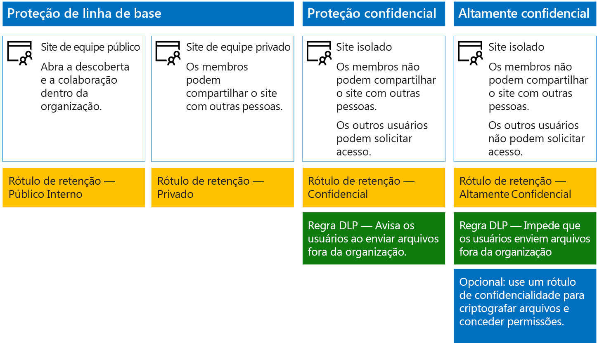

# Proteger sites e arquivos do SharePoint OnlineSecure SharePoint Online sites and files

 **Resumo:** recomendações de configuração para proteger arquivos no SharePoint Online e no Office 365.**Summary:** Configuration recommendations for protecting files in SharePoint Online and Office 365.
  
Este artigo fornece recomendações para configurar sites de equipe do SharePoint Online e proteção de arquivo que equilibra a segurança com facilidade de colaboração. Esse artigo define quatro configurações diferentes, começando com um site público dentro de sua organização com as políticas de compartilhamento abertas. Cada configuração adicional representa uma etapa significativa na proteção, mas a capacidade de acessar e colaborar com os recursos é reduzida ao conjunto de usuários relevantes. Use essas recomendações como um ponto de partida e ajuste as configurações para atender às necessidades da sua organização.This article provides recommendations for configuring SharePoint Online team sites and file protection that balances security with ease of collaboration. This article defines four different configurations, starting with a public site within your organization with the most open sharing policies. Each additional configuration represents a meaningful step up in protection, but the ability to access and collaborate on resources is reduced to the relevant set of users. Use these recommendations as a starting point and adjust the configurations to meet the needs of your organization. 
  
As configurações nesse artigo se alinham às recomendações da Microsoft para três níveis de proteção de dados, identidades e dispositivos:The configurations in this article align with Microsoft's recommendations for three tiers of protection for data, identities, and devices:
  
- Proteção de linha de baseBaseline protection
    
- Proteção confidencialSensitive protection
    
- Proteção altamente confidencialHighly confidential protection
    
Para obter mais informações sobre essas camadas e recursos recomendados para cada camada, consulte os recursos a seguir.For more information about these tiers and capabilities recommended for each tier, see the following resources. 
  
- [Proteção de identidade e dispositivo para o Office 365Identity and Device Protection for Office 365](https://docs.microsoft.com/office365/enterprise/microsoft-cloud-it-architecture-resources#BKMK_O365IDP)
    
- [Soluções para proteção de arquivos do Office 365File Protection Solutions in Office 365](https://docs.microsoft.com/office365/enterprise/microsoft-cloud-it-architecture-resources#BKMK_O365fileprotect)
    
## Visão geral da funcionalidadeCapability overview

As recomendações para sites de equipe do SharePoint Online traçam uma variedade de recursos do Microsoft 365.Recommendations for SharePoint Online team sites draw on a variety of Microsoft 365 capabilities. A ilustração a seguir mostra as configurações recomendadas para quatro sites de equipe do SharePoint Online.The following illustration shows the recommended configurations for four SharePoint Online team sites.

Conforme ilustrado:As illustrated:
  
- A proteção de linha de base inclui duas opções para sites de equipe do SharePoint Online — um site público e um site privado. Os sites públicos podem ser descobertos e acessados por qualquer pessoa na organização. Os sites privados podem ser descobertos e acessados apenas por membros do site. Essas configurações de site permitem o compartilhamento fora do grupo.Baseline protection includes two options for SharePoint Online team sites — a public site and private site. Public sites can be discovered and accessed by anybody in the organization. Private sites can only be discovered and accessed by members of the site. Both of these site configurations allow for sharing outside the group. 
    
- Os sites para proteção confidencial e altamente confidencial são sites privados com acesso limitado apenas a membros de grupos específicos.Sites for sensitive and highly confidential protection are private sites with access limited only to members of specific groups.
    
- [Rótulos de retenção](labels.md) oferecem uma maneira para classificar arquivos em sites.[Retention labels](labels.md) provide a way to classify files within the sites. Cada um dos sites de equipe do SharePoint Online é configurado para aplicar rótulos automaticamente aos arquivos nas bibliotecas de documentos com um rótulo de retenção padrão para o site.Each of the SharePoint Online team sites are configured to automatically label files in document libraries with a default retention label for the site. Correspondentes às quatro configurações de site, os rótulos nesse exemplo são Público Interno, Privado, Confidencial e Altamente Confidencial.Corresponding to the four site configurations, the labels in this example are Internal Public, Private, Sensitive, and Highly Confidential. Os usuários podem alterar os rótulos, mas essa configuração garante que todos os arquivos de recebem um rótulo padrão.Users can change the labels, but this configuration ensures all files receive a default label.
    
- As políticas DLP [(prevenção de perda de dados)](data-loss-prevention-policies.md) são configuradas para os rótulos de retenção Confidenciais e Altamente Confidenciais para avisar ou impedir os usuários quando tentam enviar esses tipos de arquivos para fora da organização.[Data loss prevention](data-loss-prevention-policies.md) (DLP) policies are configured for the Sensitive and Highly Confidential retention labels to either warn or prevent users when they attempt to send these types of files outside the organization.
    
- Se for necessário para sua situação, você pode usar [rótulos de confidencialidade](sensitivity-labels.md)para proteger arquivos altamente confidenciais com criptografia e permissões.If needed for your scenario, you can use [sensitivity labels](sensitivity-labels.md) to protect highly confidential files with encryption and permissions. Clientes da Proteção de Informações do Azure pode, usar  Rótulos da Proteção de Informações do Azure no centro de conformidade do Microsoft 365 e os rótulos serão sincronizados com o portal do Azure, caso seja escolhido executar a configuração adicional ou avançada.For Azure Information Protection customers, you can use your Azure Information Protection labels in the Microsoft 365 compliance center, and your labels will be synced with the Azure portal in case you choose to perform additional or advanced configuration. Os Rótulos de Proteção de Informações do Azure e os rótulos de confidencialidade do Office 365 são totalmente compatíveis entre si.Azure Information Protection labels and Office 365 sensitivity labels are fully compatible with each other. Isso significa que, por exemplo, se você tiver um conteúdo rotulado pela Proteção de Informações do Azure, não será necessário reclassificar ou rotular novamente o conteúdo. Nem todos os clientes necessitam desse nível de proteção.This means, for example, if you have content labeled by Azure Information Protection, you won’t need to reclassify or relabel your content.Not all customers need this level of protection. 
    
## Configurações para todo o locatário do SharePoint Online e OneDrive for BusinessTenant-wide settings for SharePoint Online and OneDrive for Business

O SharePoint Online e OneDrive para Empresas incluem configurações para todo o locatário que afetam todos os sites e os usuários. Algumas dessas configurações também podem ser ajustadas no nível do site para serem mais restritivas (mas não menos). Esta seção discute as configurações para todo o locatário que afetam a segurança e a colaboração.SharePoint Online and OneDrive for Business include tenant-wide settings that affect all sites and users. Some of these settings can also be adjusted at the site level to be more restrictive (but not less). This section discusses tenant-wide settings that affect security and collaboration. 
  
### CompartilhamentoSharing

Para esta solução, recomendamos as seguintes configurações para todo o locatário:For this solution, we recommend the following tenant-wide settings:
  
- Mantenha a política de configuração padrão que permite todo o compartilhamento com todos os tipos de conta, incluindo o compartilhamento anônimo.Keep the default sharing policy that allows all sharing with all account types, including anonymous sharing.
    
- Configure os links anônimos para expirar, se desejado.Set anonymous links to expire, if desired.
    
- Altere o tipo de link padrão para o compartilhamento para Interno. Isso ajuda a impedir o vazamento acidental de dados fora da sua organização.Change the default link type for sharing to Internal. This helps prevent accidental data leakage outside your organization.
    
Embora possa parecer contraintuitivo permitir o compartilhamento externo, essa abordagem fornece mais controle sobre o compartilhamento de arquivo em comparação com enviar os arquivos por email. O SharePoint Online e o Outlook trabalham juntos para fornecer a colaboração segura nos arquivos.While it might seem counterintuitive to allow external sharing, this approach provides more control over file sharing compared to sending files in email. SharePoint Online and Outlook work together to provide secure collaboration on files. 
  
- Por padrão, o Outlook compartilha um link para um arquivo em vez de enviar o arquivo por email.By default, Outlook shares a link to a file instead of sending the file in email. 
    
- O SharePoint Online e OneDrive for Business facilitam compartilhar links para arquivos com colaboradores que estão dentro e fora da sua organizaçãoSharePoint Online and OneDrive for Business make it easy to share links to files with contributors who are both inside and outside your organization
    
Você também tem controles para ajudar a controlar o compartilhamento externo. Por exemplo, você pode:You also have controls to help govern external sharing. For example, you can:
  
- Desabilitar um link de convidado anônimo.Disable an anonymous guest link.
    
- Revogar o acesso de usuário para um site.Revoke user access to a site.
    
- Ver quem tem acesso a um documento ou um site específico.See who has access to a specific site or document.
    
- Configurar os links de compartilhamento anônimos para expirarem (configuração de locatário).Set anonymous sharing links to expire (tenant setting).
    
- Limitar quem pode compartilhar fora da sua organização (configuração de locatário).Limit who can share outside your organization (tenant setting).
    
### Usar o compartilhamento externo junto com a DLP (prevenção de perda de dados)Use external sharing together with data loss prevention (DLP)

Se você não permitir o compartilhamento externo, os usuários com uma empresa encontrarão métodos e ferramentas alternativas. A Microsoft recomenda que você combine o compartilhamento externo com políticas DLP para proteger os arquivos confidenciais e altamente confidenciais.If you don't allow external sharing, users with a business need will find alternate tools and methods. Microsoft recommends you combine external sharing with DLP policies to protect sensitive and highly confidential files.
  
### Configurações de acesso de dispositivoDevice access settings

As configurações de acesso de dispositivo do SharePoint Online e do OneDrive para Empresas permitem que você determine se o acesso é limitado apenas ao navegador (não é possível baixar os arquivos) ou se o acesso está bloqueado.Device access settings for SharePoint Online and OneDrive for Business let you determine whether access is limited to browser only (files can't be downloaded) or if access is blocked. Para obter informações, consulte [Controlar o acesso de dispositivos gerenciados](https://docs.microsoft.com/pt-BR/sharepoint/control-access-from-unmanaged-devices).For more information, see [Control access from unmanaged devices](https://docs.microsoft.com/pt-BR/sharepoint/control-access-from-unmanaged-devices). 

Para usar as configurações de acesso de dispositivo com as políticas de acesso condicional recomendadas no Azure Active Directory, confira [Recomendações de política para proteger os arquivos e sites do SharePoint](https://docs.microsoft.com/pt-BR/microsoft-365/enterprise/sharepoint-file-access-policies).To use device access settings with recommended conditional access policies in Azure Active Directory, see [Policy recommendations for securing SharePoint sites and files](https://docs.microsoft.com/pt-BR/microsoft-365/enterprise/sharepoint-file-access-policies).
  
### OneDrive for BusinessOneDrive for Business

Visite essas configurações para decidir se deseja alterar as configurações padrão para sites do OneDrive para Empresas. Atualmente, as configurações de acesso de compartilhamento e de dispositivo estão duplicadas do Centro de administração do SharePoint Online e se aplicam a ambos os ambientes.Visit these settings to decide if you want to change the default settings for OneDrive for Business sites. Currently, the sharing and device access settings are duplicated from the SharePoint Online admin center and apply to both environments.
  
## Configuração de site de equipe do SharePointSharePoint team site configuration

A tabela a seguir resume a configuração para cada um dos sites de equipe descritos anteriormente neste artigo. Use essas configurações como recomendações de ponto de partida e ajuste as configurações e os tipos de site para atender às necessidades da sua organização. Nem toda organização precisa de todos os tipos de site. Somente um pequeno número de organizações requer a proteção altamente confidencial.The following table summarizes the configuration for each of the team sites described earlier in this article. Use these configurations as starting point recommendations and adjust the site types and configurations to meet the needs of your organization. Not every organization needs every type of site. Only a small number of organizations require highly confidential protection.
  
||||||
|:-----|:-----|:-----|:-----|:-----|
||**Proteção de linha de base nº 1****Baseline protection #1**   |**Proteção de linha de base nº 2****Baseline protection #2**   |**Proteção confidencial****Sensitive protection**   |**Altamente confidencial****Highly confidential**   |
|DescriçãoDescription    |Abra a descoberta e a colaboração dentro da organização.Open discovery and collaboration within the organization.    |Grupo e site particulares com o compartilhamento permitido fora do grupo.Private site and group with sharing allowed outside the group.    |Site isolado, no qual os níveis de acesso são definidos pela associação em grupos específicos. O compartilhamento é permitido apenas para membros do site. A DLP avisa os usuários quando tenta enviar arquivos fora da organização.Isolated site, in which levels of access are defined by membership in specific groups. Sharing is only allowed to members of the site. DLP warns users when attempting to send files outside the organization.    |Criptografia de arquivo + site isolado e permissões com a Proteção de Informações do Azure. A DLP impede que os usuários enviem arquivos fora da organização.Isolated site + file encryption and permissions with Azure Information Protection. DLP prevents users from sending files outside the organization.    |
|Site de equipe público ou privadoPrivate or public team site    |PúblicoPublic    |PrivatePrivate    |PrivatePrivate    |PrivatePrivate    |
|Quem tem acesso?Who has access?    |Todas as pessoas na organização, incluindo usuários convidados e usuários de B2B.Everybody in the organization, including B2B users and guest users.    |Membros do site somente. Outros usuários podem solicitar acesso.Members of the site only. Others can request access.    |Membros do site somente. Outros usuários podem solicitar acesso.Members of the site only. Others can request access.    |Somente membros. Outros usuários não podem solicitar acesso.Members only. Others cannot request access.    |
|Controles de compartilhamento de nível de siteSite-level sharing controls    |Compartilhamento permitido com qualquer pessoa. Configurações padrão.Sharing allowed with anybody. Default settings.    |Compartilhamento permitido com qualquer pessoa. Configurações padrão.Sharing allowed with anybody. Default settings.    |Os membros não podem compartilhar o acesso ao site.Members cannot share access to the site.    Os não membros podem solicitar acesso ao site, mas essas solicitações precisam ser atendidas por um administrador de site.Non-members can request access to the site, but these requests need to be addressed by a site administrator.    |Os membros não podem compartilhar o acesso ao site.Members cannot share access to the site.    Os não membros não podem solicitar acesso ao site ou conteúdo.Non-members cannot request access to the site or contents.    |
|Controles de acesso de dispositivo de nível de siteSite-level device access controls    |Sem controles adicionais.No additional controls.    |Sem controles adicionais.No additional controls.    |Impede que os usuários baixem arquivos para os dispositivos incompatíveis ou com domínio não associado. Isso permite o acesso somente para navegador de todos os outros dispositivos.Site-level controls are coming soon, which prevents users from downloading files to non-compliant or non-domain joined devices. This allows browser-only access from all other devices.    |Bloquear o download de arquivos para os dispositivos incompatíveis ou com domínio não associado.Site-level controls are coming soon, which blocks downloading of files to non-compliant or non-domain joined devices.    |
|Rótulos de retençãoRetention labels    |Público internoInternal Public    |PrivatePrivate    |ConfidencialSensitive    |Altamente ConfidencialHighly Confidential    |
|Políticas DLPDLP policies    |||Avisar os usuários quando enviar arquivos que são rotulados como Confidencial para fora da organização.Warn users when sending files that are labeled as Sensitive outside the organization.    Para bloquear o compartilhamento externo de tipos de dados confidenciais, como números de cartão de crédito ou outros dados pessoais, você pode configurar políticas DLP adicionais para esses tipos de dados (incluindo tipos de dados personalizados que você configurar).To block external sharing of sensitive data types, such as credit card numbers or other personal data, you can configure additional DLP policies for these data types (including custom data types you configure).    |Impedir que os usuários enviem arquivos rotulados como altamente confidenciais para fora da organização. Permitir que os usuários substituam isso fornecendo justificativa, incluindo com quem eles estão compartilhando o arquivo.Block users from sending files that are labeled as highly confidential outside organization. Allow users to override this by providing justification, including who they are sharing the file with.    |
|Rótulos de confidencialidadeSensitivity labels    ||||Usar os Rótulos de confidencialidade para automaticamente criptografar e conceder permissões aos arquivos.Use sensitivity labels to automatically encrypt and grant permissions to files. Usar os Rótulos de confidencialidade para criptografar os arquivos.Sensitivity labels use Azure Information Protection to encrypt files. Essa proteção acompanha os arquivos caso eles sejam vazados.This protection travels with the files in case they are leaked.    O Office 365 não pode ler arquivos criptografados com a Proteção de Informações do Azure. Além disso, as políticas DLP podem funcionar apenas com os metadados (incluindo rótulos), mas não com o conteúdo desses arquivos (como números de cartão de crédito em arquivos).Office 365 cannot read files encrypted with Azure Information Protection. Additionally, DLP policies can only work with the metadata (including labels) but not the contents of these files (such as credit card numbers within files).    |
   
Para obter as etapas para implantar os quatro tipos diferentes de sites de equipe do SharePoint Online nesta solução, consulte [Implantar sites do SharePoint Online para três níveis de proteção](deploy-sharepoint-online-sites-for-three-tiers-of-protection.md).For the steps to deploy the four different types of SharePoint Online team sites in this solution, see [Deploy sites for three tiers of protection](deploy-sharepoint-online-sites-for-three-tiers-of-protection.md). 
  
## Rótulos de retenção do Office 365Office 365 retention labels

O uso dos rótulos de retenção é recomendado para ambientes com os dados confidenciais.Using retention labels is recommended for environments with sensitive data. Depois de configurar e publicar rótulos de retenção:After you configure and publish retention labels:
  
- Você pode aplicar um rótulo padrão a uma biblioteca de documentos em um site de equipe do SharePoint Online, de forma que todos os documentos nessa biblioteca recebam o rótulo padrão.You can apply a default label to a document library in a SharePoint Online team site, so that all documents in that library get the default label. 
    
- Você pode aplicar automaticamente rótulos ao conteúdo que corresponder a condições específicas.You can apply labels to content automatically if it matches specific conditions.
    
- Você pode aplicar políticas DLP que se baseiem nos rótulos de retenção.You can apply DLP policies that are based on retention labels.
    
- Pessoas na sua organização podem aplicar manualmente um rótulo ao conteúdo no Outlook na Web, Outlook 2010 e posteriores, OneDrive for Business, SharePoint Online e grupos do Office 365. Os usuários geralmente sabem melhor o tipo de conteúdo com o qual estão trabalhando, portanto podem classificá-lo e aplicar a política DLP apropriada.People in your organization can apply a label manually to content in Outlook on the web, Outlook 2010 and later, OneDrive for Business, SharePoint Online, and Office 365 groups. Users often know best what type of content they're working with, so they can classify it and have the appropriate DLP policy applied.
    

  
Conforme ilustrado, essa solução inclui a criação dos seguintes rótulos de retenção:As illustrated, this solution includes creating the following retention labels:
  
- Altamente confidencialHighly Confidential
    
- ConfidencialSensitive
    
- PrivatePrivate
    
- Público internoInternal Public
    
Esses rótulos são mapeados para os sites recomendados nas ilustrações e gráficos anteriormente neste artigo. Esta solução recomenda a configuração de políticas DLP para ajudar a evitar vazamento de arquivos rotulados como Confidenciais e Altamente Confidenciais.These labels are mapped to the recommended sites in the illustrations and charts earlier in this article. This solution recommends configuring DLP policies to help prevent the leakage of files labeled as Sensitive and Highly Confidential.
  
Para as etapas de configuração de rótulos e políticas DLP de retenção nesta solução, consulte [Proteger os arquivos do SharePoint Online com rótulos de retenção e DLP](protect-sharepoint-online-files-with-office-365-labels-and-dlp.md).For the steps to configure retention labels and DLP policies in this solution, see [Protect SharePoint Online files with retention labels and DLP](protect-sharepoint-online-files-with-office-365-labels-and-dlp.md).
  
## Rótulos de confidencialidadeSensitivity labels 

Se for necessário para o seu cenário de segurança, você pode usar rótulos de confidencialidade para aplicar proteções que acompanham os arquivos onde quer que estejam.If warranted for your security scenario, you can use sensitivity labels to apply protections that follow the files wherever they go. Os Rótulos de Proteção de Informações do Azure e os Rótulos de confidencialidade no Centro de conformidade do Microsoft 365 são os mesmos.Sensitivity labels in the Microsoft 365 compliance center and Azure Information Protection labels are the same. Para esta solução, recomendamos que você use uma política de Proteção de Informações do Azure e um sub-rótulo altamente confidencial para criptografar e conceder permissões a arquivos que precisam ser protegidos com o mais alto nível de segurança.For this solution, we recommend you use a scoped Azure Information Protection policy and a sub-label of the Highly Confidential label to encrypt and grant permissions to files that need to be protected with the highest level of security. 
  
Lembre-se de que quando a criptografia da Proteção de Informações do Azure é aplicada aos arquivos armazenados no Office 365, o serviço não pode processar o conteúdo desses arquivos.Be aware that when Azure Information Protection encryption is applied to files stored in Office 365, the service cannot process the contents of these files. Coautoria, descoberta eletrônica, pesquisa, Delve e outros recursos de colaboração não funcionam.Co-authoring, eDiscovery, search, Delve, and other collaborative features do not work. Políticas de DLP só funcionam com metadados (incluindo rótulos de retenção), mas não com o conteúdo desses arquivos (como números de cartão de crédito em arquivos).DLP policies can only work with the metadata (including retention labels) but not the contents of these files (such as credit card numbers within files).

Para saber mais, confira [Visão geral de rótulos de confidencialidade](sensitivity-labels.md).For more information, see [Overview of sensitivity labels](sensitivity-labels.md).

    
### Adicionando permissões para usuários externosAdding permissions for external users

Há duas maneiras para conceder aos usuários externos o acesso aos arquivos protegidos com a Proteção de Informações do Azure. Em ambos os casos, os usuários externos devem ter uma conta do Azure AD. Se os usuários externos não forem membros de uma organização que usa o Azure AD, eles poderão obter uma conta do Azure AD como um indivíduo usando essa página de entrada: [https://aka.ms/aip-signup](https://aka.ms/aip-signup).There are two ways you can grant external users access to files protected with Azure Information Protection. In both these cases, external users must have an Azure AD account. If external users aren't members of an organization that uses Azure AD, they can obtain an Azure AD account as an individual by using this sign-up page: [https://aka.ms/aip-signup](https://aka.ms/aip-signup).
  
- Adicionar usuários externos a um grupo do Azure AD usado para configurar a proteção para um rótuloAdd external users to an Azure AD group that is used to configure protection for a label
    
     Primeiro você precisará adicionar a conta como um usuário de B2B em seu diretório. Pode levar algumas horas para o [cache de associação de grupo pelo Microsoft Azure AD Rights Management](https://docs.microsoft.com/information-protection/plan-design/prepare#group-membership-caching-by-azure-rights-management). Com esse método, as permissões são concedidas a todos os arquivos existentes protegidos com o rótulo (até mesmo a arquivos protegidos antes de um usuário ser adicionado ao grupo do Azure AD).You'll need to first add the account as a B2B user in your directory. It can take a couple of hours for [group membership caching by Azure Rights Management](https://docs.microsoft.com/information-protection/plan-design/prepare#group-membership-caching-by-azure-rights-management). With this method, permissions are granted to all existing files protected with the label (even files protected before a user is added to the Azure AD group).
    
- Adicionar usuários externos diretamente à proteção de rótuloAdd external users directly to the label protection
    
     Você pode adicionar todos os usuários de uma organização (por exemplo, Fabrikam.com), um grupo do Azure AD (por exemplo, um grupo de finanças dentro de uma organização) ou um usuário individual. Por exemplo, você pode adicionar uma equipe externa de agências reguladoras à proteção para um rótulo. Com esse método, as permissões são concedidas apenas para arquivos protegidos com o rótulo depois que a entidade externa é adicionada à proteção.You can add all users from an organization (e.g. Fabrikam.com), an Azure AD group (such as a finance group within an organization), or an individual user. For example, you can add an external team of regulators to the protection for a label. With this method, permissions are granted only to files protected with the label after the external entity is added to the protection.
    
### Implantando e usando a Proteção de Informações do AzureDeploying and using Azure Information Protection

Para as etapas de configuração de Proteção de Informações do Azure nesta solução, consulte [Proteger arquivos do SharePoint Online com a Proteção de Informações do Azure](protect-sharepoint-online-files-with-azure-information-protection.md).For the steps to configure Azure Information Protection in this solution, see [Protect SharePoint Online files with Azure Information Protection](protect-sharepoint-online-files-with-azure-information-protection.md).
  
## Confira também
See Also

[Diretrizes de segurança da Microsoft para campanhas políticas, instituições sem fins lucrativos e outras organizações do AgileMicrosoft Security Guidance for Political Campaigns, Nonprofits, and Other Agile Organizations](microsoft-security-guidance-for-political-campaigns-nonprofits-and-other-agile-o.md)
  
[Adoção da nuvem e de soluções híbridasCloud adoption and hybrid solutions](https://docs.microsoft.com/office365/enterprise/cloud-adoption-and-hybrid-solutions)
  
