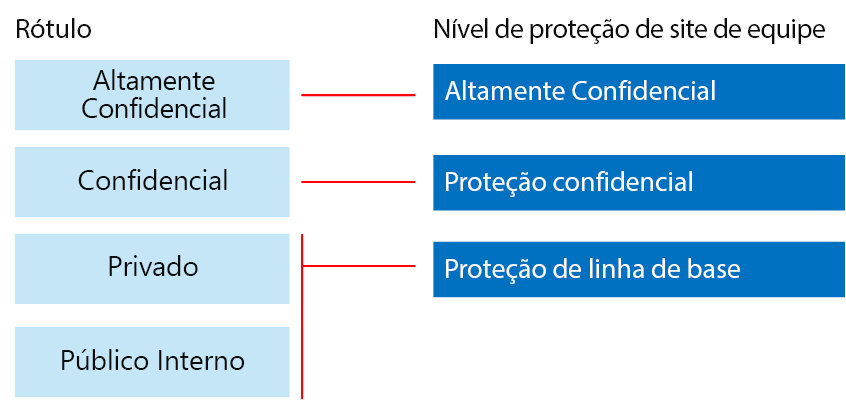
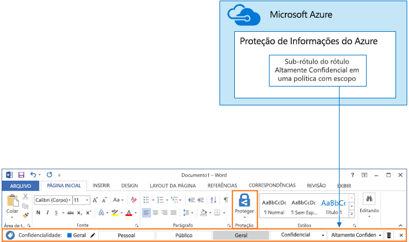

# Proteger sites e arquivos do SharePoint Online

 **Resumo:** recomendações de configuração para proteger arquivos no SharePoint Online e no Office 365.
  
Este artigo fornece recomendações para configurar sites de equipe do SharePoint Online e proteção de arquivo que equilibra a segurança com facilidade de colaboração. Esse artigo define quatro configurações diferentes, começando com um site público dentro de sua organização com as políticas de compartilhamento abertas. Cada configuração adicional representa uma etapa significativa na proteção, mas a capacidade de acessar e colaborar com os recursos é reduzida ao conjunto de usuários relevantes. Use essas recomendações como um ponto de partida e ajuste as configurações para atender às necessidades da sua organização. 
  
As configurações nesse artigo se alinham às recomendações da Microsoft para três níveis de proteção de dados, identidades e dispositivos:
  
- Proteção de linha de base
    
- Proteção confidencial
    
- Proteção altamente confidencial
    
Para obter mais informações sobre essas camadas e recursos recomendados para cada camada, consulte os recursos a seguir. 
  
- [Proteção de identidade e dispositivo para o Office 365](https://docs.microsoft.com/office365/enterprise/microsoft-cloud-it-architecture-resources#BKMK_O365IDP)
    
- [Soluções para proteção de arquivos do Office 365](https://docs.microsoft.com/office365/enterprise/microsoft-cloud-it-architecture-resources#BKMK_O365fileprotect)
    
## Visão geral da funcionalidade

As recomendações para sites de equipe do SharePoint Online traçam uma variedade de recursos do Office 365. Para sites altamente confidenciais, recomenda-se a Proteção de Informações do Azure. Ela está incluída no EMS (Enterprise Mobility + Security). 
  
A ilustração a seguir mostra as configurações recomendadas para quatro sites de equipe do SharePoint Online.

Conforme ilustrado:
  
- A proteção de linha de base inclui duas opções para sites de equipe do SharePoint Online — um site público e um site privado. Os sites públicos podem ser descobertos e acessados por qualquer pessoa na organização. Os sites privados podem ser descobertos e acessados apenas por membros do site. Essas configurações de site permitem o compartilhamento fora do grupo. 
    
- Os sites para proteção confidencial e altamente confidencial são sites privados com acesso limitado apenas a membros de grupos específicos.
    
- Os rótulos do Office 365 fornecem uma maneira de classificar os dados com um nível de proteção necessário. Cada um dos sites de equipe do SharePoint Online é configurado para aplicar rótulos automaticamente aos arquivos nas bibliotecas de documentos com um rótulo padrão para o site. Correspondentes às quatro configurações de site, os rótulos nesse exemplo são Público Interno, Privado, Confidencial e Altamente Confidencial. Os usuários podem alterar os rótulos, mas essa configuração garante que todos os arquivos de recebem um rótulo padrão.
    
- As políticas DLP (prevenção de perda de dados) são configuradas para os rótulos Confidenciais e Altamente Confidenciais do Office 365 para avisar ou impedir os usuários quando tentam enviar esses tipos de arquivos para fora da organização.
    
- Se necessário para sua situação, você pode usar a Proteção de Informações do Azure para criptografar e conceder permissões para arquivos que sejam altamente confidenciais. Isso não é recomendável para todos os clientes.
    
## Configurações para todo o locatário do SharePoint Online e OneDrive for Business

O SharePoint Online e OneDrive para Empresas incluem configurações para todo o locatário que afetam todos os sites e os usuários. Algumas dessas configurações também podem ser ajustadas no nível do site para serem mais restritivas (mas não menos). Esta seção discute as configurações para todo o locatário que afetam a segurança e a colaboração. 
  
### Compartilhamento

Para esta solução, recomendamos as seguintes configurações para todo o locatário:
  
- Mantenha a política de configuração padrão que permite todo o compartilhamento com todos os tipos de conta, incluindo o compartilhamento anônimo.
    
- Configure os links anônimos para expirar, se desejado.
    
- Altere o tipo de link padrão para o compartilhamento para Interno. Isso ajuda a impedir o vazamento acidental de dados fora da sua organização.
    
Embora possa parecer contraintuitivo permitir o compartilhamento externo, essa abordagem fornece mais controle sobre o compartilhamento de arquivo em comparação com enviar os arquivos por email. O SharePoint Online e o Outlook trabalham juntos para fornecer a colaboração segura nos arquivos. 
  
- Por padrão, o Outlook compartilha um link para um arquivo em vez de enviar o arquivo por email. 
    
- O SharePoint Online e OneDrive for Business facilitam compartilhar links para arquivos com colaboradores que estão dentro e fora da sua organização
    
Você também tem controles para ajudar a controlar o compartilhamento externo. Por exemplo, você pode:
  
- Desabilitar um link de convidado anônimo.
    
- Revogar o acesso de usuário para um site.
    
- Ver quem tem acesso a um documento ou um site específico.
    
- Configurar os links de compartilhamento anônimos para expirarem (configuração de locatário).
    
- Limitar quem pode compartilhar fora da sua organização (configuração de locatário).
    
### Usar o compartilhamento externo junto com a DLP (prevenção de perda de dados)

Se você não permitir o compartilhamento externo, os usuários com uma empresa encontrarão métodos e ferramentas alternativas. A Microsoft recomenda que você combine o compartilhamento externo com políticas DLP para proteger os arquivos confidenciais e altamente confidenciais.
  
### Configurações de acesso de dispositivo

As configurações de acesso de dispositivo do SharePoint Online e do OneDrive for Business permitem que você determine se o acesso é limitado apenas ao navegador (não é possível baixar os arquivos) ou se o acesso está bloqueado. Essas configurações estão atualmente no Primeiro Lançamento e se aplicam a todo o locatário. Em breve a capacidade de configurar políticas de acesso do dispositivo no nível do site estará disponível. Para esta solução, é recomendável não usar configurações de acesso de dispositivo que se aplicam a todos os locatários.
  
Para usar configurações de acesso de dispositivo enquanto estão na primeira versão: [Configurar as opções dos programas Padrão ou Primeiro Lançamento no Office 365](https://support.office.com/article/Set-up-the-Standard-or-First-Release-options-in-Office-365-3B3ADFA4-1777-4FF0-B606-FB8732101F47).
  
### OneDrive for Business

Visite essas configurações para decidir se deseja alterar as configurações padrão para sites do OneDrive para Empresas. Atualmente, as configurações de acesso de compartilhamento e de dispositivo estão duplicadas do Centro de administração do SharePoint Online e se aplicam a ambos os ambientes.
  
## Configuração de site de equipe do SharePoint

A tabela a seguir resume a configuração para cada um dos sites de equipe descritos anteriormente neste artigo. Use essas configurações como recomendações de ponto de partida e ajuste as configurações e os tipos de site para atender às necessidades da sua organização. Nem toda organização precisa de todos os tipos de site. Somente um pequeno número de organizações requer a proteção altamente confidencial.
  
||||||
|:-----|:-----|:-----|:-----|:-----|
||**Proteção de linha de base nº 1**   |**Proteção de linha de base nº 2**   |**Proteção confidencial**   |**Altamente confidencial**   |
|Descrição    |Abra a descoberta e a colaboração dentro da organização.    |Grupo e site particulares com o compartilhamento permitido fora do grupo.    |Site isolado, no qual os níveis de acesso são definidos pela associação em grupos específicos. O compartilhamento é permitido apenas para membros do site. A DLP avisa os usuários quando tenta enviar arquivos fora da organização.    |Criptografia de arquivo + site isolado e permissões com a Proteção de Informações do Azure. A DLP impede que os usuários enviem arquivos fora da organização.    |
|Site de equipe público ou privado    |Público    |Private    |Private    |Private    |
|Quem tem acesso?    |Todas as pessoas na organização, incluindo usuários convidados e usuários de B2B.    |Membros do site somente. Outros usuários podem solicitar acesso.    |Membros do site somente. Outros usuários podem solicitar acesso.    |Somente membros. Outros usuários não podem solicitar acesso.    |
|Controles de compartilhamento de nível de site    |Compartilhamento permitido com qualquer pessoa. Configurações padrão.    |Compartilhamento permitido com qualquer pessoa. Configurações padrão.    |Os membros não podem compartilhar o acesso ao site.    Os não membros podem solicitar acesso ao site, mas essas solicitações precisam ser atendidas por um administrador de site.    |Os membros não podem compartilhar o acesso ao site.    Os não membros não podem solicitar acesso ao site ou conteúdo.    |
|Controles de acesso de dispositivo de nível de site    |Sem controles adicionais.    |Sem controles adicionais.    |Os controles de nível de site serão disponibilizados em breve, o que impede que os usuários baixem arquivos para dispositivos que não estão ingressados no domínio ou estão sem conformidade. Isso permite o acesso somente para navegador de todos os outros dispositivos.    |Os controles de nível de site serão disponibilizados em breve, o que impede o download dos arquivos para dispositivos não ingressados no domínio ou sem conformidade.    |
|Rótulos do Office 365    |Público Interno    |Private    |Confidencial    |Altamente Confidencial    |
|Políticas DLP    |||Avisar os usuários quando enviar arquivos que são rotulados como Confidencial para fora da organização.    Para bloquear o compartilhamento externo de tipos de dados confidenciais, como números de cartão de crédito ou outros dados pessoais, você pode configurar políticas DLP adicionais para esses tipos de dados (incluindo tipos de dados personalizados que você configurar).    |Impedir que os usuários enviem arquivos rotulados como altamente confidenciais para fora da organização. Permitir que os usuários substituam isso fornecendo justificativa, incluindo com quem eles estão compartilhando o arquivo.    |
|Proteção de Informações do Azure    ||||Use a Proteção de Informações do Azure para automaticamente criptografar e conceder permissões aos arquivos. Essa proteção acompanha os arquivos, caso seja vazados.    O Office 365 não pode ler arquivos criptografados com a Proteção de Informações do Azure. Além disso, as políticas DLP podem funcionar apenas com os metadados (incluindo rótulos), mas não com o conteúdo desses arquivos (como números de cartão de crédito em arquivos).    |
   
Para ver as etapas de implantação dos quatro diferentes tipos de sites de equipe do SharePoint Online nesta solução, confira [Implantar sites do SharePoint Online com três camadas de proteção](deploy-sharepoint-online-sites-for-three-tiers-of-protection.md). Para ver as etapas para criar um ambiente de desenvolvimento/teste, confira [Proteger os sites do SharePoint Online em um ambiente de desenvolvimento/teste](secure-sharepoint-online-sites-in-a-dev-test-environment.md). 
  
## Rótulos e classificação do Office 365

O uso dos rótulos do Office 365 é recomendado para ambientes com dados confidenciais. Depois de configurar e publicar os rótulos do Office 365:
  
- Você pode aplicar um rótulo padrão a uma biblioteca de documentos em um site de equipe do SharePoint Online, de forma que todos os documentos nessa biblioteca recebam o rótulo padrão. 
    
- Você pode aplicar automaticamente rótulos ao conteúdo que corresponder a condições específicas.
    
- Você pode aplicar políticas DLP que se baseiem nos rótulos do Office 365.
    
- Pessoas na sua organização podem aplicar manualmente um rótulo ao conteúdo no Outlook na Web, Outlook 2010 e posteriores, OneDrive for Business, SharePoint Online e grupos do Office 365. Os usuários geralmente sabem melhor o tipo de conteúdo com o qual estão trabalhando, portanto podem classificá-lo e aplicar a política DLP apropriada.
    

  
Conforme ilustrado, essa solução inclui a criação dos seguintes rótulos:
  
- Altamente Confidencial
    
- Confidencial
    
- Private
    
- Público interno
    
Esses rótulos são mapeados para os sites recomendados nas ilustrações e gráficos anteriormente neste artigo. Esta solução recomenda a configuração de políticas DLP para ajudar a evitar vazamento de arquivos rotulados como Confidenciais e Altamente Confidenciais.
  
Para as etapas de configuração de rótulos e políticas DLP do Office 365 nesta solução, consulte [Proteger os arquivos do SharePoint Online com rótulos e DLP do Office 365](protect-sharepoint-online-files-with-office-365-labels-and-dlp.md).
  
## Proteção de Informações do Azure

Caso fornecida para sua segurança, é possível usar a Proteção de Informações do Azure para aplicar rótulos e proteções que seguem os arquivos onde quer que eles estejam. Os rótulos da Proteção de Informações do Azure são diferentes de rótulos do Office 365. Para esta solução, recomendamos que você use uma política de Proteção de Informações do Azure e um sub-rótulo altamente confidencial para criptografar e conceder permissões a arquivos que precisam ser protegidos com o mais alto nível de segurança. 
  
Lembre-se de que quando a criptografia da Proteção de Informações do Azure é aplicada aos arquivos armazenados no Office 365, o serviço não pode processar o conteúdo desses arquivos. Coautoria, descoberta eletrônica, pesquisa, Delve e outros recursos de colaboração não funcionam. Políticas de DLP só funcionam com metadados (incluindo rótulos do Office 365), mas não com o conteúdo desses arquivos (como números de cartão de crédito em arquivos).
  

  
Conforme ilustrado:
  
- Configure políticas e rótulos da Proteção de Informações do Azure no portal do Microsoft Azure. É recomendável configurar um sub-rótulo de uma política com escopo.
    
- Os rótulos da Proteção de Informações do Azure são exibidos como a barra de ferramentas **Proteção de Informações** em aplicativos do Office.
    
### Adicionando permissões para usuários externos

Há duas maneiras para conceder aos usuários externos o acesso aos arquivos protegidos com a Proteção de Informações do Azure. Em ambos os casos, os usuários externos devem ter uma conta do Azure AD. Se os usuários externos não forem membros de uma organização que usa o Azure AD, eles poderão obter uma conta do Azure AD como um indivíduo usando essa página de entrada: [https://aka.ms/aip-signup](https://aka.ms/aip-signup).
  
- Adicionar usuários externos a um grupo do Azure AD usado para configurar a proteção para um rótulo
    
     Primeiro você precisará adicionar a conta como um usuário de B2B em seu diretório. Pode levar algumas horas para o [cache de associação de grupo pelo Microsoft Azure AD Rights Management](https://docs.microsoft.com/information-protection/plan-design/prepare#group-membership-caching-by-azure-rights-management). Com esse método, as permissões são concedidas a todos os arquivos existentes protegidos com o rótulo (até mesmo a arquivos protegidos antes de um usuário ser adicionado ao grupo do Azure AD).
    
- Adicionar usuários externos diretamente à proteção de rótulo
    
     Você pode adicionar todos os usuários de uma organização (por exemplo, Fabrikam.com), um grupo do Azure AD (por exemplo, um grupo de finanças dentro de uma organização) ou um usuário individual. Por exemplo, você pode adicionar uma equipe externa de agências reguladoras à proteção para um rótulo. Com esse método, as permissões são concedidas apenas para arquivos protegidos com o rótulo depois que a entidade externa é adicionada à proteção.
    
### Implantando e usando a Proteção de Informações do Azure

Para as etapas de configuração de Proteção de Informações do Azure nesta solução, consulte [Proteger arquivos do SharePoint Online com a Proteção de Informações do Azure](protect-sharepoint-online-files-with-azure-information-protection.md).
  
## Confira também

[Diretrizes de segurança da Microsoft para campanhas políticas, instituições sem fins lucrativos e outras organizações do Agile](microsoft-security-guidance-for-political-campaigns-nonprofits-and-other-agile-o.md)
  
[Adoção da nuvem e de soluções híbridas](https://docs.microsoft.com/office365/enterprise/cloud-adoption-and-hybrid-solutions)
  
[Proteger os sites do SharePoint Online em um ambiente de desenvolvimento/teste](secure-sharepoint-online-sites-in-a-dev-test-environment.md)

