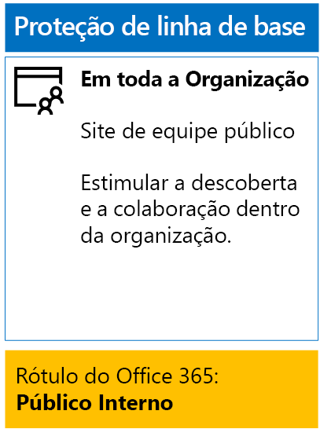
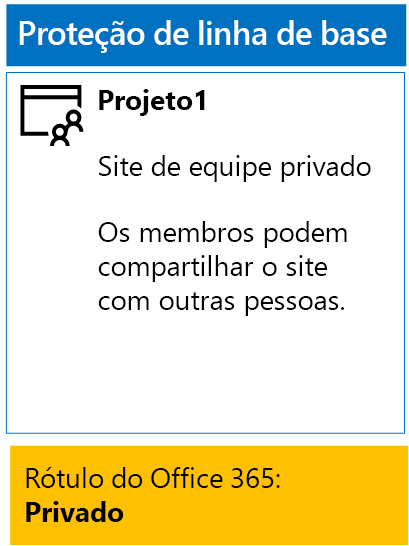
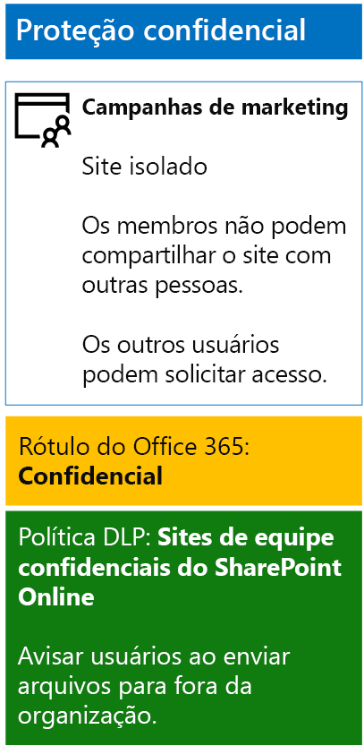
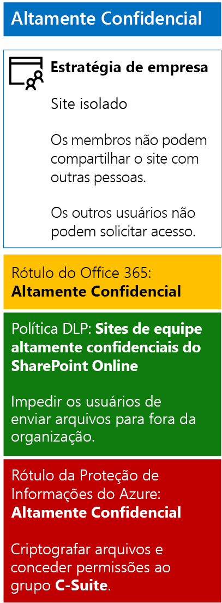

# <a name="secure-sharepoint-online-sites-in-a-devtest-environment"></a><span data-ttu-id="7293b-103">Proteger sites do SharePoint Online em um ambiente de desenvolvimento/teste</span><span class="sxs-lookup"><span data-stu-id="7293b-103">Secure SharePoint Online sites in a dev/test environment</span></span>

 <span data-ttu-id="7293b-104">**Resumo:** crie sites de equipe do SharePoint Online públicos, privados, confidenciais e altamente confidenciais em um ambiente de desenvolvimento/teste.</span><span class="sxs-lookup"><span data-stu-id="7293b-104">**Summary:** Create public, private, sensitive, and highly confidential SharePoint Online team sites in a dev/test environment.</span></span>
  
<span data-ttu-id="7293b-105">Este artigo fornece instruções passo a passo para criar um ambiente de desenvolvimento/teste que inclui os quatro tipos diferentes de sites de equipe do SharePoint Online para a solução de [arquivos e sites seguros do SharePoint Online](secure-sharepoint-online-sites-and-files.md).</span><span class="sxs-lookup"><span data-stu-id="7293b-105">This article provides step-by-step instructions to create a dev/test environment that includes the four different types of SharePoint Online team sites for the [Secure SharePoint Online sites and files](secure-sharepoint-online-sites-and-files.md) solution.</span></span>
  

  
<span data-ttu-id="7293b-107">Use este ambiente de desenvolvimento/teste para experimentar com os comportamentos de proteção de informações e ajustar as configurações para suas necessidades específicas antes de implantar sites de equipe do SharePoint Online na produção.</span><span class="sxs-lookup"><span data-stu-id="7293b-107">Use this dev/test environment to experiment with the information protection behaviors and fine-tune settings for your specific needs before deploying SharePoint Online team sites in production.</span></span>
  
## <a name="phase-1-create-your-devtest-environment"></a><span data-ttu-id="7293b-108">Fase 1: criar seu ambiente de desenvolvimento/teste</span><span class="sxs-lookup"><span data-stu-id="7293b-108">Phase 1: Create your dev/test environment</span></span>

<span data-ttu-id="7293b-109">Nesta fase, você deve obter assinaturas de avaliação do Office 365 e do Enterprise Mobility + Security para uma organização fictícia.</span><span class="sxs-lookup"><span data-stu-id="7293b-109">In this phase, you obtain trial subscriptions for Office 365 and Enterprise Mobility + Security for a fictional organization.</span></span>
  
<span data-ttu-id="7293b-110">Primeiro, siga as instruções na **Fase 2** do [ambiente de desenvolvimento/de teste do Office 365](https://docs.microsoft.com/office365/enterprise/office-365-dev-test-environment).</span><span class="sxs-lookup"><span data-stu-id="7293b-110">First, follow the instructions in **Phase 2** of the [Office 365 dev/test environment](https://docs.microsoft.com/office365/enterprise/office-365-dev-test-environment).</span></span>
  
<span data-ttu-id="7293b-111">Em seguida, inscreva-se para a assinatura de avaliação do EMS e adicione-a à mesma organização de sua assinatura de avaliação do Office 365.</span><span class="sxs-lookup"><span data-stu-id="7293b-111">Next, sign up for the EMS trial subscription and add it to the same organization as your Office 365 trial subscription.</span></span>
  
1. <span data-ttu-id="7293b-p101">Se necessário, entre no Portal do Office 365 com as credenciais da conta de administrador global da sua assinatura de avaliação. Para obter ajuda, consulte [Onde entrar no Office 365](https://support.office.com/Article/Where-to-sign-in-to-Office-365-e9eb7d51-5430-4929-91ab-6157c5a050b4).</span><span class="sxs-lookup"><span data-stu-id="7293b-p101">If needed, sign in to the Office 365 portal with the credentials of the global administrator account of your trial subscription. For help, see [Where to sign in to Office 365](https://support.office.com/Article/Where-to-sign-in-to-Office-365-e9eb7d51-5430-4929-91ab-6157c5a050b4).</span></span>
    
2. <span data-ttu-id="7293b-114">Clique no bloco de **Administração**.</span><span class="sxs-lookup"><span data-stu-id="7293b-114">Click the **Admin** tile.</span></span>
    
3. <span data-ttu-id="7293b-115">Na guia **Centro de Administração do Office** no navegador, no painel de navegação esquerdo, clique em **Cobrança > Comprar serviços**.</span><span class="sxs-lookup"><span data-stu-id="7293b-115">On the **Office Admin center** tab in your browser, in the left navigation, click **Billing > Purchase services**.</span></span>
    
4. <span data-ttu-id="7293b-p102">Na página **Comprar serviços**, encontre o item **Enterprise Mobility + Security E5**. Passe o ponteiro do mouse sobre ele e clique em **Iniciar avaliação gratuita**.</span><span class="sxs-lookup"><span data-stu-id="7293b-p102">On the **Purchase services** page, find the **Enterprise Mobility + Security E5** item. Hover your mouse pointer over it and click **Start free trial**.</span></span>
    
5. <span data-ttu-id="7293b-118">Na página **Confirmar seu pedido**, clique em **Experimentar agora**.</span><span class="sxs-lookup"><span data-stu-id="7293b-118">On the **Confirm your order** page, click **Try now**.</span></span>
    
6. <span data-ttu-id="7293b-119">Na página **Recibo do pedido**, clique em **Continuar**.</span><span class="sxs-lookup"><span data-stu-id="7293b-119">On the **Order receipt** page, click **Continue**.</span></span>
    
<span data-ttu-id="7293b-120">Em seguida, habilite a licença do Enterprise Mobility + Security E5 para sua conta de administrador global.</span><span class="sxs-lookup"><span data-stu-id="7293b-120">Next, enable the Enterprise Mobility + Security E5 license for your global administrator account.</span></span>
  
1. <span data-ttu-id="7293b-121">Na guia **Centro de administração do Office 365** no navegador, no painel de navegação à esquerda, clique em **Usuários > Usuários ativos**.</span><span class="sxs-lookup"><span data-stu-id="7293b-121">On the **Office 365 Admin center** tab in your browser, in the left navigation, click **Users > Active users**.</span></span>
    
2. <span data-ttu-id="7293b-122">Clique em sua conta de administrador global e, em seguida, clique em **Editar** para **Licenças de produto**.</span><span class="sxs-lookup"><span data-stu-id="7293b-122">Click your global administrator account, and then click **Edit** for **Product licenses**.</span></span>
    
3. <span data-ttu-id="7293b-123">No painel **Licenças de produto**, mude a licença de produto de **Enterprise Mobility + Security E5** para **Ativada**, clique em **Salvar** e clique em **Fechar** duas vezes.</span><span class="sxs-lookup"><span data-stu-id="7293b-123">On the **Product licenses** pane, turn the product license for **Enterprise Mobility + Security E5** to **On**, click **Save,** and then click **Close** twice.</span></span>
    
## <a name="phase-2-create-and-configure-your-azure-active-directory-ad-groups-and-users"></a><span data-ttu-id="7293b-124">Fase 2: criar e configurar seus grupos e usuários do Azure Active Directory (AD)</span><span class="sxs-lookup"><span data-stu-id="7293b-124">Phase 2: Create and configure your Azure Active Directory (AD) groups and users</span></span>

<span data-ttu-id="7293b-125">Nesta fase, você cria e configura os usuários e grupos do Azure AD para sua organização fictícia.</span><span class="sxs-lookup"><span data-stu-id="7293b-125">In this phase, you create and configure the Azure AD groups and users for your fictional organization.</span></span>
  
<span data-ttu-id="7293b-126">Primeiro, crie um conjunto de grupos para uma organização comum com o portal do Azure.</span><span class="sxs-lookup"><span data-stu-id="7293b-126">First, create a set of groups for a typical organization with the Azure portal.</span></span>
  
1. <span data-ttu-id="7293b-p103">Abra uma guia separada no navegador e vá para o Portal do Azure em [https://portal.azure.com](https://portal.azure.com). Se necessário, entre com as credenciais da conta de administrador global da sua assinatura de avaliação do Office 365 E5.</span><span class="sxs-lookup"><span data-stu-id="7293b-p103">Create a separate tab in your browser, and then go to the Azure portal at [https://portal.azure.com](https://portal.azure.com). If needed, sign in with the credentials of the global administrator account for your Office 365 E5 trial subscription.</span></span>
    
2. <span data-ttu-id="7293b-129">No Portal do Azure, clique em **Azure Active Directory > Grupos**.</span><span class="sxs-lookup"><span data-stu-id="7293b-129">In the Azure portal, click **Azure Active Directory > Groups**.</span></span>
    
3. <span data-ttu-id="7293b-130">Na folha **Grupos – Todos os grupos**, clique em **+ Novo grupo**.</span><span class="sxs-lookup"><span data-stu-id="7293b-130">On the **Groups - All groups** blade, click **+ New group**.</span></span>
    
4. <span data-ttu-id="7293b-131">Na folha **Grupo**:</span><span class="sxs-lookup"><span data-stu-id="7293b-131">On the **Group** blade:</span></span>
    
  - <span data-ttu-id="7293b-132">Escolha **Office 365** em **Tipo de Grupo**.</span><span class="sxs-lookup"><span data-stu-id="7293b-132">Select **Office 365** in **Group type**.</span></span>
    
  - <span data-ttu-id="7293b-133">Digite **Pacote C** em **Nome**.</span><span class="sxs-lookup"><span data-stu-id="7293b-133">Type **C-Suite** in **Name**.</span></span>
    
  - <span data-ttu-id="7293b-134">Escolha **Atribuído** em **Tipo de Associação**.</span><span class="sxs-lookup"><span data-stu-id="7293b-134">Select **Assigned** in **Membership type**.</span></span>
      
5. <span data-ttu-id="7293b-135">Clique em **Criar** e, em seguida, feche a folha **Grupo**.</span><span class="sxs-lookup"><span data-stu-id="7293b-135">Click **Create**, and then close the **Group** blade.</span></span>
    
6. <span data-ttu-id="7293b-136">Repita as etapas 3 a 5 para os seguintes nomes de grupo:</span><span class="sxs-lookup"><span data-stu-id="7293b-136">Repeat steps 3-5 for the following group names:</span></span>
    
  - <span data-ttu-id="7293b-137">Equipe de TI</span><span class="sxs-lookup"><span data-stu-id="7293b-137">IT staff</span></span>
    
  - <span data-ttu-id="7293b-138">Equipe de pesquisa</span><span class="sxs-lookup"><span data-stu-id="7293b-138">Research staff</span></span>
    
  - <span data-ttu-id="7293b-139">Equipe regular</span><span class="sxs-lookup"><span data-stu-id="7293b-139">Regular staff</span></span>
    
  - <span data-ttu-id="7293b-140">Equipe de marketing</span><span class="sxs-lookup"><span data-stu-id="7293b-140">Marketing staff</span></span>
    
  - <span data-ttu-id="7293b-141">Equipe de vendas</span><span class="sxs-lookup"><span data-stu-id="7293b-141">Sales staff</span></span>
    
7. <span data-ttu-id="7293b-142">Mantenha aberta a guia do portal do Azure no navegador.</span><span class="sxs-lookup"><span data-stu-id="7293b-142">Keep the Azure portal tab in your browser open.</span></span>
    
<span data-ttu-id="7293b-143">Em seguida, configure o licenciamento automático para que os membros de seus grupos recebam automaticamente a atribuição de licenças para suas assinaturas do Office 365 e do EMS.</span><span class="sxs-lookup"><span data-stu-id="7293b-143">Next, you configure automatic licensing so that members of your groups are automatically assigned licenses for your Office 365 and EMS subscriptions.</span></span>
  
1. <span data-ttu-id="7293b-144">No Portal do Azure, clique em **Azure Active Directory > Licenças > Todos os produtos**.</span><span class="sxs-lookup"><span data-stu-id="7293b-144">In the Azure portal, click **Azure Active Directory > Licenses > All products**.</span></span>
    
2. <span data-ttu-id="7293b-145">Na lista, escolha **Enterprise Mobility + Security E5** e **Office 365 Enterprise E5** e clique em **Atribuir**.</span><span class="sxs-lookup"><span data-stu-id="7293b-145">In the list, select **Enterprise Mobility + Security E5** and **Office 365 Enterprise E5**, and then click **Assign**.</span></span>
    
3. <span data-ttu-id="7293b-146">Na folha **Atribuir licença**, clique em **Usuários e grupos**.</span><span class="sxs-lookup"><span data-stu-id="7293b-146">In the **Assign license** blade, click **Users and groups**.</span></span>
    
4. <span data-ttu-id="7293b-147">Na lista de grupos, selecione o seguinte:</span><span class="sxs-lookup"><span data-stu-id="7293b-147">In the list of groups, select the following:</span></span>
    
  - <span data-ttu-id="7293b-148">Pacote C</span><span class="sxs-lookup"><span data-stu-id="7293b-148">C-Suite</span></span>
    
  - <span data-ttu-id="7293b-149">Equipe de TI</span><span class="sxs-lookup"><span data-stu-id="7293b-149">IT staff</span></span>
    
  - <span data-ttu-id="7293b-150">Equipe de pesquisa</span><span class="sxs-lookup"><span data-stu-id="7293b-150">Research staff</span></span>
    
  - <span data-ttu-id="7293b-151">Equipe regular</span><span class="sxs-lookup"><span data-stu-id="7293b-151">Regular staff</span></span>
    
  - <span data-ttu-id="7293b-152">Equipe de marketing</span><span class="sxs-lookup"><span data-stu-id="7293b-152">Marketing staff</span></span>
    
  - <span data-ttu-id="7293b-153">Equipe de vendas</span><span class="sxs-lookup"><span data-stu-id="7293b-153">Sales staff</span></span>
    
5. <span data-ttu-id="7293b-154">Clique em **Selecionar** e clique em **Atribuir**.</span><span class="sxs-lookup"><span data-stu-id="7293b-154">Click **Select**, and then click **Assign**.</span></span>
    
6. <span data-ttu-id="7293b-155">Feche a guia do Portal do Azure no navegador.</span><span class="sxs-lookup"><span data-stu-id="7293b-155">Close the Azure portal tab in your browser.</span></span>
    
<span data-ttu-id="7293b-156">Em seguida, você deve se [Conectar ao módulo PowerShell do Azure Active Directory V2](https://go.microsoft.com/fwlink/?linkid=842218).</span><span class="sxs-lookup"><span data-stu-id="7293b-156">Next, you [Connect with the Azure Active Directory V2 PowerShell module](https://go.microsoft.com/fwlink/?linkid=842218).</span></span>
  
<span data-ttu-id="7293b-157">Preencha o nome da organização, seu local e uma senha comum. Execute esses comandos no prompt de comando do PowerShell ou no ISE (Ambiente de Script Integrado) para criar contas de usuário e adicioná-las aos grupos:</span><span class="sxs-lookup"><span data-stu-id="7293b-157">Fill in your organization name, your location, and a common password, and then run these commands from the PowerShell command prompt or Integrated Script Environment (ISE) to create user accounts and add them to their groups:</span></span>
  
```
$orgName="<organization name, such as contoso for the contoso.onmicrosoft.com trial subscription domain name>"
$location="<the ISO ALPHA2 country code, such as US for the United States>"
$commonPassword="<common password for all the new accounts>"

$PasswordProfile=New-Object -TypeName Microsoft.Open.AzureAD.Model.PasswordProfile
$PasswordProfile.Password=$commonPassword

$groupName="C-Suite"
$userNames=@("CEO","CFO","CIO") 
$groupID=(Get-AzureADGroup | Where { $_.DisplayName -eq $groupName }).ObjectID
ForEach ($element in $userNames){ 
New-AzureADUser -DisplayName $element -PasswordProfile $PasswordProfile -UserPrincipalName ($element + "@" + $orgName + ".onmicrosoft.com") -AccountEnabled $true -MailNickName $element -UsageLocation $location 
Add-AzureADGroupMember -RefObjectId (Get-AzureADUser | Where { $_.DisplayName -eq $element }).ObjectID -ObjectId $groupID
}
$groupName="IT staff"
$userNames=@("ITAdmin1","ITAdmin2") 
$groupID=(Get-AzureADGroup | Where { $_.DisplayName -eq $groupName }).ObjectID
ForEach ($element in $userNames){ 
New-AzureADUser -DisplayName $element -PasswordProfile $PasswordProfile -UserPrincipalName ($element + "@" + $orgName + ".onmicrosoft.com") -AccountEnabled $true -MailNickName $element -UsageLocation $location 
Add-AzureADGroupMember -RefObjectId (Get-AzureADUser | Where { $_.DisplayName -eq $element }).ObjectID -ObjectId $groupID
}
$groupName="Research staff"
$userNames=@("Researcher1") 
$groupID=(Get-AzureADGroup | Where { $_.DisplayName -eq $groupName }).ObjectID
ForEach ($element in $userNames){ 
New-AzureADUser -DisplayName $element -PasswordProfile $PasswordProfile -UserPrincipalName ($element + "@" + $orgName + ".onmicrosoft.com") -AccountEnabled $true -MailNickName $element -UsageLocation $location 
Add-AzureADGroupMember -RefObjectId (Get-AzureADUser | Where { $_.DisplayName -eq $element }).ObjectID -ObjectId $groupID
}
$groupName="Regular staff"
$userNames=@("Regular1", "Regular2") 
$groupID=(Get-AzureADGroup | Where { $_.DisplayName -eq $groupName }).ObjectID
ForEach ($element in $userNames){ 
New-AzureADUser -DisplayName $element -PasswordProfile $PasswordProfile -UserPrincipalName ($element + "@" + $orgName + ".onmicrosoft.com") -AccountEnabled $true -MailNickName $element -UsageLocation $location 
Add-AzureADGroupMember -RefObjectId (Get-AzureADUser | Where { $_.DisplayName -eq $element }).ObjectID -ObjectId $groupID
}
$groupName="Marketing staff"
$userNames=@("Marketing1", "Marketing2") 
$groupID=(Get-AzureADGroup | Where { $_.DisplayName -eq $groupName }).ObjectID
ForEach ($element in $userNames){ 
New-AzureADUser -DisplayName $element -PasswordProfile $PasswordProfile -UserPrincipalName ($element + "@" + $orgName + ".onmicrosoft.com") -AccountEnabled $true -MailNickName $element -UsageLocation $location 
Add-AzureADGroupMember -RefObjectId (Get-AzureADUser | Where { $_.DisplayName -eq $element }).ObjectID -ObjectId $groupID
}
$groupName="Sales staff"
$userNames=@("SalesPerson1") 
$groupID=(Get-AzureADGroup | Where { $_.DisplayName -eq $groupName }).ObjectID
ForEach ($element in $userNames){ 
New-AzureADUser -DisplayName $element -PasswordProfile $PasswordProfile -UserPrincipalName ($element + "@" + $orgName + ".onmicrosoft.com") -AccountEnabled $true -MailNickName $element -UsageLocation $location 
Add-AzureADGroupMember -RefObjectId (Get-AzureADUser | Where { $_.DisplayName -eq $element }).ObjectID -ObjectId $groupID
}
```

> [!NOTE]
> <span data-ttu-id="7293b-p104">O uso de uma senha comum aqui é para a automação e facilidade de configuração para um ambiente de desenvolvimento/teste. Isso nunca é recomendado assinaturas de produção.</span><span class="sxs-lookup"><span data-stu-id="7293b-p104">The use of a common password here is for automation and ease of configuration for a dev/test environment. This is not recommended for production subscriptions.</span></span> 
  
<span data-ttu-id="7293b-160">Use essas etapas para verificar se o licenciamento baseado em grupo está funcionando corretamente.</span><span class="sxs-lookup"><span data-stu-id="7293b-160">Use these steps to verify that group-based licensing is working correctly.</span></span>
  
1. <span data-ttu-id="7293b-161">Na guia **Microsoft Office Home** do navegador, clique no bloco **Administração**.</span><span class="sxs-lookup"><span data-stu-id="7293b-161">From the **Microsoft Office Home** tab of your browser, click the **Admin** tile.</span></span>
    
2. <span data-ttu-id="7293b-162">Na nova guia **Centro de Administração do Office** do navegador, clique em **Usuários**.</span><span class="sxs-lookup"><span data-stu-id="7293b-162">From the new **Office Admin center** tab of your browser, click **Users**.</span></span>
    
3. <span data-ttu-id="7293b-163">Na lista de usuários, clique em **CEO**.</span><span class="sxs-lookup"><span data-stu-id="7293b-163">In the list of users, click **CEO**.</span></span>
    
4. <span data-ttu-id="7293b-164">No painel que lista as propriedades da conta de usuário **CEO**, verifique se ele recebeu a atribuição das licenças **Enterprise Mobility + Security E5** e **Office 365 Enterprise E5** (em **Licenças de produto**).</span><span class="sxs-lookup"><span data-stu-id="7293b-164">In the pane that lists the properties of the **CEO** user account, verify that it has been assigned the **Enterprise Mobility + Security E5** and **Office 365 Enterprise E5** licenses (in **Product licenses**).</span></span>
    
## <a name="phase-3-create-office-365-labels"></a><span data-ttu-id="7293b-165">Fase 3: criar rótulos do Office 365</span><span class="sxs-lookup"><span data-stu-id="7293b-165">Phase 3: Create Office 365 labels</span></span>

<span data-ttu-id="7293b-166">Nesta fase, você deve criar os rótulos para os diferentes níveis de segurança das pastas e documentos do site de equipe do SharePoint Online.</span><span class="sxs-lookup"><span data-stu-id="7293b-166">In this phase, you create the labels for the different levels of security for SharePoint Online team site documents folders.</span></span>
  
1. <span data-ttu-id="7293b-p105">Se necessário, use uma instância particular do navegador da Internet e entre no Portal do Office 365 com a conta de administrador global da sua assinatura de avaliação do Office 365 E5. Para obter ajuda, consulte [Onde entrar no Office 365](https://support.office.com/Article/Where-to-sign-in-to-Office-365-e9eb7d51-5430-4929-91ab-6157c5a050b4).</span><span class="sxs-lookup"><span data-stu-id="7293b-p105">If needed, use a private instance of your Internet browser and sign in to the Office 365 portal with the global administrator account of your Office 365 E5 trial subscription. For help, see [Where to sign in to Office 365](https://support.office.com/Article/Where-to-sign-in-to-Office-365-e9eb7d51-5430-4929-91ab-6157c5a050b4).</span></span>
    
2. <span data-ttu-id="7293b-169">Na guia **Microsoft Office Home**, clique no bloco **Administração**.</span><span class="sxs-lookup"><span data-stu-id="7293b-169">From the **Microsoft Office Home** tab, click the **Admin** tile.</span></span>
    
3. <span data-ttu-id="7293b-170">Na nova guia **Centro de Administração do Office** do navegador, clique em **Centros de Administração > Segurança&amp; e Conformidade**.</span><span class="sxs-lookup"><span data-stu-id="7293b-170">From the new **Office Admin center** tab of your browser, click **Admin centers > Security &amp; Compliance**.</span></span>
    
4. <span data-ttu-id="7293b-171">Na nova guia **Início – Segurança &amp;e Conformidade** do navegador, clique em **Classificações > Rótulos**.</span><span class="sxs-lookup"><span data-stu-id="7293b-171">From the new **Home - Security &amp; Compliance** tab of your browser, click **Classifications > Labels**.</span></span>
    
5. <span data-ttu-id="7293b-172">No painel **Página inicial > Rótulos**, clique na guia **Retenção** e, em seguida, clique em **Criar um rótulo**.</span><span class="sxs-lookup"><span data-stu-id="7293b-172">From the **Home > Labels** pane, click the **Retention** tab, and then click **Create a label**.</span></span>
    
6. <span data-ttu-id="7293b-173">No painel **Atribuir nome ao seu rótulo**, digite **Público interno** e clique em **Avançar**.</span><span class="sxs-lookup"><span data-stu-id="7293b-173">On the **Name your label** pane, type **Internal Public**, and then click **Next**.</span></span>
    
7. <span data-ttu-id="7293b-174">No painel **Configurações de rótulo**, clique em **Avançar**.</span><span class="sxs-lookup"><span data-stu-id="7293b-174">On the **Label settings** pane, click **Next**.</span></span>
    
8. <span data-ttu-id="7293b-175">No painel **Examine as configurações**, clique em **Criar este rótulo** e clique em **Fechar**.</span><span class="sxs-lookup"><span data-stu-id="7293b-175">On the **Review your settings** pane, click **Create this label**, and then click **Close**.</span></span>
    
9. <span data-ttu-id="7293b-176">Repita as etapas de 5 a 8 para os rótulos adicionais:</span><span class="sxs-lookup"><span data-stu-id="7293b-176">Repeat steps 5-8 for these additional labels:</span></span>
    
  - <span data-ttu-id="7293b-177">Private</span><span class="sxs-lookup"><span data-stu-id="7293b-177">Private</span></span>
    
  - <span data-ttu-id="7293b-178">Confidencial</span><span class="sxs-lookup"><span data-stu-id="7293b-178">Sensitive</span></span>
    
  - <span data-ttu-id="7293b-179">Altamente Confidencial</span><span class="sxs-lookup"><span data-stu-id="7293b-179">Highly Confidential</span></span>
    
10. <span data-ttu-id="7293b-180">No painel **Início > Rótulos**, clique em **Publicar rótulos**.</span><span class="sxs-lookup"><span data-stu-id="7293b-180">From the **Home > Labels** pane, click **Publish labels**.</span></span>
    
11. <span data-ttu-id="7293b-181">No painel **Escolher rótulos para publicar**, clique em **Escolher rótulos para publicar**.</span><span class="sxs-lookup"><span data-stu-id="7293b-181">On the **Choose labels to publish** pane, click **Choose labels to publish**.</span></span>
    
12. <span data-ttu-id="7293b-182">No painel **Escolher rótulos**, clique em **Adicionar** e selecione todos os quatro rótulos.</span><span class="sxs-lookup"><span data-stu-id="7293b-182">On the **Choose labels** pane, click **Add** and select all four labels.</span></span>
    
13. <span data-ttu-id="7293b-183">Clique em **Concluído**.</span><span class="sxs-lookup"><span data-stu-id="7293b-183">Click **Done**.</span></span>
    
14. <span data-ttu-id="7293b-184">No painel **Escolher rótulos para publicar**, clique em **Avançar**.</span><span class="sxs-lookup"><span data-stu-id="7293b-184">On the **Choose labels to publish** pane, click **Next**.</span></span>
    
15. <span data-ttu-id="7293b-185">No painel **Escolher locais**, clique em **Avançar**.</span><span class="sxs-lookup"><span data-stu-id="7293b-185">On the **Choose locations** pane, click **Next**.</span></span>
    
16. <span data-ttu-id="7293b-186">No painel **Atribuir um nome à política**, digite **Organização de exemplo** em **Nome** e clique em **Avançar**.</span><span class="sxs-lookup"><span data-stu-id="7293b-186">On the **Name your policy** pane, type **Example organization** in **Name**, and then click **Next**.</span></span>
    
17. <span data-ttu-id="7293b-187">No painel **Examine as configurações**, clique em **Publicar rótulos** e clique em **Fechar**.</span><span class="sxs-lookup"><span data-stu-id="7293b-187">On the **Review your settings** pane, click **Publish labels**, and then click **Close**.</span></span>
    
## <a name="phase-4-create-your-sharepoint-online-team-sites"></a><span data-ttu-id="7293b-188">Fase 4: criar sites de equipe do SharePoint Online</span><span class="sxs-lookup"><span data-stu-id="7293b-188">Phase 4: Create your SharePoint Online team sites</span></span>

<span data-ttu-id="7293b-189">Nesta fase, você cria e configura os quatro tipos de sites de equipe do SharePoint Online para sua organização de exemplo.</span><span class="sxs-lookup"><span data-stu-id="7293b-189">In this phase, you create and configure the four types of SharePoint Online team sites for your example organization.</span></span>
  
### <a name="organization-wide-team-site"></a><span data-ttu-id="7293b-190">Site de equipe de toda a organização</span><span class="sxs-lookup"><span data-stu-id="7293b-190">Organization wide team site</span></span>

<span data-ttu-id="7293b-191">Para criar um site de equipe do SharePoint Online público de linha de base, faça o seguinte:</span><span class="sxs-lookup"><span data-stu-id="7293b-191">To create a baseline public SharePoint Online team site, do the following:</span></span>
  
1. <span data-ttu-id="7293b-p106">Se necessário, use um navegador no computador local e entre no Portal do Office 365 usando sua conta de administrador global. Para obter ajuda, consulte [Onde entrar no Office 365](https://support.office.com/Article/Where-to-sign-in-to-Office-365-e9eb7d51-5430-4929-91ab-6157c5a050b4).</span><span class="sxs-lookup"><span data-stu-id="7293b-p106">If needed, use a browser on your local computer and sign in to the Office 365 portal using your global administrator account. For help, see [Where to sign in to Office 365](https://support.office.com/Article/Where-to-sign-in-to-Office-365-e9eb7d51-5430-4929-91ab-6157c5a050b4).</span></span>
    
2. <span data-ttu-id="7293b-194">Na lista de blocos, clique em **SharePoint**.</span><span class="sxs-lookup"><span data-stu-id="7293b-194">In the list of tiles, click **SharePoint**.</span></span>
    
3. <span data-ttu-id="7293b-195">Na nova guia **SharePoint** no navegador, clique em **+ Criar site**.</span><span class="sxs-lookup"><span data-stu-id="7293b-195">On the new **SharePoint** tab in your browser, click **+ Create site**.</span></span>
    
4. <span data-ttu-id="7293b-196">Na página **Criar um site**, clique em **Site de equipe**.</span><span class="sxs-lookup"><span data-stu-id="7293b-196">On the **Create a site** page, click **Team site**.</span></span>
    
5. <span data-ttu-id="7293b-197">Em **Nome do site**, digite **Toda a organização**.</span><span class="sxs-lookup"><span data-stu-id="7293b-197">In **Site name**, type **Organization wide**.</span></span> 
    
6. <span data-ttu-id="7293b-198">Na **Descrição do site de equipe**, digite **Site do SharePoint para toda a organização**.</span><span class="sxs-lookup"><span data-stu-id="7293b-198">In **Team site description**, type **SharePoint site for the entire organization**.</span></span>
    
7. <span data-ttu-id="7293b-199">Em **Configurações de privacidade**, escolha **Público – qualquer pessoa na organização pode acessar esse site** e clique em **Avançar**.</span><span class="sxs-lookup"><span data-stu-id="7293b-199">In **Privacy settings**, select **Public - anyone in the organization can access this site**, and then click **Next**.</span></span>
    
8. <span data-ttu-id="7293b-200">No painel **Quem você deseja adicionar?**, clique em **Concluir**.</span><span class="sxs-lookup"><span data-stu-id="7293b-200">On the **Who do you want to add?** pane, click **Finish**.</span></span>
    
<span data-ttu-id="7293b-201">Em seguida, configure a pasta de documentos do site de equipe Toda a organização para o rótulo Público interno.</span><span class="sxs-lookup"><span data-stu-id="7293b-201">Next, configure the documents folder of the Organization wide team site for the Internal Public label.</span></span>
  
1. <span data-ttu-id="7293b-202">Na guia **Toda a organização – Página Inicial** do navegador, clique em **Documentos**.</span><span class="sxs-lookup"><span data-stu-id="7293b-202">In the **Organization wide-Home** tab of your browser, click **Documents**.</span></span>
    
2. <span data-ttu-id="7293b-203">Clique no ícone de configurações e em **Configurações de biblioteca**.</span><span class="sxs-lookup"><span data-stu-id="7293b-203">Click the settings icon, and then click **Library settings**.</span></span>
    
3. <span data-ttu-id="7293b-204">Em **Permissões e Gerenciamento**, clique em **Aplicar o rótulo aos itens nessa biblioteca**.</span><span class="sxs-lookup"><span data-stu-id="7293b-204">Under **Permissions and Management**, click **Apply label to items in this library**.</span></span>
    
4. <span data-ttu-id="7293b-205">Em **Configurações – Aplicar Rótulo**, escolha **Público interno** e clique em **Salvar**.</span><span class="sxs-lookup"><span data-stu-id="7293b-205">In **Settings-Apply Label**, select **Internal Public**, and then click **Save**.</span></span>
    
<span data-ttu-id="7293b-206">Esta é a configuração resultante.</span><span class="sxs-lookup"><span data-stu-id="7293b-206">Here is your resulting configuration.</span></span>
  

  
### <a name="project-1-team-site"></a><span data-ttu-id="7293b-208">Site de equipe do projeto 1</span><span class="sxs-lookup"><span data-stu-id="7293b-208">Project 1 team site</span></span>

<span data-ttu-id="7293b-209">Para criar um site de equipe básico e privado do SharePoint Online para um projeto dentro da organização, faça o seguinte:</span><span class="sxs-lookup"><span data-stu-id="7293b-209">To create a baseline private SharePoint Online team site for a project within the organization, do the following:</span></span>
  
1. <span data-ttu-id="7293b-p107">Se necessário, use um navegador no computador local e entre no Portal do Office 365 usando sua conta de administrador global. Para obter ajuda, consulte [Onde entrar no Office 365](https://support.office.com/Article/Where-to-sign-in-to-Office-365-e9eb7d51-5430-4929-91ab-6157c5a050b4).</span><span class="sxs-lookup"><span data-stu-id="7293b-p107">If needed, use a browser on your local computer and sign in to the Office 365 portal using your global administrator account. For help, see [Where to sign in to Office 365](https://support.office.com/Article/Where-to-sign-in-to-Office-365-e9eb7d51-5430-4929-91ab-6157c5a050b4).</span></span>
    
2. <span data-ttu-id="7293b-212">Na lista de blocos, clique em **SharePoint**.</span><span class="sxs-lookup"><span data-stu-id="7293b-212">In the list of tiles, click **SharePoint**.</span></span>
    
3. <span data-ttu-id="7293b-213">Na nova guia **SharePoint** no navegador, clique em **+ Criar site**.</span><span class="sxs-lookup"><span data-stu-id="7293b-213">On the new **SharePoint** tab in your browser, click **+ Create site**.</span></span>
    
4. <span data-ttu-id="7293b-214">Na página **Criar um site**, clique em **Site de equipe**.</span><span class="sxs-lookup"><span data-stu-id="7293b-214">On the **Create a site** page, click **Team site**.</span></span>
    
5. <span data-ttu-id="7293b-215">Em **Nome do site**, digite **Projeto 1**.</span><span class="sxs-lookup"><span data-stu-id="7293b-215">In **Site name**, type **Project 1**.</span></span> 
    
6. <span data-ttu-id="7293b-216">Na **Descrição do site de equipe**, digite **Site do SharePoint para Projeto 1**.</span><span class="sxs-lookup"><span data-stu-id="7293b-216">In **Team site description,** type **SharePoint site for Project 1**.</span></span>
    
7. <span data-ttu-id="7293b-217">Em **Configurações de privacidade**, escolha **Privado – somente membros podem acessar esse site** e clique em **Avançar**.</span><span class="sxs-lookup"><span data-stu-id="7293b-217">In **Privacy settings**, select **Private - only members can access this site**, and then click **Next**.</span></span>
    
8. <span data-ttu-id="7293b-218">No painel **Quem você deseja adicionar?**, clique em **Concluir**.</span><span class="sxs-lookup"><span data-stu-id="7293b-218">On the **Who do you want to add?** pane, click **Finish**.</span></span>
    
<span data-ttu-id="7293b-219">Em seguida, configure a pasta de documentos do site de equipe Projeto 1 para o rótulo Privado.</span><span class="sxs-lookup"><span data-stu-id="7293b-219">Next, configure the documents folder of the Project 1 team site for the Private label.</span></span>
  
1. <span data-ttu-id="7293b-220">Na guia **Projeto 1 – Página Inicial** do navegador, clique em **Documentos**.</span><span class="sxs-lookup"><span data-stu-id="7293b-220">In the **Project 1-Home** tab of your browser, click **Documents**.</span></span>
    
2. <span data-ttu-id="7293b-221">Clique no ícone de configurações e em **Configurações de biblioteca**.</span><span class="sxs-lookup"><span data-stu-id="7293b-221">Click the settings icon, and then click **Library settings**.</span></span>
    
3. <span data-ttu-id="7293b-222">Em **Permissões e Gerenciamento**, clique em **Aplicar o rótulo aos itens nessa biblioteca**.</span><span class="sxs-lookup"><span data-stu-id="7293b-222">Under **Permissions and Management**, click **Apply label to items in this library**.</span></span>
    
4. <span data-ttu-id="7293b-223">Em **Configurações – Aplicar Rótulo**, escolha **Privado** e clique em **Salvar**.</span><span class="sxs-lookup"><span data-stu-id="7293b-223">In **Settings-Apply Label**, select **Private**, and then click **Save**.</span></span>
    
<span data-ttu-id="7293b-224">Esta é a configuração resultante.</span><span class="sxs-lookup"><span data-stu-id="7293b-224">Here is your resulting configuration.</span></span>
  

  
### <a name="marketing-campaigns-team-site"></a><span data-ttu-id="7293b-226">Site de equipe de campanhas de marketing</span><span class="sxs-lookup"><span data-stu-id="7293b-226">Marketing campaigns team site</span></span>

<span data-ttu-id="7293b-227">Para criar um site de equipe do SharePoint Online isolado e com nível confidencial para recursos de campanha de marketing, faça o seguinte:</span><span class="sxs-lookup"><span data-stu-id="7293b-227">To create a sensitive-level isolated SharePoint Online team site for marketing campaign resources, do the following:</span></span>
  
1. <span data-ttu-id="7293b-p108">Usando um navegador no computador local, entre no Portal do Office 365 usando sua conta de administrador global. Para obter ajuda, consulte [Onde entrar no Office 365](https://support.office.com/Article/Where-to-sign-in-to-Office-365-e9eb7d51-5430-4929-91ab-6157c5a050b4).</span><span class="sxs-lookup"><span data-stu-id="7293b-p108">Using a browser on your local computer, sign in to the Office 365 portal using your global administrator account. For help, see [Where to sign in to Office 365](https://support.office.com/Article/Where-to-sign-in-to-Office-365-e9eb7d51-5430-4929-91ab-6157c5a050b4).</span></span>
    
2. <span data-ttu-id="7293b-230">Na lista de blocos, clique em **SharePoint**.</span><span class="sxs-lookup"><span data-stu-id="7293b-230">In the list of tiles, click **SharePoint**.</span></span>
    
3. <span data-ttu-id="7293b-231">Na nova guia **SharePoint** no navegador, clique em **+ Criar site**.</span><span class="sxs-lookup"><span data-stu-id="7293b-231">On the new **SharePoint** tab in your browser, click **+ Create site**.</span></span>
    
4. <span data-ttu-id="7293b-232">Na página **Criar um site**, clique em **Site de equipe**.</span><span class="sxs-lookup"><span data-stu-id="7293b-232">On the **Create a site** page, click **Team site**.</span></span>
    
5. <span data-ttu-id="7293b-233">Em **Nome do site de equipe**, digite **Campanhas de marketing**.</span><span class="sxs-lookup"><span data-stu-id="7293b-233">In **Team site name**, type **Marketing campaigns**.</span></span>
    
6. <span data-ttu-id="7293b-234">Em **Descrição do site de equipe**, digite **Site do SharePoint para recursos de campanha de marketing (confidencial)**.</span><span class="sxs-lookup"><span data-stu-id="7293b-234">In **Team site description**, type **SharePoint site for marketing campaign resources (sensitive)**.</span></span>
    
7.  <span data-ttu-id="7293b-235">Em **Configurações de privacidade**, escolha **Privado – somente membros podem acessar esse site** e clique em **Avançar**.</span><span class="sxs-lookup"><span data-stu-id="7293b-235">In **Privacy settings**, select **Private - only members can access this site**, and then click **Next**.</span></span>
    
8. <span data-ttu-id="7293b-236">No painel **Quem você deseja adicionar?**, clique em **Concluir**.</span><span class="sxs-lookup"><span data-stu-id="7293b-236">On the **Who do you want to add?** pane, click **Finish**.</span></span>
    
9. <span data-ttu-id="7293b-237">Na nova guia **Campanhas de marketing** no navegador, na barra de ferramentas, clique no ícone de configurações e em **Permissões do site**.</span><span class="sxs-lookup"><span data-stu-id="7293b-237">On the new **Marketing campaigns** tab in your browser, in the tool bar, click the settings icon, and then click **Site permissions**.</span></span>
    
10. <span data-ttu-id="7293b-238">No painel **Permissões do site**, clique em **Configurações de permissões avançadas**.</span><span class="sxs-lookup"><span data-stu-id="7293b-238">In the **Site permissions** pane, click **Advanced permissions settings**.</span></span>
    
11. <span data-ttu-id="7293b-239">Na nova guia **Permissões** no navegador, clique em **Configurações de Solicitação de Acesso**.</span><span class="sxs-lookup"><span data-stu-id="7293b-239">In the new **Permissions** tab in your browser, click **Access Request Settings**.</span></span>
    
12. <span data-ttu-id="7293b-240">Na caixa de diálogo **Configurações de Solicitação de Acesso**, desmarque as caixas de seleção **Permitir que membros compartilhem o site e arquivos e pastas individuais** e **Permitir que membros convidem outras pessoas para o grupo de membros do site**, digite **AdminTI1@**\<nome da organização>**.onmicrosoft.com** em **Enviar todas as solicitações para acesso** e clique em **OK**.</span><span class="sxs-lookup"><span data-stu-id="7293b-240">In the **Access Request Settings** dialog box, clear the **Allow members to share the site and individual files and folders** and **Allow members to invite others to the site members group** check boxes, type **ITAdmin1@**\<your organization name>**.onmicrosoft.com** in **Send all requests for access**, and then click **OK**.</span></span>
    
13. <span data-ttu-id="7293b-241">Clique em **Membros de campanhas de marketing** na lista.</span><span class="sxs-lookup"><span data-stu-id="7293b-241">Click **Marketing campaigns Members** in the list.</span></span>
    
14. <span data-ttu-id="7293b-242">Na página **Pessoas e Grupos**, clique em **Novo**.</span><span class="sxs-lookup"><span data-stu-id="7293b-242">On the **People and Groups** page, click **New**.</span></span>
    
15. <span data-ttu-id="7293b-243">Na caixa de diálogo **Compartilhar**, digite **Equipe de marketing**, selecione-a e clique em **Compartilhar**.</span><span class="sxs-lookup"><span data-stu-id="7293b-243">In the **Share** dialog box, type **Marketing staff**, select it, and then click **Share**.</span></span>
    
16. <span data-ttu-id="7293b-244">Repita as etapas 14 e 15 para a conta de usuário **Pesquisador1**.</span><span class="sxs-lookup"><span data-stu-id="7293b-244">Repeat steps 14 and 15 for the **Researcher1** user account.</span></span>
    
17. <span data-ttu-id="7293b-245">Clique no botão voltar de seu navegador.</span><span class="sxs-lookup"><span data-stu-id="7293b-245">Click the back button on your browser.</span></span>
    
18. <span data-ttu-id="7293b-246">Clique em **Proprietários de campanhas de marketing** na lista.</span><span class="sxs-lookup"><span data-stu-id="7293b-246">Click **Marketing campaigns Owners** in the list.</span></span>
    
19. <span data-ttu-id="7293b-247">Na página **Pessoas e Grupos**, clique em **Novo**.</span><span class="sxs-lookup"><span data-stu-id="7293b-247">On the **People and Groups** page, click **New**.</span></span>
    
20. <span data-ttu-id="7293b-248">Na caixa de diálogo **Compartilhar**, digite **Equipe de TI**, selecione o item e clique em **Compartilhar**.</span><span class="sxs-lookup"><span data-stu-id="7293b-248">In the **Share** dialog box, type **IT staff**, select it, and then click **Share**.</span></span>
    
21. <span data-ttu-id="7293b-249">Clique no botão voltar de seu navegador.</span><span class="sxs-lookup"><span data-stu-id="7293b-249">Click the back button on your browser.</span></span>
    
22. <span data-ttu-id="7293b-250">Feche a guia **Pessoas e Grupos** no navegador, clique na guia **Campanhas de marketing – Página Inicial** no navegador e feche o painel **Permissões de site**.</span><span class="sxs-lookup"><span data-stu-id="7293b-250">Close the **People and Groups** tab in your browser, click the **Marketing campaigns-Home** tab in your browser, and then close the **Site permissions** pane.</span></span>
    
<span data-ttu-id="7293b-251">Estes são os resultados da configuração de permissões:</span><span class="sxs-lookup"><span data-stu-id="7293b-251">Here are the results of configuring permissions:</span></span>
  
- <span data-ttu-id="7293b-252">O grupo do SharePoint **Campanhas de marketing – membros** contém apenas o grupo **Campanhas de marketing** (que contém a conta de usuário de administrador global), o grupo **Equipe de marketing** (que contém as conas de usuário Marketing1 e Marketing2) e a conta de usuário **Researcher1**.</span><span class="sxs-lookup"><span data-stu-id="7293b-252">The **Marketing campaigns-Members** SharePoint group contains only the **Marketing campaigns** group (which contains the global administrator user account), the **Marketing staff** group (which contains the Marketing1 and Marketing2 user accounts), and the **Researcher1** user account.</span></span>
    
- <span data-ttu-id="7293b-253">O grupo do SharePoint **Campanhas de marketing – Proprietários** contém apenas o grupo **Equipe de TI** (que contém apenas as contas de usuário ITAdmin1 e ITAdmin2).</span><span class="sxs-lookup"><span data-stu-id="7293b-253">The **Marketing campaigns-Owners** SharePoint group contains only the **IT staff** group (which contains only the ITAdmin1 and ITAdmin2 user accounts).</span></span>
    
- <span data-ttu-id="7293b-254">O grupo do SharePoint **Campanhas de marketing – Visitantes** não contém grupos ou contas de usuário.</span><span class="sxs-lookup"><span data-stu-id="7293b-254">The **Marketing campaigns-Visitors** SharePoint group contains no groups or user accounts.</span></span>
    
- <span data-ttu-id="7293b-255">Os membros não podem modificar permissões de nível de site (isso pode ser feito apenas por membros do grupo **Campanhas de marketing – Proprietários**).</span><span class="sxs-lookup"><span data-stu-id="7293b-255">Members cannot modify site-level permissions (this can only be done by members of the **Marketing campaigns-Owners** group).</span></span>
    
- <span data-ttu-id="7293b-256">Outras contas de usuário não podem acessar o site ou seus recursos, mas podem solicitar o acesso ao site, que enviará um email para a caixa de correio da conta de usuário AdminTI1.</span><span class="sxs-lookup"><span data-stu-id="7293b-256">Other user accounts cannot access the site or its resources, but can request access to the site, which will send an email to the ITAdmin1 user account mailbox.</span></span>
    
<span data-ttu-id="7293b-257">Em seguida, configure a pasta de documentos do site de equipe Campanhas de marketing para o rótulo Confidencial.</span><span class="sxs-lookup"><span data-stu-id="7293b-257">Next, configure the documents folder of the Marketing campaigns team site for the Sensitive label.</span></span>
  
1. <span data-ttu-id="7293b-258">Na guia **Campanhas de marketing – Página Inicial** do navegador, clique em **Documentos**.</span><span class="sxs-lookup"><span data-stu-id="7293b-258">In the **Marketing campaigns-Home** tab of your browser, click **Documents**.</span></span>
    
2. <span data-ttu-id="7293b-259">Clique no ícone de configurações e em **Configurações de biblioteca**.</span><span class="sxs-lookup"><span data-stu-id="7293b-259">Click the settings icon, and then click **Library settings**.</span></span>
    
3. <span data-ttu-id="7293b-260">Em **Permissões e Gerenciamento**, clique em **Aplicar o rótulo aos itens nessa biblioteca**.</span><span class="sxs-lookup"><span data-stu-id="7293b-260">Under **Permissions and Management**, click **Apply label to items in this library**.</span></span>
    
4. <span data-ttu-id="7293b-261">Em **Configurações – Aplicar Rótulo**, escolha **Confidencial** e clique em **Salvar**.</span><span class="sxs-lookup"><span data-stu-id="7293b-261">In **Settings-Apply Label**, select **Sensitive**, and then click **Save**.</span></span>
    
<span data-ttu-id="7293b-262">Em seguida, configure uma política DLP (prevenção de perda de dados) que notifica os usuários quando eles compartilham um documento em um site de equipe do SharePoint Online com o rótulo Confidencial, que inclui o site de Campanhas de marketing, fora da organização.</span><span class="sxs-lookup"><span data-stu-id="7293b-262">Next, configure a data loss prevention (DLP) policy that notifies users when they share a document on a SharePoint Online team site with the Sensitive label, which includes the Marketing campaigns site, outside the organization.</span></span>
  
1. <span data-ttu-id="7293b-263">Na guia **Página Inicial do Microsoft Office** no navegador, clique no bloco **Segurança e Conformidade**.</span><span class="sxs-lookup"><span data-stu-id="7293b-263">From the **Microsoft Office Home** tab in your browser, click the **Security &amp; Compliance** tile.</span></span>
    
2. <span data-ttu-id="7293b-264">Na nova guia **Segurança e&amp; Conformidade** no navegador, clique em **Prevenção de perda de dados > Política**.</span><span class="sxs-lookup"><span data-stu-id="7293b-264">On the new **Security &amp; Compliance** tab in your browser, click **Data loss prevention > Policy**.</span></span>
    
3. <span data-ttu-id="7293b-265">No painel **Prevenção de perda de dados**, clique em **+ Criar uma política**.</span><span class="sxs-lookup"><span data-stu-id="7293b-265">In the **Data loss prevention** pane, click **+ Create a policy**.</span></span>
    
4. <span data-ttu-id="7293b-266">No painel **Iniciar com um modelo ou criar uma política personalizada**, clique em **Personalizado** e clique em **Avançar**.</span><span class="sxs-lookup"><span data-stu-id="7293b-266">In the **Start with a template or create a custom policy** pane, click **Custom**, and then click **Next**.</span></span>
    
5. <span data-ttu-id="7293b-267">No painel **Atribuir um nome à política**, digite **Sites de equipe do SharePoint Online de rótulo Confidencial** em **Nome** e clique em **Avançar**.</span><span class="sxs-lookup"><span data-stu-id="7293b-267">In the **Name your policy** pane, type **Sensitive label SharePoint Online team sites** in **Name**, and then click **Next**.</span></span>
    
6. <span data-ttu-id="7293b-268">No painel **Escolher locais**, clique em **Deixe-me escolher locais específicos** e, em seguida, clique em **Avançar**.</span><span class="sxs-lookup"><span data-stu-id="7293b-268">In the **Choose locations** pane, click **Let me choose specific locations**, and then click **Next**.</span></span>
    
7. <span data-ttu-id="7293b-269">Na lista de locais, desabilite os locais **Email do Exchange** e **Contas do OneDrive** e clique em **Avançar**.</span><span class="sxs-lookup"><span data-stu-id="7293b-269">In the list of locations, disable the **Exchange email** and **OneDrive accounts** locations, and then click **Next**.</span></span>
    
8. <span data-ttu-id="7293b-270">No painel **Personalizar os tipos de informações confidenciais que deseja proteger** e clique em **Editar**.</span><span class="sxs-lookup"><span data-stu-id="7293b-270">In the **Customize the types of sensitive info you want to protect** pane, click **Edit**.</span></span>
    
9. <span data-ttu-id="7293b-271">No painel **Escolher os tipos de conteúdo para proteger**, clique em **Adicionar** na caixa suspensa e clique em **Rótulos**.</span><span class="sxs-lookup"><span data-stu-id="7293b-271">In the **Choose the types of content to protect** pane, click **Add** in the drop-down box, and then click **Labels**.</span></span>
    
10. <span data-ttu-id="7293b-272">No painel **Rótulos**, clique em **+ Adicionar**, selecione o rótulo **Confidencial**, clique em **Adicionar** e clique em **Concluído**.</span><span class="sxs-lookup"><span data-stu-id="7293b-272">In the **Labels** pane, click **+ Add**, select the **Sensitive** label, click **Add**, and then click **Done**.</span></span>
    
11. <span data-ttu-id="7293b-273">No painel **Escolher os tipos de conteúdo para proteger**, clique em **Salvar**.</span><span class="sxs-lookup"><span data-stu-id="7293b-273">In the **Choose the types of content to protect** pane, click **Save**.</span></span>
    
12. <span data-ttu-id="7293b-274">No painel **Personalizar os tipos de informações confidenciais que deseja proteger** e clique em **Avançar**.</span><span class="sxs-lookup"><span data-stu-id="7293b-274">In the **Customize the types of sensitive info you want to protect** pane, click **Next**.</span></span>
    
13. <span data-ttu-id="7293b-275">No painel **O que deseja fazer se detectarmos informações confidenciais?**, clique em **Personalizar a dica e o email**.</span><span class="sxs-lookup"><span data-stu-id="7293b-275">In the **What do you want to do if we detect sensitive info?** pane, click **Customize the tip and email**.</span></span>
    
14. <span data-ttu-id="7293b-276">No painel **Personalizar dicas de política e notificações de email**, clique em **Personalizar o texto da dica da política**.</span><span class="sxs-lookup"><span data-stu-id="7293b-276">In the **Customize policy tips and email notifications** pane, click **Customize the policy tip text**.</span></span>
    
15. <span data-ttu-id="7293b-277">Na caixa de texto, digite ou cole o seguinte:</span><span class="sxs-lookup"><span data-stu-id="7293b-277">In the text box, type or paste in the following:</span></span>
    
  - <span data-ttu-id="7293b-p109">Para compartilhar com um usuário de fora da organização, baixe o arquivo e abra-o. Clique em Arquivo, em seguida, Proteger Documento e Criptografar com Senha e especifique uma senha forte. Envie a senha em um email separado ou outros meios de comunicação.</span><span class="sxs-lookup"><span data-stu-id="7293b-p109">To share with a user outside the organization, download the file and then open it. Click File, then Protect Document, and then Encrypt with Password, and then specify a strong password. Send the password in a separate email or other means of communication.</span></span>
    
16. <span data-ttu-id="7293b-281">Clique em **OK**.</span><span class="sxs-lookup"><span data-stu-id="7293b-281">Click **OK**.</span></span>
    
17. <span data-ttu-id="7293b-282">No painel **O que deseja fazer se detectarmos informações confidenciais?**, desmarque a caixa de seleção **Impedir que as pessoas compartilhem e restringir o acesso ao conteúdo compartilhado** e clique em **Avançar**.</span><span class="sxs-lookup"><span data-stu-id="7293b-282">In the **What do you want to do if we detect sensitive info?** pane, clear the **Block people from sharing, and restrict access to shared content** check box, and then click **Next**.</span></span>
    
18. <span data-ttu-id="7293b-283">No painel **Deseja ativar a política ou testar primeiro?**, clique em **Sim** para ativá-la imediatamente e clique em **Avançar**.</span><span class="sxs-lookup"><span data-stu-id="7293b-283">In the **Do you want to turn on the policy or test things out first?** pane, click **Yes, turn it on right away**, and then click **Next**.</span></span>
    
19. <span data-ttu-id="7293b-284">No painel **Examine as configurações**, clique em **Criar** e em **Fechar**.</span><span class="sxs-lookup"><span data-stu-id="7293b-284">In the **Review your settings** pane, click **Create**, and then click **Close**.</span></span>
    
<span data-ttu-id="7293b-285">Esta é a configuração resultante.</span><span class="sxs-lookup"><span data-stu-id="7293b-285">Here is your resulting configuration.</span></span>
  

  
### <a name="company-strategy-team-site"></a><span data-ttu-id="7293b-287">Site de equipe de estratégia empresarial</span><span class="sxs-lookup"><span data-stu-id="7293b-287">Company strategy team site</span></span>

<span data-ttu-id="7293b-288">Para criar um site de equipe do SharePoint Online isolado no nível altamente confidencial para recursos corporativos estratégicos dos diretores da organização, faça o seguinte:</span><span class="sxs-lookup"><span data-stu-id="7293b-288">To create an isolated SharePoint Online team site at the highly confidential level for strategic company resources of the chief executives of the organization, do the following:</span></span>
  
1. <span data-ttu-id="7293b-p110">Se necessário, use um navegador no computador local e entre no Portal do Office 365 usando sua conta de administrador global. Para obter ajuda, consulte [Onde entrar no Office 365](https://support.office.com/Article/Where-to-sign-in-to-Office-365-e9eb7d51-5430-4929-91ab-6157c5a050b4).</span><span class="sxs-lookup"><span data-stu-id="7293b-p110">If needed, use a browser on your local computer and sign in to the Office 365 portal using your global administrator account. For help, see [Where to sign in to Office 365](https://support.office.com/Article/Where-to-sign-in-to-Office-365-e9eb7d51-5430-4929-91ab-6157c5a050b4).</span></span>
    
2. <span data-ttu-id="7293b-291">Na lista de blocos, clique em **SharePoint**.</span><span class="sxs-lookup"><span data-stu-id="7293b-291">In the list of tiles, click **SharePoint**.</span></span>
    
3. <span data-ttu-id="7293b-292">Na nova guia **SharePoint** no navegador, clique em **+ Criar site**.</span><span class="sxs-lookup"><span data-stu-id="7293b-292">On the new **SharePoint** tab in your browser, click **+ Create site**.</span></span>
    
4. <span data-ttu-id="7293b-293">Na página **Criar um site**, clique em **Site de equipe**.</span><span class="sxs-lookup"><span data-stu-id="7293b-293">On the **Create a site** page, click **Team site**.</span></span>
    
5. <span data-ttu-id="7293b-294">Em **Nome do site da equipe**, digite **Estratégia da empresa**.</span><span class="sxs-lookup"><span data-stu-id="7293b-294">In **Team site name**, type **Company strategy**.</span></span>
    
6. <span data-ttu-id="7293b-295">Em **Descrição do site da equipe**, digite **Site do SharePoint para estratégia empresarial (altamente confidencial)**.</span><span class="sxs-lookup"><span data-stu-id="7293b-295">In **Team site description**, type **SharePoint site for company strategy (highly confidential)**.</span></span>
    
7.  <span data-ttu-id="7293b-296">Em **Configurações de privacidade**, escolha **Privado – somente membros podem acessar esse site** e clique em **Avançar**.</span><span class="sxs-lookup"><span data-stu-id="7293b-296">In **Privacy settings**, select **Private - only members can access this site**, and then click **Next**.</span></span>
    
8. <span data-ttu-id="7293b-297">No painel **Quem você deseja adicionar?**, clique em **Concluir**.</span><span class="sxs-lookup"><span data-stu-id="7293b-297">On the **Who do you want to add?** pane, click **Finish**.</span></span>
    
9. <span data-ttu-id="7293b-298">Na nova guia **Estratégia da campanha** no navegador, na barra de ferramentas, clique no ícone de configurações e, depois, em **Permissões do site**.</span><span class="sxs-lookup"><span data-stu-id="7293b-298">On the new **Company strategy** tab in your browser, in the tool bar, click the settings icon, and then click **Site permissions**.</span></span>
    
10. <span data-ttu-id="7293b-299">No painel **Permissões do site**, clique em **Configurações de permissões avançadas**.</span><span class="sxs-lookup"><span data-stu-id="7293b-299">In the **Site permissions** pane, click **Advanced permissions settings**.</span></span>
    
11. <span data-ttu-id="7293b-300">Na nova guia **Permissões** no navegador, clique em **Configurações de Solicitação de Acesso**.</span><span class="sxs-lookup"><span data-stu-id="7293b-300">In the new **Permissions** tab in your browser, click **Access Request Settings**.</span></span>
    
12. <span data-ttu-id="7293b-301">Na caixa de diálogo **Configurações de Solicitação de Acesso**, desmarque **Permitir que membros compartilhem o site e arquivos e pastas individuais** e **Permitir que os membros convidem outros para o grupo de membros do site** (de forma que todas as três caixas de seleção estejam desmarcadas) e clique em **OK**.</span><span class="sxs-lookup"><span data-stu-id="7293b-301">In the **Access Request Settings** dialog box, clear **Allow members to share the site and individual files and folders** and **Allow members to invite others to the site members group** (so that all three check boxes are cleared), and then click **OK**.</span></span>
    
13. <span data-ttu-id="7293b-302">Clique em **Membros da estratégia empresarial** na lista.</span><span class="sxs-lookup"><span data-stu-id="7293b-302">Click **Company strategy Members** in the list.</span></span>
    
14. <span data-ttu-id="7293b-303">Na página **Pessoas e Grupos**, clique em **Novo**.</span><span class="sxs-lookup"><span data-stu-id="7293b-303">On the **People and Groups** page, click **New**.</span></span>
    
15. <span data-ttu-id="7293b-304">Na caixa de diálogo **Compartilhar**, digite **Pacote C**, marque-a e clique em **Compartilhar**.</span><span class="sxs-lookup"><span data-stu-id="7293b-304">In the **Share** dialog box, type **C-Suite**, select it, and then click **Share**.</span></span>
    
16. <span data-ttu-id="7293b-305">Clique em **Estratégia empresarial – Proprietários** na lista.</span><span class="sxs-lookup"><span data-stu-id="7293b-305">Click **Company strategy Owners** in the list.</span></span>
    
17. <span data-ttu-id="7293b-306">Na página **Pessoas e Grupos**, clique em **Novo**.</span><span class="sxs-lookup"><span data-stu-id="7293b-306">On the **People and Groups** page, click **New**.</span></span>
    
18. <span data-ttu-id="7293b-307">Na caixa de diálogo **Compartilhar**, digite **Equipe de TI**, selecione o item e clique em **Compartilhar**.</span><span class="sxs-lookup"><span data-stu-id="7293b-307">In the **Share** dialog box, type **IT staff**, select it, and then click **Share**.</span></span>
    
19. <span data-ttu-id="7293b-308">Clique no botão voltar de seu navegador.</span><span class="sxs-lookup"><span data-stu-id="7293b-308">Click the back button on your browser.</span></span>
    
20. <span data-ttu-id="7293b-309">Feche a guia **Pessoas e Grupos** no navegador, clique na guia **Estratégia de campanha – Página Inicial** no navegador e feche o painel **Permissões do site**.</span><span class="sxs-lookup"><span data-stu-id="7293b-309">Close the **People and Groups** tab in your browser, click the **Company strategy-Home** tab in your browser, and then close the **Site permissions** pane.</span></span>
    
<span data-ttu-id="7293b-310">Estes são os resultados da configuração de permissões:</span><span class="sxs-lookup"><span data-stu-id="7293b-310">Here are the results of configuring permissions:</span></span>
  
- <span data-ttu-id="7293b-311">O grupo do SharePoint **Estratégia da empresa – Membros** contém apenas o grupo **Pacote C** (que contém apenas as contas de usuário do CEO, do CFO e do CIO) e o grupo **Estratégia da empresa** (que contém apenas a conta de usuário de administrador global).</span><span class="sxs-lookup"><span data-stu-id="7293b-311">The **Company strategy-Members** SharePoint group contains only the **C-Suite** group (which contains only the CEO, CFO, and CIO user accounts) and the **Company strategy** group (which contains only the global administrator user account).</span></span>
    
- <span data-ttu-id="7293b-312">O grupo do SharePoint **Estratégia empresarial – Proprietários** contém apenas o grupo **Equipe de TI** (que contém apenas as contas de usuário AdminTI1 e AdminTI2).</span><span class="sxs-lookup"><span data-stu-id="7293b-312">The **Company strategy-Owners** SharePoint group contains only the **IT staff** group (which contains only the ITAdmin1 and ITAdmin2 user accounts).</span></span>
    
- <span data-ttu-id="7293b-313">O grupo do SharePoint **Estratégia empresarial – Visitantes** não contém grupos ou contas de usuário.</span><span class="sxs-lookup"><span data-stu-id="7293b-313">The **Company strategy-Visitors** SharePoint group contains no groups or user accounts.</span></span>
    
- <span data-ttu-id="7293b-314">Os membros não podem modificar permissões de nível de site (isso pode ser feito apenas por membros do grupo **Estratégia da empresa – Proprietários**).</span><span class="sxs-lookup"><span data-stu-id="7293b-314">Members cannot modify site-level permissions (this can only be done by members of the **Company strategy-Owners** group).</span></span>
    
- <span data-ttu-id="7293b-p111">Outras contas de usuário não podem acessar o site ou seus recursos ou solicitar o acesso ao site. As permissões adicionais para o site devem ser feias pelo administrador global ou por um membro do grupo **Estratégia da empresa – Proprietários**.</span><span class="sxs-lookup"><span data-stu-id="7293b-p111">Other user accounts cannot access the site or its resources or request access to the site. Additional permissions to the site must be done by the global administrator or by a member of the **Company strategy-Owners** group.</span></span>
    
<span data-ttu-id="7293b-317">Em seguida, configure a pasta de documentos do site da equipe de estratégia da empresa para o rótulo Altamente Confidencial.</span><span class="sxs-lookup"><span data-stu-id="7293b-317">Next, configure the documents folder of the Company strategy team site for the Highly Confidential label.</span></span>
  
1. <span data-ttu-id="7293b-318">Na guia **Estratégia empresarial – Página Inicial** do navegador, clique em **Documentos**.</span><span class="sxs-lookup"><span data-stu-id="7293b-318">In the **Company strategy-Home** tab of your browser, click **Documents**.</span></span>
    
2. <span data-ttu-id="7293b-319">Clique no ícone de configurações e em **Configurações de biblioteca**.</span><span class="sxs-lookup"><span data-stu-id="7293b-319">Click the settings icon, and then click **Library settings**.</span></span>
    
3. <span data-ttu-id="7293b-320">Em **Permissões e Gerenciamento**, clique em **Aplicar o rótulo aos itens nessa biblioteca**.</span><span class="sxs-lookup"><span data-stu-id="7293b-320">Under **Permissions and Management**, click **Apply label to items in this library**.</span></span>
    
4. <span data-ttu-id="7293b-321">Em **Configurações – Aplicar Rótulo**, escolha **Altamente Confidencial** e clique em **Salvar**.</span><span class="sxs-lookup"><span data-stu-id="7293b-321">In **Settings-Apply Label**, select **Highly Confidential**, and then click **Save**.</span></span>
    
<span data-ttu-id="7293b-322">Em seguida, configure uma política DLP que bloqueia os usuários quando eles compartilham um documento em um site de equipe do SharePoint Online com o rótulo Altamente Confidencial, que inclui o site de Estratégia da empresa, fora da organização.</span><span class="sxs-lookup"><span data-stu-id="7293b-322">Next, configure a DLP policy that blocks users when they share a document on a SharePoint Online team site with the Highly Confidential label, which includes the Company strategy site, outside the organization.</span></span>
  
1. <span data-ttu-id="7293b-p112">Se necessário, use um navegador no computador local e entre no Portal do Office 365 com uma conta que tenha a função de Administrador de Segurança ou Administrador da Empresa. Para obter ajuda, consulte [Onde entrar no Office 365](https://support.office.com/Article/Where-to-sign-in-to-Office-365-e9eb7d51-5430-4929-91ab-6157c5a050b4).</span><span class="sxs-lookup"><span data-stu-id="7293b-p112">If needed, use a browser on your local computer and sign in to the Office 365 portal with an account that has the Security Administrator or Company Administrator role. For help, see [Where to sign in to Office 365](https://support.office.com/Article/Where-to-sign-in-to-Office-365-e9eb7d51-5430-4929-91ab-6157c5a050b4).</span></span>
    
2. <span data-ttu-id="7293b-325">Na guia **Página Inicial do Microsoft Office** no navegador, clique no bloco **Segurança e Conformidade**.</span><span class="sxs-lookup"><span data-stu-id="7293b-325">From the **Microsoft Office Home** tab in your browser, click the **Security &amp; Compliance** tile.</span></span>
    
3. <span data-ttu-id="7293b-326">Na nova guia **Segurança e&amp; Conformidade** no navegador, clique em **Prevenção de perda de dados > Política**.</span><span class="sxs-lookup"><span data-stu-id="7293b-326">On the new **Security &amp; Compliance** tab in your browser, click **Data loss prevention > Policy**.</span></span>
    
4. <span data-ttu-id="7293b-327">No painel **Prevenção de perda de dados**, clique em **+ Criar uma política**.</span><span class="sxs-lookup"><span data-stu-id="7293b-327">In the **Data loss prevention** pane, click **+ Create a policy**.</span></span>
    
5. <span data-ttu-id="7293b-328">No painel **Iniciar com um modelo ou criar uma política personalizada**, clique em **Personalizado** e clique em **Avançar**.</span><span class="sxs-lookup"><span data-stu-id="7293b-328">In the **Start with a template or create a custom policy** pane, click **Custom**, and then click **Next**.</span></span>
    
6. <span data-ttu-id="7293b-329">No painel **Atribuir um nome à política**, digite **Sites de equipe do SharePoint Online de rótulo Altamente Confidencial** em **Nome** e clique em **Avançar**.</span><span class="sxs-lookup"><span data-stu-id="7293b-329">In the **Name your policy** pane, type **Highly Confidential label SharePoint Online team sites** in **Name**, and then click **Next**.</span></span>
    
7. <span data-ttu-id="7293b-330">No painel **Escolher locais**, clique em **Deixe-me escolher locais específicos** e, em seguida, clique em **Avançar**.</span><span class="sxs-lookup"><span data-stu-id="7293b-330">In the **Choose locations** pane, click **Let me choose specific locations**, and then click **Next**.</span></span>
    
8. <span data-ttu-id="7293b-331">Na lista de locais, desabilite os locais **Email do Exchange** e **Contas do OneDrive** e clique em **Avançar**.</span><span class="sxs-lookup"><span data-stu-id="7293b-331">In the list of locations, disable the **Exchange email** and **OneDrive accounts** locations, and then click **Next**.</span></span>
    
9. <span data-ttu-id="7293b-332">No painel **Personalizar os tipos de informações confidenciais que deseja proteger** e clique em **Editar**.</span><span class="sxs-lookup"><span data-stu-id="7293b-332">In the **Customize the types of sensitive info you want to protect** pane, click **Edit**.</span></span>
    
10. <span data-ttu-id="7293b-333">No painel **Escolher os tipos de conteúdo para proteger**, clique em **Adicionar** na caixa suspensa e clique em **Rótulos**.</span><span class="sxs-lookup"><span data-stu-id="7293b-333">In the **Choose the types of content to protect** pane, click **Add** in the drop-down box, and then click **Labels**.</span></span>
    
11. <span data-ttu-id="7293b-334">No painel **Rótulos**, clique em **+ Adicionar**, selecione o **rótulo Altamente Confidencial**, clique em **Adicionar** e clique em **Concluído**.</span><span class="sxs-lookup"><span data-stu-id="7293b-334">In the **Labels** pane, click **+ Add**, select the **Highly Confidential** label, click **Add**, and then click **Done**.</span></span>
    
12. <span data-ttu-id="7293b-335">No painel **Escolher os tipos de conteúdo para proteger**, clique em **Salvar**.</span><span class="sxs-lookup"><span data-stu-id="7293b-335">In the **Choose the types of content to protect** pane, click **Save**.</span></span>
    
13. <span data-ttu-id="7293b-336">No painel **Personalizar os tipos de informações confidenciais que deseja proteger** e clique em **Avançar**.</span><span class="sxs-lookup"><span data-stu-id="7293b-336">In the **Customize the types of sensitive info you want to protect** pane, click **Next**.</span></span>
    
14. <span data-ttu-id="7293b-337">No painel **O que deseja fazer se detectarmos informações confidenciais?**, clique em **Personalizar a dica e o email**.</span><span class="sxs-lookup"><span data-stu-id="7293b-337">In the **What do you want to do if we detect sensitive info?** pane, click **Customize the tip and email**.</span></span>
    
15. <span data-ttu-id="7293b-338">No painel **Personalizar dicas de política e notificações de email**, clique em **Personalizar o texto da dica da política**.</span><span class="sxs-lookup"><span data-stu-id="7293b-338">In the **Customize policy tips and email notifications** pane, click **Customize the policy tip text**.</span></span>
    
16. <span data-ttu-id="7293b-339">Na caixa de texto, digite ou cole o seguinte:</span><span class="sxs-lookup"><span data-stu-id="7293b-339">In the text box, type or paste in the following:</span></span>
    
  - <span data-ttu-id="7293b-p113">Para compartilhar com um usuário de fora da organização, baixe o arquivo e abra-o. Clique em Arquivo, em seguida, Proteger Documento e Criptografar com Senha e especifique uma senha forte. Envie a senha em um email separado ou outros meios de comunicação.</span><span class="sxs-lookup"><span data-stu-id="7293b-p113">To share with a user outside the organization, download the file and then open it. Click File, then Protect Document, and then Encrypt with Password, and then specify a strong password. Send the password in a separate email or other means of communication.</span></span>
    
17. <span data-ttu-id="7293b-343">Clique em **OK**.</span><span class="sxs-lookup"><span data-stu-id="7293b-343">Click **OK**.</span></span>
    
18. <span data-ttu-id="7293b-344">No painel **O que deseja fazer se detectarmos informações confidenciais?**, clique em **Avançar**.</span><span class="sxs-lookup"><span data-stu-id="7293b-344">In the **What do you want to do if we detect sensitive info?** pane, click **Next**.</span></span>
    
19. <span data-ttu-id="7293b-345">No painel **Deseja ativar a política ou testar primeiro?**, clique em **Sim** para ativá-la imediatamente e clique em **Avançar**.</span><span class="sxs-lookup"><span data-stu-id="7293b-345">In the **Do you want to turn on the policy or test things out first?** pane, click **Yes, turn it on right away**, and then click **Next**.</span></span>
    
20. <span data-ttu-id="7293b-346">No painel **Examine as configurações**, clique em **Criar** e em **Fechar**.</span><span class="sxs-lookup"><span data-stu-id="7293b-346">In the **Review your settings** pane, click **Create**, and then click **Close**.</span></span>
    
<span data-ttu-id="7293b-347">Em seguida, siga as instruções em [Ativar o Azure RMS com o Centro de administração do Office 365](https://docs.microsoft.com/information-protection/deploy-use/activate-office365).</span><span class="sxs-lookup"><span data-stu-id="7293b-347">Next, follow the instructions in [Activate Azure RMS with the Office 365 admin center](https://docs.microsoft.com/information-protection/deploy-use/activate-office365).</span></span>
  
<span data-ttu-id="7293b-348">Depois, configure a Proteção de Informações do Azure com uma nova política e sub-rótulo em escopo para o grupo de Pacote C para proteção e permissões com as seguintes etapas:</span><span class="sxs-lookup"><span data-stu-id="7293b-348">Next, configure Azure Information Protection with a new policy and sub-label scoped for the C-Suite group for protection and permissions with the following steps:</span></span>
  
1. <span data-ttu-id="7293b-p114">Entre no Portal do Office 365 com uma conta que tenha a função de Administrador de Segurança ou Administrador da Empresa. Para obter ajuda, consulte [Onde entrar no Office 365](https://support.office.com/Article/Where-to-sign-in-to-Office-365-e9eb7d51-5430-4929-91ab-6157c5a050b4).</span><span class="sxs-lookup"><span data-stu-id="7293b-p114">Sign in to the Office 365 portal with an account that has the Security Administrator or Company Administrator role. For help, see [Where to sign in to Office 365](https://support.office.com/Article/Where-to-sign-in-to-Office-365-e9eb7d51-5430-4929-91ab-6157c5a050b4).</span></span>
    
2. <span data-ttu-id="7293b-351">Em uma guia separada do navegador, vá para o Portal do Azure ([https://portal.azure.com](https://portal.azure.com)).</span><span class="sxs-lookup"><span data-stu-id="7293b-351">In a separate tab of your browser, go to the Azure portal ([https://portal.azure.com](https://portal.azure.com)).</span></span>
    
3. <span data-ttu-id="7293b-352">Se esta é a primeira vez que você configura a Proteção de Informações do Azure, confira estas [instruções](https://docs.microsoft.com/information-protection/deploy-use/configure-policy#to-access-the-azure-information-protection-blade-for-the-first-time).</span><span class="sxs-lookup"><span data-stu-id="7293b-352">If this is the first time you are configuring Azure Information Protection, see these [instructions](https://docs.microsoft.com/information-protection/deploy-use/configure-policy#to-access-the-azure-information-protection-blade-for-the-first-time).</span></span>
    
4. <span data-ttu-id="7293b-353">No painel de lista, clique em **Todos os serviços**, digite **informações** e clique em **Proteção de Informações do Azure**.</span><span class="sxs-lookup"><span data-stu-id="7293b-353">In the list pane, click **All services**, type **information**, and then click **Azure Information Protection**.</span></span>

5. <span data-ttu-id="7293b-354">Clique em **Rótulos**.</span><span class="sxs-lookup"><span data-stu-id="7293b-354">Click **Labels**.</span></span>
    
6. <span data-ttu-id="7293b-355">Clique com o botão direito do mouse no rótulo **Altamente Confidencial** e clique em **Adicionar um sub-rótulo**.</span><span class="sxs-lookup"><span data-stu-id="7293b-355">Right-click the **Highly Confidential** label, and then click **Add a sub-label**.</span></span>
    
7. <span data-ttu-id="7293b-356">Digite **Membros do Pacote C** em **Nome** e **Descrição**.</span><span class="sxs-lookup"><span data-stu-id="7293b-356">Type **C-Suite members** in **Name** and **Description**.</span></span>
    
8. <span data-ttu-id="7293b-357">Em **Definir permissões para documentos e emails que contenham este rótulo**, clique em **Proteger**.</span><span class="sxs-lookup"><span data-stu-id="7293b-357">In **Set permissions for documents and emails containing this label**, click **Protect**.</span></span>
    
9. <span data-ttu-id="7293b-358">Na seção **Proteção**, clique em **Azure (chave de nuvem)**.</span><span class="sxs-lookup"><span data-stu-id="7293b-358">In the **Protection** section, click **Azure (cloud key)**.</span></span>
    
10. <span data-ttu-id="7293b-359">Na folha **Proteção**, em **Configurações de proteção**, clique em **+ Adicionar permissões**.</span><span class="sxs-lookup"><span data-stu-id="7293b-359">On the **Protection** blade, under **Protection settings**, click **+ Add permissions**.</span></span>
    
11. <span data-ttu-id="7293b-360">Na folha **Adicionar permissões**, em **Especificar usuários e grupos**, clique em **+ Procurar no diretório**.</span><span class="sxs-lookup"><span data-stu-id="7293b-360">On the **Add permissions** blade, under **Specify users and groups**, click **+ Browse directory**.</span></span>
    
12. <span data-ttu-id="7293b-361">No painel **Usuários e Grupos do AAD**, escolha **Pacote C** e clique em **Selecionar**.</span><span class="sxs-lookup"><span data-stu-id="7293b-361">On the **AAD Users and Groups** pane, select **C-Suite**, and then click **Select**.</span></span>
    
13. <span data-ttu-id="7293b-362">Em **Escolher permissões a partir de valores predefinidos ou definir valores personalizados**, clique em **Personalizar** e, em seguida, clique nas caixas de seleção **Exibir Direitos**, **Editar Conteúdo**, **Salvar**, **Responder** e **Responder a Todos**.</span><span class="sxs-lookup"><span data-stu-id="7293b-362">Under **Choose permissions from the preset or set custom**, click **Custom**, and then click the **View Rights**, **Edit Content**, **Save**, **Reply**, and **Reply all** check boxes.</span></span>
    
14. <span data-ttu-id="7293b-363">Clique em **OK** duas vezes.</span><span class="sxs-lookup"><span data-stu-id="7293b-363">Click **OK** twice.</span></span>
    
15. <span data-ttu-id="7293b-364">Na folha **Sub-rótulo**, clique em **Salvar** e em **OK**.</span><span class="sxs-lookup"><span data-stu-id="7293b-364">On the **Sub-label** blade, click **Save**, and then click **OK**.</span></span>

16. <span data-ttu-id="7293b-365">Na folha **Proteção de Informações do Azure**, clique em **Políticas > + Adicionar uma nova política**.</span><span class="sxs-lookup"><span data-stu-id="7293b-365">On the **Azure Information protection** blade, click **Policies > + Add a new policy**.</span></span>
    
17. <span data-ttu-id="7293b-366">Digite **EstratégiaEmpresarial** em **Nome da política** e **Documentos no site da equipe de Estratégia empresarial** em **Descrição**.</span><span class="sxs-lookup"><span data-stu-id="7293b-366">Type **CompanyStrategy** in **Policy name** and **Documents in the Company strategy team site** in **Description**.</span></span>
    
18. <span data-ttu-id="7293b-367">Clique em **Selecionar usuários ou grupos que obtêm essa política > Usuário/Grupos**e, em seguida, selecione **Pacote C**.</span><span class="sxs-lookup"><span data-stu-id="7293b-367">Click **Select which users or groups get this policy > User/Groups**, and then select **C-Suite**.</span></span>
    
19. <span data-ttu-id="7293b-368">Clique em **Selecionar > OK**.</span><span class="sxs-lookup"><span data-stu-id="7293b-368">Click **Select > OK**.</span></span>

20. <span data-ttu-id="7293b-p115">Clique em **Adicionar ou remover rótulos**. No painel **Política: Adicionar ou remover rótulos**, clique em **Pacote C** e, em seguida, clique em **OK**.</span><span class="sxs-lookup"><span data-stu-id="7293b-p115">Click **Add or remove labels**. In the **Policy: Add or remove labels** pane, click **C-Suite**, and then click **OK**.</span></span>   

21. <span data-ttu-id="7293b-371">Clique em **Salvar** e em **OK**.</span><span class="sxs-lookup"><span data-stu-id="7293b-371">Click **Save**, and then click **OK**.</span></span>
    
<span data-ttu-id="7293b-372">Para proteger um documento com a Proteção de Informações do Azure e o novo rótulo, você deve [instalar o cliente de Proteção de Informações do Azure](https://docs.microsoft.com/information-protection/rms-client/install-client-app) em um computador de teste, instalar o Office pelo Portal do Office 365 e entrar no Microsoft Word com uma conta no grupo **Pacote C** da assinatura de avaliação.</span><span class="sxs-lookup"><span data-stu-id="7293b-372">To protect a document with Azure Information Protection and this new label, you must [install the Azure Information Protection client](https://docs.microsoft.com/information-protection/rms-client/install-client-app) on a test machine, install Office from the Office 365 portal, and then sign in from Microsoft Word with an account in the **C-Suite** group of your trial subscription.</span></span>
  
<span data-ttu-id="7293b-373">Esta é a configuração resultante.</span><span class="sxs-lookup"><span data-stu-id="7293b-373">Here is your resulting configuration.</span></span>
  

  
<span data-ttu-id="7293b-375">Agora você está pronto para criar documentos nestes quatro sites e testar o acesso a eles com várias contas de usuário em sua assinatura de avaliação.</span><span class="sxs-lookup"><span data-stu-id="7293b-375">You are now ready to create documents in these four sites and test access to them with various user accounts in your trial subscription.</span></span>
  
<span data-ttu-id="7293b-376">Aqui está a configuração geral para todos os quatro sites de equipe do SharePoint Online.</span><span class="sxs-lookup"><span data-stu-id="7293b-376">Here is the overall configuration for all four SharePoint Online team sites.</span></span>
  

  
## <a name="next-step"></a><span data-ttu-id="7293b-378">Próxima etapa</span><span class="sxs-lookup"><span data-stu-id="7293b-378">Next step</span></span>

<span data-ttu-id="7293b-379">Quando você estiver pronto para a implantação dos sites do SharePoint Online seguros na produção, consulte [Arquivos e sites do SharePoint Online seguros](secure-sharepoint-online-sites-and-files.md) para obter informações detalhadas e links para os artigos de implantação passo a passo.</span><span class="sxs-lookup"><span data-stu-id="7293b-379">When you are ready for production deployment of secure SharePoint Online sites, see [Secure SharePoint Online sites and files](secure-sharepoint-online-sites-and-files.md) for detailed information and links to step-by-step deployment articles.</span></span>
  
## <a name="see-also"></a><span data-ttu-id="7293b-380">Confira também</span><span class="sxs-lookup"><span data-stu-id="7293b-380">See Also</span></span>

[<span data-ttu-id="7293b-381">Proteger arquivos e sites do SharePoint Online</span><span class="sxs-lookup"><span data-stu-id="7293b-381">Secure SharePoint Online sites and files</span></span>](secure-sharepoint-online-sites-and-files.md)
  
[<span data-ttu-id="7293b-382">Adoção da nuvem e de soluções híbridas</span><span class="sxs-lookup"><span data-stu-id="7293b-382">Cloud adoption and hybrid solutions</span></span>](https://docs.microsoft.com/office365/enterprise/cloud-adoption-and-hybrid-solutions)
  
[<span data-ttu-id="7293b-383">Diretrizes de segurança da Microsoft para campanhas políticas, instituições sem fins lucrativos e outras organizações Agile</span><span class="sxs-lookup"><span data-stu-id="7293b-383">Microsoft Security Guidance for Political Campaigns, Nonprofits, and Other Agile Organizations</span></span>](microsoft-security-guidance-for-political-campaigns-nonprofits-and-other-agile-o.md)


