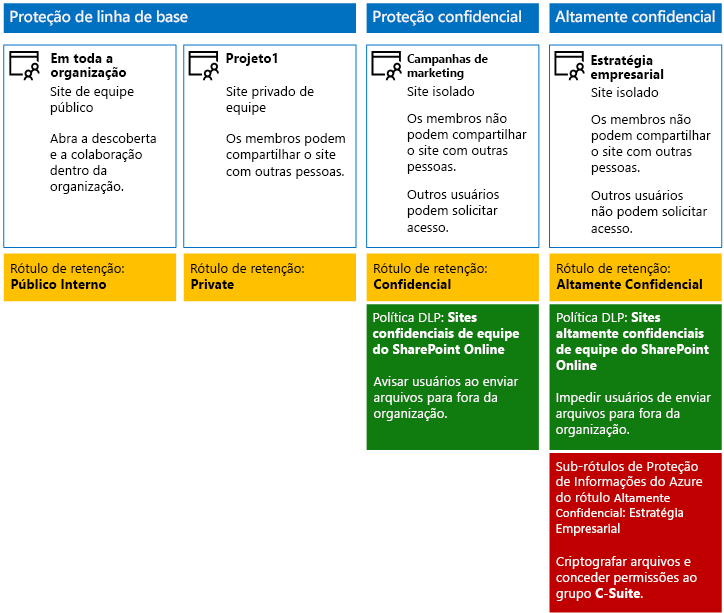

# <a name="secure-sharepoint-online-sites-in-a-devtest-environment"></a><span data-ttu-id="46eaf-103">Proteger sites do SharePoint Online em um ambiente de desenvolvimento/teste</span><span class="sxs-lookup"><span data-stu-id="46eaf-103">Secure SharePoint Online sites in a dev/test environment</span></span>

 <span data-ttu-id="46eaf-104">**Resumo:** crie sites de equipe do SharePoint Online públicos, privados, confidenciais e altamente confidenciais em um ambiente de desenvolvimento/teste.</span><span class="sxs-lookup"><span data-stu-id="46eaf-104">**Summary:** Create public, private, sensitive, and highly confidential SharePoint Online team sites in a dev/test environment.</span></span>
  
<span data-ttu-id="46eaf-105">Este artigo fornece instruções passo a passo para criar um ambiente de desenvolvimento/teste que inclui os quatro tipos diferentes de sites de equipe do SharePoint Online para a solução de [arquivos e sites seguros do SharePoint Online](secure-sharepoint-online-sites-and-files.md).</span><span class="sxs-lookup"><span data-stu-id="46eaf-105">This article provides step-by-step instructions to create a dev/test environment that includes the four different types of SharePoint Online team sites for the [Secure SharePoint Online sites and files](secure-sharepoint-online-sites-and-files.md) solution.</span></span>
  

  
<span data-ttu-id="46eaf-107">Use este ambiente de desenvolvimento/teste para experimentar com os comportamentos de proteção de informações e ajustar as configurações para suas necessidades específicas antes de implantar sites de equipe do SharePoint Online na produção.</span><span class="sxs-lookup"><span data-stu-id="46eaf-107">Use this dev/test environment to experiment with the information protection behaviors and fine-tune settings for your specific needs before deploying SharePoint Online team sites in production.</span></span>
  
## <a name="phase-1-create-your-devtest-environment"></a><span data-ttu-id="46eaf-108">Fase 1: criar seu ambiente de desenvolvimento/teste</span><span class="sxs-lookup"><span data-stu-id="46eaf-108">Phase 1: Create your dev/test environment</span></span>

<span data-ttu-id="46eaf-109">Nesta fase, você deve obter assinaturas de avaliação do Office 365 e do Enterprise Mobility + Security (EMS) para uma organização fictícia.</span><span class="sxs-lookup"><span data-stu-id="46eaf-109">In this phase, you obtain trial subscriptions for Office 365 and Enterprise Mobility + Security (EMS) for a fictional organization.</span></span>
  
<span data-ttu-id="46eaf-110">Primeiro, siga as instruções na **Fase 2** do [ambiente de desenvolvimento/de teste do Office 365](https://docs.microsoft.com/office365/enterprise/office-365-dev-test-environment).</span><span class="sxs-lookup"><span data-stu-id="46eaf-110">First, follow the instructions in **Phase 2** of the [Office 365 dev/test environment](https://docs.microsoft.com/office365/enterprise/office-365-dev-test-environment).</span></span>
  
<span data-ttu-id="46eaf-111">Em seguida, inscreva-se para a assinatura de avaliação do EMS e adicione-a à mesma organização de sua assinatura de avaliação do Office 365.</span><span class="sxs-lookup"><span data-stu-id="46eaf-111">Next, sign up for the EMS trial subscription and add it to the same organization as your Office 365 trial subscription.</span></span>
  
1. <span data-ttu-id="46eaf-112">Se necessário, entre no centro de administração [Microsoft 365](https://admin.microsoft.com) com as credenciais da conta do administrador global da sua assinatura de avaliação.</span><span class="sxs-lookup"><span data-stu-id="46eaf-112">If needed, sign in to the [Microsoft 365 admin center](https://admin.microsoft.com) with the credentials of the global administrator account of your trial subscription.</span></span>
    
2. <span data-ttu-id="46eaf-113">Na navegação à esquerda, clique em **cobrança > Serviços de compra**.</span><span class="sxs-lookup"><span data-stu-id="46eaf-113">In the left navigation, click **Billing > Purchase services**.</span></span>
    
3. <span data-ttu-id="46eaf-p101">Na página **Comprar serviços**, encontre o item **Enterprise Mobility + Security E5**. Passe o ponteiro do mouse sobre ele e clique em **Iniciar avaliação gratuita**.</span><span class="sxs-lookup"><span data-stu-id="46eaf-p101">On the **Purchase services** page, find the **Enterprise Mobility + Security E5** item. Hover your mouse pointer over it and click **Start free trial**.</span></span>
    
4. <span data-ttu-id="46eaf-116">Na página **Confirmar seu pedido**, clique em **Experimentar agora**.</span><span class="sxs-lookup"><span data-stu-id="46eaf-116">On the **Confirm your order** page, click **Try now**.</span></span>
    
5. <span data-ttu-id="46eaf-117">Na página **Recibo do pedido**, clique em **Continuar**.</span><span class="sxs-lookup"><span data-stu-id="46eaf-117">On the **Order receipt** page, click **Continue**.</span></span>
    
<span data-ttu-id="46eaf-118">Em seguida, habilite a licença do Enterprise Mobility + Security E5 para sua conta de administrador global.</span><span class="sxs-lookup"><span data-stu-id="46eaf-118">Next, enable the Enterprise Mobility + Security E5 license for your global administrator account.</span></span>
  
1. <span data-ttu-id="46eaf-119">Na guia **centro de administração do Microsoft 365** no navegador, na navegação à esquerda, clique em **Usuários > Usuários ativos**.</span><span class="sxs-lookup"><span data-stu-id="46eaf-119">On the **Microsoft 365 admin center** tab in your browser, in the left navigation, click **Users > Active users**.</span></span>
    
2. <span data-ttu-id="46eaf-120">Clique em sua conta de administrador global e, em seguida, clique em **Editar** para **Licenças de produto**.</span><span class="sxs-lookup"><span data-stu-id="46eaf-120">Click your global administrator account, and then click **Edit** for **Product licenses**.</span></span>
    
3. <span data-ttu-id="46eaf-121">No painel **Licenças de produto**, mude a licença de produto de **Enterprise Mobility + Security E5** para **Ativada**, clique em **Salvar** e clique em **Fechar** duas vezes.</span><span class="sxs-lookup"><span data-stu-id="46eaf-121">On the **Product licenses** pane, turn the product license for **Enterprise Mobility + Security E5** to **On**, click **Save,** and then click **Close** twice.</span></span>
    
## <a name="phase-2-create-and-configure-your-azure-active-directory-ad-groups-and-users"></a><span data-ttu-id="46eaf-122">Fase 2: criar e configurar seus grupos e usuários do Azure Active Directory (AD)</span><span class="sxs-lookup"><span data-stu-id="46eaf-122">Phase 2: Create and configure your Azure Active Directory (AD) groups and users</span></span>

<span data-ttu-id="46eaf-123">Nesta fase, você cria e configura os usuários e grupos do Azure AD para sua organização fictícia.</span><span class="sxs-lookup"><span data-stu-id="46eaf-123">In this phase, you create and configure the Azure AD groups and users for your fictional organization.</span></span>
  
<span data-ttu-id="46eaf-124">Primeiro, crie um conjunto de grupos para uma organização comum com o portal do Azure.</span><span class="sxs-lookup"><span data-stu-id="46eaf-124">First, create a set of groups for a typical organization with the Azure portal.</span></span>
  
1. <span data-ttu-id="46eaf-p102">Abra uma guia separada no navegador e vá para o Portal do Azure em [https://portal.azure.com](https://portal.azure.com). Se necessário, entre com as credenciais da conta de administrador global da sua assinatura de avaliação do Office 365 E5.</span><span class="sxs-lookup"><span data-stu-id="46eaf-p102">Create a separate tab in your browser, and then go to the Azure portal at [https://portal.azure.com](https://portal.azure.com). If needed, sign in with the credentials of the global administrator account for your Office 365 E5 trial subscription.</span></span>
    
2. <span data-ttu-id="46eaf-127">No Portal do Azure, clique em **Azure Active Directory > Grupos**.</span><span class="sxs-lookup"><span data-stu-id="46eaf-127">In the Azure portal, click **Azure Active Directory > Groups**.</span></span>
    
3. <span data-ttu-id="46eaf-128">Na folha **Grupos – Todos os grupos**, clique em **+ Novo grupo**.</span><span class="sxs-lookup"><span data-stu-id="46eaf-128">On the **Groups - All groups** blade, click **+ New group**.</span></span>
    
4. <span data-ttu-id="46eaf-129">Na folha **Grupo**:</span><span class="sxs-lookup"><span data-stu-id="46eaf-129">On the **Group** blade:</span></span>
    
  - <span data-ttu-id="46eaf-130">Escolha **Office 365** em **Tipo de Grupo**.</span><span class="sxs-lookup"><span data-stu-id="46eaf-130">Select **Office 365** in **Group type**.</span></span>
    
  - <span data-ttu-id="46eaf-131">Digite **Pacote C** em **Nome**.</span><span class="sxs-lookup"><span data-stu-id="46eaf-131">Type **C-Suite** in **Name**.</span></span>
    
  - <span data-ttu-id="46eaf-132">Escolha **Atribuído** em **Tipo de Associação**.</span><span class="sxs-lookup"><span data-stu-id="46eaf-132">Select **Assigned** in **Membership type**.</span></span>
      
5. <span data-ttu-id="46eaf-133">Clique em **Criar** e, em seguida, feche a folha **Grupo**.</span><span class="sxs-lookup"><span data-stu-id="46eaf-133">Click **Create**, and then close the **Group** blade.</span></span>
    
6. <span data-ttu-id="46eaf-134">Repita as etapas 3 a 5 para os seguintes nomes de grupo:</span><span class="sxs-lookup"><span data-stu-id="46eaf-134">Repeat steps 3-5 for the following group names:</span></span>
    
  - <span data-ttu-id="46eaf-135">Equipe de TI</span><span class="sxs-lookup"><span data-stu-id="46eaf-135">IT staff</span></span>
    
  - <span data-ttu-id="46eaf-136">Equipe de pesquisa</span><span class="sxs-lookup"><span data-stu-id="46eaf-136">Research staff</span></span>
    
  - <span data-ttu-id="46eaf-137">Equipe regular</span><span class="sxs-lookup"><span data-stu-id="46eaf-137">Regular staff</span></span>
    
  - <span data-ttu-id="46eaf-138">Equipe de marketing</span><span class="sxs-lookup"><span data-stu-id="46eaf-138">Marketing staff</span></span>
    
  - <span data-ttu-id="46eaf-139">Equipe de vendas</span><span class="sxs-lookup"><span data-stu-id="46eaf-139">Sales staff</span></span>
    
7. <span data-ttu-id="46eaf-140">Mantenha aberta a guia do portal do Azure no navegador.</span><span class="sxs-lookup"><span data-stu-id="46eaf-140">Keep the Azure portal tab in your browser open.</span></span>
    
<span data-ttu-id="46eaf-141">Em seguida, configure o licenciamento automático para que os membros de seus grupos recebam automaticamente a atribuição de licenças para suas assinaturas do Office 365 e do EMS.</span><span class="sxs-lookup"><span data-stu-id="46eaf-141">Next, you configure automatic licensing so that members of your groups are automatically assigned licenses for your Office 365 and EMS subscriptions.</span></span>
  
1. <span data-ttu-id="46eaf-142">No Portal do Azure, clique em **Azure Active Directory > Licenças > Todos os produtos**.</span><span class="sxs-lookup"><span data-stu-id="46eaf-142">In the Azure portal, click **Azure Active Directory > Licenses > All products**.</span></span>
    
2. <span data-ttu-id="46eaf-143">Na lista, escolha **Enterprise Mobility + Security E5** e **Office 365 Enterprise E5** e clique em **Atribuir**.</span><span class="sxs-lookup"><span data-stu-id="46eaf-143">In the list, select **Enterprise Mobility + Security E5** and **Office 365 Enterprise E5**, and then click **Assign**.</span></span>
    
3. <span data-ttu-id="46eaf-144">Na folha **Atribuir licença**, clique em **Usuários e grupos**.</span><span class="sxs-lookup"><span data-stu-id="46eaf-144">In the **Assign license** blade, click **Users and groups**.</span></span>
    
4. <span data-ttu-id="46eaf-145">Na lista de grupos, selecione o seguinte:</span><span class="sxs-lookup"><span data-stu-id="46eaf-145">In the list of groups, select the following:</span></span>
    
  - <span data-ttu-id="46eaf-146">Pacote C</span><span class="sxs-lookup"><span data-stu-id="46eaf-146">C-Suite</span></span>
    
  - <span data-ttu-id="46eaf-147">Equipe de TI</span><span class="sxs-lookup"><span data-stu-id="46eaf-147">IT staff</span></span>
    
  - <span data-ttu-id="46eaf-148">Equipe de pesquisa</span><span class="sxs-lookup"><span data-stu-id="46eaf-148">Research staff</span></span>
    
  - <span data-ttu-id="46eaf-149">Equipe regular</span><span class="sxs-lookup"><span data-stu-id="46eaf-149">Regular staff</span></span>
    
  - <span data-ttu-id="46eaf-150">Equipe de marketing</span><span class="sxs-lookup"><span data-stu-id="46eaf-150">Marketing staff</span></span>
    
  - <span data-ttu-id="46eaf-151">Equipe de vendas</span><span class="sxs-lookup"><span data-stu-id="46eaf-151">Sales staff</span></span>
    
5. <span data-ttu-id="46eaf-152">Clique em **Selecionar** e clique em **Atribuir**.</span><span class="sxs-lookup"><span data-stu-id="46eaf-152">Click **Select**, and then click **Assign**.</span></span>
    
6. <span data-ttu-id="46eaf-153">Feche a guia do Portal do Azure no navegador.</span><span class="sxs-lookup"><span data-stu-id="46eaf-153">Close the Azure portal tab in your browser.</span></span>
    
<span data-ttu-id="46eaf-154">Em seguida, conecte-se ao módulo [PowerShell do Azure Active Directory para Graph](https://docs.microsoft.com/office365/enterprise/powershell/connect-to-office-365-powershell#connect-with-the-azure-active-directory-powershell-for-graph-module).</span><span class="sxs-lookup"><span data-stu-id="46eaf-154">Next, you [Connect with the Azure Active Directory PowerShell for Graph module ](https://docs.microsoft.com/office365/enterprise/powershell/connect-to-office-365-powershell#connect-with-the-azure-active-directory-powershell-for-graph-module).</span></span>
  
<span data-ttu-id="46eaf-155">Preencha o nome da organização, seu local e uma senha comum. Execute esses comandos no prompt de comando do PowerShell ou no ISE (Ambiente de Script Integrado) para criar contas de usuário e adicioná-las aos grupos:</span><span class="sxs-lookup"><span data-stu-id="46eaf-155">Fill in your organization name, your location, and a common password, and then run these commands from the PowerShell command prompt or Integrated Script Environment (ISE) to create user accounts and add them to their groups:</span></span>
  
```
$orgName="<organization name, such as contoso for the contoso.onmicrosoft.com trial subscription domain name>"
$location="<the ISO ALPHA2 country code, such as US for the United States>"
$commonPassword="<common password for all the new accounts>"

$PasswordProfile=New-Object -TypeName Microsoft.Open.AzureAD.Model.PasswordProfile
$PasswordProfile.Password=$commonPassword

$groupName="C-Suite"
$userNames=@("CEO","CFO","CIO") 
$groupID=(Get-AzureADGroup | Where { $_.DisplayName -eq $groupName }).ObjectID
ForEach ($element in $userNames){ 
New-AzureADUser -DisplayName $element -PasswordProfile $PasswordProfile -UserPrincipalName ($element + "@" + $orgName + ".onmicrosoft.com") -AccountEnabled $true -MailNickName $element -UsageLocation $location 
Add-AzureADGroupMember -RefObjectId (Get-AzureADUser | Where { $_.DisplayName -eq $element }).ObjectID -ObjectId $groupID
}
$groupName="IT staff"
$userNames=@("ITAdmin1","ITAdmin2") 
$groupID=(Get-AzureADGroup | Where { $_.DisplayName -eq $groupName }).ObjectID
ForEach ($element in $userNames){ 
New-AzureADUser -DisplayName $element -PasswordProfile $PasswordProfile -UserPrincipalName ($element + "@" + $orgName + ".onmicrosoft.com") -AccountEnabled $true -MailNickName $element -UsageLocation $location 
Add-AzureADGroupMember -RefObjectId (Get-AzureADUser | Where { $_.DisplayName -eq $element }).ObjectID -ObjectId $groupID
}
$groupName="Research staff"
$userNames=@("Researcher1") 
$groupID=(Get-AzureADGroup | Where { $_.DisplayName -eq $groupName }).ObjectID
ForEach ($element in $userNames){ 
New-AzureADUser -DisplayName $element -PasswordProfile $PasswordProfile -UserPrincipalName ($element + "@" + $orgName + ".onmicrosoft.com") -AccountEnabled $true -MailNickName $element -UsageLocation $location 
Add-AzureADGroupMember -RefObjectId (Get-AzureADUser | Where { $_.DisplayName -eq $element }).ObjectID -ObjectId $groupID
}
$groupName="Regular staff"
$userNames=@("Regular1", "Regular2") 
$groupID=(Get-AzureADGroup | Where { $_.DisplayName -eq $groupName }).ObjectID
ForEach ($element in $userNames){ 
New-AzureADUser -DisplayName $element -PasswordProfile $PasswordProfile -UserPrincipalName ($element + "@" + $orgName + ".onmicrosoft.com") -AccountEnabled $true -MailNickName $element -UsageLocation $location 
Add-AzureADGroupMember -RefObjectId (Get-AzureADUser | Where { $_.DisplayName -eq $element }).ObjectID -ObjectId $groupID
}
$groupName="Marketing staff"
$userNames=@("Marketing1", "Marketing2") 
$groupID=(Get-AzureADGroup | Where { $_.DisplayName -eq $groupName }).ObjectID
ForEach ($element in $userNames){ 
New-AzureADUser -DisplayName $element -PasswordProfile $PasswordProfile -UserPrincipalName ($element + "@" + $orgName + ".onmicrosoft.com") -AccountEnabled $true -MailNickName $element -UsageLocation $location 
Add-AzureADGroupMember -RefObjectId (Get-AzureADUser | Where { $_.DisplayName -eq $element }).ObjectID -ObjectId $groupID
}
$groupName="Sales staff"
$userNames=@("SalesPerson1") 
$groupID=(Get-AzureADGroup | Where { $_.DisplayName -eq $groupName }).ObjectID
ForEach ($element in $userNames){ 
New-AzureADUser -DisplayName $element -PasswordProfile $PasswordProfile -UserPrincipalName ($element + "@" + $orgName + ".onmicrosoft.com") -AccountEnabled $true -MailNickName $element -UsageLocation $location 
Add-AzureADGroupMember -RefObjectId (Get-AzureADUser | Where { $_.DisplayName -eq $element }).ObjectID -ObjectId $groupID
}
```

> [!NOTE]
> <span data-ttu-id="46eaf-156">O uso de uma senha comum aqui é para a automação e facilidade de configuração para um ambiente de desenvolvimento/teste.</span><span class="sxs-lookup"><span data-stu-id="46eaf-156">The use of a common password here is for automation and ease of configuration for a dev/test environment.</span></span> <span data-ttu-id="46eaf-157">Obviamente, isso é recomendado para assinaturas de produção.</span><span class="sxs-lookup"><span data-stu-id="46eaf-157">Obviously, this is highly discouraged for production subscriptions.</span></span> 
  
<span data-ttu-id="46eaf-158">Use essas etapas para verificar se o licenciamento baseado em grupo está funcionando corretamente.</span><span class="sxs-lookup"><span data-stu-id="46eaf-158">Use these steps to verify that group-based licensing is working correctly.</span></span>
  
1. <span data-ttu-id="46eaf-159">Na guia **Microsoft Office Home** do navegador, clique no bloco **Administração**.</span><span class="sxs-lookup"><span data-stu-id="46eaf-159">From the **Microsoft Office Home** tab of your browser, click the **Admin** tile.</span></span>
    
2. <span data-ttu-id="46eaf-160">Na nova guia **Centro de Administração do Office** do navegador, clique em **Usuários**.</span><span class="sxs-lookup"><span data-stu-id="46eaf-160">From the new **Office Admin center** tab of your browser, click **Users**.</span></span>
    
3. <span data-ttu-id="46eaf-161">Na lista de usuários, clique em **CEO**.</span><span class="sxs-lookup"><span data-stu-id="46eaf-161">In the list of users, click **CEO**.</span></span>
    
4. <span data-ttu-id="46eaf-162">No painel que lista as propriedades da conta de usuário **CEO**, verifique se ele recebeu a atribuição das licenças **Enterprise Mobility + Security E5** e **Office 365 Enterprise E5** (em **Licenças de produto**).</span><span class="sxs-lookup"><span data-stu-id="46eaf-162">In the pane that lists the properties of the **CEO** user account, verify that it has been assigned the **Enterprise Mobility + Security E5** and **Office 365 Enterprise E5** licenses (in **Product licenses**).</span></span>
    
## <a name="phase-3-create-office-365-retention-labels"></a><span data-ttu-id="46eaf-163">Fase 3: Criar etiquetas de retenção do Office 365</span><span class="sxs-lookup"><span data-stu-id="46eaf-163">Phase 3: Create Office 365 retention labels</span></span>

<span data-ttu-id="46eaf-164">Nesta fase, você deve criar os rótulos para os diferentes níveis de segurança das pastas e documentos do site de equipe do SharePoint Online.</span><span class="sxs-lookup"><span data-stu-id="46eaf-164">In this phase, you create the retention labels for the different levels of security for SharePoint Online team site documents folders.</span></span>


1. <span data-ttu-id="46eaf-165">Acesse o [portal de conformidade do Microsoft 365](https://compliance.microsoft.com) com sua conta de administrador global.</span><span class="sxs-lookup"><span data-stu-id="46eaf-165">Sign in to the [Microsoft 365 compliance portal](https://compliance.microsoft.com) with your global admin account.</span></span>
    
2. <span data-ttu-id="46eaf-166">Na guia **Início - Conformidade do Microsoft 365** do navegador, clique em **Classificações > Rótulos**.</span><span class="sxs-lookup"><span data-stu-id="46eaf-166">From the **Home - Microsoft 365 compliance** tab of your browser, click **Classifications > Labels**.</span></span>
    
3. <span data-ttu-id="46eaf-167">Clique em **Rótulos de retenção > Criar um rótulo**.</span><span class="sxs-lookup"><span data-stu-id="46eaf-167">Click **Retention labels > Create a label**.</span></span>
    
4. <span data-ttu-id="46eaf-168">No painel **Atribuir nome ao seu rótulo** digite **Público interno** em **Atribuir nome ao seu rótulo**, e clique em **Avançar**.</span><span class="sxs-lookup"><span data-stu-id="46eaf-168">On the **Name your label** pane, type **Internal Public** in **Name your label**, and then click **Next**.</span></span>

5. <span data-ttu-id="46eaf-169">No painel **descritores de plano de arquivo**, clique em **próximo**.</span><span class="sxs-lookup"><span data-stu-id="46eaf-169">On the **File plan descriptors** pane, click **Next**.</span></span>
    
6. <span data-ttu-id="46eaf-170">No painel **configurações de etiqueta**, se necessário, defina **retenção** para **no**e, em seguida, clique em **próximo**.</span><span class="sxs-lookup"><span data-stu-id="46eaf-170">On the **Label settings** pane, if needed, set **Retention** to **On**, and then click **Next**.</span></span>
    
7. <span data-ttu-id="46eaf-171">No painel **Revise suas configurações**, clique em **Criar o rótulo**.</span><span class="sxs-lookup"><span data-stu-id="46eaf-171">On the **Review your settings** pane, click **Create the label**.</span></span>
    
8. <span data-ttu-id="46eaf-172">Repita as etapas 3 a 7 para etiquetas adicionais com esses nomes:</span><span class="sxs-lookup"><span data-stu-id="46eaf-172">Repeat steps 3-8 for additional labels with these names:</span></span>
    
  - <span data-ttu-id="46eaf-173">Private</span><span class="sxs-lookup"><span data-stu-id="46eaf-173">Private</span></span>
    
  - <span data-ttu-id="46eaf-174">Confidencial</span><span class="sxs-lookup"><span data-stu-id="46eaf-174">Sensitive</span></span>
    
  - <span data-ttu-id="46eaf-175">Altamente Confidencial</span><span class="sxs-lookup"><span data-stu-id="46eaf-175">Highly Confidential</span></span>
  
9. <span data-ttu-id="46eaf-176">No painel **Início > Rótulos**, clique em **Publicar rótulos**.</span><span class="sxs-lookup"><span data-stu-id="46eaf-176">From the **Home > Labels** pane, click **Publish labels**.</span></span>
    
10. <span data-ttu-id="46eaf-177">No painel **Escolher rótulos para publicar**, clique em **Escolher rótulos para publicar**.</span><span class="sxs-lookup"><span data-stu-id="46eaf-177">On the **Choose labels to publish** pane, click **Choose labels to publish**.</span></span>
    
11. <span data-ttu-id="46eaf-178">No painel **Escolher rótulos**, clique em **Adicionar** e selecione todos os quatro rótulos.</span><span class="sxs-lookup"><span data-stu-id="46eaf-178">On the **Choose labels** pane, click **Add** and select all four labels.</span></span>
    
12. <span data-ttu-id="46eaf-179">Clique em **Concluído**.</span><span class="sxs-lookup"><span data-stu-id="46eaf-179">Click **Done**.</span></span>
    
13. <span data-ttu-id="46eaf-180">No painel **Escolher rótulos para publicar**, clique em **Avançar**.</span><span class="sxs-lookup"><span data-stu-id="46eaf-180">On the **Choose labels to publish** pane, click **Next**.</span></span>
    
14. <span data-ttu-id="46eaf-181">No painel **Escolher locais**, clique em **Avançar**.</span><span class="sxs-lookup"><span data-stu-id="46eaf-181">On the **Choose locations** pane, click **Next**.</span></span>
    
15. <span data-ttu-id="46eaf-182">No painel **Atribuir um nome à política**, digite **Organização de exemplo** em **Nome** e clique em **Avançar**.</span><span class="sxs-lookup"><span data-stu-id="46eaf-182">On the **Name your policy** pane, type **Example organization** in **Name**, and then click **Next**.</span></span>
    
16. <span data-ttu-id="46eaf-183">No painel **Examine as configurações**, clique em **Publicar rótulos** e clique em **Fechar**.</span><span class="sxs-lookup"><span data-stu-id="46eaf-183">On the **Review your settings** pane, click **Publish labels**, and then click **Close**.</span></span>
    
## <a name="phase-4-create-your-sharepoint-online-team-sites"></a><span data-ttu-id="46eaf-184">Fase 4: criar sites de equipe do SharePoint Online</span><span class="sxs-lookup"><span data-stu-id="46eaf-184">Phase 4: Create your SharePoint Online team sites</span></span>

<span data-ttu-id="46eaf-185">Nesta fase, você cria e configura os quatro tipos de sites de equipe do SharePoint Online para sua organização de exemplo.</span><span class="sxs-lookup"><span data-stu-id="46eaf-185">In this phase, you create and configure the four types of SharePoint Online team sites for your example organization.</span></span>
  
### <a name="organization-wide-team-site"></a><span data-ttu-id="46eaf-186">Site de equipe de toda a organização</span><span class="sxs-lookup"><span data-stu-id="46eaf-186">Organization wide team site</span></span>

<span data-ttu-id="46eaf-187">Para criar um site de equipe do SharePoint Online público de linha de base, faça o seguinte:</span><span class="sxs-lookup"><span data-stu-id="46eaf-187">To create a baseline public SharePoint Online team site, do the following:</span></span>
  
1. <span data-ttu-id="46eaf-188">Se necessário, entre no [Portal do Office 365](https://portal.office.com) com as credenciais da conta de administrador global da sua assinatura de avaliação.</span><span class="sxs-lookup"><span data-stu-id="46eaf-188">If needed, sign in to the [Office 365 portal](https://portal.office.com) with the credentials of the global administrator account of your trial subscription.</span></span>
    
2. <span data-ttu-id="46eaf-189">Na lista de blocos, clique em **SharePoint**.</span><span class="sxs-lookup"><span data-stu-id="46eaf-189">In the list of tiles, click **SharePoint**.</span></span>
    
3. <span data-ttu-id="46eaf-190">Na nova guia **SharePoint** no navegador, clique em **+ Criar site**.</span><span class="sxs-lookup"><span data-stu-id="46eaf-190">On the new **SharePoint** tab in your browser, click **+ Create site**.</span></span>
    
4. <span data-ttu-id="46eaf-191">Na página **Criar um site**, clique em **Site de equipe**.</span><span class="sxs-lookup"><span data-stu-id="46eaf-191">On the **Create a site** page, click **Team site**.</span></span>
    
5. <span data-ttu-id="46eaf-192">Em **Nome do site**, digite **Toda a organização**.</span><span class="sxs-lookup"><span data-stu-id="46eaf-192">In **Site name**, type **Organization wide**.</span></span> 
    
6. <span data-ttu-id="46eaf-193">Na **Descrição do site de equipe**, digite **Site do SharePoint para toda a organização**.</span><span class="sxs-lookup"><span data-stu-id="46eaf-193">In **Team site description**, type **SharePoint site for the entire organization**.</span></span>
    
7. <span data-ttu-id="46eaf-194">Em **Configurações de privacidade**, escolha **Público – qualquer pessoa na organização pode acessar esse site** e clique em **Avançar**.</span><span class="sxs-lookup"><span data-stu-id="46eaf-194">In **Privacy settings**, select **Public - anyone in the organization can access this site**, and then click **Next**.</span></span>
    
8. <span data-ttu-id="46eaf-195">No painel **Quem você deseja adicionar?**, clique em **Concluir**.</span><span class="sxs-lookup"><span data-stu-id="46eaf-195">On the **Who do you want to add?** pane, click **Finish**.</span></span>
    
<span data-ttu-id="46eaf-196">Em seguida, configure a pasta de documentos do site de equipe Toda a organização para o rótulo Público interno.</span><span class="sxs-lookup"><span data-stu-id="46eaf-196">Next, configure the documents folder of the Organization wide team site for the Internal Public label.</span></span>
  
1. <span data-ttu-id="46eaf-197">Na guia **Toda a organização – Página Inicial** do navegador, clique em **Documentos**.</span><span class="sxs-lookup"><span data-stu-id="46eaf-197">In the **Organization wide-Home** tab of your browser, click **Documents**.</span></span>
    
2. <span data-ttu-id="46eaf-198">Clique no ícone de configurações e em **Configurações de biblioteca**.</span><span class="sxs-lookup"><span data-stu-id="46eaf-198">Click the settings icon, and then click **Library settings**.</span></span>
    
3. <span data-ttu-id="46eaf-199">Em **Permissões e Gerenciamento**, clique em **Aplicar o rótulo aos itens nessa biblioteca**.</span><span class="sxs-lookup"><span data-stu-id="46eaf-199">Under **Permissions and Management**, click **Apply label to items in this library**.</span></span>
    
4. <span data-ttu-id="46eaf-200">Em **Configurações – Aplicar Rótulo**, escolha **Público interno** e clique em **Salvar**.</span><span class="sxs-lookup"><span data-stu-id="46eaf-200">In **Settings-Apply Label**, select **Internal Public**, and then click **Save**.</span></span>
    
### <a name="project-1-team-site"></a><span data-ttu-id="46eaf-201">Site de equipe do projeto 1</span><span class="sxs-lookup"><span data-stu-id="46eaf-201">Project 1 team site</span></span>

<span data-ttu-id="46eaf-202">Para criar um site de equipe básico e privado do SharePoint Online para um projeto dentro da organização, faça o seguinte:</span><span class="sxs-lookup"><span data-stu-id="46eaf-202">To create a baseline private SharePoint Online team site for a project within the organization, do the following:</span></span>
  
1. <span data-ttu-id="46eaf-203">Se necessário, entre no [Portal do Office 365](https://portal.office.com) com as credenciais da conta de administrador global da sua assinatura de avaliação.</span><span class="sxs-lookup"><span data-stu-id="46eaf-203">If needed, sign in to the [Office 365 portal](https://portal.office.com) with the credentials of the global administrator account of your trial subscription.</span></span>
    
2. <span data-ttu-id="46eaf-204">Na lista de blocos, clique em **SharePoint**.</span><span class="sxs-lookup"><span data-stu-id="46eaf-204">In the list of tiles, click **SharePoint**.</span></span>
    
3. <span data-ttu-id="46eaf-205">Na nova guia **SharePoint** no navegador, clique em **+ Criar site**.</span><span class="sxs-lookup"><span data-stu-id="46eaf-205">On the new **SharePoint** tab in your browser, click **+ Create site**.</span></span>
    
4. <span data-ttu-id="46eaf-206">Na página **Criar um site**, clique em **Site de equipe**.</span><span class="sxs-lookup"><span data-stu-id="46eaf-206">On the **Create a site** page, click **Team site**.</span></span>
    
5. <span data-ttu-id="46eaf-207">Em **Nome do site**, digite **Projeto 1**.</span><span class="sxs-lookup"><span data-stu-id="46eaf-207">In **Site name**, type **Project 1**.</span></span> 
    
6. <span data-ttu-id="46eaf-208">Na **Descrição do site de equipe**, digite **Site do SharePoint para Projeto 1**.</span><span class="sxs-lookup"><span data-stu-id="46eaf-208">In **Team site description,** type **SharePoint site for Project 1**.</span></span>
    
7. <span data-ttu-id="46eaf-209">Em **Configurações de privacidade**, escolha **Privado – somente membros podem acessar esse site** e clique em **Avançar**.</span><span class="sxs-lookup"><span data-stu-id="46eaf-209">In **Privacy settings**, select **Private - only members can access this site**, and then click **Next**.</span></span>
    
8. <span data-ttu-id="46eaf-210">No painel **Quem você deseja adicionar?**, clique em **Concluir**.</span><span class="sxs-lookup"><span data-stu-id="46eaf-210">On the **Who do you want to add?** pane, click **Finish**.</span></span>
    
<span data-ttu-id="46eaf-211">Em seguida, configure a pasta de documentos do site de equipe Projeto 1 para o rótulo Privado.</span><span class="sxs-lookup"><span data-stu-id="46eaf-211">Next, configure the documents folder of the Project 1 team site for the Private label.</span></span>
  
1. <span data-ttu-id="46eaf-212">Na guia **Projeto 1 – Página Inicial** do navegador, clique em **Documentos**.</span><span class="sxs-lookup"><span data-stu-id="46eaf-212">In the **Project 1-Home** tab of your browser, click **Documents**.</span></span>
    
2. <span data-ttu-id="46eaf-213">Clique no ícone de configurações e em **Configurações de biblioteca**.</span><span class="sxs-lookup"><span data-stu-id="46eaf-213">Click the settings icon, and then click **Library settings**.</span></span>
    
3. <span data-ttu-id="46eaf-214">Em **Permissões e Gerenciamento**, clique em **Aplicar o rótulo aos itens nessa biblioteca**.</span><span class="sxs-lookup"><span data-stu-id="46eaf-214">Under **Permissions and Management**, click **Apply label to items in this library**.</span></span>
    
4. <span data-ttu-id="46eaf-215">Em **Configurações – Aplicar Rótulo**, escolha **Privado** e clique em **Salvar**.</span><span class="sxs-lookup"><span data-stu-id="46eaf-215">In **Settings-Apply Label**, select **Private**, and then click **Save**.</span></span>
    
### <a name="marketing-campaigns-team-site"></a><span data-ttu-id="46eaf-216">Site de equipe de campanhas de marketing</span><span class="sxs-lookup"><span data-stu-id="46eaf-216">Marketing campaigns team site</span></span>

<span data-ttu-id="46eaf-217">Para criar um site de equipe do SharePoint Online isolado e com nível confidencial para recursos de campanha de marketing, faça o seguinte:</span><span class="sxs-lookup"><span data-stu-id="46eaf-217">To create a sensitive-level isolated SharePoint Online team site for marketing campaign resources, do the following:</span></span>

 
1. <span data-ttu-id="46eaf-218">Se necessário, entre no [Portal do Office 365](https://portal.office.com) com as credenciais da conta de administrador global da sua assinatura de avaliação.</span><span class="sxs-lookup"><span data-stu-id="46eaf-218">If needed, sign in to the [Office 365 portal](https://portal.office.com) with the credentials of the global administrator account of your trial subscription.</span></span>
    
2. <span data-ttu-id="46eaf-219">Na lista de blocos, clique em **SharePoint**.</span><span class="sxs-lookup"><span data-stu-id="46eaf-219">In the list of tiles, click **SharePoint**.</span></span>
    
3. <span data-ttu-id="46eaf-220">Na nova guia **SharePoint** no navegador, clique em **+ Criar site**.</span><span class="sxs-lookup"><span data-stu-id="46eaf-220">On the new **SharePoint** tab in your browser, click **+ Create site**.</span></span>
    
4. <span data-ttu-id="46eaf-221">Na página **Criar um site**, clique em **Site de equipe**.</span><span class="sxs-lookup"><span data-stu-id="46eaf-221">On the **Create a site** page, click **Team site**.</span></span>
    
5. <span data-ttu-id="46eaf-222">Em **Nome do site de equipe**, digite **Campanhas de marketing**.</span><span class="sxs-lookup"><span data-stu-id="46eaf-222">In **Team site name**, type **Marketing campaigns**.</span></span>
    
6. <span data-ttu-id="46eaf-223">Em **Descrição do site de equipe**, digite **Site do SharePoint para recursos de campanha de marketing (confidencial)**.</span><span class="sxs-lookup"><span data-stu-id="46eaf-223">In **Team site description**, type **SharePoint site for marketing campaign resources (sensitive)**.</span></span>
    
7.  <span data-ttu-id="46eaf-224">Em **Configurações de privacidade**, escolha **Privado – somente membros podem acessar esse site** e clique em **Avançar**.</span><span class="sxs-lookup"><span data-stu-id="46eaf-224">In **Privacy settings**, select **Private - only members can access this site**, and then click **Next**.</span></span>
    
8. <span data-ttu-id="46eaf-225">No painel **Quem você deseja adicionar?**, clique em **Concluir**.</span><span class="sxs-lookup"><span data-stu-id="46eaf-225">On the **Who do you want to add?** pane, click **Finish**.</span></span>
    
9. <span data-ttu-id="46eaf-226">Na nova guia **Campanhas de marketing** no navegador, na barra de ferramentas, clique no ícone de configurações e em **Permissões do site**.</span><span class="sxs-lookup"><span data-stu-id="46eaf-226">On the new **Marketing campaigns** tab in your browser, in the tool bar, click the settings icon, and then click **Site permissions**.</span></span>
    
10. <span data-ttu-id="46eaf-227">No painel **Permissões do site**, clique em **Configurações de permissões avançadas**.</span><span class="sxs-lookup"><span data-stu-id="46eaf-227">In the **Site permissions** pane, click **Advanced permissions settings**.</span></span>
    
11. <span data-ttu-id="46eaf-228">Na nova guia **Permissões** no navegador, clique em **Configurações de Solicitação de Acesso**.</span><span class="sxs-lookup"><span data-stu-id="46eaf-228">In the new **Permissions** tab in your browser, click **Access Request Settings**.</span></span>
    
12. <span data-ttu-id="46eaf-229">Na caixa de diálogo **Configurações de Solicitação de Acesso**, desmarque as caixas de seleção **Permitir que membros compartilhem o site e arquivos e pastas individuais** e **Permitir que membros convidem outras pessoas para o grupo de membros do site**, digite **AdminTI1@**\<nome da organização>**.onmicrosoft.com** em **Enviar todas as solicitações para acesso** e clique em **OK**.</span><span class="sxs-lookup"><span data-stu-id="46eaf-229">In the **Access Request Settings** dialog box, clear the **Allow members to share the site and individual files and folders** and **Allow members to invite others to the site members group** check boxes, type **ITAdmin1@**\<your organization name>**.onmicrosoft.com** in **Send all requests for access**, and then click **OK**.</span></span>
    
13. <span data-ttu-id="46eaf-230">Clique em **Membros de campanhas de marketing** na lista.</span><span class="sxs-lookup"><span data-stu-id="46eaf-230">Click **Marketing campaigns Members** in the list.</span></span>
    
14. <span data-ttu-id="46eaf-231">Na página **Pessoas e Grupos**, clique em **Novo**.</span><span class="sxs-lookup"><span data-stu-id="46eaf-231">On the **People and Groups** page, click **New**.</span></span>
    
15. <span data-ttu-id="46eaf-232">Na caixa de diálogo **Compartilhar**, digite **Equipe de marketing**, selecione-a e clique em **Compartilhar**.</span><span class="sxs-lookup"><span data-stu-id="46eaf-232">In the **Share** dialog box, type **Marketing staff**, select it, and then click **Share**.</span></span>
    
16. <span data-ttu-id="46eaf-233">Repita as etapas 14 e 15 para a conta de usuário **Pesquisador1**.</span><span class="sxs-lookup"><span data-stu-id="46eaf-233">Repeat steps 14 and 15 for the **Researcher1** user account.</span></span>
    
17. <span data-ttu-id="46eaf-234">Clique no botão voltar de seu navegador.</span><span class="sxs-lookup"><span data-stu-id="46eaf-234">Click the back button on your browser.</span></span>
    
18. <span data-ttu-id="46eaf-235">Clique em **Proprietários de campanhas de marketing** na lista.</span><span class="sxs-lookup"><span data-stu-id="46eaf-235">Click **Marketing campaigns Owners** in the list.</span></span>
    
19. <span data-ttu-id="46eaf-236">Na página **Pessoas e Grupos**, clique em **Novo**.</span><span class="sxs-lookup"><span data-stu-id="46eaf-236">On the **People and Groups** page, click **New**.</span></span>
    
20. <span data-ttu-id="46eaf-237">Na caixa de diálogo **Compartilhar**, digite **Equipe de TI**, selecione o item e clique em **Compartilhar**.</span><span class="sxs-lookup"><span data-stu-id="46eaf-237">In the **Share** dialog box, type **IT staff**, select it, and then click **Share**.</span></span>
    
21. <span data-ttu-id="46eaf-238">Clique no botão voltar de seu navegador.</span><span class="sxs-lookup"><span data-stu-id="46eaf-238">Click the back button on your browser.</span></span>
    
22. <span data-ttu-id="46eaf-239">Feche a guia **Pessoas e Grupos** no navegador, clique na guia **Campanhas de marketing – Página Inicial** no navegador e feche o painel **Permissões de site**.</span><span class="sxs-lookup"><span data-stu-id="46eaf-239">Close the **People and Groups** tab in your browser, click the **Marketing campaigns-Home** tab in your browser, and then close the **Site permissions** pane.</span></span>
    
<span data-ttu-id="46eaf-240">Estes são os resultados da configuração de permissões:</span><span class="sxs-lookup"><span data-stu-id="46eaf-240">Here are the results of configuring permissions:</span></span>
  
- <span data-ttu-id="46eaf-241">O grupo do SharePoint **Campanhas de marketing – membros** contém apenas o grupo **Campanhas de marketing** (que contém a conta de usuário de administrador global), o grupo **Equipe de marketing** (que contém as conas de usuário Marketing1 e Marketing2) e a conta de usuário **Researcher1**.</span><span class="sxs-lookup"><span data-stu-id="46eaf-241">The **Marketing campaigns-Members** SharePoint group contains only the **Marketing campaigns** group (which contains the global administrator user account), the **Marketing staff** group (which contains the Marketing1 and Marketing2 user accounts), and the **Researcher1** user account.</span></span>
    
- <span data-ttu-id="46eaf-242">O grupo do SharePoint **Campanhas de marketing – Proprietários** contém apenas o grupo **Equipe de TI** (que contém apenas as contas de usuário ITAdmin1 e ITAdmin2).</span><span class="sxs-lookup"><span data-stu-id="46eaf-242">The **Marketing campaigns-Owners** SharePoint group contains only the **IT staff** group (which contains only the ITAdmin1 and ITAdmin2 user accounts).</span></span>
    
- <span data-ttu-id="46eaf-243">O grupo do SharePoint **Campanhas de marketing – Visitantes** não contém grupos ou contas de usuário.</span><span class="sxs-lookup"><span data-stu-id="46eaf-243">The **Marketing campaigns-Visitors** SharePoint group contains no groups or user accounts.</span></span>
    
- <span data-ttu-id="46eaf-244">Os membros não podem modificar permissões de nível de site (isso pode ser feito apenas por membros do grupo **Campanhas de marketing – Proprietários**).</span><span class="sxs-lookup"><span data-stu-id="46eaf-244">Members cannot modify site-level permissions (this can only be done by members of the **Marketing campaigns-Owners** group).</span></span>
    
- <span data-ttu-id="46eaf-245">Outras contas de usuário não podem acessar o site ou seus recursos, mas podem solicitar o acesso ao site, que enviará um email para a caixa de correio da conta de usuário AdminTI1.</span><span class="sxs-lookup"><span data-stu-id="46eaf-245">Other user accounts cannot access the site or its resources, but can request access to the site, which will send an email to the ITAdmin1 user account mailbox.</span></span>
    
<span data-ttu-id="46eaf-246">Em seguida, configure a pasta de documentos do site de equipe Campanhas de marketing para o rótulo Confidencial.</span><span class="sxs-lookup"><span data-stu-id="46eaf-246">Next, configure the documents folder of the Marketing campaigns team site for the Sensitive label.</span></span>
  
1. <span data-ttu-id="46eaf-247">Na guia **Campanhas de marketing – Página Inicial** do navegador, clique em **Documentos**.</span><span class="sxs-lookup"><span data-stu-id="46eaf-247">In the **Marketing campaigns-Home** tab of your browser, click **Documents**.</span></span>
    
2. <span data-ttu-id="46eaf-248">Clique no ícone de configurações e em **Configurações de biblioteca**.</span><span class="sxs-lookup"><span data-stu-id="46eaf-248">Click the settings icon, and then click **Library settings**.</span></span>
    
3. <span data-ttu-id="46eaf-249">Em **Permissões e Gerenciamento**, clique em **Aplicar o rótulo aos itens nessa biblioteca**.</span><span class="sxs-lookup"><span data-stu-id="46eaf-249">Under **Permissions and Management**, click **Apply label to items in this library**.</span></span>
    
4. <span data-ttu-id="46eaf-250">Em **Configurações – Aplicar Rótulo**, escolha **Confidencial** e clique em **Salvar**.</span><span class="sxs-lookup"><span data-stu-id="46eaf-250">In **Settings-Apply Label**, select **Sensitive**, and then click **Save**.</span></span>
    
<span data-ttu-id="46eaf-251">Em seguida, configure uma política DLP (prevenção de perda de dados) que notifica os usuários quando eles compartilham um documento em um site de equipe do SharePoint Online com o rótulo Confidencial, que inclui o site de Campanhas de marketing, fora da organização.</span><span class="sxs-lookup"><span data-stu-id="46eaf-251">Next, configure a data loss prevention (DLP) policy that notifies users when they share a document on a SharePoint Online team site with the Sensitive label, which includes the Marketing campaigns site, outside the organization.</span></span>

1. <span data-ttu-id="46eaf-252">Acesse o [portal de conformidade do Microsoft 365](https://compliance.microsoft.com/) com sua conta de administrador global.</span><span class="sxs-lookup"><span data-stu-id="46eaf-252">Sign in to the [Microsoft 365 compliance portal](https://compliance.microsoft.com/) with your global admin account.</span></span>
    
2. <span data-ttu-id="46eaf-253">Na nova guia **conformidade do Microsoft 365** em seu navegador, clique em**Políticas > Prevenção de perda de dados**.</span><span class="sxs-lookup"><span data-stu-id="46eaf-253">On the new **Microsoft 365 compliance** tab in your browser, click **Policies > Data loss prevention**.</span></span>
    
3. <span data-ttu-id="46eaf-254">No painel **Início > Prevenção de perda de dados**, clique em **Criar uma política**.</span><span class="sxs-lookup"><span data-stu-id="46eaf-254">In the **Home > Data loss prevention** pane, click **Create a policy**.</span></span>
    
4. <span data-ttu-id="46eaf-255">No painel **Iniciar com um modelo ou criar uma política personalizada**, clique em **Personalizado** e, em seguida, clique em **Avançar**.</span><span class="sxs-lookup"><span data-stu-id="46eaf-255">In the **Start with a template or create a custom policy** pane, click **Custom**, and then click **Next**.</span></span>
    
5. <span data-ttu-id="46eaf-256">No painel **Atribuir um nome à política**, digite **Sites de equipe do SharePoint Online de rótulo Confidencial** em **Nome** e clique em **Avançar**.</span><span class="sxs-lookup"><span data-stu-id="46eaf-256">In the **Name your policy** pane, type **Sensitive label SharePoint Online team sites** in **Name**, and then click **Next**.</span></span>
    
6. <span data-ttu-id="46eaf-257">No painel **Escolher locais**, clique em **Deixe-me escolher locais específicos** e, em seguida, clique em **Avançar**.</span><span class="sxs-lookup"><span data-stu-id="46eaf-257">In the **Choose locations** pane, click **Let me choose specific locations**, and then click **Next**.</span></span>
    
7. <span data-ttu-id="46eaf-258">Na lista de locais, desabilite os locais **email do Exchange**, **contas do OneDrive** e **Mensagens do canal e do chat do Teams** e, em seguida, clique em **Avançar**.</span><span class="sxs-lookup"><span data-stu-id="46eaf-258">In the list of locations, disable the **Exchange email**, **OneDrive accounts**, and **Teams chat and channel messages** locations, and then click **Next**.</span></span>
    
8. <span data-ttu-id="46eaf-259">No painel **Personalizar o tipo de conteúdo que você deseja proteger**, clique em **Editar**.</span><span class="sxs-lookup"><span data-stu-id="46eaf-259">In the **Customize the type of content you want to protect** pane, click **Edit**.</span></span>
    
9. <span data-ttu-id="46eaf-260">No painel **Escolher os tipos de conteúdo para proteger**, clique em **Adicionar** na caixa suspensa e, em seguida, clique em **Rótulos de retenção**.</span><span class="sxs-lookup"><span data-stu-id="46eaf-260">In the **Choose the types of content to protect** pane, click **Add** in the drop-down box, and then click **Retention labels**.</span></span>
    
10. <span data-ttu-id="46eaf-261">No painel **Rótulos de retenção**, clique em \*\* Adicionar\*\*, selecione o rótulo **Confidencial**, clique em **Adicionar** e, em seguida, clique em **Concluído**.</span><span class="sxs-lookup"><span data-stu-id="46eaf-261">In the **Retention labels** pane, click **Add**, select the **Sensitive** label, click **Add**, and then click **Done**.</span></span>
    
11. <span data-ttu-id="46eaf-262">No painel **Escolher os tipos de conteúdo para proteger**, clique em **Salvar**.</span><span class="sxs-lookup"><span data-stu-id="46eaf-262">In the **Choose the types of content to protect** pane, click **Save**.</span></span>
    
12. <span data-ttu-id="46eaf-263">No painel **personalizar um tipo de conteúdo que deseja proteger**, clique em **próxima**.</span><span class="sxs-lookup"><span data-stu-id="46eaf-263">In the **Customize the type of content you want to protect** pane, click **Next**.</span></span>

13. <span data-ttu-id="46eaf-264">No painel **O que deseja fazer se detectarmos informações confidenciais?**, clique em **Personalizar a dica e o email**.</span><span class="sxs-lookup"><span data-stu-id="46eaf-264">In the **What do you want to do if we detect sensitive info?** pane, click **Customize the tip and email**.</span></span>
    
14. <span data-ttu-id="46eaf-265">No painel **Personalizar dicas de política e notificações de email**, clique em **Personalizar o texto da dica da política**.</span><span class="sxs-lookup"><span data-stu-id="46eaf-265">In the **Customize policy tips and email notifications** pane, click **Customize the policy tip text**.</span></span>
    
15. <span data-ttu-id="46eaf-266">Na caixa de texto, digite ou cole uma das dicas a seguir, dependendo de se você implementou a Proteção de Informações do Azure para proteger arquivos altamente confidenciais:</span><span class="sxs-lookup"><span data-stu-id="46eaf-266">In the text box, type or paste in one of the following tips, depending on if you implemented Azure Information Protection to protect highly confidential files:</span></span>
    
  - <span data-ttu-id="46eaf-p104">Para compartilhar com um usuário de fora da organização, baixe o arquivo e abra-o. Clique em Arquivo, em seguida, Proteger Documento e Criptografar com Senha e especifique uma senha forte. Envie a senha em um email separado ou outros meios de comunicação.</span><span class="sxs-lookup"><span data-stu-id="46eaf-p104">To share with a user outside the organization, download the file and then open it. Click File, then Protect Document, and then Encrypt with Password, and then specify a strong password. Send the password in a separate email or other means of communication.</span></span>
    
16. <span data-ttu-id="46eaf-270">Clique em **OK**.</span><span class="sxs-lookup"><span data-stu-id="46eaf-270">Click **OK**.</span></span>
    
17. <span data-ttu-id="46eaf-271">No painel **O que deseja fazer se detectarmos informações confidenciais?**, clique em **Avançar**.</span><span class="sxs-lookup"><span data-stu-id="46eaf-271">In the **What do you want to do if we detect sensitive info?** pane, click **Next**.</span></span>
    
18. <span data-ttu-id="46eaf-272">No painel **Deseja ativar a política ou testar primeiro?**, clique em **Sim** para ativá-la imediatamente e clique em **Avançar**.</span><span class="sxs-lookup"><span data-stu-id="46eaf-272">In the **Do you want to turn on the policy or test things out first?** pane, click **Yes, turn it on right away**, and then click **Next**.</span></span>
    
19. <span data-ttu-id="46eaf-273">No painel **Examine as configurações**, clique em **Criar** e em **Fechar**.</span><span class="sxs-lookup"><span data-stu-id="46eaf-273">In the **Review your settings** pane, click **Create**, and then click **Close**.</span></span>
  
### <a name="company-strategy-team-site"></a><span data-ttu-id="46eaf-274">Site de equipe de estratégia empresarial</span><span class="sxs-lookup"><span data-stu-id="46eaf-274">Company strategy team site</span></span>

<span data-ttu-id="46eaf-275">Para criar um site de equipe do SharePoint Online isolado no nível altamente confidencial para recursos corporativos estratégicos dos diretores da organização, faça o seguinte:</span><span class="sxs-lookup"><span data-stu-id="46eaf-275">To create an isolated SharePoint Online team site at the highly confidential level for strategic company resources of the chief executives of the organization, do the following:</span></span>
  
1. <span data-ttu-id="46eaf-276">Se necessário, entre no [Portal do Office 365](https://portal.office.com) com as credenciais da conta de administrador global da sua assinatura de avaliação.</span><span class="sxs-lookup"><span data-stu-id="46eaf-276">If needed, sign in to the [Office 365 portal](https://portal.office.com) with the credentials of the global administrator account of your trial subscription.</span></span>
    
2. <span data-ttu-id="46eaf-277">Na lista de blocos, clique em **SharePoint**.</span><span class="sxs-lookup"><span data-stu-id="46eaf-277">In the list of tiles, click **SharePoint**.</span></span>
    
3. <span data-ttu-id="46eaf-278">Na nova guia **SharePoint** no navegador, clique em **+ Criar site**.</span><span class="sxs-lookup"><span data-stu-id="46eaf-278">On the new **SharePoint** tab in your browser, click **+ Create site**.</span></span>
    
4. <span data-ttu-id="46eaf-279">Na página **Criar um site**, clique em **Site de equipe**.</span><span class="sxs-lookup"><span data-stu-id="46eaf-279">On the **Create a site** page, click **Team site**.</span></span>
    
5. <span data-ttu-id="46eaf-280">Em **Nome do site da equipe**, digite **Estratégia da empresa**.</span><span class="sxs-lookup"><span data-stu-id="46eaf-280">In **Team site name**, type **Company strategy**.</span></span>
    
6. <span data-ttu-id="46eaf-281">Em **Descrição do site da equipe**, digite **Site do SharePoint para estratégia empresarial (altamente confidencial)**.</span><span class="sxs-lookup"><span data-stu-id="46eaf-281">In **Team site description**, type **SharePoint site for company strategy (highly confidential)**.</span></span>
    
7.  <span data-ttu-id="46eaf-282">Em **Configurações de privacidade**, escolha **Privado – somente membros podem acessar esse site** e clique em **Avançar**.</span><span class="sxs-lookup"><span data-stu-id="46eaf-282">In **Privacy settings**, select **Private - only members can access this site**, and then click **Next**.</span></span>
    
8. <span data-ttu-id="46eaf-283">No painel **Quem você deseja adicionar?**, clique em **Concluir**.</span><span class="sxs-lookup"><span data-stu-id="46eaf-283">On the **Who do you want to add?** pane, click **Finish**.</span></span>
    
9. <span data-ttu-id="46eaf-284">Na nova guia **Estratégia da campanha** no navegador, na barra de ferramentas, clique no ícone de configurações e, depois, em **Permissões do site**.</span><span class="sxs-lookup"><span data-stu-id="46eaf-284">On the new **Company strategy** tab in your browser, in the tool bar, click the settings icon, and then click **Site permissions**.</span></span>
    
10. <span data-ttu-id="46eaf-285">No painel **Permissões do site**, clique em **Configurações de permissões avançadas**.</span><span class="sxs-lookup"><span data-stu-id="46eaf-285">In the **Site permissions** pane, click **Advanced permissions settings**.</span></span>
    
11. <span data-ttu-id="46eaf-286">Na nova guia **Permissões** no navegador, clique em **Configurações de Solicitação de Acesso**.</span><span class="sxs-lookup"><span data-stu-id="46eaf-286">In the new **Permissions** tab in your browser, click **Access Request Settings**.</span></span>
    
12. <span data-ttu-id="46eaf-287">Na caixa de diálogo **Configurações de Solicitação de Acesso**, desmarque **Permitir que membros compartilhem o site e arquivos e pastas individuais** e **Permitir que os membros convidem outros para o grupo de membros do site** (de forma que todas as três caixas de seleção estejam desmarcadas) e clique em **OK**.</span><span class="sxs-lookup"><span data-stu-id="46eaf-287">In the **Access Request Settings** dialog box, clear **Allow members to share the site and individual files and folders** and **Allow members to invite others to the site members group** (so that all three check boxes are cleared), and then click **OK**.</span></span>
    
13. <span data-ttu-id="46eaf-288">Clique em **Membros da estratégia empresarial** na lista.</span><span class="sxs-lookup"><span data-stu-id="46eaf-288">Click **Company strategy Members** in the list.</span></span>
    
14. <span data-ttu-id="46eaf-289">Na página **Pessoas e Grupos**, clique em **Novo**.</span><span class="sxs-lookup"><span data-stu-id="46eaf-289">On the **People and Groups** page, click **New**.</span></span>
    
15. <span data-ttu-id="46eaf-290">Na caixa de diálogo **Compartilhar**, digite **Pacote C**, marque-a e clique em **Compartilhar**.</span><span class="sxs-lookup"><span data-stu-id="46eaf-290">In the **Share** dialog box, type **C-Suite**, select it, and then click **Share**.</span></span>
    
16. <span data-ttu-id="46eaf-291">Clique em **Estratégia empresarial – Proprietários** na lista.</span><span class="sxs-lookup"><span data-stu-id="46eaf-291">Click **Company strategy Owners** in the list.</span></span>
    
17. <span data-ttu-id="46eaf-292">Na página **Pessoas e Grupos**, clique em **Novo**.</span><span class="sxs-lookup"><span data-stu-id="46eaf-292">On the **People and Groups** page, click **New**.</span></span>
    
18. <span data-ttu-id="46eaf-293">Na caixa de diálogo **Compartilhar**, digite **Equipe de TI**, selecione o item e clique em **Compartilhar**.</span><span class="sxs-lookup"><span data-stu-id="46eaf-293">In the **Share** dialog box, type **IT staff**, select it, and then click **Share**.</span></span>
    
19. <span data-ttu-id="46eaf-294">Clique no botão voltar de seu navegador.</span><span class="sxs-lookup"><span data-stu-id="46eaf-294">Click the back button on your browser.</span></span>
    
20. <span data-ttu-id="46eaf-295">Feche a guia **Pessoas e Grupos** no navegador, clique na guia **Estratégia de campanha – Página Inicial** no navegador e feche o painel **Permissões do site**.</span><span class="sxs-lookup"><span data-stu-id="46eaf-295">Close the **People and Groups** tab in your browser, click the **Company strategy-Home** tab in your browser, and then close the **Site permissions** pane.</span></span>
    
<span data-ttu-id="46eaf-296">Estes são os resultados da configuração de permissões:</span><span class="sxs-lookup"><span data-stu-id="46eaf-296">Here are the results of configuring permissions:</span></span>
  
- <span data-ttu-id="46eaf-297">O grupo do SharePoint **Estratégia da empresa – Membros** contém apenas o grupo **Pacote C** (que contém apenas as contas de usuário do CEO, do CFO e do CIO) e o grupo **Estratégia da empresa** (que contém apenas a conta de usuário de administrador global).</span><span class="sxs-lookup"><span data-stu-id="46eaf-297">The **Company strategy-Members** SharePoint group contains only the **C-Suite** group (which contains only the CEO, CFO, and CIO user accounts) and the **Company strategy** group (which contains only the global administrator user account).</span></span>
    
- <span data-ttu-id="46eaf-298">O grupo do SharePoint **Estratégia empresarial – Proprietários** contém apenas o grupo **Equipe de TI** (que contém apenas as contas de usuário AdminTI1 e AdminTI2).</span><span class="sxs-lookup"><span data-stu-id="46eaf-298">The **Company strategy-Owners** SharePoint group contains only the **IT staff** group (which contains only the ITAdmin1 and ITAdmin2 user accounts).</span></span>
    
- <span data-ttu-id="46eaf-299">O grupo do SharePoint **Estratégia empresarial – Visitantes** não contém grupos ou contas de usuário.</span><span class="sxs-lookup"><span data-stu-id="46eaf-299">The **Company strategy-Visitors** SharePoint group contains no groups or user accounts.</span></span>
    
- <span data-ttu-id="46eaf-300">Os membros não podem modificar permissões de nível de site (isso pode ser feito apenas por membros do grupo **Estratégia da empresa – Proprietários**).</span><span class="sxs-lookup"><span data-stu-id="46eaf-300">Members cannot modify site-level permissions (this can only be done by members of the **Company strategy-Owners** group).</span></span>
    
- <span data-ttu-id="46eaf-p105">Outras contas de usuário não podem acessar o site ou seus recursos ou solicitar o acesso ao site. As permissões adicionais para o site devem ser feias pelo administrador global ou por um membro do grupo **Estratégia da empresa – Proprietários**.</span><span class="sxs-lookup"><span data-stu-id="46eaf-p105">Other user accounts cannot access the site or its resources or request access to the site. Additional permissions to the site must be done by the global administrator or by a member of the **Company strategy-Owners** group.</span></span>
    
<span data-ttu-id="46eaf-303">Em seguida, configure a pasta de documentos do site da equipe de estratégia da empresa para o rótulo Altamente Confidencial.</span><span class="sxs-lookup"><span data-stu-id="46eaf-303">Next, configure the documents folder of the Company strategy team site for the Highly Confidential label.</span></span>
  
1. <span data-ttu-id="46eaf-304">Na guia **Estratégia empresarial – Página Inicial** do navegador, clique em **Documentos**.</span><span class="sxs-lookup"><span data-stu-id="46eaf-304">In the **Company strategy-Home** tab of your browser, click **Documents**.</span></span>
    
2. <span data-ttu-id="46eaf-305">Clique no ícone de configurações e em **Configurações de biblioteca**.</span><span class="sxs-lookup"><span data-stu-id="46eaf-305">Click the settings icon, and then click **Library settings**.</span></span>
    
3. <span data-ttu-id="46eaf-306">Em **Permissões e Gerenciamento**, clique em **Aplicar o rótulo aos itens nessa biblioteca**.</span><span class="sxs-lookup"><span data-stu-id="46eaf-306">Under **Permissions and Management**, click **Apply label to items in this library**.</span></span>
    
4. <span data-ttu-id="46eaf-307">Em **Configurações – Aplicar Rótulo**, escolha **Altamente Confidencial** e clique em **Salvar**.</span><span class="sxs-lookup"><span data-stu-id="46eaf-307">In **Settings-Apply Label**, select **Highly Confidential**, and then click **Save**.</span></span>
    
<span data-ttu-id="46eaf-308">Em seguida, configure uma política DLP que bloqueia os usuários quando eles compartilham um documento em um site de equipe do SharePoint Online com o rótulo Altamente Confidencial, que inclui o site de Estratégia da empresa, fora da organização.</span><span class="sxs-lookup"><span data-stu-id="46eaf-308">Next, configure a DLP policy that blocks users when they share a document on a SharePoint Online team site with the Highly Confidential label, which includes the Company strategy site, outside the organization.</span></span>
  
1. <span data-ttu-id="46eaf-309">Acesse o [portal de conformidade do Microsoft 365](https://compliance.microsoft.com/) com seu administrador global.</span><span class="sxs-lookup"><span data-stu-id="46eaf-309">Sign in to the [Microsoft 365 compliance portal](https://compliance.microsoft.com/) with your global admin.</span></span>
    
2. <span data-ttu-id="46eaf-310">Na nova guia **conformidade do Microsoft 365** em seu navegador, clique em**Políticas > Prevenção de perda de dados**.</span><span class="sxs-lookup"><span data-stu-id="46eaf-310">On the new **Microsoft 365 compliance** tab in your browser, click **Policies > Data loss prevention**.</span></span>
    
3. <span data-ttu-id="46eaf-311">No painel **Início > Prevenção de perda de dados**, clique em **Criar uma política**.</span><span class="sxs-lookup"><span data-stu-id="46eaf-311">In the **Home > Data loss prevention** pane, click **Create a policy**.</span></span>
    
4. <span data-ttu-id="46eaf-312">No painel **Iniciar com um modelo ou criar uma política personalizada**, clique em **Personalizado** e, em seguida, clique em **Avançar**.</span><span class="sxs-lookup"><span data-stu-id="46eaf-312">In the **Start with a template or create a custom policy** pane, click **Custom**, and then click **Next**.</span></span>
    
5. <span data-ttu-id="46eaf-313">No painel **Atribuir um nome à política**, digite **Sites de equipe do SharePoint Online de rótulo Altamente Confidencial** em **Nome** e clique em **Avançar**.</span><span class="sxs-lookup"><span data-stu-id="46eaf-313">In the **Name your policy** pane, type **Highly Confidential label SharePoint Online team sites** in **Name**, and then click **Next**.</span></span>
    
6. <span data-ttu-id="46eaf-314">No painel **Escolher locais**, clique em **Deixe-me escolher locais específicos** e, em seguida, clique em **Avançar**.</span><span class="sxs-lookup"><span data-stu-id="46eaf-314">In the **Choose locations** pane, click **Let me choose specific locations**, and then click **Next**.</span></span>
    
7. <span data-ttu-id="46eaf-315">Na lista de locais, desabilite os locais **email do Exchange**, **contas do OneDrive** e **Mensagens do canal e do chat do Teams** e, em seguida, clique em **Avançar**.</span><span class="sxs-lookup"><span data-stu-id="46eaf-315">In the list of locations, disable the **Exchange email**, **OneDrive accounts**, and **Teams chat and channel messages** locations, and then click **Next**.</span></span>
    
8. <span data-ttu-id="46eaf-316">No painel **Personalizar o tipo de conteúdo que você deseja proteger**, clique em **Editar**.</span><span class="sxs-lookup"><span data-stu-id="46eaf-316">In the **Customize the type of content you want to protect** pane, click **Edit**.</span></span>
    
9. <span data-ttu-id="46eaf-317">No painel **Escolher os tipos de conteúdo para proteger**, clique em **Adicionar** na caixa suspensa e, em seguida, clique em **Rótulos de retenção**.</span><span class="sxs-lookup"><span data-stu-id="46eaf-317">In the **Choose the types of content to protect** pane, click **Add** in the drop-down box, and then click **Retention labels**.</span></span>
    
10. <span data-ttu-id="46eaf-318">No painel **Rótulos de retenção**, clique em **Adicionar**, selecione o rótulo **Altamente Confidencial**, clique em **Adicionar** e, em seguida, clique em **Concluído**.</span><span class="sxs-lookup"><span data-stu-id="46eaf-318">In the **Retention labels** pane, click **Add**, select the **Highly Confidential** label, click **Add**, and then click **Done**.</span></span>
    
11. <span data-ttu-id="46eaf-319">No painel **Escolher os tipos de conteúdo para proteger**, clique em **Salvar**.</span><span class="sxs-lookup"><span data-stu-id="46eaf-319">In the **Choose the types of content to protect** pane, click **Save**.</span></span>
    
12. <span data-ttu-id="46eaf-320">No painel **personalizar um tipo de conteúdo que deseja proteger**, clique em **próxima**.</span><span class="sxs-lookup"><span data-stu-id="46eaf-320">In the **Customize the type of content you want to protect** pane, click **Next**.</span></span>

13. <span data-ttu-id="46eaf-321">No painel **O que deseja fazer se detectarmos informações confidenciais?**, clique em **Personalizar a dica e o email**.</span><span class="sxs-lookup"><span data-stu-id="46eaf-321">In the **What do you want to do if we detect sensitive info?** pane, click **Customize the tip and email**.</span></span>
    
14. <span data-ttu-id="46eaf-322">No painel **Personalizar dicas de política e notificações de email**, clique em **Personalizar o texto da dica da política**.</span><span class="sxs-lookup"><span data-stu-id="46eaf-322">In the **Customize policy tips and email notifications** pane, click **Customize the policy tip text**.</span></span>
    
15. <span data-ttu-id="46eaf-323">Na caixa de texto, digite ou cole uma das dicas a seguir, dependendo de se você implementou a Proteção de Informações do Azure para proteger arquivos altamente confidenciais:</span><span class="sxs-lookup"><span data-stu-id="46eaf-323">In the text box, type or paste in one of the following tips, depending on if you implemented Azure Information Protection to protect highly confidential files:</span></span>
    
  - <span data-ttu-id="46eaf-p106">Para compartilhar com um usuário de fora da organização, baixe o arquivo e abra-o. Clique em Arquivo, em seguida, Proteger Documento e Criptografar com Senha e especifique uma senha forte. Envie a senha em um email separado ou outros meios de comunicação.</span><span class="sxs-lookup"><span data-stu-id="46eaf-p106">To share with a user outside the organization, download the file and then open it. Click File, then Protect Document, and then Encrypt with Password, and then specify a strong password. Send the password in a separate email or other means of communication.</span></span>
    
16. <span data-ttu-id="46eaf-327">Clique em **OK**.</span><span class="sxs-lookup"><span data-stu-id="46eaf-327">Click **OK**.</span></span>
    
17. <span data-ttu-id="46eaf-328">No painel **O que deseja fazer se detectarmos informações confidenciais?**, clique em **Avançar**.</span><span class="sxs-lookup"><span data-stu-id="46eaf-328">In the **What do you want to do if we detect sensitive info?** pane, click **Next**.</span></span>
    
18. <span data-ttu-id="46eaf-329">No painel **Deseja ativar a política ou testar primeiro?**, clique em **Sim** para ativá-la imediatamente e clique em **Avançar**.</span><span class="sxs-lookup"><span data-stu-id="46eaf-329">In the **Do you want to turn on the policy or test things out first?** pane, click **Yes, turn it on right away**, and then click **Next**.</span></span>
    
19. <span data-ttu-id="46eaf-330">No painel **Examine as configurações**, clique em **Criar** e em **Fechar**.</span><span class="sxs-lookup"><span data-stu-id="46eaf-330">In the **Review your settings** pane, click **Create**, and then click **Close**.</span></span>
   
    
<span data-ttu-id="46eaf-331">Em seguida, siga as instruções em [Ativar o Azure RMS com o centro de administração do Microsoft 365](https://docs.microsoft.com/information-protection/deploy-use/activate-office365).</span><span class="sxs-lookup"><span data-stu-id="46eaf-331">Next, follow the instructions in [Activate Azure RMS with the Microsoft 365 admin center](https://docs.microsoft.com/information-protection/deploy-use/activate-office365).</span></span>
  
<span data-ttu-id="46eaf-332">Depois, configure a Proteção de Informações do Azure com uma nova política e sub-rótulo em escopo para o grupo de Pacote C para proteção e permissões com as seguintes etapas:</span><span class="sxs-lookup"><span data-stu-id="46eaf-332">Next, configure Azure Information Protection with a new policy and sub-label scoped for the C-Suite group for protection and permissions with the following steps:</span></span>
  
1. <span data-ttu-id="46eaf-333">Se necessário, entre no [centro de administração do Microsoft 365](https://admin.microsoft.com) com sua conta de administrador global.</span><span class="sxs-lookup"><span data-stu-id="46eaf-333">If needed, sign in to the [Microsoft 365 admin center](https://admin.microsoft.com) with your global admin account.</span></span>
    
2. <span data-ttu-id="46eaf-334">Em uma guia separada do navegador, vá para o Portal do Azure ([https://portal.azure.com](https://portal.azure.com)).</span><span class="sxs-lookup"><span data-stu-id="46eaf-334">In a separate tab of your browser, go to the Azure portal ([https://portal.azure.com](https://portal.azure.com)).</span></span>
    
3. <span data-ttu-id="46eaf-335">Se esta é a primeira vez que você configura a Proteção de Informações do Azure, confira estas [instruções](https://docs.microsoft.com/information-protection/deploy-use/configure-policy#to-access-the-azure-information-protection-blade-for-the-first-time).</span><span class="sxs-lookup"><span data-stu-id="46eaf-335">If this is the first time you are configuring Azure Information Protection, see these [instructions](https://docs.microsoft.com/information-protection/deploy-use/configure-policy#to-access-the-azure-information-protection-blade-for-the-first-time).</span></span>
    
4. <span data-ttu-id="46eaf-336">No painel de lista, clique em **Todos os serviços**, digite **informações** e clique em **Proteção de Informações do Azure**.</span><span class="sxs-lookup"><span data-stu-id="46eaf-336">In the list pane, click **All services**, type **information**, and then click **Azure Information Protection**.</span></span>

5. <span data-ttu-id="46eaf-337">Clique em **Rótulos**.</span><span class="sxs-lookup"><span data-stu-id="46eaf-337">Click **Labels**.</span></span>
    
6. <span data-ttu-id="46eaf-338">Clique com o botão direito do mouse no rótulo **Altamente Confidencial** e clique em **Adicionar um sub-rótulo**.</span><span class="sxs-lookup"><span data-stu-id="46eaf-338">Right-click the **Highly Confidential** label, and then click **Add a sub-label**.</span></span>
    
7. <span data-ttu-id="46eaf-339">Digite **Membros do Pacote C** em **Nome** e **Descrição**.</span><span class="sxs-lookup"><span data-stu-id="46eaf-339">Type **C-Suite members** in **Name** and **Description**.</span></span>
    
8. <span data-ttu-id="46eaf-340">Em **Definir permissões para documentos e emails que contenham este rótulo**, clique em **Proteger**.</span><span class="sxs-lookup"><span data-stu-id="46eaf-340">In **Set permissions for documents and emails containing this label**, click **Protect**.</span></span>
    
9. <span data-ttu-id="46eaf-341">Na seção **Proteção**, clique em **Azure (chave de nuvem)**.</span><span class="sxs-lookup"><span data-stu-id="46eaf-341">In the **Protection** section, click **Azure (cloud key)**.</span></span>
    
10. <span data-ttu-id="46eaf-342">Na folha **Proteção**, em **Configurações de proteção**, clique em **+ Adicionar permissões**.</span><span class="sxs-lookup"><span data-stu-id="46eaf-342">On the **Protection** blade, under **Protection settings**, click **+ Add permissions**.</span></span>
    
11. <span data-ttu-id="46eaf-343">Na folha **Adicionar permissões**, em **Especificar usuários e grupos**, clique em **+ Procurar no diretório**.</span><span class="sxs-lookup"><span data-stu-id="46eaf-343">On the **Add permissions** blade, under **Specify users and groups**, click **+ Browse directory**.</span></span>
    
12. <span data-ttu-id="46eaf-344">No painel **Usuários e Grupos do AAD**, escolha **Pacote C** e clique em **Selecionar**.</span><span class="sxs-lookup"><span data-stu-id="46eaf-344">On the **AAD Users and Groups** pane, select **C-Suite**, and then click **Select**.</span></span>
    
13. <span data-ttu-id="46eaf-345">Em **Escolher permissões a partir de valores predefinidos ou definir valores personalizados**, clique em **Personalizar** e, em seguida, clique nas caixas de seleção **Exibir Direitos**, **Editar Conteúdo**, **Salvar**, **Responder** e **Responder a Todos**.</span><span class="sxs-lookup"><span data-stu-id="46eaf-345">Under **Choose permissions from the preset or set custom**, click **Custom**, and then click the **View Rights**, **Edit Content**, **Save**, **Reply**, and **Reply all** check boxes.</span></span>
    
14. <span data-ttu-id="46eaf-346">Clique em **OK** duas vezes.</span><span class="sxs-lookup"><span data-stu-id="46eaf-346">Click **OK** twice.</span></span>
    
15. <span data-ttu-id="46eaf-347">Na folha **Sub-rótulo**, clique em **Salvar** e em **OK**.</span><span class="sxs-lookup"><span data-stu-id="46eaf-347">On the **Sub-label** blade, click **Save**, and then click **OK**.</span></span>

16. <span data-ttu-id="46eaf-348">Na folha **Proteção de Informações do Azure**, clique em **Políticas > + Adicionar uma nova política**.</span><span class="sxs-lookup"><span data-stu-id="46eaf-348">On the **Azure Information protection** blade, click **Policies > + Add a new policy**.</span></span>
    
17. <span data-ttu-id="46eaf-349">Digite **EstratégiaEmpresarial** em **Nome da política** e **Documentos no site da equipe de Estratégia empresarial** em **Descrição**.</span><span class="sxs-lookup"><span data-stu-id="46eaf-349">Type **CompanyStrategy** in **Policy name** and **Documents in the Company strategy team site** in **Description**.</span></span>
    
18. <span data-ttu-id="46eaf-350">Clique em **Selecionar usuários ou grupos que obtêm essa política > Usuário/Grupos**e, em seguida, selecione **Pacote C**.</span><span class="sxs-lookup"><span data-stu-id="46eaf-350">Click **Select which users or groups get this policy > User/Groups**, and then select **C-Suite**.</span></span>
    
19. <span data-ttu-id="46eaf-351">Clique em **Selecionar > OK**.</span><span class="sxs-lookup"><span data-stu-id="46eaf-351">Click **Select > OK**.</span></span>

20. <span data-ttu-id="46eaf-p107">Clique em **Adicionar ou remover rótulos**. No painel **Política: Adicionar ou remover rótulos**, clique em **Pacote C** e, em seguida, clique em **OK**.</span><span class="sxs-lookup"><span data-stu-id="46eaf-p107">Click **Add or remove labels**. In the **Policy: Add or remove labels** pane, click **C-Suite**, and then click **OK**.</span></span>   

21. <span data-ttu-id="46eaf-354">Clique em **Salvar** e em **OK**.</span><span class="sxs-lookup"><span data-stu-id="46eaf-354">Click **Save**, and then click **OK**.</span></span>
    
<span data-ttu-id="46eaf-355">Para proteger um documento com a Proteção de Informações do Azure e esse novo rótulo, você deve [instalar o cliente de Proteção de Informações do Azure](https://docs.microsoft.com/information-protection/rms-client/install-client-app) em um computador de teste, instale o Office no centro de administração e entre no Microsoft Word com um conta no grupo **C-Suite** da sua assinatura de avaliação.</span><span class="sxs-lookup"><span data-stu-id="46eaf-355">To protect a document with Azure Information Protection and this new label, you must [install the Azure Information Protection client](https://docs.microsoft.com/information-protection/rms-client/install-client-app) on a test machine, install Office from the admin center, and then sign in from Microsoft Word with an account in the **C-Suite** group of your trial subscription.</span></span>
  
<span data-ttu-id="46eaf-356">Agora você está pronto para criar documentos nestes quatro sites e testar o acesso a eles com várias contas de usuário em sua assinatura de avaliação.</span><span class="sxs-lookup"><span data-stu-id="46eaf-356">You are now ready to create documents in these four sites and test access to them with various user accounts in your trial subscription.</span></span>
  
<span data-ttu-id="46eaf-357">Aqui está a configuração geral para todos os quatro sites de equipe do SharePoint Online.</span><span class="sxs-lookup"><span data-stu-id="46eaf-357">Here is the overall configuration for all four SharePoint Online team sites.</span></span>
  

  
## <a name="next-step"></a><span data-ttu-id="46eaf-359">Próxima etapa</span><span class="sxs-lookup"><span data-stu-id="46eaf-359">Next step</span></span>

<span data-ttu-id="46eaf-360">Quando você estiver pronto para a implantação dos sites do SharePoint Online seguros na produção, consulte [Arquivos e sites do SharePoint Online seguros](secure-sharepoint-online-sites-and-files.md) para obter informações detalhadas e links para os artigos de implantação passo a passo.</span><span class="sxs-lookup"><span data-stu-id="46eaf-360">When you are ready for production deployment of secure SharePoint Online sites, see [Secure SharePoint Online sites and files](secure-sharepoint-online-sites-and-files.md) for detailed information and links to step-by-step deployment articles.</span></span>
  
## <a name="see-also"></a><span data-ttu-id="46eaf-361">Confira também</span><span class="sxs-lookup"><span data-stu-id="46eaf-361">See Also</span></span>

[<span data-ttu-id="46eaf-362">Proteger arquivos e sites do SharePoint Online</span><span class="sxs-lookup"><span data-stu-id="46eaf-362">Secure SharePoint Online sites and files</span></span>](secure-sharepoint-online-sites-and-files.md)
  
[<span data-ttu-id="46eaf-363">Adoção da nuvem e de soluções híbridas</span><span class="sxs-lookup"><span data-stu-id="46eaf-363">Cloud adoption and hybrid solutions</span></span>](https://docs.microsoft.com/office365/enterprise/cloud-adoption-and-hybrid-solutions)
  
[<span data-ttu-id="46eaf-364">Diretrizes de segurança da Microsoft para campanhas políticas, instituições sem fins lucrativos e outras organizações Agile</span><span class="sxs-lookup"><span data-stu-id="46eaf-364">Microsoft Security Guidance for Political Campaigns, Nonprofits, and Other Agile Organizations</span></span>](microsoft-security-guidance-for-political-campaigns-nonprofits-and-other-agile-o.md)


