# Visão geral de rótulos de confidencialidade

Para realizar seus trabalhos, seu pessoal precisa colaborar com outras pessoas dentro e fora da organização. Isso significa que o conteúdo deixa de estar protegido por um firewall – ele percorre todos os lugares, entre dispositivos, aplicativos e serviços. E você quer que esses percursos sejam feitos de modo seguro e protegido, atendendo às políticas de conformidade dos negócios da sua organização.

Com os rótulos de confidencialidade no Office 365, você pode classificar e ajudar a proteger o conteúdo confidencial e, ao mesmo tempo, garantir que a produtividade e a capacidade de colaboração das pessoas não sejam prejudicadas.

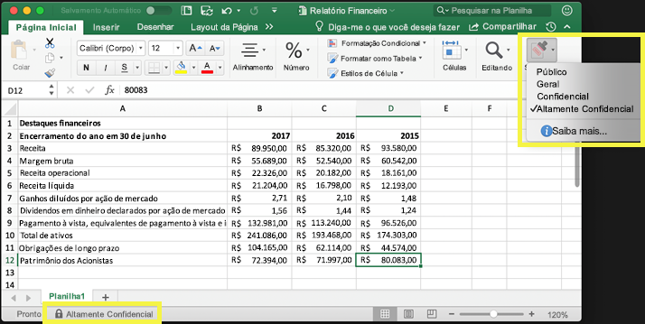

Você pode usar rótulos de confidencialidade para:
  
- **Impor configurações de proteção, como criptografia ou marcas d'água no conteúdo rotulado. **Por exemplo, os usuários podem aplicar um rótulo confidencial a um documento ou email, e esse rótulo pode criptografar o conteúdo e aplicar uma marca d'água confidencial.    

- **Proteger o conteúdo em aplicativos do Office em vários dispositivos e plataformas diferentes.** Rótulos de confidencialidade funcionam em aplicativos do Office no Windows, Mac, iOS e Android. Haverá suporte para os aplicativos Web do Office em breve.
    
- **Impedir que conteúdo confidencial saia da organização em dispositivos com Windows** usando a proteção do ponto de extremidade do Microsoft Intune. Depois de um rótulo de confidencialidade ter sido aplicado a um conteúdo presente em um dispositivo Windows, a proteção de ponto de extremidade pode impedir que o material seja copiado para um aplicativo de terceiros, como Twitter ou Gmail, ou um armazenamento removível, como uma unidade USB.

- **Estender rótulos de confidencialidade a aplicativos e serviços de terceiros.** Com o SDK de proteção de informações da Microsoft, os aplicativos de terceiros no Windows, Mac e Linux podem ler rótulos de confidencialidade e aplicar configurações de proteção. Este recurso estará disponível para aplicativos iOS e Android em breve.

- **Classificar o conteúdo sem usar configurações de proteção.** Você também pode simplesmente atribuir uma classificação ao conteúdo (por exemplo, um adesivo) que permanece e se movimenta com o conteúdo à medida que ele é usado e compartilhado. Você pode usar essa classificação para gerar relatórios de uso e ver dados de atividade do conteúdo confidencial. Com base nessas informações, você sempre pode optar por aplicar as configurações de proteção posteriormente.
    
Em todos esses casos, os rótulos de confidencialidade do Office 365 podem ajudar você a adotar as ações certas no conteúdo certo. Com os rótulos de confidencialidade, você pode classificar dados em toda a organização e impor configurações de proteção com base nessa classificação.
  
Você cria rótulos de confidencialidade no Centro de Conformidade &amp; Segurança do Office 365, que agora é o único local para configurar políticas e rótulos de confidencialidade em toda a Proteção de Informações do Azure e Office 365. Esses rótulos de confidencialidade podem ser usados pela Proteção de Informações do Azure, pelos aplicativos do Office e pelos serviços do Office 365.

Para clientes da Proteção de Informações do Azure, você pode usar os rótulos dessa Proteção no Centro de Conformidade e Segurança, os quais serão sincronizados com o portal do Azure caso você opte por executar configurações adicionais ou avançadas. **Os rótulos da Proteção de Informações do Azure e os rótulos de confidencialidade do Office 365 são totalmente compatíveis entre si. **Isso significa que, por exemplo, se você tiver um conteúdo rotulado pela Proteção de Informações do Azure, não será necessário classificar ou rotular novamente o conteúdo.

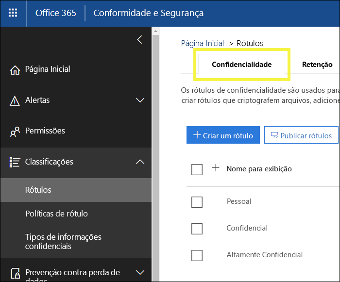

## O que é um rótulo de confidencialidade

Atribuir um rótulo de confidencialidade a um documento ou email é simplesmente como ter uma marca:

- **Personalizável.** Você pode criar categorias para diferentes níveis de conteúdo confidencial em sua organização, como Pessoal, Público, Geral, Confidencial e Altamente Confidencial.

- **Não criptografada.** Já que o rótulo não está criptografado, ele fica disponível para aplicativos e serviços de terceiros para aplicar ações de proteção a conteúdos rotulados.

- **Persistente.** Após um rótulo de confidencialidade ser aplicado ao conteúdo, ele persiste nos metadados do email ou do documento. Isso significa que o rótulo vai junto com o conteúdo, incluindo as configurações de proteção, e se torna a base para aplicar e impor políticas.

Nos aplicativos do Office, um rótulo de confidencialidade simplesmente aparece como uma marca em um email ou documento.

Cada item de conteúdo pode ter um único rótulo de confidencialidade aplicado a ele. Mas observe que um item pode ter tanto um rótulo de confidencialidade único quanto um [rótulo de retenção](labels.md) único aplicado a ele.

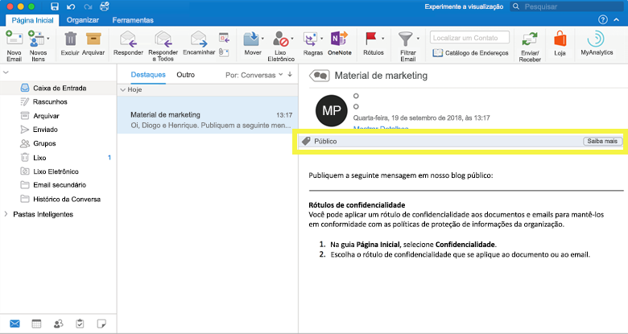

## O que rótulos de confidencialidade podem fazer

Depois que um rótulo de confidencialidade é aplicado a um email ou documento, as configurações de proteção desse rótulo são aplicadas no conteúdo. Com um rótulo de confidencialidade, você pode:

- **Criptografar** apenas o email ou o email e documentos. Você pode escolher quais usuários ou qual grupo tem permissões para executar as ações e por quanto tempo. Por exemplo, você pode optar por permitir que os usuários em um domínio específico fora da sua organização tenham permissões para examinar o conteúdo por apenas 7 dias após ele ser rotulado.

- **Marcar o conteúdo** adicionando marcas-d'água, cabeçalhos ou rodapés personalizados a emails ou documentos com rótulos aplicados. As marcas-d'água são aplicadas apenas a documentos, não a emails, e são limitadas a 255 caracteres. Além disso, os cabeçalhos e rodapés também são limitados a 1.024 caracteres, exceto no Excel, onde são limitados a 255 caracteres ou menos, dependendo se o documento contém outros cabeçalhos ou rodapés e de outros fatores.

    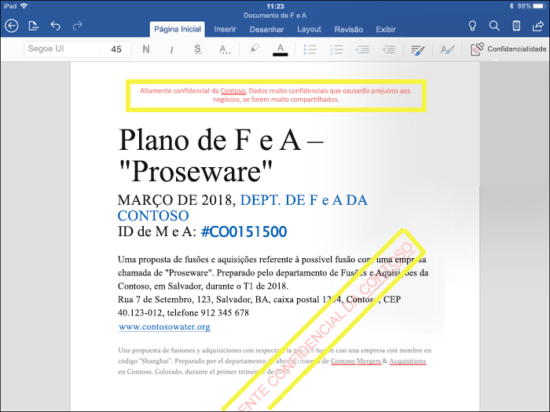

- 
  **Evitar a perda de dados** ativando a proteção do ponto de extremidade no Intune. Se um conteúdo confidencial for baixado, é possível evitar a perda de dados em dispositivos Windows. Por exemplo, não é possível copiar o conteúdo rotulado no Dropbox, Gmail ou em uma unidade USB. Para que seus rótulos de confidencialidade possam usar a WIP (Proteção de Informações do Windows), primeiro é necessário criar uma política de proteção de aplicativos no portal do Azure. Para obter mais informações, confira [Como a Proteção de Informações do Windows protege arquivos com um rótulo de confidencialidade](https://docs.microsoft.com/en-us/windows/security/information-protection/windows-information-protection/how-wip-works-with-labels?branch=vsts17546553).

Todas essas opções estão disponíveis quando você cria um rótulo no Centro de Conformidade e Segurança.

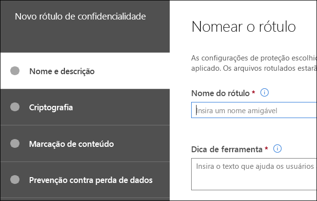

### Prioridade de rótulo (a ordem importa)

Ao criar rótulos de confidencialidade no Centro de Conformidade e Segurança, eles aparecem em uma lista na guia **Confidencialidade**, na página **Rótulos**. Nessa lista, a ordem dos rótulos é importante porque reflete sua prioridade. O rótulo de confidencialidade mais restritiva, como Altamente Confidencial, deve aparecer na **parte inferior** da lista, e seu rótulo de confidencialidade menos restritiva, como Público, deve aparecer no **topo**.

Um documento ou email pode ter apenas um único rótulo de confidencialidade aplicado a ele. Se você solicitar que seus usuários forneçam uma justificativa para alterar o rótulo para uma classificação inferior, a ordem desta lista determina o que é uma classificação inferior.

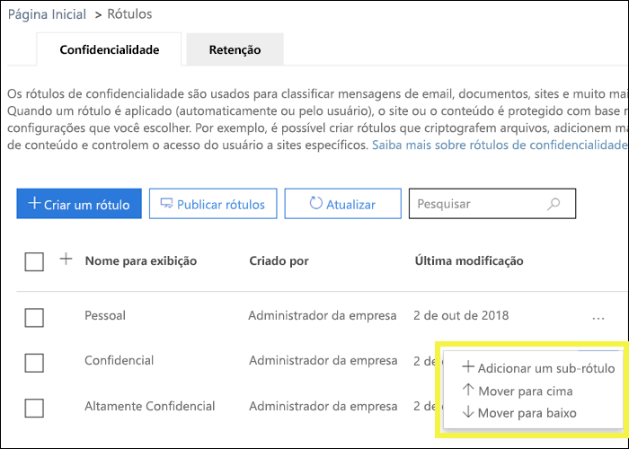

### Sub-rótulos (agrupamento de rótulos)

Com sub-rótulos, você pode agrupar um ou mais rótulos sob um cabeçalho que um usuário vê em um aplicativo do Office. Por exemplo, em Confidencial, sua organização pode usar vários rótulos diferentes para tipos específicos dessa classificação. Nesse exemplo, o rótulo Confidencial é simplesmente um rótulo de texto sem configurações de proteção e, como tem sub-rótulos, não pode ser aplicado ao conteúdo. Em vez disso, os usuários deverão escolher Confidencial para exibir os sub-rótulos, e eles podem escolher um sub-rótulo que se aplique ao conteúdo.

Sub-rótulos são simplesmente uma maneira de apresentar os rótulos aos usuários em grupos lógicos. Sub-rótulos não herdam nenhuma configuração do rótulo em que se encontram.

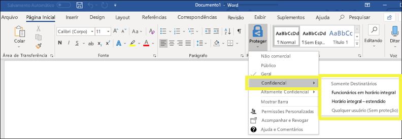

### Editar ou excluir um rótulo de confidencialidade

Se você excluir um rótulo de confidencialidade no Centro de Conformidade e Segurança, observe que o rótulo não será removido do conteúdo e que as configurações de proteção continuam impostas ao conteúdo.

Se você editar um rótulo de confidencialidade no Centro de Conformidade e Segurança, a versão do rótulo que foi aplicada ao conteúdo é o que é imposto a ele.

## O que as políticas de rótulo podem fazer

Depois de criar rótulos de confidencialidade, você precisa publicá-los para disponibilizá-los às pessoas em sua organização, as quais, então, poderão aplicá-los ao conteúdo. Ao contrário dos rótulos de retenção, que são publicados em locais, como todas as caixas de correio do Exchange, os rótulos de confidencialidade são publicados a usuários ou grupos. Os rótulos de confidencialidade aparecem nos aplicativos do Office para esses usuários e grupos.

Com uma política de rótulos, você pode:

- **Escolher quais usuários e grupos veem os rótulos.** Rótulos podem ser publicados em quaisquer grupos de segurança habilitados para email, grupos de distribuição, grupos do Office 365 ou grupos de distribuição dinâmica.

- **Aplicar um rótulo padrão** a todos os novos documentos e email criados pelos usuários e grupos incluídos na política de rótulo. Esse rótulo padrão pode definir um nível de base de configurações de proteção que deve ser aplicado a todo o conteúdo.

- **Solicitar uma justificativa para alterar um rótulo.** Se o conteúdo estiver marcado como Confidencial e um usuário desejar remover esse rótulo ou substituí-lo com uma classificação inferior, como um rótulo denominado Público, você pode solicitar que o usuário forneça uma justificativa ao realizar esta ação. Essas justificativas estarão disponíveis para a análise do administrador. Estamos trabalhando em um relatório em que os administradores poderão ver as justificativas do usuário.

    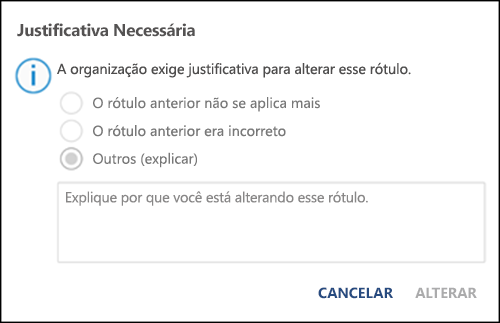

- **Forneça o link de ajuda para uma página de ajuda personalizada.** Se os usuários não tiverem certeza do que significam os rótulos de confidencialidade ou como eles devem ser usados, você pode fornecer uma URL do tipo Saiba mais na parte inferior do menu de rótulo de confidencialidade nos aplicativos do Office.

    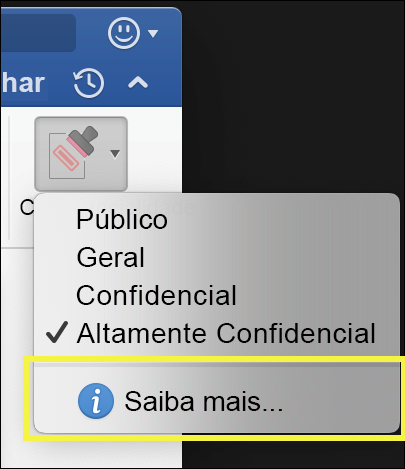

Depois de criar uma política de rótulos e atribuir rótulos de confidencialidade para usuários e grupos, essas pessoas podem ver os rótulos disponíveis nos aplicativos do Office em uma hora ou menos.

## Como começar

A introdução aos rótulos de confidencialidade é um processo rápido:

1. **Defina os rótulos.** Primeiro, você deve estabelecer a taxonomia para definir níveis diferentes de conteúdo confidencial. Use nomes comuns ou termos que façam sentido para os usuários. Por exemplo, comece com rótulos como Pessoal, Público, Geral, Confidencial e Altamente Confidencial. Você pode usar sub-rótulos para agrupar rótulos semelhantes por categoria. Além disso, ao criar um rótulo, é exigida uma dica de ferramenta, que é exibida nos aplicativos do Office quando um usuário passa o mouse sobre uma opção de rótulo na faixa de opções.

1. **Defina o que cada rótulo pode fazer. ** Depois defina as configurações de proteção que você quer associar a cada rótulo. Por exemplo, para uma confidencialidade menor de conteúdo (um rótulo “Geral”) pode ter apenas um cabeçalho ou rodapé aplicado a ele, enquanto uma confidencialidade maior de conteúdo (um rótulo de “Confidencial”) pode ter uma marca d'água, criptografia e WIP aplicados a ela para ajudar a garantir que apenas usuários com privilégios possam acessá-la.
 
1. **Defina quem receberá os rótulos.** Depois de definir os rótulos da sua organização, publique-os em uma política de rótulos que controla quais usuários e grupos os veem. Um rótulo único é reutilizável – você o define uma vez, depois pode incluí-lo em várias políticas de rótulo atribuídas a diferentes usuários. Mas, para que um rótulo seja atribuído ao conteúdo, primeiro você deve publicá-lo para que fique disponível nos aplicativos do Office e outros serviços. Ao começar, você pode controlar seus rótulos de confidencialidade atribuindo-os a apenas algumas pessoas.

Eis o fluxo básico com o que o administrador, o usuário e o aplicativo do Office fazem para os rótulos de confidencialidade funcionarem.

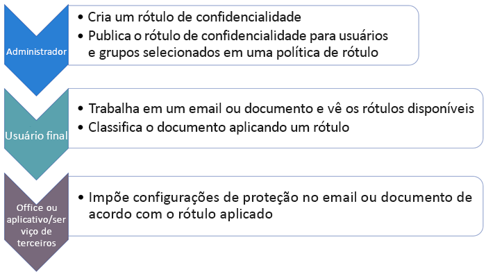

## Onde rótulos de confidencialidade podem aparecer

Os rótulos de confidencialidade aparecem na interface do usuário dos aplicativos do Office. Para exibir a disponibilidade atual para aplicativos e plataformas específicos, confira **[Onde o recurso está disponível hoje?](https://support.office.com/pt-BR/article/apply-sensitivity-labels-to-your-documents-and-email-within-office-2f96e7cd-d5a4-403b-8bd7-4cc636bae0f9?ad=US&ui=en-US&rs=en-US#bkmk_whereavailable)**

### Aplicativos do Office no Windows

Nos aplicativos do Office em dispositivos com Windows, os rótulos de confidencialidade aparecem no botão **Confidencialidade**, na guia **Início** na faixa de opções. O rótulo aplicado também aparece na barra de status na parte inferior da janela.

Em breve, haverá suporte nativo para rótulos de confidencialidade nos aplicativos do Office no Windows.

Caso seja um cliente existente da Proteção de Informações do Azure, você pode implantar o cliente de rotulagem unificado nela, o qual dá suporte a rótulos de confidencialidade. Confira mais informações sobre como baixar o cliente em [Cliente de rotulagem unificado de Proteção de Informações do Azure: informações de versão](https://docs.microsoft.com/pt-BR/azure/information-protection/rms-client/unifiedlabelingclient-version-release-history). Estamos trabalhando em suporte nativo para os rótulos de confidencialidade nos aplicativos do Office no Windows, de modo que o cliente de rotulagem unificado da Proteção de Informações do Azure não seja mais necessário.

### Aplicativos do Office no Mac

Nos aplicativos do Office em dispositivos Mac, os rótulos de confidencialidade aparecem no botão **Confidencialidade**, na guia **Início** na faixa de opções. O rótulo aplicado também aparece na barra de status na parte inferior da janela.

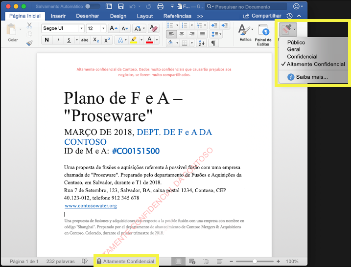

### Aplicativos do Office no iOS

Nos aplicativos do Office em dispositivos iOS, os rótulos de confidencialidade aparecem no botão **Confidencialidade**, na guia **Início** na faixa de opções. O rótulo aplicado também aparece na barra de status na parte inferior da janela.

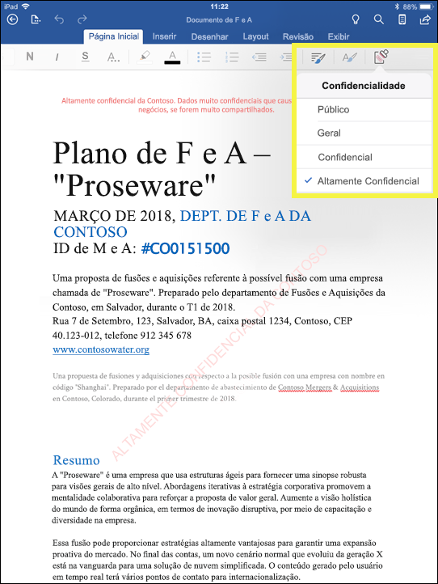

### Aplicativos do Office no Android

Nos aplicativos do Office em dispositivos Android, os rótulos de confidencialidade aparecem no botão **Confidencialidade**, na guia **Início** na faixa de opções. O rótulo aplicado também aparece na barra de status na parte inferior da janela.

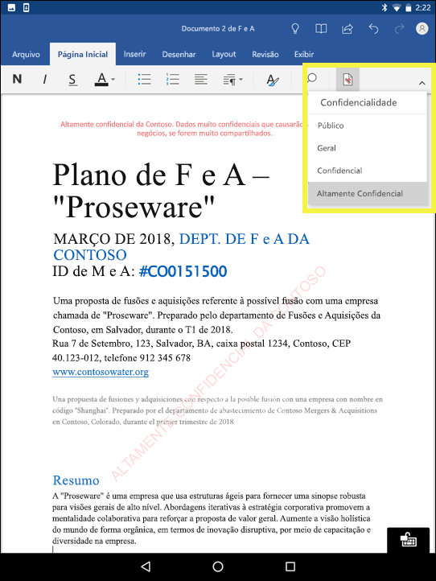

### Mais informações sobre rótulos de confidencialidade nos aplicativos do Office

- [Aplicar rótulos de confidencialidade aos seus documentos e email no Office](https://support.office.com/pt-BR/article/apply-sensitivity-labels-to-your-documents-and-email-within-office-2f96e7cd-d5a4-403b-8bd7-4cc636bae0f9)
- [Problemas conhecidos ao aplicar rótulos de confidencialidade aos arquivos do Office](https://support.office.com/pt-BR/article/known-issues-when-you-apply-sensitivity-labels-to-your-office-files-b169d687-2bbd-4e21-a440-7da1b2743edc)

## Como os rótulos de confidencialidade funcionam com rótulos existentes da Proteção de Informações do Azure

Atualmente, os usuários da Proteção de Informações do Azure conseguem classificar e rotular o conteúdo no Windows usando o cliente de rotulagem unificado dessa Proteção. Rótulos existentes da Proteção de Informações do Azure funcionam perfeitamente com os novos rótulos de confidencialidade. Isso significa que você pode:

- Manter os rótulos existentes da Proteção de Informações do Azure em documentos e email.
- Manter a configuração de rótulo da Proteção de Informações do Azure.

Caso esteja usando rótulos da Proteção de Informações do Azure, recomendamos evitar a criação de novos rótulos no Centro de Conformidade e Segurança até concluir a migração. O [tópico de migração da Proteção de Informações do Azure](https://docs.microsoft.com/pt-BR/azure/information-protection/configure-policy-migrate-labels) tem algumas restrições específicas e informações importantes. Se você não ainda está pronto para migrar seus locatários de produção para rótulos de confidencialidade, não há motivos para se preocupar: por enquanto, seus usuários podem continuar usando o cliente da Proteção de Informações do Azure, e os administradores podem continuar usando o portal do Azure para o gerenciamento.

## Proteger o conteúdo em dispositivos Windows usando a proteção do ponto de extremidade no Microsoft Intune

Quando cria um rótulo de confidencialidade, você tem a opção de informar ao Windows que arquivos com esse rótulo são confidenciais e precisam ser protegidos contra vazamento de dados quando armazenados em dispositivos Windows. Essa opção pode ajudar a garantir que o conteúdo com esse rótulo só possa ser compartilhado ou copiado para locais aprovados, mesmo quando armazenado em um ponto de extremidade. Basicamente, ativar essa opção para um rótulo de confidencialidade informa o Windows de que se tratam de dados muito importantes que garantem restrições de uso adicionais.

Ao habilitar essa opção, o Windows pode ler, entender e agir em rótulos de confidencialidade em documentos e aplicar automaticamente a WIP no conteúdo, não importando como ele atinge um dispositivo Windows gerenciado. Isso ajuda a proteger os arquivos rotulados contra vazamento acidental, aplicando ou não uma criptografia.

Por exemplo, o Windows pode entender que um documento do Word que reside no computador de um usuário tem um rótulo confidencial aplicado a ele, e a WIP pode aplicar uma política de proteção de aplicativo para evitar a cópia ou o compartilhamento dos dados fora do local de trabalho a partir desse dispositivo (como um ONeDrive pessoal, contas de email pessoal, mídias sociais ou USB unidades).

Se um usuário tentar carregar o conteúdo rotulado para uma conta pessoal do Gmail, será exibida esta mensagem.

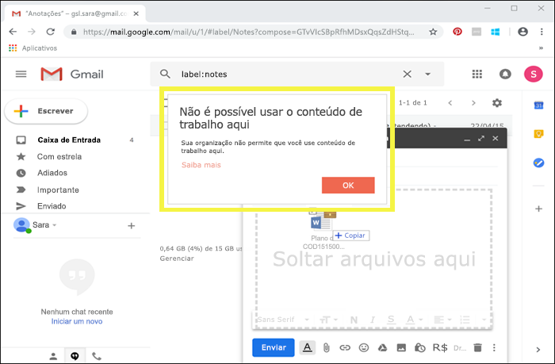

E se um usuário tentar salvar o conteúdo rotulado em uma unidade USB, será exibida esta mensagem.

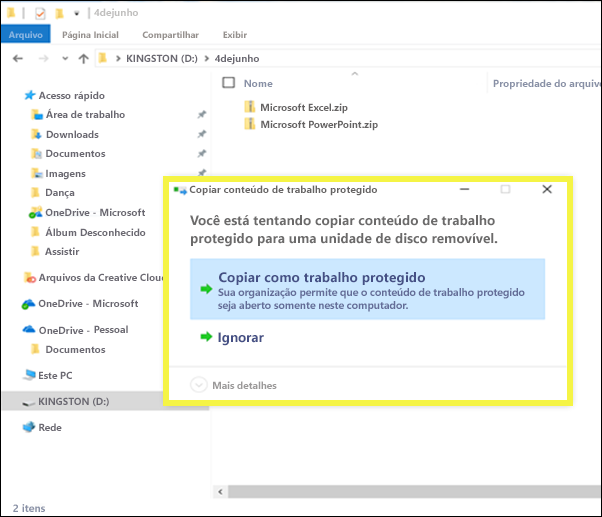

### Pré-requisitos importantes

Antes que seus rótulos de confidencialidade possam usar a WIP, é necessário atender aos pré-requisitos descritos aqui: [Como a Proteção de Informações do Windows protege arquivos com um rótulo de confidencialidade](https://docs.microsoft.com/en-us/windows/security/information-protection/windows-information-protection/how-wip-works-with-labels?branch=vsts17546553). Este tópico descreve os seguintes pré-requisitos:

- Verifique se você tem o Windows 10, versão 1809 ou posterior.
- [Configure a WDATP (Proteção Avançada contra Ameaças do Windows Defender)](https://docs.microsoft.com/pt-BR/windows/security/threat-protection/windows-defender-atp/get-started), que examina o conteúdo em busca de um rótulo e aplica a proteção WIP correspondente. A ATP executa algumas ações independentemente da WIP, como gerar relatórios sobre anomalias.
- Crie uma política de WIP que se aplique aos dispositivos de ponto de extremidade. Você pode fazer isso em qualquer um destes locais:
    - [Crie uma política de WIP com MDM usando o portal do Azure para o Microsoft Intune](https://docs.microsoft.com/pt-BR/windows/security/information-protection/windows-information-protection/create-wip-policy-using-intune-azure)
    - [Crie e implante uma política de WIP (Proteção de Informações do Windows) usando o System Center Configuration Manager](https://docs.microsoft.com/pt-BR/windows/security/information-protection/windows-information-protection/create-wip-policy-using-sccm)

## Estender rótulos de confidencialidade a aplicativos e serviços de terceiros usando o SDK de Proteção de Informações da Microsoft

Como um rótulo de confidencialidade é mantido como texto não criptografado nos metadados de um documento, serviços e aplicativos de terceiros podem escolher dar suporte à identificação e proteção do conteúdo que contém esse rótulo. O suporte em outros aplicativos e serviços está sempre em expansão.

Com o [SDK de Proteção de Informações da Microsoft](https://docs.microsoft.com/pt-BR/information-protection/develop/), aplicativos e serviços de terceiros podem ler e aplicar rótulos de confidencialidade e proteção a documentos. O SDK tem suporte para aplicativos no Windows, Mac e Linux. O suporte para aplicativos iOS e Android estará disponível em breve.

Usando o SDK, você pode rotular e proteger o conteúdo de uma forma que funcione em outros aplicativos e serviços de Proteção de Informações da Microsoft, como aplicativos do Office, serviços do Office 365, verificação da Proteção de Informações do Azure, Microsoft Cloud App Security e várias outras soluções de parceiros. Por exemplo, saiba mais sobre o [suporte para rótulos de confidencialidade no Adobe Acrobat](https://techcommunity.microsoft.com/t5/Azure-Information-Protection/Starting-October-use-Adobe-Acrobat-Reader-for-PDFs-protected-by/ba-p/262738).

Para saber mais sobre o SDK da Proteção de Informações da Microsoft, consulte o [anúncio no blog Tech Community](https://techcommunity.microsoft.com/t5/Microsoft-Information-Protection/Microsoft-Information-Protection-SDK-Now-Generally-Available/ba-p/263144). Também é possível saber mais sobre [soluções de parceiros integradas à Proteção de Informações da Microsoft](https://techcommunity.microsoft.com/t5/Azure-Information-Protection/Microsoft-Information-Protection-showcases-integrated-partner/ba-p/262657).

## Permissões

Os membros da equipe de conformidade que criarão rótulos de confidencialidade precisam de permissões para o Centro de Conformidade e Segurança. Por padrão, o administrador de locatários terá acesso a este local e poderá fornecer acesso a outras pessoas e aos responsáveis pela conformidade ao Centro de Conformidade e Segurança, sem lhes dar todas as permissões de um administrador de locatários. Para fazer isso, recomendamos que você acesse a página **Permissões** do Centro de Conformidade e Segurança, edite o grupo de função **Administrador de Conformidade** e adicione membros a esse grupo de função.

Para obter mais informações, consulte Dar aos usuários acesso ao Centro de Conformidade e Segurança do Office 365.

Essas permissões só serão necessárias para criar e aplicar rótulos. A imposição da política não exige acesso ao conteúdo.
