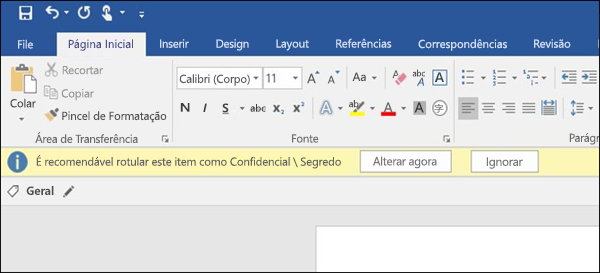
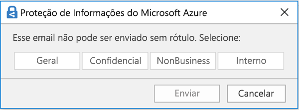

# Visão geral de rótulos de confidencialidadeOverview of sensitivity labels

Para realizar seus trabalhos, seu pessoal precisa colaborar com outras pessoas dentro e fora da organização. Isso significa que o conteúdo deixa de estar protegido por um firewall – ele percorre todos os lugares, entre dispositivos, aplicativos e serviços. E você quer que esses percursos sejam feitos de modo seguro e protegido, atendendo às políticas de conformidade dos negócios da sua organização.To get their work done, people in your organization need to collaborate with others both inside and outside the organization. This means that content no longer stays behind a firewall – it roams everywhere, across devices, apps, and services. And when it roams, you want it to do so in a secure, protected way that meets your organization’s business and compliance policies.

Com os rótulos de confidencialidade no Office 365, você pode classificar e ajudar a proteger o conteúdo confidencial e, ao mesmo tempo, garantir que a produtividade e a capacidade de colaboração das pessoas não sejam prejudicadas.With sensitivity labels in Office 365, you can classify and help protect your sensitive content, while making sure that your people’s productivity and ability to collaborate isn’t hindered.

Você pode usar rótulos de confidencialidade para:You can use sensitivity labels to:
  
- \*\*Impor configurações de proteção, como criptografia ou marcas d'água no conteúdo rotulado. \*\*Por exemplo, os usuários podem aplicar um rótulo confidencial a um documento ou email, e esse rótulo pode criptografar o conteúdo e aplicar uma marca d'água confidencial.**Enforce protection settings such as encryption or watermarks on labeled content.** For example, your users can apply a Confidential label to a document or email, and that label can encrypt the content and apply a Confidential watermark.    

- **Proteger o conteúdo em aplicativos do Office em vários dispositivos e plataformas diferentes.** Rótulos de confidencialidade funcionam em aplicativos do Office no Windows, Mac, iOS e Android. Haverá suporte para os aplicativos Web do Office em breve.**Protect content in Office apps across different platforms and devices.** Sensitivity labels work in Office apps on Windows, Mac, iOS, and Android. Support for Office web apps is coming soon.
    
- **Impedir que conteúdo confidencial saia da organização em dispositivos com Windows** usando a proteção do ponto de extremidade do Microsoft Intune. Depois de um rótulo de confidencialidade ter sido aplicado a um conteúdo presente em um dispositivo Windows, a proteção de ponto de extremidade pode impedir que o material seja copiado para um aplicativo de terceiros, como Twitter ou Gmail, ou um armazenamento removível, como uma unidade USB.**Prevent sensitive content from leaving your organization on devices running Windows**, by using endpoint protection in Microsoft Intune. After a sensitivity label has been applied to content that resides on a Windows device, endpoint protection can prevent that content from being copied to a third-party app, such as Twitter or Gmail, or being copied to removable storage, such as a USB drive.

- **Estender rótulos de confidencialidade a aplicativos e serviços de terceiros.** Com o SDK de proteção de informações da Microsoft, os aplicativos de terceiros no Windows, Mac e Linux podem ler rótulos de confidencialidade e aplicar configurações de proteção. Este recurso estará disponível para aplicativos iOS e Android em breve.**Extend sensitivity labels to third-party apps and services.** With the Microsoft Information Protection SDK, third-party apps on Windows, Mac, and Linux can read sensitivity labels and apply protection settings. Support for apps on iOS and Android is coming soon.

- **Classificar o conteúdo sem usar configurações de proteção.** Você também pode simplesmente atribuir uma classificação ao conteúdo (por exemplo, um adesivo) que permanece e se movimenta com o conteúdo à medida que ele é usado e compartilhado. Você pode usar essa classificação para gerar relatórios de uso e ver dados de atividade do conteúdo confidencial. Com base nessas informações, você sempre pode optar por aplicar as configurações de proteção posteriormente.**Classify content without using any protection settings.** You can also simply assign a classification to content (like a sticker) that persists and roams with the content as it's used and shared. You can use this classification to generate usage reports and see activity data for your sensitive content. Based on this information, you can always choose at a later time to apply protection settings.
    
Em todos esses casos, os rótulos de confidencialidade do Office 365 podem ajudar você a adotar as ações certas no conteúdo certo. Com os rótulos de confidencialidade, você pode classificar dados em toda a organização e impor configurações de proteção com base nessa classificação.In all of these cases, sensitivity labels in Office 365 can help you take the right actions on the right content. With sensitivity labels, you can classify data across your organization and enforce protection settings based on that classification.
  
Você cria rótulos de confidencialidade no Centro de Conformidade &amp; Segurança do Office 365, que agora é o único local para configurar políticas e rótulos de confidencialidade em toda a Proteção de Informações do Azure e Office 365. Esses rótulos de confidencialidade podem ser usados pela Proteção de Informações do Azure, pelos aplicativos do Office e pelos serviços do Office 365.You create sensitivity labels in the Office 365 Security &amp; Compliance Center. The Security & Compliance Center is now the single place to configure sensitivity labels and policies across Azure Information Protection and Office 365. These sensitivity labels can be used by Azure Information Protection, Office apps, and Office 365 services.

Para clientes da Proteção de Informações do Azure, você pode usar os rótulos dessa Proteção no Centro de Conformidade e Segurança, os quais serão sincronizados com o portal do Azure caso você opte por executar configurações adicionais ou avançadas. \*\*Os rótulos da Proteção de Informações do Azure e os rótulos de confidencialidade do Office 365 são totalmente compatíveis entre si. \*\*Isso significa que, por exemplo, se você tiver um conteúdo rotulado pela Proteção de Informações do Azure, não será necessário classificar ou rotular novamente o conteúdo.For Azure Information Protection customers, you can use your Azure Information Protection labels in the Security & Compliance center, and your labels will be synced with the Azure portal in case you choose to perform additional or advanced configuration. **Azure Information Protection labels and Office 365 sensitivity labels are fully compatible with each other.** This means, for example, if you have content labeled by Azure Information Protection, you won’t need to reclassify or relabel your content.

## O que é um rótulo de confidencialidadeWhat a sensitivity label is

Atribuir um rótulo de confidencialidade a um documento ou email é simplesmente como ter uma marca:When you assign a sensitivity label to a document or email, it’s simply like a tag that is:

- **Personalizável.** Você pode criar categorias para diferentes níveis de conteúdo confidencial em sua organização, como Pessoal, Público, Geral, Confidencial e Altamente Confidencial.**Customizable.** You can create categories for different levels of sensitive content in your organization, such as Personal, Public, General, Confidential, and Highly Confidential.

- **Não criptografada.** Já que o rótulo não está criptografado, ele fica disponível para aplicativos e serviços de terceiros para aplicar ações de proteção a conteúdos rotulados.**Clear text.** Because the label is in clear text, it’s available for third-party apps and services to apply protective actions to labeled content.

- **Persistente.** Após um rótulo de confidencialidade ser aplicado ao conteúdo, ele persiste nos metadados do email ou do documento. Isso significa que o rótulo vai junto com o conteúdo, incluindo as configurações de proteção, e se torna a base para aplicar e impor políticas.**Persistent.** After a sensitivity label is applied to content, it persists in the metadata of that email or document. This means the label roams with the content, including the protection settings, and becomes the basis for applying and enforcing policies.

Nos aplicativos do Office, um rótulo de confidencialidade simplesmente aparece como uma marca em um email ou documento.In the Office apps, a sensitivity label simply appears as a tag on an email or document.

Cada item de conteúdo pode ter um único rótulo de confidencialidade aplicado a ele. Mas observe que um item pode ter tanto um rótulo de confidencialidade único quanto um [rótulo de retenção](labels.md) único aplicado a ele.Each item of content can have a single sensitivity label applied to it. But note that an item can have both a single sensitivity label and a single [retention label](labels.md) applied to it.

## O que rótulos de confidencialidade podem fazerWhat sensitivity labels can do

Depois que um rótulo de confidencialidade é aplicado a um email ou documento, as configurações de proteção desse rótulo são aplicadas no conteúdo. Com um rótulo de confidencialidade, você pode:After a sensitivity label is applied to an email or document, the protection settings for that label are enforced on the content. With a sensitivity label, you can:

- **Criptografar** apenas o email ou o email e documentos. Você pode escolher quais usuários ou qual grupo têm permissões para executar as ações e por quanto tempo. Por exemplo, você pode optar por permitir que os usuários em um domínio específico fora da sua organização tenham permissões para examinar o conteúdo por apenas 7 dias após ele ser rotulado. Para saber mais, confira [Restringir o acesso ao conteúdo usando criptografia em rótulos de confidencialidade](encryption-sensitivity-labels.md).**Encrypt** email only or both email and documents. You can choose which users or group have permissions to perform which actions and for how long. For example, you can choose to allow users in a specific domain outside your organization to have permissions to review the content for only 7 days after the content is labeled. For more information, see [Restrict access to content by using encryption in sensitivity labels](encryption-sensitivity-labels.md).

- **Marcar o conteúdo** adicionando marcas-d'água, cabeçalhos ou rodapés personalizados a emails ou documentos com rótulos aplicados. As marcas-d'água são aplicadas apenas a documentos, não a emails, e são limitadas a 255 caracteres. Além disso, os cabeçalhos e rodapés também são limitados a 1.024 caracteres, exceto no Excel, onde são limitados a 255 caracteres ou menos, dependendo se o documento contém outros cabeçalhos ou rodapés e de outros fatores.**Mark the content** by adding custom watermarks, headers, or footers to email or documents that have the label applied. Note that watermarks are applied only to documents, not email, and they're limited to 255 characters. Also, headers and footers are limited to 1024 characters (except in Excel, where they're limited to 255 characters or fewer, depending on whether the document contains other headers or footers and other factors.)

    

- 
  \*\*Evitar a perda de dados\*\* ativando a proteção do ponto de extremidade no Intune. Se um conteúdo confidencial for baixado, é possível evitar a perda de dados em dispositivos Windows. Por exemplo, não é possível copiar o conteúdo rotulado no Dropbox, Gmail ou em uma unidade USB. Para que seus rótulos de confidencialidade possam usar a WIP (Proteção de Informações do Windows), primeiro é necessário criar uma política de proteção de aplicativos no portal do Azure. Para obter mais informações, confira [Como a Proteção de Informações do Windows protege arquivos com um rótulo de confidencialidade](https://docs.microsoft.com/en-us/windows/security/information-protection/windows-information-protection/how-wip-works-with-labels?branch=vsts17546553).**Prevent data loss** by turning on endpoint protection in Intune. If sensitive content gets downloaded, you can help prevent the loss of data from Windows devices. For example, you can’t copy labeled content into Dropbox, Gmail, or USB drive. Before your sensitivity labels can use Windows Information Protection (WIP), you first need to create an app protection policy in the Azure portal. For more information, see [How Windows Information Protection protects files with a sensitivity label](https://docs.microsoft.com/en-us/windows/security/information-protection/windows-information-protection/how-wip-works-with-labels?branch=vsts17546553).

- \*\*Aplique o rótulo automaticamente ao conteúdo que contém informações confidenciais. \*\* Você pode escolher quais tipos de informações confidenciais que você deseja rotuladas e o rótulo pode ser aplicado automaticamente ou você pode solicitar aos usuários a aplicarem o rótulo recomendável. Se você recomendar um rótulo, o prompt exibe qualquer texto que você escolher. Para saber mais, confira [aplicar um rótulo de confidencialidade ao conteúdo automaticamente](apply_sensitivity_label_automatically.md).**Apply the label automatically to content that contains sensitive information.** You can choose what types of sensitive information that you want labeled, and the label can either be applied automatically, or you can prompt users to apply the label that you recommend. If you recommend a label, the prompt displays whatever text you choose. For more information, see [Apply a sensitivity label to content automatically](apply_sensitivity_label_automatically.md).

    

Todas essas opções estão disponíveis quando você cria um rótulo no Centro de Conformidade e Segurança.All of these options are available when you create a label in the Security & Compliance Center.

### Prioridade de rótulo (a ordem importa)Label priority (order matters)

Ao criar rótulos de confidencialidade no Centro de Conformidade e Segurança, eles aparecem em uma lista na guia **Confidencialidade**, na página **Rótulos**. Nessa lista, a ordem dos rótulos é importante porque reflete sua prioridade. O rótulo de confidencialidade mais restritiva, como Altamente Confidencial, deve aparecer na **parte inferior** da lista, e seu rótulo de confidencialidade menos restritiva, como Público, deve aparecer no **topo**.When you create your sensitivity labels in the Security & Compliance Center, they appear in a list on the **Sensitivity** tab on the **Labels** page. In this list, the order of the labels is important because it reflects their priority. You want your most restrictive sensitivity label, such as Highly Confidential, to appear at the **bottom** of the list, and your least restrictive sensitivity label, such as Public, to appear at the **top**.

Um documento ou email pode ter apenas um único rótulo de confidencialidade aplicado a ele. Se você solicitar que seus usuários forneçam uma justificativa para alterar o rótulo para uma classificação inferior, a ordem desta lista determina o que é uma classificação inferior.A document or email can have only a single sensitivity label applied to it. If you require your users to provide a justification for changing the label to a lower classification, the order of this list determines what's a lower classification.

### Sub-rótulos (agrupamento de rótulos)Sublabels (grouping labels)

Com sub-rótulos, você pode agrupar um ou mais rótulos sob um cabeçalho que um usuário vê em um aplicativo do Office. Por exemplo, em Confidencial, sua organização pode usar vários rótulos diferentes para tipos específicos dessa classificação. Nesse exemplo, o rótulo Confidencial é simplesmente um rótulo de texto sem configurações de proteção e, como tem sub-rótulos, não pode ser aplicado ao conteúdo. Em vez disso, os usuários deverão escolher Confidencial para exibir os sub-rótulos, e eles podem escolher um sub-rótulo que se aplique ao conteúdo.With sublabels, you can group one or more labels below a header that a user sees in an Office app. For example, under Confidential, your organization might use several different labels for specific types of that classification. In this example, the label Confidential is simply a text label with no protection settings, and because it has sublabels, it can’t be applied to content. Instead, users must choose Confidential to view the sublabels, and then they can choose a sublabel to apply to content.

Sub-rótulos são simplesmente uma maneira de apresentar os rótulos aos usuários em grupos lógicos. Sub-rótulos não herdam nenhuma configuração do rótulo em que se encontram.Sublabels are simply a way to present labels to users in logical groups. Sublabels don’t inherit any settings from the label they’re under.

### Editar ou excluir um rótulo de confidencialidadeEditing or deleting a sensitivity label

Se você excluir um rótulo de confidencialidade no Centro de Conformidade e Segurança, observe que o rótulo não será removido do conteúdo e que as configurações de proteção continuam impostas ao conteúdo.If you delete a sensitivity label in the Security & Compliance Center, note that the label is not removed from content, and any protection settings continue to be enforced on the content.

Se você editar um rótulo de confidencialidade no Centro de Conformidade e Segurança, a versão do rótulo que foi aplicada ao conteúdo é o que é imposto a ele.If you edit a sensitivity label in the Security & Compliance Center, the version of the label that was applied to content is what’s enforced on that content.

## O que as políticas de rótulo podem fazerWhat label policies can do

Depois de criar rótulos de confidencialidade, você precisa publicá-los para disponibilizá-los às pessoas em sua organização, as quais, então, poderão aplicá-los ao conteúdo. Ao contrário dos rótulos de retenção, que são publicados em locais, como todas as caixas de correio do Exchange, os rótulos de confidencialidade são publicados a usuários ou grupos. Os rótulos de confidencialidade aparecem nos aplicativos do Office para esses usuários e grupos.After you create your sensitivity labels, you need to publish them, to make them available to people in your organization, who can then apply the labels to content. Unlike retention labels, which are published to locations, such as all Exchange mailboxes, sensitivity labels are published to users or groups. Sensitivity labels then appear in Office apps for those users and groups.

Com uma política de rótulos, você pode:With a label policy, you can:

- **Escolher quais usuários e grupos veem os rótulos.** Rótulos podem ser publicados em quaisquer grupos de segurança habilitados para email, grupos de distribuição, grupos do Office 365 ou grupos de distribuição dinâmica.**Choose which users and groups see the labels.** Labels can be published to any email-enabled security group, distribution group, Office 365 group, or dynamic distribution group.

- **Aplicar um rótulo padrão** a todos os novos documentos e email criados pelos usuários e grupos incluídos na política de rótulo. Esse rótulo padrão pode definir um nível de base de configurações de proteção que deve ser aplicado a todo o conteúdo.**Apply a default label** to all new documents and email created by the users and groups included in the label policy. This default label can set a base level of protection settings that you want applied to all your content.

- **Solicitar uma justificativa para alterar um rótulo.** Se o conteúdo estiver marcado como Confidencial e um usuário desejar remover esse rótulo ou substituí-lo com uma classificação inferior, como um rótulo denominado Público, você pode solicitar que o usuário forneça uma justificativa ao realizar esta ação. Essas justificativas estarão disponíveis para a análise do administrador. Estamos trabalhando em um relatório em que os administradores poderão ver as justificativas do usuário.**Require a justification for changing a label.** If content is marked Confidential and a user wants to remove that label or replace it with a lower classification, such as a label named Public, you can require that the user provide a justification when performing this action. These justifications will be available for the admin to review. We’re currently working on a report where admins can view the user justifications.

    

- \*\*É preciso aplicar um rótulo a emails e documentos. \*\* Se você quiser todo o conteúdo de um usuário a ser rotulado, você pode exigir que um rótulo deva ser aplicado a todos os documentos salvos e emails enviados. O rótulo pode ser atribuído manualmente por usuário, automaticamente como uma condição ou atribuído por padrão (a opção de rótulo padrão descrita acima). Aqui está o prompt mostrado no Outlook quando um usuário deve atribuir um rótulo.**Require users to apply a label to their email and documents.** If you want all of a user's content to be labeled, you can require that a label must be applied to all of their saved documents and sent emails. The label can be assigned manually by the user, automatically as a result of a condition, or be assigned by default (the default label option described above). Here's the prompt shown in Outlook when a user is required to assign a label.

    > [!NOTE]
    > A rotulagem obrigatória exige uma assinatura da Proteção de Informações do Azure. Para usar esse recurso, você tem que baixar e instalar o [cliente de Proteção de Informações do Azure](https://www.microsoft.com/en-us/download/details.aspx?id=53018) ou o [cliente de rotulagem unificada da Proteção de Informações do Azure](https://docs.microsoft.com/pt-BR/azure/information-protection/rms-client/install-unifiedlabelingclient-app) mais recente. Estamos desenvolvendo um suporte nativo para esse recurso nos aplicativos do Office, para que ele não exija o cliente de Proteção de Informações do Azure. Além disso, o cliente é executado apenas no Windows, portanto, esse recurso ainda não tem suporte para Mac, iOS e Android.Mandatory labeling requires an Azure Information Protection subscription. To use this feature, you must download and install either the [Azure Information Protection client](https://www.microsoft.com/en-us/download/details.aspx?id=53018) or the later [Azure Information Protection unified labeling client](https://docs.microsoft.com/pt-BR/azure/information-protection/rms-client/install-unifiedlabelingclient-app). We're working on native support for this feature in Office apps, so that it won't require the Azure Information Protection client. Also, the client runs only on Windows, so this feature is not yet supported on Mac, iOS, and Android.

    

- **Forneça o link de ajuda para uma página de ajuda personalizada.** Se os usuários não tiverem certeza do que significam os rótulos de confidencialidade ou como eles devem ser usados, você pode fornecer uma URL do tipo Saiba mais na parte inferior do menu de rótulo de confidencialidade nos aplicativos do Office.**Provide help link to a custom help page.** If your users aren’t sure what your sensitivity labels mean or how they should be used, you can provide a Learn More URL that appears at the bottom of the Sensitivity label menu in the Office apps.

    

Depois de criar uma política de rótulos e atribuir rótulos de confidencialidade para usuários e grupos, essas pessoas podem ver os rótulos disponíveis nos aplicativos do Office em uma hora ou menos.After you create a label policy and assign sensitivity labels to users and groups, those people will see those labels available in the Office apps in an hour or less.

## Como começarHow to get started

A introdução aos rótulos de confidencialidade é um processo rápido:Getting started with sensitivity labels is a quick process:

1. **Defina os rótulos.** Primeiro, você deve estabelecer a taxonomia para definir níveis diferentes de conteúdo confidencial. Use nomes comuns ou termos que façam sentido para os usuários. Por exemplo, comece com rótulos como Pessoal, Público, Geral, Confidencial e Altamente Confidencial. Você pode usar sub-rótulos para agrupar rótulos semelhantes por categoria. Além disso, ao criar um rótulo, é exigida uma dica de ferramenta, que é exibida nos aplicativos do Office quando um usuário passa o mouse sobre uma opção de rótulo na faixa de opções.**Define the labels.** First, you want to establish your taxonomy for defining different levels of sensitive content. You should use common names or terms that make sense to your users. For example, you can start with labels such as Personal, Public, General, Confidential, and Highly Confidential. You can use sublabels to group similar labels by category. Also, when you create a label, a tool tip is required, which appears in the Office apps when a user hovers over a label option on the Ribbon.

1. \*\*Defina o que cada rótulo pode fazer. \*\* Depois defina as configurações de proteção que você quer associar a cada rótulo. Por exemplo, para uma confidencialidade menor de conteúdo (um rótulo “Geral”) pode ter apenas um cabeçalho ou rodapé aplicado a ele, enquanto uma confidencialidade maior de conteúdo (um rótulo de “Confidencial”) pode ter uma marca d'água, criptografia e WIP aplicados a ela para ajudar a garantir que apenas usuários com privilégios possam acessá-la.**Define what each label can do.** Then, configure the protection settings you want associated with each label. For example, lower sensitivity content (a “General” label) might simply have a header or footer applied to it, while higher sensitivity content (a “Confidential” label) may have a watermark, encryption, and WIP applied to it, to help ensure that only privileged users can access it.
 
1. **Defina quem receberá os rótulos.** Depois de definir os rótulos da sua organização, publique-os em uma política de rótulos que controla quais usuários e grupos os veem. Um rótulo único é reutilizável – você o define uma vez, depois pode incluí-lo em várias políticas de rótulo atribuídas a diferentes usuários. Mas, para que um rótulo seja atribuído ao conteúdo, primeiro você deve publicá-lo para que fique disponível nos aplicativos do Office e outros serviços. Ao começar, você pode controlar seus rótulos de confidencialidade atribuindo-os a apenas algumas pessoas.**Define who gets the labels.** After you define your organization’s labels, you publish them in a label policy that controls which users and groups see those labels. A single label is reusable – you define it once, and then you can include it in several label policies assigned to different users. But in order for a label to be assigned to content, you must first publish that label so that it’s available in Office apps and other services. When just starting out, you can pilot your sensitivity labels by assigning them to just a few people.

Eis o fluxo básico com o que o administrador, o usuário e o aplicativo do Office fazem para os rótulos de confidencialidade funcionarem.Here’s the basic flow of what the admin, user, and Office app do to make sensitivity labels work.

## Onde rótulos de confidencialidade podem aparecerWhere sensitivity labels can appear

Os rótulos de confidencialidade aparecem na interface do usuário dos aplicativos do Office. Para exibir a disponibilidade atual para aplicativos e plataformas específicos, confira **[Onde o recurso está disponível hoje?](https://support.office.com/pt-BR/article/apply-sensitivity-labels-to-your-documents-and-email-within-office-2f96e7cd-d5a4-403b-8bd7-4cc636bae0f9?ad=US&ui=en-US&rs=en-US#bkmk_whereavailable)**Sensitivity labels appear in the UI of Office apps. To view the current availability for specific apps and platforms, see **[Where is the feature available today?](https://support.office.com/pt-BR/article/apply-sensitivity-labels-to-your-documents-and-email-within-office-2f96e7cd-d5a4-403b-8bd7-4cc636bae0f9?ad=US&ui=en-US&rs=en-US#bkmk_whereavailable)**

### Aplicativos do Office no WindowsOffice apps on Windows

Nos aplicativos do Office em dispositivos com Windows, os rótulos de confidencialidade aparecem no botão **Confidencialidade**, na guia **Início** na faixa de opções. O rótulo aplicado também aparece na barra de status na parte inferior da janela.In Office apps on devices running Windows, sensitivity labels appear on the **Sensitivity** button, on the **Home** tab on the Ribbon. The label applied also appears in the Status bar at the bottom of the window.

Em breve, haverá suporte nativo para rótulos de confidencialidade nos aplicativos do Office no Windows.Coming soon is native support for sensitivity labels in Office apps on Windows.

Caso seja um cliente existente da Proteção de Informações do Azure, você pode implantar o cliente de rotulagem unificado nela, o qual dá suporte a rótulos de confidencialidade. Confira mais informações sobre como baixar o cliente em [Cliente de rotulagem unificado de Proteção de Informações do Azure: informações de versão](https://docs.microsoft.com/pt-BR/azure/information-protection/rms-client/unifiedlabelingclient-version-release-history). Estamos trabalhando em suporte nativo para os rótulos de confidencialidade nos aplicativos do Office no Windows, de modo que o cliente de rotulagem unificado da Proteção de Informações do Azure não seja mais necessário.If you're an existing Azure Information Protection customer, you can deploy the Azure Information Protection unified labeling client, which supports sensitivity labels. For more information about downloading the client, see [Azure Information Protection unified labeling client: Version release information](https://docs.microsoft.com/pt-BR/azure/information-protection/rms-client/unifiedlabelingclient-version-release-history). We’re currently working on native support for sensitivity labels in Office apps on Windows, so that the Azure Information Protection unified labeling client will no longer be required.

### Aplicativos do Office no MacOffice apps on Mac

Nos aplicativos do Office em dispositivos Mac, os rótulos de confidencialidade aparecem no botão **Confidencialidade**, na guia **Início** na faixa de opções. O rótulo aplicado também aparece na barra de status na parte inferior da janela.In Office apps on Mac devices, sensitivity labels appear on the **Sensitivity** button, on the **Home** tab on the Ribbon. The label applied also appears in the Status bar at the bottom of the window.

### Aplicativos do Office no iOSOffice apps on iOS

Nos aplicativos do Office em dispositivos iOS, os rótulos de confidencialidade aparecem no botão **Confidencialidade**, na guia **Início** na faixa de opções. O rótulo aplicado também aparece na barra de status na parte inferior da janela.In Office apps on iOS devices, sensitivity labels appear on the **Sensitivity** button, on the **Home** tab on the Ribbon. The label applied also appears in the Status bar at the bottom of the window.

### Aplicativos do Office no AndroidOffice apps on Android

Nos aplicativos do Office em dispositivos Android, os rótulos de confidencialidade aparecem no botão **Confidencialidade**, na guia **Início** na faixa de opções. O rótulo aplicado também aparece na barra de status na parte inferior da janela.In Office apps on Android devices, sensitivity labels appear on the **Sensitivity** button, on the **Home** tab on the Ribbon. The label applied also appears in the Status bar at the bottom of the window.

### Mais informações sobre rótulos de confidencialidade nos aplicativos do OfficeMore information on sensitivity labels in Office apps

- [Aplicar rótulos de confidencialidade aos seus documentos e email no OfficeApply sensitivity labels to your documents and email within Office](https://support.office.com/pt-BR/article/apply-sensitivity-labels-to-your-documents-and-email-within-office-2f96e7cd-d5a4-403b-8bd7-4cc636bae0f9)
- [Problemas conhecidos ao aplicar rótulos de confidencialidade aos arquivos do OfficeKnown issues when you apply sensitivity labels to your Office files](https://support.office.com/pt-BR/article/known-issues-when-you-apply-sensitivity-labels-to-your-office-files-b169d687-2bbd-4e21-a440-7da1b2743edc)

## Como os rótulos de confidencialidade funcionam com rótulos existentes da Proteção de Informações do AzureHow sensitivity labels work with existing Azure Information Protection labels

Atualmente, os usuários da Proteção de Informações do Azure conseguem classificar e rotular o conteúdo no Windows usando o cliente de rotulagem unificado dessa Proteção. Rótulos existentes da Proteção de Informações do Azure funcionam perfeitamente com os novos rótulos de confidencialidade. Isso significa que você pode:Azure Information Protection users are currently able to classify and label content on Windows by using the Azure Information Protection unified labeling client. Existing Azure Information Protection labels work seamlessly with new sensitivity labels. This means you can:

- Manter os rótulos existentes da Proteção de Informações do Azure em documentos e email.Keep your existing Azure Information Protection labels on documents and email.
- Manter a configuração de rótulo da Proteção de Informações do Azure.Keep your existing Azure Information Protection label configuration.

Caso esteja usando rótulos da Proteção de Informações do Azure, recomendamos evitar a criação de novos rótulos no Centro de Conformidade e Segurança até concluir a migração. O [tópico de migração da Proteção de Informações do Azure](https://docs.microsoft.com/pt-BR/azure/information-protection/configure-policy-migrate-labels) tem algumas restrições específicas e informações importantes. Se você não ainda está pronto para migrar seus locatários de produção para rótulos de confidencialidade, não há motivos para se preocupar: por enquanto, seus usuários podem continuar usando o cliente da Proteção de Informações do Azure, e os administradores podem continuar usando o portal do Azure para o gerenciamento.If you are using Azure Information Protection labels, for now we recommend that you avoid creating new labels in Security & Compliance Center until after you’ve completed your migration. The [Azure Information Protection migration topic](https://docs.microsoft.com/pt-BR/azure/information-protection/configure-policy-migrate-labels) has important information and some specific caveats. If you are not yet ready to migrate your production tenants to sensitivity labels, there is no cause for concern: for the moment, your users can continue using the Azure Information Protection client, and admins can continue using the Azure portal for management.

## Proteger o conteúdo em dispositivos Windows usando a proteção do ponto de extremidade no Microsoft IntuneProtect content on Windows devices by using endpoint protection in Microsoft Intune

Quando cria um rótulo de confidencialidade, você tem a opção de informar ao Windows que arquivos com esse rótulo são confidenciais e precisam ser protegidos contra vazamento de dados quando armazenados em dispositivos Windows. Essa opção pode ajudar a garantir que o conteúdo com esse rótulo só possa ser compartilhado ou copiado para locais aprovados, mesmo quando armazenado em um ponto de extremidade. Basicamente, ativar essa opção para um rótulo de confidencialidade informa o Windows de que se tratam de dados muito importantes que garantem restrições de uso adicionais.When you create a sensitivity label, you have the option to tell Windows that files with this label are sensitive and need to be protected against data leakage when stored on Windows devices. This option can help ensure that content with this label can be shared or copied only to sanctioned locations, even when it’s stored on an endpoint. In essence, turning on this option for a sensitivity label tells Windows that this is extra critical data that warrants additional usage constraints.

Ao habilitar essa opção, o Windows pode ler, entender e agir em rótulos de confidencialidade em documentos e aplicar automaticamente a WIP no conteúdo, não importando como ele atinge um dispositivo Windows gerenciado. Isso ajuda a proteger os arquivos rotulados contra vazamento acidental, aplicando ou não uma criptografia.When you turn on this option, Windows can read, understand, and act on sensitivity labels in documents and automatically apply Windows Information Protection (WIP) on content, no matter how it reaches a managed Windows device. This helps protect labeled files from accidental leakage, with or without applying encryption.

Por exemplo, o Windows pode entender que um documento do Word que reside no computador de um usuário tem um rótulo confidencial aplicado a ele, e a WIP pode aplicar uma política de proteção de aplicativo para evitar a cópia ou o compartilhamento dos dados fora do local de trabalho a partir desse dispositivo (como um OneDrive pessoal, contas de email pessoal, mídias sociais ou unidades USB).For example, Windows can understand that a Word document residing on a user’s machine has a Confidential label applied to it, and WIP can apply an app protection policy to prevent the copying or sharing of the data to any non-work location from that device (such as a personal OneDrive, personal email accounts, social media, or USB drives).

Se um usuário tentar carregar o conteúdo rotulado para uma conta pessoal do Gmail, será exibida esta mensagem.If a user attempts to upload labeled content to a personal Gmail account, they see this message.

E se um usuário tentar salvar o conteúdo rotulado em uma unidade USB, será exibida esta mensagem.And if a user attempts to save labeled content to a USB drive, they see this message.

### Pré-requisitos importantesImportant prerequisites

Antes que seus rótulos de confidencialidade possam usar a WIP, é necessário atender aos pré-requisitos descritos aqui: [Como a Proteção de Informações do Windows protege arquivos com um rótulo de confidencialidade](https://docs.microsoft.com/en-us/windows/security/information-protection/windows-information-protection/how-wip-works-with-labels?branch=vsts17546553). Este tópico descreve os seguintes pré-requisitos:Before your sensitivity labels can use WIP, you first need to do the prerequisites described here: [How Windows Information Protection protects files with a sensitivity label](https://docs.microsoft.com/en-us/windows/security/information-protection/windows-information-protection/how-wip-works-with-labels?branch=vsts17546553). This topic describes the following prerequisites:

- Verifique se você tem o Windows 10, versão 1809 ou posterior.Make sure you're running Windows 10, version 1809 or later.
- [Configure a WDATP (Proteção Avançada contra Ameaças do Windows Defender)](https://docs.microsoft.com/pt-BR/windows/security/threat-protection/windows-defender-atp/get-started), que examina o conteúdo em busca de um rótulo e aplica a proteção WIP correspondente. A ATP executa algumas ações independentemente da WIP, como gerar relatórios sobre anomalias.[Set up Windows Defender Advanced Threat Protection (WDATP)](https://docs.microsoft.com/pt-BR/windows/security/threat-protection/windows-defender-atp/get-started), which scans content for a label and applies the corresponding WIP protection. ATP performs some actions independently from WIP, such as reporting anomalies.
- Crie uma política de WIP que se aplique aos dispositivos de ponto de extremidade. Você pode fazer isso em qualquer um destes locais:Create a Windows Information Protection (WIP) policy that applies to endpoint devices. You can do this in either of these locations:
    - [Crie uma política de WIP com MDM usando o portal do Azure para o Microsoft IntuneCreate a Windows Information Protection (WIP) policy with MDM using the Azure portal for Microsoft Intune](https://docs.microsoft.com/pt-BR/windows/security/information-protection/windows-information-protection/create-wip-policy-using-intune-azure)
    - [Crie e implante uma política de WIP (Proteção de Informações do Windows) usando o System Center Configuration ManagerCreate and deploy a Windows Information Protection (WIP) policy using System Center Configuration Manager](https://docs.microsoft.com/pt-BR/windows/security/information-protection/windows-information-protection/create-wip-policy-using-sccm)

## Estender rótulos de confidencialidade a aplicativos e serviços de terceiros usando o SDK de Proteção de Informações da MicrosoftExtend sensitivity labels to third-party apps and services by using the Microsoft Information Protection SDK

Como um rótulo de confidencialidade é mantido como texto não criptografado nos metadados de um documento, serviços e aplicativos de terceiros podem escolher dar suporte à identificação e proteção do conteúdo que contém esse rótulo. O suporte em outros aplicativos e serviços está sempre em expansão.Because a sensitivity label is persisted as clear text in the metadata of a document, third-party apps and services can choose to support identifying and protecting content that contains such a label. Support in other apps and services is always expanding.

Com o [SDK de Proteção de Informações da Microsoft](https://docs.microsoft.com/pt-BR/information-protection/develop/), aplicativos e serviços de terceiros podem ler e aplicar rótulos de confidencialidade e proteção a documentos. O SDK tem suporte para aplicativos no Windows, Mac e Linux. O suporte para aplicativos iOS e Android estará disponível em breve.With the [Microsoft Information Protection SDK](https://docs.microsoft.com/pt-BR/information-protection/develop/), third-party apps and services can read and apply sensitivity labels and protection to documents. The SDK supports apps on Windows, Mac, and Linux. Coming soon is support for apps on iOS and Android.

Usando o SDK, você pode rotular e proteger o conteúdo de uma forma que funcione em outros aplicativos e serviços de Proteção de Informações da Microsoft, como aplicativos do Office, serviços do Office 365, verificação da Proteção de Informações do Azure, Microsoft Cloud App Security e várias outras soluções de parceiros. Por exemplo, saiba mais sobre o [suporte para rótulos de confidencialidade no Adobe Acrobat](https://techcommunity.microsoft.com/t5/Azure-Information-Protection/Starting-October-use-Adobe-Acrobat-Reader-for-PDFs-protected-by/ba-p/262738).Using the SDK, you can label and protect content in a way that works with other Microsoft Information Protection apps and services, such as Office apps, Office 365 services, the Azure Information Protection scanner, Microsoft Cloud App Security, and several other partner solutions. For example, learn more about [support for sensitivity labels in Adobe Acrobat](https://techcommunity.microsoft.com/t5/Azure-Information-Protection/Starting-October-use-Adobe-Acrobat-Reader-for-PDFs-protected-by/ba-p/262738).

Para saber mais sobre o SDK da Proteção de Informações da Microsoft, consulte o [anúncio no blog Tech Community](https://techcommunity.microsoft.com/t5/Microsoft-Information-Protection/Microsoft-Information-Protection-SDK-Now-Generally-Available/ba-p/263144). Também é possível saber mais sobre [soluções de parceiros integradas à Proteção de Informações da Microsoft](https://techcommunity.microsoft.com/t5/Azure-Information-Protection/Microsoft-Information-Protection-showcases-integrated-partner/ba-p/262657).To learn more about the Microsoft Information Protection SDK, see the [announcement on the Tech Community blog](https://techcommunity.microsoft.com/t5/Microsoft-Information-Protection/Microsoft-Information-Protection-SDK-Now-Generally-Available/ba-p/263144). You can also learn about [partner solutions that are integrated with Microsoft Information Protection](https://techcommunity.microsoft.com/t5/Azure-Information-Protection/Microsoft-Information-Protection-showcases-integrated-partner/ba-p/262657).

## PermissõesPermissions

Os membros da equipe de conformidade que criarão rótulos de confidencialidade precisam de permissões para o Centro de Conformidade e Segurança. Por padrão, o administrador de locatários terá acesso a este local e poderá fornecer acesso a outras pessoas e aos responsáveis pela conformidade ao Centro de Conformidade e Segurança, sem lhes dar todas as permissões de um administrador de locatários. Para fazer isso, recomendamos que você acesse a página **Permissões** do Centro de Conformidade e Segurança, edite o grupo de função **Administrador de Conformidade** e adicione membros a esse grupo de função.Members of your compliance team who will create sensitivity labels need permissions to the Security & Compliance Center. By default, your tenant admin will have access to this location and can give compliance officers and other people access to the Security & Compliance Center, without giving them all of the permissions of a tenant admin. To do this, we recommend that you go to the **Permissions** page of the Security & Compliance Center, edit the **Compliance Administrator** role group, and add members to that role group.

Para obter mais informações, consulte Dar aos usuários acesso ao Centro de Conformidade e Segurança do Office 365.For more information, see Give users access to the Office 365 Security & Compliance Center.

Essas permissões só serão necessárias para criar e aplicar rótulos. A imposição da política não exige acesso ao conteúdo.These permissions are required only to create and apply labels and a label policy. Policy enforcement does not require access to the content.
