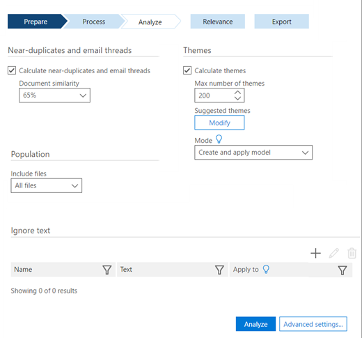

# Definir opções de análise na Descoberta Eletrônica Avançada do Office 365

> [!NOTE]
> EDiscovery Avançado requer um Office 365 E3 com o complemento de conformidade avançadas ou uma assinatura E5 para sua organização. Se você não tiver que plano e quiser tentar eDiscovery avançado, você pode [inscrever-se para uma avaliação do Office 365 Enterprise E5](https://go.microsoft.com/fwlink/p/?LinkID=698279). 
  
No eDiscovery avançado, defina as opções de analisar antes de executar Analyze.
  
## Definir opções de analisar

Open **Preparar \> analisar** \> **instalação**. A seguinte janela é exibida.
  

  
 **Perto duplicatas e segmentos de email** Esta caixa de seleção se você deseja executar a análise. Ele é selecionado por padrão. 
  
 **Semelhança de documento** Insira o valor de limite de repetições de Near ou aceite o padrão de 65%. 
  
 **Temas** Marque esta caixa para processar todos os arquivos e atribua temas de. Por padrão, essa caixa de seleção não está selecionada. Insira as seguintes opções se você deseja realizar o processamento de temas.
  
- **Número máximo de temas** Insira ou selecione um valor para o número de temas para criar. O padrão é 200. 
    
    > [!NOTE]
    > Aumento do número de temas afeta o desempenho, bem como a capacidade de um tema para generalizar. Quanto maior o número de temas, mais granular são. Por exemplo, se um conjunto de 50 temas incluir um tema, como "Basquete, rumo, Cortador de Lakers"; 300 temas podem incluir separados temas: "Estimula os", "Cortador de", "Lakers". Se você tivesse sem reconhecimento do tema "Basquete" e usa esse recurso para ECA, vendo o tema "Basquete" poderia ser útil. Mas, se o processamento teve muitos temas, você nunca pode ver a palavra "Basquete" e talvez não saiba que rumo e cortador é boa temas basquete revisar, em vez de itens que vá é inicializado e usado para cabelo. 
  
- **Temas sugeridos** Você pode sugerir palavras de tema para controlar o processamento de temas. EDiscovery avançado será enfocam essas palavras sugeridas e tente criar um ou mais temas relevantes, com base nas configurações de "Número de temas do Max". 
    
    Por exemplo, se a palavra sugerida é "computer", e você especificou "2" como o "número máximo de temas", o eDiscovery avançado tentará gere dois temas que se relacionam com a palavra "computador". Os dois temas poderiam ser "software de computador" e "hardware de computador", por exemplo. 
    
    
  
1. Para exibir, adicionar ou editar temas sugeridos, clique em **Modificar**.
    
2. No painel **sugeridos temas** , clique em **Adicionar** ícone para adicionar um tema. No painel do **tema sugerido de adicionar** , adicione as palavras, separadas por vírgulas. 
    
3. Em **número de temas**, selecione um valor para determinar o número de temas eDiscovery avançado tentará gerar por estas palavras (o padrão é 1 tema).
    
4. Clique em **Salvar** e feche a caixa de diálogo. 
    
    > [!NOTE]
    > O número total de temas inclui sugerido temas. Os temas de sugerido total não pode exceder os temas total. Se houver vários temas sugerido em relação aos temas total, somente os temas "livro" poucos serão detectados pelo sistema porque a maioria dos temas vai ser dedicada ao temas sugerido. 
  
- **Modo** Na lista suspensa, selecione uma opção de **temas** : 
    
  - **Criar e aplicar modelo**: calcula temas por modelos a partir de um segmento dos arquivos e distribui arquivos entre eles.
    
  - **Criar modelo**: calcula um modelo de temas de um segmento dos arquivos. O processo de aplicar de divisão de arquivos é feito separadamente mais tarde.
    
  - **Aplicar modelo**: essa opção é mostrada somente se um modelo foi criado anteriormente e ainda não foi aplicado. Isso dividirá os arquivos com base nos temas.
    
Você também pode [Definir Ignorar texto](set-ignore-text-in-advanced-ediscovery.md) e [definir configurações avançada de analisar](set-analyze-advanced-settings-in-advanced-ediscovery.md) para analisar. 
  
Depois de configurar essas opções, clique em **Analisar** para ser executado. [Analisar o modo de exibição de resultados](view-analyze-results-in-advanced-ediscovery.md) são exibidos. 
  
## Confira também

[Descoberta Eletrônica Avançada do Office 365](office-365-advanced-ediscovery.md)
  
[Noções básicas sobre semelhança de documento](understand-document-similarity-in-advanced-ediscovery.md)
  
[Definir Ignorar texto](set-ignore-text-in-advanced-ediscovery.md)
  
[Definir as configurações avançadas de análise](set-analyze-advanced-settings-in-advanced-ediscovery.md)
  
[Exibir resultados de análise](view-analyze-results-in-advanced-ediscovery.md)

