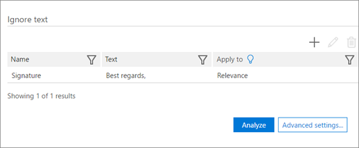

# Definir a opção Ignorar Texto para análise na Descoberta Eletrônica Avançada do Office 365Set Ignore Text option for Analyze in Office 365 Advanced eDiscovery

> [!NOTE]
> EDiscovery Avançado requer um Office 365 E3 com o complemento de conformidade avançadas ou uma assinatura E5 para sua organização. Se você não tiver que plano e quiser tentar eDiscovery avançado, você pode [inscrever-se para uma avaliação do Office 365 Enterprise E5](https://go.microsoft.com/fwlink/p/?LinkID=698279).Advanced eDiscovery requires an Office 365 E3 with the Advanced Compliance add-on or an E5 subscription for your organization. If you don't have that plan and want to try Advanced eDiscovery, you can [sign up for a trial of Office 365 Enterprise E5](https://go.microsoft.com/fwlink/p/?LinkID=698279). 
  
O recurso Ignorar texto pode ser aplicado a todos ou qualquer um dos seguintes módulos avançados eDiscovery: analisar (temas de Threads de Email, perto de duplicatas) e a relevância. Texto ignorado não aparecerá na arquivos exibidos em relevância e os cálculos de análise/descartará o texto ignorado.The Ignore Text feature can be applied to all or any of the following Advanced eDiscovery modules: Analyze (Near-duplicates, Email Threads, Themes) and Relevance. Ignored text will not appear in files displayed in Relevance, and the analysis/calculations will discard the ignored text.
  
Se o recurso Ignorar texto foi definido anteriormente para módulos que já foi executado, a configuração Ignorar texto agora estará protegida contra modificação. No entanto, o recurso de ignorar o texto para o módulo de relevância ainda pode ser alterado a qualquer momento.If the Ignore Text feature was previously defined for modules that have already run, the Ignore Text setting will now be protected from being modified. However, the Ignore Text feature for the Relevance module can still be changed at any time.
  
## Como Ignorar texto filtros são aplicadosHow Ignore Text filters are applied

Vários filtros Ignorar texto são aplicados na ordem em que foram inseridos. Para alterar a ordem na qual elas serão aplicadas, eles devem ser excluídos e entrado novamente na ordem desejada.Multiple Ignore Text filters are applied in the order that they were entered. To change the order in which they are applied, they must be deleted and re-entered in the desired order.
  
Por exemplo, se o conteúdo de texto é: "DAVE BOB ALICE CAROL noite", a seguir estão exemplos de entradas de ignorar o texto e os resultados:For example, if the text content is: "DAVE BOB ALICE CAROL EVE", the following are samples of Ignore Text entries and the results:
  
||||
|:-----|:-----|:-----|
|**Ignorar as entradas de texto****Ignore Text entries**   |**==\>**   |**Resultados****Results**   |
|"ALICE", "BOB CAROL""ALICE", "BOB CAROL"    |==\>    |"DAVE NOITE""DAVE EVE"    |
|"ALICE", "BOB ALICE CAROL""ALICE", "BOB ALICE CAROL"    |==\>    |"DAVE BOB CAROL NOITE""DAVE BOB CAROL EVE"    |
   
A segunda entrada de texto ignorar não está implementada porque a cadeia de caracteres não for encontrada como tal, após o primeiro texto ignorar tiver sido aplicado.The second Ignore Text entry is not implemented because the string is not found as such AFTER the first Ignore Text has been applied.
  
## Usar expressões regulares ao definir Ignorar textoUse regular expressions when defining Ignore Text

Expressões regulares são compatíveis para uso ao definir Ignorar texto. A seguir está exemplos de uso e a sintaxe de expressão regular:Regular expressions are supported for use when defining Ignore Text. The following are examples of regular expression syntax and usage:
  
- Para remover (ignorar) o texto de Begin até o final de uma linha:To remove (ignore) text from Begin until the end of a line:
    
     `Begin(.*)$`
    
    onde "Begin" é a ocorrência inicial dessa cadeia de caracteres na linha.where "Begin" is the initial occurrence of this string in the line.
    
    Por exemplo, para o seguinte texto:For example, for the following text:
    
    **"Este é primeira frase e a primeira linha****"This is first sentence and first line**
    
    **Esta é a segunda frase e a segunda linha"****This is second sentence and second line"**
    
    a expressão Regular first(.\*) $ resultará em:the Regular Expression first(.\*)$ will result in:
    
    **"Este é****"This is**
    
    **Esta é a segunda frase e a segunda linha"****This is second sentence and second line"**
    
- Para remover os avisos de isenção e declarações jurídicas automaticamente inseridas no fim de threads de email:To remove disclaimers and legal statements automatically inserted at the end of email threads:
    
     `Begin(.|\s)*End`
    
    onde "Begin" e "End" são cadeias de caracteres exclusivas no início e no final de um parágrafo do texto quebrado automaticamente.where "Begin" and "End" are unique strings at the beginning and end of a wrapped text paragraph. 
    
    Por exemplo, a seguinte expressão regular e serão removidos avisos de isenção legais instruções que estavam no segmento de email entre as cadeias de caracteres Begin e End:For example, the following regular expression will remove disclaimers and legal statements that were in the email thread between the Begin and End strings:
    
    **Esta mensagem contém informações confidenciais (. | \s)\*se é necessária uma verificação solicite uma versão impresso****This message contains confidential information (.|\s)\*If verification is required please request a hard-copy version**
    
- Para remover um aviso de isenção (incluindo caracteres especiais):To remove a disclaimer (including special characters): 
    
    Por exemplo, para o seguinte texto (com a isenção de responsabilidade representado aqui por xx):For example, for the following text (with the disclaimer represented here by x's): 
    
    **/\*\ Esta mensagem contém informações confidenciais. xxxx xxxx****/\*\ This message contains confidential information. xxxx xxxx**
    
    **xxxx xxxx xxxx xxxx xxxx xxxx xxxx****xxxx xxxx xxxx xxxx xxxx xxxx xxxx**
    
    \**xxxx xxxx se verificação for necessária, solicite uma versão impresso. /\*\**\**xxxx xxxx If verification is required, please request a hard-copy version. /\*\**
    
    a expressão regular para remover a isenção de responsabilidade acima deve ser:the regular expression to remove the above disclaimer should be: 
    
    **\/\\*\\Esta mensagem contém informações confidenciais\.(. | \s)\* se é necessária uma verificação solicite uma versão impresso\.\/\\*\\****\/\\*\\ This message contains confidential information\.(.|\s)\* If verification is required please request a hard-copy version\. \/\\*\\**
    
- Regras de expressão regular:Regular expression rules:
    
  - Quaisquer caracteres que não fazem parte do alfabeto, com exceção de espaço (s), "_" e "-" deve ser precedido por "\".Any characters that are not part of the alphabet except for space(s), "_" and "-" must be preceded by "\".
    
  - O campo eExpression regular pode ser comprimento ilimitado.The regular eExpression field can be unlimited length.
    
> [!TIP]
> Para obter uma explicação e detalhadas sobre sintaxe das expressões regulares, consulte: [Linguagem de expressão Regular - referência rápida](https://msdn.microsoft.com/en-us/library/az24scfc%28v=vs.110%29.aspx).For an explanation and detailed syntax of regular expressions, see: [Regular Expression Language - Quick Reference](https://msdn.microsoft.com/en-us/library/az24scfc%28v=vs.110%29.aspx). 
  
## Definir texto Ignorar regraDefine Ignore Text rule

1. No **Gerenciar \> analisar \> analisar opções** guia, na seção **Ignorar texto** , clique no **+** ícone para adicionar uma regra.In the **Manage \> Analyze \> Analyze options** tab, in the **Ignore Text** section, click the **+** icon to add a rule. 
    
2. Na caixa de diálogo **Adicionar texto ignorar** , no campo **nome** , digite um nome para a regra Ignorar texto.In the **Add Ignore Text** dialog, in the **Name** field, type a name for the Ignore Text rule. 
    
    
  
3. Na caixa de **texto** , digite o texto a ser ignorado. O campo texto permite que um número ilimitado de caracteres.In the **Text** box, type the text to be ignored. The text field allows an unlimited number of characters. 
    
    > [!TIP]
    > Conforme mostrado na janela acima, clique em **lâmpada** para ver as diretrizes de sintaxe comuns para a regra Ignorar texto.As shown in the window above, click **light bulb** to see common syntax guidelines for the Ignore Text rule. 
  
4. Marque a caixa de seleção **Diferenciar maiusculas de minúsculas** , se desejado.Select the **Case sensitive** check box, if desired. 
    
5. Na lista **Aplicar a** , selecione os módulos de descoberta eletrônica avançada na qual aplicar a definição.In the **Apply to** list, select the Advanced eDiscovery modules in which to apply the definition. 
    
6. Se você quiser um execução de teste em texto de exemplo, digite o texto de exemplo na caixa de texto de **entrada** e clique em **Testar**. Os resultados são exibidos na caixa de texto de **saída** .If you want a test run on sample text, type sample text in the **Input** text box and click **Test**. The results are displayed in the **Output** text box. 
    
7. Clique em **Okey** para salvar a regra Ignorar texto. A regra de Ignorar texto definida é exibida.Click **OK** to save the Ignore Text rule. The defined Ignore Text rule is displayed. 
    
    
  
## Confira tambémSee also

[Descoberta Eletrônica Avançada do Office 365Office 365 Advanced eDiscovery](office-365-advanced-ediscovery.md)
  
[Noções básicas sobre semelhança de documentoUnderstanding document similarity](understand-document-similarity-in-advanced-ediscovery.md)
  
[Definindo opções de analisarSetting Analyze options](set-analyze-options-in-advanced-ediscovery.md)
  
[Analisar configuração configurações avançadaSetting Analyze advanced settings](set-analyze-advanced-settings-in-advanced-ediscovery.md)
  
[Exibindo os resultados da análiseViewing Analyze results](view-analyze-results-in-advanced-ediscovery.md)

