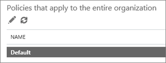

# Configurar uma lista de URLs bloqueadas personalizada usando os links seguros de ATP do Office 365

> [!IMPORTANT]
> Este artigo destina-se a clientes corporativos com [proteção avançada contra ameaças do Office 365](office-365-atp.md). Se você for um usuário doméstico que procura informações sobre links seguros no Outlook, consulte [Advanced Outlook.com Security](https://support.office.com/article/advanced-outlook-com-security-for-office-365-subscribers-882d2243-eab9-4545-a58a-b36fee4a46e2).

Com a [proteção avançada contra ameaças do Office 365](office-365-atp.md) (ATP), sua organização pode ter uma lista personalizada de endereços de sites (URLs) bloqueadas. Quando uma URL é bloqueada, as pessoas que clicam em links para a URL bloqueada são levadas para uma [página de aviso](atp-safe-links-warning-pages.md) que se assemelha à seguinte imagem: 
  

  
A lista de URLs bloqueadas é definida pela equipe de segurança do Office 365 da sua organização e essa lista se aplica a todos na organização que estão cobertos por políticas de links seguros do Office 365 ATP. 
  
Leia este artigo para saber como configurar a lista de URLs bloqueadas personalizadas da sua organização para [links seguros de ATP no Office 365](atp-safe-links.md).
  
## Exibir ou editar uma lista personalizada de URLs bloqueadas

Os [links seguros de ATP no Office 365](atp-safe-links.md) usam várias listas, incluindo a lista de URLs bloqueadas da sua organização. Se tiver as permissões necessárias, você poderá configurar a lista personalizada da sua organização. Para fazer isso, edite a política de links seguros padrão da sua organização.

Para editar (ou definir) políticas ATP, você deve receber uma das funções descritas na tabela a seguir: 

|Role  |Onde/como a atribuição  |
|---------|---------|
|Administrador global do Office 365 |Por padrão, a pessoa que se inscreve para comprar o Office 365 é um administrador global. (Confira [sobre as funções de administrador do Office 365](https://docs.microsoft.com/office365/admin/add-users/about-admin-roles) para saber mais.)         |
|Administrador de segurança |Centro de administração do Azure Active[https://aad.portal.azure.com](https://aad.portal.azure.com)Directory ()|
|Gerenciamento da organização do Exchange Online |Centro de administração do[https://outlook.office365.com/ecp](https://outlook.office365.com/ecp)Exchange ()  ou    Cmdlets do PowerShell (consulte [Exchange Online PowerShell](https://docs.microsoft.com/powershell/exchange/exchange-online/exchange-online-powershell?view=exchange-ps)) |

> [!TIP]
> Para saber mais sobre funções e permissões, confira [permissões no centro de conformidade &amp; de segurança do Office 365](permissions-in-the-security-and-compliance-center.md).

### Para exibir ou editar uma lista de URLs bloqueadas personalizada
  
1. Acesse [https://protection.office.com](https://protection.office.com) e entre com sua conta corporativa ou de estudante. 
    
2. Na navegação à esquerda, em **Gerenciamento de ameaças**, escolha **links seguros**de **política** \> .
    
3. Na seção **políticas que se aplicam a toda a organização** , selecione **padrão**e, em seguida, escolha **Editar** (o botão Editar parece um lápis).  Isso permite que você exiba a lista de URLs bloqueadas. Em primeiro lugar, talvez você não tenha URLs listadas aqui. 
  
4. Selecione a caixa **Insira uma URL válida** , digite uma URL e, em seguida, escolha o sinal**+** de mais (). 

5. Quando terminar de adicionar URLs, no canto inferior direito da tela, escolha **salvar**.
    
## Há algumas coisas que você deve ter em mente

Ao adicionar URLs à sua lista, tenha em mente os seguintes pontos: 

- Não inclua uma barra ( **/**) no final da URL. Por exemplo, em vez de `http://www.contoso.com/`inserir, `http://www.contoso.com`insira.
    
- Você pode especificar uma URL somente de domínio (como `contoso.com` ou `tailspintoys.com`). Isso bloqueará cliques em qualquer URL que contenha o domínio.

- Você pode especificar um subdomínio (como `toys.contoso.com*`) sem bloquear um domínio completo (como `contoso.com`). Isso bloqueará cliques em qualquer URL que contenha o subdomínio, mas não bloqueará cliques para uma URL que contenha o domínio completo.  
    
- Você pode incluir até três asteriscos curinga (\*) por URL. A tabela a seguir lista alguns exemplos do que você pode inserir e o efeito que essas entradas têm.
    
|**Entrada de exemplo**|**O que ele faz**|
|:-----|:-----|
|`contoso.com` ou `*contoso.com*`    |Bloqueia o domínio, subdomínios e caminhos, como `https://www.contoso.com`, e `http://sub.contoso.com``http://contoso.com/abc`    |
|`http://contoso.com/a`    |Bloqueia um site `http://contoso.com/a` , mas não outros subcaminhos como`http://contoso.com/a/b`    |
|`http://contoso.com/a*`    |Bloqueia um site `http://contoso.com/a` e subcaminhos adicionais, como`http://contoso.com/a/b`    |
|`http://toys.contoso.com*`    |Bloqueia um subdomínio ("Toys" nesse caso), mas permite cliques para outras URLs de domínio ( `http://contoso.com` como `http://home.contoso.com`ou).    |
   

## Como definir exceções para determinados usuários em uma organização

Se quiser que certos grupos possam exibir URLs que podem ser bloqueadas para outras pessoas, você pode especificar uma política de links seguros de ATP que se aplica a destinatários específicos. Confira [Configurar uma lista de URLs "não reconfigurar" personalizada usando os links seguros de ATP](set-up-a-custom-do-not-rewrite-urls-list-with-atp.md).
  

