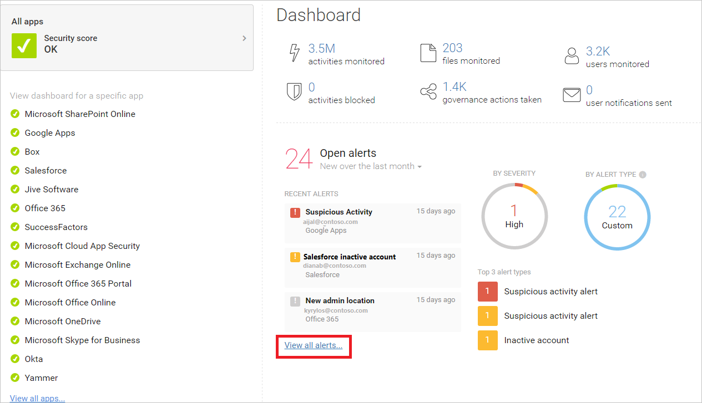

# Configure o locatário do Office 365 para aumentar a segurançaConfigure your Office 365 tenant for increased security

Este tópico o orienta através da configuração recomendada para definições de todos os locatários que afetam a segurança do seu ambiente do Office 365.This topic walks you through recommended configuration for tenant-wide settings that affect the security of your Office 365 environment. Suas necessidades de segurança podem exigir mais ou menos segurança.Your security needs might require more or less security. Use estas recomendações como ponto de partida.Use these recommendations as a starting point.
  
## Verificar a pontuação segura do Office 365Check Office 365 Secure Score

A pontuação segura do Office 365 analisa a segurança da sua organização do Office 365 com base em suas atividades regulares e configurações de segurança e atribui uma pontuação.Office 365 Secure Score analyzes your Office 365 organization's security based on your regular activities and security settings and assigns a score. Comece anotando sua pontuação atual.Begin by taking note of your current score. O ajuste de algumas configurações de todos os locatários aumentará a sua pontuação.Adjusting some tenant-wide settings will increase your score. O objetivo não é atingir a pontuação máxima, mas para estar ciente das oportunidades de proteger seu ambiente que não afete negativamente a produtividade dos seus usuários.The goal is not to achieve the max score, but to be aware of opportunities to protect your environment that do not negatively affect productivity for your users. Confira a [Pontuação segura da Microsoft](microsoft-secure-score.md).See [Microsoft Secure Score](microsoft-secure-score.md).
  
## Ajustar as políticas de gerenciamento de ameaças no centro de segurança do Microsoft 365Tune threat management policies in the Microsoft 365 security center

O centro de segurança do Microsoft 365 inclui recursos que protegem o seu ambiente.The Microsoft 365 security center includes capabilities that protect your environment. Também inclui relatórios e painéis que você pode usar para monitorar e tomar medidas.It also includes reports and dashboards you can use to monitor and take action. Algumas áreas vêm com as configurações de política padrão.Some areas come with default policy configurations. Algumas áreas não incluem políticas ou regras padrão.Some areas do not include default policies or rules. Visite estas políticas em gerenciamento de ameaças para ajustar as configurações de gerenciamento de ameaças para um ambiente mais seguro.Visit these policies under threat management to tune threat management settings for a more secure environment. 
  
|Área \* \* \* \*\*\*\*\*Area\*\*\*\*|Inclui uma política padrão \* \* \* \*\*\*\*\*Includes a default policy\*\*\*\*|Recomendação \* \* \* \*\*\*\*\*Recommendation\*\*\*\*|
|:-----|:-----|:-----|
|**Anti-phishing****Anti-phishing**   |SimYes    | Se você tiver um domínio personalizado, crie uma política anti-phishing para proteger as contas de email de seus usuários mais valiosos, como seu CEO, e para proteger seu domínio.If you have a custom domain, create an anti-phishing policy to protect the email accounts of your most valuable users, such as your CEO, and to protect your domain. Revisar [Configure uma política anti-phishing](set-up-anti-phishing-policies.md) e crie uma política usando o exemplo como guia: "exemplo: política anti-phishing para proteger um usuário e um domínio."Review [Set up an anti-phishing policy](set-up-anti-phishing-policies.md) and create a policy using the example as a guide: "Example: Anti-phishing policy to protect a user and a domain."|
|**Mecanismo Antimalware****Anti-Malware Engine**   |SimYes    | Edite a política padrão:Edit the default policy:    &ensp;&ensp;• Filtro tipos de anexo comuns — selecione ativado&ensp;&ensp;•   Common Attachment Types Filter — Select On      Você também pode criar políticas de filtro de malware personalizadas e aplicá-las a usuários, grupos ou domínios especificados em sua organização.You can also create custom malware filter policies and apply them to specified users, groups, or domains in your organization.      Mais informações:More information:    &ensp;&ensp;• [Proteção Antimalware](https://technet.microsoft.com/en-us/library/jj200669%28v=exchg.150%29.aspx)&ensp;&ensp;•   [Anti-malware protection](https://technet.microsoft.com/en-us/library/jj200669%28v=exchg.150%29.aspx)   &ensp;&ensp;• [Configurar políticas Antimalware](https://technet.microsoft.com/en-us/library/jj200745%28v=exchg.150%29.aspx)&ensp;&ensp;•   [Configure anti-malware policies](https://technet.microsoft.com/en-us/library/jj200745%28v=exchg.150%29.aspx)   |
|**Anexos Seguros da ATP****ATP Safe Attachments**   |NãoNo    | Na página principal de anexos seguros, proteja arquivos no SharePoint, no OneDrive e no Microsoft Teams marcando esta caixa:On the main page for safe attachments, protect files in SharePoint, OneDrive, and Microsoft Teams by checking this box:     &ensp;&ensp;• Ative a ATP para SharePoint, OneDrive e Microsoft Teams&ensp;&ensp;•   Turn on ATP for SharePoint, OneDrive, and Microsoft Teams      Adicione uma nova política de anexo seguro com estas configurações:Add a new safe attachment policy with these settings:     &ensp;&ensp;• Bloquear — bloquear emails e anexos atuais e futuros com malware detectado (escolha esta opção)&ensp;&ensp;•   Block — Block the current and future emails and attachments with detected malware (choose this option)     &ensp;&ensp;• Habilitar o redirecionamento — (Marque esta caixa e insira um endereço de email, como uma conta de administrador ou de quarentena)&ensp;&ensp;•   Enable redirect — (Check this box and enter an email address, such as an admin or quarantine account)     &ensp;&ensp;• Aplique a seleção acima se o malware verificando se há anexos expirados ou se ocorrer um erro (Marque esta caixa)&ensp;&ensp;•   Apply the above selection if malware scanning for attachments times out or error occurs (check this box)     &ensp;&ensp;• Aplicado a – o domínio do destinatário é (selecione seu domínio)&ensp;&ensp;•   Applied To — The recipient domain is (select your domain)      Mais informações: [Configurar políticas de anexos seguros do Office 365 ATP](set-up-atp-safe-attachments-policies.md)More information: [Set up Office 365 ATP safe attachments policies](set-up-atp-safe-attachments-policies.md)   |
|**Links seguros da ATP****ATP Safe Links**   |SimYes    | Adicione essa configuração à política padrão para toda a organização:Add this setting to the default policy for the entire organization:    &ensp;&ensp;• Use links seguros no: Office 365 ProPlus, Office para iOS e Android (Selecione essa opção).&ensp;&ensp;•    Use safe links in: Office 365 ProPlus, Office for iOS and Android (select this option).     Política recomendada para destinatários específicos:Recommended policy for specific recipients:     &ensp;&ensp;• As URLs serão reescritas e verificadas em relação a uma lista de links mal-intencionados conhecidos quando o usuário clicar no link (Selecione essa opção).&ensp;&ensp;•   URLs will be rewritten and checked against a list of known malicious links when user clicks on the link (select this option).     &ensp;&ensp;• Use anexos seguros para examinar Conteúdo baixável (Marque esta caixa).&ensp;&ensp;•   Use Safe Attachments to scan downloadable content (check this box).     &ensp;&ensp;• Aplicado a – o domínio do destinatário é (selecione seu domínio).&ensp;&ensp;•   Applied To — The recipient domain is (select your domain).      Mais informações: [Office 365 ATP Safe links](atp-safe-links.md).More information: [Office 365 ATP safe links](atp-safe-links.md).    |
|**Anti-spam (filtragem de email)****Anti-Spam (Mail filtering)**   |SimYes    | O que observar:What to watch for:     &ensp;&ensp;• Muito spam — escolha as configurações personalizadas e edite a política padrão de filtro de spam.&ensp;&ensp;•   Too much spam — Choose the Custom settings and edit the Default spam filter policy.     &ensp;&ensp;• Inteligência de falsificação — revise os remetentes que estão falsificando seu domínio.&ensp;&ensp;•   Spoof intelligence — Review senders that are spoofing your domain. Bloquear ou permitir estes remetentes.Block or allow these senders.      Mais informações: [proteção antispam de email do Office 365](anti-spam-protection.md).More information: [Office 365 Email Anti-Spam Protection](anti-spam-protection.md).    |
|***Autenticação de email******Email Authentication***   |SimYes    |A autenticação de email usa um DNS (sistema de nomes de domínio) para adicionar informações verificáveis a mensagens de email sobre o remetente de um email.Email authentication uses a Domain Name System (DNS) to add verifiable information to email messages about the sender of an email. O Office 365 configura a autenticação de email para seu domínio padrão (onmicrosoft.com), mas os administradores do Office 365 também podem usar a autenticação de email para domínios personalizados.Office 365 sets up email authentication for its default domain (onmicrosoft.com), but Office 365 admins can also use email authentication for custom domains. Três métodos de autenticação são usados:Three authentication methods are used:     &ensp;&ensp;• Estrutura de política de remetente (ou SPF).&ensp;&ensp;•   Sender Policy Framework (or SPF). &ensp;&ensp;&ensp;&ensp;– Para configuração, consulte [set up SPF in Office 365 para ajudar a impedir a falsificação](set-up-spf-in-office-365-to-help-prevent-spoofing.md).&ensp;&ensp;&ensp;&ensp;- For setup, see [Set up SPF in Office 365 to help prevent spoofing](set-up-spf-in-office-365-to-help-prevent-spoofing.md).   &ensp;&ensp;• DomainKeys Identificated mail (DKIM).&ensp;&ensp;•   DomainKeys Identified Mail (DKIM).   &ensp;&ensp;&ensp;&ensp;– Consulte [usar o DKIM para email em seu domínio personalizado no Office 365](https://docs.microsoft.com/office365/SecurityCompliance/use-dkim-to-validate-outbound-email).&ensp;&ensp;&ensp;&ensp;- See [Use DKIM for email in your custom domain in Office 365](https://docs.microsoft.com/office365/SecurityCompliance/use-dkim-to-validate-outbound-email).  &ensp;&ensp;&ensp;&ensp;Após configurar o DKIM, habilite-o na central de segurança.&ensp;&ensp;&ensp;&ensp;- After you've configured DKIM, enable it in the security center.  &ensp;&ensp;• Autenticação, geração de relatórios e conformidade de mensagens baseadas em domínio (DMARC).&ensp;&ensp;•   Domain-based Message Authentication, Reporting, and Conformance (DMARC).   &ensp;&ensp;&ensp;&ensp;– Para a configuração do DMARC, [use o DMARC para validar emails no Office 365](use-dmarc-to-validate-email.md).&ensp;&ensp;&ensp;&ensp;- For DMARC setup [Use DMARC to validate email in Office 365](use-dmarc-to-validate-email.md).    
|

> [!NOTE]
> Para implantações não padrão de SPF, implantações híbridas e solução de problemas: [como o Office 365 usa o Sender Policy Framework (SPF) para evitar a falsificação](how-office-365-uses-spf-to-prevent-spoofing.md).For non-standard deployments of SPF, hybrid deployments, and troubleshooting: [How Office 365 uses Sender Policy Framework (SPF) to prevent spoofing](how-office-365-uses-spf-to-prevent-spoofing.md).

## Exibir painéis e relatórios nos centros de segurança e conformidadeView dashboards and reports in the security and compliance centers

Visite esses relatórios e painéis para saber mais sobre a integridade de seu ambiente.Visit these reports and dashboards to learn more about the health of your environment. Os dados desses relatórios ficarão mais sofisticados, pois sua organização usa os serviços do Office 365.The data in these reports will become richer as your organization uses Office 365 services. Por enquanto, familiarize-se com o que você pode monitorar e tomar ações.For now, be familiar with what you can monitor and take action on. Para obter mais informações, consulte: [relatórios nos centros de segurança e conformidade do Microsoft 365](reports-in-security-and-compliance.md).For more information, see : [Reports in the Microsoft 365 security and compliance centers](reports-in-security-and-compliance.md).
  
|Painel \* \* \* \*\*\*\*\*Dashboard\*\*\*\*|\*\*\*\*Descrição\*\*\*\*\*\*\*\*Description\*\*\*\*|
|:-----|:-----|
|[Painel de gerenciamento de ameaçasThreat management dashboard](security-dashboard.md)    |Na seção **Gerenciamento de ameaças** da central de segurança, use este painel para ver as ameaças que já foram tratadas e como uma ferramenta útil para relatar os tomadores de decisões de negócios sobre quais recursos de investigação e resposta de ameaças já foram feito para proteger sua empresa.In the **Threat management** section of the security center, use this dashboard to see threats that have already been handled, and as a handy tool for reporting out to business decision makers on what threat investigation and response capabilities have already done to secure your business.    |
|[Explorador de ameaças (ou detecções em tempo real)Threat Explorer (or real-time detections)](threat-explorer.md)    |Isso também está na seção **Gerenciamento de ameaças** da central de segurança.This is also in the **Threat management** section of the security center. Se você estiver investigando ou experimentando um ataque contra o locatário do Office 365, use o Explorer (ou detecções em tempo real) para analisar ameaças.If you are investigating or experiencing an attack against your Office 365 tenant, use Explorer (or real-time detections) to analyze threats. O Explorer (e o relatório de detecções em tempo real) mostra o volume de ataques ao longo do tempo, e você pode analisar esses dados por famílias de ameaças, infraestrutura de atacante e muito mais.Explorer (and the real-time detections report) shows you the volume of attacks over time, and you can analyze this data by threat families, attacker infrastructure, and more. Você também pode marcar qualquer email suspeito para a lista de incidentes.You can also mark any suspicious email for the Incidents list.    |
|Relatórios — painelReports — Dashboard    |Na seção **relatórios** da central de segurança, exiba relatórios de auditoria para as organizações do SharePoint Online e do Exchange Online.In the **Reports** section of security center, view audit reports for your SharePoint Online and Exchange Online organizations. Você também pode acessar os relatórios de entrada do usuário do Azure Active Directory (Azure AD), relatórios de atividades do usuário e o log de auditoria do Azure AD na página **exibir relatórios** .You can also access Azure Active Directory (Azure AD) user sign-in reports, user activity reports, and the Azure AD audit log from the **View reports** page.    |
   

  
## Definir configurações adicionais para todos os locatários do Exchange OnlineConfigure additional Exchange Online tenant-wide settings

Muitos dos controles de segurança e proteção no centro de administração do Exchange também estão incluídos na central de segurança.Many of the controls for security and protection in the Exchange admin center are also included in the security center. Não é necessário configurá-los nos dois lugares.You do not need to configure these in both places. Aqui estão algumas configurações adicionais recomendadas.Here are a couple of additional settings that are recommended. 
  
|Área \* \* \* \*\*\*\*\*Area\*\*\*\*|Inclui uma política padrão \* \* \* \*\*\*\*\*Includes a default policy\*\*\*\*|Recomendação \* \* \* \*\*\*\*\*Recommendation\*\*\*\*|
|:-----|:-----|:-----|
|**Fluxo de mensagens** (regras de fluxo de email, também conhecidas como regras de transporte)**Mail Flow** (mail flow rules, also known as transport rules)|NãoNo|Adicione uma regra de fluxo de emails para ajudar a proteger contra o ransomware.Add a mail flow rule to help protect against ransomware. Consulte "como usar as regras de transporte do Exchange para rastrear ou bloquear emails com extensões de arquivo usadas pelo ransomware" neste artigo de blog: [como lidar com o ransomware](https://blogs.technet.microsoft.com/office365security/how-to-deal-with-ransomware/).See "How to use Exchange Transport Rules to track or block emails with file extensions used by ransomware" in this blog article: [How to deal with ransomware](https://blogs.technet.microsoft.com/office365security/how-to-deal-with-ransomware/).    Confira estes tópicos:See these topics:  •[Proteger contra o ransomware](https://docs.microsoft.com/office365/admin/security-and-compliance/secure-your-business-data?view=o365-worldwide#ransomware)•[Protect against ransomware](https://docs.microsoft.com/office365/admin/security-and-compliance/secure-your-business-data?view=o365-worldwide#ransomware) •[Proteção contra malware e ransomware no Office 365](office-365-malware-and-ransomware-protection.md)•[Malware and Ransomware Protection in Office 365](office-365-malware-and-ransomware-protection.md)    Crie uma regra de fluxo de emails para impedir o encaminhamento automático de emails para domínios externos.Create a mail flow rule to prevent auto-forwarding of email to external domains. Para obter mais informações, consulte [mitigating Client external Forwarding Rules with Secure Score](https://blogs.technet.microsoft.com/office365security/mitigating-client-external-forwarding-rules-with-secure-score/).For more information, see [Mitigating Client External Forwarding Rules with Secure Score](https://blogs.technet.microsoft.com/office365security/mitigating-client-external-forwarding-rules-with-secure-score/).    Mais informações: [regras de fluxo de emails (regras de transporte) no Exchange Online](https://technet.microsoft.com/en-us/library/jj919238%28v=exchg.150%29.aspx)More information: [Mail flow rules (transport rules) in Exchange Online](https://technet.microsoft.com/en-us/library/jj919238%28v=exchg.150%29.aspx)|
|**Habilitar a autenticação moderna****Enable modern authentication**|NãoNo|A autenticação moderna no Office 365 é um pré-requisito para usar a protocolo de autenticação multifator (MFA).Modern authentication in Office 365 is a prerequisite for using multi-factor authentication (MFA). A MFA é recomendada para proteger o acesso a recursos de nuvem, incluindo email.MFA is recommended for securing access to cloud resources, including email.    Confira estes tópicos:See these topics:   • [Habilitar ou desabilitar a autenticação moderna no Exchange Online](https://support.office.com/article/58018196-f918-49cd-8238-56f57f38d662)• [Enable or disable modern authentication in Exchange Online](https://support.office.com/article/58018196-f918-49cd-8238-56f57f38d662)  • [Skype for Business Online: habilitar seu locatário para autenticação moderna](https://social.technet.microsoft.com/wiki/contents/articles/34339.skype-for-business-online-enable-your-tenant-for-modern-authentication.aspx)• [Skype for Business Online: Enable your tenant for modern authentication](https://social.technet.microsoft.com/wiki/contents/articles/34339.skype-for-business-online-enable-your-tenant-for-modern-authentication.aspx)    A autenticação moderna está habilitada por padrão para clientes do Office 2016, SharePoint Online e OneDrive for Business.Modern authentication is enabled by default for Office 2016 clients, SharePoint Online, and OneDrive for Business.    Mais informações: [usando a autenticação moderna do office 365 com clientes do Office](https://support.office.com/article/776c0036-66fd-41cb-8928-5495c0f9168a)More information: [Using Office 365 modern authentication with Office clients](https://support.office.com/article/776c0036-66fd-41cb-8928-5495c0f9168a)|
   
## Configurar políticas de compartilhamento em todo o locatário no centro de administração do SharePointConfigure tenant-wide sharing policies in SharePoint admin center

Recomendações da Microsoft para configuração de sites de equipe do SharePoint em níveis de proteção crescentes, começando com proteção de linha de base.Microsoft recommendations for configuring SharePoint team sites at increasing levels of protection, starting with baseline protection. Para obter mais informações, consulte [proteger sites e arquivos do SharePoint Online](https://docs.microsoft.com/microsoft-365-enterprise/secure-sharepoint-online-sites-and-files)For more information, see [Secure SharePoint Online sites and files](https://docs.microsoft.com/microsoft-365-enterprise/secure-sharepoint-online-sites-and-files)
  
Sites de equipe do SharePoint configurados no nível da linha de base permitem compartilhar arquivos com usuários externos usando links de acesso anônimo.SharePoint team sites configured at the baseline level allow sharing files with external users by using anonymous access links. Essa abordagem é recomendada em vez de enviar arquivos no email.This approach is recommended instead of sending files in email. 
  
Para dar suporte às metas de proteção de linha de base, configure as políticas de compartilhamento em todo o locatário conforme recomendado aqui.To support the goals for baseline protection, configure tenant-wide sharing policies as recommended here. As configurações de compartilhamento para sites individuais podem ser mais restritivas que essa política de todo o locatário, mas não mais permissivas.Sharing settings for individual sites can be more restrictive than this tenant-wide policy, but not more permissive. 
  
|Área \* \* \* \*\*\*\*\*Area\*\*\*\*|Inclui uma política padrão \* \* \* \*\*\*\*\*Includes a default policy\*\*\*\*|Recomendação \* \* \* \*\*\*\*\*Recommendation\*\*\*\*|
|:-----|:-----|:-----|
|**Compartilhamento** (SharePoint Online e OneDrive for Business)**Sharing** (SharePoint Online and OneDrive for Business)|SimYes|O compartilhamento externo está habilitado por padrão.External sharing is enabled by default. Estas configurações são recomendadas:These settings are recommended:  • Permitir o compartilhamento de usuários externos autenticados e o uso de links de acesso anônimo (configuração padrão).• Allow sharing to authenticated external users and using anonymous access links (default setting).    • Os links de acesso anônimo expiram em vários dias.• Anonymous access links expire in this many days. Insira um número, se desejado, como 30 dias.Enter a number, if desired, such as 30 days.  • Tipo de link padrão — selecione interno (somente pessoas na organização).• Default link type — select Internal (people in the organization only). Os usuários que desejam compartilhar usando links anônimos devem escolher essa opção no menu compartilhamento.Users who wish to share using anonymous links must choose this option from the sharing menu.    Mais informações: [visão geral do compartilhamento externo](https://support.office.com/article/c8a462eb-0723-4b0b-8d0a-70feafe4be85)More information: [External sharing overview](https://support.office.com/article/c8a462eb-0723-4b0b-8d0a-70feafe4be85)|
   
O centro de administração do SharePoint e o centro de administração do OneDrive for Business incluem as mesmas configurações.SharePoint admin center and OneDrive for Business admin center include the same settings. As configurações no centro de administração se aplicam a ambos.The settings in either admin center apply to both.
  
## Definir configurações no Azure Active DirectoryConfigure settings in Azure Active Directory

Certifique-se de visitar essas duas áreas no Azure Active Directory para concluir a configuração em todo o locatário para ambientes mais seguros.Be sure to visit these two areas in Azure Active Directory to complete tenant-wide setup for more secure environments.
  
### Configurar locais nomeados (sob acesso condicional)Configure named locations (under conditional access)

Se sua organização incluir escritórios com acesso seguro à rede, adicione os intervalos de endereços IP confiáveis ao Azure Active Directory como locais nomeados.If your organization includes offices with secure network access, add the trusted IP address ranges to Azure Active Directory as named locations. Este recurso ajuda a reduzir o número de falsos positivos informados para eventos de risco de entrada.This feature helps reduce the number of reported false positives for sign-in risk events. 
  
Confira: [locais nomeados no Azure Active Directory](https://docs.microsoft.com/azure/active-directory/active-directory-named-locations)See: [Named locations in Azure Active Directory](https://docs.microsoft.com/azure/active-directory/active-directory-named-locations)
  
### Bloquear aplicativos que não dão suporte à autenticação modernaBlock apps that don't support modern authentication

A autenticação multifator requer aplicativos que dão suporte à autenticação moderna.Multi-factor authentication requires apps that support modern authentication. Os aplicativos que não dão suporte à autenticação moderna não podem ser bloqueados usando regras de acesso condicional.Apps that do not support modern authentication cannot be blocked by using conditional access rules.
  
Para ambientes seguros, não deixe de desabilitar a autenticação para aplicativos que não dão suporte à autenticação moderna.For secure environments, be sure to disable authentication for apps that do not support modern authentication. Você pode fazer isso no Azure Active Directory com um controle em breve.You can do this in Azure Active Directory with a control that is coming soon.
  
Enquanto isso, use um dos seguintes métodos para fazer isso para o SharePoint Online e o OneDrive for Business:In the meantime, use one of the following methods to accomplish this for SharePoint Online and OneDrive for Business:
  
- Usar o PowerShell, consulte [bloquear aplicativos que não usam autenticação moderna](https://docs.microsoft.com/intune-classic/deploy-use/block-apps-with-no-modern-authentication).Use PowerShell, see [Block apps that do not use modern authentication](https://docs.microsoft.com/intune-classic/deploy-use/block-apps-with-no-modern-authentication).
    
- Configure isso no centro de administração do SharePoint na página "acesso ao dispositivo" — "controlar o acesso de aplicativos que não usam autenticação moderna".Configure this in the SharePoint admin center on the "device access' page — "Control access from apps that don't use modern authentication." Escolha bloquear.Choose Block. 
    
## Introdução ao Cloud app Security ou ao Office 365 Cloud app SecurityGet started with Cloud App Security or Office 365 Cloud App Security

Use o Office 365 Cloud app Security para avaliar o risco, para alertar sobre atividades suspeitas e para executar ações automaticamente.Use Office 365 Cloud App Security to evaluate risk, to alert on suspicious activity, and to automatically take action. Requer plano do Office 365 e5.Requires Office 365 E5 plan.
  
Ou use o Microsoft Cloud app Security para obter visibilidade mais profunda, mesmo depois que o acesso é concedido, controles abrangentes e proteção aprimorada para todos os aplicativos de nuvem, incluindo o Office 365.Or, use Microsoft Cloud App Security to obtain deeper visibility even after access is granted, comprehensive controls, and improved protection for all your cloud applications, including Office 365. 
  
Como esta solução recomenda o plano do EMS e5, recomendamos que você inicie o Cloud app Security para que possa usá-lo com outros aplicativos SaaS em seu ambiente.Because this solution recommends the EMS E5 plan, we recommend you start with Cloud App Security so you can use this with other SaaS applications in your environment. Comece com políticas e configurações padrão.Start with default policies and settings.
  
Mais informações:More information:
  
- [Implantar o Cloud App SecurityDeploy Cloud App Security](https://docs.microsoft.com/cloud-app-security/getting-started-with-cloud-app-security)
    
- [Mais informações sobre o Microsoft Cloud App SecurityMore information about Microsoft Cloud App Security](https://www.microsoft.com/cloud-platform/cloud-app-security)
    
- [O que é o Cloud app Security?What is Cloud App Security?](https://docs.microsoft.com/cloud-app-security/what-is-cloud-app-security)
    

  
## Recursos adicionaisAdditional resources

Estes artigos e guias fornecem informações prescritivas adicionais para proteger seu ambiente do Office 365:These articles and guides provide additional prescriptive information for securing your Office 365 environment:
  
- [Diretrizes de segurança da Microsoft para campanhas políticas, sem fins lucrativos e outras organizações Agile](https://docs.microsoft.com/microsoft-365-enterprise/microsoft-security-guidance) (você pode usar essas recomendações em qualquer ambiente, especialmente em ambientes de nuvem)[Microsoft security guidance for political campaigns, nonprofits, and other agile organizations](https://docs.microsoft.com/microsoft-365-enterprise/microsoft-security-guidance) (you can use these recommendation in any environment, especially cloud-only environments) 
    
- [Políticas de segurança e configurações recomendadas para identidades e dispositivos](https://docs.microsoft.com/microsoft-365-enterprise/microsoft-365-policies-configurations) (estas recomendações incluem ajuda para ambientes do AD FS)[Recommended security policies and configurations for identities and devices](https://docs.microsoft.com/microsoft-365-enterprise/microsoft-365-policies-configurations) (these recommendations include help for AD FS environments) 
    

