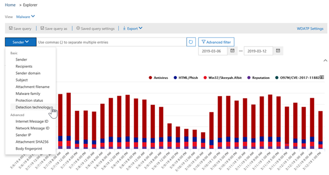
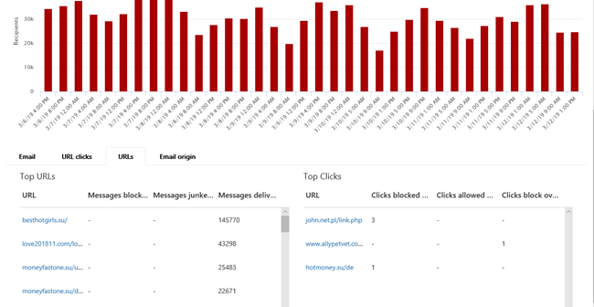

# Modos de exibição do Gerenciador de ameaçasThreat Explorer views

O [Gerenciador de ameaças](use-explorer-in-security-and-compliance.md) é uma ferramenta poderosa e quase em tempo real para ajudar as equipes de operações de segurança a investigar e &amp; responder a ameaças no centro de conformidade de segurança.[Threat Explorer](use-explorer-in-security-and-compliance.md) is a powerful, near real-time tool to help Security Operations teams investigate and respond to threats in the Security &amp; Compliance Center. O Explorer exibe informações sobre o malware e phishing suspeitos em emails e arquivos no Office 365, bem como outras ameaças e riscos de segurança à sua organização.Explorer displays information about suspected malware and phish in email and files in Office 365, as well as other security threats and risks to your organization. 

Quando você abre o Explorer pela primeira vez, o modo de exibição padrão mostra as detecções de malware de email dos últimos 7 dias.When you first open Explorer, the default view shows email malware detections for the past 7 days. 

O Explorer também pode mostrar recursos de proteção de segurança no Office 365, incluindo [links seguros](atp-safe-links.md) e [anexos seguros](atp-safe-attachments.md) e pode ser modificado para mostrar dados nos últimos 30 dias.Explorer can also show security protection features in Office 365, including [Safe Links](atp-safe-links.md) and [Safe Attachments](atp-safe-attachments.md) and can be modified to show data for the past 30 days. 

> [!NOTE]
> Se você tiver uma assinatura de avaliação do plano de proteção avançada contra ameaças do Office 365 ou o Office 365 e5, verá apenas detecções e dados de email nos últimos sete dias.If you have a trial subscription for Office 365 Advanced Threat Protection Plan 2 or Office 365 E5, you will only see detections and email data for the past 7 days.
  
Use o menu **Exibir** para alterar as informações que são exibidas.Use the **View** menu to change what information is displayed. As dicas de ferramentas ajudam a determinar o modo de exibição a ser usado.Tooltips help you determine which view to use.
  

Depois de selecionar um modo de exibição, você pode aplicar filtros e configurar consultas para realizar mais análises.Once you have selected a view, you can apply filters and set up queries to conduct further analysis. As seções a seguir fornecem uma breve visão geral dos vários modos de exibição disponíveis no Explorer.The following sections provide a brief overview of the various views available in Explorer.  

## Email > malwareEmail > Malware

Para exibir esse relatório, no Explorer, escolha **Exibir** > \*\*\*\* > **malware**de email.To view this report, in Explorer, choose **View** > **Email** > **Malware**. Este modo de exibição mostra informações sobre mensagens de email identificadas como contendo malware.This view shows information about email messages that were identified as containing malware.  

 

Clique em **remetente** para abrir a lista de opções de exibição.Click **Sender** to open your list of viewing options. Use essa lista para exibir dados por remetente, destinatários, domínio do remetente, assunto, tecnologia de detecção, status de proteção e muito mais.Use this list to view data by sender, recipients, sender domain, subject, detection technology, protection status, and more. 

Por exemplo, para ver quais ações foram executadas nas mensagens de email detectadas, escolha o **status de proteção** na lista.For example, to see what actions were taken on detected email messages, choose **Protection status** in the list. Selecione uma opção e, em seguida, clique no botão atualizar para aplicar esse filtro ao relatório.Select an option, and then click the Refresh button to apply that filter to your report.

Abaixo do gráfico, veja mais detalhes sobre mensagens específicas.Below the chart, view more details about specific messages. Quando você seleciona um item na lista, um painel de saída é aberto, onde você pode saber mais sobre o item que você selecionou.When you select an item in the list, a fly-out pane opens, where you can learn more about the item you selected. 

## Email > PhishEmail > Phish

Para exibir esse relatório, no Explorer, escolha **Exibir** > \*\*\*\* > **phishing**de email.To view this report, in Explorer, choose **View** > **Email** > **Phish**. Este modo de exibição mostra mensagens de email identificadas como tentativas de phishing.This view shows email messages identified as phishing attempts.  

 

Clique em **remetente** para abrir a lista de opções de exibição.Click **Sender** to open your list of viewing options. Use esta lista para exibir dados por remetente, destinatários, domínio do remetente, IP do remetente, domínio da URL, clique em veredicto e muito mais.Use this list to view data by sender, recipients, sender domain, sender IP, URL domain, click verdict, and more. 

Por exemplo, para ver que ações foram executadas quando pessoas clicaram nas URLs que foram identificadas como tentativas de phishing, escolha **clicar em veredicto** na lista, selecione uma ou mais opções e clique no botão atualizar.For example, to see what actions were taken when people clicked on URLs that were identified as phishing attempts, choose **Click verdict** in the list, select one or more options, and then click the Refresh button.

Abaixo do gráfico, veja mais detalhes sobre mensagens específicas, cliques de URL, URLs e origem de email.Below the chart, view more details about specific messages, URL clicks, URLs, and email origin. 

Quando você seleciona um item na lista, como uma URL que foi detectada, um painel de saída é aberto, onde você pode saber mais sobre o item que você selecionou.When you select an item in the list, such as a URL that was detected, a fly-out pane opens, where you can learn more about the item you selected. 

## Email > relatado pelo usuárioEmail > User-reported

Para exibir esse relatório, no Explorer, escolha **Exibir** > **email** > **reportado pelo usuário**.To view this report, in Explorer, choose **View** > **Email** > **User-reported**. Este modo de exibição mostra o email que os usuários relataram como lixo eletrônico, não lixo eletrônico ou email de phishing.This view shows email that users have reported as junk, not junk, or phishing email. 

 

Clique em **remetente** para abrir a lista de opções de exibição.Click **Sender** to open your list of viewing options. Use esta lista para exibir informações por remetente, destinatários, tipo de relatório (a determinação do usuário de que o email era lixo eletrônico, não lixo eletrônico ou Phish) e muito mais.Use this list to view information by sender, recipients, report type (the user's determination that the email was junk, not junk, or phish), and more. 

Por exemplo, para exibir informações sobre mensagens de email relatadas como tentativas de phishing, clique em**tipo de relatório**do **remetente** > , selecione **phishing**e clique no botão atualizar.For example, to view information about email messages that were reported as phishing attempts, click **Sender** > **Report type**, select **Phish**, and then click the Refresh button.

Abaixo do gráfico, veja mais detalhes sobre mensagens de email específicas, como a linha de assunto, o endereço IP do remetente, o usuário que informou a mensagem como lixo eletrônico, não lixo eletrônico ou Phish e muito mais.Below the chart, view more details about specific email messages, such as subject line, the sender's IP address, the user that reported the message as junk, not junk, or phish, and more. 

Selecione um item na lista para exibir detalhes adicionais.Select an item in the list to view additional details.

## Email > todos os emailsEmail > All email

Para exibir esse relatório, no Explorer, escolha **Exibir** > **email** > **todos os emails**.To view this report, in Explorer, choose **View** > **Email** > **All mail**. Este modo de exibição mostra uma visão detalhada da atividade de email, incluindo emails identificados como mal-intencionados devido a phishing ou malware, bem como todos os emails não-mal-intencionados (emails, spam e emails em massa normais).This views shows an all-up view of email activity, including email identified as malicious due to phishing or malware, as well all non-malicious mail (normal email, spam, and bulk mail). 

> [!NOTE]
> Se você receber um erro que leia **muitos dados a serem exibidos**, adicione um filtro e, se necessário, restrinja o intervalo de datas que você está exibindo.If you get an error that reads **Too much data to display**, add a filter and, if necessary, narrow the date range you're viewing. 

Para aplicar um filtro, escolha **remetente**, selecione um item na lista e clique no botão atualizar.To apply a filter, choose **Sender**, select an item in the list, and then click the Refresh button. No nosso exemplo, usamos a **tecnologia de detecção** como um filtro (há várias opções disponíveis).In our example, we used **Detection technology** as a filter (there are several options available). Exibir informações por remetente, domínio do remetente, destinatários, assunto, nome do arquivo de anexo, família de malware, status de proteção (ações executadas por seus recursos e políticas de proteção contra ameaças no Office 365), tecnologia de detecção (como o malware foi detectado) e adicionais.View information by sender, sender's domain, recipients, subject, attachment filename, malware family, protection status (actions taken by your threat protection features and policies in Office 365), detection technology (how the malware was detected), and more. 

 

Abaixo do gráfico, veja mais detalhes sobre mensagens de email específicas, como linha de assunto, destinatário, remetente, status e assim por diante.Below the chart, view more details about specific email messages, such as subject line, recipient, sender, status, and so on. 

## Malware de > de conteúdoContent > Malware

Para exibir esse relatório, no Explorer, escolha **Exibir** > \*\*\*\* > **malware**de conteúdo.To view this report, in Explorer, choose **View** > **Content** > **Malware**. Este modo de exibição mostra arquivos que foram identificados como mal-intencionados pela [proteção avançada contra ameaças do Office 365 no SharePoint Online, no onedrive for Business e no Microsoft Teams](atp-for-spo-odb-and-teams.md).This view shows files that were identified as malicious by [Office 365 Advanced Threat Protection in SharePoint Online, OneDrive for Business, and Microsoft Teams](atp-for-spo-odb-and-teams.md).

Exibir informações pela família de malware, tecnologia de detecção (como o malware foi detectado) e carga de trabalho (OneDrive, SharePoint ou Teams).View information by malware family, detection technology (how the malware was detected), and workload (OneDrive, SharePoint, or Teams). 

  

Abaixo do gráfico, veja mais detalhes sobre arquivos específicos, como o nome do arquivo anexo, carga de trabalho, tamanho do arquivo, que modificou o arquivo e muito mais.Below the chart, view more details about specific files, such as attachment filename, workload, file size, who last modified the file, and more. 
  
## Recursos de clique para filtrarClick-to-filter capabilities

Com o Explorer, você pode aplicar um filtro em um clique.With Explorer, you can apply a filter in a click. Clique em um item na legenda e esse item se torna um filtro para o relatório.Click an item in the legend, and that item becomes a filter for the report. Por exemplo, vamos supor que estamos examinando o modo de exibição de malware no Explorer:For example, suppose we are looking at the Malware view in Explorer:
  

  
Clicar em **acionamento ATP** neste gráfico resultará em um modo de exibição como este:Clicking **ATP Detonation** in this chart results in a view like this: 
  

  
Neste modo de exibição, agora estamos examinando dados para arquivos que foram destruídodos por [anexos seguros do Office 365 ATP](atp-safe-attachments.md).In this view, we are now looking at data for files that were detonated by [Office 365 ATP Safe Attachments](atp-safe-attachments.md). Abaixo do gráfico, podemos ver detalhes sobre mensagens de email específicas que tinham anexos detectados por anexos seguros de ATP.Below the chart, we can see details about specific email messages that had attachments that were detected by ATP Safe Attachments.
  

  
Selecionar um ou mais itens ativa o menu **ações** , que oferece várias opções de escolha para os itens selecionados.Selecting one or more items activates the **Actions** menu, which offers several choices from which to choose for the selected item(s). 
  

  
A capacidade de filtrar em um clique e navegar para detalhes específicos pode poupar muito tempo na investigação de ameaças.The ability to filter in a click and navigate to specific details can save you a lot of time in investigating threats.

## Consultas e filtrosQueries and filters

O Explorer tem vários filtros e recursos de consulta avançados que permitem detalhar os detalhes, como os principais usuários direcionados, famílias de malware principais, tecnologia de detecção e muito mais.Explorer has several powerful filters and querying capabilities that enable you to drill into details, such as top targeted users, top malware families, detection technology and more. Cada tipo de relatório oferece várias maneiras de exibir e explorar dados.Each kind of report offers a variety of ways to view and explore data.

> [!IMPORTANT]
> Não use caracteres curinga, como um asterisco (\*) ou um ponto de interrogação (?), na barra de consulta do Explorer.Do not use wildcard characters, such as an asterisk (\*) or a question mark (?), in the query bar for Explorer. Quando você pesquisar o campo assunto de mensagens de email, o Explorer executará a correspondência parcial e produzirá resultados similares a uma pesquisa curinga.When you search on the Subject field for email messages, Explorer will perform partial matching and yield results similar to a wildcard search.
