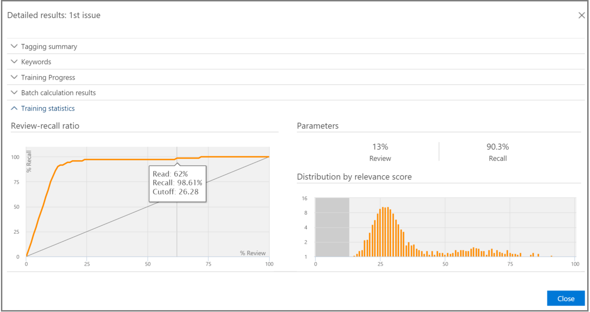

# Acompanhar análises de relevância na Descoberta Eletrônica Avançada do Office 365Track Relevance analysis in Office 365 Advanced eDiscovery

> [!NOTE]
> EDiscovery Avançado requer um Office 365 E3 com o complemento de conformidade avançadas ou uma assinatura E5 para sua organização. Se você não tiver que plano e quiser tentar eDiscovery avançado, você pode [inscrever-se para uma avaliação do Office 365 Enterprise E5](https://go.microsoft.com/fwlink/p/?LinkID=698279).Advanced eDiscovery requires an Office 365 E3 with the Advanced Compliance add-on or an E5 subscription for your organization. If you don't have that plan and want to try Advanced eDiscovery, you can [sign up for a trial of Office 365 Enterprise E5](https://go.microsoft.com/fwlink/p/?LinkID=698279). 
  
No eDiscovery avançada, na guia faixa de relevância exibe a validade calculada do treinamento relevância executada na guia marca e indica a próxima etapa para tirar no processo de treinamento interativas em relevância.In Advanced eDiscovery, the Relevance Track tab displays the calculated validity of the Relevance training performed in the Tag tab and indicates the next step to take in the iterative training process in Relevance. 
  
## Status de treinamento de relevância de rastreamentoTracking Relevance training status

1. Exiba os detalhes a seguir na faixa de relevância para os problemas de maiusculas, conforme mostrado no exemplo a seguir de uma caixa de diálogo **nome do problema** abaixo.View the following details in Relevance Track for the case issues, as shown in the following example of an **Issue name** dialog below. 
    
  - **Avaliação**: este indicador de progresso mostra até que grau a relevância treinamento executadas até esse ponto alcançou a meta de avaliação em termos de margem de erro. O aperfeiçoamento em termos dos resultados de treinamento da relevância também é exibido.**Assessment**: This progress indicator shows to what degree the Relevance training performed to this point has achieved the assessment target in terms of margin of error. The richness of the Relevance training results is also displayed. 
    
  - **Treinamento**: essa tela de dica de ferramenta e indicador de progresso codificada indica o treinamento de relevância de resultados estabilidade e uma escala numérica mostrando o número de amostras de treinamento de relevância marcados para cada questão. Especialista monitora o andamento do processo de treinamento de relevância repetitivo.**Training**: This color-coded progress indicator and tool-tip display indicates the Relevance training results stability and a numeric scale showing the number of Relevance training samples tagged for each issue. The expert monitors the progress of the iterative Relevance training process. 
    
  - **Cálculo de lote**: esse indicador de progresso fornece informações sobre a conclusão de cálculo de lote.**Batch calculation**: This progress indicator provides information about the completion of Batch calculation.
    
  - **Próxima etapa**: exibe a recomendação para a próxima etapa a ser executada.**Next step**: Displays the recommendation for the next step to be performed. 
    
    No exemplo, é mostrada uma avaliação concluída com êxito para um problema, indicado pelo indicador de progresso de cor concluídas e a marca de seleção. Marcação está em andamento, mas o caso ainda é considerado instável (o status de estabilidade também é mostrado em uma dica de ferramenta). A recomendação de etapa próxima é "treinamento".In the example, a successfully completed Assessment for an issue is shown, indicated by the completed color progress indicator and the checkmark. Tagging is underway, but the case is still considered unstable (stability status also shown in a tool-tip). The next step recommendation is "Training". 
    
    
  
    O modo de exibição expandido exibe opções e informações adicionais. A margem de erro atual exibido é a margem de erro de cancelamento de no estado atual da avaliação, recebe os arquivos de avaliação (já marcados) existente.The expanded view displays additional information and options. The displayed current error margin is the error margin of the recall in the current state of assessment, given the existing (already tagged) assessment files.
    
    > [!NOTE]
    >  O estágio de avaliação pode ser desviado desmarcando a caixa de seleção de **avaliação** por problema e, em seguida, para "todos os problemas". No entanto, como resultado, não haverá nenhuma estatísticas para esse problema. > Desmarcar a caixa de seleção **Assessment** só pode ser feito antes de avaliação é executada. Onde várias questões existirem no caso, avaliação é ignorada apenas se a caixa de seleção estiver desmarcada para cada questãoThe Assessment stage can be bypassed by clearing the **Assessment** check box per issue and then for "all issues". However, as a result, there will be no statistics for this issue. > Clearing the **Assessment** check box can only be done before assessment is performed. Where multiple issues exist in a case, assessment is bypassed only if the check box is cleared for each issue 
  
    Quando assessment não for concluído com o exemplo primeiro conjunto de arquivos, avaliação pode ser a próxima etapa para marcação mais arquivos.When assessment is not completed with the first sample set of files, assessment might be the next step for tagging more files. 
    
    Na **relevância** \> **trilha**, o indicador de progresso de treinamento e a dica de ferramenta indicam o número estimado de exemplos adicionais necessárias para alcançar a estabilidade. Essa estimativa fornece uma diretriz para o treinamento adicional necessário.In **Relevance** \> **Track**, the training progress indicator and tool-tip indicate the estimated number of additional samples needed to reach stability. This estimate provides a guideline for the additional training needed.
    
    
  
2. Quando tiver concluído de marcação e se você precisar continuar, treinamento, clique em **treinamento**. Outro conjunto de amostra de arquivos é gerado a partir do arquivo carregado definido para treinamento adicional. Você retorna à guia marca para marcar e treinar mais arquivos.When you're done tagging and if you need to continue training, click **Training**. Another sample set of files is generated from the loaded file set for additional training. You are then returned to the Tag tab to tag and train more files.
    
### Atingir níveis de treinamento estávelReaching stable training levels

Depois que os arquivos de avaliação obtiveram um nível estável de treinamento, eDiscovery Avançado está pronto para cálculo de lote.After the assessment files have attained a stable level of training, Advanced eDiscovery is ready for Batch calculation.
  
> [!NOTE]
> Normalmente, após três estável amostras de treinamento, a próxima etapa é "Cálculo de lote". Pode haver exceções, por exemplo, quando não havia alterações para a marcação dos arquivos de exemplos anteriores ou quando os arquivos de propagação foram adicionados.Usually, after three stable training samples, the next step is "Batch calculation". There may be exceptions, for example, when there were changes to the tagging of files from earlier samples or when seed files were added. 
  
### Executando o cálculo de lotePerforming Batch calculation

Cálculo de lote é executado como a próxima etapa quando treinamento for concluído com êxito (quando um status de treinamento estável é mostrado pela barra de progresso, uma marca de seleção e o status estável na dica de ferramenta.) Cálculo de lote aplica o conhecimento adquirido durante o treinamento de relevância à população todo o arquivo, para avaliar a relevância dos arquivos e atribuir as pontuações de relevância.Batch calculation is executed as the next step after training is successfully completed (when a stable training status is shown by the progress bar, a checkmark and stable status in the tool-tip.) Batch calculation applies the knowledge acquired during the Relevance training to the entire file population, to assess the files' relevance and to assign Relevance scores.
  
Quando houver mais de um problema, cálculo de lote é feito por um problema. Durante o cálculo de lote, progresso é monitorado durante o processamento de todos os arquivos.When there is more than one issue, Batch calculation is done per issue. During Batch calculation, progress is monitored while processing all of the files. 
  
Aqui, a próxima etapa recomendada é "None", que indica que nenhuma treinamento de relevância repetitivo adicional é necessário nesse momento. A próxima fase é o **relevância \> decida** tab.Here, the recommended next step is "None", which indicates that no additional iterative Relevance training is required at this point. The next phase is the **Relevance \> Decide** tab. 
  
Se você deseja importar novos arquivos após o cálculo de lote, o administrador pode adicionar os arquivos importados para uma nova carga.If you want to import new files after Batch calculation, the administrator can add the imported files to a new load.
  
> [!NOTE]
> Se você clicar em **Cancelar** durante o cálculo de lote, o processo salva o que já foi executado. Se você executar novamente o cálculo do lote, o processo continuará partir do último ponto executado.If you click **Cancel** during Batch calculation, the process saves what was already executed. If you run Batch calculation again, the process will continue from the last executed point. 
  
### Avaliando a marcação de consistênciaAssessing tagging consistency

Se houver inconsistências no arquivo de marcação, ele pode afetar a análise. A marcação de processo de consistência de eDiscovery avançada pode ser usada quando os resultados não forem ideais ou consistência está em dúvida. Uma lista dos arquivos de forma inconsistente marcados possíveis é retornada, e pode ser examinados e novamente marcados, conforme necessário.If there are inconsistencies in file tagging, it can affect the analysis. The Advanced eDiscovery tagging consistency process can be used when results are not optimal or consistency is in doubt. A list of possible inconsistently tagged files is returned, and they can be reviewed and re-tagged, as necessary.
  
> [!NOTE]
> Após sete ou mais Arredonda treinamento seguir avaliação, consistência de marcação pode ser exibida em **relevância** \> **Track** \> **problema** \> **resultados detalhados** \> **progresso de treinamento**. Este examinar é feita para um problema ao mesmo tempo.After seven or more training rounds following assessment, tagging consistency can be viewed in **Relevance** \> **Track** \> **Issue** \> **Detailed results** \> **Training progress**. This review is done for one issue at a time. 
  
1. No **relevância \> Track**, expanda linha de um problema.In **Relevance \> Track**, expand an issue's row.
    
2. À direita da **próxima etapa**, clique em **Modificar**.To the right of **Next step**, click **Modify**.
    
3. Selecione **inconsistências de marca** como a opção de **próxima etapa** , após sete exemplos de treinamento e clique **Okey**.Select **Tag inconsistencies** as the **Next step** option, after seven training samples and click **OK**.
    
4. Selecione **inconsistências de marca**. Na guia **marca** abre exibindo uma lista das inconsistências para marcar novamente conforme necessário.Select **Tag inconsistencies**. The **Tag** tab opens displaying a list of the inconsistencies to re-tag as necessary. 
    
5. Clique em **Calcular** para enviar as alterações. A próxima etapa depois de marcar inconsistências é "treinamento".Click **Calculate** to submit the changes. The next step after tagging inconsistencies is "Training". 
    
## Exibindo e usando resultados de relevânciaViewing and using Relevance results

No **relevância \> Track** guia, expanda a linha de um problema e ao lado de **resultados detalhados**, clique em **Exibir**. Os painéis de resultados detalhados são exibidos, conforme mostrado e descrito abaixo.In the **Relevance \> Track** tab, expand an issue's row, and next to **Detailed results**, click **View**. The Detailed results panes are displayed, as shown and described below.
  

  
### Resumo de marcaçãoTagging summary

 No exemplo mostrado abaixo, a **marcação resumida** exibe os totais para cada um dos arquivo os processos de marcação, treinamento e avaliação.In the example shown below, the **Tagging summary** displays totals for each of Assessment, Training, and Catch-up file tagging processes. 
  

  
### Palavras-chaveKeywords

Uma palavra-chave é uma cadeia de caracteres exclusiva, word, frase ou sequência de palavras em um arquivo identificado por eDiscovery avançado, como um indicador de significativo se um arquivo é relevante. As colunas de "Include" listam palavra-chave e espessuras nos arquivos marcados como relevantes e as colunas "Excluir" lista palavras-chave e espessuras nos arquivos marcados como não é relevante.A keyword is a unique string, word, phrase, or sequence of words in a file identified by Advanced eDiscovery as a significant indicator of whether a file is relevant. The "Include" columns list keyword and weights in files tagged as Relevant, and the "Exclude" columns lists keywords and weights in files tagged as Not relevant.
  
EDiscovery avançado atribui valores de peso de negativo ou positivo de palavra-chave. O peso maior, maior a probabilidade de que um arquivo no qual a palavra-chave aparece é atribuído com uma pontuação maior de relevância durante o cálculo de lote.Advanced eDiscovery assigns negative or positive keyword weight values. The higher the weight, the higher the likelihood that a file in which the keyword appears is assigned a higher Relevance score during Batch calculation. 
  
A lista de descoberta eletrônica avançada de palavras-chave pode ser usada para complementar uma lista criada por um especialista ou como uma verificação de integridade indiretas a qualquer momento no arquivo do processo de revisão.The Advanced eDiscovery list of keywords can be used to supplement a list built by an expert or as an indirect sanity check at any point in the file review process.
  
### Progresso do treinamentoTraining progress

Painel de **Progresso de treinamento** inclui um treinamento progresso qualidade e gráfico indicador display, conforme mostrado no exemplo a seguir.The **Training Progress** pane includes a training progress graph and quality indicator display, as shown in the example below. 
  

  
 **Indicador de qualidade de treinamento**: exibe a classificação da marca consistência da seguinte maneira:**Training quality indicator**: Displays the rating of the tagging consistency as follows:
  
- **BOM**: arquivos estão marcados de forma consistente. (Luz verde exibido)**Good**: Files are tagged consistently. (Green light displayed)
    
- **Médio**: alguns arquivos podem ser marcados de forma inconsistente. (Amarelo claro exibido)**Medium**: Some files may be tagged inconsistently. (Yellow light displayed)
    
- **Aviso**: muitos arquivos podem ser marcados de forma inconsistente. (Luz vermelha exibido)**Warning**: Many files may be tagged inconsistently. (Red light displayed)
    
 **Gráfico de progresso de treinamento**: mostra o grau de estabilidade de treinamento de relevância após um número de ciclos de treinamento de relevância em comparação com o valor da medida de F. Como podemos mover da esquerda para a direita pelo gráfico, restringe o intervalo de confiança e é usado, junto com a medida de F, por eDiscovery avançado relevância para determinar a estabilidade quando o treinamento de relevância de resultados otimizados.**Training progress graph**: Shows the degree of Relevance training stability after a number of Relevance training cycles in comparison to the F-measure value. As we move from the left to the right across the graph, the confidence interval narrows and is used, along with the F-measure, by Advanced eDiscovery Relevance to determine stability when the Relevance training results are optimized.
  
> [!NOTE]
> Relevância usa F2, uma métrica de medida de F onde Recall recebe o dobro peso como precisão. Para casos com riqueza alta (mais de 25%), usos de relevância F1 (taxa de 1:1). A taxa de medida de F pode ser configurada na **instalação de relevância** \> **Configurações avançadas**.Relevance uses F2, an F-measure metric where Recall receives twice as much weight as Precision. For cases with high richness (over 25%), Relevance uses F1 (1:1 ratio). The F-measure ratio can be configured in **Relevance setup** \> **Advanced settings**. 
  
### Resultados do cálculo de loteBatch calculation results

Painel de **resultados de cálculo de lote** inclui o número de arquivos que foram marcados para a relevância, da seguinte maneira:The **Batch calculation results** pane includes the number of files that were scored for Relevance, as follows: 
  
- **Êxito****Success**
    
- **Vazio**: não contém texto, por exemplo, somente espaços/guias**Empty**: Contains no text, for example, only spaces/tabs
    
- **Falha**: devido ao tamanho excessivo ou não pôde ser lido**Failed**: Due to excessive size or could not be read
    
- **Ignorado**: devido ao tamanho excessivo**Ignored**: Due to excessive size
    
- **Nebulous**: contém texto insignificante ou nenhuma recursos relevantes para o problema**Nebulous**: Contains meaningless text or no features relevant to the issue
    
> [!NOTE]
> Vazio, falhou, Ignored ou Nebulous receberá uma pontuação de relevância de -1.Empty, Failed, Ignored, or Nebulous will receive a Relevance score of -1. 
  
### Estatísticas de treinamentoTraining statistics

O painel de **estatísticas de treinamento** exibe estatísticas e gráficos com base nos resultados de treinamento de relevância de descoberta eletrônica avançado.The **Training statistics** pane displays statistics and graphs based on results from Advanced eDiscovery Relevance training. 
  

  
Este modo de exibição mostra o seguinte:This view shows the following:
  
- **Taxa de cancelamento de revisão**: pontuações de comparação dos resultados de acordo com a relevância em uma revisão Hipoteticamente linear. Cancelamento é estimado de acordo com o conjunto de tamanho do conjunto de revisão.**Review-recall ratio**: Comparison of results according to Relevance scores in a hypothetically linear review. Recall is estimated given the review set size set.
    
- **Parâmetros**: cumulativa calculado das estatísticas referentes à revisão definida em relação à população arquivo para o caso de inteiro.**Parameters**: Cumulative calculated statistics pertaining to the review set in relation to the file population for the entire case.
    
- **Revise**: porcentagem de arquivos para analisar com base neste corte.**Review**: Percentage of files to review based on this cutoff.
    
- **Cancelar**: arquivos de porcentagem de relevante no conjunto de revisão.**Recall**: Percentage of Relevant files in the review set. 
    
- **Distribuição por pontuação de relevância**: arquivos na exibição cinza escuro para a esquerda estão abaixo a pontuação de fechamento. Uma dica de ferramenta exibe a pontuação de relevância e a porcentagem relacionada de arquivos no arquivo revisão definido em relação aos arquivos total.**Distribution by relevance score**: Files in the dark gray display to the left are below the cutoff score. A tool-tip displays the Relevance score and the related percentage of files in the review file set in relation to the total files.
    
## Confira tambémSee also

[Descoberta Eletrônica Avançada do Office 365Office 365 Advanced eDiscovery](office-365-advanced-ediscovery.md)
  
[Noções básicas sobre avaliação na relevânciaUnderstanding Assessment in Relevance](assessment-in-relevance-in-advanced-ediscovery.md)
  
[Executando e revisão de avaliaçãoPerforming and reviewing Assessment](tagging-and-assessment-in-advanced-ediscovery.md)
  
[Executando o treinamento de relevânciaPerforming Relevance training](tagging-and-relevance-training-in-advanced-ediscovery.md)
  
[Tomar decisões com base nos resultadosMaking decisions based on the results](decision-based-on-the-results-in-advanced-ediscovery.md)
  
[Análise de relevância de testeTesting Relevance analysis](test-relevance-analysis-in-advanced-ediscovery.md)

