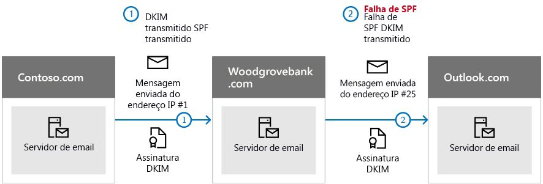

# <a name="use-dkim-to-validate-outbound-email-sent-from-your-custom-domain-in-office-365"></a>Usar DKIM para validar emails enviados de seu domínio personalizado no Office 365

 **Resumo:** este artigo descreve como usar o DomainKeys Identified Mail (DKIM) com o Office 365 para garantir que os sistemas de email de destino confiem em mensagens enviadas de seu domínio personalizado. 
  
Você deve usar o DKIM, além da SPF e do DMARC, para ajudar a evitar que spoofers enviem mensagens que pareçam que são provenientes de seu domínio. O DKIM possibilita adicionar uma assinatura digital a mensagens de email no cabeçalho da mensagem. Parece complicado, mas não é. Quando você configura o DKIM, autoriza seu domínio a associar, ou assinar, o nome dele a uma mensagem de email usando a autenticação de criptografia. Sistemas de email que recebem emails de seu domínio podem usar essa assinatura digital para ajudar a determinar se os emails recebidos são legítimos.
  
Basicamente, você usa uma chave privada para criptografar o cabeçalho no email de saída do seu domínio. Publique uma chave pública nos registros DNS do seu domínio que os servidores de recebimento possam então usar para decodificar a assinatura. Eles usam a chave pública para confirmar que as mensagens realmente vêm de você e não de alguém que está falsificando seu domínio.
  
O Office 365 configura automaticamente o DKIM para domínios iniciais. O domínio inicial é o domínio que o Office 365 criou quando você se inscreveu no serviço, por exemplo, contoso.onmicrosoft.com. Não é preciso fazer nada para configurar o DKIM para o seu domínio inicial. Para saber mais sobre domínios, confira [Perguntas frequentes sobre domínios](https://support.office.com/article/Domains-FAQ-1272bad0-4bd4-4796-8005-67d6fb3afc5a#bkmk_whydoihaveanonmicrosoft.comdomain).
  
Você também pode optar por não fazer nada sobre o DKIM em relação ao seu domínio personalizado. Se você não configurar o DKIM para o seu domínio personalizado, o Office 365 criará um par de chaves privada e pública, habilitará a assinatura do DKIM e configurará a política padrão do Office 365 para o seu domínio personalizado. Embora isso seja abrangente o suficiente para a maioria dos clientes do Office 365, você deve configurar manualmente o DKIM para o seu domínio personalizado nas seguintes circunstâncias:
  
- Você tem mais de um domínio personalizado no Office 365
    
- For configurar o DMARC também (recomendado)
    
- Quiser ter controle sobre sua chave privada
    
- Quiser personalizar seus registros CNAME
    
- Configure as chaves do DKIM para emails provenientes de um domínio de terceiros, por exemplo, se você usar um programa de email em massa terceirizado.
    
Neste artigo:
  
- [Como o DKIM funciona melhor do que o SPF para evitar a falsificação maliciosa no Office 365](use-dkim-to-validate-outbound-email.md#HowDKIMWorks)
    
- [O que você precisa fazer para configurar manualmente o DKIM no Office 365](use-dkim-to-validate-outbound-email.md#SetUpDKIMO365)
    
- [Para configurar o DKIM para mais de um domínio personalizado no Office 365](use-dkim-to-validate-outbound-email.md#DKIMMultiDomain)
    
- [Desabilitar a política de assinatura do DKIM para um domínio personalizado no Office 365](use-dkim-to-validate-outbound-email.md#DisableDKIMSigningPolicy)
    
- [Comportamento padrão para o DKIM e o Office 365](use-dkim-to-validate-outbound-email.md#DefaultDKIMbehavior)
    
- [Configurar o DKIM de forma que um serviço terceirizado possa enviar, ou fazer spoof de, emails em nome de seu domínio personalizado](use-dkim-to-validate-outbound-email.md#SetUp3rdPartyspoof)
    
- [Próximas etapas: depois de configurar o DKIM para o Office 365](use-dkim-to-validate-outbound-email.md#DKIMNextSteps)
    
## <a name="how-dkim-works-better-than-spf-alone-to-prevent-malicious-spoofing-in-office-365"></a>Como o DKIM funciona melhor do que o SPF para evitar a falsificação maliciosa no Office 365
<a name="HowDKIMWorks"> </a>

A SPF adiciona informações a um envelope de mensagem, mas o DKIM realmente criptografa uma assinatura dentro do cabeçalho da mensagem. Ao encaminhar uma mensagem, partes de seu envelope podem ser removidas pelo servidor de encaminhamento. Como a assinatura digital permanece com a mensagem de email porque faz parte do cabeçalho do email, o DKIM funciona mesmo quando uma mensagem é encaminhada conforme mostrado no exemplo a seguir.
  

  
Neste exemplo, se você tivesse apenas publicado um registro TXT SPF do seu domínio, o servidor de email do destinatário poderia ter marcado seu email como spam e gerado um resultado positivo falso. A adição do DKIM neste cenário reduz o resultado positivo falso de spam. Como o DKIM depende de criptografia de chave pública para autenticar, e não apenas de endereços IP, é considerado uma forma muito mais forte de autenticação que o SPF. Recomendamos usar o SPF e o DKIM, bem como o DMARC, em sua implantação.
  
Detalhes fundamentais: o DKIM usa uma chave privada para inserir uma assinatura criptografada nos cabeçalhos das mensagens. A domínio que assina, ou domínio de saída, é inserido como o valor do campo **d=** no cabeçalho. O domínio que verifica, ou domínio do destinatário, usa esse campo **d=** para procurar a chave pública no DNS e autenticar a mensagem. Se a mensagem for verificada, passa na verificação do DKIM. 
  
## <a name="what-you-need-to-do-to-manually-set-up-dkim-in-office-365"></a>O que você precisa fazer para configurar manualmente o DKIM no Office 365
<a name="SetUpDKIMO365"> </a>

Para configurar o DKIM, execute estas etapas:
  
- [Publicar dois registros CNAME para o seu domínio personalizado no DNS](use-dkim-to-validate-outbound-email.md#Publish2CNAME)
    
- [Habilitar a assinatura DKIM para o seu domínio personalizado no Office 365](use-dkim-to-validate-outbound-email.md#EnableDKIMinO365)
    
### <a name="publish-two-cname-records-for-your-custom-domain-in-dns"></a>Publicar dois registros CNAME para o seu domínio personalizado no DNS
<a name="Publish2CNAME"> </a>

Para cada domínio para o qual você deseja adicionar uma assinatura de DKIM no DNS, é preciso publicar dois registros CNAME. Um registro CNAME é usado pelo DNS para especificar que o nome canônico de um domínio é um alias para outro nome de domínio. 
  
 O Office 365 executa a rotação de chaves automática usando os dois registros estabelecidos. Se você provisionou domínios personalizados em adição ao domínio inicial no Office 365, deve publicar dois registros CNAME para cada domínio adicional. Portanto, se você tem dois domínios, deve publicar dois registros CNAME adicionais e assim por diante. 
  
Use o seguinte formato para os registros CNAME:
  
```
Host name:          selector1._domainkey.<domain>
Points to address or value: selector1-<domainGUID>._domainkey.<initialDomain> 
TTL:                3600
Host name:          selector2._domainkey.<domain>
Points to address or value: selector2-<domainGUID>._domainkey.<initialDomain> 
TTL:                3600

```

Em que:
  
-  Para o Office 365, os seletores sempre serão "seletor1" ou "seletor2". 
    
-  O  _domainGUID_ é igual ao  _domainGUID_ no registro MX personalizado para o seu domínio personalizado, que aparece antes de mail.protection.outlook.com. Por exemplo, no seguinte registro MX para o domínio contoso.com, o  _domainGUID_ é contoso-com: 
    
  ```
  contoso.com.  3600  IN  MX   5 contoso-com.mail.protection.outlook.com
  ```

-  _initialDomain_ é o domínio que você usou quando se inscreveu no Office 365. Para saber mais sobre como determinar seu domínio inicial, confira [Perguntas frequentes sobre domínios](https://support.office.com/article/Domains-FAQ-1272bad0-4bd4-4796-8005-67d6fb3afc5a#bkmk_whydoihaveanonmicrosoft.comdomain).
    
Por exemplo, se você tiver o domínio inicial cohovineyardandwinery.onmicrosoft.com e dois domínios personalizados, cohovineyard.com e cohowinery.com, precisará configurar dois registros CNAME para cada domínio adicional, totalizando quatro registros CNAME.
  
```
Host name:          selector1._domainkey.cohovineyard.com  
Points to address or value: selector1-cohovineyard-com._domainkey.cohovineyardandwinery.onmicrosoft.com
TTL:                3600
Host name:          selector2._domainkey.cohovineyard.com  
Points to address or value: selector2-cohovineyard-com._domainkey.cohovineyardandwinery.onmicrosoft.com
TTL:                3600
Host name:          selector1._domainkey.cohowinery.com
Points to address or value: selector1-cohowinery-com._domainkey.cohovineyardandwinery.onmicrosoft.com 
TTL:                3600
 
Host name:          selector2._domainkey.cohowinery.com
Points to address or value: selector2-cohowinery-com._domainkey.cohovineyardandwinery.onmicrosoft.com 
TTL:                3600
```

### <a name="enable-dkim-signing-for-your-custom-domain-in-office-365"></a>Habilitar a assinatura DKIM para o seu domínio personalizado no Office 365
<a name="EnableDKIMinO365"> </a>

Depois de publicar os registros CNAME no DNS, você estará pronto para habilitar a assinatura DKIM pelo Office 365. Para tanto, use o Centro de administração do Office 365 ou o PowerShell.
  
#### <a name="to-enable-dkim-signing-for-your-custom-domain-through-the-office-365-admin-center"></a>Para habilitar a assinatura DKIM para o seu domínio personalizado por meio do Centro de administração do Office 365

1. [Entre no Office 365](https://support.office.microsoft.com/article/Sign-in-to-Office-365-e9eb7d51-5430-4929-91ab-6157c5a050b4) com sua conta corporativa ou de estudante. 
    
2. Selecione o ícone do inicializador de aplicativos no canto superior esquerdo e escolha **Administrador**.
    
3. No painel de navegação inferior à esquerda, expanda **Administrador** e escolha **Exchange**.
    
4. Vá para **Proteção** \> **DKIM**.
    
5. Selecione o domínio para o qual você deseja habilitar o DKIM e, para **Assinar mensagens deste domínio com assinaturas DKIM**, escolha **Habilitar**. Repita essa etapa para cada domínio personalizado.
    
#### <a name="to-enable-dkim-signing-for-your-custom-domain-by-using-powershell"></a>Para habilitar a assinatura DKIM para o seu domínio personalizado usando o PowerShell

1. [Conecte-se ao Exchange Online usando o PowerShell remoto](https://technet.microsoft.com/library/jj984289%28v=exchg.160%29.aspx).
    
2. Execute o seguinte cmdlet:
    
  ```
  New-DkimSigningConfig -DomainName <domain> -Enabled $true
  ```

    Em que  _domain_ é o nome do domínio personalizado para o qual você deseja habilitar a assinatura DKIM. 
    
    Por exemplo, para o domínio contoso.com:
    
  ```
  New-DkimSigningConfig -DomainName contoso.com -Enabled $true
  ```

#### <a name="to-confirm-dkim-signing-is-configured-properly-for-office-365"></a>Para confirmar que a assinatura de DKIM está configurada adequadamente para o Office 365

Aguarde alguns minutos antes de prosseguir com essas etapas para confirmar que você configurou o DKIM corretamente. Isso permite que as informações do DKIM sobre o domínio sejam distribuídas por toda a rede.
  
- Envie uma mensagem de uma conta do seu domínio do Office 365 habilitado com DKIM para outra conta de email, como outlook.com ou Hotmail.com.
    
- Não use uma conta aol.com para fins de teste. A AOL pode ignorar a verificação de DKIM se a verificação de SPF passar. Isso anula o teste.
    
- Abra a mensagem e examine o cabeçalho. Instruções para exibir o cabeçalho da mensagem variam dependendo do seu cliente de mensagens. Para instruções sobre como visualizar cabeçalhos de mensagens no Outlook, confira [Visualizar cabeçalhos de mensagens de email](https://support.office.com/article/CD039382-DC6E-4264-AC74-C048563D212C).
    
     A mensagem assinada com DKIM conterá o nome do host e o domínio definidos quando você publicou as entradas CNAME. A mensagem terá uma aparência similar à do exemplo: 
    
  ```
  From: Example User <example@contoso.com> 
  DKIM-Signature: v=1; a=rsa-sha256; q=dns/txt; c=relaxed/relaxed; 
      s=selector1; d=contoso.com; t=1429912795; 
      h=From:To:Message-ID:Subject:MIME-Version:Content-Type; 
      bh=<body hash>; 
      b=<signed field>;
  
  ```

- Procure pelo cabeçalho Authentication-Results. Embora cada serviço receptor use um formato ligeiramente diferente para carimbar as mensagens recebidas, o resultado deve incluir algo parecido com **DKIM=pass** ou **DKIM=OK**. 
    
## <a name="to-configure-dkim-for-more-than-one-custom-domain-in-office-365"></a>Para configurar o DKIM para mais de um domínio personalizado no Office 365
<a name="DKIMMultiDomain"> </a>

Se em algum momento no futuro você decidir adicionar outro domínio personalizado e quiser habilitar o DKIM para o novo domínio, deve executar as etapas deste artigo para cada domínio. Especificamente, execute todas as etapas em [O que você precisa fazer para configurar manualmente o DKIM no Office 365](use-dkim-to-validate-outbound-email.md#SetUpDKIMO365).
  
## <a name="disabling-the-dkim-signing-policy-for-a-custom-domain-in-office-365"></a>Desabilitar a política de assinatura do DKIM para um domínio personalizado no Office 365
<a name="DisableDKIMSigningPolicy"> </a>

Desabilitar a política de assinatura não desabilita completamente o DKIM. Após um período de tempo, o Office 365 aplicará automaticamente a política padrão do Office 365 ao seu domínio. Para saber mais, confira [Comportamento padrão para o DKIM e o Office 365](use-dkim-to-validate-outbound-email.md#DefaultDKIMbehavior).
  
### <a name="to-disable-the-dkim-signing-policy-by-using-windows-powershell"></a>Para desabilitar a política de assinatura do DKIM usando o Windows PowerShell

1. [Conecte-se ao Exchange Online usando o PowerShell remoto](https://technet.microsoft.com/library/jj984289%28v=exchg.160%29.aspx).
    
2. Execute um dos seguintes comandos para cada domínio para o qual você deseja desabilitar a assinatura de DKIM.
    
  ```
  $p=Get-DkimSigningConfig -identity <domain>
  $p[0] | set-DkimSigningConfig -enabled $false
  
  ```

    Por exemplo:
    
  ```
  $p=Get-DkimSigningConfig -identity contoso.com
  $p[0] | set-DkimSigningConfig -enabled $false
  ```

    Ou
    
  ```
  Set-DkimSigningConfig -identity $p[<number>].identity -enabled $false
  
  ```

    Em que  _number_ é o índice da política. Por exemplo: 
    
  ```
  Set-DkimSigningConfig -identity $p[0].identity -enabled $false
  ```

## <a name="default-behavior-for-dkim-and-office-365"></a>Comportamento padrão para o DKIM e o Office 365
<a name="DefaultDKIMbehavior"> </a>

Se você não habilitar o DKIM, o Office 365 criará automaticamente uma chave pública DKIM de 1.024 bits para seu domínio personalizado e a chave privada associada que é armazenada internamente em nosso data center. Por padrão, o Office 365 usa uma configuração de assinatura padrão para domínios que não têm uma política aplicada. Isso significa que se você não configurar o DKIM por conta própria, o Office 365 usará a política e as chaves padrão que ele criar para habilitar o DKIM para o seu domínio.
  
Além disso, se você desabilitar a assinatura DKIM após ativá-la, depois de um período de tempo o Office 365 aplicará automaticamente a política padrão do Office 365 para o seu domínio.
  
No exemplo a seguir, suponha que o DKIM de fabrikam.com foi habilitado pelo Office 365, não pelo administrador do domínio. Isso significa que os CNAMEs necessários não existem no DNS. Assinaturas DKIM para email deste domínio terão uma aparência similar a esta:
  
```
From: Second Example <second.example@fabrikam.com> 
DKIM-Signature: v=1; a=rsa-sha256; q=dns/txt; c=relaxed/relaxed; 
    s=selector1-fabrikam-com; d=contoso.onmicrosoft.com; t=1429912795; 
    h=From:To:Message-ID:Subject:MIME-Version:Content-Type; 
    bh=<body hash>; 
    b=<signed field>;

```

Neste exemplo, o nome de host e o domínio contêm os valores para os quais o CNAME apontaria se a assinatura de DKIM para fabrikam.com tivesse sido ativada pelo administrador do domínio. Eventualmente, cada mensagem enviada do Office 365 será assinada com DKIM. Se você mesmo habilitar o DKIM, o domínio será o mesmo que o do campo de endereço De:, neste caso fabrikam.com. Caso contrário, os domínios não corresponderão entre si e, em vez disso, será usado o domínio inicial da sua organização. Para saber mais sobre como determinar seu domínio inicial, confira [Perguntas frequentes sobre domínios](https://support.office.com/article/Domains-FAQ-1272bad0-4bd4-4796-8005-67d6fb3afc5a#bkmk_whydoihaveanonmicrosoft.comdomain).
  
## <a name="set-up-dkim-so-that-a-third-party-service-can-send-or-spoof-email-on-behalf-of-your-custom-domain"></a>Configurar o DKIM de forma que um serviço terceirizado possa enviar, ou fazer spoof de, emails em nome de seu domínio personalizado
<a name="SetUp3rdPartyspoof"> </a>

Alguns provedores de serviço de email em massa, ou provedores de software como serviço, permitem que você configure as chaves DKIM para o email originado de seu serviço. Isso exige a coordenação entre sua empresa e a empresa terceirizada para configurar os registros DNS necessários. Não há duas organizações que fazem isso exatamente da mesma maneira. Em vez disso, o processo depende totalmente da organização.
  
Um exemplo de mensagem mostrando um DKIM configurado adequadamente para contoso.com e bulkemailprovider.com pode parecer com este:
  
```
Return-Path: <communication@bulkemailprovider.com>
 From: <sender@contoso.com>
 DKIM-Signature: s=s1024; d=contoso.com
 Subject: Here is a message from Bulk Email Provider's infrastructure, but with a DKIM signature authorized by contoso.com
```

Neste exemplo, para obter este resultado:
  
1. O provedor de email em massa deu à Contoso uma chave pública de DKIM.
    
2. A Contoso publicou a chave de DKIM em seu registro DNS.
    
3. Ao enviar emails, o Provedor de Email em Massa assina a chave com a chave privada correspondente. Ao fazer isso, o Provedor de Email em Massa anexa a assinatura DKIM ao cabeçalho da mensagem.
    
4. Sistemas de recebimento de email executam uma verificação de DKIM autenticando o valor DKIM-Signature d=\<domínio\> em relação ao domínio no campo de endereço From: (5322.From) da mensagem. Neste exemplo, os valores são correspondentes:
    
    remetente@ **contoso.com**
    
    d= **contoso.com**
    
## <a name="next-steps-after-you-set-up-dkim-for-office-365"></a>Próximas etapas: depois de configurar o DKIM para o Office 365
<a name="DKIMNextSteps"> </a>

Embora DKIM foi projetado para ajudar a impedir falsificação, DKIM funciona melhor com SPF e DMARC. Depois que você definiu DKIM, se você já não tiver configurado a SPF deve fazê-lo. Para obter uma introdução rápida SPF e instalá-la configurado rapidamente, consulte [Configurar SPF no Office 365 para ajudar a impedir a falsificação](set-up-spf-in-office-365-to-help-prevent-spoofing.md). Para ter uma compreensão mais detalhada de como o Office 365 usa SPF ou para implantações não-padrão ou de solução de problemas, por exemplo, híbrida, inicie com [como o Office 365 usa Framework de política do remetente (SPF) para evitar a falsificação](how-office-365-uses-spf-to-prevent-spoofing.md). Em seguida, consulte [DMARC de uso para validar emails no Office 365](use-dmarc-to-validate-email.md). [Cabeçalhos de mensagem antispam](anti-spam-message-headers.md) inclui os campos de sintaxes e de cabeçalho usados pelo Office 365 para verificações de verificação. 
  

