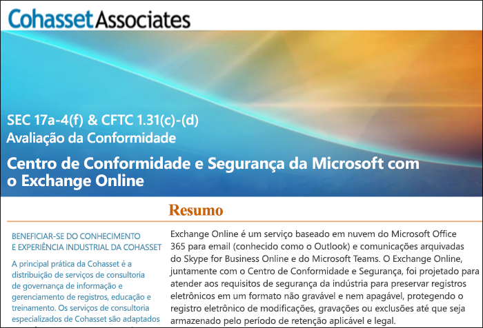

# Usar o Exchange Online e o Centro de Conformidade e Segurança para atender à norma 17a-4 da SECUse Exchange Online and the Security & Compliance Center to comply with SEC Rule 17a-4

Caso a organização precise atender aos padrões regulamentares para retenção de dados, o Centro de Conformidade e Segurança do Office 365 fornece recursos para gerenciar o ciclo de vida dos dados no Exchange Online. Isso inclui a capacidade de reter, auditar, pesquisar e exportar os dados. Essas funcionalidades são adequadas para atender às necessidades da maioria das organizações.If your organization needs to comply with regulatory standards for retaining your data, the Office 365 Security & Compliance Center provides features to manage the lifecycle of your data in Exchange Online. This includes the ability to retain, audit, search, and export your data. These capabilities are sufficient to meet the needs of most organizations.

No entanto, algumas organizações em setores altamente regulamentados estão sujeitas a requisitos regulamentares mais rigorosos. Por exemplo, instituições financeiras, como bancos ou corretoras, estão sujeitas à norma 17a-4 estabelecida pela SEC (Comissão de Títulos e Câmbio dos Estados Unidos). A norma 17a-4 tem requisitos específicos para armazenamento de dados eletrônicos, inclusive vários aspectos do gerenciamento de registros, como duração, formato, qualidade, disponibilidade e responsabilidade da retenção de registros.However, some organizations in highly regulated industries are subject to more stringent regulatory requirements. For example, financial institutions such as banks or broker dealers are subject to Rule 17a-4 issued by the Securities and Exchange Commission (SEC). Rule 17a-4 has specific requirements for electronic data storage, including many aspects of record management, such as the duration, format, quality, availability, and accountability of records retention.

Para ajudar essas organizações a entender melhor como aproveitar o Centro de Conformidade e Segurança para atender às obrigações regulamentares do Exchange Online, especificamente em relação aos requisitos da norma 17a-4, lançamos uma avaliação em parceria com a Cohasset Associates.To help these organizations better understand how the Security & Compliance Center can be leveraged to meet their regulatory obligations for Exchange Online, specifically in relation to Rule 17a-4 requirements, we have released an assessment in partnership with Cohasset Associates.

A Cohasset Associates comprovou que, quando o Exchange Online e o Centro de Conformidade e Segurança são configurados conforme recomendado, eles atendem aos requisitos de armazenamento relevantes das normas 1.31(c)-(d) da CFTC, 4511 da FINRA e 17a-4 da SEC. Visamos esse conjunto de normas porque elas representam a orientação mais normativa globalmente para retenção de registros por instituições financeiras.Cohasset validated that when Exchange Online and the Security & Compliance Center are configured as recommended, they meet the relevant storage requirements of CFTC Rule 1.31(c)-(d), FINRA Rule 4511, and SEC Rule 17a-4.  We targeted this set of rules because they represent the most prescriptive guidance globally for records retention for financial institutions.

## Baixar a avaliação da CohassetDownload the Cohasset assessment

[Baixe a avaliação da Cohasset aqui](https://servicetrust.microsoft.com/ViewPage/TrustDocuments?command=Download&downloadType=Document&downloadId=9fa8349d-a0c9-47d9-93ad-472aa0fa44ec&docTab=6d000410-c9e9-11e7-9a91-892aae8839ad_FAQ_and_White_Papers).You can [download the Cohasset assessment here](https://servicetrust.microsoft.com/ViewPage/TrustDocuments?command=Download&downloadType=Document&downloadId=9fa8349d-a0c9-47d9-93ad-472aa0fa44ec&docTab=6d000410-c9e9-11e7-9a91-892aae8839ad_FAQ_and_White_Papers).

## Esta avaliação foi feita especificamente para o Exchange OnlineThis assessment is specific to Exchange Online

Observe que esta foi feita especificamente para o Exchange Online. Ela não inclui outros serviços do Office 365, como SharePoint Online ou OneDrive for Business. No entanto, estamos planejando o suporte para esses serviços visando atender à norma 17a-4 da SEC.Note that this assessment is specific to Exchange Online. The assessment does not include other Office 365 services such as SharePoint Online or OneDrive for Business, although we are planning support for those services with respect to SEC 17a-4 in the future.

É importante entender que o Skype for Business e o Teams também armazenam dados no Exchange Online. Portanto, a avaliação abrange as mensagens do Skype for Business, bem como as mensagens de canal e chat do Teams.It’s important to understand that Skype for Business and Teams also store data in Exchange Online.  Therefore, the assessment does cover messages from Skype for Business and channel and chat messages from Teams.

## O uso do Bloqueio de Preservação é fundamental para a configuração recomendadaUsing Preservation Lock is key to the recommended configuration

Os setores altamente regulamentados são sempre obrigados a armazenar comunicações eletrônicas para atender ao requisito de WORM (gravar uma vez, ler muitas). Este requisito estabelece uma solução de armazenamento na qual um registro deve ser:Highly regulated industries are often required to store electronic communications to meet the WORM (write once, read many) requirement. The WORM requirement dictates a storage solution in which a record must be:

- Retido por um período de retenção obrigatório, que não pode ser reduzido, mas apenas aumentado.Retained for a required retention period that cannot be shortened, only increased.
- Imutável, o que significa que não é possível substituir, apagar ou alterar o registro durante o período de retenção obrigatório.Immutable, meaning that the record cannot be overwritten, erased, or altered during the required retention period.

No Exchange Online, quando uma [política de retenção](retention-policies.md) é aplicada à caixa de correio do usuário, todo o conteúdo do usuário será retido com base nos critérios da política. Na verdade, se um usuário tentar excluir ou modificar um email, o programa manterá uma cópia do email em um local seguro e oculto na caixa de correio do usuário, antes que a alteração seja feita. As políticas de retenção podem garantir que uma organização retenha as comunicações eletrônicas, embora essas políticas sejam passíveis de modificação.In Exchange Online, when a [retention policy](retention-policies.md) is applied to a user's mailbox, all of the user's content will be retained based on the criteria of the policy. In fact, if a user attempts to delete or modify an email, a copy of the email before the change is made will be preserved in a secure, hidden location in the user's mailbox. Retention polices can ensure that an organization retains electronic communications, but those policies can be modified.

Ao aplicar o Bloqueio de Preservação em uma política de retenção, a empresa garante que a política não seja modificada. De fato, após aplicar o Bloqueio de Preservação a uma política de retenção, as seguintes ações serão restritas:By placing a Preservation Lock on a retention policy, an organization ensures that the policy cannot be modified. In fact, after a Preservation Lock is applied to a retention policy, the following actions are restricted:

- O período de retenção da política pode apenas ser aumentado, mas não reduzido.The retention period of the policy can only be increased, not shortened.
- É possível adicionar usuários à política, mas não é possível removê-los.Users can be added to the policy, but no user can be removed.
- A política de retenção não pode ser excluída por um administrador.The retention policy cannot be deleted by an administrator.

O Bloqueio de Preservação pode ajudar na conformidade com os requisitos regulamentares da norma 17a-4 da SEC.Preservation Lock can help you meet the SEC 17a-4 regulatory requirements.

## Como configurar o Bloqueio de PreservaçãoHow to set up Preservation Lock

É possível bloquear uma política de retenção usando o PowerShell. Para saber mais, confira [Como bloquear uma política de retenção](retention-policies.md#locking-a-retention-policy).You can lock a retention policy by using PowerShell. For more information, see [Locking a retention policy](retention-policies.md#locking-a-retention-policy).

## Limitações conhecidasKnown limitations

Estamos cientes de algumas limitações do Exchange Online. Por isso, estamos trabalhando ativamente para resolvê-las e esperamos lançar o suporte para os seguintes cenários, em julho de 2019:We’re aware of a few limitations in Exchange Online. We’re actively working on these and expect to release support for these scenarios in July 2019:

- A auditoria em nível de item não está disponível para caixas de correio de Grupo do Office 365.Item-level auditing is not available in Office 365 Group mailboxes.
- As comunicações encadeadas não estão disponíveis para mensagens de canal e chat do Teams.Threaded communications are not available for Teams chat and channel messages.
- As curtidas não são retidas para mensagens de canal e chat do Teams.Likes are not retained for Teams chat and channel messages.
