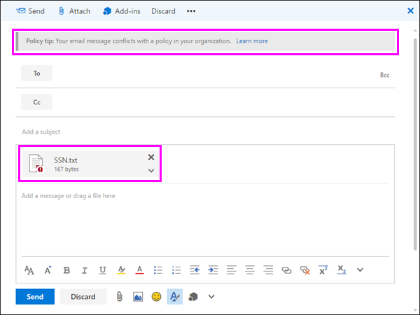

# Enviar notificações por email e mostrar dicas de política para políticas de DLPSend email notifications and show policy tips for DLP policies

Você pode usar uma política de prevenção contra perda de dados (DLP) para identificar, monitorar e proteger informações confidenciais no Office 365.You can use a data loss prevention (DLP) policy to identify, monitor, and protect sensitive information across Office 365. Você deseja que as pessoas em sua organização que trabalhem com essas informações confidenciais permaneçam em conformidade com suas políticas de DLP, mas não convém bloqueá-las desnecessariamente da realização de seus trabalhos.You want people in your organization who work with this sensitive information to stay compliant with your DLP policies, but you don't want to block them unnecessarily from getting their work done. É aí que as notificações por email e as dicas de política podem ajudar.This is where email notifications and policy tips can help.
  

  
Uma dica de política é uma notificação ou um aviso que aparece quando alguém está trabalhando com conteúdo que está em conflito com uma política de DLP — por exemplo, conteúdo como uma pasta de trabalho do Excel em um site do OneDrive for Business que contém informações de identificação pessoal (PII) e é compartilhado com um usuário externo.A policy tip is a notification or warning that appears when someone is working with content that conflicts with a DLP policy—for example, content like an Excel workbook on a OneDrive for Business site that contains personally identifiable information (PII) and is shared with an external user.
  
Você pode usar notificações por email e dicas de política para aumentar a conscientização e ajudar a ensinar as pessoas sobre as políticas da sua organização.You can use email notifications and policy tips to increase awareness and help educate people about your organization's policies. Você também pode conceder às pessoas a opção de substituir a política, para que elas não sejam bloqueadas se tiverem uma necessidade comercial válida ou se a política estiver detectando um falso positivo.You can also give people the option to override the policy, so that they're not blocked if they have a valid business need or if the policy is detecting a false positive.
  
No centro de conformidade de &amp; segurança do Office 365, ao criar uma política de DLP, você pode configurar as notificações de usuário para:In the Office 365 Security &amp; Compliance Center, when you create a DLP policy, you can configure the user notifications to:
  
- Envie uma notificação por email para as pessoas que você escolher que descrevem o problema.Send an email notification to the people you choose that describes the issue.
    
- Exibir uma dica de política para o conteúdo que está em conflito com a política de DLP:Display a policy tip for content that conflicts with the DLP policy:
    
  - Para email no Outlook na Web e no Outlook 2013 e posterior, a dica de política aparece na parte superior de uma mensagem acima dos destinatários enquanto a mensagem está sendo redigida.For email in Outlook on the web and Outlook 2013 and later, the policy tip appears at the top of a message above the recipients while the message is being composed.
    
  - Para documentos em uma conta do OneDrive for Business ou site do SharePoint Online, a dica de política é indicada por um ícone de aviso que aparece no item.For documents in a OneDrive for Business account or SharePoint Online site, the policy tip is indicated by a warning icon that appears on the item. Para exibir mais informações, você pode selecionar um item e, em \*\*\*\* ícone painel de informações de informações no canto superior direito da página para abrir o painel de detalhes.To view more information, you can select an item and then choose **Information** in the upper-right corner of the page to open the details pane. 
    
  - Para documentos do Excel 2016, PowerPoint 2016 e Word 2016 que são armazenados em um site do OneDrive for Business ou site do SharePoint Online incluído na política de DLP, a dica de política é exibida na barra de mensagens e no modo de exibição Backstage (menu **arquivo** \> \*\* Informações\*\*).For Excel 2016, PowerPoint 2016, and Word 2016 documents that are stored on a OneDrive for Business site or SharePoint Online site that's included in the DLP policy, the policy tip appears on the Message Bar and the Backstage view ( **File** menu \> **Info**).
    
## Adicionar notificações de usuário a uma política de DLPAdd user notifications to a DLP policy

Quando você cria uma política de DLP, as notificações por email e as dicas de política fazem parte da seção **notificações do usuário** .When you create a DLP policy, both email notifications and policy tips are part of the **User notifications** section. 
  
1. Acesse [https://protection.office.com](https://protection.office.com).Go to [https://protection.office.com](https://protection.office.com).
    
2. Entre no Office 365 usando a sua conta corporativa ou de estudante.Sign in to Office 365 using your work or school account. Agora você está no centro de conformidade com &amp; segurança do Office 365.You're now in the Office 365 Security &amp; Compliance Center.
    
3. Na navegação \> à &amp; esquerda centro \> de conformidade de segurança \> **política** \> de **prevenção contra perda de dados** **+ criar uma política**.In the Security &amp; Compliance Center \> left navigation \> **Data loss prevention** \> **Policy** \> **+ Create a policy**.
    
    
  
4. Escolha o modelo de política de DLP que protege os tipos de informações confidenciais que \> você precisa **seguir**.Choose the DLP policy template that protects the types of sensitive information that you need \> **Next**.
    
    Para começar com um modelo vazio, escolha \*\*\*\* \> **política** \> personalizada personalizada **próxima**.To start with an empty template, choose **Custom** \> **Custom policy** \> **Next**.
    
5. Nomeie a política \> **em seguida**.Name the policy \> **Next**.
    
6. Para escolher os locais que você deseja que a política de DLP proteja, siga um destes procedimentos:To choose the locations that you want the DLP policy to protect, do one of the following:
    
  - escolha **todos os locais no Office 365** \> **em seguida**.Choose **All locations in Office 365** \> **Next**.
    
  - Escolha **deixe-me escolher locais** \> específicos **em seguida**.Choose **Let me choose specific locations** \> **Next**.
    
    Para incluir ou excluir um local inteiro, como todos os emails do Exchange ou todas as contas do OneDrive, altere ou desative o **status** desse local.To include or exclude an entire location such as all Exchange email or all OneDrive accounts, switch the **Status** of that location on or off. 
    
    Para incluir apenas sites específicos do SharePoint ou contas do OneDrive, altere o **status** para ativado e clique nos links em **incluir** para escolher sites ou contas específicos.To include only specific SharePoint sites or OneDrive accounts, switch the **Status** to on, and then click the links under **Include** to choose specific sites or accounts. 
    
7. Escolha **usar configurações** \> avançadas **próximo**.Choose **Use advanced settings** \> **Next**.
    
8. Escolha **+ nova regra**.Choose **+ New rule**.
    
9. No editor de regras, em **notificações do usuário**, altere o status para.In the rule editor, under **User notifications**, switch the status on.
    
    
  
## Opções para a configuração de notificações por emailOptions for configuring email notifications

Para cada regra de uma política de DLP, você pode:For each rule in a DLP policy, you can:
  
- Enviar a notificação para as pessoas que você escolher. Essas pessoas podem incluir o proprietário do conteúdo, a pessoa que modificou o conteúdo pela última vez, o proprietário do site em que o conteúdo está armazenado ou um usuário específico.Send the notification to the people you choose. These people can include the owner of the content, the person who last modified the content, the owner of the site where the content is stored, or a specific user.
    
- Personalizar o texto que está incluído na notificação usando HTML ou tokens.Customize the text that's included in the notification by using HTML or tokens. ConFira a seção abaixo para obter mais informações.See the section below for more information.
    
> [!NOTE]
>  As notificações por email podem ser enviadas somente para destinatários individuais, não grupos ou listas de distribuição.Email notifications can be sent only to individual recipients—not groups or distribution lists. Apenas o novo conteúdo disparará uma notificação por email.Only new content will trigger an email notification. Editar o conteúdo existente disparará dicas de política, mas não uma notificação por email.Editing existing content will trigger policy tips but not an email notification. 
  

  
### Notificação de email padrãoDefault email notification

As notificações têm uma linha de assunto que começa com a ação executada, como "notificação", "mensagem bloqueada" para email ou "acesso bloqueado" para documentos.Notifications have a Subject line that begins with the action taken, such as "Notification", "Message Blocked" for email, or "Access Blocked" for documents. Se a notificação for sobre um documento, o corpo da mensagem de notificação inclui um link que o leva para o site em que o documento está armazenado e abre a dica de política para o documento, onde você pode resolver problemas (consulte a seção abaixo sobre dicas de política).If the notification is about a document, the notification message body includes a link that takes you to the site where the document's stored and opens the policy tip for the document, where you can resolve any issues (see the section below about policy tips). Se a notificação é sobre uma mensagem, a notificação inclui como um anexo a mensagem que corresponde a uma política de DLP.If the notification is about a message, the notification includes as an attachment the message that matches a DLP policy.
  

  
Por padrão, as notificações exibem um texto semelhante ao seguinte para um item em um site. O texto de notificação é configurado separadamente para cada regra, para que o texto exibido seja diferente dependendo da regra que for correspondida.By default, notifications display text similar to the following for an item on a site. The notification text is configured separately for each rule, so the text that's displayed differs depending on which rule is matched.

|**Se a regra de política de DLP fizer isso...****If the DLP policy rule does this…**|**Em seguida, a notificação padrão para documentos do SharePoint ou do OneDrive for Business diz isso...****Then the default notification for SharePoint or OneDrive for Business documents says this…**|**Em seguida, a notificação padrão para mensagens do Outlook diz isso...****Then the default notification for Outlook messages says this…**|
|:-----|:-----|:-----|
|Envia uma notificação, mas não permite substituiçãoSends a notification but doesn't allow override    |Este item está em conflito com uma política de sua organização.This item conflicts with a policy in your organization.    |Sua mensagem de email está em conflito com uma política da sua organização.Your email message conflicts with a policy in your organization.    |
|Bloqueia o acesso, envia uma notificação e permite a substituiçãoBlocks access, sends a notification, and allows override    |Este item está em conflito com uma política de sua organização.This item conflicts with a policy in your organization. Se você não resolver esse conflito, o acesso a esse arquivo poderá ser bloqueado.If you don't resolve this conflict, access to this file might be blocked.    |Sua mensagem de email está em conflito com uma política da sua organização.Your email message conflicts with a policy in your organization. A mensagem não foi entregue a todos os destinatários.The message wasn't delivered to all recipients.    |
|Bloqueia o acesso e envia uma notificaçãoBlocks access and sends a notification    |Este item está em conflito com uma política de sua organização. O acesso a este item está bloqueado para todos, exceto seu proprietário, o último modificador e o administrador de conjunto de site principal.This item conflicts with a policy in your organization. Access to this item is blocked for everyone except its owner, last modifier, and the primary site collection administrator.    |Sua mensagem de email está em conflito com uma política da sua organização.Your email message conflicts with a policy in your organization. A mensagem não foi entregue a todos os destinatários.The message wasn't delivered to all recipients.    |
   
### Notificação de email personalizadaCustom email notification

Você pode criar uma notificação de email personalizada em vez de enviar a notificação de email padrão aos usuários finais ou administradores.You can create a custom email notification instead of sending the default email notification to your end users or admins. A notificação de email personalizada oferece suporte a HTML e tem um limite de 5.000 caracteres.The custom email notification supports HTML and has a 5,000-character limit. Você pode usar HTML para incluir imagens, formatação e outras marcações na notificação.You can use HTML to include images, formatting, and other branding in the notification.
  
Você também pode usar os tokens a seguir para ajudar a personalizar a notificação por email.You can also use the following tokens to help customize the email notification. Esses tokens são variáveis que são substituídas por informações específicas na notificação que é enviada.These tokens are variables that are replaced by specific information in the notification that's sent.

|**Geração****Token**|**Descrição****Description**|
|:-----|:-----|
|%% AppliedActions%%%%AppliedActions%%    |As ações aplicadas ao conteúdo.The actions applied to the content.    |
|%% ContentURL%%%%ContentURL%%    |A URL do documento no site do SharePoint Online ou do OneDrive for Business.The URL of the document on the SharePoint Online site or OneDrive for Business site.    |
|%% MatchedConditions%%%%MatchedConditions%%    |As condições que foram atendidas pelo conteúdo.The conditions that were matched by the content. Use este token para informar pessoas de possíveis problemas com o conteúdo.Use this token to inform people of possible issues with the content.    |
   

  
## Opções para configurar dicas de políticaOptions for configuring policy tips

Para cada regra de uma política de DLP, você pode configurar as dicas de política para:For each rule in a DLP policy, you can configure policy tips to:
  
- Simplesmente notificar a pessoa de que o conteúdo está em conflito com uma política de DLP, para que ela possa executar ações para resolver o conflito.Simply notify the person that the content conflicts with a DLP policy, so that they can take action to resolve the conflict. Você pode usar o texto padrão (consulte as tabelas abaixo) ou inserir texto personalizado sobre as políticas específicas da sua organização.You can use the default text (see the tables below) or enter custom text about your organization's specific policies.
    
- Permita que a pessoa substitua a política de DLP.Allow the person to override the DLP policy. Opcionalmente, você pode:Optionally, you can:
    
  - Exigir que a pessoa insira uma justificativa comercial para substituir a política.Require the person to enter a business justification for overriding the policy. Essas informações são registradas e você pode exibi-las nos relatórios DLP na seção **relatórios** do centro de &amp; conformidade de segurança.This information is logged and you can view it in the DLP reports in the **Reports** section of the Security &amp; Compliance Center. 
    
  - Permitir que a pessoa relate falsos positivos e substitua a política de DLP. Essas informações também são registradas em log para fins de relatório, para que você possa usar falsos positivos para ajustar suas regras.Allow the person to report a false positive and override the DLP policy. This information is also logged for reporting, so that you can use false positives to fine tune your rules.
    

  
Por exemplo, você pode ter uma política de DLP aplicada a sites do OneDrive for Business que detecta informações de identificação pessoal (PII) e esta política tem três regras:For example, you may have a DLP policy applied to OneDrive for Business sites that detects personally identifiable information (PII), and this policy has three rules:
  
1. Primeira regra: Se menos de cinco instâncias dessas informações confidenciais forem detectadas em um documento e o documento for compartilhado com pessoas de dentro da organização, a ação **Enviar uma notificação** exibe uma dica de política. Para obter dicas de política, nenhuma opção de substituição é necessária porque essa regra está simplesmente notificando as pessoas e não bloqueando o acesso.First rule: If fewer than five instances of this sensitive information are detected in a document, and the document is shared with people inside the organization, the **Send a notification** action displays a policy tip. For policy tips, no override options are necessary because this rule is simply notifying people and not blocking access. 
    
2. Segunda regra: Se mais do que cinco instâncias dessas informações confidenciais forem detectadas em um documento e o documento for compartilhado com pessoas dentro da organização, a ação **Revogar acesso ao conteúdo** restringe as permissões para o arquivo e a ação **Enviar uma notificação** permite que as pessoas substituam as ações nesta regra, fornecendo uma justificativa de negócios.Second rule: If greater than five instances of this sensitive information are detected in a document, and the document is shared with people inside the organization, the **Block access to content** action restricts the permissions for the file, and the **Send a notification** action allows people to override the actions in this rule by providing a business justification. Às vezes, os negócios da sua organização exigem que pessoas internas compartilhem dados de PII e você não deseja que sua política de DLP bloqueie esse trabalho.Your organization's business sometimes requires internal people to share PII data, and you don't want your DLP policy to block this work. 
    
3. Terceira regra: Se mais do que cinco instâncias dessas informações confidenciais forem detectadas em um documento e o documento for compartilhado com pessoas de fora organização, a ação **Revogar acesso ao conteúdo** restringe as permissões para o arquivo e a ação **Enviar uma notificação** não permite que as pessoas substituam as ações nesta regra, porque as informações são compartilhadas externamente. Sob nenhuma circunstância deve-se permitir que as pessoas em sua organização compartilhem dados de PII fora da organização.Third rule: If greater than five instances of this sensitive information are detected in a document, and the document is shared with people outside the organization, the **Block access to content** action restricts the permissions for the file, and the **Send a notification** action does not allow people to override the actions in this rule because the information is shared externally. Under no circumstances should people in your organization be allowed to share PII data outside the organization. 
    
Veja aqui alguns pontos para entender sobre o uso de uma dica de política para substituir uma regra:Here are some fine points to understand about using a policy tip to override a rule:
  
- A opção de substituição é por regra, e substitui todas as ações na regra (exceto o envio de uma notificação, que não pode ser substituído).The option to override is per rule, and it overrides all of the actions in the rule (except sending a notification, which can't be overridden).
    
- É possível que o conteúdo corresponda a várias regras em uma política de DLP, mas apenas a dica de política da regra mais restritiva e de maior prioridade será mostrada.It's possible for content to match several rules in a DLP policy, but only the policy tip from the most restrictive, highest-priority rule will be shown. Por exemplo, uma dica de política de uma regra que bloqueia o acesso ao conteúdo será mostrada em detrimento de uma dica de política de uma regra que simplesmente envia uma notificação.For example, a policy tip from a rule that blocks access to content will be shown over a policy tip from a rule that simply sends a notification. Isso impede que as pessoas vejam uma cascata de dicas de política.This prevents people from seeing a cascade of policy tips.
    
- Se as dicas de política na regra mais restritiva permitir que as pessoas substituam a regra, substituir essa regra também substitui quaisquer outras regras que o conteúdo correspondeu.If the policy tips in the most restrictive rule allow people to override the rule, then overriding this rule also overrides any other rules that the content matched.
    
## Dicas de política nos sites do OneDrive for Business e do SharePoint OnlinePolicy tips on OneDrive for Business sites and SharePoint Online sites

Quando um documento em um site do OneDrive for Business ou do SharePoint Online corresponde a uma regra em uma política de DLP e essa regra usa dicas de política, as dicas de política exibem ícones especiais no documento:When a document on a OneDrive for Business site or SharePoint Online site matches a rule in a DLP policy, and that rule uses policy tips, the policy tips display special icons on the document:
  
1. Se a regra enviar uma notificação sobre o arquivo, o ícone de aviso é exibido.If the rule sends a notification about the file, the warning icon appears.
    
2. Se a regra bloquear o acesso ao documento, o ícone de bloqueado aparece.If the rule blocks access to the document, the blocked icon appears.
    

  
Para executar uma ação em um documento, você pode selecionar um \> item escolha o ícone](media/50b6d51b-92b4-4c5f-bb4b-4ca2d4aa3d04.png) do painel de informações de **informações** in the upper-right corner of the page to open the details pane \> **View policy tip**.
  
A dica de política lista os problemas com o conteúdo e se as dicas de política forem configuradas com essas opções, você pode escolher **Resolver** e então **Substituir** a dica de política ou **Relatar** um falso positivo.The policy tip lists the issues with the content, and if the policy tips are configured with these options, you can choose **Resolve**, and then **Override** the policy tip or **Report** a false positive. 
  

  

  
As políticas de DLP são sincronizadas para sites e o conteúdo é avaliado em comparação com elas de forma periódica e assíncrona, portanto, pode haver um pequeno atraso entre a hora em que você criar a política de DLP e a hora em que você começar a receber dicas de política. Pode haver um atraso semelhante ao resolver ou substituir uma dica de política em relação a quando o ícone do documento no site desaparece.DLP policies are synced to sites and contented is evaluated against them periodically and asynchronously, so there may be a short delay between the time you create the DLP policy and the time you begin to see policy tips. There may be a similar delay from when you resolve or override a policy tip to when the icon on the document on the site goes away.
  
### Texto padrão para dicas de política em sitesDefault text for policy tips on sites

Por padrão, as dicas de política exibem um texto semelhante ao seguinte para um item em um site. O texto de notificação é configurado separadamente para cada regra, para que o texto exibido seja diferente dependendo da regra que for correspondida.By default, policy tips display text similar to the following for an item on a site. The notification text is configured separately for each rule, so the text that's displayed differs depending on which rule is matched.

|**Se a regra de política de DLP fizer isso...****If the DLP policy rule does this…**|**Em seguida, a dica de política padrão diz isso...****Then the default policy tip says this…**|
|:-----|:-----|
|Envia uma notificação, mas não permite substituiçãoSends a notification but doesn't allow override    |Este item está em conflito com uma política de sua organização.This item conflicts with a policy in your organization.    |
|Bloqueia o acesso, envia uma notificação e permite a substituiçãoBlocks access, sends a notification, and allows override    |Este item está em conflito com uma política de sua organização.This item conflicts with a policy in your organization. Se você não resolver esse conflito, o acesso a esse arquivo poderá ser bloqueado.If you don't resolve this conflict, access to this file might be blocked.    |
|Bloqueia o acesso e envia uma notificaçãoBlocks access and sends a notification    |Este item está em conflito com uma política de sua organização. O acesso a este item está bloqueado para todos, exceto seu proprietário, o último modificador e o administrador de conjunto de site principal.This item conflicts with a policy in your organization. Access to this item is blocked for everyone except its owner, last modifier, and the primary site collection administrator.    |
   
### Texto personalizado para dicas de política em sitesCustom text for policy tips on sites

Você pode personalizar o texto para dicas de política separadamente da notificação por email.You can customize the text for policy tips separately from the email notification. Ao contrário do texto personalizado para notificações por email (consulte a seção acima), o texto personalizado para dicas de política não aceita HTML ou tokens.Unlike custom text for email notifications (see above section), custom text for policy tips does not accept HTML or tokens. Em vez disso, o texto personalizado para dicas de política é texto sem formatação somente com um limite de 256 caracteres.Instead, custom text for policy tips is plain text only with a 256-character limit.
  
## Dicas de política no Outlook na Web e no Outlook 2013 e posteriorPolicy tips in Outlook on the web and Outlook 2013 and later

Ao redigir um novo email no Outlook na Web e no Outlook 2013 e posterior, você verá uma dica de política se adicionar conteúdo que corresponda a uma regra em uma política de DLP e essa regra usar dicas de política.When you compose a new email in Outlook on the web and Outlook 2013 and later, you'll see a policy tip if you add content that matches a rule in a DLP policy, and that rule uses policy tips. A dica de política é exibida na parte superior da mensagem, acima dos destinatários, enquanto a mensagem está sendo redigida.The policy tip appears at the top of the message, above the recipients, while the message is being composed.
  

  
Dicas de política funcionam se as informações confidenciais aparecem no corpo da mensagem, na linha de assunto ou até mesmo em um anexo de mensagem, conforme mostrado aqui.Policy tips work whether the sensitive information appears in the message body, subject line, or even a message attachment as shown here.
  

  
Se as dicas de política estiverem configuradas para permitir substituição, você poderá escolher **Mostrar detalhes** \> **substituir** \> Insira uma justificativa de negócios \> ou relatar uma **substituição**falsa positiva.If the policy tips are configured to allow override, you can choose **Show Details** \> **Override** \> enter a business justification or report a false positive \> **Override**.
  

  

  
Observe que, quando você adiciona informações confidenciais a um email, pode haver latência entre quando as informações confidenciais são adicionadas e quando a dica de política é exibida.Note that when you add sensitive information to an email, there may be latency between when the sensitive information is added and when the policy tip appears.

### O Outlook 2013 e posterior oferece suporte para mostrar dicas de política para apenas algumas condiçõesOutlook 2013 and later supports showing policy tips for only some conditions

Atualmente, o Outlook 2013 e versões posteriores dão suporte à exibição de dicas de política somente para essas condições:Currently, Outlook 2013 and later supports showing policy tips only for these conditions:

- Conteúdo contémContent contains
- O conteúdo é compartilhadoContent is shared

No momento, estamos trabalhando no suporte para mostrar dicas de política para condições adicionais.We're currently working on support for showing policy tips for additional conditions. Eles incluem:These include:

- O conteúdo de qualquer anexo de email não pôde ser verificadoAny email attachment's content could not be scanned
- O conteúdo de qualquer anexo de email não concluiu a verificaçãoAny email attachment's content didn't complete scanning
- A extensão do arquivo de anexo éAttachment file extension is
- O anexo está protegido por senhaAttachment is password protected
- Propriedade Document éDocument property is
- Domínio do destinatário éRecipient domain is
- O endereço IP do remetente éSender IP address is

Observe que todas essas condições funcionam no Outlook, onde elas corresponderão ao conteúdo e imporão ações de proteção ao conteúdo.Note that all of these conditions work in Outlook, where they will match content and enforce protective actions on content. Mas Mostrar dicas de política para usuários ainda não tem suporte.But showing policy tips to users is not yet supported.
  
### Dicas de política no centro de administração do Exchange versus centro de conformidade &amp; de segurança do Office 365Policy tips in the Exchange admin center vs. the Office 365 Security &amp; Compliance Center

As dicas de política podem funcionar com políticas de DLP e regras de fluxo de email criadas no centro de administração do Exchange ou com políticas de DLP criadas &amp; no centro de conformidade de segurança do Office 365, mas não em ambos.Policy tips can work either with DLP policies and mail flow rules created in the Exchange admin center, or with DLP policies created in the Office 365 Security &amp; Compliance Center, but not both. Isso ocorre porque essas políticas são armazenadas em locais diferentes, mas as dicas de política podem desenhar apenas de um único local.This is because these policies are stored in different locations, but policy tips can draw only from a single location.
  
Se você configurou as dicas de política no centro de administração do Exchange, qualquer dica de política configurada no &amp; centro de conformidade de segurança do Office 365 será exibida aos usuários no Outlook na Web e no Outlook 2013 e posterior até que você desative as dicas no Exchange Centro de administração.If you've configured policy tips in the Exchange admin center, any policy tips that you configure in the Office 365 Security &amp; Compliance Center won't appear to users in Outlook on the web and Outlook 2013 and later until you turn off the tips in the Exchange admin center. Isso garante que as regras de fluxo de emails atuais do Exchange (também conhecidas como regras de transporte) continuem a funcionar até que você opte por alternar &amp; para o centro de conformidade de segurança do Office 365.This ensures that your current Exchange mail flow rules (also known as transport rules) will continue to work until you choose to switch over to the Office 365 Security &amp; Compliance Center.
  
Observe que, embora as dicas de política possam desenhar apenas de um único local, as notificações por email são sempre enviadas, mesmo se você estiver usando políticas de DLP &amp; no centro de conformidade de segurança do Office 365 e no centro de administração do Exchange.Note that while policy tips can draw only from a single location, email notifications are always sent, even if you're using DLP policies in both the Office 365 Security &amp; Compliance Center and the Exchange admin center.
  
### Texto padrão para dicas de política no emailDefault text for policy tips in email

Por padrão, as dicas de política exibem texto semelhante ao seguinte para email.By default, policy tips display text similar to the following for email.

|**Se a regra de política de DLP fizer isso...****If the DLP policy rule does this…**|**Em seguida, a dica de política padrão diz isso...****Then the default policy tip says this…**|
|:-----|:-----|
|Envia uma notificação, mas não permite substituiçãoSends a notification but doesn't allow override    |Seu email entra em conflito com uma política da sua organização.Your email conflicts with a policy in your organization.    |
|Bloqueia o acesso, envia uma notificação e permite a substituiçãoBlocks access, sends a notification, and allows override    |Seu email entra em conflito com uma política da sua organização.Your email conflicts with a policy in your organization.    |
|Bloqueia o acesso e envia uma notificaçãoBlocks access and sends a notification    |Seu email entra em conflito com uma política da sua organização.Your email conflicts with a policy in your organization.    |
   
## Dicas de política no Excel 2016, PowerPoint 2016 e Word 2016Policy tips in Excel 2016, PowerPoint 2016, and Word 2016

Quando as pessoas trabalham com conteúdo confidencial nas versões de área de trabalho do Excel 2016, PowerPoint 2016 e Word 2016, as dicas de política podem notificar a elas em tempo real que o conteúdo está em conflito com uma política de DLP. Isso requer que:When people work with sensitive content in the desktop versions of Excel 2016, PowerPoint 2016, and Word 2016, policy tips can notify them in real time that the content conflicts with a DLP policy. This requires that:
  
- O documento do Office esteja armazenado em um site do OneDrive for Business ou do SharePoint Online.The Office document is stored on a OneDrive for Business site or SharePoint Online site.
    
- O site é incluído em uma política de DLP que é configurada para usar dicas de política.The site is included in a DLP policy that's configured to use policy tips.
    
Estes programas de área de trabalho do Office 2016 sincronizam automaticamente políticas DLP diretamente do Office 365 e, em seguida, examinam seus documentos para garantir que eles não entrem em conflito com suas políticas de DLP e exibam dicas de política em tempo real.These Office 2016 desktop programs automatically sync DLP policies directly from Office 365, and then scan your documents to ensure that they don't conflict with your DLP policies and display policy tips in real time.
  
Dependendo de como você configurar as dicas de política na política de DLP, as pessoas podem optar por simplesmente ignorar a dica de política, substituir a diretiva com ou sem uma justificativa de negócios ou relatar um falso positivo.Depending on how you configure the policy tips in the DLP policy, people can choose to simply ignore the policy tip, override the policy with or without a business justification, or report a false positive.
  
As dicas de política são exibidas na barra de mensagens.Policy tips appear on the Message Bar.
  

  
As dicas de política também aparecem no modo de exibição Backstage (na guia **Arquivo**).And policy tips also appear in the Backstage view (on the **File** tab). 
  

  
Se as dicas de política na política de DLP forem configuradas com essas opções, você pode escolher **Resolver** para **Substituir** uma dica de política ou **Relatar** um falso positivo.If policy tips in the DLP policy are configured with these options, you can choose **Resolve** to **Override** a policy tip or **Report** a false positive. 
  

  
Em cada um desses programas de área de trabalho do Office 2016, as pessoas podem optar por desativar dicas de política. Se estiverem desativadas, as dicas de política que são simples notificações não aparecerão no modo de exibição Backstage ou Barra de mensagens (na guia **Arquivo**). Entretanto, as dicas de política sobre bloqueio e substituição ainda serão exibidas e ainda receberão a notificação de email. Além disso, desativar dicas de política não isenta o documento de quaisquer políticas de DLP que foram aplicadas a ele.In each of these Office 2016 desktop programs, people can choose to turn off policy tips. If turned off, policy tips that are simple notifications will not appear on the Message Bar or Backstage view (on the **File** tab). However, policy tips about blocking and overriding will still appear, and they will still receive the email notification. In addition, turning off policy tips does not exempt the document from any DLP policies that have been applied to it. 
  
### Texto padrão para dicas de política no Excel 2016, PowerPoint 2016 e Word 2016Default text for policy tips in Excel 2016, PowerPoint 2016, and Word 2016

Por padrão, as dicas de política exibem texto semelhante ao seguinte no modo de exibição de Backstage e de Barra de mensagem de um documento aberto. O texto de notificação é configurado separadamente para cada regra, para que o texto exibido seja diferente dependendo da regra que for correspondida.By default, policy tips display text similar to the following on the Message Bar and Backstage view of an open document. The notification text is configured separately for each rule, so the text that's displayed differs depending on which rule is matched.

|**Se a regra de política de DLP fizer isso...****If the DLP policy rule does this…**|**Em seguida, a dica de política padrão diz isso...****Then the default policy tip says this…**|
|:-----|:-----|
|Envia uma notificação, mas não permite substituiçãoSends a notification but doesn't allow override    |Este arquivo está em conflito com uma política de sua organização.This file conflicts with a policy in your organization. Vá para o menu **arquivo** para obter mais informações.Go to the **File** menu for more information.    |
|Bloqueia o acesso, envia uma notificação e permite a substituiçãoBlocks access, sends a notification, and allows override    |Este arquivo está em conflito com uma política de sua organização.This file conflicts with a policy in your organization. Se você não resolver esse conflito, o acesso a esse arquivo poderá ser bloqueado.If you don't resolve this conflict, access to this file might be blocked. Vá para o menu **arquivo** para obter mais informações.Go to the **File** menu for more information.    |
|Bloqueia o acesso e envia uma notificaçãoBlocks access and sends a notification    |Este arquivo está em conflito com uma política de sua organização.This file conflicts with a policy in your organization. Se você não resolver esse conflito, o acesso a esse arquivo poderá ser bloqueado.If you don't resolve this conflict, access to this file might be blocked. Vá para o menu **arquivo** para obter mais informações.Go to the **File** menu for more information.    |
   
### Texto personalizado para dicas de política no Excel 2016, PowerPoint 2016 e Word 2016Custom text for policy tips in Excel 2016, PowerPoint 2016, and Word 2016

Você pode personalizar o texto para dicas de política separadamente da notificação por email.You can customize the text for policy tips separately from the email notification. Ao contrário do texto personalizado para notificações por email (consulte a seção acima), o texto personalizado para dicas de política não aceita HTML ou tokens.Unlike custom text for email notifications (see above section), custom text for policy tips does not accept HTML or tokens. Em vez disso, o texto personalizado para dicas de política é texto sem formatação somente com um limite de 256 caracteres.Instead, custom text for policy tips is plain text only with a 256-character limit.
  
## Mais informaçõesMore information

- [Visão geral das políticas de prevenção contra perda de dadosOverview of data loss prevention policies](data-loss-prevention-policies.md)
    
- [Criar uma política de DLP a partir de um modeloCreate a DLP policy from a template](create-a-dlp-policy-from-a-template.md)
    
- [Criar uma política de DLP para proteger documentos com FCI ou outras propriedadesCreate a DLP policy to protect documents with FCI or other properties](protect-documents-that-have-fci-or-other-properties.md)
    
- [O que os modelos de política de DLP incluemWhat the DLP policy templates include](what-the-dlp-policy-templates-include.md)
    
- [O que os tipos de informação confidencial procuramWhat the sensitive information types look for](what-the-sensitive-information-types-look-for.md)
    

