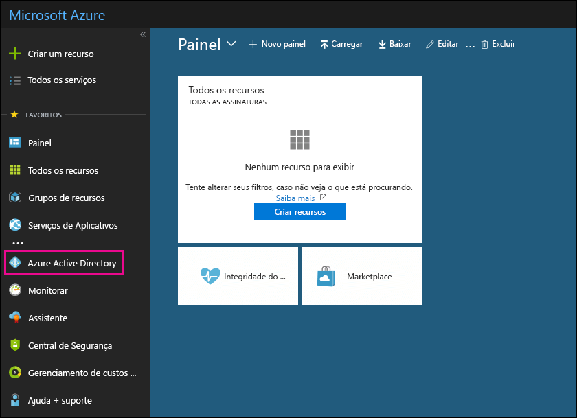

# Usar sua assinatura gratuita do Azure Active Directory no Office 365Use your free Azure Active Directory subscription in Office 365

Se sua organização tiver uma assinatura paga do Office 365, do Microsoft Dynamics CRM Online, do Enterprise Mobility Suite ou de outros serviços da Microsoft, você terá uma assinatura gratuita do Microsoft Azure Active Directory. Você e outros administradores podem usar o Azure AD para criar e gerenciar contas de usuário e grupo. Para usar o Azure AD, basta ir ao portal do Azure e entrar usando sua conta do Office 365.If your organization has a paid subscription to Office 365, Microsoft Dynamics CRM Online, Enterprise Mobility Suite, or other Microsoft services, you have a free subscription to Microsoft Azure Active Directory. You and other admins can use Azure AD to create and manage user and group accounts. To use Azure AD, just go to the Azure portal and sign in using your Office 365 account.
  
## Antes de começarBefore you begin

Use uma sessão de navegação privada (não uma sessão normal) para acessar o portal do Azure (na etapa 1 abaixo) porque isso impedirá que a credencial com a qual você fez logon passe para o Azure. Para abrir uma sessão de Navegação InPrivate no Internet Explorer ou uma sessão de navegação particular no Mozilla FireFox, pressione Ctrl+Shift+P. Para abrir uma sessão de navegação anônima no Google Chrome (chamada de janela anônima), pressione Ctrl+Shift+N.Use a private browsing session (not a regular session) to access the Azure portal (in step 1 below) because this will prevent the credential that you are currently logged on with from being passed to Azure. To open an InPrivate Browsing session in Internet Explorer or a Private Browsing session in Mozilla FireFox, just press CTRL+SHIFT+P. To open a private browsing session in Google Chrome (called an incognito window), press CTRL+SHIFT+N.
  
## Acessar o Azure Active DirectoryAccess Azure Active Directory

1. Vá para [portal.azure.com](https://portal.azure.com) e entre com sua conta corporativa ou de estudante do Office 365.Go to [portal.azure.com](https://portal.azure.com) and sign in with your Office 365 work or student account. 
    
2. No painel de navegação à esquerda no portal do Azure, clique em **Azure Active Directory**.In the left navigation pane in the Azure portal, click **Azure Active Directory**.
    
    
  
    O Centro de administração do **Azure Active Directory** aparece.The **Azure Active Directory** admin center is displayed. 
    
## Mais informaçõesMore information

- Você também pode acessar o centro de administração **do Azure Active Directory** no centro de administração do Microsoft 365.You can also access the **Azure Active Directory** admin center from the Microsoft 365 admin center. no painel de navegação esquerdo do centro de administração do Microsoft 365, clique em central de **administração** \> do **Azure Active Directory**.In the left navigation pane of the Microsoft 365 admin center , click **Admin centers** \> **Azure Active Directory**.
    
- Confira informações sobre como gerenciar usuários e grupos e realizar outras tarefas de gerenciamento do diretório em [Gerenciar seu diretório do Azure AD](https://docs.microsoft.com/azure/active-directory/active-directory-administer).For information about managing users and groups and performing other directory management tasks, see [Manage your Azure AD directory](https://docs.microsoft.com/azure/active-directory/active-directory-administer).
