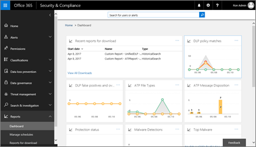
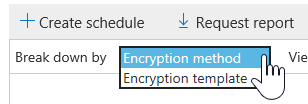
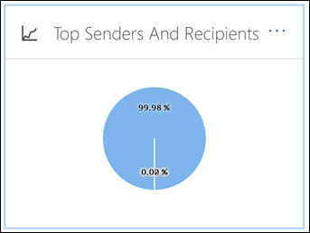

# Exibir relatórios de segurança de email no &amp; centro de conformidade de segurançaView email security reports in the Security &amp; Compliance Center

Vários relatórios estão disponíveis no [centro de conformidade de &amp; segurança](https://protection.office.com) para ajudá-lo a ver como os recursos de segurança de email, como os recursos antispam, Antimalware e de criptografia no Office 365 estão protegendo sua organização.A variety of reports are available in the [Security &amp; Compliance Center](https://protection.office.com) to help you see how email security features, such as anti-spam, anti-malware, and encryption features in Office 365 are protecting your organization. Se você tiver as [permissões necessárias](#what-permissions-are-needed-to-view-these-reports), poderá exibir esses relatórios no centro de conformidade &amp; de segurança acessando o **painel**de **relatórios** \> .If you have the [necessary permissions](#what-permissions-are-needed-to-view-these-reports), you can view these reports in the Security &amp; Compliance Center by going to **Reports** \> **Dashboard**.
  

  
Os relatórios de segurança de email incluem o seguinte:Your email security reports include the following:
- [Relatório de criptografia](#encryption-report) (Novo!)[Encryption report](#encryption-report) (NEW!)
- [Relatório de status de proteção contra ameaçasThreat Protection Status report](#threat-protection-status-report) 
- [Relatório de detecções de malwareMalware Detections report](#malware-detections-report) 
- [Relatório de malware superiorTop Malware report](#top-malware-report)
- [Relatório de principais remetentes e destinatáriosTop Senders and Recipients report](#top-senders-and-recipients-report)
- [Relatório de detecções falsasSpoof Detections report](#spoof-detections-report)
- [Relatório de detecções de spamSpam Detections report](#spam-detections-report)
- [Relatório de email enviado e recebidoSent and received email report](#sent-and-received-email-report)
- [Relatório de mensagens relatadas pelo usuárioUser-reported messages report](#user-reported-messages-report)
    
## Relatório de criptografiaEncryption report

(**Novo!**) O **relatório de criptografia** mostra informações sobre as mensagens de email que foram criptografadas, seja por meio das políticas da sua organização ou por meio de controles de usuário final.(**NEW!**) The **Encryption report** shows information about email messages that were encrypted, either through your organization's policies, or through end-user controls. A equipe de segurança da sua organização pode usar informações neste relatório para identificar padrões e aplicar proativamente ou ajustar políticas para mensagens de email confidenciais.Your organization's security team can use information in this report to identify patterns and proactively apply or adjust policies for sensitive email messages.

Para exibir esse relatório, no centro de conformidade & de segurança, vá para **relatório de criptografia**de **painel** \> de **relatórios** \> .To view this report, in the Security & Compliance Center, go to **Reports** \> **Dashboard** \> **Encryption report**.

 

Quando o relatório for aberto pela primeira vez, você verá dados sobre os métodos de criptografia usados em mensagens de email dos últimos sete (7) dias.When the report first opens, you'll see data about encryption methods used on email messages for the past seven (7) days. Você pode alterar o intervalo de datas e os detalhes que são exibidos no relatório clicando em **filtros** no canto superior direito da tela.You can change the date range and the details that are displayed in the report by clicking **Filters** in the upper right corner of the screen.

   

Você também pode usar o menu **dividir por** para exibir dados por modelo de criptografia (ou método).You can also use the **Break down by** menu to view data by encryption template (or method).

E você pode usar o menu **exibir dados por** para alterar o modo de exibição para ver as contagens de mensagens criptografadas para os cinco domínios de destinatários principais.And, you can use the **View data by** menu to change the view to see counts of encrypted messages to the top five recipient domains.

Com a flexibilidade do novo relatório de criptografia, você pode exibir tendências e tomar as ações apropriadas.With the flexibility of the new Encryption report, you can view trends and take appropriate actions. Por exemplo, se você vir um grande número de mensagens de email criptografadas por usuários, talvez queira adicionar uma política de criptografia para automatizar a criptografia para determinados casos de uso.For example, if you see a high number of email messages encrypted by users, you might want to add an encryption policy to automate encryption for certain use cases. (Para obter ajuda com isso, consulte [definir regras de fluxo de email para criptografar mensagens de email no Office 365](define-mail-flow-rules-to-encrypt-email.md).) Como outro exemplo, se você tiver vários modelos de criptografia disponíveis, mas nenhum estiver usando, você poderá explorar se os usuários precisam de treinamento para esse recurso.(To get help with that, see [Define mail flow rules to encrypt email messages in Office 365](define-mail-flow-rules-to-encrypt-email.md).) As another example, if you have a number of encryption templates available but no one is using them, you might explore whether users need training for that feature. 

Use este relatório permite que a equipe de segurança e conformidade da sua organização monitore a forma como a criptografia de mensagens está sendo usada e se as ações serão necessárias.Use this report enables your organization's security and compliance team to monitor how message encryption is being used, and whether further actions are needed. Para saber mais sobre criptografia, confira [criptografia de email no Office 365](email-encryption.md).To learn more about encryption, see [Email encryption in Office 365](email-encryption.md).

## Relatório de status de proteção contra ameaçasThreat Protection Status report

O relatório de **status de proteção contra ameaças** é um relatório inteligente que mostra emails mal-intencionados que foram detectados e bloqueados pela proteção do Exchange Online.The **Threat Protection Status** report is a smart report that shows malicious email that was detected and blocked by Exchange Online Protection. Este relatório é útil para exibir emails identificados como malware ou uma tentativa de phishing ao longo do tempo (até 90 dias) e permite que administradores de segurança identifiquem tendências ou determinem se as políticas precisam de ajustes.This report is useful for viewing email identified as malware or a phishing attempt over time (up to 90 days), and it enables security administrators to identify trends or determine whether policies need adjustments.

> [!NOTE]
> Um relatório de status de proteção contra ameaças está disponível para clientes que tenham o [Office 365 ATP](office-365-atp.md) ou o [Exchange Online Protection](eop/exchange-online-protection-eop.md) (EOP); no entanto, as informações exibidas no relatório de status de proteção contra ameaças para clientes ATP provavelmente conterão dados diferentes do que os clientes do EOP podem ver.A Threat Protection Status report is available to customers who have either [Office 365 ATP](office-365-atp.md) or [Exchange Online Protection](eop/exchange-online-protection-eop.md) (EOP); however, the information that is displayed in the Threat Protection Status report for ATP customers will likely contain different data than what EOP customers might see. Por exemplo, os clientes do EOP podem exibir informações sobre malware detectado no email, mas não informações sobre [arquivos mal-intencionados detectados no SharePoint Online, no onedrive ou no Microsoft Teams](atp-for-spo-odb-and-teams.md), um recurso específico de ATP.For example, EOP customers can view information about malware detected in email, but not information about [malicious files detected in SharePoint Online, OneDrive, or Microsoft Teams](atp-for-spo-odb-and-teams.md), an ATP-specific capability. ([Saiba mais sobre os relatórios de ATP](view-reports-for-atp.md).)([Learn more about ATP reports](view-reports-for-atp.md).)
  
Para exibir esse relatório, no [centro de &amp; conformidade de segurança](https://protection.office.com), vá para o **painel** \> **relatórios** \> **status de proteção contra ameaças**.To view this report, in the [Security &amp; Compliance Center](https://protection.office.com), go to **Reports** \> **Dashboard** \> **Threat Protection Status**.
  

  
Quando você abre o relatório de status de proteção contra ameaças pela primeira vez, o relatório mostra os dados dos últimos sete dias por padrão; no entanto, você pode clicar em **filtros** e alterar o intervalo de datas para até 90 dias de detalhes.When you first open the Threat Protection Status report, the report shows data for the past seven days by default; however, you can click **Filters** and change the date range for up to 90 days of detail. (Se estiver usando uma assinatura de avaliação, você poderá estar limitado a 30 dias de dados.)(If you are using a trial subscription, you might be limited to 30 days' of data.)

Este relatório é útil para ver a eficácia e o impacto dos recursos de [proteção do Exchange Online](eop/eop-features.md)da sua organização e para tendência de longo prazo.This report is useful for viewing the effectiveness and impact of your organization's [Exchange Online Protection features](eop/eop-features.md), and for longer-term trending. 
  

  
Você também pode escolher se deseja exibir dados para emails identificados como mal-intencionados, emails identificados como tentativas de phishing ou emails identificados como contendo malware.You can also choose whether to view data for email identified as malicious, email identified as a phishing attempts, or email identified as containing malware.
  

  
## Relatório de detecções de malwareMalware Detections report

O relatório de **detecções de malware** mostra quantas mensagens de entrada e saída foram detectadas como contendo malware para sua organização.The **Malware Detections** report shows how many incoming and outgoing messages were detected as containing malware for your organization. 
  
Para exibir esse relatório, no [centro de &amp; conformidade de segurança](https://protection.office.com), vá para relatórios de **malware**de **painel** \> de **relatórios** \> .To view this report, in the [Security &amp; Compliance Center](https://protection.office.com), go to **Reports** \> **Dashboard** \> **Malware Detections**.
  

  
Semelhante a outros relatórios, como o [relatório de status de proteção contra ameaças](#threat-protection-status-report), o relatório exibe dados dos últimos sete dias por padrão.Similar to other reports, like the [Threat Protection Status report](#threat-protection-status-report), the report displays data for the past seven days by default. No entanto, você pode escolher **filtros** para alterar o intervalo de datas.However, you can choose **Filters** to change the date range. 
  
## Relatório de malware superiorTop Malware report

O relatório de **malware superior** mostra os vários tipos de malware detectados pelo [Exchange Online](eop/eop-features.md).The **Top Malware** report shows the various kinds of malware that was detected by [Exchange Online](eop/eop-features.md). 
  
Para exibir esse relatório, no [centro de &amp; conformidade de segurança](https://protection.office.com), vá para **painel** \> de **relatórios** \> de **malware superior**.To view this report, in the [Security &amp; Compliance Center](https://protection.office.com), go to **Reports** \> **Dashboard** \> **Top Malware**.
  

  
Ao passar o mouse sobre uma fatia no gráfico de pizza, você pode ver o nome de um tipo de malware e quantas mensagens foram detectadas como tendo esse malware.When you hover over a wedge in the pie chart, you can see the name of a kind of malware and how many messages were detected as having that malware.
  
Clique (ou toque) no relatório para abri-lo em uma nova janela do navegador, onde você pode obter uma visão mais detalhada do relatório.Click (or tap) the report to open it in a new browser window, where you can get a more detailed view of the report.
  

  
Abaixo do gráfico, você verá uma lista de malware detectado e quantas mensagens foram detectadas como tendo esse malware.Below the chart, you'll see a list of detected malware and how many messages were detected as having that malware.
  
## Relatório de principais remetentes e destinatáriosTop Senders and Recipients report

O relatório de **remetentes e destinatários principais** é um gráfico de pizza mostrando seus principais remetentes de email.The **Top Senders and Recipients** report is a pie chart showing your top email senders. 
  
Para exibir esse relatório, no [centro de &amp; conformidade de segurança](https://protection.office.com), vá para **painel** \> de **relatórios** \> **principais remetentes e destinatários**.To view this report, in the [Security &amp; Compliance Center](https://protection.office.com), go to **Reports** \> **Dashboard** \> **Top Senders and Recipients**.
  

  
Ao passar o mouse sobre uma fatia no gráfico de pizza, você pode ver uma contagem de mensagens enviadas ou recebidas.When you hover over a wedge in the pie chart, you can see a count of messages sent or received.
  
Clique (ou toque) no relatório para abri-lo em uma nova janela do navegador, onde você pode obter uma visão mais detalhada do relatório.Click (or tap) the report to open it in a new browser window, where you can get a more detailed view of the report.
  
Use a lista **Mostrar dados de** para escolher se deseja exibir dados para os remetentes principais, receptores, destinatários de spam e destinatários de malware.Use the **Show data for** list to choose whether to view data for top senders, receivers, spam recipients, and malware recipients. Você também pode ver quem recebeu o malware que foi detectado pela [proteção do Exchange Online](eop/exchange-online-protection-overview.md).You can also see who received malware that was detected by [Exchange Online Protection](eop/exchange-online-protection-overview.md). 
  

  
Abaixo do gráfico, você verá quem os principais remetentes ou destinatários de emails foram, juntamente com uma contagem de mensagens enviadas ou recebidas pelo período de tempo especificado.Below the chart, you'll see who the top email senders or recipients were, along with a count of messages sent or received for the given time period.
  
## Relatório de detecções falsasSpoof Detections report

O relatório de **detecções falsas** mostra quantas mensagens de email de falsificação foram detectadas, e dessas, quais foram consideradas "boas" (emails falsos realizados por motivos de negócios legítimos).The **Spoof Detections** report shows how many spoof mail messages were detected, and of those, which ones were considered "good" (spoof mail done for legitimate business reasons). 
  
Para exibir esse relatório, no [centro de &amp; conformidade de segurança](https://protection.office.com), vá para **relatório** \> de falsificação de **painel** \> \*\*\*\* de relatórios.To view this report, in the [Security &amp; Compliance Center](https://protection.office.com), go to **Reports** \> **Dashboard** \> **Spoof Mail**.
  

  
Ao passar o mouse sobre um dia no gráfico, você pode ver quantas mensagens de email de falsificação foram recebidas.When you hover over a day in the chart, you can see how many spoof mail messages came through.
  
Clique (ou toque) no relatório para abri-lo em uma nova janela do navegador, onde você pode obter uma visão mais detalhada do relatório.Click (or tap) the report to open it in a new browser window, where you can get a more detailed view of the report. Para saber mais sobre proteção contra falsificação, confira [proteção contra falsificação no Office 365](anti-spoofing-protection.md).To learn more about anti-spoof protection, see [Anti-spoofing protection in Office 365](anti-spoofing-protection.md).
  
## Relatório de detecções de spamSpam Detections report

O relatório **detecções de spam** mostra todo o conteúdo de spam bloqueado pelo Exchange Online.The **Spam Detections** report shows all the spam content blocked by Exchange Online. 
  
Para exibir esse relatório, no [centro de &amp; conformidade de segurança](https://protection.office.com), vá para relatórios de **spam**de **painel** \> de **relatórios** \> .To view this report, in the [Security &amp; Compliance Center](https://protection.office.com), go to **Reports** \> **Dashboard** \> **Spam Detections**.
  

  
Ao passar o mouse sobre um dia no gráfico, você pode ver quantos itens foram bloqueados naquele dia, bem como os itens são categorizados.When you hover over a day in the chart, you can see how many items were blocked that day, as well as how those items are categorized. Por exemplo, você pode ver quantas mensagens de spam foram filtradas e quantos itens vieram de um endereço IP bloqueado.For example, you can see how many spam messages were filtered, and how many items came from a blocked Internet Protocol (IP) address.
  
Clique (ou toque) no relatório para abri-lo em uma nova janela do navegador, onde você pode obter uma visão mais detalhada do relatório.Click (or tap) the report to open it in a new browser window, where you can get a more detailed view of the report.
  

  
Abaixo do gráfico, você verá uma lista de itens de spam que foram detectados.Below the chart, you'll see a list of spam items that were detected. Selecione um item para exibir informações adicionais, como se o item de spam era de entrada ou de saída, sua ID de mensagem e seu destinatário.Select an item to view additional information, such as whether the spam item was inbound or outbound, its message ID, and its recipient. Para saber mais sobre proteção antispam, confira [proteção antispam de email do Office 365](anti-spam-protection.md).To learn more about anti-spam protection, see [Office 365 email anti-spam protection](anti-spam-protection.md).
  
## Relatório de email enviado e recebidoSent and received email report

O relatório de **email enviado e recebido** é um relatório inteligente que mostra informações sobre emails de entrada e saída, incluindo detecções de spam, malware e email identificados como "bom".The **Sent and received email** report is a smart report that shows information about incoming and outgoing email, including spam detections, malware, and email identified as "good." 
  
Para exibir esse relatório, no [centro de &amp; conformidade de segurança](https://protection.office.com), vá para o **painel** \> **relatórios** \> **enviado e recebido emails**.To view this report, in the [Security &amp; Compliance Center](https://protection.office.com), go to **Reports** \> **Dashboard** \> **Sent and received email**.
  

  
Ao passar o mouse sobre um dia no gráfico, você pode ver quantas mensagens vieram e como essas mensagens são categorizadas.When you hover over a day in the chart, you can see how many messages came in, and how those messages are categorized. Por exemplo, você pode ver quantas mensagens foram detectadas como contendo malware e quantas foram identificadas como spam.For example, you can see how many messages were detected as containing malware, and how many were identified as spam.
  
Clique (ou toque) no relatório para abri-lo em uma nova janela do navegador, onde você pode obter uma visão mais detalhada do relatório.Click (or tap) the report to open it in a new browser window, where you can get a more detailed view of the report.
  
Você pode usar a lista **dividir por** para exibir informações por tipo ou por direção (entrada e saída).You can use the **Break down by** list to view information by type or by direction (incoming and outgoing). 
  

  
Abaixo do gráfico, você verá uma lista de categorias de email, como **GoodMail**, **SpamContentFiltered**e assim por diante.Below the chart, you'll see a list of email categories, such as **GoodMail**, **SpamContentFiltered**, and so on. Selecione uma categoria para exibir informações adicionais, como ações que foram tomadas para malware e se o email era de entrada ou saída.Select a category to view additional information, such as actions that were taken for malware, and whether email was incoming or outgoing.
  

Para saber mais sobre inteligência de email, consulte [inteligência de fluxo de emails no Office 365](mail-flow-intelligence-in-office-365.md).To learn more about email intelligence, see [Mail flow intelligence in Office 365](mail-flow-intelligence-in-office-365.md).
  
## Relatório de mensagens relatadas pelo usuárioUser-reported messages report

O relatório de mensagens relatadas pelo **usuário** mostra informações sobre as mensagens de email que os usuários relataram como lixo eletrônico, tentativas de phishing ou emails de boa qualidade usando o suplemento de [mensagem de relatório](enable-the-report-message-add-in.md).The **User-reported messages** report shows information about email messages that users have reported as junk, phishing attempts, or good mail by using the [Report Message add-in](enable-the-report-message-add-in.md).
  
Os detalhes estão disponíveis para cada mensagem, incluindo o motivo da entrega, como uma exceção de política de spam ou uma regra de fluxo de email configurada para sua organização.Details are available for each message, including the delivery reason, such a spam policy exception or mail flow rule configured for your organization. Para exibir detalhes, selecione um item na lista relatórios do usuário e, em seguida, exiba as informações nas guias **Resumo** e **detalhes** .To view details, select an item in the user-reports list, and then view the information on the **Summary** and **Details** tabs. 
  

  
Para exibir esse relatório, no [centro de &amp; conformidade de segurança](https://protection.office.com), siga um destes procedimentos:To view this report, in the [Security &amp; Compliance Center](https://protection.office.com), do one of the following:
  
- Vá para o **painel** \> **Gerenciamento** \> **de ameaças mensagens relatadas pelo usuário**.Go to **Threat management** \> **Dashboard** \> **User-reported messages**.
    
- Vá para **Gerenciamento** \> de ameaças **revise** \> **mensagens relatadas pelo usuário**.Go to **Threat management** \> **Review** \> **User-reported messages**.
    

  
> [!IMPORTANT]
> Para que o relatório de mensagens relatadas pelo usuário funcione corretamente, o **log de auditoria deve estar ativado** para o seu ambiente do Office 365.In order for the User-reported messages report to work correctly, **audit logging must be turned on** for your Office 365 environment. Isso geralmente é feito por alguém que tenha a função de logs de auditoria atribuída no Exchange Online.This is typically done by someone who has the Audit Logs role assigned in Exchange Online. Para obter mais informações, consulte [Ativar ou desativar a pesquisa de log de auditoria do Office 365](turn-audit-log-search-on-or-off.md).For more information, see [Turn Office 365 audit log search on or off](turn-audit-log-search-on-or-off.md). 
  
## Quais permissões são necessárias para exibir esses relatórios?What permissions are needed to view these reports?

Para exibir e usar os relatórios descritos neste artigo, **você deve ter uma função apropriada atribuída para o centro de conformidade de segurança &amp; e o centro de administração do Exchange**.In order to view and use the reports described in this article, **you must have an appropriate role assigned for both the Security &amp; Compliance Center and the Exchange admin center**.

- Para o centro &amp; de conformidade de segurança, você deve ter uma das seguintes funções atribuídas:For the Security &amp; Compliance Center, you must have one of the following roles assigned:
    - Gerenciamento de OrganizaçãoOrganization Management
    - Administrador de segurança (isso pode ser atribuído no centro de administração do Azure Active[https://aad.portal.azure.com](https://aad.portal.azure.com)Directory ()Security Administrator (this can be assigned in the Azure Active Directory admin center ([https://aad.portal.azure.com](https://aad.portal.azure.com))
    - Leitor de segurançaSecurity Reader

- Para o Exchange Online, você deve ter uma das seguintes funções atribuídas no centro de administração do Exchange[https://outlook.office365.com/ecp](https://outlook.office365.com/ecp)() ou com cmdlets do PowerShell (Confira [Exchange Online PowerShell](https://docs.microsoft.com/powershell/exchange/exchange-online/exchange-online-powershell?view=exchange-ps)):For Exchange Online, you must have one of the following roles assigned in either the Exchange admin center ([https://outlook.office365.com/ecp](https://outlook.office365.com/ecp)) or with PowerShell cmdlets (See [Exchange Online PowerShell](https://docs.microsoft.com/powershell/exchange/exchange-online/exchange-online-powershell?view=exchange-ps)):
    - Gerenciamento de OrganizaçãoOrganization Management
    - Gerenciamento de Organização Somente para ExibiçãoView-only Organization Management
    - Função de Destinatários Somente para ExibiçãoView-Only Recipients role
    - Gerenciamento de ConformidadeCompliance Management

Para saber mais, confira os seguintes recursos:To learn more, see the following resources:

- [Permissions in the Office 365 Security &amp; Compliance CenterPermissions in the Office 365 Security &amp; Compliance Center](permissions-in-the-security-and-compliance-center.md)

- [Permissões de recursos no Exchange OnlineFeature permissions in Exchange Online](https://docs.microsoft.com/exchange/permissions-exo/feature-permissions)
   
   
## E se os relatórios não estiverem mostrando dados?What if the reports aren't showing data?

Se você não estiver vendo dados nos seus relatórios, verifique se as suas políticas estão configuradas corretamente.If you are not seeing data in your reports, double-check that your policies are set up correctly. Para saber mais, confira [proteger contra ameaças no Office 365](protect-against-threats.md).To learn more, see [Protect against threats in Office 365](protect-against-threats.md).
  
## Tópicos relacionadosRelated topics

[Proteção anti-spam de emails do Office 365Office 365 Email Anti-Spam Protection](anti-spam-protection.md)
  
[Relatórios e insights no centro de conformidade de &amp; segurança do Office 365Reports and insights in the Office 365 Security &amp; Compliance Center](reports-and-insights-in-security-and-compliance.md)
  
[Criar um cronograma para um relatório no centro de &amp; conformidade de segurançaCreate a schedule for a report in the Security &amp; Compliance Center](create-a-schedule-for-a-report.md)
  
[Configurar e baixar um relatório personalizado no centro de conformidade &amp; de segurançaSet up and download a custom report in the Security &amp; Compliance Center](set-up-and-download-a-custom-report.md)
  

