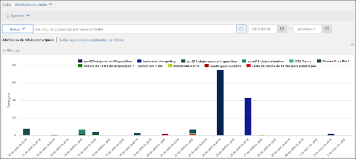
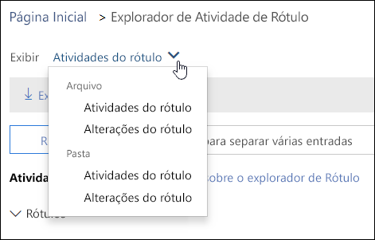
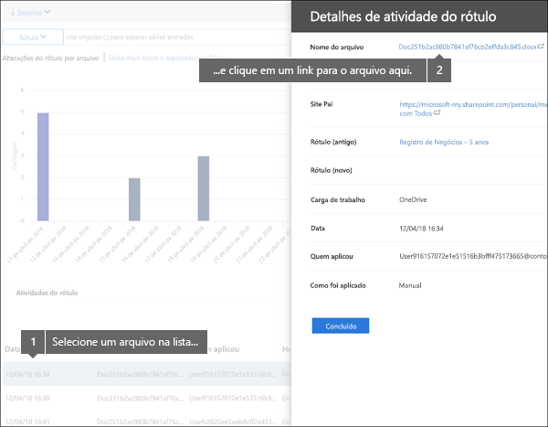
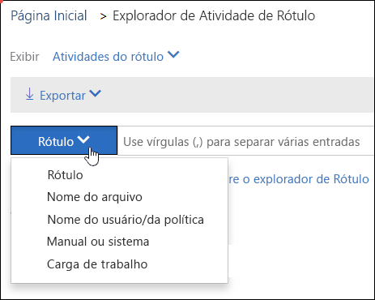

# Exibir a atividade de rótulos de documentosView label activity for documents

Depois de criar seus rótulos, você deverá verificar se eles estão sendo aplicados a conteúdo conforme o desejado. Com o Explorador de Atividade de Rótulo no Centro de Conformidade e Segurança do Office 365, você pode rapidamente pesquisar e exibir a atividade de rótulo para todo o conteúdo no SharePoint e no OneDrive for Business nos últimos 30 dias. Esses são dados em tempo real que fornecem uma exibição clara para o que está acontecendo no seu locatário.After you create your labels, you'll want to verify that they're being applied to content as you intended. With the Label Activity Explorer in the Office 365 Security &amp; Compliance Center, you can quickly search and view label activity for all content across SharePoint and OneDrive for Business over the past 30 days. This is real-time data that gives you a clear view into what's happening in your tenant.
  
Por exemplo, com o Explorador de Atividade do Rótulo, você pode:For example, with the Label Activity Explorer, you can:
  
- Exibir o número de vezes que cada rótulo foi aplicado em cada dia (até 30 dias).View how many times each label was applied on each day (up to 30 days).
    
- Ver quem rotulou exatamente o arquivo em qual data, juntamente com um link para o site onde reside esse arquivo.See who labeled exactly which file on which date, along with a link to the site where that file resides.
    
- Exiba quais arquivos tiveram os rótulos alterados ou removidos, quais são os rótulos antigos e os novos e quem fez a alteração.View which files had labels changed or removed, what the old and new labels are, and who made the change.
    
- Filtre os dados para ver todas as atividades de rótulo para um rótulo, arquivo ou usuário específico. Você também pode filtrar a atividade de rótulo por local (SharePoint ou OneDrive for Business) e se o rótulo foi aplicado manual ou automaticamente.Filter the data to see all the label activity for a specific label, file, or user. You can also filter label activity by location (SharePoint or OneDrive for Business) and whether the label was applied manually or auto-applied.
    
- Exiba a atividade de rótulo para pastas, além de documentos individuais. Em breve haverá a capacidade para mostrar quantos arquivos dentro dessa pasta foram rotulados como resultado da rotulação da pasta.View label activity for folders as well as individual documents. Coming soon is the ability to show how many files inside that folder got labeled as a result of the folder getting labeled.
    
Você pode encontrar o Explorador de Atividade de Rótulo no &amp;Centro de Conformidade e Segurança > **Governança de dados** > **Explorador de Atividade de Etiqueta**.You can find the Label Activity Explorer in the Security  Compliance Center  Data governance  Label Activity Explorer.
  
Observe que no Gerenciador de Atividade de Rótulo exige uma assinatura do Office 365 Enterprise E5.Note that the Label Activity Explorer requires an Office 365 Enterprise E5 subscription.
  

  
## Exibir atividades de rótulo para arquivos ou pastasView label activities for files or folders

Na parte superior do Gerenciador de Atividade de Rótulo, você pode optar por exibir as atividades para arquivos ou pastas. Observe que as atividades de pasta incluem apenas a pasta propriamente dita, não os arquivos dentro da pasta.At the top of the Label Activity Explorer, you can choose whether to view activities for files or folders. Note that folder activity includes only the folder itself, not the files inside the folder.
  
Talvez você queira ver a atividade do rótulo para pastas porque, se rotular uma pasta, todos os arquivos nessa pasta também recebem esse rótulo (exceto os arquivos que tiveram um rótulo explicitamente aplicado a eles). Portanto, rotular pastas pode afetar vários arquivos. Para saber mais, confira [Aplicar um rótulo de retenção padrão a todo o conteúdo em uma biblioteca, pasta ou conjunto de documentos do SharePoint](labels.md#applying-a-default-retention-label-to-all-content-in-a-sharepoint-library-folder-or-document-set).You might want to see label activity for folders because if you label a folder, all files inside that folder also get that label (except for files that have had a label applied explicitly to them). Therefore, labeling folders might affect a significant number of files. For more information, see [Applying a default retention label to all content in a SharePoint library, folder, or document set](labels.md#applying-a-default-retention-label-to-all-content-in-a-sharepoint-library-folder-or-document-set).
  

  
### Atividades do rótuloLabel activities

 As **Atividades do rótulo** incluem todas as ações do rótulo: **adicionar**, **remover**, ou **alterar** um rótulo. Você pode usar esse modo de exibição para obter uma visão completa de a quantos arquivos cada rótulo é aplicado por dia.**Label activities** includes all label actions: **adding**, **removing**, or **changing** a label. You can use this view to get a comprehensive look at how many files each label's been applied to per day. 
  
### Alterações do rótuloLabel changes

 As **Alterações do rótulo** incluem as ações de possivelmente perigosas de **remover** ou **alterar** um rótulo. Você pode usar esse modo de exibição para ver rapidamente essas ações arriscadas e o usuário as que executou. Na lista atividades abaixo do gráfico, selecione um arquivo e, em seguida, clique em um link para esse arquivo no painel de detalhes à direita.**Label changes** includes the potentially risky actions of **removing** or **changing** a label. You can use this view to quickly see such risky actions and the user who performed them. In the activity list below the chart, you can select a file, and then click a link to that file in the details pane on the right. 
  

  
## Filtrar atividade do rótuloFilter label activity

Você pode filtrar rapidamente os dados para ver todas as atividades de rótulo para um rótulo, arquivo ou usuário específico. Você também pode filtrar a atividade de rótulo por local (SharePoint ou OneDrive for Business) e se o rótulo foi aplicado manual ou automaticamente.You can quickly filter the data to see all the label activity for a specific label, file, or user. You can also filter label activity by location (SharePoint or OneDrive for Business) and whether the label was applied manually or auto-applied.
  

  

