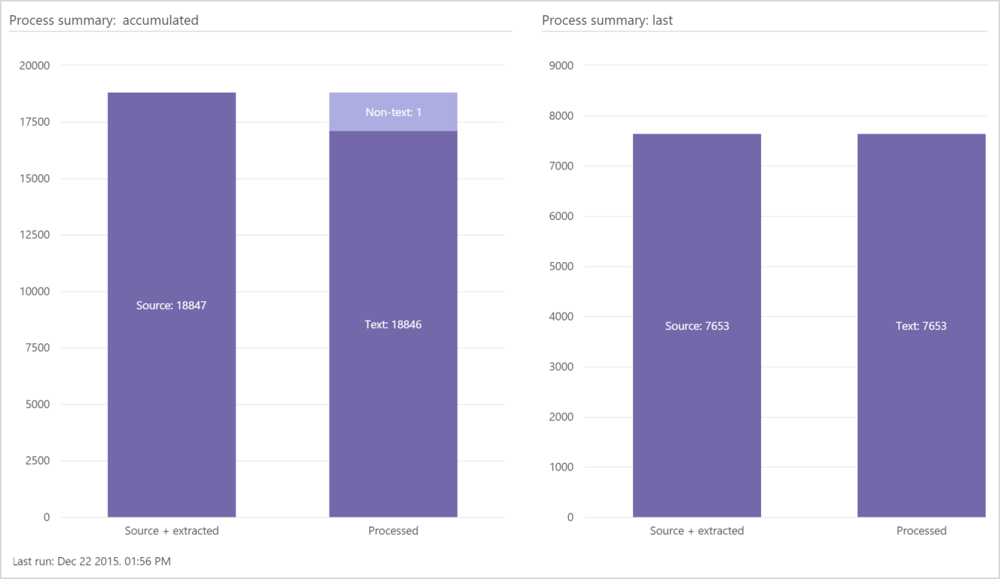
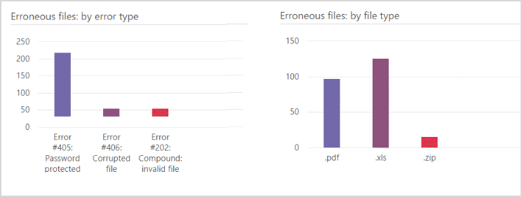

# Exibir os resultados do Módulo de processo na Descoberta Eletrônica Avançada do Office 365

Após **Preparar** \> **processo** é iniciado, você pode exibir o andamento e os resultados. 
  
> [!NOTE]
> EDiscovery Avançado requer um Office 365 E3 com o complemento de conformidade avançadas ou uma assinatura E5 para sua organização. Se você não tiver que plano e quiser tentar eDiscovery avançado, você pode [inscrever-se para uma avaliação do Office 365 Enterprise E5](https://go.microsoft.com/fwlink/p/?LinkID=698279). 
  
## Status do processo de tarefa

Em **Prepare** \> **processo** \> **resultados**, a página mostra o status atual (se o processo está sendo executado) ou o último status de tarefa de status do processo conforme mostrado no exemplo a seguir.
  

  
As tarefas exibidas podem variar dependendo das opções de processo selecionadas. 
  
- **Inventário**: eDiscovery avançado itera todos os arquivos selecionados para o processo e executa a coleta de dados básica.
    
- **Calcular assinaturas**: calcula as assinaturas digitais de MD5.
    
- **Extração de compostos**: extrai interna ou contida arquivos recursivamente de arquivos compostos (por exemplo, PST, ZIP, MSG). Arquivos extraídos são armazenados na pasta maiusculas do caso.
    
- **Banco de dados de sincronização**: o processo de banco de dados interno.
    
- **Cópia de arquivo**: arquivos do processo de cópias. Essa tarefa é sempre exibida, mesmo quando a opção avançada de arquivos de cópia está selecionada.
    
- **Extração de texto**: quando houver arquivos nativos, eDiscovery avançado extrai o texto desses arquivos usando DTSearch. O texto extraído desses arquivos é armazenado como arquivos de texto na pasta maiusculas.
    
- **Atualizando metadados**: processa os metadados carregado. 
    
- **Finalizing**: processamento interno que finaliza dados de carregado arquivos maiusculas (por exemplo, identificar os arquivos de erro e êxito). 
    
Status da tarefa: exibido após a conclusão da tarefa. Enquanto estiver executando tarefas, a duração da execução é exibida.
  
> [!NOTE]
> Tarefas concluídas também podem incluir totais de arquivos que o processamento foi concluído ou arquivos com erros. 
  
> [!TIP]
> "Cancelar" fornece uma opção de reversão para interromper a execução do processo e, em seguida, reverta para a população de dados anterior ou salvo dados processados. Reversão limpa processados todos os dados. Se você não quiser que os dados processados a ser perdida (por exemplo, você planeja recarregar esses arquivos), selecione o "Cancelar" opção nessa janela escolher não fazer a reversão. 
  
## Resumo do processo

Em Prepare \> processo \> resultados \> Process resumo, uma divisão dos resultados de arquivo carregado é exibida de acordo com os resultados de processamento e de erro do arquivo bem-sucedida.
  
Os painéis apresentam uma exibição gráfica das estatísticas de arquivo importado, da seguinte maneira:
  
- Todos os arquivos no caso de d: **Resumo de processo se acumulam**.
    
- **Resumo do processo de última**: arquivos carregados da última sessão, ou ação. 
    
- **Famílias últimos**: informações de família no caso (se houver).
    
- Se os arquivos de **propagação** foram adicionados, o número de arquivos de propagação é listado por problema que foi definido para os arquivos. 
    
    Se a marcação dos arquivos de **propagação** falhou, que também é citado. 
    
- Se o arquivos **previamente marcado** foram adicionados, o número de arquivos previamente marcados estará listado por problema que foi definido para os arquivos. 
    
    Se a marcação de arquivos **previamente marcado** falhou, que também é citado. 
    

  
## Resumo de processo acumulados e último gráficos

Barra à esquerda inclui fonte + arquivos extraídos: qual é a todos os arquivos encontrados. 
  
À direita da barra, processadas, inclui:
  
- Arquivos com erros de carregamento
    
- Arquivos carregados com êxito, que podem incluir: 
    
  - **Existente**: arquivos que foram carregados antes e agora são carregados novamente (incluindo duplicatas).
    
  - **Texto**: arquivos exclusivos com texto.
    
  - **Não-texto**: esvaziar arquivos de texto, arquivos de texto nativo vazio, arquivos de texto não nativos. 
    
  - **Duplicar**o s: duplicata arquivos com texto.
    
## Últimos erros do processo

Em Prepare \> processo \> resultados \> últimos erros de processo, detalhes dos erros na última ação realizada ou sessão são exibidos.
  

  
## Confira também

[Descoberta Eletrônica Avançada do Office 365](office-365-advanced-ediscovery.md)
  
[Executando o módulo de processo e carregamento de dados](run-the-process-module-and-load-data-in-advanced-ediscovery.md)

