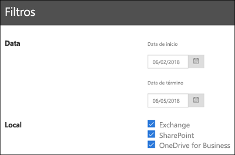

# Exibir os relatórios de governança de dados

Depois de criar rótulos, convém verificar se eles estão sendo aplicados ao conteúdo como pretendido. Com os relatórios de governança de dados no Centro de Conformidade e Segurança do Office 365, você pode exibir rapidamente:
  
- **Cinco principais rótulos** Este relatório mostra a contagem dos cinco principais rótulos aplicados ao conteúdo. Clique neste relatório para exibir uma lista de todos os rótulos aplicados recentemente ao conteúdo. Você pode ver a contagem, o local, como foi aplicado, as ações de retenção, se é um registro e o tipo de disposição do rótulo. 
    
- **Aplicação manual versus automática** Este relatório mostra a contagem de todo o conteúdo rotulado manualmente ou automaticamente e a porcentagem de conteúdo que foi rotulada manualmente versus a que foi rotulada automaticamente. 
    
- **Marcação de registros** Este relatório mostra a contagem de todo o conteúdo marcado como registro ou não registro e a porcentagem de conteúdo marcado como registro versus o que foi marcado como não registro. 
    
- **Tendências de rótulo nos últimos 90 dias** Este relatório mostra a contagem e a localização de todos os rótulos aplicados nos últimos 90 dias. 
    
Todos esses relatórios mostram conteúdo rotulado do Exchange, SharePoint e OneDrive for Business.
  
Você pode encontrar esses relatórios no Centro de Conformidade e Segurança \> **Governança de Dados** \> **Painel**.
  

  
Você pode filtrar os relatórios de governança de dados por data (até 90 dias) e o local (Exchange, SharePoint e OneDrive for Business). Os dados mais recentes podem levar até 24 horas para aparecer nos relatórios.
  

  

